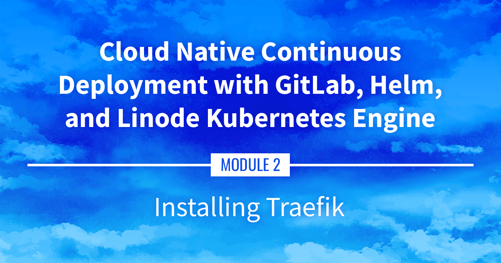

**Watch the Presentation:** Register to [watch this workshop](https://event.on24.com/wcc/r/3121133/FC5BC89B210FAAFFC957E6204E55A228?partnerref=website_docs), free of charge.

**Slide deck:** [Cloud Native Continuous Deployment with GitLab, Helm, and Linode Kubernetes Engine: Installing Traefik (Slide #143)](https://2021-03-lke.container.training/#143)

## Installing Traefik

Traefik is a popular *Ingress Controller* for Kubernetes, which manages external access to the cluster and provides load balancing functionality. This section discusses installing Traefik, configuring an Ingress within our YAML file, and testing things out.

## Navigate the Series

- **Main guide:** [Building a Continuous Deployment Pipeline Using LKE](/docs/guides/build-a-cd-pipeline-with-lke/)
- **Previous section:** [Part 8: ExternalDNS](/docs/guides/build-a-cd-pipeline-with-lke-part-8/)
- **Next section:** [Part 10: Installing metrics-server](/docs/guides/build-a-cd-pipeline-with-lke-part-10/)

## Presentation Text

*Here's a copy of the text contained within this section of the presentation. A link to the source file can be found within each slide of the presentation. Some formatting may have been changed.*

### Installing Traefik

- Traefik is going to be our Ingress Controller
- Let's install it with a Helm chart, in its own namespace
- First, let's add the Traefik chart repository:

      helm repo add traefik https://helm.traefik.io/traefik

- Then, install the chart:

      helm upgrade --install traefik traefik/traefik \ --create-namespace --namespace traefik \ --set "ports.websecure.tls.enabled=true"

(that option that we added enables HTTPS, it will be useful later!)

### Testing Traefik

- Let's create an Ingress resource!
- If we're using Kubernetes 1.20 or later, we can simply do this:

      kubectl create ingress web \--rule=ingress-is-fun.cloudnative.party/*=web:80
  (make sure to update and use your own domain)

- Check that the Ingress was correctly created:

      kubectl get ingress
      kubectl describe ingress

If we're using Kubernetes 1.19 or earlier, we'll need some YAML

### Creating an Ingress with YAML

- This is how we do it with YAML:

      kubectl apply -f- <<EOF
      apiVersion: networking.k8s.io/v1
      kind: Ingress
      metadata:
        name: web
      spec:
        rules:
        - host: ingress-is-fun.cloudnative.party
          http:
            paths:
            - path: /
              backend:
                serviceName: web
                servicePort: 80
      EOF

### Ingress versions...

- Note how we used the latest `v1` Ingress version on the previous YAML, as the `vibeta1` api version has been deprecated.

### Does it work?

- Try to connect to the Ingress host name (in my example, http://ingress-is-fun.cloudnative.party/)
- Normally, it doesn't work (yet) 🤔
- Let's look at `kubectl get ingress` again
- ExternalDNS is trying to create records mapping HOSTS to ADDRESS
- But the ADDRESS field is currently empty!
- We need to tell Traefik to fill that ADDRESS field

### Reconfiguring Traefik

- There is a "magic" flag to tell Traefik to update the address status field
- Let's update our Traefik install:

      helm upgrade --install traefik traefik/traefik \
          --create-namespace --namespace traefik \
          --set "ports.websecure.tls.enabled=true" \
          --set "providers.kubernetesIngress.publishedService.enabled=true"

### Checking what we did

- Check the output of `kubectl get ingress` (there should be an address now)
- Check the logs of ExternalDNS (there should be a mention of the new DNS record)
- Try again to connect to the HTTP address (now it should work)
- Note that some of these operations might take a minute or two (be patient!)

