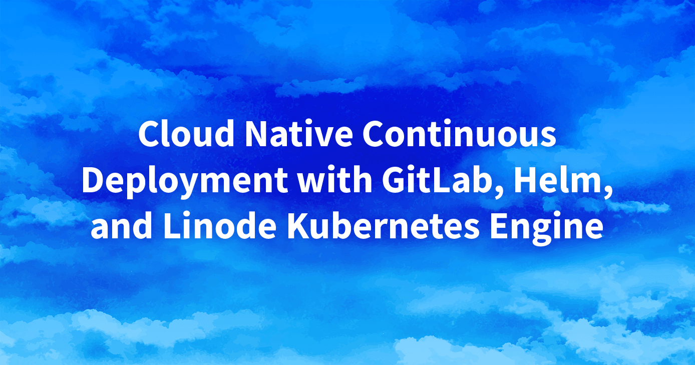

This series covers creating a continuous deployment pipeline within the cloud using [LKE (Linode Kubernetes Engine)](https://www.linode.com/products/kubernetes/), [GitLab](https://about.gitlab.com/), and [Helm](https://helm.sh/). Together, these products enable applications to run on a managed Kubernetes cluster (LKE) and allow for the continuous deployment of updates directly to a staging environment or a production environment.

## Presentation

**Watch the Presentation:** Register to [watch this workshop](https://event.on24.com/wcc/r/3121133/FC5BC89B210FAAFFC957E6204E55A228?partnerref=website_docs), free of charge.

**Slide deck:** [Cloud Native Continuous Deployment with GitLab, Helm, and Linode Kubernetes Engine](https://2021-03-lke.container.training/)

The contents of the slides and the material discussed within is available within the repository [jpetazzo/container.training](https://github.com/jpetazzo/container.training/tree/2021-03-lke). It was created by Jérôme Petazzoni (contact on [Twitter](https://twitter.com/jpetazzo)) and adapted into this series of guides.

## Guides

The material is split into 2 modules and 13 sections. Each of these sections has an accompanying guide, which displays the text shown within that portion of the presentation.

### Module 1

- [Part 1: Get Ready](/docs/guides/build-a-cd-pipeline-with-lke-part-1/): The goal of this series is to set up a continuous deployment pipeline for a Kubernetes app on a Kubernetes cluster. This introduction will cover what to expect, the prerequisite knowledge, and the software/components that are required.
- [Part 2: Our Sample Application](/docs/guides/build-a-cd-pipeline-with-lke-part-2/): The sample application that we'll be running on Kubernetes is called DockerCoins (a demo app just for this presentation). This part of the guide will take a look at DockerCoins and examine how it works and how the app can be run locally.
- [Part 3: Deploying our LKE Cluster](/docs/guides/build-a-cd-pipeline-with-lke-part-3/): Managed Kubernetes clusters are much easier to setup and maintain than self-managed Kubernetes clusters. This portion goes over setting up a cluster using the Linode Kubernetes Engine (LKE) through the Cloud Manager and the Linode CLI.
- [Part 4: Quick Kubernetes Review](/docs/guides/build-a-cd-pipeline-with-lke-part-4/): This is an optional part of the series that provides an introduction to Kubernetes. It covers deploying a simple application on Kubernetes and each of the components that are involved (such as pods, controllers, and services).
- [Part 5: Accessing Internal Services](/docs/guides/build-a-cd-pipeline-with-lke-part-5/): It's often necessary to access internal services within the Kubernetes cluster without exposing them to the public internet. This part covers accomplishing that through using both `kubectl proxy` and `kubectl port-forward`.
- [Part 6: DNS, Ingress, Metrics](/docs/guides/build-a-cd-pipeline-with-lke-part-6/): The next steps are to access our sample application over a domain (DNS), setup an Ingress Controller as a load balancer / reverse proxy, and collect metrics on our application. This guide provides an overview of these components, though each of them will be discussed in greater detail within Module 2.

### Module 2

- [Part 7: Managing Stacks with Helm](/docs/guides/build-a-cd-pipeline-with-lke-part-7/): Helm allows us to locate, distribute, and manage software for Kubernetes. This part covers what Helm is, how we'll use it, and the differences between Helm 2 and Helm 3. It also discuses Helm Charts and we find, install, and manage them.
- [Part 8: External DNS](/docs/guides/build-a-cd-pipeline-with-lke-part-8/): ExternalDNS is a tool that automatically manages external DNS records from within the Kubernetes cluster. It can integrate with Linode DNS (among other providers). This portion of the series has us installing ExternalDNS using Helm and testing its functionality.
- [Part 9: Installing Traefik](/docs/guides/build-a-cd-pipeline-with-lke-part-9/): Traefik is a popular *Ingress Controller* for Kubernetes, which manages external access to the cluster and provides load balancing functionality. This section discusses installing Traefik, configuring an Ingress within our YAML file, and testing things out.
- [Part 10: Installing metrics-server](/docs/guides/build-a-cd-pipeline-with-lke-part-10/): Now that there is an application running on our Kubernetes cluster, the next step is to collect metrics on the resources being used. This part covers installing and using metrics-server as a basic data collection tool.
- [Part 11: Prometheus and Grafana](/docs/guides/build-a-cd-pipeline-with-lke-part-11/): Going beyond metrics-server, this guide goes over collecting more advanced metrics using Prometheus (to capture the metrics) and Grafana (to display the metrics within a user interface).
- [Part 12: cert-manager](/docs/guides/build-a-cd-pipeline-with-lke-part-12/): The cert-manager tool can be used to manage SSL/TLS certificates for applications within a Kubernetes cluster. This part goes over installing and configuring cert-manager, as well as obtaining your first SSL certificate through Let's Encrypt.
- [Part 13: CI/CD with GitLab](/docs/guides/build-a-cd-pipeline-with-lke-part-13/): To complete this series, we'll now build a continuous deployment pipeline using a self-hosted GitLab instance (running within our Kubernetes cluster). GitLab is a `git` platform and, once its set up, we'll be able to push code changes to both a staging environment and a production environment.