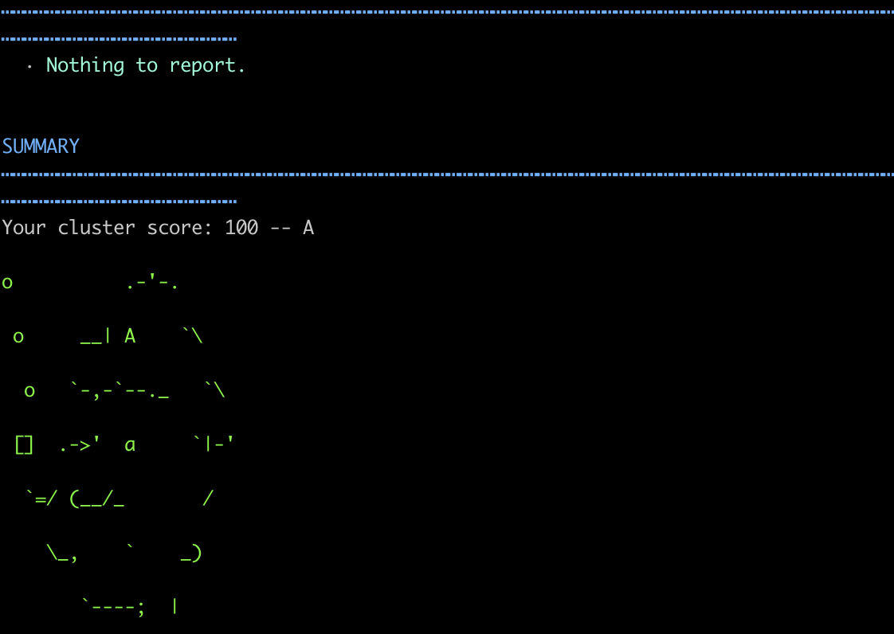

Popeye is an open-source read-only tool used from wherever a user has `kubectl` installed, using Kubernetes contexts defined in a `kubeconfig` file. It automatically scans live Kubernetes clusters, and provides an administrator with insight into issues that could arise from deployed resources and configurations. Once installed, Popeye will perform a comprehensive scan of your current configuration based on your active kubeconfig whenever entering the following command:

```command
popeye
```

Popeye can either be installed using the package manager [Homebrew](https://brew.sh/), by using the binary from a tarball hosted on [Popeye's github](https://github.com/derailed/popeye/releases) or by installing [via source](https://github.com/derailed/popeye#installation). While any option is possible, this guide will only focus on the installation process using Brew on both **Ubuntu 20.04** and **Mac OSx**, and through Linux binary tarballs. That being said, the installation process should be largely the same across Operating Systems and Distros, and steps can be adjusted as needed.

## Install Popeye

### Install Popeye Using Homebrew

#### Ubuntu 20.04

Before proceeding with installation on **Ubuntu 20.04 LTS**, ensure that all of the following commands are entered as a [limited sudo user](/docs/products/compute/compute-instances/guides/set-up-and-secure/#add-a-limited-user-account) with access to a fully configured [LKE](https://www.linode.com/products/kubernetes/) or [Kubernetes](/docs/guides/kubernetes/) cluster with [kubectl](/docs/products/compute/kubernetes/guides/kubectl/) fully installed and using your kubeconfig configuration file. A good way to test this is to ensure that you can see all nodes in your cluster when entering the following command:

```command
kubectl get nodes
```

The following steps will complete the installation of popeye on Ubuntu **20.04 LTS**:

1. Ensure that your system is up to date:

    ```command
    sudo apt update && sudo apt upgrade
    ```

1. Install all packages that Homebrew relies on:

    ```command
    sudo apt install build-essential
    ```

1. Install Homebrew via the installation script, agreeing to all prompts:

    ```command
    /bin/bash -c "$(curl -fsSL https://raw.githubusercontent.com/Homebrew/install/HEAD/install.sh)"
    ```

1. Once the installation script is complete, you will need to add Homebrew to your PATH. Enter the following commands, replacing `username` with your current username:

    ```command
    echo 'eval "$(/home/linuxbrew/.linuxbrew/bin/brew shellenv)"' >> /home/username/.profile
    eval "$(/home/linuxbrew/.linuxbrew/bin/brew shellenv)"
    ```

1. Use Homebrew to install Popeye:

    ```command
    brew install derailed/popeye/popeye
    ```

#### MacOS

The following steps will complete the installation of Popeye on **MacOS**:

1. Ensure that you can see all nodes in your cluster when entering the following command:

    ```command
    kubectl get nodes
    ```

1. Install Homebrew via the installation script if it has not been already, agreeing to all prompts:

    ```command
    /bin/bash -c "$(curl -fsSL https://raw.githubusercontent.com/Homebrew/install/HEAD/install.sh)"
    ```

1. Install Popeye:

    ```command
    brew install derailed/popeye/popeye
    ```

### Install Popeye using Linux Binary Tarballs

Before proceeding with the installation of popeye, ensure that [wget](/docs/guides/how-to-use-wget/) is installed on your system. Once installed proceed with the following steps:

1. Determine the architecture of your system:

    ```command
    uname -m
    ```

1. Using `wget`, download the Linux tarball for Popeye [matching the latest release and your architecture](https://github.com/derailed/popeye/releases), in this case `v0.9.8` as the latest release and `x86_64` as the architecture:

    ```command
    wget https://github.com/derailed/popeye/releases/download/v0.9.8/popeye_Linux_x86_64.tar.gz
    ```

1. Unpack the tarball:

    ```command
    tar -xzf popeye_Linux_x86_64.tar.gz
    ```

## Using Popeye

Once installed via brew, Popeye can perform a scan by entering the following command:

```command
popeye
```

If installed from the tarball, navigate to your home directory and enter the following command to allow the program to execute:

```command
./popeye
```

Once entered, Popeye will begin scanning against your current cluster context immediately, outputting a list of information pertaining to your configuration, and a letter grade once the script completes. Review the information that's outputted, and remediate issues as they arise to help ensure the migration process can be completed successfully. In a near perfect configuration, you should receive a letter grade of `A`.

