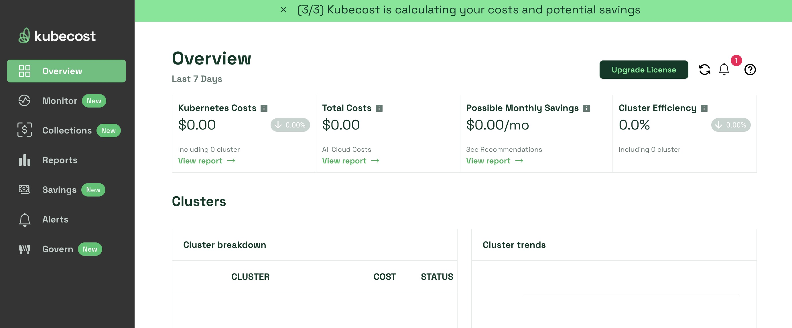
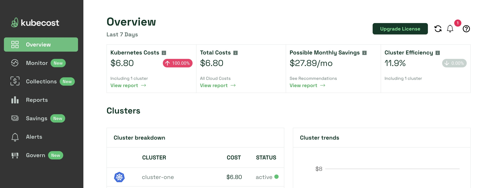

[Kubecost](https://www.kubecost.com/) is a real-time, automated cost monitoring tool for Kubernetes deployments. Kubecost automates Kubernetes cost accounting for internal and external expenses and performs usage analysis on those costs to determine how you can save money. Kubecost alerts can be configured for when predicted costs go out of scope, and governance can be implemented to help limit excesses. It's governance feature also helps predict potential outages through Kubernetes monitoring so that remediation can occur proactively rather than reactively.

This guide discusses Kubecost's features and functionality, suggests steps for creating a cost monitoring plan, reviews installation steps, shows you how to access the Kubecost dashboard, and explores other Kubernetes cost monitoring alternatives.

## Advantages of Kubecost

Understanding cost is essential to ensuring return on investment (ROI). Many organizations calculate the costs for their Kubernetes containers manually, but manual calculations can become time-consuming and error-prone, especially when a large amount of containers or other assetts need to be counted. Additionally, manual calculations do not lend themselves well to various forms of analysis to determine where and when it is possible to produce cost savings without losing functionality.

Setting Kubernetes costs across multiple clusters using a single view or API endpoint is essential to understanding ROI and keeping costs controlled. Kubecost automates these tasks and can help you efficiently optimize cost vs. resources by breaking down costs by deployment, service, namespace label, team, individual application, and more.

See below for more specifics on various Kubecost features and functionality.

### Cost Monitoring

When working with both on-premise and external cloud services, some costs can become hidden or difficult to ascertain. In addition, cost monitoring must include both in-cluster and out-of-cluster costs, which can make calculations complex. When performing analysis, Kubecost uses metrics such as:

-   Time in running state
-   Consumed and reserved resources
-   Resource price
-   Hardware usage for:
    -   CPU
    -   GPU
    -   Memory
    -   Storage

These metrics act as inputs for calculations that provide cost categories like montly cluster cost, deployment resource cost, and cost efficiency.

### Optimization Insights

To keep costs within predicted ranges, Kubecost makes dynamic optimization recommendations that focus on cost reduction without an associated sacrifice in performance. This process considers the prioritization of key infrastructure and application elements.

### Alerts and Governance

Kubecost provides alerts and governance features that detect cost overruns before they become a problem, including emails detailing anomalous spending patterns, as well as reports that track trends and efficiency across namespaces.

## Kubernetes Monitoring vs. Cost Control

When looking to keep Kubernetes costs under control, having a good **monitoring** technique in place is a required first step. Monitoring deployments is an essential part of determining precisely what problems a Kubernetes configuration may have. Costs and resource usage constantly fluctuate and are why automation tools are essential to understanding what is happening with a setup in real-time. According to [Survey Surfaces Recent Spike in Kubernetes Costs](https://cloudnativenow.com/editorial-calendar/container-kubernetes-management/survey-surfaces-recent-spike-in-kubernetes-costs/) only 38% of IT professionals can accurately predict monthly Kubernetes costs within a 10% margin of error.

**Cost control** is the step that follows monitoring; once you have insight through monitoring, you can optimize your setup to provide maximun performance at the lowest cost in time, resources, and money. Because monitoring environments are dynamic, so are cost control environments. Since it is unlikely that optimizing a configuration once will result in always receiving the best performance, monitoring and optimization should occur often.

Having propper tooling in place is essential when looking to optimize. Some tools (like Kubecost) can make suggestions on where and how to optimize, and some can provide automation that put unused application components to sleep or even delete them when they are no longer needed.

Human knowledge is also an important factor in keeping costs low. Knowing organizational direction and special events can help those maintaining a system anticipate needs that the software can’t know in advance. By planning for requirements as part of monitoring and control, you further reduce costs.

## Creating a Cost Monitoring Plan

A quality monitoring plan takes the functionality of your tools, business needs, and human resources into account. By creating a monitoring plan for your Kubernetes setup, you can achieve more consistent results. Consider the following factors when developing your monitoring plan:

-   Use labels and tags extensively to ensure you can break container components down to basic levels.
-   Create a list of metrics to monitor, such as:
    -   Active pods
    -   Resources
    -   Container-native
    -   Application-specific
-   Go beyond basic CPU, memory, and similar metrics to include running processes, file access traffic, network traffic, and other details.
-   Capture historical data to make it possible to predict future performance based on expected conditions at specific times.
-   Ensure that the user experience remains unaffected by monitoring and cost-control efforts.

A key component of a good monitoring plan is alerting. When configuring alerts, keep these priciples in mind:

-   Engineer alerts so that the overall number of alerts are kept at a minimum.
-   Consider when and who should receive alerts.
-   Keep non-critical alerts in-house so that employees don’t disregard a critical alert when it arrives during off-hours.
-   Include essential details with the alert so that the cause can be determined.
-   Suggest one or more actions for the alert.

## Installing and Configuring Kubecost

### Prerequisites

The following components must be in place prior to installing Kubecost:

-   An active Kubernetes cluster running Kubernetes version 1.20 or higher. To deploy a cluster using Linode Kubernetes Engine (LKE), see [Linode Kubernetes Engine - Get Started](/docs/products/compute/kubernetes/get-started/). The example below uses a 4 GB plan for each cluster node.
-   `kubectl` installed and configured to communicate with your cluster from your local system.
-   Your cluster's [kubeconfig file](/docs/products/compute/kubernetes/get-started/#access-and-download-your-kubeconfig) downloaded and saved to your `$KUBECONFIG` environment variable. Replace  with the path to, and name of, your cluster's kubeconfig .yaml file:
    ```command
    export KUBECONFIG=
    ```
-   The [Helm](https://helm.sh/) Kubernetes package manager installed and configured on your local system. See our guide on [Installing Apps on Kubernetes with Helm 3](/docs/guides/how-to-install-apps-on-kubernetes-with-helm-3/).

### Installing Kubecost


As of January 2024, the below instructions install Kubecost 2.0. See Kubecost's blog for more information about Kubecost 2.0, including functionality improvements: [Introducting Kubecost 2.0](https://blog.kubecost.com/blog/introducing-kubecost-2.0/)


1.  Navigate to the [Kubecost registration page](https://www.kubecost.com/install#show-instructions) and complete the sign up steps by entering your email address. Once complete, you are brought to a page with Kubecost installation instructions. The instructions include a `kubecostToken` that is required for installation.

1.  Using Helm, install Kubecost with the command below. Replace  with the token provided in the installation instructions:

    ```command
    helm install kubecost cost-analyzer \
    --repo https://kubecost.github.io/cost-analyzer/ \
    --namespace kubecost --create-namespace \
    --set kubecostToken=""
    ```

1.  Enable port-forwarding using kubectl:

    ```command
    kubectl port-forward --namespace kubecost deployment/kubecost-cost-analyzer 9090
    ```

    To remove the need for port forwarding in the future, you can publish `:9090` as a secure endpoint on your cluster.

1.  In a web browser, navigate to `localhost:9090` to access the Kubecost reporting dashboard:

    

1.  Kubecost may take up to 25 minutes to gather metrics and other monitoring data. After some time, you can see Kubecost automatically start to track and report on your cluster's activity:

    

See [Kubecost's documentation](https://docs.kubecost.com/) for more information on configuring and using Kubecost.

## Alternatives

There are multiple options for cost monitoring solutions, and you may find that a Kubecost alternative better meets a specific need like automatic pod or node scaling. Different products offer specialized functionality that you may find essential for your particular application.

### OpenCost

[OpenCost](https://www.opencost.io/) is an open source, vendor-agnostic tool that measures and allocates cloud infrastructure. While not as feature-rich as Kubecost overall, OpenCost uses the Kubecost engine as a starting point and focuses on specific functions. Both products provide continuous Kubernetes monitoring, with OpenCost focusing on in-cluster CPU, RAM, load balancers, storage, and persistent volumes. One example of a task OpenCost performs well is writing custom Prometheus queries to gain cost insights.

OpenCost is free, whereas Kubecost offers freemium and paid versions with differing levels of functionality. OpenCost provides a command line interface (CLI) that access cost allocation metrics in Kubernetes through the [OpenCost API](https://www.opencost.io/docs/integrations/api-examples). This level of access makes it possible to perform quick queries and automate some tasks that might require additional time to perform using Kubecost. As of the writing of this guide, OpenCost is at the [Cloud Native Computing Foundation (CNCF)](https://www.cncf.io/) sandbox project maturity level.

### Loft

[Loft](https://loft.sh/) is a control platform that operates on top of existing Kubernetes clusters. Loft works with individual clusters rather than residing outside clusters or relying on a separate engine. Loft has relatively simple setup and configuration processes, though it doesn't have the level of overview provided by Kubecost or OpenCost.

Two areas of note for Loft are the sleep mode feature and accounting functionality. With sleep mode, Loft automatically puts idle namespaces to sleep based on user-provided critera, rather than only informing you of a cost problem. It also has the ability to delete namespances when they become old and unused. Accounting in Loft allows you to set quotas for each user, account, and team. Loft also offers enterprise-grade, multi-tenant access control, security, and fully automated tenant isolation, among other features.

### CAST AI

[CAST AI](https://cast.ai/) is another Kubernetes cost optimization platform similar to Kubecost. Both products have similar feature sets but manage information differently. Below are some common features between the two tools:

-   Cost allocation based on Kubernetes concepts such as namespace, deployment, service, and workload
-   Cost data organization at the microservice level
-   Custom, user-defined cost allocation tags
-   Automatic alerting for anomalous cost trends

See below for some examples of how each application manages data differently:

-   Cast.ai allows you to view and manage multi-cloud infrastructure costs in one place.
-   Kubecost supports multi-tenant cost monitoring.
-   Cast.ai emphasizes detailed CPU costs in its Savings estimator.
-   Kubecost connects real-time in-cluster costs (such as CPU, RAM, storage, and network) and out-of-cluster spending from cloud services.

The two products also have similar limitations. For example, neither product combines all cloud costs in a single place or offers a dedicated [FinOps resource](https://www.finops.org/resources/).
