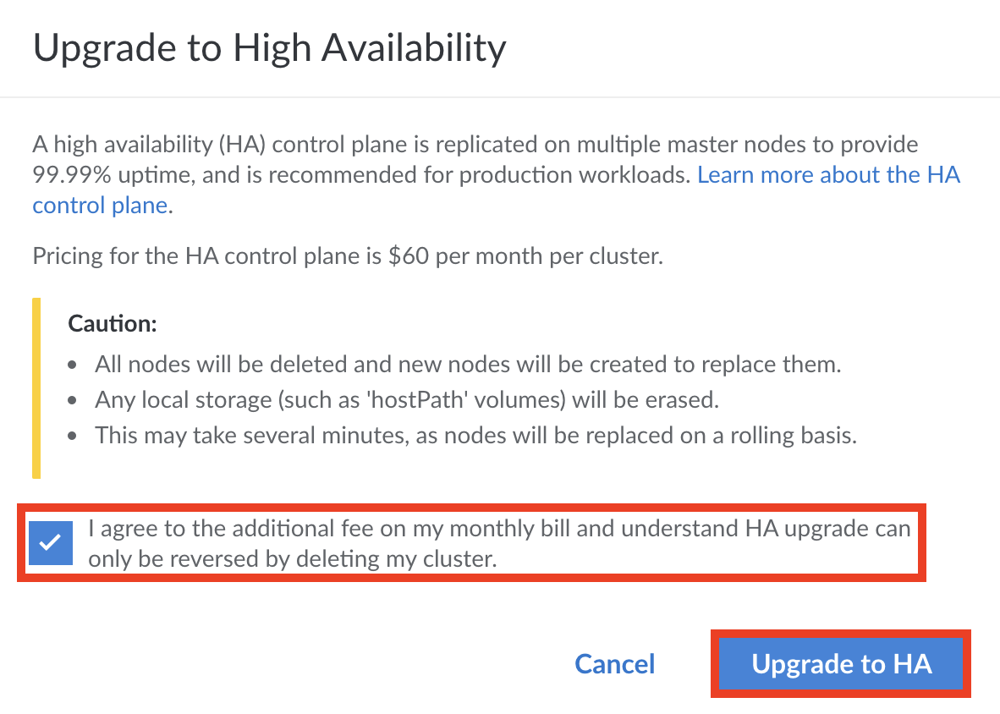


This guide uses Linode Kubernetes Engine (LKE) to deploy a managed Kubernetes cluster. For more information on Kubernetes key concepts, see our [Beginner's Guide to Kubernetes](/docs/guides/beginners-guide-to-kubernetes/)


The Linode Kubernetes Engine (LKE) is a fully-managed container orchestration engine for deploying and managing containerized applications and workloads. LKE combines Linode’s ease of use and [simple pricing](https://www.linode.com/pricing/) with the infrastructure efficiency of Kubernetes. When you deploy an LKE cluster, you receive a Kubernetes Master at no additional cost; you only pay for the Linodes (worker nodes), [NodeBalancers](/docs/guides/getting-started-with-nodebalancers/) (load balancers), and [Block Storage Volumes](/docs/products/storage/block-storage/). Your LKE cluster’s Master node runs the Kubernetes control plane processes – including the API, scheduler, and resource controllers.

**Additional LKE features:**

- **etcd Backups**: A snapshot of your cluster's metadata is backed up continuously, so your cluster is automatically restored in the event of a failure.
- **High Availability**: All of your control plane components are monitored and automatically recover if they fail.
- **Kubernetes Dashboard** All LKE installations include access to a [Kubernetes Dashboard installation](/docs/guides/using-the-kubernetes-dashboard-on-lke/#accessing-the-cluster-dashboard).

## In this Guide

In this guide you will learn:

 - [How to create a Kubernetes cluster using the Linode Kubernetes Engine.](#create-an-lke-cluster)

 - [How to modify your cluster.](#modify-a-cluster-s-node-pools)

 - [How to delete your cluster.](#delete-a-cluster)

 - [Next Steps after deploying your cluster.](#next-steps)


This guide's example instructions create several billable resources on your Linode account. If you do not want to keep using the example cluster that you create, be sure to [remove it](#delete-a-cluster) when you have finished the guide.

If you remove the resources afterward, you will only be billed for the hour(s) that the resources were present on your account.


## Before You Begin

### Install kubectl

You need to install the kubectl client to your computer before proceeding. Follow the steps corresponding to your computer's operating system.



## Create an LKE Cluster



## Connect to your LKE Cluster with kubectl

After you've created your LKE cluster using the Cloud Manager, you can begin interacting with and managing your cluster. You connect to it using the kubectl client on your computer. To configure kubectl, download your cluster's *kubeconfig* file.

### Access and Download your kubeconfig



### Persist the Kubeconfig Context

If you create a new terminal window, it does not have access to the context that you specified using the previous instructions. This context information can be made persistent between new terminals by setting the [`KUBECONFIG` environment variable](https://kubernetes.io/docs/tasks/access-application-cluster/configure-access-multiple-clusters/#set-the-kubeconfig-environment-variable) in your shell's configuration file.


If you are using Windows, review the [official Kubernetes documentation](https://kubernetes.io/docs/tasks/access-application-cluster/configure-access-multiple-clusters/#set-the-kubeconfig-environment-variable) for how to persist your context.


These instructions persist the context for users of the Bash terminal. They are similar for users of other terminals:

1.  Navigate to the `$HOME/.kube` directory:

        cd $HOME/.kube

1.  Create a directory called `configs` within `$HOME/.kube`. You can use this directory to store your kubeconfig files.

        mkdir configs

1. Copy your `kubeconfig.yaml` file to the `$HOME/.kube/configs` directory.

        cp ~/Downloads/kubeconfig.yaml $HOME/.kube/configs/kubeconfig.yaml

    
Alter the above line with the location of the Downloads folder on your computer.

Optionally, you can give the copied file a different name to help distinguish it from other files in the `configs` directory.


1.  Open up your Bash profile (e.g. `~/.bash_profile`) in the text editor of your choice and add your configuration file to the `$KUBECONFIG` PATH variable.

    If an `export KUBECONFIG` line is already present in the file, append to the end of this line as follows; if it is not present, add this line to the end of your file:

        export KUBECONFIG=$KUBECONFIG:$HOME/.kube/config:$HOME/.kube/configs/kubeconfig.yaml

1.  Close your terminal window and open a new window to receive the changes to the `$KUBECONFIG` variable.

1.  Use the `config get-contexts` command for `kubectl` to view the available cluster contexts:

        kubectl config get-contexts

    You should see output similar to the following:

    
CURRENT   NAME          CLUSTER   AUTHINFO        NAMESPACE
*         lke1234-ctx   lke1234   lke1234-admin   default


1.  If your context is not already selected, (denoted by an asterisk in the `current` column), switch to this context using the `config use-context` command. Supply the full name of the cluster (including the authorized user and the cluster):

        kubectl config use-context lke1234-ctx

    You should see output like the following:

    
Switched to context "lke1234-ctx".


1.  You are now ready to interact with your cluster using `kubectl`. You can test the ability to interact with the cluster by retrieving a list of Pods. Use the `get pods` command with the `-A` flag to see all pods running across all namespaces:

        kubectl get pods -A

    You should see output like the following:

    
NAMESPACE     NAME                                      READY   STATUS    RESTARTS   AGE
kube-system   calico-kube-controllers-dc6cb64cb-4gqf4   1/1     Running   0          11d
kube-system   calico-node-bx2bj                         1/1     Running   0          11d
kube-system   calico-node-fg29m                         1/1     Running   0          11d
kube-system   calico-node-qvvxj                         1/1     Running   0          11d
kube-system   calico-node-xzvpr                         1/1     Running   0          11d
kube-system   coredns-6955765f44-r8b79                  1/1     Running   0          11d
kube-system   coredns-6955765f44-xr5wb                  1/1     Running   0          11d
kube-system   csi-linode-controller-0                   3/3     Running   0          11d
kube-system   csi-linode-node-75lts                     2/2     Running   0          11d
kube-system   csi-linode-node-9qbbh                     2/2     Running   0          11d
kube-system   csi-linode-node-d7bvc                     2/2     Running   0          11d
kube-system   csi-linode-node-h4r6b                     2/2     Running   0          11d
kube-system   kube-proxy-7nk8t                          1/1     Running   0          11d
kube-system   kube-proxy-cq6jk                          1/1     Running   0          11d
kube-system   kube-proxy-gz4dc                          1/1     Running   0          11d
kube-system   kube-proxy-qcjg9                          1/1     Running   0          11d


## Modify a Cluster's Node Pools

You can use the Linode Cloud Manager to modify a cluster's existing node pools by adding or removing nodes. You can also recycle your node pools to replace all of their nodes with new ones that are upgraded to the most recent patch of your cluster's Kubernetes version, or remove entire node pools from your cluster. For an automated approach, you can also enable cluster autoscaling to automatically create and remove nodes as needed. This section covers completing those tasks. For any other changes to your LKE cluster, you should use kubectl.

### Access your Cluster's Details Page

1.  Click the **Kubernetes** link in the sidebar. The Kubernetes listing page appears and you see all of your clusters listed.

    

1.  Click the cluster that you wish to modify. The Kubernetes cluster's details page appears.

    

### Adding a Node Pool



### Edit or Remove Existing Node Pools



### Configure Cluster Autoscaling

In Kubernetes, Cluster Auto-Scaling refers to a method by which Kubernetes users can configure their cluster to automatically scale the amount of physical nodes available in a node pool up and down as hardware needs of the pool increase or decrease. While this feature can be applied manually using resources like the [Cluster Autoscaler](https://github.com/kubernetes/autoscaler/tree/master/cluster-autoscaler) provided by Kubernetes, LKE can manage this potential automatically through the Cloud Manager and the [Linode API](/docs/api/linode-kubernetes-engine-lke/).

The LKE autoscaler will only apply changes when the following conditions are met:

- If Pods are unschedulable due to an insufficient number of Nodes in the Node Pool, the auto-scaler will increase the number of physical nodes to the amount required.

- If Pods are able to be scheduled on less Nodes than are currently available in the Node Pool, Nodes will be drained and removed automatically. Pods on drained nodes will be immediately rescheduled on pre-existing nodes. The Node Pool will be decreased to match only the needs of the current workload.

LKE Autoscaling is configured for individual Node Pools directly through the Linode Cloud Manager.

1. To Enable cluster autoscaling, access the [cluster's details page](/docs/kubernetes/deploy-and-manage-a-cluster-with-linode-kubernetes-engine-a-tutorial/#access-your-clusters-details-page).

1. Click the **Autoscale Pool** option at the top-left of each entry in the **Node Pools** section. The Autoscaling menu will appear.

    

1. If the Autoscaler is currently disabled, select the autoscaler switch toggle to turn the feature on.

    

1. Once the Autoscaler is enabled, the **Minimum** `Min` and **Maximum** `Max` fields can be set. Both the Minimum and Maximum field can be any number between `1` and `99`. Each number represents a set of Nodes in the node pool. A minimum of `10` for example, will allow for no less than ten nodes in the node pool, while a maximum of `10` will allow for no more than ten nodes in the node pool.

1. Select the `Save Changes` button to complete the process, and officially activate the autoscaling feature.


The LKE Autoscaler will not automatically increase or decrease the size of the node pool if the current node pool is either below the minimum of the autoscaler, or above the maximum. This behavior can be further described by following examples:

- If the Node pool has 3 nodes in the current node pool and a minimum of 5, the autoscaler will not automatically scale the current node pool up to meet the minimum. It will only scale up if pods are unschedulable otherwise.

- If the Node Pool has 10 nodes in the current node pool and a maximum of 7, the autoscaler will not automatically scale the current node pool down to meet the maximum. It can only scale down when the maximum is at or above the current number of nodes in the node pool. This is an intentional design choice to prevent the disruption of existing workloads.


### Upgrade a Cluster

1. To Upgrade a cluster access the [cluster's details page](/docs/kubernetes/deploy-and-manage-a-cluster-with-linode-kubernetes-engine-a-tutorial/#access-your-clusters-details-page).

1. If an upgrade is available, a banner will appear that will display the next available Kubernetes version. Select the **Upgrade Version** button at the end of the banner to upgrade to the next available Kubernetes version.

   

1. Upgrading a cluster is a two step process which involves first setting the Cluster to use the next version when Nodes are Recycled, and then Recycling all of the Nodes within the Cluster.

1. For step 1, click on the **Upgrade Version** button to complete the upgrade process.

   

   
If step one of the upgrade process is completed without the completion of step two, the nodes in the cluster will need to be recycled using the [Recycle all Nodes](##Recycle-a-Cluster-or-Nodes) button.


1. For step 2, click on the **Recycle All Nodes** button to set all nodes to complete the upgrade process. Nodes will be recycled on a rolling basis so that only one node will be down at a time throughout the recycling process.

   

### Recycle Nodes

Nodes can be recycled by selected the recycle option for an individual node, in a node pool or, or for all nodes in the cluster. All recycle options are found in the [cluster's details page](/docs/kubernetes/deploy-and-manage-a-cluster-with-linode-kubernetes-engine-a-tutorial/#access-your-clusters-details-page)

- To recycle all Nodes on all Node Pools in a cluster, select the **Recycle All Nodes** option to the right of the **Node Pools** section.

- To recycle a node pool from the [cluster's details page](/docs/kubernetes/deploy-and-manage-a-cluster-with-linode-kubernetes-engine-a-tutorial/#access-your-clusters-details-page), click the **Recycle Nodes** option at the top-right of each entry in the **Node Pools** section.

- To recycle an individual Node, find the **Node Pools** section on the [cluster's details page](/docs/kubernetes/deploy-and-manage-a-cluster-with-linode-kubernetes-engine-a-tutorial/#access-your-clusters-details-page), find the individual node that will be recycled, and click on the **Recycle** button to the right of the respective entry.

When selecting any recycle option a pop-up message will appear confirming that the node or nodes will be recycled. Select the `Recycle` option, and your Node or Node Pool will proceed to recycle its nodes. If the **Recycle all Nodes** or **Recycle Nodes** option are selected, then nodes will be upgraded on a rolling basis so that only one node will be down at a time throughout the recycling process.

### Reset Cluster Kubeconfig

In cases where access to a cluster using a current kubeconfig must be revoked, LKE provides the ability to **Reset** a cluster kubeconfig. This will effectively remove the current kubeconfig, and create a new one for cluster administrators to use.

1. To reset the cluster kubeconfig access the [cluster's details page](/docs/kubernetes/deploy-and-manage-a-cluster-with-linode-kubernetes-engine-a-tutorial/#access-your-clusters-details-page).

1. Select the **Reset** button under the **kubeconfig** sub-category.

1. A confirmation message will appear confirming the Kubeconfig reset. Select the **Reset kubeconfig** button to proceed.

A new kubeconfig will now be created. Once this process is completed, the new kubeconfig can be [Accessed and Downloaded](/docs/guides/deploy-and-manage-a-cluster-with-linode-kubernetes-engine-a-tutorial/#access-and-download-your-kubeconfig) as usual.

## Enable High Availability

In LKE, enabling HA ([High Availability](/docs/guides/introduction-to-high-availability/)) creates additional replicas of your [control plane components](/docs/guides/beginners-guide-to-kubernetes-part-2-master-nodes-control-plane/), adding an additional layer of redundancy to your Kubernetes Cluster and ensuring 99.99% uptime for both the control plane and worker nodes. HA is an optional feature recommended for production workloads. It must be manually enabled either when creating a new cluster or editing an existing cluster.

In more detail, upgrading to High Availability on LKE results in the following changes:

- **etcd** and **kube-api-server** increases from *one* to *three* replicas.
- All other components, the **Cloud Controller Manager**, **kube-scheduler**, and **kube-controller-manager**, increase from *one* to *two* replicas, with leader election put in place.

When multiple replicas are created as part of LKE HA, they are always placed on separate infrastructure to better support uptime and redundancy.

Unlike other LKE configuration options, High Availability is an **optional billable service** that increases the overall operating cost of your cluster. For more information, see our [pricing page](https://www.linode.com/pricing/).


While upgrading to an HA cluster is always possible, **downgrading your cluster is not currently supported**. Enabling HA is an **irreversible** change for your cluster.


### Enabling HA During Cluster Creation

High Availability can be enabled during [cluster creation](/docs/guides/deploy-and-manage-a-cluster-with-linode-kubernetes-engine-a-tutorial/#create-an-lke-cluster) from the **Create a Kubernetes Cluster** page at any time.

1. From the **Create a Kubernetes Cluster** page, navigate to the **Cluster Summary** section.

   

1. Check the box next to the **Enable HA Control Plane option**.

1. Create additional configuration options as desired for your configuration. When you are satisfied with the configuration of your cluster, click the **Create Cluster** button in the *Cluster Summary* section.

   

Your cluster’s detail page will appear on the following page where you will see your Node Pools listed. From this page, you can edit your existing Node Pools, access your Kubeconfig file, and view an overview of your cluster’s resource details.

### Enabling HA on Existing Clusters

High Availability can be added to pre-existing clusters at any given time through the cluster's **Summary Page**.


Enabling HA on a pre-existing cluster will result in the following changes:

- All nodes will be deleted and new nodes will be created to replace them.
- Any local storage (such as `hostPath` volumes) will be erased.
- The upgrade process may take several minutes to complete, as nodes will be replaced on a rolling basis.


1. To reach the summary page for the cluster, navigate first to the [Kubernetes section of the Cloud Manager](https://cloud.linode.com/kubernetes/clusters).

1. Select the Cluster by label that you would like to enable HA for. The summary page for the cluster appears.

1. To enable HA, select the **Upgrade to HA** button at the top of the page.

   

1. A new window appears, asking you to confirm all of the changes that come with High Availability. Read through the message and select the **Enable HA Control Plane** checkbox to confirm that you agree to the changes. Then click the **Upgrade to HA** button.

   

All clusters that have HA enabled will have an HA Cluster watermark on their summary page.

   

## Delete a Cluster



## General Network and Firewall Information



## Next Steps

Now that you have a running LKE cluster, you can start deploying workloads to it. Refer to our other guides to learn more:

 - [How to Deploy a Static Site on Linode Kubernetes Engine](/docs/guides/how-to-deploy-a-static-site-on-linode-kubernetes-engine/)
 - [Create and Deploy a Docker Container Image to a Kubernetes Cluster](/docs/guides/deploy-container-image-to-kubernetes/)
 - [Troubleshooting Kubernetes Guide](/docs/guides/troubleshooting-kubernetes/)
 - [See all our Kubernetes guides](/docs/guides/kubernetes/)
