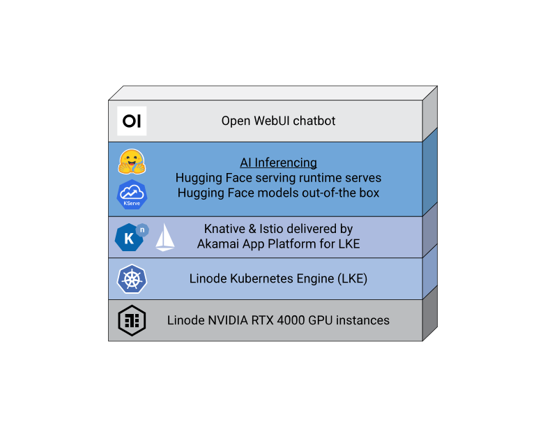
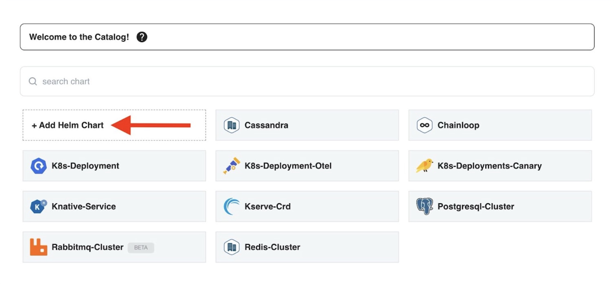
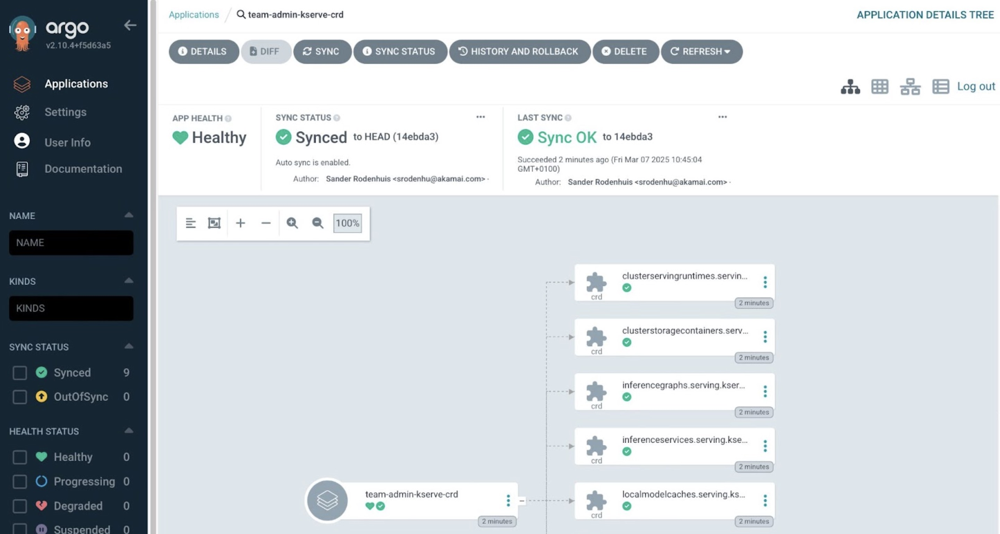


The Akamai App Platform is now available as a limited beta. It is not recommended for production workloads. To register for the beta, visit the [Betas](https://cloud.linode.com/betas) page in the Cloud Manager and click the Sign Up button next to the Akamai App Platform Beta.


LLMs (large language models) are deep-learning models that are pre-trained on vast amounts of information. AI inferencing is the method by which an AI model (such as an LLM) is trained to "infer", and subsequently deliver accurate information. The LLM used in this deployment, Meta AI's [Llama 3](https://www.llama.com/docs/overview/), is an open-source, pre-trained LLM often used for tasks like responding to questions in multiple languages, coding, and advanced reasoning.

[KServe](https://kserve.github.io/website/latest/) is a standard Model Inference Platform for Kubernetes, built for highly-scalable use cases. KServe comes with multiple Model Serving Runtimes, including the [Hugging Face](https://huggingface.co/welcome) serving runtime. The Hugging Face runtime supports the following machine learning (ML) tasks: text generation, Text2Text generation, token classification, sequence and text classification, and fill mask.

Akamai App Platform for LKE comes with a set of preconfigured and integrated open source Kubernetes applications like [Istio](https://istio.io/latest/docs/overview/what-is-istio/) and [Knative](https://knative.dev/docs/concepts/), both of which are prerequisites for using KServe. App Platform automates the provisioning process of these applications.

This guide describes the steps required to: install KServe with Akamai App Platform for LKE, deploy Meta AI's Llama 3 model using the Hugging Face service runtime, and deploy a chatbot using Open WebUI. Once functional, use our [Deploy a RAG Pipeline and Chatbot with App Platform for LKE](/docs/guides/deploy-rag-pipeline-and-chatbot-on-apl/) guide to configure an additional LLM trained on a custom data set.

If you prefer to manually install an LLM and RAG Pipeline on LKE rather than using Akamai App Platform, see our [Deploy a Chatbot and RAG Pipeline for AI Inferencing on LKE](/docs/guides/ai-chatbot-and-rag-pipeline-for-inference-on-lke/) guide.

## Diagram



## Components

### Infrastructure

-   **Linode GPUs (NVIDIA RTX 4000)**: Akamai has several GPU virtual machines available, including NVIDIA RTX 4000 (used in this tutorial) and Quadro RTX 6000. NVIDIA’s Ada Lovelace architecture in the RTX 4000 VMs are adept at many AI tasks, including [inferencing](https://www.nvidia.com/en-us/solutions/ai/inference/) and [image generation](https://blogs.nvidia.com/blog/ai-decoded-flux-one/).

-   **Linode Kubernetes Engine (LKE)**: LKE is Akamai’s managed Kubernetes service, enabling you to deploy containerized applications without needing to build out and maintain your own Kubernetes cluster.

-   **App Platform for LKE**: A Kubernetes-based platform that combines developer and operations-centric tools, automation, self-service, and management of containerized application workloads. App Platform for LKE streamlines the application lifecycle from development to delivery and connects numerous CNCF (Cloud Native Computing Foundation) technologies in a single environment, allowing you to construct a bespoke Kubernetes architecture.

### Software

-   **Open WebUI**: A self-hosted AI chatbot application that’s compatible with LLMs like Llama 3 and includes a built-in inference engine for RAG (Retrieval-Augmented Generation) solutions. Users interact with this interface to query the LLM.

-   **Hugging Face**: A data science platform and open-source library of data sets and pre-trained AI models. A Hugging Face account and access key is required to access the Llama 3 large language model (LLM) used in this deployment.

-   **Meta AI's Llama 3**: The [meta-llama/Meta-Llama-3-8B](https://huggingface.co/meta-llama/Meta-Llama-3-8B) model is used as the LLM in this guide. You must review and agree to the licensing agreement before deploying.

-   **KServe**: Serves machine learning models. This tutorial installs the Llama 3 LLM to KServe, which then serves it to other applications, such as the chatbot UI.

-   **Istio**: An open source service mesh used for securing, connecting, and monitoring microservices.

-   **Knative**: Used for deploying and managing serverless workloads on the Kubernetes platform.

-   **Kyverno**: A comprehensive toolset used for managing the Policy-as-Code (PaC) lifecycle for Kubernetes.

## Prerequisites

- A [Cloud Manager](https://cloud.linode.com/) account is required to use Akamai's cloud computing services, including LKE.

- A [Hugging Face](https://huggingface.co/) account is used for pulling Meta AI's Llama 3 model.

- Access granted to Meta AI's Llama 3 model is required. To request access, navigate to Hugging Face's [Llama 3-8B Instruct LLM link](https://huggingface.co/meta-llama/Meta-Llama-3-8B-Instruct), read and accept the license agreement, and submit your information.

- Enrollment into the Akamai App Platform's [beta program](https://cloud.linode.com/betas).

## Set Up Infrastructure

### Provision an LKE Cluster

We recommend provisioning an LKE cluster with [App Platform](https://techdocs.akamai.com/cloud-computing/docs/application-platform) enabled and the following minimum requirements:

- 3 **8GB Dedicated CPUs** with [autoscaling](https://techdocs.akamai.com/cloud-computing/docs/manage-nodes-and-node-pools#autoscale-automatically-resize-node-pools) turned on
- A second node pool consisting of at least 2 **RTX4000 Ada x1 Medium [GPU](https://techdocs.akamai.com/cloud-computing/docs/gpu-compute-instances)** plans

Once your LKE cluster is provisioned and the App Platform web UI is available, complete the following steps to continue setting up your infrastructure.

Sign into the App Platform web UI using the `platform-admin` account, or another account that uses the `platform-admin` role. Instructions for signing into App Platform for the first time can be found in our [Getting Started with Akamai App Platform](https://techdocs.akamai.com/cloud-computing/docs/getting-started-with-akamai-application-platform) guide.

### Enable Knative

1.  Select **view** > **platform** in the top bar.

1.  Select **Apps** in the left menu.

1.  Enable the **Knative** and **Kyverno** apps by hovering over each app icon and clicking the **power on** button. It may take a few minutes for the apps to enable.

    Enabled apps move up and appear in color towards the top of the available app list.

    

### Create a New Team

[Teams](https://apl-docs.net/docs/for-ops/console/teams) are isolated tenants on the platform to support Development/DevOps teams, projects or even DTAP. A Team gets access to the Console, including access to self-service features and all shared apps available on the platform.

1.  Select **view** > **platform**.

1.  Select **Teams** in the left menu.

1.  Click **Create Team**.

1.  Provide a **Name** for the Team. Keep all other default values, and click **Submit**. This guide uses the Team name `demo`.

### Install the NVIDIA GPU Operator

The [NVIDIA GPU Operator](https://docs.nvidia.com/datacenter/cloud-native/gpu-operator/latest/index.html) automates the management of NVIDIA software components needed for provisioning the GPUs, including drivers, the Kubernetes device plugin for GPUs, the NVIDIA Container Toolkit, and others.

1.  Select **view** > **team** and **team** > **admin** in the top bar.

1.  Select **Shell** in the left menu. Wait for the shell session to load.

    

1.  In the provided shell session, install the NVIDIA GPU operator using Helm:

    ```command
    helm repo add nvidia https://helm.ngc.nvidia.com/nvidia
    helm repo update
    helm install --wait --generate-name -n gpu-operator --create-namespace nvidia/gpu-operator --version=v24.9.1
    ```

### Add the kserve-crd Helm Chart to the Catalog

[Helm charts](https://helm.sh/) provide information for defining, installing, and managing resources on a Kubernetes cluster. Custom Helm charts can be added to App Platform Catalog using the **Add Helm Chart** feature.

1.  Click on **Catalog** in the left menu.

1.  Select **Add Helm Chart**.

    

1.  Under **Git Repository URL**, add the URL to the `kserve-crd` Helm chart:

    ```command
    https://github.com/kserve/kserve/blob/v0.14.1/charts/kserve-crd/Chart.yaml
    ```

1.  Click **Get Details** to populate the `kserve-crd` Helm chart details.

    
    Use an image URL in the **Icon URL** field to optionally add an icon to your custom Helm chart in the Catalog.
    

1.  Deselect **Allow teams to use this chart**.

1.  Click **Add Chart**.

### Create a Workload for the kserve-crd Helm Chart

A [Workload](https://apl-docs.net/docs/for-devs/console/workloads) is a self-service feature for creating Kubernetes resources using Helm charts from the Catalog.

1.  Select **view** > **team** and **team** > **admin** in the top bar.

1.  Select **Workloads**.

1.  Click on **Create Workload**.

1.  Select the _Kserve-Crd_ Helm chart from the Catalog.

1.  Click on **Values**.

1.  Provide a name for the Workload. This guide uses the Workload name `kserve-crd`.

1.  Add `kserve` as the namespace.

1.  Select **Create a new namespace**.

1.  Continue with the rest of the default values, and click **Submit**.

After the Workload is submitted, App Platform creates an Argo CD application to install the `kserve-crd` Helm chart. Wait for the **Status** of the Workload to become ready, and click on the ArgoCD **Application** link. You should be brought to the Argo CD screen in a separate window:



Confirm the **App Health** is marked "Healthy", and return to the App Platform UI.

### Add the kserve-resources Helm Chart to the Catalog

1.  Click on **Catalog** in the left menu.

1.  Select **Add Helm Chart**.

1.  Under **Git Repository URL**, add the URL to the `kserve-resources` Helm chart:

    ```command
    https://github.com/kserve/kserve/blob/v0.14.1/charts/kserve-resources/Chart.yaml
    ```

1.  Click **Get Details** to populate the `kserve-resources` Helm chart details.

1.  Note the name of the Helm chart populates as `Kserve` rather than `Kserve-Resources`. Edit **Target Directory Name** to read `Kserve-Resources` so that it can be identified later.

1.  Deselect **Allow teams to use this chart**.

1.  Click **Add Chart**.

### Create a Workload for the kserve-resources Helm Chart

1.  Select **view** > **team** and **team** > **admin** in the top bar.

1.  Select **Workloads**.

1.  Click on **Create Workload**.

1.  Select the _Kserve-Resources_ Helm chart from the Catalog.

1.  Click on **Values**.

1.  Provide a name for the Workload. This guide uses the Workload name `kserve-resources`.

1.  Add `kserve` as the namespace.

1.  Select **Create a new namespace**.

1.  Continue with the default values, and click **Submit**. The Workload may take a few minutes to become ready.

### Add the open-webui Helm Chart to the Catalog

1.  Click on **Catalog** in the left menu.

1.  Select **Add Helm Chart**.

1.  Under **Git Repository URL**, add the URL to the `open-webui` Helm chart:

    ```command
    https://github.com/open-webui/helm-charts/blob/open-webui-5.20.0/charts/open-webui/Chart.yaml
    ```

1.  Click **Get Details** to populate the `open-webui` Helm chart details.

1.  Leave the **Allow teams to use this chart** option selected.

1.  Click **Add Chart**.

### Add the inferencing-service Helm Chart to the Catalog

1.  Click on **Catalog** in the left menu.

1.  Select **Add Helm Chart**.

1.  Under **Git Repository URL**, add the URL to the `inferencing-service` Helm chart:

    ```command
    https://github.com/linode/apl-examples/blob/main/inferencing-service/Chart.yaml
    ```

1.  Click **Get Details** to populate the `inferencing-service` Helm chart details.

1.  Leave the **Allow teams to use this chart** option selected.

1.  Click **Add Chart**.

### Create a Hugging Face Access Token

1.  Navigate to the Hugging Face [Access Tokens page](https://huggingface.co/settings/tokens).

1.  Click **Create new token**.

1.  Under **Token type**, select "Write" access.

1.  Enter a name for your token, and click **Create token**.

1.  Save your Access Token information.

See the Hugging Face user documentation on [User access tokens](https://huggingface.co/docs/hub/en/security-tokens) for additional information.

### Request Access to Llama 3

If you haven't done it already, request access to the Llama 3 LLM model. To do this, go to Hugging Face's [Llama 3-8B Instruct LLM link](https://huggingface.co/meta-llama/Meta-Llama-3-8B-Instruct), read and agree the license agreement, and submit your information. You must wait for access to be granted in order to proceed.

## Deploy and Expose the Model

### Create a Sealed Secret

[Sealed Secrets](https://apl-docs.net/docs/for-devs/console/secrets) are encrypted Kubernetes Secrets stored in the Values Git repository. When a Sealed Secret is created in the Console, the Kubernetes Secret will appear in the Team's namespace.

1.  Select **view** > **team** and **team** > **demo** in the top bar.

1.  Select **Sealed Secrets** from the menu.

1.  Click **Create SealedSecret**.

1.  Add the name `hf-secret`.

1.  Select type _[kubernetes.io/opaque](kubernetes.io/opaque)_ from the **type** dropdown menu.

1.  Add **Key**: `HF_TOKEN`.

1.  Add your Hugging Face Access Token in the **Value** field: 

1.  Click **Submit**. The Sealed Secret may take a few minutes to become ready.

### Create a Workload to Deploy the Model

1.  Select **view** > **team** and **team** > **demo** in the top bar.

1.  Select **Catalog** from the menu.

1.  Select the _Kserve-Ai-Inferencing-Service_ chart.

1.  Click on **Values**.

1.  Provide a name for the Workload. This guide uses the Workload name `llama3-model`.

1.  Set the following values to disable sidecar injection, define your Hugging Face token, and specify resource limits:

    ```
    labels:
      sidecar.istio.io/inject: ""
    env:
      - name: 
        valueFrom:
          secretKeyRef:
            name: 
            key: 
            optional: ""
    args:
      - --model_name=llama3
      - --model_id=meta-llama/meta-llama-3-8b-instruct
    resources:
      limits:
        cpu: ""
        memory: 
        nvidia.com/gpu: ""
      requests:
        cpu: ""
        memory: 
        nvidia.com/gpu: ""
    ```

1.  Click **Submit**.

#### Check the Status of Your Workload

1.  It may take a few minutes for the _Kserve-Ai-Inferencing-Service_ Workload to become ready. To check the status of the Workload build, open a shell session by selecting **Shell** in the left menu, and use the following command to check the status of the pods with `kubectl`:

    ```command
    kubectl get pods
    ```
    ```output
    NAME                                                       READY   STATUS    RESTARTS   AGE
    llama3-model-predictor-00001-deployment-86f5fc5d5d-7299c   0/2     Pending   0          4m22s
    tekton-dashboard-5f57787b8c-gswc2                          2/2     Running   0          19h
    ```

1.  To gather more information about a pod in a `Pending` state, run the `kubectl describe pod` command below, replacing  with the name of your pod. In the output above, `llama3-model-predictor-00001-deployment-86f5fc5d5d-7299c` is the name of the pending pod:

    ```command
    kubectl describe pod 
    ```

    Scroll to the bottom of the output and look for `Events`. If there is an event with Reason `FailedScheduling`, the `resources.request` values in your _Kserve-Ai-Inferencing-Service_ Workload may need to be adjusted.

    ```output
    Events:
    Type     Reason            Age                From               Message
    ----     ------            ----               ----               -------
    Warning  FailedScheduling  12s                default-scheduler  0/3 nodes are available: 3 Insufficient cpu. preemption: 0/3 nodes are available: 3 No preemption victims found for incoming pod.
    ```

    Based on the output above, the `Insufficient cpu` warning denotes the CPU `resources.request` is set too high.

1.  If this is the case, edit the `resources.request` values for your _Kserve-Ai-Inferencing-Service_ Workload:

    1.  Navigate to **Workloads**.

    1.  Select your `llama3-model` Workload.

    1.  Click the **Values** tab.

    1.  Adjust the necessary `resources.request` value. In the example above, the number of CPUs should be lowered.

    1.  Click **Submit** when you have finished adjusting your resources values.

Wait for the Workload to be ready again, and proceed to the following steps for [exposing the model](#expose-the-model).

### Expose the Model

1.  Select **Services** from the menu.

1.  Click **Create Service**.

1.  In the **Name** dropdown list, select the `llama3-model-predictor` service.

1.  Under **Exposure (ingress)**, select **External**.

1.  Click **Submit**.

Once the Service is ready, copy the URL for the `llama3-model-predictor` service, and add it to your clipboard.

## Deploy and Expose the AI Interface

The publicly-exposed LLM in this guide uses a wide range of ports, and as a result, all pods in a Team are automatically injected with an Istio sidecar. Sidecar injection is a means of adding additional containers and their configurations to a pod template.

The Istio sidecar in this case prevents the `open-webui` pod from connecting to the `llama3-model` service, because all egress traffic for pods in the Team namespace are blocked by an Istio ServiceEntry by default. This means that prior to deploying the AI interface using the `open-webui` Helm chart, the `open-webui` pod must be prevented from getting the Istio sidecar.

Since the `open-webui` Helm chart does not allow for the addition of extra labels, there are two workarounds:

1.  Adjust the `open-webui` Helm chart in the chart's Git repository. This is the Git repository where the `open-webui` Helm chart was been stored when it was added to the Catalog.

2.  Add a Kyverno **Policy** that mutates the `open-webui` pod so that it will have the `sidecar.istio.io/inject: "false"` label.

Follow the steps below to follow the second option and add the Kyverno security policy.

1.  In the **Apps** section, select the **Gitea** app.

1.  Navigate to the `team-demo-argocd` repository.

1.  Click the **Add File** dropdown, and select **New File**. Create a file named `open-webui-policy.yaml` with the following contents:

    ```file
    apiVersion: kyverno.io/v1
    kind: Policy
    metadata:
      name: disable-sidecar-injection
      annotations:
        policies.kyverno.io/title: Disable Istio sidecar injection
    spec:
      rules:
      - name: disable-sidecar-injection
        match:
          any:
          - resources:
              kinds:
              - StatefulSet
              - Deployment
              selector:
                matchLabels:
                  ## change the value to match the name of the Workload
                  app.kubernetes.io/instance: "llama3-ui"
        mutate:
          patchStrategicMerge:
            spec:
              template:
                metadata:
                  labels:
                    sidecar.istio.io/inject: "false"
    ```

1.  Optionally add a title and any notes to the change history, and click **Commit Changes**.

    

1.  Check to see if the policy has been created in Argo CD:

    1.  Go to **Apps**, and open the _Argocd_ application.

    1.  Using the search feature, go to the `team-demo` application to see if the policy has been created. If it isn't there yet, view the `team-demo` application in the list of **Applications**, and click **Refresh** as needed.

### Create a Workload to Deploy the AI Interface

1.  Select **view** > **team** and **team** > **demo** in the top bar.

1.  Select **Catalog** from the menu.

1.  Select the _Open-Webui_ chart.

1.  Click on **Values**.

1.  Provide a name for the Workload. This guide uses the Workload name `llama3-ui`.

1.  Add the following values, and change the `openaiBaseApiUrl` to the host and domain name you added to your clipboard when [exposing the model](#expose-the-model) (the URL for the `llama3-model-predictor` service). Make sure to append `/openai/v1` to your URL as shown below.

    Remember to change the `nameOverride` value to the name of your Workload, `llama3-ui`:

    ```
    # Change the nameOverride to match the name of the Workload
    nameOverride: 
    ollama:
      enabled: 
    pipelines:
      enabled: 
    replicaCount: 
    persistence:
      enabled: 
    openaiBaseApiUrl: 
    extraEnvVars:
      - name: 
        value: ""
    ```

1.  Click **Submit**.

### Expose the AI Interface

1.  Select **Services** from the menu.

1.  Click **Create Service**.

1.  In the **Name** dropdown menu, select the `llama3-ui` service.

1.  Under **Exposure (ingress)**, select **External**.

1.  Click **Submit**.

## Access the Open Web User Interface

Once the AI user interface is ready, you should be able to access the web UI for the Open WebUI chatbot.

1.  Click on **Services** in the menu.

1.  In the list of available services, click on the URL for the `llama3-ui` service. This should bring you to the chatbot user interface.

    

## Next Steps

See our [Deploy a RAG Pipeline and Chatbot with App Platform for LKE](/docs/guides/deploy-rag-pipeline-and-chatbot-on-apl) guide to expand on the architecture built in this guide. This tutorial deploys a RAG (Retrieval-Augmented Generation) pipeline that indexes a custom data set and attaches relevant data as context when users send the LLM queries.