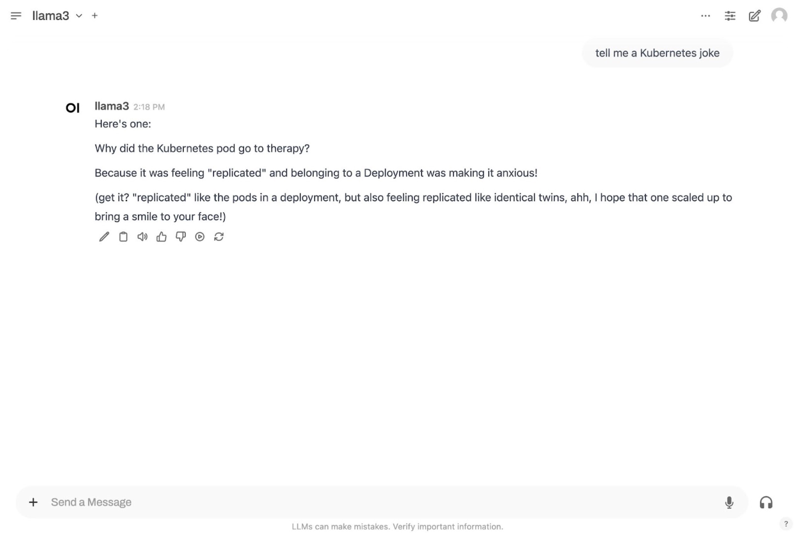

LLMs (large language models) generate human-like text and perform language-based tasks by being trained on massive datasets. AI inference is the process to make predictions or decisions on new, unseen data. The LLM used in this deployment, Meta AI's [Llama 3](https://www.llama.com/docs/overview/), is an open-source, pre-trained LLM often used for tasks like responding to questions in multiple languages, coding, and advanced reasoning.

[KServe](https://kserve.github.io/website/latest/) is a Model Inference Framework for Kubernetes, built for highly-scalable use cases. KServe comes with multiple Model Serving Runtimes, including the [Hugging Face](https://huggingface.co/welcome) serving runtime. The Hugging Face runtime supports the following machine learning (ML) tasks: text generation, Text2Text generation, token classification, sequence and text classification, and fill mask. KServe is integrated in Akamai App Platform for LKE.

Akamai App Platform for LKE also integrates [Istio](https://istio.io/latest/docs/overview/what-is-istio/) and [Knative](https://knative.dev/docs/concepts/), both of which are prerequisites for using KServe. App Platform for LKE automates the provisioning process of these applications.

This guide describes the steps required to: install KServe with Akamai App Platform for LKE, deploy the Meta Llama 3.1 8B model using the Hugging Face runtime server, and deploy a chatbot interface using Open WebUI. Once functional, use our [Deploy a RAG Pipeline and Chatbot with App Platform for LKE](/docs/guides/deploy-rag-pipeline-and-chatbot-on-apl/) guide to add and run a RAG pipeline and deploy an AI Agent that exposes an OpenAI compatible API.

If you prefer to manually install an LLM and RAG Pipeline on LKE rather than using Akamai App Platform, see our [Deploy a Chatbot and RAG Pipeline for AI Inference on LKE](/docs/guides/ai-chatbot-and-rag-pipeline-for-inference-on-lke/) guide.

## Diagram


## Components

### Infrastructure

-   **Linode GPUs (NVIDIA RTX 4000)**: Akamai has several GPU virtual machines available, including NVIDIA RTX 4000 (used in this tutorial) and Quadro RTX 6000. NVIDIA’s Ada Lovelace architecture in the RTX 4000 VMs are adept at many AI tasks, including [inferencing](https://www.nvidia.com/en-us/solutions/ai/inference/) and [image generation](https://blogs.nvidia.com/blog/ai-decoded-flux-one/).

-   **Linode Kubernetes Engine (LKE)**: LKE is Akamai’s managed Kubernetes service, enabling you to deploy containerized applications without needing to build out and maintain your own Kubernetes cluster.

-   **App Platform for LKE**: A Kubernetes-based platform that combines developer and operations-centric tools, automation, self-service, and management of containerized application workloads. App Platform for LKE streamlines the application lifecycle from development to delivery and connects numerous CNCF (Cloud Native Computing Foundation) technologies in a single environment, allowing you to construct a bespoke Kubernetes architecture.

### Software

-   **Open WebUI**: A self-hosted AI chatbot application that’s compatible with LLMs like Llama 3 and includes a built-in inference engine for RAG (Retrieval-Augmented Generation) solutions. Users interact with this interface to query the LLM.

-   **Hugging Face**: A data science platform and open-source library of data sets and pre-trained AI models. A Hugging Face account and access key is required to access the Llama 3 large language model (LLM) used in this deployment.

-   **meta-llama/Llama-3.1-8B-Instruct LLM**: The [meta-llama/Llama-3.1-8B-Instruct](https://huggingface.co/meta-llama/Llama-3.1-8B-Instruct) model is used as the foundational LLM in this guide. You must review and agree to the licensing agreement before deploying.

-   **KServe**: Serves machine learning models. This tutorial installs the Llama 3 LLM to KServe, which then serves it to other applications, such as the chatbot UI.

-   **Istio**: An open source service mesh used for securing, connecting, and monitoring microservices.

-   **Knative**: Used for deploying and managing serverless workloads on the Kubernetes platform.

## Prerequisites

- A [Cloud Manager](https://cloud.linode.com/) account is required to use Akamai's cloud computing services, including LKE.

- A [Hugging Face](https://huggingface.co/) account is used for pulling Meta AI's Llama 3 model.

- Access granted to Meta AI's Llama 3 model is required. To request access, navigate to Hugging Face's [Llama 3-8B Instruct LLM link](https://huggingface.co/meta-llama/Meta-Llama-3-8B-Instruct), read and accept the license agreement, and submit your information.

## Set Up Infrastructure

### Provision an LKE Cluster

We recommend provisioning an LKE cluster with [App Platform](https://techdocs.akamai.com/cloud-computing/docs/application-platform) enabled and the following minimum requirements:

- 3 **8GB Dedicated CPUs** with [autoscaling](https://techdocs.akamai.com/cloud-computing/docs/manage-nodes-and-node-pools#autoscale-automatically-resize-node-pools) turned on.
- A second node pool consisting of at least 2 **RTX4000 Ada x1 Medium [GPU](https://techdocs.akamai.com/cloud-computing/docs/gpu-compute-instances)** plans.

Once your LKE cluster is provisioned and the App Platform portal is available, complete the following steps to continue setting up your infrastructure.

Sign into the App Platform web UI using the `platform-admin` account, or another account that uses the `platform-admin` role. Instructions for signing into App Platform for the first time can be found in our [Getting Started with Akamai App Platform](https://techdocs.akamai.com/cloud-computing/docs/getting-started-with-akamai-application-platform) guide.

### Enable Knative an KServe

1.  Select **view** > **platform** in the top bar.

1.  Select **Apps** in the left menu.

1.  Enable the **Knative** and **Kserve** apps by hovering over each app icon and clicking the **power on** button. It may take a few minutes for the apps to enable.

    Enabled apps move up and appear in color towards the top of the available app list.

    

### Create Teams

[Teams](https://techdocs.akamai.com/app-platform/docs/platform-teams) are isolated tenants on the platform to support Development/DevOps teams, projects or even DTAP. A Team gets access to the App Platform portal, including access to self-service features and all shared apps available on the platform.

For this guide you will need to create 2 Teams. One Team that will offer access to LLMs as a shared service and one Team that will consume the LLMs.

First create the Team that will run the LLMs:

1.  Select **view** > **platform**.

1.  Select **Teams** in the left menu.

1.  Click **Create Team**.

1.  Provide a **Name** for the Team. This guide uses the Team name `models`.

1.  Under **Resource Quota**, change the **Compute Resource Quota** to 50 Cores and 64 Gi

1.  Under **Network Policies**, disable **Egress Control** and **Ingress Control**.

    See Appendix 1 and 2 to learn what to do when **Egress Control** and **Ingress Control** should be enabled because of compliance.

1.  Click **Create Team**.

Now create the Team that will run the apps that are going to use the LLMs:

1.  Click **Create Team**.

1.  Provide a **Name** for the Team. This guide uses the Team name `demo`.

1.  Under **Network Policies**, disable **Egress Control** and **Ingress Control**.

1.  Click **Create Team**.

### Install the NVIDIA GPU Operator

The [NVIDIA GPU Operator](https://docs.nvidia.com/datacenter/cloud-native/gpu-operator/latest/index.html) automates the management of NVIDIA software components needed for provisioning the GPUs, including drivers, the Kubernetes device plugin for GPUs, the NVIDIA Container Toolkit, and others.

1.  Select **view** > **team** and **team** > **admin** in the top bar.

1.  Select **Shell** in the left menu. Wait for the shell session to load.

    

1.  In the provided shell session, install the NVIDIA GPU operator using Helm:

    ```command
    helm repo add nvidia https://helm.ngc.nvidia.com/nvidia
    helm repo update
    helm install --wait --generate-name -n gpu-operator --create-namespace nvidia/gpu-operator --version=v24.9.1
    ```

### Add the open-webui Helm Chart to the Catalog

1.  Click on **Catalog** in the left menu.

1.  Select **Add Helm Chart**.

1.  Under **Git Repository URL**, add the URL to the `open-webui` Helm chart:

    ```command
    https://github.com/open-webui/helm-charts/blob/open-webui-5.20.0/charts/open-webui/Chart.yaml
    ```

1.  Click **Get Details** to populate the `open-webui` Helm chart details.

1.  Leave the **Allow teams to use this chart** option selected.

1.  Click **Add Chart**.

### Add the hf-meta-llama-3-1-8b-instruct Helm Chart to the Catalog

1.  Click on **Catalog** in the left menu.

1.  Select **Add Helm Chart**.

1.  Under **Git Repository URL**, add the URL to the `inferencing-service` Helm chart:

    ```command
    https://github.com/linode/apl-examples/blob/main/inferencing/kserve/hf-meta-llama-3-1-8b-instruct/Chart.yaml
    ```

1.  Click **Get Details** to populate the Helm chart details.

1.  Uncheck the **Allow teams to use this chart** option. In the next step we'll configure the RBAC of the Catalog to make this Helm chart available for the Team `models` to use.

1.  Click **Add Chart**.

Now configure the RBAC of the Catalog:

1.  Select **view** > **platform**.

1.  Select **App** in the left menu.

1.  Click on the `Gitea` app.

1.  In the list of Repositories, click on `otomo/charts`.

1.  At the bottom, click on the file `rbac.yaml`.

1.  Change the RBAC for the `hf-meta-llama-3.1-8b-instruct` Helm chart as shown below:

    ```
    hf-meta-llama-3.1-8b-instruct:
      - team-models
    ```

### Create a Hugging Face Access Token

1.  Navigate to the Hugging Face [Access Tokens page](https://huggingface.co/settings/tokens).

1.  Click **Create new token**.

1.  Under **Token type**, select "Write" access.

1.  Enter a name for your token, and click **Create token**.

1.  Save your Access Token information.

See the Hugging Face user documentation on [User access tokens](https://huggingface.co/docs/hub/en/security-tokens) for additional information.

### Request Access to Llama 3

If you haven't done it already, request access to the Llama 3 LLM model. To do this, go to Hugging Face's [Llama 3-8B Instruct LLM link](https://huggingface.co/meta-llama/Meta-Llama-3-8B-Instruct), read and agree the license agreement, and submit your information. You must wait for access to be granted in order to proceed.

## Deploy the Llama Model

### Create a Sealed Secret

[Sealed Secrets](https://techdocs.akamai.com/app-platform/docs/team-secrets) are encrypted Kubernetes Secrets stored in the Values Git repository. When a Sealed Secret is created in the Console, the Kubernetes Secret will appear in the Team's namespace.

1.  Select **view** > **team** and **team** > **models** in the top bar.

1.  Select **Sealed Secrets** from the menu.

1.  Click **Create SealedSecret**.

1.  Add the name `hf-secret`.

1.  Select type _[kubernetes.io/opaque](kubernetes.io/opaque)_ from the **type** dropdown menu.

1.  Add **Key**: `HF_TOKEN`.

1.  Add your Hugging Face Access Token in the **Value** field: 

1.  Click **Submit**. The Sealed Secret may take a few minutes to become ready.

### Create a Workload to Deploy the Model

1.  Select **view** > **team** and **team** > **models** in the top bar.

1.  Select **Catalog** from the menu.

1.  Select the _hf-meta-llama-3-1-8b-instruct_ chart.

1.  Click on **Values**.

1.  Provide a name for the Workload. This guide uses the Workload name `llama-3-1-8b`.

1.  Use the default values and Click **Submit**.

#### Check the Status of Your Workload

1.  It may take a few minutes for the _llama-3-1-8b_ Workload to become ready. To check the status of the Workload build, open a shell session by selecting **Shell** in the left menu, and use the following command to check the status of the pods with `kubectl`:

    ```command
    kubectl get pods -n team-models
    ```
    ```output
    NAME                                                       READY   STATUS    RESTARTS   AGE
    llama-3-1-8b-predictor-00001-deployment-68d58ccfb4-jg6rw   0/3     Pending   0          22s
    tekton-dashboard-5f57787b8c-gswc2                          2/2     Running   0          1h
    ```

Wait for the Workload to be ready, and proceed with the following steps.

## Deploy and Expose the AI Interface

### Create a Workload to Deploy the AI Interface

1.  Select **view** > **team** and **team** > **demo** in the top bar.

1.  Select **Catalog** from the menu.

1.  Select the _open-webui_ chart.

1.  Click on **Values**.

1.  Provide a name for the Workload. This guide uses the Workload name `llama3-ui`.

1.  Add the following values and change the `nameOverride` value to the name of your Workload, `llama3-ui`:

    ```file
    # Change the nameOverride to match the name of the Workload
    nameOverride: 
    ollama:
      enabled: "false"
    pipelines:
      enabled: "false"
    replicaCount: "1"
    persistence:
      enabled: "false"
    openaiBaseApiUrl: http://llama-3-1-8b.team-models.svc.cluster.local/openai/v1
    extraEnvVars:
      - name: "WEBUI_AUTH"
        value: "false"
    ```

1.  Click **Submit**.

### Expose the AI Interface

1.  Select **Services** from the menu.

1.  Click **Create Service**.

1.  In the **Service Name** dropdown menu, select the `llama3-ui` service.

1.  Click **Create Service**.

## Access the Open Web User Interface

Once the AI user interface is ready, you should be able to access the web UI for the Open WebUI chatbot.

1.  Click on **Services** in the menu.

1.  In the list of available services, click on the URL for the `llama3-ui` service. This should bring you to the chatbot user interface.

    

## Next Steps

See our [Deploy a RAG Pipeline and Chatbot with App Platform for LKE](/docs/guides/deploy-rag-pipeline-and-chatbot-on-apl) guide to expand on the architecture built in this guide. This tutorial deploys a RAG (Retrieval-Augmented Generation) pipeline that indexes a custom data set and attaches relevant data as context when users send the LLM queries.

## appendix 1: Ingress control

When we created the Teams **demo** and **models**, we turned off the **Ingress Control**. Ingress Control controls internal access to Pods. When Ingress Control is enabled, Pods in the Team namespace are not accessible for other Pods (in the Team namespace and in other Team namespaces). For the simplicity of this guide we turned the Ingress Control off. If you don't want to disable Ingress Control for all the workloads in a Team, then you can turn Ingress Control on and create **Inbound Rules** in the Team's Network Policies. Follow these steps to create Inbound Policies to control access to the models hosted in the Team `models`:

1.  Select **view** > **team** and **team** > **models** in the top bar.

1.  Select **Network Policies** in the left menu.

1.  Click **Create Inbound Rule***

1.  Add a name for the rule (like model-access)

1.  Under **Sources**, select the Workload (in this case the `llama3-ui` workload) and select a Pod label.

1.  Under **Target**, select the workload (in this case the `llama-3-1-8b` workload) and select a Pod label.

1.  Click **Create Inbound Rule**

Note that in some cases, the **Target** Pod needs to be restarted if it already had accepted connections before the Inbound Rule was created.


## appendix 2: Egress control

When we created the Teams **demo** and **models**, we turned off the **Egress Control**. Egress Control is implemented using Istio Service Entries and Istio sidecar injection is enabled by default. Egress Control controls Pod access to public URLs. Because the Hugging Face models need to be downloaded from an external repository and the open-webui installs multiple binaries from external sources, both the LLM Pod and the open-webui need to have access to multiple public URLs. For the simplicity of this guide we turned the Egress Control off. If you don't want to disable Egress Control for all the workloads in a Team, then you can turn Egress Control on and create **Outbound Rules** in the Team's Network Policies or turn of the sidecar injection for a specific workloads (Pods). There are 2 ways to do this:

1.  Add the label `sidecar.istio.io/inject: "false"` to the workload using the Chart Values

1.  Enable Kyverno and create a Kyverno **Policy** that mutates the a pod so that it will have the `sidecar.istio.io/inject: "false"` label.

The `open-webui` Helm chart used in this guide does not support to add additional labels to Pods. The following instruction and example shows how to use Kyverno to mutate the open-webui Pods and add the `sidecar.istio.io/inject: "false"` label.

1.  Select **view** > **platform** in the top bar.

1.  Select **Apps** in the left menu.

1.  In the **Apps** section, enable the **Kyverno** app.

1.  In the **Apps** section, select the **Gitea** app.

1.  In Gitea, navigate to the `team-demo-argocd` repository.

1.  Click the **Add File** dropdown, and select **New File**. Create a file named `open-webui-policy.yaml` with the following contents:

    ```file
    apiVersion: kyverno.io/v1
    kind: Policy
    metadata:
      name: disable-sidecar-injection
      annotations:
        policies.kyverno.io/title: Disable Istio sidecar injection
    spec:
      rules:
      - name: disable-sidecar-injection
        match:
          any:
          - resources:
              kinds:
              - StatefulSet
              - Deployment
              selector:
                matchLabels:
                  ## change the value to match the name of the Workload
                  app.kubernetes.io/instance: "llama3-ui"
        mutate:
          patchStrategicMerge:
            spec:
              template:
                metadata:
                  labels:
                    sidecar.istio.io/inject: "false"
    ```

1.  Optionally add a title and any notes to the change history, and click **Commit Changes**.

    

1.  Check to see if the policy has been created in Argo CD:

    1.  Go to **Apps**, and open the _Argocd_ application.

    1.  Using the search feature, go to the `team-demo` application to see if the policy has been created. If it isn't there yet, view the `team-demo` application in the list of **Applications**, and click **Refresh** as needed.