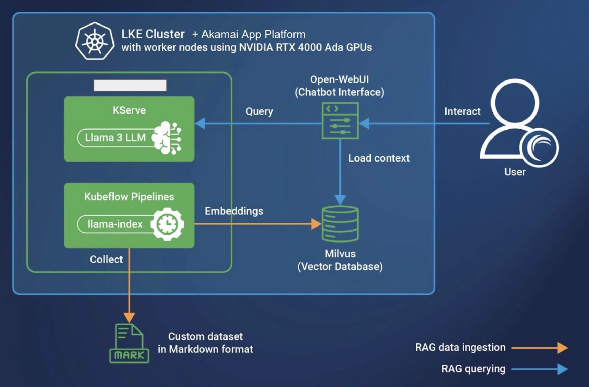
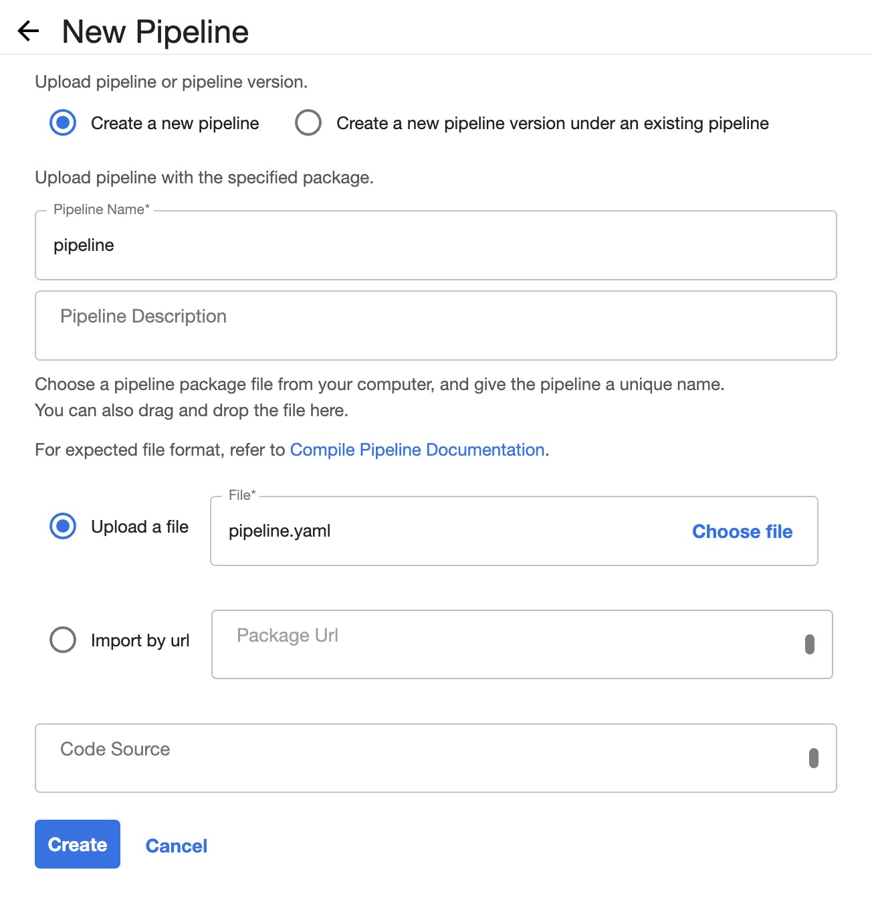
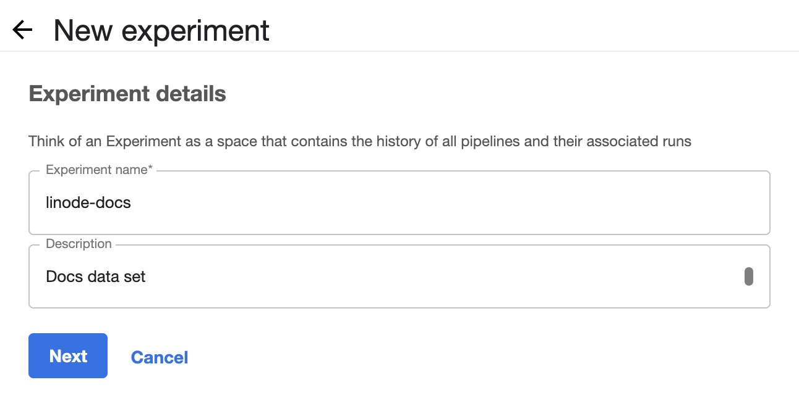
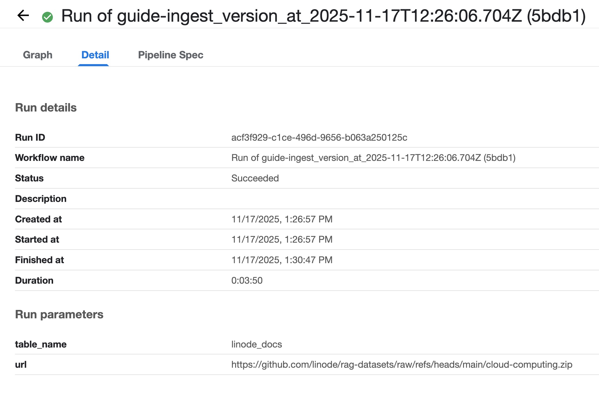
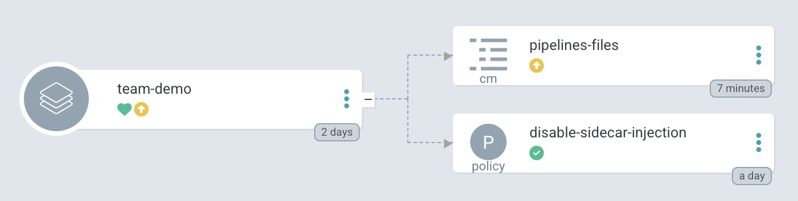
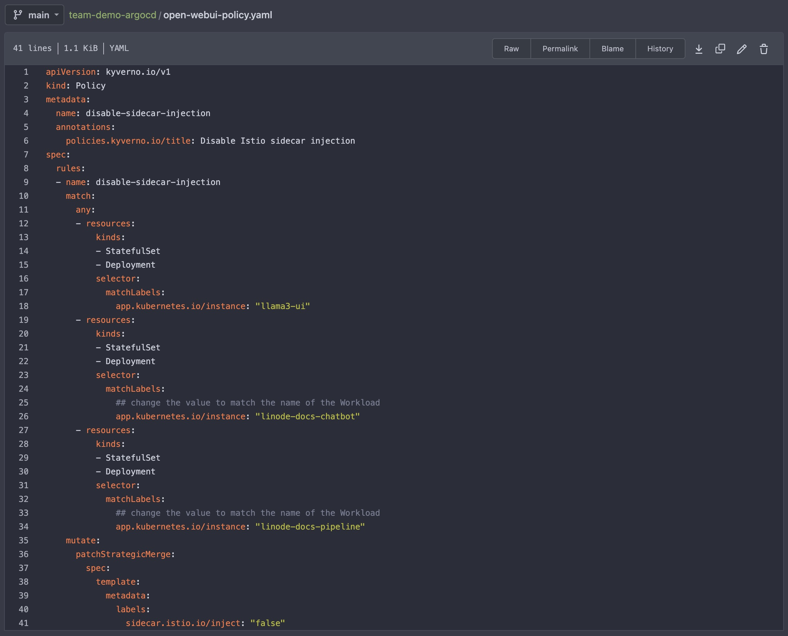
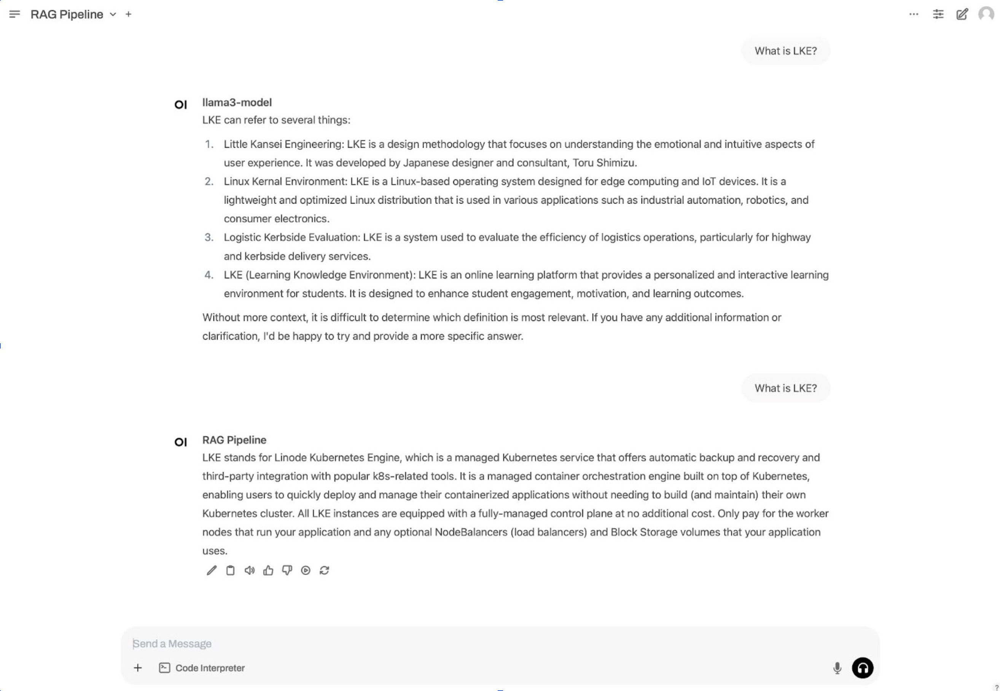


The Akamai App Platform is now available as a limited beta. It is not recommended for production workloads. To register for the beta, visit the [Betas](https://cloud.linode.com/betas) page in the Cloud Manager and click the Sign Up button next to the Akamai App Platform Beta.


This guide builds on the LLM (Large Language Model) architecture built in our [Deploy an LLM for AI Inferencing with App Platform for LKE](/docs/guides/deploy-llm-for-ai-inferencing-on-apl) guide by deploying a RAG (Retrieval-Augmented Generation) pipeline that indexes a custom data set. RAG is a particular method of context augmentation that attaches relevant data as context when users send queries to an LLM.

Follow the steps in this tutorial to install Kubeflow Pipelines and deploy a RAG pipeline using Akamai App Platform for LKE. The deployment in this guide uses the previously deployed Open WebUI chatbot to respond to queries using a custom data set. For example purposes, this guide uses a sample data set from Linode Docs in Markdown format.

If you prefer a manual installation rather than one using App Platform for LKE, see our [Deploy a Chatbot and RAG Pipeline for AI Inferencing on LKE](/docs/guides/ai-chatbot-and-rag-pipeline-for-inference-on-lke/) guide.

## Diagram



## Components

### Infrastructure

-   **Linode GPUs (NVIDIA RTX 4000)**: Akamai has several GPU virtual machines available, including NVIDIA RTX 4000 (used in this tutorial) and Quadro RTX 6000. NVIDIA’s Ada Lovelace architecture in the RTX 4000 VMs are adept at many AI tasks, including [inferencing](https://www.nvidia.com/en-us/solutions/ai/inference/) and [image generation](https://blogs.nvidia.com/blog/ai-decoded-flux-one/).

-   **Linode Kubernetes Engine (LKE)**: LKE is Akamai’s managed Kubernetes service, enabling you to deploy containerized applications without needing to build out and maintain your own Kubernetes cluster.

-   **App Platform for LKE**: Akamai App Platform is a ready-to-run solution for LKE that allows you to build, deploy, and manage distributed applications. App Platform automates the provisioning process so that you can build your distributed workloads in a few clicks, rather than manually configuring each component of your architecture.

### Additional Software

-   **Open WebUI**: A self-hosted AI chatbot application that’s compatible with LLMs like Llama 3 and includes a built-in inference engine for RAG (Retrieval-Augmented Generation) solutions. Users interact with this interface to query the LLM.

-  **Milvus**: Milvus is an open-source vector database and is used for generative AI workloads. This tutorial uses Milvus to store embeddings generated by LlamaIndex and make them available to queries sent to the Llama 3 LLM.

-  **Kubeflow**: An open-source software platform designed for Kubernetes that includes a suite of applications used for machine learning tasks. This tutorial installs all default applications and makes specific use of the following:

    -  **KServe**: Serves machine learning models. The architecture in this guide uses the [Llama 3 LLM](https://huggingface.co/meta-llama/Meta-Llama-3-8B) installed on KServe, which then serves it to other applications, including the chatbot UI.

    -  **Kubeflow Pipeline**: Used to deploy pipelines, reusable machine learning workflows built using the Kubeflow Pipelines SDK. In this tutorial, a pipeline is used to run LlamaIndex to process the dataset and store embeddings.

## Prerequisites

-   Complete the deployment in the [Deploy an LLM for AI Inferencing with App Platform for LKE](/docs/guides/deploy-llm-for-ai-inferencing-on-apl) guide.

-   [Python3](https://www.python.org/downloads/) and the [venv](https://docs.python.org/3/library/venv.html) Python module installed on your local machine.

## Set Up Infrastructure

Once your LLM has been deployed and is accessible, complete the following steps to continue setting up your infrastructure.

Sign into the App Platform web UI using the `platform-admin` account, or another account that uses the `platform-admin` role.

### Add the milvus Helm Chart to the Catalog

1.  Select **view** > **team** and **team** > **admin** in the top bar.

1.  Click on **Catalog** in the left menu.

1.  Select **Add Helm Chart**.

1.  Under **Git Repository URL**, add the URL to the `milvus` Helm chart:

    ```command
    https://github.com/zilliztech/milvus-helm/blob/milvus-4.2.40/charts/milvus/Chart.yaml
    ```

1.  Click **Get Details** to populate the Helm chart details.

1.  Deselect **Allow teams to use this chart**.

1.  Click **Add Chart**.

### Create a Workload and Install the kfp-cluster-resources Helm Chart

1.  Select **view** > **team** and **team** > **admin** in the top bar.

1.  Select **Workloads**.

1.  Click on **Create Workload**.

1.  Select the _Kfp-Cluster-Resources_ Helm chart from the Catalog.

1.  Click on **Values**.

1.  Provide a name for the Workload. This guide uses the Workload name `kfp-cluster-resources`.

1.  Add `kubeflow` as the namespace.

1.  Select **Create a new namespace**.

1.  Continue with the default values, and click **Submit**. The Workload may take a few minutes to become ready.

### Create an Object Storage Bucket and Access Key for Milvus

1.  In Cloud Manager, navigate to **Object Storage**.

1.  Click **Create Bucket**.

1.  Enter a name for your bucket, and select a **Region** close to, or the same as, your App Platform LKE cluster.

1.  While on the **Object Storage** page, select the **Access Keys** tab, and then click **Create Access Key**.

1.  Enter a name for your access key, select the same **Region** as your Milvus bucket, and make sure your access key has "Read/Write" access enabled for your bucket.

1.  Save your access key information.

### Create a Workload for the Milvus Helm Chart

1.  Select **view** > **team** and **team** > **admin** in the top bar.

1.  Select **Workloads**.

1.  Click on **Create Workload**.

1.  Select the _Milvus_ Helm chart from the Catalog.

1.  Click on **Values**.

1.  Provide a name for the Workload. This guide uses the Workload name `milvus`.

1.  Add `milvus` as the namespace.

1.  Select **Create a new namespace**.

1.  Set the following values. Make sure to replace `externalS3` values with those of your Milvus bucket and access key. You may also need to add lines for the resources requests and limits under `standalone`:

    
    While navigating the **Values** configuration window, use the <kbd>cmd</kbd> + <kbd>F</kbd> keyboard search feature to locate each value.
    

    ```
    cluster:
      enabled: 
    pulsarv3:
      enabled: 
    minio:
      enabled: 
    externalS3:
      enabled: 
      host: 
      port: ""
      accessKey: 
      secretKey: 
      useSSL: 
      bucketName: 
      cloudProvider: aws
      region: 
    standalone:
      resources:
        requests:
          nvidia.com/gpu: ""
        limits:
          nvidia.com/gpu: ""
    ```

    
    The Milvus Helm chart does not support the use of a secretKeyRef. Using unencrypted Secret Keys in chart values is not considered a Kubernetes security best-practice.
    

1.  Click **Submit**.

### Create an Object Storage Bucket and Access Key for kubeflow-pipelines

1.  In Cloud Manager, navigate to **Object Storage**.

1.  Click **Create Bucket**.

1.  Enter a name for your bucket, and select a **Region** close to, or the same as, your App Platform LKE cluster.

1.  While on the **Object Storage** page, select the **Access Keys** tab, and then click **Create Access Key**.

1.  Enter a name for your access key, select a **Region** as your Kubeflow-Pipelines bucket, and make sure your access key has "Read/Write" access enabled for your bucket.

1.  Save your access key information.

### Make Sealed Secrets

#### Create a Sealed Secret for mlpipeline-minio-artifact

Make a Sealed Secret named `mlpipeline-minio-artifact` granting access to your `kubeflow-pipelines` bucket.

1.  Select **view** > **team** and **team** > **demo** in the top bar.

1.  Select **Sealed Secrets** from the menu, and click **Create SealedSecret**.

1.  Add a name for your SealedSecret, `mlpipeline-minio-artifact`.

1.  Select type _[kubernetes.io/opaque](kubernetes.io/opaque)_ from the **type** dropdown menu.

1.  Add the **Key** and **Value** details below. Replace  and  with your `kubeflow-pipelines` access key information.

    To add a second key for your secret key, click the **Add Item** button after entering your access key information:

    -   Type: `kubernetes.io/opaque`
    -   Key=`accesskey`, Value=
    -   Key=`secretkey`, Value=

1.  Click **Submit**.

#### Create a Sealed Secret for mysql-credentials

Make another Sealed Secret named `mysql-credentials` to establish root user credentials. Make a strong root password, and save it somewhere secure.

1.  Select **view** > **team** and **team** > **demo** in the top bar.

1.  Select **Sealed Secrets** from the menu, and click **Create SealedSecret**.

1.  Add a name for your SealedSecret, `mysql-credentials`.

1.  Select type _[kubernetes.io/opaque](kubernetes.io/opaque)_ from the **type** dropdown menu.

1.  Add the **Key** and **Value** details, replacing  with a strong root password you've created and saved:

    -   Type: `kubernetes.io/opaque`
    -   Key=`username`, Value=`root`
    -   Key=`password`, Value=

1.  Click **Submit**.

### Create a Network Policy

Create a [**Network Policy**](https://apl-docs.net/docs/for-ops/console/netpols) in the Team where the `kubeflow-pipelines` Helm chart will be installed (Team name **demo** in this guide). This allows communication between all Kubeflow Pipelines Pods.

1.  Select **view** > **team** and **team** > **demo** in the top bar.

1.  Select **Network Policies** from the menu.

1.  Click **Create Netpol**.

1.  Add a name for the Network Policy.

1.  Select **Rule type** `ingress` using the following values, where `kfp` is the name of the Workload created in the next step:

    - **Selector label name**: [`app.kubernetes.io/instance`](http://app.kubernetes.io/instance)

    - **Selector label value**: `kfp`

1.  Click **Submit**.

### Create a Workload for the kubeflow-pipelines Helm Chart

1.  Select **view** > **team** and **team** > **admin** in the top bar.

1.  Select **Workloads**.

1.  Click on **Create Workload**.

1.  Select the _Kubeflow-Pipelines_ Helm chart from the Catalog.

1.  Click on **Values**.

1.  Provide a name for the Workload. This guide uses the Workload name `kfp`.

1.  Add `team-demo` as the namespace.

1.  Select **Create a new namespace**.

1.  Set the following values. Replace  and  with those of your `kubeflow-pipelines` bucket:

    ```
    objectStorage:
      region: 
      bucket: 
    mysql:
      secret: mysql-credentials
    ```

1.  Click **Submit**. It may take a few minutes for the Workload to be ready.

### Expose the Kubeflow Pipelines UI

1.  Select **view** > **team** and **team** > **demo** in the top bar.

1.  Select **Services**.

1.  Click **Create Service**.

1.  In the **Name** dropdown menu, select the `ml-pipeline-ui` service.

1.  Under **Exposure**, select **External**.

1.  Click **Submit**.

Kubeflow Pipelines is now ready to be used by members of the Team **demo**.

## Set Up Kubeflow Pipeline to Ingest Data

### Generate the Pipeline YAML File

The steps below create and use a Python script to create a Kubeflow pipeline file. This YAML file describes each step of the pipeline workflow.

1.  On your local machine, create a virtual environment for Python:

    ```command
    python3 -m venv .
    source bin/activate
    ```

1.  Install the Kubeflow Pipelines package in the virtual environment:

    ```command
    pip install kfp
    ```

1.  Create a file named `doc-ingest-pipeline.py` with the following contents.

    Replace  with the domain of your App Platform instance. The  is contained in the console URL in your browser, where `console.lke123456.akamai-apl.net` is the URL and `lke123456.akamai-apl.net` is the .

    This script configures the pipeline that downloads the Markdown data set to be ingested, reads the content using LlamaIndex, generates embeddings of the content, and stores the embeddings in the milvus database:

    ```file
    from kfp import dsl

    @dsl.component(
            base_image='nvcr.io/nvidia/ai-workbench/python-cuda117:1.0.3',
            packages_to_install=['pymilvus>=2.4.2', 'llama-index', 'llama-index-vector-stores-milvus', 'llama-index-embeddings-huggingface', 'llama-index-llms-openai-like']
            )
    def doc_ingest_component(url: str, collection: str) -> None:
        print(">>> doc_ingest_component")

        from urllib.request import urlopen
        from io import BytesIO
        from zipfile import ZipFile

        http_response = urlopen(url)
        zipfile = ZipFile(BytesIO(http_response.read()))
        zipfile.extractall(path='./md_docs')

        from llama_index.core import SimpleDirectoryReader

        # load documents
        documents = SimpleDirectoryReader("./md_docs/", recursive=True, required_exts=[".md"]).load_data()

        from llama_index.embeddings.huggingface import HuggingFaceEmbedding
        from llama_index.core import Settings

        Settings.embed_model = HuggingFaceEmbedding(
            model_name="sentence-transformers/all-MiniLM-L6-v2"
        )

        from llama_index.llms.openai_like import OpenAILike

        llm = OpenAILike(
            model="llama3",
            api_base="https://llama3-model-predictor-team-demo./openai/v1",
            api_key = "EMPTY",
            max_tokens = 512)

        Settings.llm = llm

        from llama_index.core import VectorStoreIndex, StorageContext
        from llama_index.vector_stores.milvus import MilvusVectorStore

        vector_store = MilvusVectorStore(uri="http://milvus.milvus.svc.cluster.local:19530", collection=collection, dim=384, overwrite=True)
        storage_context = StorageContext.from_defaults(vector_store=vector_store)
        index = VectorStoreIndex.from_documents(
            documents, storage_context=storage_context
        )

    @dsl.pipeline
    def doc_ingest_pipeline(url: str, collection: str) -> None:
        comp = doc_ingest_component(url=url, collection=collection)

    from kfp import compiler

    compiler.Compiler().compile(doc_ingest_pipeline, 'pipeline.yaml')
    ```

1.  Run the script to generate a pipeline YAML file called `pipeline.yaml`:

    ```command
    python3 doc-ingest-pipeline.py
    ```

    This file is uploaded to Kubeflow in the following section.

1.  Exit the Python virtual environment:

    ```command
    deactivate
    ```

### Run the Pipeline Workflow

1.  Select **view** > **team** and **team** > **demo** in the top bar.

1.  Select **Services**.

1.  Click on the URL of the service `ml-pipeline-ui`.

1.  Navigate to the **Pipelines** section, click **Upload pipeline**.

1.  Under **Upload a file**, select the `pipeline.yaml` file created in the previous section, and click **Create**.

    

1.  Select **Experiments** from the left menu, and click **Create experiment**. Enter a name and description for the experiment, and click **Next**.

    

    When complete, you should be brought to the **Runs** > **Start a new run** page.

1.  Complete the following steps to start a new run:

    -   Under **Pipeline**, choose the pipeline `pipeline.yaml` you just created.

    -   For **Run Type** choose **One-off**.

    -   Provide the collection name and URL of the data set to be processed. This is the zip file with the documents you wish to process.

        To use the sample Linode Docs data set in this guide, use the name `linode_docs` for **collection-string** and the following GitHub URL for **url-string**:

        ```command
        https://github.com/linode/docs/archive/refs/tags/v1.360.0.zip
        ```

1.  Click **Start** to run the pipeline. When completed, the run is shown with a green checkmark to the left of the run title.

    

## Deploy the Chatbot

The next step is to install the Open WebUI pipeline and web interface and configure it to connect the data generated in the Kubernetes Pipeline with the LLM deployed in KServe.

The Open WebUI Pipeline uses the Milvus database to load context related to the search. The pipeline sends it, and the query, to the Llama 3 LLM instance within KServe. The LLM then sends back a response to the chatbot, and your browser displays an answer informed by the custom data set.

### Create a configmap with the RAG Pipeline Files

The RAG pipeline files in this section are not related to the Kubeflow pipeline create in the previous section. Rather, the RAG pipeline instructs the chatbot how to interact with each component created thus far, including the Milvus data store and the Llama 3 LLM.

1.  Select **view** > **team** and **team** > **demo** in the top bar.

1.  Navigate to the **Apps** section, and click on **Gitea**.

1.  In Gitea, navigate to the `team-demo-argocd` repository on the right.

1.  Click the **Add File** dropdown, and select **New File**. Create a file with the name `pipeline-files.yaml` with the following contents. Replace  with the domain of your App Platform instance:

    ```file
    apiVersion: v1
    data:
        pipeline-requirements.txt: |
          requests
          pymilvus
          llama-index
          llama-index-vector-stores-milvus
          llama-index-embeddings-huggingface
          llama-index-llms-openai-like
          opencv-python-headless
        rag-pipeline.py: |
          """
          title: RAG Pipeline
          version: 1.0
          description: RAG Pipeline
          """
          from typing import List, Optional, Union, Generator, Iterator

          class Pipeline:

            def __init__(self):
                self.name = "RAG Pipeline"
                self.index = None
                pass


            async def on_startup(self):
                from llama_index.embeddings.huggingface import HuggingFaceEmbedding
                from llama_index.core import Settings, VectorStoreIndex
                from llama_index.llms.openai_like import OpenAILike
                from llama_index.vector_stores.milvus import MilvusVectorStore

                print(f"on_startup:{__name__}")

                Settings.embed_model = HuggingFaceEmbedding(
                        model_name="sentence-transformers/all-MiniLM-L6-v2"
                )

                llm = OpenAILike(
                    model="llama3",
                    api_base="https://llama3-model-predictor-team-demo./openai/v1",
                    api_key = "EMPTY",
                    max_tokens = 512)

                Settings.llm = llm

                vector_store = MilvusVectorStore(uri="http://milvus.milvus.svc.cluster.local:19530", collection="linode_docs", dim=384, overwrite=False)
                self.index = VectorStoreIndex.from_vector_store(vector_store=vector_store)

            async def on_shutdown(self):
                print(f"on_shutdown:{__name__}")
                pass


            def pipe(
                self, user_message: str, model_id: str, messages: List[dict], body: dict
            ) -> Union[str, Generator, Iterator]:
                print(f"pipe:{__name__}")

                query_engine = self.index.as_query_engine(streaming=True, similarity_top_k=5)
                response = query_engine.query(user_message)
                print(f"rag_response:{response}")
                return f"{response}"
    kind: ConfigMap
    metadata:
      name: pipelines-files
    ```

    Optionally add a title and any notes to the change history, and click **Commit Changes**.

1.  Go to **Apps**, and open the _Argocd_ application. Navigate to the `team-demo` application to see if the configmap has been created. If it is not ready yet, click **Refresh** as needed.

    

### Deploy the open-webui Pipeline and Web Interface

Update the Kyverno **Policy** `open-webui-policy.yaml` created in the previous tutorial ([Deploy an LLM for AI Inferencing with App Platform for LKE](/docs/guides/deploy-llm-for-ai-inferencing-on-apl)) to mutate the `open-webui` pods that will be deployed.

1.  Open the **Gitea** app, navigate to the `team-demo-argocd` repository, and open the `open-webui-policy.yaml` file.

1.  Add the following resources so that the `open-webui` pods are deployed with the `sidecar.istio.io/inject: "false"` label that prevents Istio sidecar injection:

    ```file
          - resources:
              kinds:
              - StatefulSet
              - Deployment
              selector:
                matchLabels:
                  ## change the value to match the name of the Workload
                  app.kubernetes.io/instance: "linode-docs-chatbot"
          - resources:
              kinds:
              - StatefulSet
              - Deployment
              selector:
                matchLabels:
                  ## change the value to match the name of the Workload
                  app.kubernetes.io/instance: "open-webui-pipelines"
    ```

    
    Be mindful of indentations when editing the YAML file. Both `-resources` sections should live under the `-name` > `match` > `any` block in `rules`.

    

    

#### Add the open-webui-pipelines Helm Chart to the Catalog

1.  Select **view** > **team** and **team** > **admin** in the top bar.

1.  Click on **Catalog** in the left menu.

1.  Select **Add Helm Chart**.

1.  Under **Github URL**, add the URL to the `open-webui-pipelines` Helm chart:

    ```command
    https://github.com/open-webui/helm-charts/blob/pipelines-0.4.0/charts/pipelines/Chart.yaml
    ```

1.  Click **Get Details** to populate the `open-webui-pipelines` Helm chart details. If preferred, rename the **Target Directory Name** from `pipelines` to `open-webui-pipelines` for reference later on.

1.  Leave **Allow teams to use this chart** selected.

1.  Click **Add Chart**.

#### Create a Workload for the open-webui-pipelines Helm Chart

1.  Select **view** > **team** and **team** > **demo** in the top bar.

1.  Select **Workloads**.

1.  Click on **Create Workload**.

1.  Select the _Open-Webui-Pipelines_ Helm chart from the Catalog.

1.  Click on **Values**.

1.  Provide a name for the Workload. This guide uses the Workload name `open-webui-pipelines`.

1.  Add in or change the following chart values. Make sure to set the name of the Workload in the `nameOverride` field.

    You may need to uncomment some fields by removing the `#` sign in order to make them active. Remember to be mindful of indentations:

    ```
    nameOverride: 
    resources:
      requests:
        cpu: ""
        memory: 
      limits:
        cpu: ""
        memory: 
    ingress:
      enabled: 
    extraEnvVars:
      - name: 
        value: 
      - name: 
        value: 
    volumeMounts:
      - name: 
        mountPath: 
    volumes:
      - name: 
        configMap:
          name: 
    ```

1.  Click **Submit**.

#### Expose the linode-docs-pipeline Service

1.  Select **view** > **team** and **team** > **demo** in the top bar.

1.  Select **Services**.

1.  Click **Create Service**.

1.  In the **Name** dropdown menu, select the `linode-docs-pipeline` service.

1.  In the **Port** dropdown, select port `9099`.

1.  Under **Exposure**, select **External**.

1.  Click **Submit**.

1.  Once submitted, copy the URL of the `linode-docs-pipeline` service to your clipboard.

#### Create a Workload to Install the open-webui Helm Chart

1.  Select **view** > **team** and **team** > **demo** in the top bar.

1.  Select **Workloads**.

1.  Click on **Create Workload**.

1.  Select the _Open-Webui_ Helm chart from the Catalog. This Helm chart should have been added in the previous [Deploy an LLM for AI Inferencing with App Platform for LKE](/docs/guides/deploy-llm-for-ai-inferencing-on-apl/#add-the-open-webui-helm-chart-to-the-catalog) guide.

1.  Click on **Values**.

1.  Provide a name for the Workload. This guide uses the name `linode-docs-chatbot`.

1.  Edit the chart to include the below values, and set the name of the Workload in the `nameOverride` field. Replace  with your App Platform cluster domain.

    You may need to add new lines for the additional names and values under `extraEnvVars` (extra environment variables):

    ```
    nameOverride: 
    ollama:
      enabled: 
    pipelines:
      enabled: 
    persistence:
      enabled: 
    replicaCount: 
    extraEnvVars:
      - name: 
        value: ""
      - name: 
        value: https://llama3-model-predictor-team-demo./openai/v1;https://linode-docs-pipeline-demo.
      - name: 
        value: 
    ```

1.  Click **Submit**.

#### Expose the linode-docs-chatbot Service

1.  Select **Services**.

1.  Click **Create Service**.

1.  In the **Name** dropdown menu, select the `linode-docs-chatbot` service.

1.  Under **Exposure**, select **External**.

1.  Click **Submit**.

## Access the Open Web User Interface

In your list of available **Services**, click on the URL of the `linode-docs-chatbot` to navigate to the Open WebUI chatbot interface. Select the model you wish to use in the top left dropdown menu (`llama3-model` or `RAG Pipeline`).

Meta AI's Llama 3 model uses information that is pre-trained by other data sources - not your custom data set. If you give this model a query, it will use its pre-trained data set to answer your question.

The RAG Pipeline model defined in this guide uses data from the custom data set with which it was provided. The example data set used in this guide is sourced from Linode Docs. If you give this model a query relevant to your custom data, the chatbot should respond with an answer informed by that data set.

