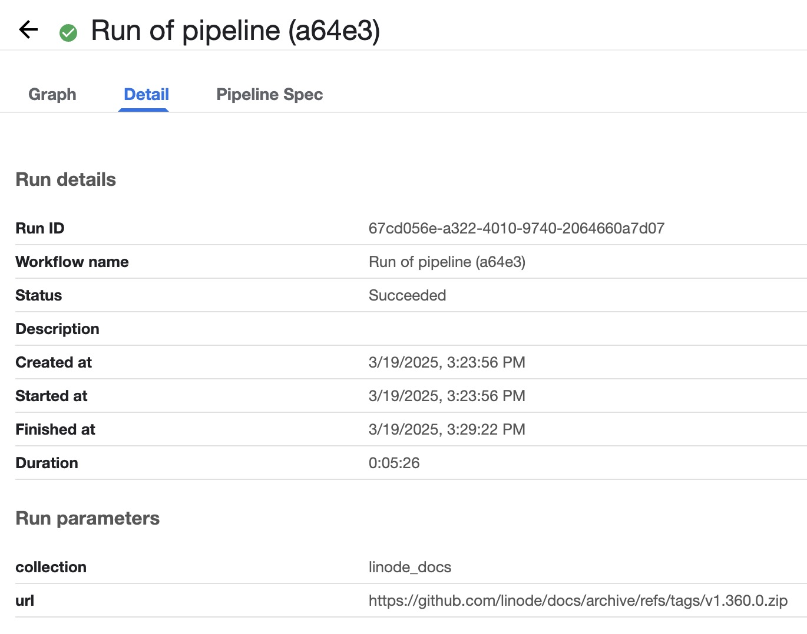

This guide builds on the LLM (Large Language Model) inference architecture built in our [Deploy an LLM for AI Inference with App Platform for LKE](/docs/guides/deploy-llm-for-ai-inferencing-on-apl) guide by deploying a RAG (Retrieval-Augmented Generation) pipeline that indexes a custom data set. RAG is a particular method of context augmentation that attaches relevant data as context when users send queries to an LLM.

Follow the steps in this tutorial to enable Kubeflow Pipelines and deploy a RAG pipeline using Akamai App Platform for LKE. The data set you use may vary depending on your use case. For example purposes, this guide uses a sample data set from Akamai Techdocs that includes documentation about all Linode cloud services.

If you prefer a manual installation rather than one using App Platform for LKE, see our [Deploy a Chatbot and RAG Pipeline for AI Inference on LKE](/docs/guides/ai-chatbot-and-rag-pipeline-for-inference-on-lke/) guide.

## Diagram


## Components

### Infrastructure

-   **Linode GPUs (NVIDIA RTX 4000)**: Akamai has several high-performance GPU virtual machines available, including NVIDIA RTX 4000 (used in this tutorial) and Quadro RTX 6000. NVIDIA’s Ada Lovelace architecture in the RTX 4000 VMs are adept at many AI tasks, including [inferencing](https://www.nvidia.com/en-us/solutions/ai/inference/) and [image generation](https://blogs.nvidia.com/blog/ai-decoded-flux-one/).

-   **Linode Kubernetes Engine (LKE)**: LKE is Akamai’s managed Kubernetes service, enabling you to deploy containerized applications without needing to build out and maintain your own Kubernetes cluster.

-   **App Platform for LKE**: A Kubernetes-based platform that combines developer and operations-centric tools, automation, self-service, and management of containerized application workloads. App Platform for LKE streamlines the application lifecycle from development to delivery and connects numerous CNCF (Cloud Native Computing Foundation) technologies in a single environment, allowing you to construct a bespoke Kubernetes architecture.

### Additional Software

-   **Open WebUI Pipelines**: A self-hosted UI-Agnostic OpenAI API Plugin Framework that brings modular, customizable workflows to any UI client supporting OpenAI API specs.

-  **PGvector**: Vector similarity search for Postgres. This tutorial uses a Postgres database with a `vector` extension to store embeddings generated by LlamaIndex and make them available to queries sent to the Llama 3.1 8B LLM.

-  **KServe**: Serves machine learning models. The architecture in this guide uses the [Llama 3 LLM](https://huggingface.co/meta-llama/Meta-Llama-3-1-8B) deployed using the Hugging Face Runtime Server with KServe, which then serves it to other applications, including the chatbot UI.

-   **intfloat/e5-mistral-7b-instruct LLM**: The [intfloat/e5-mistral-7b-instruct](https://huggingface.co/intfloat/e5-mistral-7b-instruct) model is used as the embedding LLM in this guide.

-  **Kubeflow Pipelines**: Used to deploy pipelines, reusable machine learning workflows built using the Kubeflow Pipelines SDK. In this tutorial, a pipeline is used to run a pipeline to process the dataset and store embeddings in the PGvector database.

## Prerequisites

-   Complete the deployment in the [Deploy an LLM for AI Inferencing with App Platform for LKE](/docs/guides/deploy-llm-for-ai-inferencing-on-apl) guide. Your LKE cluster should include the following minimum hardware requirements:

    -   3 **8GB Dedicated CPUs** with [autoscaling](https://techdocs.akamai.com/cloud-computing/docs/manage-nodes-and-node-pools#autoscale-automatically-resize-node-pools) turned on

    -   A second node pool consisting of at least 2 **RTX4000 Ada x1 Medium [GPU](https://techdocs.akamai.com/cloud-computing/docs/gpu-compute-instances)** plans

-   [Python3](https://www.python.org/downloads/) and the [venv](https://docs.python.org/3/library/venv.html) Python module installed on your local machine

-   Object Storage configured. Make sure to configure Object Storage as described [here](https://techdocs.akamai.com/app-platform/docs/lke-automatic-install#provision-object-storage-for-the-app-platform) before Kubeflow Pipelines is enabled.

## Set Up Infrastructure

Sign into the App Platform web UI using the `platform-admin` account, or another account that uses the `platform-admin` role and follow the next steps:

### Add the hf-e5-mistral-7b-instruct Helm Chart to the Catalog

1.  Click on **Catalog** in the left menu.

1.  Select **Add Helm Chart**.

1.  Under **Git Repository URL**, add the URL to the `hf-e5-mistral-7b-instruct` Helm chart:

    ```command
    https://github.com/linode/apl-examples/blob/main/inferencing/kserve/hf-e5-mistral-7b-instruct/Chart.yaml
    ```

1.  Click **Get Details** to populate the Helm chart details.

1.  Uncheck the **Allow teams to use this chart** option. In the next step we'll configure the RBAC of the Catalog to make this Helm chart available for the Team `models` to use.

1.  Click **Add Chart**.

Now configure the RBAC of the Catalog:

1.  Select **view** > **platform**.

1.  Select **App** in the left menu.

1.  Click on the `Gitea` app.

1.  In the list of Repositories, click on `otomo/charts`.

1.  At the bottom, click on the file `rbac.yaml`.

1.  Change the RBAC for the `hf-e5-mistral-7b-instruct` Helm chart as shown below:

    ```
    hf-e5-mistral-7b-instruct:
      - team-models
    ```

### Create a Workload to Deploy the Model

1.  Select **view** > **team** and **team** > **models** in the top bar.

1.  Select **Catalog** from the menu.

1.  Select the _hf-e5-mistral-7b-instruct_ chart.

1.  Click on **Values**.

1.  Provide a name for the Workload. This guide uses the Workload name `mistral-7b`.

1.  Use the default values and Click **Submit**.

### Create a Workload to deploy a PGvector cluster

1.  Select **view** > **team** and **team** > **demo** in the top bar.

1.  Select **Catalog** from the menu.

1.  Select the _pgvector-cluster_ chart.

1.  Click on **Values**.

1.  Provide a name for the Workload. This guide uses the Workload name `pgvector`.

1.  Use the default values and Click **Submit**.

Note that the `pgvector-cluster` chart will also create a database in the pgvector cluster with the name `app`.


## Set Up Kubeflow Pipelines

### Enable Kubeflow Pipelines

1.  Select **view** > **platform** in the top bar.

1.  Select **Apps** in the left menu.

1.  Enable the **Kubeflow Pipelines** app by hovering over the app icon and clicking the **power on** button. It may take a few minutes for the apps to enable.

### Generate the Pipeline YAML File

Follow the steps below to create a Kubeflow pipeline file. This YAML file describes each step of the pipeline workflow.

1.  On your local machine, create a virtual environment for Python:

    ```command
    python3 -m venv .
    source bin/activate
    ```

1.  Install the Kubeflow Pipelines package in the virtual environment:

    ```command
    pip install kfp
    ```

1.  Create a file named `doc-ingest-pipeline.py` with the following contents.

    This script configures the pipeline that downloads the Markdown data set to be ingested, reads the content using LlamaIndex, generates embeddings of the content, and stores the embeddings in the PGvector database. You do not need to make any changes in the script!

    ```file
    from kfp import dsl

    @dsl.component(
            base_image='nvcr.io/nvidia/ai-workbench/python-cuda117:1.0.3',
            packages_to_install=['pymilvus>=2.4.2', 'llama-index', 'llama-index-vector-stores-milvus', 'llama-index-embeddings-huggingface', 'llama-index-llms-openai-like']
            )
    def doc_ingest_component(url: str, collection: str) -> None:
        print(">>> doc_ingest_component")

        from urllib.request import urlopen
        from io import BytesIO
        from zipfile import ZipFile

        http_response = urlopen(url)
        zipfile = ZipFile(BytesIO(http_response.read()))
        zipfile.extractall(path='./md_docs')

        from llama_index.core import SimpleDirectoryReader

        # load documents
        documents = SimpleDirectoryReader("./md_docs/", recursive=True, required_exts=[".md"]).load_data()

        from llama_index.embeddings.huggingface import HuggingFaceEmbedding
        from llama_index.core import Settings

        Settings.embed_model = HuggingFaceEmbedding(
            model_name="sentence-transformers/all-MiniLM-L6-v2"
        )

        from llama_index.llms.openai_like import OpenAILike

        llm = OpenAILike(
            model="llama3",
            api_base="https://llama3-model-predictor-team-demo./openai/v1",
            api_key = "EMPTY",
            max_tokens = 512)

        Settings.llm = llm

        from llama_index.core import VectorStoreIndex, StorageContext
        from llama_index.vector_stores.milvus import MilvusVectorStore

        vector_store = MilvusVectorStore(uri="http://milvus.milvus.svc.cluster.local:19530", collection=collection, dim=384, overwrite=True)
        storage_context = StorageContext.from_defaults(vector_store=vector_store)
        index = VectorStoreIndex.from_documents(
            documents, storage_context=storage_context
        )

    @dsl.pipeline
    def doc_ingest_pipeline(url: str, collection: str) -> None:
        comp = doc_ingest_component(url=url, collection=collection)

    from kfp import compiler

    compiler.Compiler().compile(doc_ingest_pipeline, 'pipeline.yaml')
    ```

1.  Run the script to generate a pipeline YAML file called `pipeline.yaml`:

    ```command
    python3 doc-ingest-pipeline.py
    ```

    This file is uploaded to Kubeflow in the following section.

1.  Exit the Python virtual environment:

    ```command
    deactivate
    ```

### Run the Pipeline Workflow

1.  Select **view** > **team** and **team** > **demo** in the top bar.

1.  Select **Apps**.

1.  Click on the `kubeflow-pipelines` app.

1.  The UI will open in the **Pipelines** section. Click **Upload pipeline**.

1.  Under **Upload a file**, select the `pipeline.yaml` file created in the previous section, and click **Create**.

    

1.  Select **Runs** from the left menu, and click **Create run**.

1.  Under **Pipeline**, choose the pipeline `pipeline.yaml` you just created.

1. For **Run Type** choose **One-off**.

1. Use `linode_docs` for the **table_name**

1. To use the sample Linode Docs data set in this guide, use the following GitHub URL for **url-string**:

        ```command
        https://github.com/linode/rag-datasets/raw/refs/heads/main/cloud-computing.zip
        ```

1.  Click **Start** to run the pipeline. When completed, the run is shown with a green checkmark to the left of the run title.

    

## Deploy the AI Agent

The next step is to use the Open WebUI pipelines that will be configured with an agent pipeline to connect the data generated in the Kubernetes Pipeline with the LLM deployed in KServe and expose an OpenAI API endpoint for the chatbot to connect to.

The Open WebUI Pipeline uses the PGvector database to load context related to the search. The pipeline sends it, and the query, to the Llama LLM instance within KServe. The LLM then sends back a response to the chatbot, and your browser displays an answer informed by the custom data set.

### Create a configmap with the Agent Pipeline Files

The Agent pipeline files in this section are not related to the Kubeflow pipeline created in the previous section. Rather, the Agent pipeline instructs the agent how to interact with each component created thus far, including the PGvector data store, the embedding model and the Llama (foundation) model.

1.  Select **view** > **team** and **team** > **demo** in the top bar.

1.  Navigate to the **Apps** section, and click on **Gitea**.

1.  In Gitea, navigate to the `team-demo-argocd` repository on the right.

1.  Click the **Add File** dropdown, and select **New File**. Create a file with the name `my-agent-pipeline-files.yaml` with the following contents:

    ```file
    apiVersion: v1
    kind: ConfigMap
    metadata:
      name: my-agent-pipeline
    data:
      agent-pipeline-requirements.txt: |
        psycopg2-binary
        llama-index
        llama-index-vector-stores-postgres
        llama-index-embeddings-openai-like
        llama-index-llms-openai-like
        opencv-python-headless
        kubernetes
      agent-pipeline.py: |
        import base64
        from llama_index.core import Settings, VectorStoreIndex
        from llama_index.core.llms import ChatMessage
        from llama_index.llms.openai_like import OpenAILike
        from llama_index.embeddings.openai_like import OpenAILikeEmbedding
        from llama_index.vector_stores.postgres import PGVectorStore
        from kubernetes import client, config as k8s_config

        # LLM configuration
        LLM_MODEL = "meta-llama-3-1-8b"
        LLM_API_BASE = "http://llama-3-1-8b.team-models.svc.cluster.local/openai/v1"
        LLM_API_KEY = "EMPTY"
        LLM_MAX_TOKENS = 512

        # Embedding configuration
        EMBEDDING_MODEL = "mistral-7b-instruct"
        EMBEDDING_API_BASE = "http://mistral-7b.team-models.svc.cluster.local/openai/v1"
        EMBED_BATCH_SIZE = 10
        EMBED_DIM = 4096

        # Database configuration
        DB_NAME = "app"
        DB_TABLE_NAME = "linode_docs"
        DB_SECRET_NAME = "pgvector-app"
        DB_SECRET_NAMESPACE = "team-demo"

        # RAG configuration
        SIMILARITY_TOP_K = 3
        SYSTEM_PROMPT = """You are a helpful AI assistant for Linode."""

        class Pipeline:
          def __init__(self):
            self.name = "my-agent"
            self.kb_index = None  # Store the KB index for creating chat engines
            self.system_prompt = SYSTEM_PROMPT  # Store system prompt for LLM-only mode

          async def on_startup(self):
            Settings.llm = OpenAILike(
              model=LLM_MODEL,
              api_base=LLM_API_BASE,
              api_key=LLM_API_KEY,
              max_tokens=LLM_MAX_TOKENS,
              is_chat_model=True,
              is_function_calling_model=True
            )
            Settings.embed_model = OpenAILikeEmbedding(
              model_name=EMBEDDING_MODEL,
              api_base=EMBEDDING_API_BASE,
              embed_batch_size=EMBED_BATCH_SIZE,
              max_retries=3,
              timeout=180.0
            )
            self.kb_index = self._build_vector_index()

          def _build_vector_index(self):
            """Builds a vector index from database."""
            db_credentials = self._get_db_credentials()

            vector_store = PGVectorStore.from_params(
              database=DB_NAME,
              host=db_credentials["host"],
              port=db_credentials["port"],
              user=db_credentials["username"],
              password=db_credentials["password"],
              table_name=DB_TABLE_NAME,
              embed_dim=EMBED_DIM,
            )
            return VectorStoreIndex.from_vector_store(vector_store)

          def _get_db_credentials(self):
            """Get database credentials from Kubernetes secret."""
            k8s_config.load_incluster_config()
            v1 = client.CoreV1Api()
            secret = v1.read_namespaced_secret(
              name=DB_SECRET_NAME,
              namespace=DB_SECRET_NAMESPACE,
            )
            return {
              "username": base64.b64decode(secret.data["username"]).decode("utf-8"),
              "password": base64.b64decode(secret.data["password"]).decode("utf-8"),
              "host": base64.b64decode(secret.data["host"]).decode("utf-8"),
              "port": int(base64.b64decode(secret.data["port"]).decode("utf-8")),
            }

          def _convert_to_chat_history(self, messages):
            """Convert request messages to ChatMessage objects for chat history.

            Args:
              messages: List of message dicts with 'role' and 'content'

            Returns:
              List of ChatMessage objects excluding the last message (current message)
            """
            chat_history = []
            if messages and len(messages) > 1:
                for msg in messages[:-1]:  # Exclude current message
                    chat_history.append(ChatMessage(role=msg['role'], content=msg['content']))
            return chat_history

          def pipe(self, user_message, model_id, messages, body):
            try:
                if self.kb_index is None:
                  yield "Error: Knowledge base not initialized. Please check system configuration."
                  return

                chat_history = self._convert_to_chat_history(messages)

                # Create chat engine on-demand (stateless)
                chat_engine = self.kb_index.as_chat_engine(
                    chat_mode="condense_plus_context",
                    streaming=True,
                    similarity_top_k=SIMILARITY_TOP_K,
                    system_prompt=self.system_prompt
                )
                # Get streaming response
                streaming_response = chat_engine.stream_chat(user_message, chat_history=chat_history)
                for token in streaming_response.response_gen:
                    yield token
            except Exception as e:
              print(f"\nDEBUG: Unexpected error: {type(e).__name__}: {str(e)}")
              yield "I apologize, but I encountered an unexpected error while processing your request. Please try again."
              return
    ```

1.  Optionally add a title and any notes to the change history, and click **Commit Changes**.

1.  Go to **Apps**, and open the _Argocd_ application. Navigate to the `team-demo` application to see if the configmap has been created. If it is not ready yet, click **Refresh** as needed.

### Deploy the open-webui Pipeline and Web Interface

Update the Kyverno **Policy** `open-webui-policy.yaml` created in the previous tutorial ([Deploy an LLM for AI Inferencing with App Platform for LKE](/docs/guides/deploy-llm-for-ai-inferencing-on-apl)) to mutate the `open-webui` pods that will be deployed.

#### Add the pipelines Helm Chart to the Catalog

1.  Select **view** > **team** and **team** > **admin** in the top bar.

1.  Click on **Catalog** in the left menu.

1.  Select **Add Helm Chart**.

1.  Under **Github URL**, add the URL to the openweb-ui `pipelines` Helm chart:

    ```command
    https://github.com/open-webui/helm-charts/blob/pipelines-0.4.0/charts/pipelines/Chart.yaml
    ```

1.  Click **Get Details** to populate the `pipelines` Helm chart details.

1.  Leave **Allow teams to use this chart** selected.

1.  Click **Add Chart**.

#### Create a Workload for the pipelines Helm Chart

1.  Select **view** > **team** and **team** > **demo** in the top bar.

1.  Select **Workloads**.

1.  Click on **Create Workload**.

1.  Select the _pipelines_ Helm chart from the Catalog.

1.  Click on **Values**.

1.  Provide a name for the Workload. This guide uses the Workload name `my-agent`.

1.  Add in or change the following chart values. Make sure to set the name of the Workload in the `nameOverride` field.

    You may need to uncomment some fields by removing the `#` sign in order to make them active. Remember to be mindful of indentations:

    ```
    nameOverride: 
    resources:
      requests:
        cpu: "1"
        memory: "512Mi"
      limits:
        cpu: "3"
        memory: "2Gi"
    ingress:
      enabled: false
    extraEnvVars:
      - name: PIPELINES_REQUIREMENTS_PATH
        value: "/opt/agent-pipeline-requirements.txt"
      - name: PIPELINES_URLS
        value: "file:///opt/agent-pipeline.py"
    volumeMounts:
      - name: config-volume
        mountPath: "/opt"
    volumes:
      - name: config-volume
        configMap:
          name: my-agent-pipeline
    ```

1.  Click **Submit**.

#### Add a new Role and a RoleBinding for the Agent

The agent pipeline will need access to the PGvector database. For this the ServiceAccount of the Agent will need access to the `pgvector-app` secret that includes the database credentials. Create the Role and RoleBinding:

1.  Select **view** > **platform** in the top bar.

1.  Select **Apps** in the left menu.

1.  In the **Apps** section, select the **Gitea** app.

1.  In Gitea, navigate to the `team-demo-argocd` repository.

1.  Click the **Add File** dropdown, and select **New File**. Create a file named `my-agent-rbac.yaml` with the following contents:

    ```file
    apiVersion: rbac.authorization.k8s.io/v1
    kind: Role
    metadata:
      name: pgvector-app-secret-reader
    rules:
      - apiGroups: [""]
        resources: ["secrets"]
        resourceNames: ["pgvector-app"]
        verbs: ["get", "list"]
    ---
    apiVersion: rbac.authorization.k8s.io/v1
    kind: RoleBinding
    metadata:
      name: pgvector-app-secret-reader
    roleRef:
      apiGroup: rbac.authorization.k8s.io
      kind: Role
      name: pgvector-app-secret-reader
    subjects:
      - kind: ServiceAccount
        name: my-agent
        namespace: team-demo
    ```

#### Create a Workload to Install the open-webui Helm Chart

1.  Select **view** > **team** and **team** > **demo** in the top bar.

1.  Select **Workloads**.

1.  Click on **Create Workload**.

1.  Select the _open-webui_ Helm chart from the Catalog. This Helm chart should have been added in the previous [Deploy an LLM for AI Inferencing with App Platform for LKE](/docs/guides/deploy-llm-for-ai-inferencing-on-apl/#add-the-open-webui-helm-chart-to-the-catalog) guide.

1.  Click on **Values**.

1.  Provide a name for the Workload. This guide uses the name `my-agent-ui`.

1.  Edit the chart to include the below values, and set the name of the Workload in the `nameOverride` field.

    ```
    nameOverride: 
    ollama:
      enabled: false
    pipelines:
      enabled: false
    persistence:
      enabled: false
    replicaCount: 1
    openaiBaseApiUrl: "http://my-agent.team-demo.svc.cluster.local:9099"
    extraEnvVars:
      - name: WEBUI_AUTH
        value: false
      - name: OPENAI_API_KEY
        value: "0p3n-w3bu!"
    ```

1.  Click **Submit**.

#### Publicly expose the my-agent-ui Service

1.  Select **Services**.

1.  Click **Create Service**.

1.  In the **Service Name** dropdown list, select the `my-agent-ui` service.

1.  Click **Create Service**.

In the list of available **Services**, click on the URL of the `my-agent-ui` to navigate to the Open WebUI.

