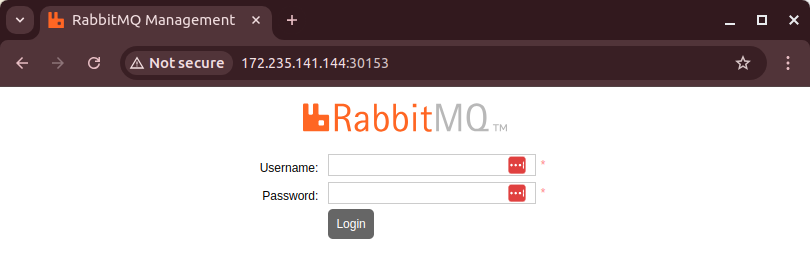
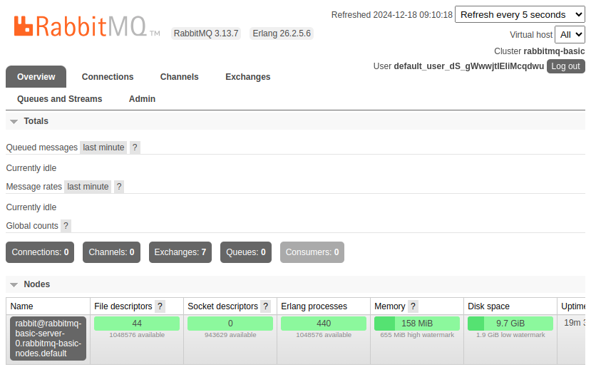
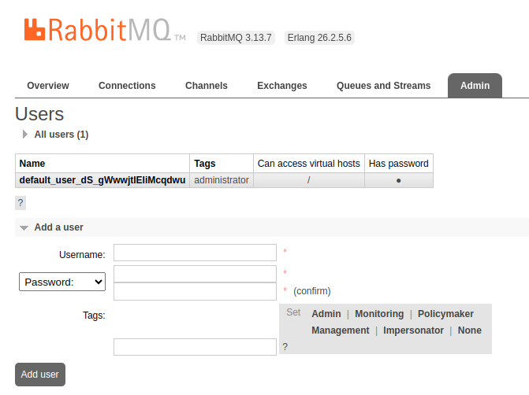
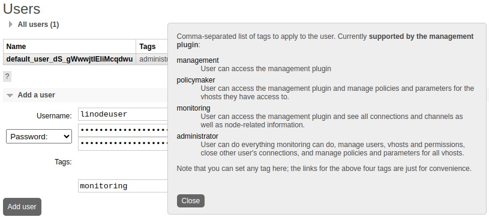
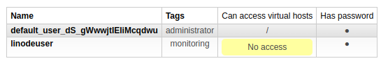
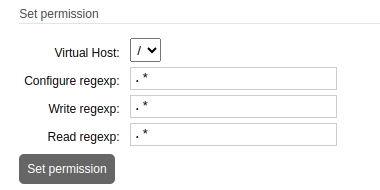
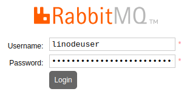

This guide provides step-by-step instructions for deploying RabbitMQ on Linode Kubernetes Engine (LKE) using the [RabbitMQ Kubernetes Operator](https://www.rabbitmq.com/kubernetes/operator/operator-overview). This is part of a set of tools that RabbitMQ provides to streamline its management on Kubernetes:

-   [**Cluster Kubernetes Operator**](https://www.rabbitmq.com/kubernetes/operator/operator-overview#cluster-operator): Automates the provisioning, management, and operation of RabbitMQ clusters on Kubernetes.
-   [**Messaging Topology Operator**](https://www.rabbitmq.com/kubernetes/operator/operator-overview#topology-operator): Manages messaging topologies within a RabbitMQ cluster deployed using the Cluster Kubernetes Operator.


The RabbitMQ maintainers advocate *against* manually handling the installation of RabbitMQ on Kubernetes and instead [recommend](https://www.rabbitmq.com/blog/2020/08/10/deploying-rabbitmq-to-kubernetes-whats-involved) using the above tools.


These operators extend Kubernetes management capabilities and leverage the Kubernetes API to provide native integration. This guide focuses specifically on the RabbitMQ Cluster Kubernetes Operator for deploying RabbitMQ, utilizing its built-in tooling for management and configuration. The Cluster Kubernetes Operator offers the following key features:

-   Provisioning of single-node and multi-node RabbitMQ clusters
-   Reconciliation to align the deployed clusters with its desired declarative state
-   Monitoring of RabbitMQ clusters
-   Scalability
-   Automated upgrades

## Before You Begin

1.  Read the [Getting Started with Linode](https://techdocs.akamai.com/cloud-computing/docs/getting-started) guide and create a Linode account if you do not already have one.

1.  Create a personal access token using the instructions in the [Manage personal access tokens](https://techdocs.akamai.com/cloud-computing/docs/manage-personal-access-tokens) guide.

1.  Follow the steps in the [Install kubectl](https://techdocs.akamai.com/cloud-computing/docs/getting-started-with-lke-linode-kubernetes-engine#install-kubectl) section of the [Getting started with LKE](https://techdocs.akamai.com/cloud-computing/docs/getting-started-with-lke-linode-kubernetes-engine) guide to install `kubectl`.

1.  Install the Linode CLI using the instructions in the [Install and configure the CLI](https://techdocs.akamai.com/cloud-computing/docs/install-and-configure-the-cli) guide.

1.  [Install `jq`](/docs/guides/using-jq-to-process-json-on-the-command-line/#install-jq-with-package-managers), a lightweight command line JSON processor.


This guide is written for a non-root user. Commands that require elevated privileges are prefixed with `sudo`. If you're not familiar with the `sudo` command, see the [Users and Groups](/docs/guides/linux-users-and-groups/) guide.


## Provision a Kubernetes Cluster

While there are several ways to create a Kubernetes cluster on Linode, this guide uses the [Linode CLI](https://github.com/linode/linode-cli) to provision resources.

1.  Use the Linode CLI to see available Kubernetes versions:

    ```command
    linode lke versions-list
    ```

    ```output
    ┌──────┐
    │ id   │
    ├──────┤
    │ 1.31 │
    ├──────┤
    │ 1.30 │
    └──────┘
    ```

    It is generally recommended to provision the latest version of Kubernetes unless specific requirements dictate otherwise.

1.  Use the following command to list available Linode plans, including plan ID, pricing, and performance details:

    ```command
    linode linodes types
    ```

    For more detailed pricing information, see the [Akamai Connected Cloud: Pricing](https://www.linode.com/pricing/) page.

1.  The examples in this guide use the **g6-standard-2** Linode, which features two CPU cores and 4GB of memory. Run the following command to display detailed information for this Linode plan in JSON format:

    ```command
    linode linodes types --label "Linode 4GB" --json --pretty
    ```

    ```output
    [
      {
        "addons": {...},
        "class": "standard",
        "disk": 81920,
        "gpus": 0,
        "id": "g6-standard-2",
        "label": "Linode 4GB",
        "memory": 4096,
        "network_out": 4000,
        "price": {
          "hourly": 0.036,
          "monthly": 24.0
        },
        "region_prices": [...],
        "successor": null,
        "transfer": 4000,
        "vcpus": 2
      }
    ]
    ```

1.  Use the following command to view available regions:

    ```command
    linode regions list
    ```

    Choosing a location geographically closest to yours is recommended.

1.  Use the following command to create a cluster with three nodes and auto-scaling. Replace `CLUSTER_NAME` with a name of your choosing, `KUBERNETES_VERSION` with your selected cluster version (e.g. 1.31), and `REGION_LABEL` with your desired region's label (e.g. `us-mia`):

    ```command
    linode lke cluster-create \
      --label  \
      --k8s_version  \
      --region  \
      --node_pools '[{
        "type": "g6-standard-2",
        "count": 3,
        "autoscaler": {
          "enabled": true,
          "min": 3,
          "max": 8
      }
    }]'
    ```

    Once your cluster is successfully created, you should see output similar to the following:

    ```output
    Using default values: {}; use the --no-defaults flag to disable defaults
    ┌────────┬──────────────────┬────────┬─────────────┬─────────────────────────────────┬──────┐
    │ id     │ label            │ region │ k8s_version │ control_plane.high_availability │ tier │
    ├────────┼──────────────────┼────────┼─────────────┼─────────────────────────────────┼──────┤
    │ 301629 │ rabbitmq-cluster │ us-mia │ 1.31        │ False                           │      │
    └────────┴──────────────────┴────────┴─────────────┴─────────────────────────────────┴──────┘
    ```

### Access the Kubernetes Cluster

To access your cluster, fetch the cluster credentials in the form of a `kubeconfig` file:

1.  Use the following command to retrieve the cluster's ID and store it in variable named `CLUSTER_ID`:

    ```command
    CLUSTER_ID=$(linode lke clusters-list --json | \
        jq -r \
          '.[] | select(.label == "rabbitmq-cluster") | .id')
    ```

1.  Create a hidden `.kube` folder in your user's home directory:

    ```command
    mkdir ~/.kube
    ```

1.  Retrieve the `kubeconfig` file and save it to `~/.kube/lke-config`:

    ```command
    linode lke kubeconfig-view --json "$CLUSTER_ID" | \
        jq -r '.[0].kubeconfig' | \
        base64 --decode > ~/.kube/lke-config
    ```

1.  Once you have the `kubeconfig` file saved, access your cluster by using `kubectl` and specifying the file:

    ```command
    kubectl get no --kubeconfig ~/.kube/lke-config
    ```

    ```output
    NAME                            STATUS   ROLES    AGE     VERSION
    lke295620-486011-09172e6e0000   Ready    <none>   6d21h   v1.31.0
    lke295620-486011-389bbe940000   Ready    <none>   6d21h   v1.31.0
    lke295620-486011-4045e9410000   Ready    <none>   6d21h   v1.31.0
    ```

5. To avoid specifying `--kubeconfig ~/.kube/lke-config` with every `kubectl` command, you can set an environment variable for your current terminal window session:

    ```command
    export KUBECONFIG=~/.kube/lke-config
    ```

    The config file is automatically used on subsequent kubectl commands in that terminal:

    ```command
    kubectl get no
    ```

## Set Up RabbitMQ on LKE

The following steps assume your LKE cluster is provisioned and your `KUBECONFIG` environment variable is set to `~/.kube/lke-config`.

1.  Install the Cluster Kubernetes Operator by applying the operator manifest:

    ```command
    kubectl apply -f \
    https://github.com/rabbitmq/cluster-operator/releases/latest/download/cluster-operator.yml
    ```

    You should see output similar to the following, indicating that various resources have been created:

    ```output
    namespace/rabbitmq-system created
    customresourcedefinition.apiextensions.k8s.io/rabbitmqclusters.rabbitmq.com created
    serviceaccount/rabbitmq-cluster-operator created
    role.rbac.authorization.k8s.io/rabbitmq-cluster-leader-election-role created
    clusterrole.rbac.authorization.k8s.io/rabbitmq-cluster-operator-role created
    clusterrole.rbac.authorization.k8s.io/rabbitmq-cluster-service-binding-role created
    rolebinding.rbac.authorization.k8s.io/rabbitmq-cluster-leader-election-rolebinding created
    clusterrolebinding.rbac.authorization.k8s.io/rabbitmq-cluster-operator-rolebinding created
    deployment.apps/rabbitmq-cluster-operator created
    ```

1.  Verify that the operator was successfully installed by listing all resources in the `rabbitmq-system` namespace:

    ```command
    kubectl get all -n rabbitmq-system
    ```

    You should see output similar to this:

    ```output
    NAME                                             READY   STATUS    RESTARTS   AGE
    pod/rabbitmq-cluster-operator-7cb8bd8f85-lv8fg   1/1     Running   0          29s

    NAME                                        READY   UP-TO-DATE   AVAILABLE   AGE
    deployment.apps/rabbitmq-cluster-operator   1/1     1            1           30s

    NAME                                                   DESIRED   CURRENT   READY   AGE
    replicaset.apps/rabbitmq-cluster-operator-7cb8bd8f85   1         1         1       30s
    ```

1.  To install RabbitMQ on your cluster, you need a configuration file specifying the declarative state of RabbitMQ cluster. Use a command line text editor, such as `nano`, to create a file named `rabbitmq-basic.yaml` in your user's home directory:

    ```command
    nano ~/rabbitmq-basic.yaml
    ```

    Populate the file with the following example configuration:

    ```file {title="rabbitmq-basic.yaml" lang="yaml"}
    apiVersion: rabbitmq.com/v1beta1
    kind: RabbitmqCluster
    metadata:
      name: rabbitmq-basic
    spec:
      service:
        type: NodePort
    ```

    To save the file and exit `nano`, press <kbd>CTRL</kbd>+<kbd>X</kbd>, followed by <kbd>Y</kbd> then <kbd>Enter</kbd>.

    
    To set a custom administrative username and password during the creation of the RabbitMQ cluster, modify `rabbitmq-basic.yaml` to include the following additional configuration. Insert values for `YOUR_USERNAME` and `YOUR_PASSWORD` as desired:

    ```file {title="rabbitmq-basic.yaml" lang="yaml" hl_lines="8-10"}
    apiVersion: rabbitmq.com/v1beta1
    kind: RabbitmqCluster
    metadata:
      name: rabbitmq-basic
    spec:
      service:
        type: NodePort
        additionalConfig: |
          default_user=YOUR_USERNAME
          default_pass=YOUR_PASSWORD
    ```
    

1.  Apply the configuration to your LKE cluster:

    ```command
    kubectl apply -f ./rabbitmq-basic.yaml
    ```

    ```output
    rabbitmqcluster.rabbitmq.com/rabbitmq-basic created
    ```

1.  Wait a few minutes for the configuration to be applied, then list all provisioned resources to confirm that RabbitMQ is installed:

    ```command
    kubectl get all
    ```

    The HTTP interface for RabbitMQ is exposed on port `15672`. By specifying the `NodePort` service in `rabbitmq-basic.yaml`, this port is mapped to the LKE cluster on port `31412` in the example output below. Similarly, the AQMP protocol, which operates on port `5672`, is mapped to port `30528` on the LKE cluster:

    ```output
    NAME                          READY   STATUS    RESTARTS   AGE
    pod/rabbitmq-basic-server-0   1/1     Running   0          93s

    NAME                           TYPE        CLUSTER-IP      EXTERNAL-IP   PORT(S)                                          AGE
    service/kubernetes             ClusterIP   10.128.0.1      <none>        443/TCP                                          6d22h
    service/rabbitmq-basic         NodePort    10.128.125.42   <none>        5672:30528/TCP,15672:31412/TCP,15692:32494/TCP   94s
    service/rabbitmq-basic-nodes   ClusterIP   None            <none>        4369/TCP,25672/TCP                               94s

    NAME                                     READY   AGE
    statefulset.apps/rabbitmq-basic-server   1/1     93s

    NAME                                          ALLREPLICASREADY   RECONCILESUCCESS   AGE
    rabbitmqcluster.rabbitmq.com/rabbitmq-basic   True               True               94s
    ```

1.  The ports shown in the example output *do not* match your specific LKE setup. Take note of the port number mapped to `15672` as it is referred to by  in later steps.

1.  View the logs from the RabbitMQ pod listed in the output above:

    ```command
    kubectl logs rabbitmq-basic-server-0
    ```

    Look for the `Time to start RabbitMQ` line in the log output, which indicates a successful startup of the application:

    ```output
    Defaulted container "rabbitmq" out of: rabbitmq, setup-container (init)
    ...
      ##  ##      RabbitMQ 4.0.5
      ##  ##
      ##########  Copyright (c) 2007-2024 Broadcom Inc and/or its subsidiaries
      ######  ##
      ##########  Licensed under the MPL 2.0. Website: https://rabbitmq.com
    ...
      Starting broker...2024-12-29 18:31:42.237065+00:00 [info] <0.216.0>
    ...
    2024-12-29 18:31:43.519971+00:00 [info] <0.591.0> Ready to start client connection listeners
    2024-12-29 18:31:43.521861+00:00 [info] <0.739.0> started TCP listener on [::]:5672
     completed with 6 plugins.
    ...
    2024-12-29 18:31:43.740056+00:00 [info] <0.10.0> Time to start RabbitMQ: 3598 ms
    ```

### Access RabbitMQ Remotely

To access the RabbitMQ management console, first retrieve the auto-generated credentials for the default administrative user. If you chose to set `default_user` and `default_pass` values in your `rabbitmq-basic.yaml` in the previous section, you can use those values instead of following these steps:

1.  Retrieve the username using the following command:

    ```command
    kubectl get secret rabbitmq-basic-default-user \
      -o jsonpath='{.data.username}' \
      | base64 --decode
    ```

    Your default administrative username typically start with `default_user_`. For example:

    ```output
    default_user_DoiEmUZy-rMJfFEa3gM
    ```

1.  Retrieve the password using the following command:

    ```command
    kubectl get secret rabbitmq-basic-default-user \
      -o jsonpath='{.data.password}' \
      | base64 --decode
    ```

    The password is randomly generated, for example:

    ```output
    3fNpEwB2R2s3oBibIZ9UDjeqCVgFcBq1
    ```

### Locate the External IP Address of the LKE Cluster

To access the RabbitMQ server and its management interface remotely, follow these steps to locate the cluster's external IP address and verify its availability.

1.  Retrieve the external IP addresses of your LKE cluster nodes using the following command:

    ```command
    kubectl get nodes \
      -o wide \
      | awk -v OFS='\t\t' '{print $1, $6, $7}'
    ```

    This command displays the node names, internal IPs, and external IPs. For example:

    ```output
    NAME		INTERNAL-IP		EXTERNAL-IP
    lke295620-486011-09172e6e0000		192.168.149.243		172.233.162.14
    lke295620-486011-389bbe940000		192.168.149.206		172.233.175.169
    lke295620-486011-4045e9410000		192.168.149.217		172.235.133.50
    ```

    In this example output, one of the nodes has an external IP address of `172.233.162.14`. Recall from the earlier `kubectl get all` command that port `31412` maps to the HTTP interface of the RabbitMQ server. Combine the external IP address of a node with this port to locate the RabbitMQ management service (e.g. `http://172.233.162.14:31412`).

    Record one of the external IP addresses shown in your output. It is referred to later by  in subsequent steps.

1.  Verify RabbitMQ's availability by retrieving its current configuration as a JSON object. Replace , , , and  with the administrative credentials and the node's external IP address and port:

    ```command
    curl --user ':' http://:/api/overview | jq
    ```

    This command retrieves an overview of the RabbitMQ server, for example:

    ```output
    {
      "management_version": "4.0.5",
      "rates_mode": "basic",
    ...
      "product_version": "4.0.5",
      "product_name": "RabbitMQ",
      "rabbitmq_version": "4.0.5",
      "cluster_name": "rabbitmq-basic",
    ...
      "erlang_version": "27.2",
    ...
    }
    ```

1.  To access the RabbitMQ web GUI, open a web browser and navigate to the following URL, replacing  and  with your actual external IP address and port number (e.g. `http://172.233.162.14:31412/#/`):

    ```command
    http://:/#/
    ```

    

1.  At the initial login prompt, enter the default administrative username and password:

    

## Test RabbitMQ with a Messaging Example

To test the RabbitMQ deployment, download the RabbitMQ management script, create an exchange and queue, and publish and retrieve messages.

### Download and Set Up the Management Script

1.  Download the management script using the `wget` command. Replace  and  with your actual external IP address and port number:

    ```command
    wget http://:/cli/rabbitmqadmin
    ```

1.  Make the script executable and move it to a directory included in your `PATH` (e.g `/usr/local/bin`):

    ```command
    chmod +x rabbitmqadmin
    sudo mv rabbitmqadmin /usr/local/bin/
    ```

### Create Exchange and Queue

1.  For convenience, set your RabbitMQ credentials and host information as environment variables. Replace , , , and  with your actual values:

    ```command
    export USERNAME=
    export PASSWORD=
    export HOST=
    export PORT=
    ```

1.  Create a [`fanout` style exchange](https://www.rabbitmq.com/tutorials/amqp-concepts#exchange-fanout) on the RabbitMQ server:

    ```command
    rabbitmqadmin \
      --username=$USERNAME --password=$PASSWORD \
      --host=$HOST --port=$PORT \
      declare exchange \
      name=test_fanout_exchange \
      type=fanout
    ```

    ```output
    exchange declared
    ```

1.  Create a queue for the exchange to hold messages:

    ```command
    rabbitmqadmin \
      --username=$USERNAME --password=$PASSWORD \
      --host=$HOST --port=$PORT \
      declare queue \
      name=fanout_queue \
      durable=true
    ```

    ```output
    queue declared
    ```

1.  Bind the queue to the exchange:

    ```command
    rabbitmqadmin \
      --username=$USERNAME --password=$PASSWORD \
      --host=$HOST --port=$PORT \
      declare binding \
      source=test_fanout_exchange \
      destination=fanout_queue
    ```

    ```output
    binding declared
    ```

### Test Message Publishing and Retrieval

1.  Publish a message to the exchange (and its bound queue):

    ```command
    rabbitmqadmin \
      --username=$USERNAME --password=$PASSWORD \
      --host=$HOST --port=$PORT \
      publish \
      exchange=test_fanout_exchange \
      routing_key=dummy_key \
      payload="Hello, world!"
    ```

    Upon success, the following message is displayed:

    ```output
    Message published
    ```

    
    While a routing key is not necessary for a `fanout` exchange, it is required for the `rabbitmqadmin` tool.
    

1.  Retrieve the messages from the queue:

    ```command
    rabbitmqadmin \
      --username=$USERNAME --password=$PASSWORD \
      --host=$HOST --port=$PORT \
      get \
      queue=fanout_queue
    ```

    The message should be displayed along with other details:

    ```output
    +-------------+----------------------+---------------+---------------+---------------+------------------+------------+-------------+
    | routing_key |       exchange       | message_count |    payload    | payload_bytes | payload_encoding | properties | redelivered |
    +-------------+----------------------+---------------+---------------+---------------+------------------+------------+-------------+
    | dummy_key   | test_fanout_exchange | 0             | Hello, world! | 13            | string           |            | False       |
    +-------------+----------------------+---------------+---------------+---------------+------------------+------------+-------------+
    ```å

## Create New Users

When connecting applications to your RabbitMQ deployment, it's recommended to create and use RabbitMQ users other than the [default administrative user](https://www.rabbitmq.com/docs/access-control#default-state).

1.  In the RabbitMQ web interface, click the **Admin** tab. This shows the list of users, which currently only includes the default administrative user:

    

1.  Click **Add a user**, then provide a username, password, and tag(s) to specify the user's permission level (e.g. **monitoring**).

    

1.  Click **Add user**. While the new user is added to the list of users, it does not yet have access to any virtual hosts:

    

### Set Permissions for the User on the Virtual Host

1.  Click the name of the newly created user. Click **Set permission** to allow full permissions on the default virtual host (`/`).

    

1.  Verify the newly created user's RabbitMQ management access by logging out and logging in as the new user:

    

### Send Test Requests to the RabbitMQ API

The following requests assume that your terminal session still uses the previously set environment variables for `HOST` and `PORT`:

1. Test publishing a message to the exchange using `curl` to send an authenticated request to the RabbitMQ API. Replace  and  with the credentials for your newly created user:

    ```command
    curl \
      -u ':' \
      -H "Content-Type: application/json" \
      -X POST \
      -d '{"properties":{},"routing_key":"dummy_key","payload":"Hello, curl!","payload_encoding":"string"}' \
      http://$HOST:$PORT/api/exchanges/%2f/test_fanout_exchange/publish
    ```

    
    The `%2f` in the request URL is the URL-encoded value for `/`, the name of the default virtual host.
    

    Upon success, you should see the following output:

    ```output
    {"routed":true}
    ```

1.  Retrieve the last two messages from the queue by sending an authenticated request:

    ```command
    curl \
      -u ':' \
      -H "Content-type:application/json" \
      -X POST \
      -d '{"count":2,"ackmode":"ack_requeue_true","encoding":"auto"}' \
      http://$HOST:$PORT/api/queues/%2f/fanout_queue/get | json_pp
    ```

    This command returns the following output, showing the messages retrieved from the queue:

    ```output
    [
       {
          "exchange" : "test_fanout_exchange",
          "message_count" : 1,
          "payload" : "Hello, world!",
          "payload_bytes" : 13,
          "payload_encoding" : "string",
          "properties" : [],
          "redelivered" : true,
          "routing_key" : "dummy_key"
       },
       {
          "exchange" : "test_fanout_exchange",
          "message_count" : 0,
          "payload" : "Hello, curl!",
          "payload_bytes" : 12,
          "payload_encoding" : "string",
          "properties" : [],
          "redelivered" : true,
          "routing_key" : "dummy_key"
       }
    ]
    ```