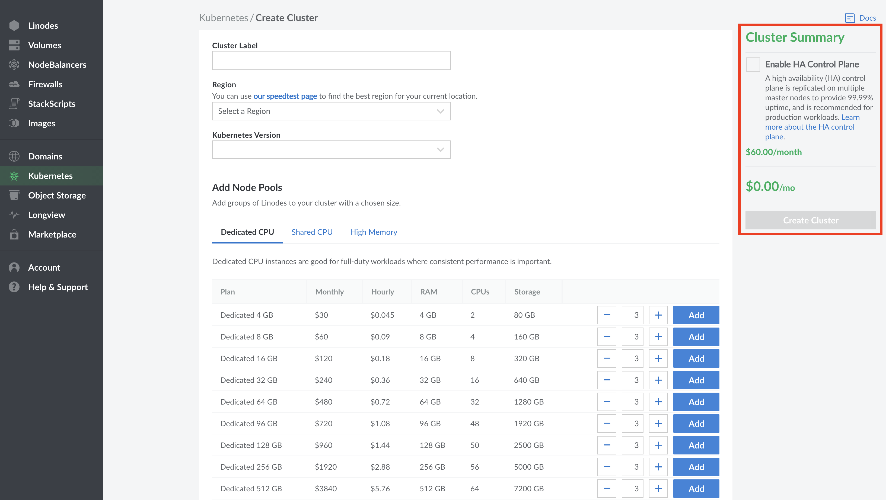
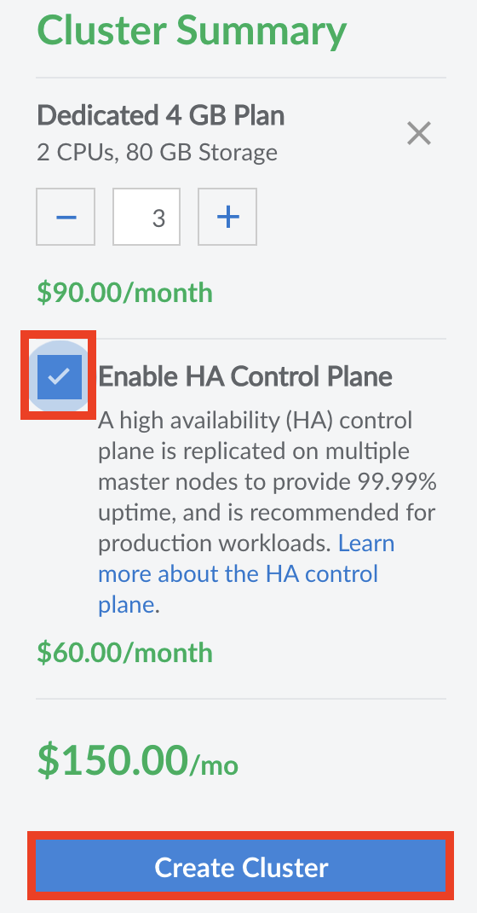
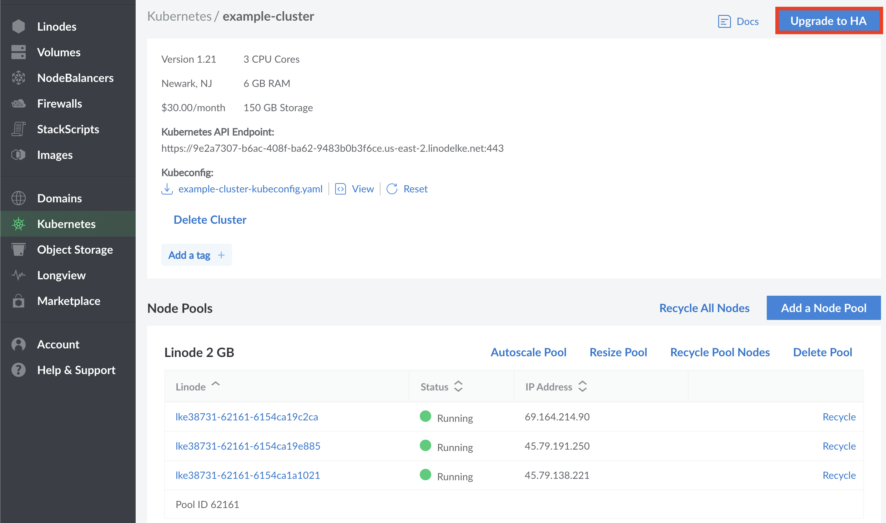
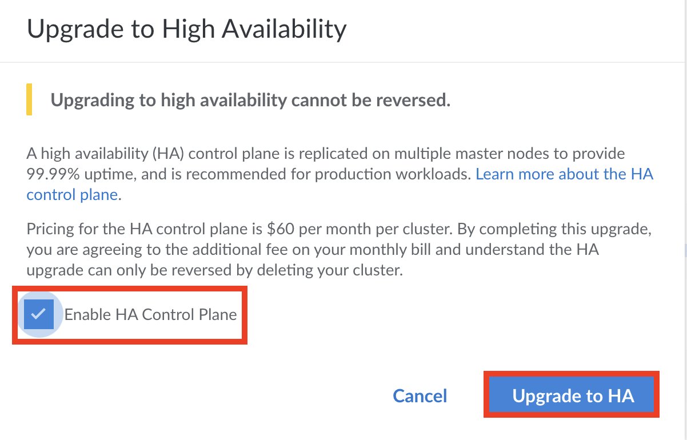

In LKE, enabling HA ([High Availability](/docs/guides/introduction-to-high-availability/)) creates additional replicas of your [control plane components](/docs/guides/beginners-guide-to-kubernetes-part-2-master-nodes-control-plane/), adding an additional layer of redundancy to your Kubernetes Cluster and ensuring 99.99% uptime for both the control plane and worker nodes. HA is an optional feature recommended for production workloads. It must be manually enabled either when creating a new cluster or editing an existing cluster.

Unlike other LKE configuration options, High Availability is an **optional billable service** that increases the overall operating cost of your cluster. For more information, see our [pricing page](https://www.linode.com/pricing/).


While upgrading to an HA cluster is always possible, **downgrading your cluster is not currently supported**. Enabling HA is an **irreversible** change for your cluster.

Additionally, enabling HA on an existing cluster results in the following changes:

- All nodes will be deleted and new nodes are created to replace them.
- Any local storage (such as `hostPath` volumes) will be erased.
- The upgrade process may take several minutes to complete, as nodes will be replaced on a rolling basis.


## Configuration Details of LKE HA

In more detail, the configuration of High Availability results in the following changes for Control Plane Components:

- **etcd** and **kube-api-server** increases from *one* to *three* replicas.
- All other components, the **Cloud Controller Manager**, **kube-scheduler**, and **kube-controller-manager**, increase from *one* to *two* replicas, with leader election put in place.

When multiple replicas are created as part of LKE HA they are always placed on separate infrastructure to better support uptime and redundancy. This configuration when applied maintains a guaranteed 99.99% uptime for control plane and worker nodes.

## Enabling HA During Cluster Creation

High Availability can be enabled during [cluster creation](/docs/guides/deploy-and-manage-a-cluster-with-linode-kubernetes-engine-a-tutorial/#create-an-lke-cluster) from the **Create a Kubernetes Cluster** page at any time.

1. From the **Create a Kubernetes Cluster** page, navigate to the **Cluster Summary** section.

   

1. Check the box next to the **Enable HA Control Plane option**.

1. Create additional configuration options as desired for your configuration. When you are satisfied with the configuration of your cluster, click the **Create Cluster** button in the *Cluster Summary* section.

   

Your cluster’s detail page will appear on the following page where you will see your Node Pools listed. From this page, you can edit your existing Node Pools, access your Kubeconfig file, and view an overview of your cluster’s resource details.

## Enabling HA on Existing Clusters

High Availability can be added to pre-existing clusters at any given time through the cluster's **Summary Page**.

1. To reach the summary page for the cluster, navigate first to the [Kubernetes section of the Cloud Manager](https://cloud.linode.com/kubernetes/clusters).

1. Select the Cluster by label that you would like to enable HA for. The summary page for the cluster appears.

1. To enable HA, select the **Upgrade to HA** button at the top of the page.

   

1. A new window appears, asking you to confirm all of the changes that come with High Availability. Read through the message and select the **Enable HA Control Plane** checkbox to confirm that you agree to the changes. Then click the **Upgrade to HA** button.

   

All clusters that have HA enabled will have an HA Cluster watermark on their summary page.

   
