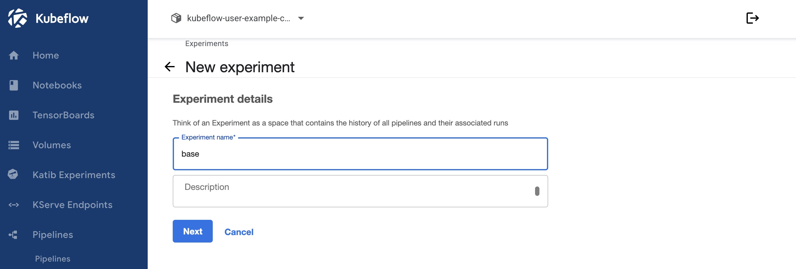
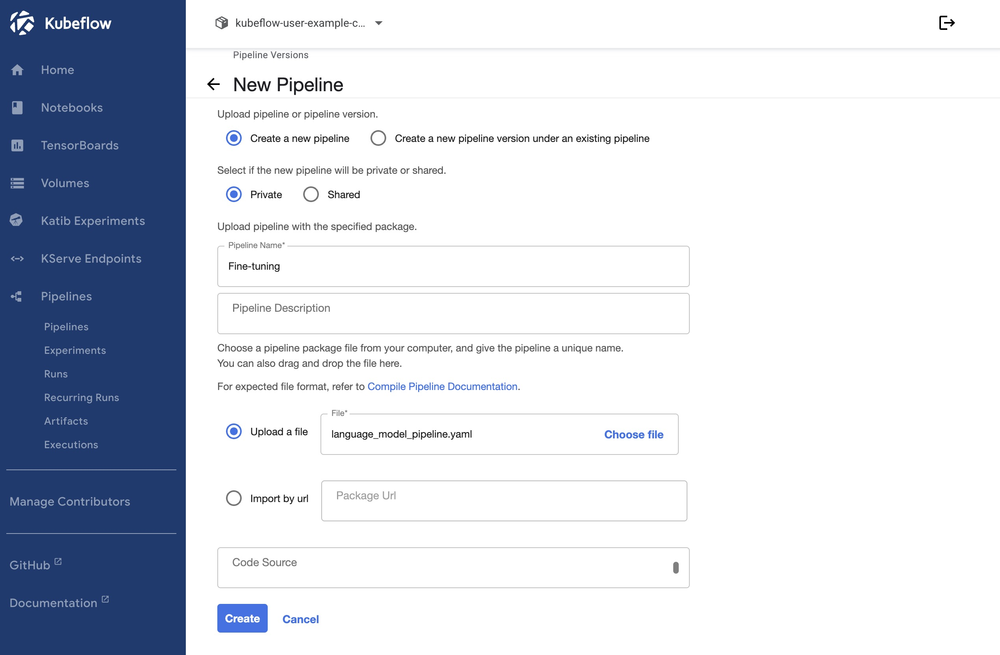
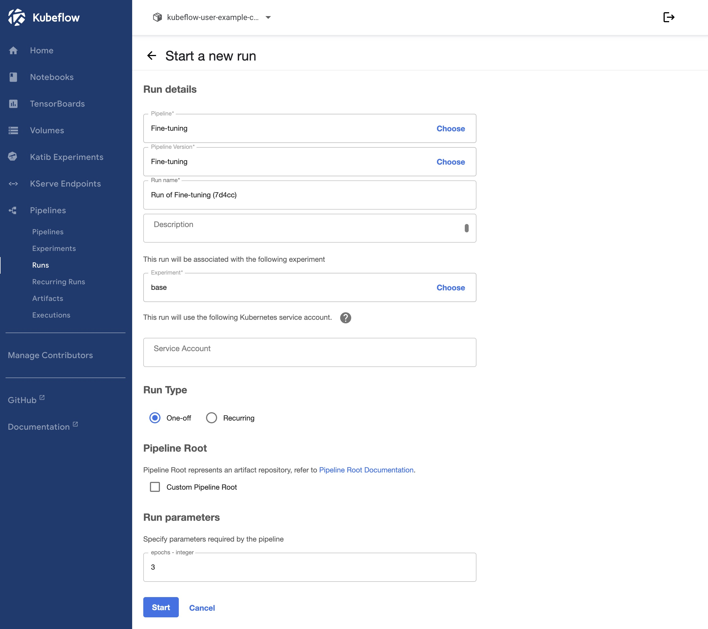

## Overview

Pre-trained AI models are now used across many fields and applications. When working within specialized domains or knowledge bases, these models often require adjustments to improve accuracy. However, these pre-trained models have not been trained on your company's private data and likely do not contain deep levels of details on specialized subjects.

Retrieval-Augmented Generation (RAG) is one method to aid in improving responses. When using the RAG method, the pre-trained model searches an indexed database of supplemental data during each query. This process is covered in the [Deploy a Chatbot and RAG Pipeline for AI Inferencing on LKE](/docs/guides/ai-chatbot-and-rag-pipeline-for-inference-on-lke/) guide. Since this data is not integrated directly into the model, it is easy to keep the data up-to-date or to replace the data entirely. When compared to training a model, the RAG method uses minimal resources to maintain and update the data, keeping the cost low and allowing for more frequent updates. However, since the model searches through this indexed data when queried, there is a performance impact.

Another approach to improve the accuracy of AI models is called fine-tuning. Fine-tuning is a technique that takes a pre-trained model and trains it further using your own custom data. This incorporates the data directly into the model and provides the model with a much deeper understanding of the material when compared to the RAG method. In addition, the model can process queries more quickly as there is no need to search through a supplemental database. While fine-tuning requires less permanent infrastructure, there can be significant investment in time and infrastructure when initially training the model.

The tutorial below shows you how to perform a fine-tuning job using training logic that implements supervised training via Masked Language Modeling (MLM). This strategy involves removing one word out of the sentence (masking it) and training the model to fill the blank using the data from the provided dataset.

## Components

### Infrastructure

- **LKE (Linode Kubernetes Engine):** LKE is Akamai’s managed Kubernetes service, enabling you to deploy containerized applications without needing to build out and maintain your own Kubernetes cluster. This tutorial deploys all software components to the same LKE cluster and node pool, though you should consider your own needs if using this solution for a production workload.
- **Linode GPUs (NVIDIA RTX 4000):** Akamai has several GPU virtual machines available, including NVIDIA RTX 4000 (used in this tutorial). NVIDIA’s Ada Lovelace architecture in the RTX 4000 VMs are adept at many AI tasks, including [inferencing](https://www.nvidia.com/en-us/solutions/ai/inference/) and [image generation](https://blogs.nvidia.com/blog/ai-decoded-flux-one/). While you can also deploy NVIDIA Quadro RTX 6000, these GPUs have not been tested with this workload and are not recommended for use in this tutorial.

### Software

- **Kubeflow:** This open-source software platform includes a suite of applications that are used for machine learning tasks. It is designed to be run on Kubernetes. While each application can be installed individually, this tutorial installs all default applications and makes specific use of the following:
    - **Kubeflow Pipeline:** Used to deploy pipelines, reusable machine learning workflows built using the Kubeflow Pipelines SDK.
- **ModernBert (base):** The [answerdotai/ModernBERT-base](https://huggingface.co/answerdotai/ModernBERT-base) model is used in this tutorial.

## Prerequisites

This tutorial requires you to have access to a few different services and local software tools. You should also have a custom dataset available to use for the pipeline.

- A [Cloud Manager](https://cloud.linode.com/) account is required to deploy Akamai Cloud services, including LKE.
- You should have [kubectl](https://kubernetes.io/docs/reference/kubectl/), [Kustomize](https://kustomize.io/), and [Helm](https://helm.sh/) installed on your local machine. These apps are used for managing your LKE cluster and installing applications to your cluster.
- To make the most of this tutorial, a **custom dataset** should be used. If none are provided, this tutorial uses the [wikitext-2-raw-v1](https://huggingface.co/datasets/Salesforce/wikitext/viewer/wikitext-2-raw-v1) subset of the WikiText language modeling dataset.


These instructions are intended as a proof of concept for testing and demonstration purposes. They are not designed as a complete production reference architecture.



The configuration instructions in this document are expected to not expose any services to the Internet. Instead, they run on the Kubernetes cluster's internal network, and to access the services it’s necessary to forward their ports locally first. This configuration is restricted by design to avoid accidentally exposing those services before they can be properly secured. Additionally, some services will run with no authentication or default credentials configured.
It’s not part of the scope of this document to cover the setup required to secure this configuration for a production deployment.


## Set up infrastructure

The first step is to provision the infrastructure needed for this tutorial and configure it with kubectl, so that you can manage it locally and install software through helm. As part of this process, we’ll also need to install the NVIDIA GPU operator at this step so that the NVIDIA cards within the GPU worker nodes can be used on Kubernetes.

1. **Provision an LKE cluster.** We recommend using at least 2 **RTX4000 Ada x1 Medium** GPU plans (plan ID: `g2-gpu-rtx4000a1-m`), though you can adjust this as needed. For reference, Kubeflow recommends 32 GB of RAM and 16 CPU cores for just their own application. This tutorial has been tested using Kubernetes v1.33, though other versions should also work, including any newer versions that are available on LKE. To learn more about provisioning a cluster, see the [Create a cluster](https://techdocs.akamai.com/cloud-computing/docs/create-a-cluster) guide.

    
    GPU plans are available in a limited number of data centers. Review the [GPU product documentation](https://techdocs.akamai.com/cloud-computing/docs/gpu-compute-instances#availability) to learn more about availability.
    

1. **Configure kubectl with the newly deployed cluster.** To do this, you need to download the kubeconfig YAML file for your new cluster and then reference it when running kubectl. For full instructions, see the [Manage a cluster with kubectl](https://techdocs.akamai.com/cloud-computing/docs/manage-a-cluster-with-kubectl) guide.

1. **Install the NVIDIA GPU operator for Kubernetes using Helm.** This enables the NVIDIA GPUs on the cluster’s worker nodes to run Kubernetes workloads. For additional instructions, see the [official NVIDIA docs](https://docs.nvidia.com/datacenter/cloud-native/gpu-operator/latest/getting-started.html).

    ```command
    helm repo add nvidia https://helm.ngc.nvidia.com/nvidia
    helm repo update
    helm install --wait --generate-name -n gpu-operator --create-namespace nvidia/gpu-operator --version=v24.9.1
    ```

    You can confirm that the operator has been installed on your cluster by running reviewing your pods. You should see a number of pods in the `gpu-operator` namespace.

    ```command
    kubectl get pods -n gpu-operator
    ```

### Deploy Kubeflow

Next, let’s deploy Kubeflow on the LKE cluster. These instructions deploy all of the components included by default in the Kubeflow platform (the single-command installation method), though the tutorial only makes use of Kubeflow Pipelines. You can modify this step to deploy each required application separately, if needed. See the [official installation instructions](https://github.com/kubeflow/manifests/tree/v1.9-branch?tab=readme-ov-file#installation) for additional details.

1. Download the [Kubeflow v1.9.1 manifests file](https://github.com/kubeflow/manifests/archive/refs/tags/v1.9.1.zip) and extract it to its own directory and open this directory in your terminal application.

1. Before installing Kubeflow, change the default password.

    1. Generate a random password. This password is needed later in the tutorial so be sure to save it.

        ```command
        openssl rand -base64 18
        ```

    1. Create a hash of this password, replacing PASSWORD with the password generated in the previous step. This outputs the password hash, which starts with `$2y$12$`.

        ```command
        htpasswd -bnBC 12 "" PASSWORD | tr -d ':\n'
        ```

    1. Edit the `common/dex/base/dex-passwords.yaml` file, replacing the value for `DEX_USER_PASSWORD` with the password hash generated in the previous step.

1. Run the following command to install Kubeflow.

    ```command
    while ! kustomize build example | kubectl apply -f -; do echo "Retrying to apply resources"; sleep 20; done
    ```

1. This may take some time to finish. Once it’s complete, verify that all pods are in the running state.

    ```command
    kubectl get pods -A
    ```

    You may notice a status of `CrashLoopBackOff` on one or more pods. This can be caused to a temporary issue with a persistent volume attaching to a worker node and should be resolved within a minute or so.

## Set up Kubeflow Pipeline

### Generate the pipeline YAML file

This tutorial employs a Python script to create the YAML file used within Kubeflow Pipeline. This YAML file describes each step of the pipeline workflow.

1. Create a virtual environment for Python on your local machine.

    ```command
    python3 -m venv .
    source bin/activate
    ```

1. Install the Kubeflow Pipelines package in this virtual environment.

    ```command
    pip install kfp
    ```

1. Download the [language_model_training.py](language_model_training.py) python script. This script generates a YAML file for use with Kubeflow Pipeline.

1. Run the script to generate the `pipeline.yaml` file. You can also add optional arguments to customize the YAML file to fit your own use case.

    ```command
    python3 language_model_training.py
    ```

    - `--model_name_or_path` (str): The model checkpoint for weights initialization. Don't set if you want to train a model from scratch.
    - `--config_overrides` (str): Override some existing default config settings when a model is trained from scratch. Example: `n_embd=10,resid_pdrop=0.2,scale_attn_weights=false,summary_type=cls_index`
    - `--config_name` (str): Pre-trained config name or path if not the same as `model_name`.
    - `--cache_dir` (str): Where do you want to store the pre-trained models downloaded from huggingface.co.
    - `--use_fast_tokenizer` (bool): Determines whether or not to use one of the fast tokenizer (backed by the `tokenizers` library).
    - `--model_revision` (str): The specific model version to use (can be a branch name, tag name or commit id).
    - `--token` (str): The token to use as HTTP bearer authorization for remote files. If not specified, will use the token generated when running `huggingface-cli login` (stored in `~/.huggingface`).
    - `--trust_remote_code` (bool): Whether to trust the execution of code from datasets/models defined on the Hub. This option should only be set to `True` for repositories you trust and in which you have read the code, as it will execute code present on the Hub on your local machine.
    - `--torch_dtype` (str): Override the default `torch.dtype` and load the model under this dtype. If `auto` is passed, the dtype is automatically derived from the model's weights. Select from `auto`, `bfloat16`, `float16`, or `float32`.
    - `--low_cpu_mem_usage` (bool): It is an option to create the model as an empty shell, then only materialize its parameters when the pre-trained weights are loaded. Setting this as `true` benefits loading time and RAM consumption.

1. Run `deactivate` to exit the Python virtual environment.

### Create the pipeline

1. Configure port forwarding on your cluster through kubectl so that you can access the Kubeflow interface from your local computer.

    ```command
    kubectl port-forward svc/istio-ingressgateway -n istio-system 8080:80
    ```

1. Open a web browser and navigate to the Kubeflow interface at http://localhost:8080. A login screen should appear.

    
    If the browser instead shows the error `Jwks doesn't have key to match kid or alg from Jwt`, there may be a previous JWT session that is interfering. Opening this URL in your browser's private or incognito mode should resolve this.
    

1. Log in with the username `user@example.com` and use the password that you created in a previous step.

1. Navigate to the Pipelines > Experiments page and click the button to create a new experiment. Enter a name and description for the experiment and click **Next**.

    

1. Next, navigate to Pipelines > Pipelines and click the **Upload Pipeline** link. Select **Upload a file** and use the **Choose file** dialog box to select the pipeline YAML file that was created in a previous step. Click the **Create** button to create the pipeline.

    

### Run the pipeline

1. Navigate to the Pipelines > Runs page and click **Create Run**. Within the Run details section, select the pipeline and experiment that you just created. Choose *One-off* as the **Run Type** and, within the **Run parameters** section, enter the number of epochs to run. Using the default model and datasets, a 3 epoch run takes 13 minutes to complete, a 30 epoch run takes 1 hour and 53 minutes, and a 100 epoch run takes 6 hours and 10 minutes.

    

1. Click **Start** to run the pipeline. This process takes some time, depending on the number of epochs you entered.

### Evaluate the result

After your model is trained on your custom data, you should evaluate the performace of the new model. Based on the results provided, you may need to keep iterating by adjusting the fine-tuning parameters, running additional epochs, or making adjustments to your dataset.