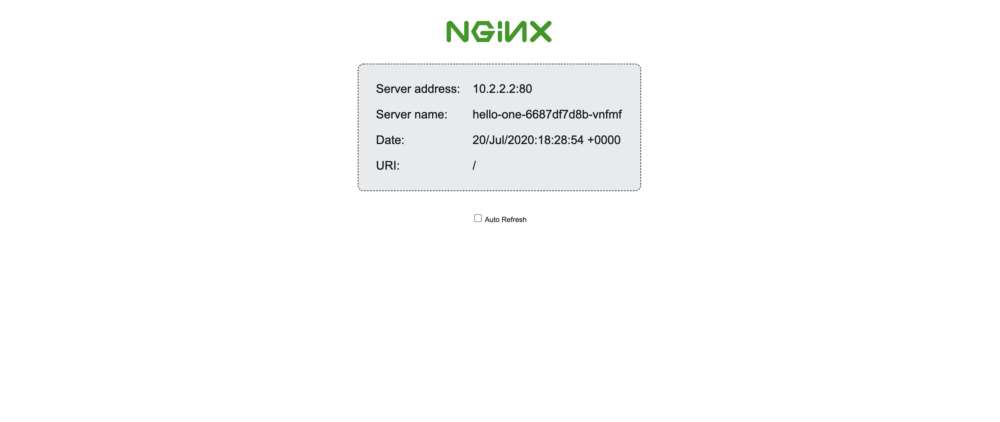
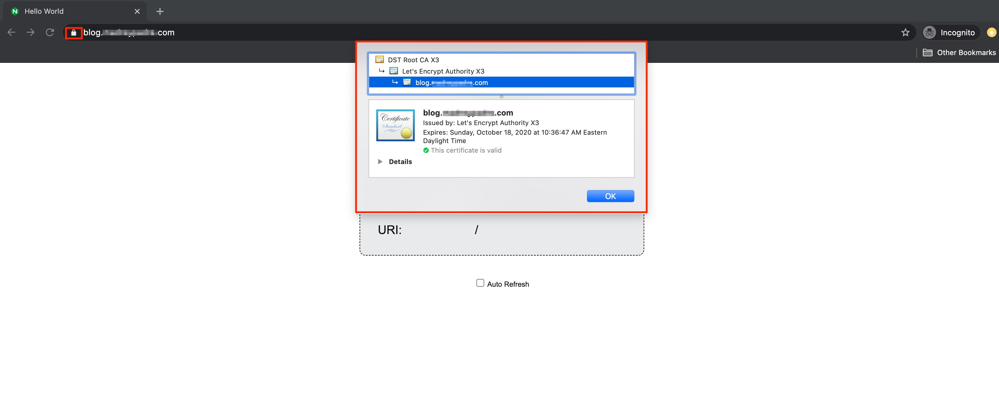

This guide will use an example Kubernetes Deployment and Service to demonstrate how to route external traffic to a Kubernetes application over HTTPS. This is accomplished using the [NGINX Ingress Controller](https://kubernetes.github.io/ingress-nginx/deploy/#using-helm), [cert-manager](https://cert-manager.io/docs/) and [Linode NodeBalancers](/docs/platform/nodebalancer/). The NGINX Ingress Controller uses Linode NodeBalancers, which are Linode's load balancing service, to route a Kubernetes Service's traffic to the appropriate backend Pods over HTTP and HTTPS. cert-manager creates a Transport Layer Security (TLS) certificate from the [Let’s Encrypt](https://letsencrypt.org/) certificate authority (CA) providing secure HTTPS access to a Kubernetes Service.


The [*Linode Cloud Controller Manager*](https://github.com/linode/linode-cloud-controller-manager) provides a way for a Kubernetes cluster to create, configure, and delete Linode NodeBalancers.  The Linode CCM is installed by default on clusters deployed with the [Linode Kubernetes Engine](/docs/kubernetes/deploy-and-manage-a-cluster-with-linode-kubernetes-engine-a-tutorial/) and the [Linode Terraform K8s module](/docs/applications/configuration-management/terraform/how-to-provision-an-unmanaged-kubernetes-cluster-using-terraform/).

To learn about the various configurations available for Linode NodeBalancers via [Kubernetes annotations](https://kubernetes.io/docs/concepts/overview/working-with-objects/annotations/), see [Getting Started with Load Balancing on a Linode Kubernetes Engine (LKE) Cluster](/docs/kubernetes/getting-started-with-load-balancing-on-a-lke-cluster/#configuring-your-linode-nodebalancers-with-annotations).

While Linode NodeBalancers do support ProxyProtocol, the Linode CCM does not. For this reason, the Linode Kubernetes Engine does not support ProxyProtocol yet. This means you cannot both terminate TLS inside your Kubernetes cluster and whitelist client IP addresses. ProxyProtocol support is coming soon to the Linode CCM.



## Before you Begin

1. This guide assumes that your Kubernetes cluster has the Linode Cloud Controller Manager (CCM) installed on your Kubernetes cluster. The Linode CCM is installed by default on clusters deployed with the [Linode Kubernetes Engine](/docs/kubernetes/deploy-and-manage-a-cluster-with-linode-kubernetes-engine-a-tutorial/) and the [Linode Terraform K8s module](http://localhost:1313/docs/applications/configuration-management/terraform/how-to-provision-an-unmanaged-kubernetes-cluster-using-terraform/).

    
The recommended way to deploy a Kubernetes cluster on Linode is using the Linode Kubernetes Engine (managed) or the Linode Terraform K8s module (unmanaged). However, to learn how to install the Linode CCM on a cluster that was not installed in the two ways mentioned above, see the [Installing the Linode CCM on an Unmanaged Kubernetes Cluster](/docs/kubernetes/installing-the-linode-ccm-on-an-unmanaged-kubernetes-cluster/) guide.
    

1. Install [Helm 3](/docs/kubernetes/how-to-install-apps-on-kubernetes-with-helm-3/#install-helm), and [kubectl](/docs/kubernetes/deploy-and-manage-a-cluster-with-linode-kubernetes-engine-a-tutorial/#install-kubectl) to your local environment.

1. Purchase a domain name from a reliable domain registrar. In a later section, you will use Linode's DNS Manager, to [create a new Domain](/docs/platform/manager/dns-manager/#add-a-domain) and to [add a DNS "A" record](/docs/platform/manager/dns-manager/#add-dns-records) for two subdomains, one named `blog` and another named `shop`. Your subdomains will point to the example Kubernetes Services you will create in this guide. The example domain names used throughout this guide are `blog.example.com` and `shop.example.com`.

    
Optionally, you can create a Wildcard DNS record, `*.example.com` and point your NodeBalancer's external IP address to it. Using a Wildcard DNS record, will allow you to expose your Kubernetes services without requiring further configuration using the Linode DNS Manager.
    

## Create an Example Application

The primary focus of this guide is to show you how to use the NGINX Ingress Controller and cert-manager to route traffic to a Kubernetes application over HTTPS. In this section, you will create two example applications that you will route external traffic to in a later section. The example application displays a page that returns information about the Deployment's current backend Pod. This sample application is built using NGINX's demo Docker image, [*nginxdemos/hello*](https://hub.docker.com/r/nginxdemos/hello/). You can replace the example applications used in this section with your own.

### Create your Application Service and Deployment

Each example manifest file creates three Pods to serve the application.

1. Using a text editor, create a new file named `hello-one.yaml` with the contents of the example file.

      
apiVersion: v1
kind: Service
metadata:
  name: hello-one
spec:
  type: ClusterIP
  ports:
  - port: 80
    targetPort: 80
  selector:
    app: hello-one
---
apiVersion: apps/v1
kind: Deployment
metadata:
  name: hello-one
spec:
  replicas: 3
  selector:
    matchLabels:
      app: hello-one
  template:
    metadata:
      labels:
        app: hello-one
    spec:
      containers:
      - name: hello-ingress
        image: nginxdemos/hello
        ports:
        - containerPort: 80
        

1. Create a second Service and Deployment manifest file named `hello-two.yaml` with the contents of the example file.

      
apiVersion: v1
kind: Service
metadata:
  name: hello-two
spec:
  type: ClusterIP
  ports:
  - port: 80
    targetPort: 80
  selector:
    app: hello-two
---
apiVersion: apps/v1
kind: Deployment
metadata:
  name: hello-two
spec:
  replicas: 3
  selector:
    matchLabels:
      app: hello-two
  template:
    metadata:
      labels:
        app: hello-two
    spec:
      containers:
      - name: hello-ingress
        image: nginxdemos/hello
        ports:
        - containerPort: 80
        

1. Use kubectl to create the Services and Deployments for your example applications.

        kubectl create -f hello-one.yaml
        kubectl create -f hello-two.yaml

    You should see a similar output:

    
service/hello-one created
deployment.apps/hello-one created
service/hello-two created
deployment.apps/hello-two created
    

1. Verify that the Services are running.

        kubectl get svc

    You should see a similar output:

    
NAME         TYPE        CLUSTER-IP       EXTERNAL-IP   PORT(S)   AGE
hello-one    ClusterIP   10.128.94.166    <none>        80/TCP    6s
hello-two    ClusterIP   10.128.102.187   <none>        80/TCP    6s
kubernetes   ClusterIP   10.128.0.1       <none>        443/TCP   18m
    

## Install the NGINX Ingress Controller

In this section you will use Helm to install the NGINX Ingress Controller on your Kubernetes Cluster. Installing the NGINX Ingress Controller will create Linode NodeBalancers that your cluster can make use of to load balance traffic to your example application.


If you would like a slightly deeper dive into the NGINX Ingress Controller, see our guide [Deploying NGINX Ingress on Linode Kubernetes Engine](https://www.linode.com/docs/kubernetes/how-to-deploy-nginx-ingress-on-linode-kubernetes-engine/).


1. Add the stable Helm charts repository to your Helm repos.

        helm repo add stable https://charts.helm.sh/stable

1. Update your Helm repositories.

        helm repo update

1. Install the NGINX Ingress Controller. This installation will result in a Linode NodeBalancer being created.

        helm install nginx-ingress stable/nginx-ingress

    You will see a similar output:

    
NAME: nginx-ingress
LAST DEPLOYED: Mon Jul 20 10:27:03 2020
NAMESPACE: default
STATUS: deployed
REVISION: 1
TEST SUITE: None
NOTES:
The nginx-ingress controller has been installed.
It may take a few minutes for the LoadBalancer IP to be available.
You can watch the status by running 'kubectl --namespace default get services -o wide -w nginx-ingress-controller'
...
   

### Create a Subdomain DNS Entries for your Example Applications

Now that Linode NodeBalancers have been created by the NGINX Ingress Controller, you can point a subdomain DNS entries to the NodeBalancer's public IPv4 address. Since this guide uses two example applications, it will require two subdomain entries.

1. Access your NodeBalancer's assigned external IP address.

        kubectl --namespace default get services -o wide -w nginx-ingress-controller

    The command will return a similar output:

    
NAME                          TYPE           CLUSTER-IP      EXTERNAL-IP    PORT(S)                      AGE     SELECTOR
my-nginx-ingress-controller   LoadBalancer   10.128.169.60   192.0.2.0   80:32401/TCP,443:30830/TCP   7h51m   app.kubernetes.io/component=controller,app=nginx-ingress,release=my-nginx-ingress
    

1. Copy the IP address of the `EXTERNAL IP` field and navigate to [Linode's DNS manager](https://cloud.linode.com/domains) and [add two "A" records](/docs/platform/manager/dns-manager/#add-dns-records) for the `blog` and `shop` subdomains. Ensure you point each record to the NodeBalancer's IPv4 address you retrieved in the previous step.

Now that your NGINX Ingress Controller has been deployed and your subdomains' A records have been created, you are ready to enable HTTPS on each subdomain.

## Create a TLS Certificate Using cert-manager

Before performing the commands in this section, ensure that your DNS has had time to propagate across the internet. This process can take a while. You can query the status of your DNS by using the following command, substituting `blog.example.com` for your domain.

    dig +short blog.example.com

If successful, the output should return the IP address of your NodeBalancer.


To enable HTTPS on your example application, you will create a Transport Layer Security (TLS) certificate from the [Let's Encrypt](https://letsencrypt.org/) certificate authority (CA) using the [ACME protocol](https://tools.ietf.org/html/rfc8555). This will be facilitated by [*cert-manager*](https://cert-manager.io/docs/), the native Kubernetes certificate management controller.

In this section you will install cert-manager using Helm and the required cert-manager [CustomResourceDefinitions](https://kubernetes.io/docs/concepts/extend-kubernetes/api-extension/custom-resources/) (CRDs). Then, you will create a [ClusterIssuer](https://cert-manager.io/docs/concepts/issuer/) resource to assist in creating a cluster's TLS certificate.


If you would like a deeper dive into cert-manager, see our guide [’’]().


### Install cert-manager
1. Install cert-manager's CRDs.

        kubectl apply --validate=false -f https://github.com/jetstack/cert-manager/releases/download/v0.15.1/cert-manager.crds.yaml

1. Create a cert-manager namespace.

        kubectl create namespace cert-manager

1. Add the Helm repository which contains the cert-manager Helm chart.

        helm repo add jetstack https://charts.jetstack.io

1. Update your Helm repositories.

        helm repo update

1. Install the cert-manager Helm chart. These basic configurations should be sufficient for many use cases, however, additional cert-manager configurable parameters can be found in [cert-manager's official documentation](https://hub.helm.sh/charts/jetstack/cert-manager).

        helm install \
        cert-manager jetstack/cert-manager \
        --namespace cert-manager \
        --version v0.15.1

1. Verify that the corresponding cert-manager pods are now running.

        kubectl get pods --namespace cert-manager

    You should see a similar output:

    
NAME                                       READY   STATUS    RESTARTS   AGE
cert-manager-579d48dff8-84nw9              1/1     Running   3          1m
cert-manager-cainjector-789955d9b7-jfskr   1/1     Running   3          1m
cert-manager-webhook-64869c4997-hnx6n      1/1     Running   0          1m
    

    
You should wait until all cert-manager pods are ready and running prior to proceeding to the next section.
    

### Create a ClusterIssuer Resource

1. Create a manifest file named `acme-issuer-prod.yaml` that will be used to create a ClusterIssuer resource on your cluster. Ensure you replace `user@example.com` with your own email address.

      
apiVersion: cert-manager.io/v1alpha2
kind: ClusterIssuer
metadata:
  name: letsencrypt-prod
spec:
  acme:
    email: user@example.com
    server: https://acme-v02.api.letsencrypt.org/directory
    privateKeySecretRef:
      name: letsencrypt-secret-prod
    solvers:
    - http01:
        ingress:
          class: nginx

      

    - This manifest file creates a ClusterIssuer resource that will register an account on an ACME server. The value of `spec.acme.server` designates Let's Encrypt's production ACME server, which should be trusted by most browsers.

        
Let's Encrypt provides a staging ACME server that can be used to test issuing trusted certificates, while not worrying about hitting [Let's Encrypt's production rate limits](https://letsencrypt.org/docs/rate-limits/). The staging URL is `https://acme-staging-v02.api.letsencrypt.org/directory`.
        

    - The value of `privateKeySecretRef.name` provides the name of a secret containing the private key for this user's ACME server account (this is tied to the email address you provide in the manifest file). The ACME server will use this key to identify you.
    - To ensure that you own the domain for which you will create a certificate, the ACME server will issue a challenge to a client. cert-manager provides two options for solving challenges, [`http01`](https://cert-manager.io/docs/configuration/acme/http01/) and [`DNS01`](https://cert-manager.io/docs/configuration/acme/dns01/). In this example, the `http01` challenge solver will be used and it is configured in the `solvers` array. cert-manager will spin up *challenge solver* Pods to solve the issued challenges and use Ingress resources to route the challenge to the appropriate Pod.

1. Create the ClusterIssuer resource:

        kubectl create -f acme-issuer-prod.yaml

    You should see a similar output:

      
clusterissuer.cert-manager.io/letsencrypt-prod created
      

## Enable HTTPS for your Application

### Create the Ingress Resource

1. Create an Ingress resource manifest file named `hello-app-ingress.yaml`. If you assigned a different name to your ClusterIssuer, ensure you replace `letsencrypt-prod` with the name you used. Replace all `hosts` and `host` values with your own application's domain name.

    
apiVersion: networking.k8s.io/v1beta1
kind: Ingress
metadata:
  name: hello-app-ingress
  annotations:
    kubernetes.io/ingress.class: "nginx"
    cert-manager.io/cluster-issuer: "letsencrypt-prod"
spec:
  tls:
  - hosts:
    - blog.example.com
    - shop.example.com
    secretName: example-tls
  rules:
  - host: blog.example.com
    http:
      paths:
      - backend:
          serviceName: hello-one
          servicePort: 80
  - host: shop.example.com
    http:
      paths:
      - backend:
          serviceName: hello-two
          servicePort: 80
    

    This resource defines how traffic coming from the Linode NodeBalancers is handled. In this case, NGINX will accept these connections over port 80, diverting traffic to both of your services via their domain names. The `tls` section of the Ingress resource manifest handles routing HTTPS traffic to the hostnames that are defined.

1. Create the Ingress resource.

        kubectl create -f hello-app-ingress.yaml

    You should see a similar output:

    
ingress.networking.k8s.io/hello-app-ingress created
    

1. Navigate to your app's domain or if you have been following along with the example, navigate to `blog.example.com` and then, `shop.example.com`. You should see the demo NGINX page load and display information about the Pod being used to serve your request.

      

    Use your browser to view your TLS certificate. You should see that the certificate was issued by *Let's Encrypt Authority X3*.

      

