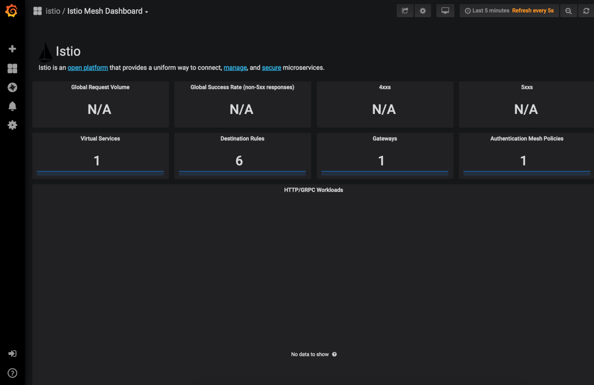
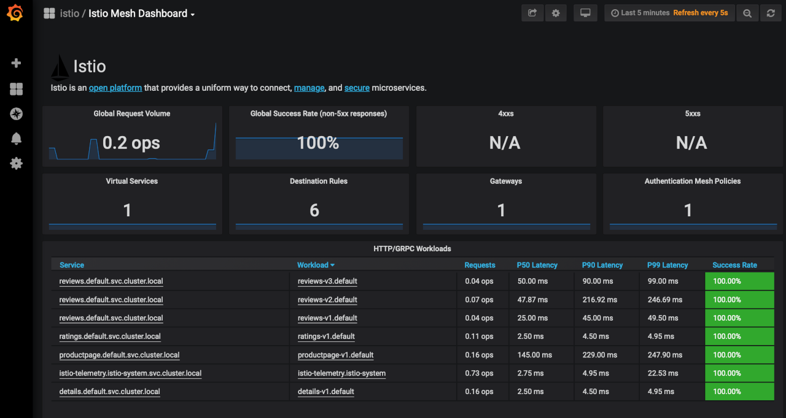
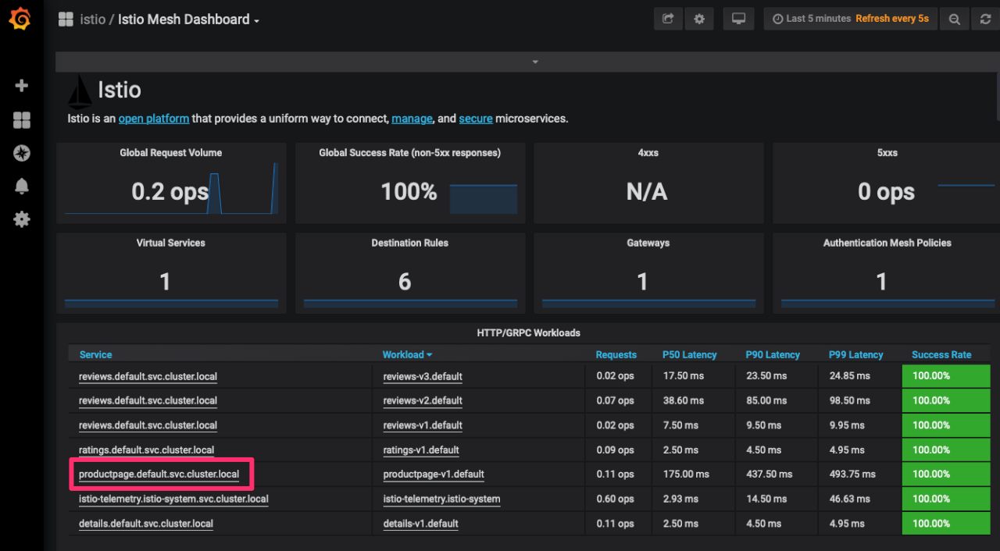
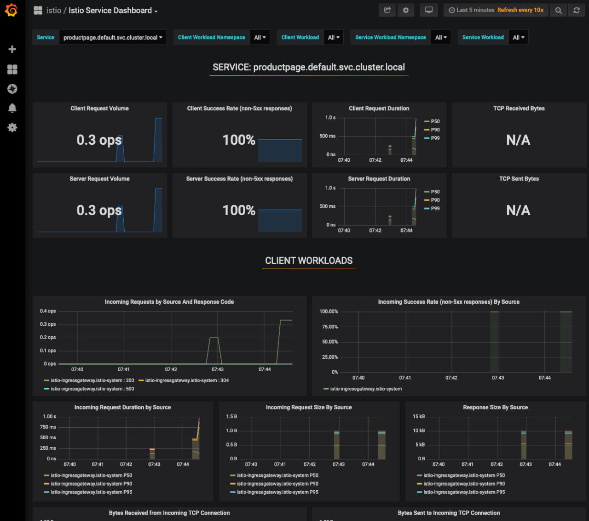

[Istio](https://istio.io) is a service mesh, or a network of microservices, that can handle tasks such as load balancing, service-to-service authentication, monitoring, and more. It does this by deploying sidecar proxies to intercept network data, which causes minimal disruption to your current application.

The Istio platform provides its own API and feature set to help you run a distributed microservice architecture. You can deploy Istio with few to no code changes to your applications allowing you to harness its power without disrupting your development cycle. In conjunction with Kubernetes, Istio provides you with insights into your cluster leading to more control over your applications.

In this guide you will complete the following tasks:

- [Create a Kubernetes Cluster](#create-your-kubernetes-cluster) and [Install Helm](#install-helm)
- [Install Istio with Helm Charts](#install-helm-charts)
- [Setup Envoy Proxies](#set-up-envoy-proxies)
- [Install the Istio Bookinfo App](#install-the-istio-bookinfo-app)
- [Visualize data with Istio's Grafana addon](#visualizations-with-grafana)


This guide’s example instructions will create several billable resources on your Linode account. If you do not want to keep using the example cluster that you create, be sure to delete it when you have finished the guide.

If you remove the resources afterward, you will only be billed for the hour(s) that the resources were present on your account. Consult the [Billing and Payments](/docs/guides/understanding-billing-and-payments/)  guide for detailed information about how hourly billing works and for a table of plan pricing.


## Before You Begin

Familiarize yourself with Kubernetes using our series [A Beginner's Guide to Kubernetes](/docs/guides/beginners-guide-to-kubernetes/) and [Advantages of Using Kubernetes](/docs/guides/kubernetes-use-cases/).

## Create Your Kubernetes Cluster



There are many ways to create a Kubernetes cluster. This guide will use the Linode k8s-alpha CLI.

1. To set it up the Linode k8s-alpha CLI, see the
[How to Deploy Kubernetes on Linode with the k8s-alpha CLI](/docs/guides/how-to-deploy-kubernetes-on-linode-with-k8s-alpha-cli/) guide and stop before the "Create a Cluster" section.

1. Now that your Linode K8s-alpha CLI is set up, You are ready to create your Kubernetes cluster. You will need **3 worker nodes** and **one master** for this guide. Create your cluster using the following command:

        linode-cli k8s-alpha create istio-cluster --node-type g6-standard-2 --nodes 3 --master-type g6-standard-2 --region us-east --ssh-public-key $HOME/.ssh/id_rsa.pub

1.  After the cluster is created you should see output with a similar success message:

    
Apply complete! Resources: 5 added, 0 changed, 0 destroyed.
Switched to context "istio-cluster-ka4OLOcgqHw@istio-cluster".
Your cluster has been created and your kubectl context updated.

Try the following command:
kubectl get pods --all-namespaces

Come hang out with us in #linode on the Kubernetes Slack! http://slack.k8s.io/


1.  If you visit the [Linode Cloud Manager](https://cloud.linode.com/), you will see your newly created cluster nodes on the Linodes listing page.

### Install Helm

Follow the instructions in the [How to Install Apps on Kubernetes with Helm](/docs/guides/how-to-install-apps-on-kubernetes-with-helm-3/) guide to install Helm on your cluster. Stop before the section on "Using Helm Charts to Install Apps".

## Install Istio

- For Linux or macOS users, use curl to pull the Istio project files. Even though you will use Helm charts to deploy Istio to your cluster, pulling the Istio project files will give you access to the sample `Bookinfo` application that comes bundled with this installation.

        curl -L https://git.io/getLatestIstio | ISTIO_VERSION=1.4.2 sh -

- If you are using Windows, you will need to go to Istio's [Github repo](https://github.com/istio/istio/releases) to find the download. There you will find the latest releases for Windows, Linux, and macOS.


Issuing the `curl` command will create a new directory, `istio-1.4.2`, in your current working directory. Ensure you move into the directory where you'd like to store your Istio project files before issuing the `curl` command.


### Install Helm Charts

1.  Add the Istio Helm repo:

        helm repo add istio.io https://storage.googleapis.com/istio-release/releases/1.4.2/charts/

1.  Update the helm repo listing:

        helm repo update

1.  Verify that you have the repo:

        helm repo list | grep istio.io

    The output should be similar to the following:

    
istio.io	https://storage.googleapis.com/istio-release/releases/1.4.2/charts/
    

1.  Install Istio's [Custom Resource Definitions](https://kubernetes.io/docs/concepts/extend-kubernetes/api-extension/custom-resources/#customresourcedefinitions) (CRD) with the helm chart. This command also creates a Pod namespace called `istio-system` which you will continue to use for the remainder of this guide.

        helm install istio-init istio.io/istio-init

     
NAME: istio-init
LAST DEPLOYED: Thu Dec 12 09:20:43 2019
NAMESPACE: default
STATUS: deployed
REVISION: 1
TEST SUITE: None


1.  Verify that all CRDs were successfully installed:

        kubectl get crds | grep 'istio.io' | wc -l

    You should see the following output:

    
23


       If the number is less, you may need to wait a few moments for the resources to finish being created.

1.  Install the Helm chart for Istio. There are [many installation options available](https://istio.io/docs/reference/config/installation-options/) for Istio. For this guide, the command enables Grafana, which you will use later to visualize your cluster's data.

        helm install istio istio.io/istio --set grafana.enabled=true

    
NAME: istio
LAST DEPLOYED: Thu Dec 12 09:23:02 2019
NAMESPACE: default
STATUS: deployed
REVISION: 1
TEST SUITE: None
NOTES:
Thank you for installing Istio.

Your release is named Istio.

To get started running application with Istio, execute the following steps:
1. Label namespace that application object will be deployed to by the following command (take default namespace as an example)

$ kubectl label namespace default istio-injection=enabled
$ kubectl get namespace -L istio-injection

2. Deploy your applications

$ kubectl apply -f <your-application>.yaml

For more information on running Istio, visit:
https://istio.io/


1.  Verify that the Istio services and Grafana are running:

        kubectl get svc

    The output should be similar to the following:

    
NAME                     TYPE           CLUSTER-IP       EXTERNAL-IP      PORT(S)                                                                                                                                      AGE
grafana                  ClusterIP      10.100.187.16    <none>           3000/TCP                                                                                                                                     3m35s
istio-citadel            ClusterIP      10.107.95.118    <none>           8060/TCP,15014/TCP                                                                                                                           3m35s
istio-galley             ClusterIP      10.96.238.193    <none>           443/TCP,15014/TCP,9901/TCP                                                                                                                   3m35s
istio-ingressgateway     LoadBalancer   10.99.127.171    104.237.148.33   15020:32094/TCP,80:31380/TCP,443:31390/TCP,31400:31400/TCP,15029:32477/TCP,15030:31679/TCP,15031:30483/TCP,15032:30118/TCP,15443:32529/TCP   3m35s
istio-pilot              ClusterIP      10.98.193.75     <none>           15010/TCP,15011/TCP,8080/TCP,15014/TCP                                                                                                       3m35s
istio-policy             ClusterIP      10.109.194.141   <none>           9091/TCP,15004/TCP,15014/TCP                                                                                                                 3m35s
istio-sidecar-injector   ClusterIP      10.101.155.91    <none>           443/TCP,15014/TCP                                                                                                                            3m35s
istio-telemetry          ClusterIP      10.97.162.208    <none>           9091/TCP,15004/TCP,15014/TCP,42422/TCP                                                                                                       3m35s
kubernetes               ClusterIP      10.96.0.1        <none>           443/TCP                                                                                                                                      137m
prometheus               ClusterIP      10.108.217.19    <none>           9090/TCP                                                                                                                                     3m35s


1.  You can also see the Pods that are running by using this command:

        kubectl get pods

    The output will look similar to this:

    
NAME                                    READY   STATUS      RESTARTS   AGE
grafana-c4bcd89cb-c4cpw                 1/1     Running     0          5m13s
istio-citadel-79945f56f7-vs8n8          1/1     Running     0          5m13s
istio-galley-54c44fd84c-wgg2r           1/1     Running     0          5m13s
istio-ingressgateway-bdffcd464-sw2w4    1/1     Running     0          5m13s
istio-init-crd-10-1.4.2-pv2dc           0/1     Completed   0          7m34s
istio-init-crd-11-1.4.2-f2pfr           0/1     Completed   0          7m34s
istio-init-crd-14-1.4.2-hrch4           0/1     Completed   0          7m34s
istio-pilot-6f64485fb4-k57f4            2/2     Running     2          5m14s
istio-policy-58456b9855-jvj8s           2/2     Running     2          5m13s
istio-sidecar-injector-b8fb8497-v89sl   1/1     Running     0          5m14s
istio-telemetry-bb59599bd-bnzpv         2/2     Running     3          5m13s
prometheus-fcdfd6cb5-6cjz2              1/1     Running     0          5m13s


1.  Before moving on, be sure that all Pods are in the `Running` or `Completed` status.

    
If you need to troubleshoot, you can check a specific Pod by using `kubectl`, remembering that you set the namespace to `istio-system`:

    kubectl describe pods pod_name -n pod_namespace

And check the logs by using:

    kubectl logs pod_name -n pod_namespace
    

### Set up Envoy Proxies

1.  Istio's service mesh runs by employing *sidecar proxies*. You will enable them by injecting them into the containers. This command is using the `default` namespace which is where you will be deploying the `Bookinfo` application.

        kubectl label namespace default istio-injection=enabled

    
This deployment uses automatic sidecar injection. Automatic injection can be disabled and [manual injection](https://istio.io/docs/setup/additional-setup/sidecar-injection/#manual-sidecar-injection) enabled during installation via `istioctl`. If you disabled automatic injection during installation, use the following command to modify the `bookinfo.yaml` file before deploying the application:

    kubectl apply -f <(istioctl kube-inject -f ~/istio-1.4.2/samples/bookinfo/platform/kube/bookinfo.yaml)


1.  Verify that the `ISTIO-INJECTION` was `enabled` for the `default` namespace:

        kubectl get namespace -L istio-injection

    You will get a similar output:

    
NAME          STATUS   AGE    ISTIO-INJECTION
default       Active   141m   enabled
kube-public   Active   141m
kube-system   Active   141m


## Install the Istio Bookinfo App

The Bookinfo app is a sample application that comes packaged with Istio. It features four microservices in four different languages that are all separate from Istio itself. The application is a simple single page website that displays a "book store" catalog page with one book, it's details, and some reviews. The microservices are:

- `productpage` is written in Python and calls `details` and `reviews` to populate the page.
- `details` is written in Ruby and contains the book information.
- `reviews` is written in Java and contains book reviews and calls `ratings`.
- `ratings` is written in Node.js and contains book ratings. There are three versions of this microservice in the application. A different version is called each time the page is refreshed.

1.  Navigate to the directory where you [installed Istio](#install-istio).

1.  The `bookinfo.yaml` file is the application manifest. It specifies all the service and deployment objects for the application. Here is just the `productpage` section of this file; feel free to browse the entire file:

    
...

apiVersion: v1
kind: Service
metadata:
  name: productpage
  labels:
    app: productpage
    service: productpage
spec:
  ports:
  - port: 9080
    name: http
  selector:
    app: productpage
---
apiVersion: v1
kind: ServiceAccount
metadata:
  name: bookinfo-productpage
---
apiVersion: apps/v1
kind: Deployment
metadata:
  name: productpage-v1
  labels:
    app: productpage
    version: v1
spec:
  replicas: 1
  selector:
    matchLabels:
      app: productpage
      version: v1
  template:
    metadata:
      labels:
        app: productpage
        version: v1
    spec:
      serviceAccountName: bookinfo-productpage
      containers:
      - name: productpage
        image: docker.io/istio/examples-bookinfo-productpage-v1:1.15.0
        imagePullPolicy: IfNotPresent
        ports:
        - containerPort: 9080
---


1.  Start the `Bookinfo` application with the following command:

        kubectl apply -f ~/istio-1.4.2/samples/bookinfo/platform/kube/bookinfo.yaml

    The following output results:

    
service/details created
serviceaccount/bookinfo-details created
deployment.apps/details-v1 created
service/ratings created
serviceaccount/bookinfo-ratings created
deployment.apps/ratings-v1 created
service/reviews created
serviceaccount/bookinfo-reviews created
deployment.apps/reviews-v1 created
deployment.apps/reviews-v2 created
deployment.apps/reviews-v3 created
service/productpage created
serviceaccount/bookinfo-productpage created
deployment.apps/productpage-v1 created


1.  Check that all the services are up and running:

        kubectl get services

    The output will look similar to the following:

    
NAME                     TYPE           CLUSTER-IP       EXTERNAL-IP      PORT(S)                                                                                                                                      AGE
details                  ClusterIP      10.101.227.234   <none>                 9080/TCP                                                                                                                                     43s
grafana                  ClusterIP      10.100.187.16    <none>                 3000/TCP                                                                                                                                     11m
istio-citadel            ClusterIP      10.107.95.118    <none>                 8060/TCP,15014/TCP                                                                                                                           11m
istio-galley             ClusterIP      10.96.238.193    <none>                 443/TCP,15014/TCP,9901/TCP                                                                                                                   11m
istio-ingressgateway     LoadBalancer   10.99.127.171    104.237.148.33   15020:32094/TCP,80:31380/TCP,443:31390/TCP,31400:31400/TCP,15029:32477/TCP,15030:31679/TCP,15031:30483/TCP,15032:30118/TCP,15443:32529/TCP   11m
istio-pilot              ClusterIP      10.98.193.75     <none>                 15010/TCP,15011/TCP,8080/TCP,15014/TCP                                                                                                       11m
istio-policy             ClusterIP      10.109.194.141   <none>                 9091/TCP,15004/TCP,15014/TCP                                                                                                                 11m
istio-sidecar-injector   ClusterIP      10.101.155.91    <none>                 443/TCP,15014/TCP                                                                                                                            11m
istio-telemetry          ClusterIP      10.97.162.208    <none>                 9091/TCP,15004/TCP,15014/TCP,42422/TCP                                                                                                       11m
kubernetes               ClusterIP      10.96.0.1        <none>                 443/TCP                                                                                                                                      145m
productpage              ClusterIP      10.110.84.77     <none>                 9080/TCP                                                                                                                                     43s
prometheus               ClusterIP      10.108.217.19    <none>                 9090/TCP                                                                                                                                     11m
ratings                  ClusterIP      10.110.206.217   <none>                 9080/TCP                                                                                                                                     43s
reviews                  ClusterIP      10.98.21.141     <none>                 9080/TCP


1.  Check that the Pods are all up:

        kubectl get pods

    The expected output should look similar, with all Pods running:

    
NAME                                    READY   STATUS      RESTARTS   AGE
details-v1-68fbb76fc-pz6jt              2/2     Running     0          74s
grafana-c4bcd89cb-c4cpw                 1/1     Running     0          11m
istio-citadel-79945f56f7-vs8n8          1/1     Running     0          11m
istio-galley-54c44fd84c-wgg2r           1/1     Running     0          11m
istio-ingressgateway-bdffcd464-sw2w4    1/1     Running     0          11m
istio-init-crd-10-1.4.2-pv2dc           0/1     Completed   0          14m
istio-init-crd-11-1.4.2-f2pfr           0/1     Completed   0          14m
istio-init-crd-14-1.4.2-hrch4           0/1     Completed   0          14m
istio-pilot-6f64485fb4-k57f4            2/2     Running     2          11m
istio-policy-58456b9855-jvj8s           2/2     Running     2          11m
istio-sidecar-injector-b8fb8497-v89sl   1/1     Running     0          11m
istio-telemetry-bb59599bd-bnzpv         2/2     Running     3          11m
productpage-v1-6c6c87ffff-r66dv         2/2     Running     0          74s
prometheus-fcdfd6cb5-6cjz2              1/1     Running     0          11m
ratings-v1-7bdfd65ccc-8zvk4             2/2     Running     0          74s
reviews-v1-5c5b7b9f8d-rwjgv             2/2     Running     0          74s
reviews-v2-569796655b-z5zc6             2/2     Running     0          74s
reviews-v3-844bc59d88-bwl2t             2/2     Running     0          74s


    
If you do not see all Pods running right away, you may need to wait a few moments for them to complete the initialization process.


1.  Check that the `Bookinfo` application is running. This command will pull the title tag and contents from the `/productpage` running on the `ratings` Pod:

        kubectl exec -it $(kubectl get pod -l app=ratings -o jsonpath='{.items[0].metadata.name}') -c ratings -- curl productpage:9080/productpage | grep -o "<title>.*</title>"

    The expected output will look like this:

    
&lt;title&gt;Simple Bookstore App&lt;/title&gt;


### Open the Istio Gateway

When checking the services in the previous section, you may have noticed none had external IPs. This is because Kubernetes services are private by default. You will need to open a gateway in order to access the app from the web browser. To do this you will use an Istio Gateway.

Here are the contents of the `bookinfo-gateway.yaml` file that you will use to open the gateway:


apiVersion: networking.istio.io/v1alpha3
kind: Gateway
metadata:
  name: bookinfo-gateway
spec:
  selector:
    istio: ingressgateway # use istio default controller
  servers:
  - port:
      number: 80
      name: http
      protocol: HTTP
    hosts:
    - "*"
---
apiVersion: networking.istio.io/v1alpha3
kind: VirtualService
metadata:
  name: bookinfo
spec:
  hosts:
  - "*"
  gateways:
  - bookinfo-gateway
  http:
  - match:
    - uri:
        exact: /productpage
    - uri:
        prefix: /static
    - uri:
        exact: /login
    - uri:
        exact: /logout
    - uri:
        prefix: /api/v1/products
    route:
    - destination:
        host: productpage
        port:
          number: 9080


  - The `Gateway` section sets up the `server` and specifies the `port` and `protocol` that will be opened through the gateway. Note that the `name` must match Istio's [named service ports standardization scheme](https://istio.io/docs/setup/additional-setup/requirements/).
  - In the `Virtual Service` section, the `http` field defines how HTTP traffic will be routed, and the `destination` field says where requests are routed.

1.  Apply the ingress gateway with the following command:

        kubectl apply -f ~/istio-1.4.2/samples/bookinfo/networking/bookinfo-gateway.yaml

    You should see the following output:

    
gateway.networking.istio.io/bookinfo-gateway created
virtualservice.networking.istio.io/bookinfo created


1.  Confirm that the gateway is open:

        kubectl get gateway

    You should see the following output:

    
NAME               AGE
bookinfo-gateway   1m


1. Access your ingress gateway's external IP. This IP will correspond to the value listed under `EXTERNAL-IP`.

        kubectl get svc istio-ingressgateway

    The output should resemble the following. In the example, the external IP is `192.0.2.0`. You will need this IP address in the next section to access your Bookinfo app.

    
NAME                   TYPE           CLUSTER-IP      EXTERNAL-IP      PORT(S)                                                                                                                                      AGE
istio-ingressgateway   LoadBalancer   10.99.127.171   104.237.148.33   15020:32094/TCP,80:31380/TCP,443:31390/TCP,31400:31400/TCP,15029:32477/TCP,15030:31679/TCP,15031:30483/TCP,15032:30118/TCP,15443:32529/TCP   52m



### Apply Default Destination Rules

Destination rules specify named service subsets and give them routing rules to control traffic to the different instances of your services.

1. Apply destination rules to your cluster:

        kubectl apply -f ~/istio-1.4.2/samples/bookinfo/networking/destination-rule-all.yaml

    The output will appear as follows:

    
destinationrule.networking.istio.io/productpage created
destinationrule.networking.istio.io/reviews created
destinationrule.networking.istio.io/ratings created
destinationrule.networking.istio.io/details created


1.  To view all the applied rules issue the following command:

        kubectl get destinationrules -o yaml

## Visualizations with Grafana

1.  Open a gateway for Grafana in the same way. Create a new file called `grafana-gateway.yaml`.

    
apiVersion: networking.istio.io/v1alpha3
kind: Gateway
metadata:
  name: grafana-gateway
  namespace: default
spec:
  selector:
    istio: ingressgateway # use istio default controller
  servers:
  - port:
      number: 15031
      name: http-grafana
      protocol: HTTP
    hosts:
    - "*"
---
apiVersion: networking.istio.io/v1alpha3
kind: VirtualService
metadata:
  name: grafana-vs
spec:
  hosts:
  - "*"
  gateways:
  - grafana-gateway
  http:
  - match:
    - port: 15031
    route:
    - destination:
        host: grafana
        port:
          number: 3000
---
apiVersion: networking.istio.io/v1alpha3
kind: DestinationRule
metadata:
  name: grafana
spec:
  host: grafana
  trafficPolicy:
    tls:
      mode: DISABLE


1.  Apply the ingress gateway with the following command:

        kubectl apply -f ~/istio-1.4.2/samples/bookinfo/networking/grafana-gateway.yaml

    You should see the following output:

    
gateway.networking.istio.io/grafana-gateway created
virtualservice.networking.istio.io/grafana-vs created
destinationrule.networking.istio.io/grafana created


1.  Confirm that the gateway is open:

        kubectl get gateway

    You should see the following output:

    
NAME               AGE
bookinfo-gateway   6m
grafana-gateway    48s


1.  Once this is completed, visit the following URL in your web browser to access your *Mesh Dashboard*:

        http://INGRESSGATEWAYIP:15031/dashboard/db/istio-mesh-dashboard

1.  You will see the Mesh Dashboard. There will be no data available yet.

    

1.  Send data by visiting a product page, replacing `192.0.2.0` with the value for your ingress gateway's external IP:

        http://192.0.2.0/productpage

    Refresh the page a few times to generate some traffic.

1.  Return to the dashboard and refresh the page to see the data.

    

    The *Mesh Dashboard* displays a general overview of Istio service mesh, the services that are running, and their workloads.

1.  To view a specific service or workload you can click on them from the *HTTP/GRPC Workloads* list. Under the *Service* column, click `productpage.default.svc.cluster.local` from the *HTTP/GRPC Workloads* list.

    

1.  This will open a Service dashboard specific to this service.

    

1.  Feel free to explore the other Grafana dashboards for more metrics and data. You can access all the dashboards from the dropdown menu at the top left of the screen.

## Removing Clusters and Deployments

If you at any time need to remove the resources created when following this guide, enter the following commands, confirming any prompts that appear:

    helm uninstall istio-init
    helm uninstall istio
    linode-cli k8s-alpha delete istio-cluster
