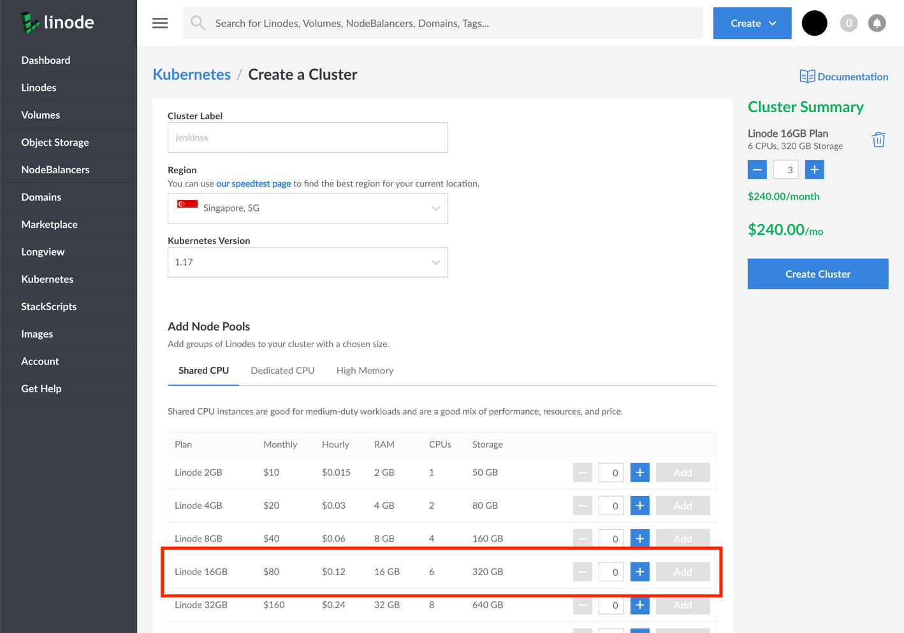
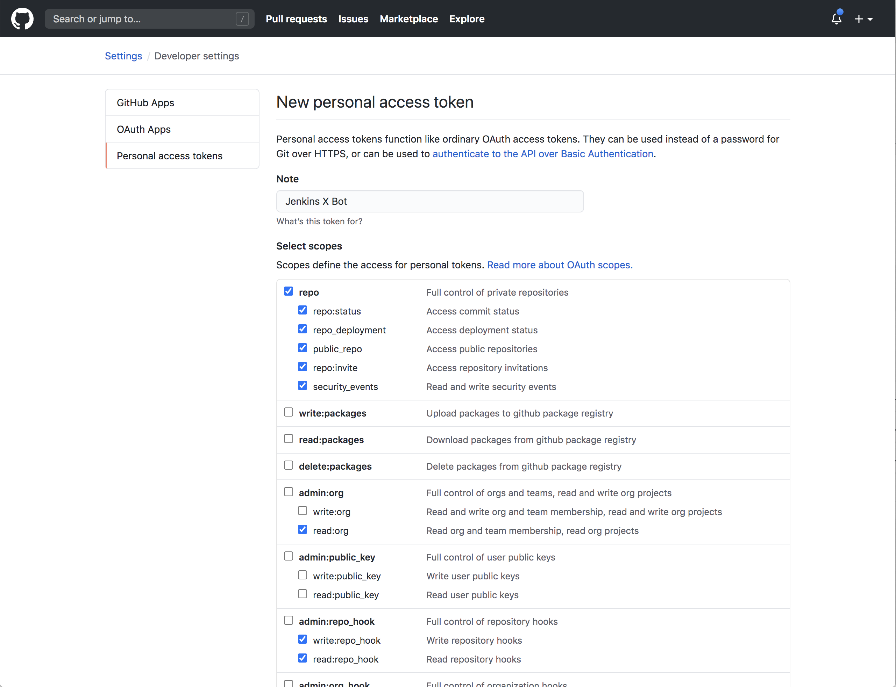

## What is Jenkins X?

[Jenkins X](https://jenkins-x.io) is CI/CD tool that automates the management of development environments and the promotion of new versions of applications between environments. This guide illustrates how to install Jenkins X on Linode Kubernetes Engine.

## Before You Begin

1. You will need a personal GitHub account. If you don't have one, [you can register here](https://github.com/join).
1. You need a GitHub account for your bot. This bot automates actions like triaging issues, merging Pull Requests, etc. [You can register your bot account here](https://github.com/join).
1. You will need an account on DockerHub. If you don't have one, [you can register here](https://hub.docker.com/signup).

## Create an LKE Cluster

Follow the instructions in [Deploying and Managing a Cluster with Linode Kubernetes Engine Tutorial](/docs/guides/deploy-and-manage-a-cluster-with-linode-kubernetes-engine-a-tutorial/) to create and connect to an LKE cluster.

We recommend using three 16GB Linodes to start with.

You can verify that the installation is successful with:

    kubectl get nodes

The output should similar to:


NAME                        STATUS   ROLES    AGE   VERSION
lke7189-9006-5f05145fc9a3   Ready    <none>   8h    v1.17.3
lke7189-9006-5f051460a1e2   Ready    <none>   8h    v1.17.3
lke7189-9006-5f0514617a87   Ready    <none>   8h    v1.17.3


## Install jx

To install Jenkins X, you need the `jx` command-line tool. You can find the instruction on [how to install `jx` on the official documentation.](https://jenkins-x.io/docs/install-setup/install-binary/)

You can verify that the installation is successful with:

    jx version

The output should be similar to:


Version        2.1.80
Commit         b2bd447
Build date     2020-06-23T15:34:17Z
Go version     1.13.8
Git tree state clean


## Bootstrap Jenkins X


If you used the `export` command with the KUBECONFIG variable so that you can use kubectl to connect to your cluster, you will need to perform the following steps in the same terminal window where you executed that command in order for `jx` to also be able to connect to your cluster.


1.   Create a new folder, navigate to the new folder, and execute the `jx boot` command to start a new project:

        mkdir jenkins-x
        cd jenkins-x
        jx boot

    The command prompts the following message:

    
Creating boot config with defaults, as not in an existing boot directory with a git repository.
No Jenkins X pipeline file jenkins-x.yml or no jx boot requirements file jx-requirements.yml found. You are not running this command from inside a Jenkins X Boot git clone
To continue we will clone https://github.com/jenkins-x/jenkins-x-boot-config.git @ master to jenkins-x-boot-config
? Do you want to clone the Jenkins X Boot Git repository? [? for help] (Y/n)


    _Yes_ is the default answer, so you can press enter and continue to the next step.

1.  In the next step, the CLI clones the Jenkins X configuration repo and validates your configuration.

    The command-line tool expects the cluster name to be in the format `<project id>_<zone>_<cluster name>` — which is the default if you want to use Google Kubernetes Engine. Since Linode Kubernetes Engine doesn't follow the same naming pattern, the validation fails:

    
Cloning https://github.com/jenkins-x/jenkins-x-boot-config.git @ master to jenkins-x-boot-config
Attempting to resolve version for boot config https://github.com/jenkins-x/jenkins-x-boot-config.git from https://github.com/jenkins-x/jenkins-x-versions.git
Booting Jenkins X

STEP: validate-git command: /bin/sh -c jx step git validate in dir: /tmp/jenkinsx/jenkins-x-boot-config/env

STEP: verify-preinstall command: /bin/sh -c jx step verify preinstall --provider-values-dir="kubeProviders" in dir: /tmp/jenkinsx/jenkins-x-boot-config

error: : unable to parse lke7389 as &lt;project id&gt;_&lt;zone&gt;_&lt;cluster name&gt;
error: failed to interpret pipeline file /tmp/jenkinsx/jenkins-x-boot-config/jenkins-x.yml: failed to run '/bin/sh -c jx step verify preinstall --provider-values-dir="kubeProviders"' command in directory '/tmp/jenkinsx/jenkins-x-boot-config', output: ''


    But don't worry, this error can be fixed. If you inspect the current folder, you should notice that `jx` created a `jenkins-x-boot-config` folder. In that folder, there's a `jx-requirements.yml` file with the details of your cluster.

    Open that with your favourite editor and identify the line that starts with: `provider: gke`. You should change that to `provider: kubernetes`.

    
autoUpdate:
  enabled: false
  schedule: ""
bootConfigURL: https://github.com/jenkins-x/jenkins-x-boot-config.git
cluster:
  gitKind: github
  gitName: github
  gitServer: https://github.com
  namespace: jx
  provider: gke # <- you should change this line to "kubernetes"!


1.  It's time to run the `jx boot` command again, but this time from within the `jenkins-x-boot-config` folder:

        cd jenkins-x-boot-config
        jx boot

    This time, the command stops at a different step, which has you confirm you'd like to run `jx` on a service that is not GKE or EKS:

    
Attempting to resolve version for boot config https://github.com/jenkins-x/jenkins-x-boot-config from https://github.com/jenkins-x/jenkins-x-versions.git
Booting Jenkins X

STEP: validate-git command: /bin/sh -c jx step git validate in dir: /tmp/jenkinsx/jenkins-x-boot-config/env

STEP: verify-preinstall command: /bin/sh -c jx step verify preinstall --provider-values-dir="kubeProviders" in dir: /tmp/jenkinsx/jenkins-x-boot-config

jx boot has only been validated on GKE and EKS, we'd love feedback and contributions for other Kubernetes providers
? Continue execution anyway? (Y/n)


    _Yes_ is the default answer, so press enter and continue executing.

1.  The next question is the cluster name:

    
? Cluster name


    Enter `jenkins-x-lke`.

1.  Next, make yourself the Git Owner.

    
? Git Owner name for environment repositories


    Type in your GitHub username, and press enter.

1.  In the next step, name the users you wish to associate as an approver. This should include your username and the names of any other members of your team which you wish to grant this ability, and the input should be a comma separated list.

    
Environment repos will be private, if you want to create public environment repos, please set environmentGitPublic to true in jx-requirements.yml
? Comma-separated git provider usernames of approvers for development environment repository


1.  Pay attention to the next question, which describes that the webhooks will be called over HTTP, not HTTPS:

    
Locking version stream https://github.com/jenkins-x/jenkins-x-versions.git to release v1.0.529. Jenkins X will use this release rather than master to resolve all versions from now on.
writing the following to the OWNERS file for the development environment repository:
approvers:
- &lt;your_GitHub_username&gt;
reviewers:
- &lt;your_GitHub_username&gt;
WARNING: TLS is not enabled so your webhooks will be called using HTTP. This means your webhook secret will be sent to your cluster in the clear. See https://jenkins-x.io/docs/getting-started/setup/boot/#ingress for more information
? Do you wish to continue? [? for help] (y/N)


    Notice how _No_ is the default answer. However, you should answer **Yes** and move on to the next question.

1.  In the next steps, `jx` configures several components in your cluster. It might take a while before you're requested to interact with the terminal. When you do, the next questions are about the Jenkins X admin:

    
? Jenkins X Admin Username (admin)
? Jenkins X Admin Password


    You should choose a name and a password for the admin user.

1.  Next, you enter in the info about your Jenkins X Bot.

    The bot will help you triage issues, Pull Requests and execute chores. In this part, you should enter the details for your bot (the GitHub account that you created in advance):

    
? Pipeline bot Git username
? Pipeline bot Git email address
? Pipeline bot Git token


    You can create a token for your bot by [visiting this URL](https://github.com/settings/tokens/new?scopes=repo,read:user,read:org,user:email,write:repo_hook,delete_repo).

    
Please note that you should create the token with the Bot's account and not yours.


    

1.  You can use the same token for the next question (and just press enter):

    
? HMAC token, used to validate incoming webhooks. Press enter to use the generated token


1.  The next question is crucial, as it concerns how Jenkins X will interact with the docker registry:

    
? Do you want to configure non default Docker Registry? (y/N)


    Linode does not offer a container registry at the moment, so you will use Docker Hub as your container registry. You should answer _Yes_ which is **NOT** the default option. Answer the following questions accordingly:

    
? Do you want to configure non default Docker Registry? Yes
? Docker Registry Url &lt;accept-the-default-value&gt;
? Docker Registry username &lt;enter-your-dockerhub-username&gt;
? Docker Registry password &lt;enter-your-dockerhub-password&gt;
? Docker Registry email &lt;enter-your-dockerhub-email&gt;


The installation should complete with the following output:


Verifying the git config
Verifying username &lt;bot-name&gt; at git server github at https://github.com
Found 1 organisation in git server https://github.com: learnk8s
Validated pipeline user &lt;bot-name&gt; on git server https://github.com
Git tokens seem to be setup correctly
Installation is currently looking: GOOD
Using namespace 'jx' from context named 'lke7411-ctx' on server 'https://c50d6328-b182-4fe9-9746-7f6e2b2e1b4d.ap-south-1.linodelke.net:443'.


Jenkins X is installed!

If you inspect your GitHub profile, you might have noticed that there are three new private repositories:

- `environment-jenkins-x-lke-dev`
- `environment-jenkins-x-lke-staging`
- `environment-jenkins-x-lke-prod`

The repositories hold the configuration for each environment.

## Your First Project

In this part, you will set up a CI/CD pipeline for a Java (Spring Boot) application. The same steps are valid for any other language or framework.

1.  You should fork the [Jenkins X Demo repository from LearnK8s](https://github.com/learnk8s/jenkins-x-demo).

1.  Next, clone the repository locally and change your current directory, being sure to add your GitHub username to the cloned repository's address:

        git clone git@github.com:your-github-username/jenkins-x-demo
        cd jenkins-x-demo

1.  You can import the project in Jenkins X with the following command:

        jx import

    You will see a similar output to this:

    
PipelineActivity for &lt;your-gh-username&gt;-jenkins-x-demo-master-1
upserted PipelineResource meta-&lt;your-gh-username&gt;-jenkins-x-dlncr for the git repository https://github.com/&lt;your-gh-username&gt;/jenkins-x-demo.git
upserted Task meta-&lt;your-gh-username&gt;-jenkins-x-dlncr-meta-pipeline-1
upserted Pipeline meta-&lt;your-gh-username&gt;-jenkins-x-dlncr-1
created PipelineRun meta-&lt;your-gh-username&gt;-jenkins-x-dlncr-1
created PipelineStructure meta-&lt;your-gh-username&gt;-jenkins-x-dlncr-1

Watch pipeline activity via:    jx get activity -f jenkins-x-demo -w
Browse the pipeline log via:    jx get build logs &lt;your-gh-username&gt;/jenkins-x-demo/master
You can list the pipelines via: jx get pipelines
When the pipeline is complete:  jx get applications

For more help on available commands see: https://jenkins-x.io/developing/browsing/


1.  You can now run the following command to follow the pipeline output:

        jx get build logs <yourgithubuser>/jenkins-x-demo/master

    The pipeline will take around three or four minutes to complete, as it has to:

    - Compile the project.
    - Create tags in the repository.
    - Build and push the container image to Docker Hub.
    - Package the Helm chart for the application.

1.  In the last step of the pipeline, Jenkins X raises a Pull Request to the repository that holds the configuration of your staging environment (created by default during installation).

    At the end of the pipeline you will see the following output:

    
Created Pull Request: https://github.com/<your-gh-username>/environment-jenkins-x-lke-staging/pull/1


    The Pull Request is an automatic promotion to the staging environment. If you merge the Pull Request, the application is automatically promoted to the staging environment.

    You can merge the Pull Request to see the pipeline applying the changes in the staging environment.

    If the promotion is successful, you can inspect the app with:

        jx get applications

    
APPLICATION      STAGING PODS URL
jenkins-x-demo   0.0.10       http://jenkins-x-staging.178.79.175.247.nip.io


It might take some time for your application to start. However, when it's started, you can visit the app at the URL provided and see it running.
