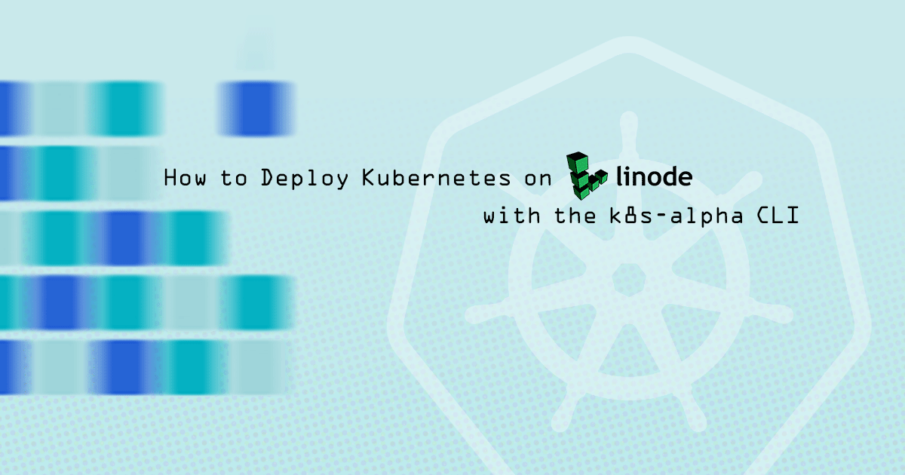


This guide's example instructions will create several billable resources on your Linode account. If you do not want to keep using the example cluster that you create, be sure to [delete it](#delete-a-cluster) when you have finished the guide.

If you remove the resources afterward, you will only be billed for the hour(s) that the resources were present on your account. Consult the [Billing and Payments](/docs/guides/understanding-billing-and-payments/) guide for detailed information about how hourly billing works and for a table of plan pricing.


## What is the k8s-alpha CLI?



The Linode [k8s-alpha CLI](https://developers.linode.com/kubernetes/) is a plugin for the [Linode CLI](https://github.com/linode/linode-cli) that offers quick, single-command deployments of Kubernetes clusters on your Linode account. When you have it installed, creating a cluster can be as simple as:

    linode-cli k8s-alpha create example-cluster

The clusters that it creates are pre-configured with useful Linode integrations, like our [CCM](https://github.com/linode/linode-cloud-controller-manager), [CSI](https://github.com/linode/linode-blockstorage-csi-driver), and [ExternalDNS](https://github.com/kubernetes-incubator/external-dns/blob/master/docs/tutorials/linode.md) plugins. As well, the Kubernetes [metrics-server](https://github.com/kubernetes-incubator/metrics-server) is pre-installed, so you can run `kubectl top`. Nodes in your clusters will also be labeled with the Linode Region and Linode Type, which can also be used by Kubernetes controllers for the purposes of scheduling pods.


The [CCM](https://github.com/linode/linode-cloud-controller-manager) (Cloud Controller Manager), [CSI](https://github.com/linode/linode-blockstorage-csi-driver) (Container Storage Interface), and [ExternalDNS](https://github.com/kubernetes-incubator/external-dns/blob/master/docs/tutorials/linode.md) plugins are Kubernetes addons published by Linode. You can use them to create NodeBalancers, Block Storage Volumes, and DNS records through your Kubernetes manifests.


The k8s-alpha CLI will create two kinds of nodes on your account:

-   Master nodes will run the components of your Kubernetes [control plane](https://kubernetes.io/docs/concepts/#kubernetes-control-plane), and will also run [etcd](https://kubernetes.io/docs/tasks/administer-cluster/configure-upgrade-etcd/).

-   Worker nodes will run your workloads.

These nodes will all exist as billable services on your account. You can specify how many master and worker nodes are created and also your nodes' Linode plan and the data center they are located in.

### Alternatives for Creating Clusters

#### Rancher
Another easy way to create clusters is with [Rancher](https://rancher.com). Rancher is a web application that provides a GUI interface for cluster creation and for management of clusters. Rancher also provides easy interfaces for deploying and scaling apps on your clusters, and it has a built-in catalog of curated apps to choose from.

To get started with Rancher, review our [How to Deploy Kubernetes on Linode with Rancher](/docs/guides/how-to-deploy-kubernetes-on-linode-with-rancher-2-x/) guide. Rancher is capable of importing clusters that were created outside of it, so you can still use it even if you create your clusters through the k8s-alpha CLI or some other means.

#### Linode Kubernetes Engine (LKE)

The Linode Kubernetes Engine (LKE) is a fully-managed container orchestration engine for deploying and managing containerized applications and workloads. LKE combines Linode’s ease of use and [simple pricing](https://www.linode.com/pricing/) with the infrastructure efficiency of Kubernetes.

When you deploy an LKE cluster, you receive a Kubernetes Master at no additional cost; you only pay for the Linodes (worker nodes), [NodeBalancers](/docs/guides/getting-started-with-nodebalancers/) (load balancers), and [Block Storage Volumes](/docs/products/storage/block-storage/). Your LKE cluster’s Master node runs the Kubernetes control plane processes – including the API, scheduler, and resource controllers. To get started with LKE, review our [Deploy a Cluster with Linode Kubernetes Engine](/docs/guides/deploy-and-manage-a-cluster-with-linode-kubernetes-engine-a-tutorial/) guide.

### Beginners Resources

If you haven't used Kubernetes before, we recommend reading through our introductory guides on the subject:

-   [Beginner's Guide to Kubernetes](/docs/guides/beginners-guide-to-kubernetes/): this guide explains the concepts and architecture of Kubernetes.

-   [Getting Started with Kubernetes - Basic Installation and Setup](/docs/guides/getting-started-with-kubernetes/): this guide shows how to create a Kubernetes cluster manually. While you wouldn't normally set your clusters up in this way, doing it once can help provide a better understanding for how a cluster's components fit together.

## Before You Begin

1.  You will need to have a personal access token for Linode's API. If you don't have one already, follow the [Get an Access Token](/docs/platform/api/getting-started-with-the-linode-api/#get-an-access-token) section of our API guide and create a token with read/write permissions.

1.  If you do not already have a public-private SSH key pair, you will need to generate one. Follow the [Generate a Key Pair](/docs/guides/use-public-key-authentication-with-ssh/#linux-and-macos) section of our [Public Key Authentication](/docs/guides/use-public-key-authentication-with-ssh/) guide for instructions.

    
If you're unfamiliar with the concept of public-private key pairs, the introduction to our [Public Key Authentication](/docs/guides/use-public-key-authentication-with-ssh/) guide explains what they are.


## Install the k8s-alpha CLI

The k8s-alpha CLI is bundled with the Linode CLI, and using it requires the installation and configuration of a few dependencies:

-   [Terraform](#install-terraform): The k8s-alpha CLI creates clusters by defining a resource *plan* in Terraform and then having Terraform create those resources. If you're interested in how Terraform works, you can review our [Beginner's Guide to Terraform](/docs/guides/beginners-guide-to-terraform/), but doing so is not required to use the k8s-alpha CLI.

    
The k8s-alpha CLI requires [Terraform version 0.12.0+](https://www.hashicorp.com/blog/announcing-terraform-0-12).
    

-   [kubectl](#install-kubectl): kubectl is the client software for Kubernetes, and it is used to interact with your Kubernetes cluster's API.

-   [SSH agent](#configure-your-ssh-agent): Terraform will rely on public-key authentication to connect to the Linodes that it creates, and you will need to configure your SSH agent on your computer with the keys that Terraform should use.

### Install the Linode CLI

Follow the [Install the CLI](/docs/platform/api/using-the-linode-cli/#install-the-cli) section of our CLI guide to install the Linode CLI. If you already have the CLI, upgrade it to the latest version available:

    pip install --upgrade linode-cli

### Install Terraform

Follow the instructions in the [Install Terraform](/docs/guides/how-to-build-your-infrastructure-using-terraform-and-linode/#install-terraform) section of our [Use Terraform to Provision Linode Environments](/docs/guides/how-to-build-your-infrastructure-using-terraform-and-linode/) guide.

### Install kubectl



### Configure your SSH Agent

Your SSH key pair is stored in your home directory (or another location), but the k8s-alpha CLI's Terraform implementation will not be able to reference your keys without first communicating your keys to Terraform. To communicate your keys to Terraform, you'll first start the `ssh-agent` process. `ssh-agent` will cache your private keys for other processes, including keys that are passphrase-protected.

**Linux:** Run the following command; if you stored your private key in another location, update the path that's passed to `ssh-add` accordingly:

    eval $(ssh-agent) && ssh-add ~/.ssh/id_rsa


You will need to run all of your k8s-alpha CLI commands from the terminal that you start the `ssh-agent` process in. If you start a new terminal, you will need to run the commands in this step again before using the k8s-alpha CLI.


**macOS:** macOS has an `ssh-agent` process that persists across all of your terminal sessions, and it can store your private key passphrases in the operating system's Keychain Access service.

1.  Update your `~/.ssh/config` SSH configuration file. This configuration will add keys to the persistent agent and store passphrases in the OS keychain:

    
Host *
  AddKeysToAgent yes
  UseKeychain yes
  IdentityFile ~/.ssh/id_rsa


  
Although `kubectl` should be used in all cases possible to interact with nodes in your cluster, the key pair cached in the `ssh-agent` process will enable you to access individual nodes via SSH as the `core` user.


1.  Add your key to the `ssh-agent` process:

        ssh-add -K ~/.ssh/id_rsa

## Create a Cluster

1.  To create your first cluster, run:

        linode-cli k8s-alpha create example-cluster

1.  Your terminal will show output related to the Terraform plan for your cluster. The output will halt with the following messages and prompt:

        Plan: 5 to add, 0 to change, 0 to destroy.

        Do you want to perform these actions in workspace "example-cluster"?
          Terraform will perform the actions described above.
          Only 'yes' will be accepted to approve.

          Enter a value:

    
Your Terraform configurations will be stored under `~/.k8s-alpha-linode/`


1.  Enter `yes` at the `Enter a value:` prompt. The Terraform plan will be applied over the next few minutes.

    
You may see an error like the following:


Error creating a Linode Instance: [400] Account Limit reached. Please open a support ticket.


If this appears, then you have run into a limit on the number of resources allowed on your Linode account. If this is the case, or if your nodes do not appear in the [Linode Cloud Manager](https://cloud.linode.com) as expected, contact [Linode Support](/docs/guides/support/). This limit also applies to Block Storage Volumes and NodeBalancers, which some of your cluster app deployments may try to create.


1.  When the operation finishes, you will see options like the following:

        Apply complete! Resources: 5 added, 0 changed, 0 destroyed.
        Switched to context "example-cluster-4-kacDTg9RmZK@example-cluster-4".
        Your cluster has been created and your kubectl context updated.

        Try the following command:
        kubectl get pods --all-namespaces

        Come hang out with us in #linode on the Kubernetes Slack! http://slack.k8s.io/

1.  If you visit the [Linode Cloud Manager](https://cloud.linode.com), you will see your newly created cluster nodes on the Linodes page. By default, your Linodes will be created under the region and Linode plan that you have set as the default for your Linode CLI. To set new defaults for your Linode CLI, run:

        linode-cli configure

    The k8s-alpha CLI will conform to your CLI defaults, with the following exceptions:

    -   If you set a default plan size smaller than Linode 4GB, the k8s-alpha CLI will create your master node(s) on the Linode 4GB plan, which is the minimum recommended for master nodes. It will still create your worker nodes using your default plan.

    -   The k8s-alpha CLI will always create nodes running CoreOS (instead of the default distribution that you set).

1.  The k8s-alpha CLI will also update your kubectl client's configuration (the *kubeconfig file*) to allow immediate access to the cluster. Review the [Manage your Clusters with kubectl](#manage-your-clusters-with-kubectl) section for further instructions.

### Cluster Creation Options

The following optional arguments are available:

    linode-cli k8s-alpha create example-cluster-2 --node-type g6-standard-1 --nodes 6 --master-type g6-standard-4 --region us-east --ssh-public-key $HOME/.ssh/id_rsa.pub

| Argument&nbsp;&nbsp;&nbsp;&nbsp;&nbsp;&nbsp;&nbsp;&nbsp;&nbsp;&nbsp;&nbsp;&nbsp;&nbsp;&nbsp;&nbsp;&nbsp;&nbsp;&nbsp;&nbsp;&nbsp;&nbsp;&nbsp;&nbsp;&nbsp;&nbsp;&nbsp;&nbsp;&nbsp;&nbsp;&nbsp;&nbsp;&nbsp;&nbsp;&nbsp;&nbsp;&nbsp;&nbsp;&nbsp;&nbsp;&nbsp;&nbsp;&nbsp; | Description |
|----------|-------------|
| `--node-type TYPE`         | The Linode Type ID for cluster worker nodes (which you can retrieve by running `linode-cli linodes types`). |
| `--nodes COUNT`            | The number of Linodes to deploy as Nodes in the cluster (default 3). |
| `--master-type TYPE`       | The Linode Type ID for cluster master nodes (which you can retrieve by running `linode-cli linodes types`). |
| `--region REGION`          | The Linode Region ID in which to deploy the cluster (which you can retrieve by running `linode-cli regions list`). |
| `--ssh-public-key KEYPATH` | The path to your public key file which will be used to access Nodes during initial provisioning only! The keypair *must* be added to an ssh-agent (default $HOME/.ssh/id_rsa.pub). |

## Delete a Cluster

1.  To delete a cluster, run the `delete` command with the name of your cluster:

        linode-cli k8s-alpha delete example-cluster

1.  Your terminal will show output from Terraform that describes the deletion operation. The output will halt with the following messages and prompt:

        Plan: 0 to add, 0 to change, 5 to destroy.

        Do you really want to destroy all resources in workspace "example-cluster"?
          Terraform will destroy all your managed infrastructure, as shown above.
          There is no undo. Only 'yes' will be accepted to confirm.

          Enter a value:

1.  Enter `yes` at the `Enter a value:` prompt. The nodes in your cluster will be deleted over the next few minutes.

1.  You should also login to the [Linode Cloud Manager](https://cloud.linode.com) and confirm that any Volumes and NodeBalancers created by any of your cluster app deployments.

1.  Deleting the cluster will not remove the kubectl client configuration that the CLI inserted into your kubeconfig file. Review the [Remove a Cluster's Context](#remove-a-cluster-s-context) section if you'd like to remove this information.

## Manage your Clusters with kubectl

The k8s-alpha CLI will automatically configure your kubectl client to connect to your cluster. Specifically, this connection information is stored in your [*kubeconfig file*](https://kubernetes.io/docs/concepts/configuration/organize-cluster-access-kubeconfig/). The path for this file is normally `~/.kube/config`.

Use the kubectl client to interact with your cluster's Kubernetes API. This will work in the same way as with any other cluster. For example, you can get all the pods in your cluster:

    kubectl get pods --all-namespaces

Review the [Kubernetes documentation](https://kubernetes.io/docs/reference/kubectl/overview/) for more information about how to use kubectl.

### Switch between Cluster Contexts

If you have more than one cluster set up, you can switch your kubectl client between them. To list all of your cluster contexts:

    kubectl config get-contexts

An asterisk will appear before the current context:

    CURRENT   NAME                                                      CLUSTER                 AUTHINFO                            NAMESPACE
    *         example-cluster-kat7BqBBgU8@example-cluster               example-cluster         example-cluster-kat7BqBBgU8
              example-cluster-2-kacDTg9RmZK@example-cluster-2           example-cluster-2       example-cluster-2-kacDTg9RmZK

To switch to another context, use the `use-context` subcommand and pass the value under the **NAME** column:

    kubectl config use-context example-cluster-2-kacDTg9RmZK@example-cluster-2

All kubectl commands that you issue will now apply to the cluster you chose.

### Remove a Cluster's Context

When you delete a cluster with the k8s-alpha CLI, its connection information will persist in your local kubeconfig file, and it will still appear when you run `kubectl config get-contexts`. To remove this connection data, run the following commands:

    kubectl config delete-cluster example-cluster
    kubectl config delete-context example-cluster-kat7BqBBgU8@example-cluster
    kubectl config unset users.example-cluster-kat7BqBBgU8

-   For the `delete-cluster` subcommand, supply the value that appears under the **CLUSTER** column in the output from `get-contexts`.

-   For the `delete-context` subcommand, supply the value that appears under the **NAME** column in the output from `get-contexts`.

-   For the `unset` subcommand, supply `users.<AUTHINFO>`, where `<AUTHINFO>` is the value that appears under the **AUTHINFO** column in the output from `get-contexts`.

## Next Steps

Now that you have a cluster up and running, you're ready to start deploying apps to it. Review our other Kubernetes guides for help with deploying software and managing your cluster:

-   [Installing Apps on Kubernetes with Helm 3](/docs/guides/how-to-install-apps-on-kubernetes-with-helm-3/)
-    [Linode Container Storage Interface](/docs/guides/deploy-volumes-with-the-linode-block-storage-csi-driver/)
