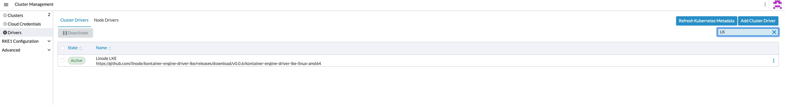
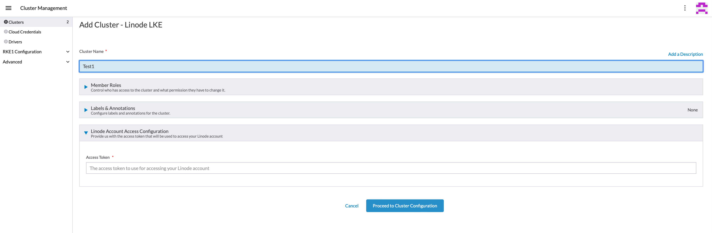
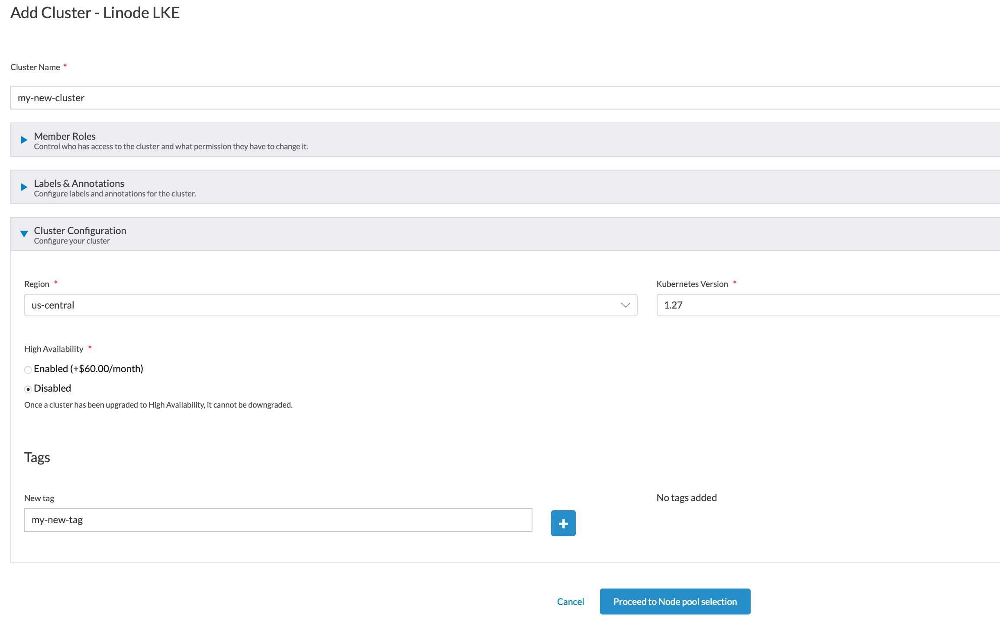
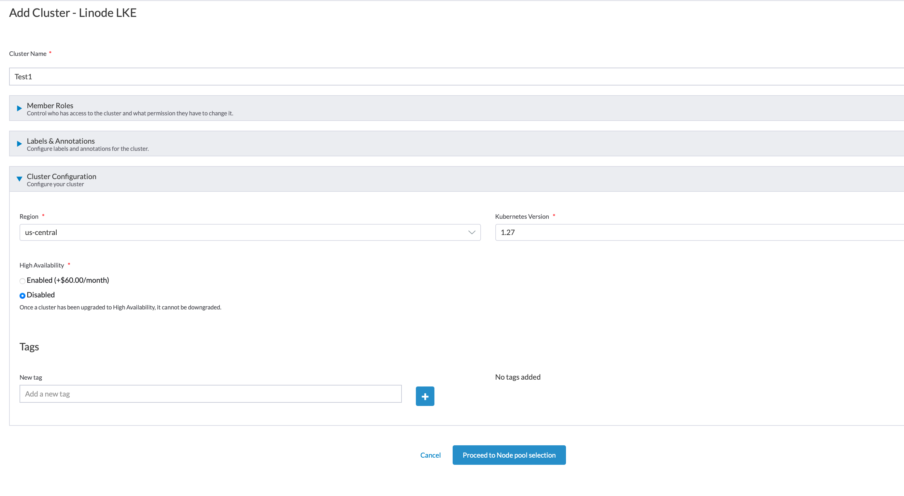
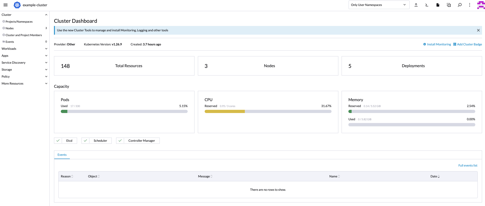
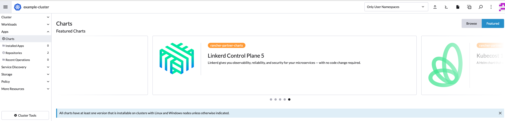

## What is Rancher?

[Rancher](http://rancher.com/) is a web application that provides an interactive and easy-to-use GUI for creating and managing Kubernetes clusters. Rancher has plugins for interacting with multiple cloud hosts, including Linode, and you can manage clusters across different hosting providers.

Rancher also maintains a curated list of apps that offer simple configuration options and a click-to-deploy interface. If you prefer to deploy your apps from a Helm chart, you can do that too.

### Guide Outline

This guide will show how to:

- Install Rancher on a Linode

- Deploy an LKE cluster on Linode using Rancher

- Deploy a Kubernetes cluster on Linode using Rancher

- Deploy an app from the Rancher app library to your cluster

- Take advantage of the Linode [CCM](https://github.com/linode/linode-cloud-controller-manager) and [CSI](https://github.com/linode/linode-blockstorage-csi-driver) for Kubernetes via Rancher.

If you are not familiar with Kubernetes and container deployments, we recommend that you review our other guides on these subjects first.


This guide's example instructions will create several billable resources on your Linode account. If you do not want to keep using the example cluster that you create, be sure to [remove it](#removing-the-cluster) when you have finished the guide.

If you remove the resources afterward, you will only be billed for the hour(s) that the resources were present on your account.


### If You Already Run Rancher

If you already run Rancher and would like to start creating clusters on Linode, you can skip to the [The Linode Node Driver](#the-linode-node-driver-for-rancher) and [Deploy a Kubernetes Cluster](#deploy-a-kubernetes-cluster) sections. The [Deploy an App](#deploy-an-app-from-the-rancher-app-library) section will show how you can take advantage of the Linode CCM and CSI.

You may need to update your local Rancher installation to see the Linode node driver as an option.

## Before You Begin

The Rancher web application will run on a Linode in your Cloud Manager account. Create and prepare the Linode that will run Rancher:

1.  Create a Linode running Ubuntu 18.04 in the data center of your choice. Follow the [Creating a Compute Instance](/docs/products/compute/compute-instances/guides/create/) guide for instructions on setting up your server. It is recommended that you create a 2GB Linode or larger.

    
    You will be able to create Kubernetes clusters in any Linode data center from the Rancher UI, even if your Rancher Linode is located in a different region.
    

1.  The Rancher web application is run inside a Docker container, so you will also need to install Docker CE on your Linode. Follow the instructions for [Installing and Using Docker on Ubuntu and Debian
](/docs/guides/installing-and-using-docker-on-ubuntu-and-debian/) and then return to this guide.

You will also need to generate an API token and prepare a domain zone:

1.  Rancher will need a Linode APIv4 token with read and write privileges from your Linode account in order to create your cluster. Review the instructions from the [Getting Started with the Linode API](/docs/products/tools/api/get-started/#get-an-access-token) guide to get a token.

1.  The [Set Up DNS](#set-up-dns-for-the-wordpress-app) section of this guide will assign an address to this guide's example app. In order to do so, you must already have a domain zone created in the Linode Cloud Manager. If you do not have a zone created, review the instructions from our [DNS Manager](/docs/products/networking/dns-manager/guides/create-domain/) guide.

    
    If you haven't purchased a domain name, then you can read along with the DNS section of this guide without implementing it in your own cluster.
    

## Install Rancher

After you have your Linode up and running with Docker, you can then install and run Rancher:

1.  Log in to your Linode via SSH:

    ```command
    ssh your_user@192.0.2.0
    ```

1.  Create a `rancher` directory inside `/opt`; this folder will hold settings and keys for Rancher:

    ```command
    sudo mkdir -p /opt/rancher
    ```

1.  Run Rancher:

    ```command
    docker run -d --privileged -p 80:80 -p 443:443 \
    --restart=unless-stopped \
    -v /opt/rancher:/var/lib/rancher \
    rancher/rancher:stable
    ```

    - The `--restart` option ensures that the application will be restarted if the Linode is ever rebooted.
    - The `-v` option binds the `/opt/rancher` directory on the Linode to the container so that the application can persist its data.

1.  Once Docker has finished starting up the container, visit your Linode's IP address in your browser. Your browser will display an SSL certificate warning, but you can bypass it.

    
    If you are interested in setting up an SSL certificate with Rancher, you may consider also creating an NGINX container with an SSL certificate that proxies traffic to the Rancher container.
    

1.  You should see a welcome screen from Rancher. The instructions to find the randomly generated password appear. The default user name is `admin`.
1.  The system then prompts you to set a password.
1.  The `Server URL` section should already show your Rancher server's IP address. Click **Continue**.
1.  The default home page for your Rancher application appears. This page normally displays a list of all of your Kubernetes clusters. Since you have not created a cluster yet, no clusters are listed.

    

### Using Node Drivers and Cluster Drivers

Rancher includes two kinds of integrations with hosting providers:

- A [*cluster driver*](https://rancher.com/docs/rancher/v2.x/en/admin-settings/drivers/cluster-drivers/) allows Rancher to create and administer a cloud host-launched Kubernetes cluster. In a host-launched Kubernetes cluster, your hosting platform operates the new cluster's control plane and etcd components, while you provision and configure your worker nodes (via Rancher as well). The LKE cluster driver is required to create clusters on Rancher powered by [LKE](/docs/products/compute/kubernetes/).

- A [*node driver*](https://rancher.com/docs/rancher/v2.x/en/admin-settings/drivers/node-drivers/) allows Rancher to create and administer a Rancher-launched Kubernetes cluster. Rancher will directly provision your control plane and etcd nodes along with your worker nodes. Your cloud host does not manage your control plane and etcd components.

## Deploy an LKE Cluster on Rancher

The [Linode Kubernetes Engine](/docs/products/compute/kubernetes/) is a fully-managed orchestration Engine that can simplify the management of Kubernetes on Linode, capable of being supported by the Rancher platform. If an unmanaged option for Kubernetes is preferred, skip to the Deploying an [Unmanaged Kubernetes Cluster](/docs/guides/how-to-deploy-kubernetes-on-linode-with-rancher-2-x/#the-linode-node-driver-for-rancher) section.

### The LKE Cluster Driver for Rancher

In order to use LKE on Rancher, the LKE Cluster Driver must be manually activated.

1. In the home page click **Create** and then click **Drivers** from the navigation bar.

1. Find the **Linode LKE** cluster driver, check the box next to it to select it, and click the **Activate** button.

    

### Creating an LKE Cluster

Once Rancher been installed and the cluster driver has been activated, a new LKE Cluster can be created at any time:

1. Return to the home page.

1. Click the **Create** button. The **Cluster:Create** form appears.

1. Under the `Create a cluster in hosted Kubernetes Provider` option, find and click on the `LKE` button.

1. The `Add Cluster-Linode LKE` page appears. Enter a name to be used as an identifier for the cluster in the `Cluster Name` field.

1. In the `Access Token` field, enter your Linode APIv4 token and click on the `Proceed to Cluster Configuration` button.

   

1. Select the `Region` where the new cluster to be hosted, the `Kubernetes Version` the cluster will use, and any `tags` you would like to apply, along with any Cloud Manager [tags](/docs/guides/tags-and-groups/) you’d like to apply to your nodes. Click on the `Proceed to Node Pool Selection` button to proceed.

    

1.  A *node pool* is Rancher’s terminology for creating the nodes (Linodes) that form a cluster.  In this menu, a user can specify how many Linodes should be in a node pool,and a cost and resource description will appear for a single Node in the pool. In the `Select Type` dropdown menu, select the type of Linode you'd like to use for a single node pool, and in the `Count` field, enter the number of individual Linodes to be used in a single pool. In this example, a 3 Node Cluster is being created, using Linode's 4 GB plan. While a single node in the cluster costs only $20 per month, the combined sum of the resources being created will cost $60 per month.

    

1. When all the desired Nodes and Node Pools have been added, click on the `Create` button to accept the creation and configuration of the new LKE cluster.

Once the LKE cluster has been successfully created, skip to the [Explore the New Cluster](#explore-the-new-cluster) step to proceed.

## Deploying an Unmanaged Kubernetes Cluster

### The Linode Node Driver for Rancher

Rancher is shipped with a node driver for Linode that is activated by default. No further steps are required to use Linode's node driver. To access the Linode node driver within Rancher's UI:

1.  In the home page click **Create** select **Drivers** from the navigation.
1.  Click the **Node Drivers** tab:
    You will see the Linode node driver and any other active or inactive node drivers.

    

    
    The Linode node driver **does not** install the Linode CCM and CSI for your new clusters. Further instructions for enabling these features are listed in the [Provision a Cluster](#provision-a-cluster) section. You should wait until the node driver is listed as **Active** before moving on.
    

    
    The [CCM](https://github.com/linode/linode-cloud-controller-manager) (Cloud Controller Manager) and [CSI](https://github.com/linode/linode-blockstorage-csi-driver) (Container Storage Interface) are Kubernetes addons published by Linode. These addons provide additional integrations with the Linode cloud platform. Specifically, you can use them to create NodeBalancers, DNS records, and Block Storage Volumes.
    

### Add a Node Template


Nodes created using Rancher are dependent on the [Network Helper](/docs/products/compute/compute-instances/guides/network-helper/) configuration option being enabled. Due to this, all nodes created using Rancher will have the Network Helper service enabled by default regardless of account wide settings, and disabling the service manually is not recommended.


[*Node templates*](https://rancher.com/docs/rancher/v2.x/en/cluster-provisioning/rke-clusters/node-pools/#node-templates) are used by Rancher to provision cluster nodes. When you create a node template, you can specify configuration parameters, like the region, instance type, and Linux image that should be used for any node in the cluster. You can set different templates for different clusters, which allows you to choose the right resources for your different workloads.

Before provisioning your cluster, you will need to add the node template it will use. To add a node template:

1. In the home page, click **Create**

1. In navigation bar select **RKE1 Configuration**, select **Node Templates**.
1. In the **Node Templates** page, click the **Add Template** button in the upper right-hand corner.

1. The *Add Node Template* dialog appears, select Linode from the list of providers.

1. In the *Access Token* section of the dialog, create a [Cloud Credential](https://rancher.com/docs/rancher/v2.x/en/user-settings/cloud-credentials/) to store your Linode APIv4 token. In the **Name** field, provide a descriptive name for the token and add your Linode APIv4 token in the *Access Token* field.

1. Click on the **Create** button.

1. Another dialog appears which accepts options for your new node template. Under the **Instance Options** section, set the preferred region, instance type, and Linux image for your nodes, along with any Cloud Manager [tags](/docs/guides/tags-and-groups/) you’d like to apply to your nodes.

    

    
    We recommend that you choose a Linode 2GB or higher for the nodes in a Kubernetes cluster.

    The Block Storage service has not been deployed to our Atlanta (US-Southeast) data center. Since this guide will use Block Storage Volumes in its example cluster, please choose a different region when creating your node template.
    

1.  Enter a name for your template. This can be arbitrary, but it's helpful to call it something that will help you remember the options you set in the template form, like `newark-linode8gb-ubuntu1804`.

1.  When finished with the form, click the **Create** button.

    
    All other node template settings are optional and will not be used in this guide. You do not need to set a password for the nodes created through this template; Rancher will generate one automatically. As well, Rancher provides command-line access to the Kubernetes API for your cluster, so logging into your nodes generally isn't needed.
    

1. You are redirected to the *Node Templates* page where your node template is listed.


### Provision a Cluster

1.  In the home page, click **Create** button. The **Cluster: Create** form  appears.

1.  Select the Linode driver from the **With RKE and new nodes in an infrastructure provider** section:

1.  Enter a name for your cluster in the **Cluster Name** field. The name for our example cluster will be `example-cluster`.

1.  In the **Node Pools** section, under the *Template* column, you should see the node template you created in the previous section of this guide. Set a value for the **Name Prefix** field. For each Linode that Rancher creates for that node pool, the Linode will be prefixed according to the name you set (e.g. if the name prefix is `example-cluster-`, then your Linodes will be named `example-cluster-1`, `example-cluster-2`, etc.

    - A *node pool* is Rancher’s method for creating the nodes (Linodes) that form your cluster. You specify how many nodes should be in a node pool, along with the node template for those nodes in that pool. If Rancher later detects that one of the nodes has lost connectivity with the cluster, it will automatically create a new one.

    - When configuring a node pool, you also specify which of your cluster’s components operate on the nodes in the pool. For example, you can have one pool that only runs your cluster’s etcd database, another pool which only runs your control plane components (the Kubernetes API server, scheduler, and controller manager), and a third pool which runs your application workloads.

1.  Set the value for the **Count** field to `3`. Rancher creates 3 Linodes for the node pool.

1.  Toggle on the checkboxes for **etcd**, **Control Plane**, and **Worker**. In our example cluster, the nodes for this node pool will run each of these components.

1.  The last part in creating your cluster is to configure Linode's CCM and CSI. In the **Cluster Options** section, toggle on the **Custom** option for the **Cloud Provider** field, then click on the **Edit as YAML** button above the section.

1.  A text editor appears.

1.  Locate the **rancher_kubernetes_engine_config** line in your editor. Directly underneath, insert the following snippet (above the `addon_job_timeout` declaration):

    ```file
    addons_include:
      - https://linode.github.io/rancher-ui-driver-linode/releases/v0.3.0/linode-addons.yml
    addons: |-
      ---
      apiVersion: v1
      kind: Secret
      metadata:
        name: linode
        namespace: kube-system
      stringData:
        token: "..."
        region: "..."
      ---
    ```

1. Insert your Linode APIv4 token in the `token` field from this snippet. Also, enter the label for your node template’s data center in the `region` field. This label should be lower-case (e.g. `us-east` instead of `US-East`).

1.  Scroll down in the editor to the `services` section. Remove the `kube-api` sub-section and replace it with the example snippet. When editing the file, ensure you do not accidentally remove any other sections above or below the snippet.

    ```file
    kube-api:
      always_pull_images: false
      pod_security_policy: false
      service_node_port_range: "30000-32767"
    kubelet:
      fail_swap_on: false
      extra_args:
        cloud-provider: "external"
    kube-controller:
      extra_args:
        cloud-provider: "external"
    ```

1.  After you finish with both of these steps, your YAML should resemble [this completed snippet](completed-cluster-config.yml).

    
    Avoid copying and pasting the entire completed snippet example, as it has some variable values outside of the `addons_include`, `addons`, and `services` sections that may not match your deployment (e.g. the `kubernetes_version` setting).

    Instead, compare your YAML file with the completed example to ensure you have inserted the `addons_include`, `addons`, and `services` sections in the right places.
    

1.  Click the **Create** button below the YAML editor. You will be returned to the global home page, and your new cluster will be listed (in the **Provisioning** state):

1.  If you visit the list of your Linodes in the Linode Cloud Manager, you will see the new nodes in your cluster.

    
    If your nodes do not appear in the Linode Cloud Manager as expected, then you may have run into a limit on the number of resources allowed on your Linode account. Contact [Linode Support](/docs/products/platform/get-started/guides/support/) if you believe this may be the case.
    

## Explore the New Cluster

1.  To inspect your new cluster, click the cluster in the home page:

    

1.  Your cluster's dashboard appears after the cluster is provisioned. A summary of the cluster's resource usage is displayed:

    

1.  Click **Nodes** main menu item.
1.  A list of your cluster's nodes appear.
    When the nodes finish provisioning, the **Active** label is displayed:

    

### Load the kubectl Command Line

In addition to managing your cluster via Rancher's interactive UI, Rancher also provides command-line access to your cluster's Kubernetes API:

- From your cluster's dashboard, click the **Launch kubectl** button:

    

    A new dialog appears with a command-line prompt. You are able to use kubectl to interact with your cluster:

    

- Alternatively, you can use the `kubectl` CLI from your local computer [if you have it installed](https://kubernetes.io/docs/tasks/tools/install-kubectl/). From your cluster's dashboard in Rancher, click the **Download KubeConfig** button:

    

    A new dialog appears with the correct kubeconfig for your cluster. Copy the contents of the configuration to a file on your computer. Then, pass it as an option when using the CLI:

    ```command
    kubectl --kubeconfig /path/to/your/local/kube.config get pods
    ```

### Rancher Projects

Rancher introduces an organizational concept called [*projects*](https://rancher.com/docs/rancher/v2.x/en/k8s-in-rancher/projects-and-namespaces/). Projects group together Kubernetes namespaces and allows you to perform actions across all namespaces in a project, like adjusting administrative access to them.

1.  To view your cluster's projects, click **Projects/Namespaces** in the menu:

    

    A new cluster created through Rancher has a *Default* project and a *System* project.

1.  To create new project click **Create Project**.
    However, this guide deploys an example app to the Default project.

1.  In the  **Projects/Namespaces**  page click the **default** project.
1.  Click the **Workloads** tab for the project, but it will be empty, as no apps have been deployed yet.

    

## Deploy an App from the Rancher App Library

Rancher provides a library of apps which offer easy setup through Rancher's UI. The apps in this curated library are based on existing [*Helm charts*](https://helm.sh/docs/topics/charts/).

A Helm chart is a popular format for describing Kubernetes resources. Rancher extends the Helm chart format with some additional configuration files, and this extended packaging is referred to as a [*Rancher chart*](https://rancher.com/docs/rancher/v2.x/en/catalog/custom/#custom-helm-chart-repository). The additional information in the Rancher chart format is used to create interactive forms for configuring the app through the Rancher UI.


It is possible to enable [more app catalogs](https://rancher.com/docs/rancher/v2.x/en/catalog/) than just Rancher's curated library, including a catalog of stable Helm charts. These other apps will not feature Rancher's easy setup forms and will instead require manual entry of configuration options.


To test out deploying an app on your new cluster, launch the WordPress app from the Rancher library. This app will also take advantage of Linode's Block Storage, NodeBalancer, and DNS services (via the CCM and CSI):

1.  From the Default project in your new cluster, click the **Apps** item in the navigation bar:

    

1.  Search for the WordPress application in the list of charts and click **Install**:

    

1.  The Install steps for the WordPress app appears. Provide the details and click **Next**.
    After you provide the details click **Install**.

1.  In the project's **Installed Apps** view, your new WordPress app is listed.

1.  In the **Workloads** section the MariaDB and WordPress deployments for your app are displayed.

1.  The **Deployments** section displays the **Endpoints** or the address of the NodeBalancer that was created for your app.

    

    Your WordPress site should open in a new browser tab.

    
    If using the Toronto data center, you will need to manually update the HTTP NodeBalancer's endpoint URL to use the data center's short form name. Replace the `toronto1` portion of the URL with `tor1`. An updated example URL will appear as follows:

    `http://nb-192-0-2-0.tor1.nodebalancer.linode.com`
    


1.  Visit the wp-login.php page on your site (e.g. at `http://your-nodebalancer-name.newark.nodebalancer.linode.com/wp-login.php`). You should be able to login with the WordPress admin username and password you specified earlier in the app's form.

    
    If you view the Volumes and NodeBalancers areas of the Linode Cloud Manager, you should see the new Volume and NodeBalancer that were created for this app. They will have random alphanumeric names like `pvc77e0c083490411e9beabf23c916b1`.
    
### Set Up DNS for the WordPress App

You can currently visit your new app from the NodeBalancer's generic subdomain. With the Linode CCM, it's also possible to assign a custom domain or subdomain to your app:

1.  In the detail view for your WordPress app, scroll down to the **Services** section.

1.  Click on the **more options ellipsis** for the **wordpress-wordpress** service, then click on the **View/Edit YAML** item in the dropdown menu that appears:

    

1.  A YAML editor for the service will appear. Find the `annotations` section under the `metadata` sections, then insert this line:

    ```file
    metadata:
      annotations:
        external-dns.alpha.kubernetes.io/hostname: wordpress.example.com
    ```

    Replace `wordpress.example.com` with the address you want to use for your app. As a reminder, `example.com` needs to exist as a domain zone on your Linode account. If you're not sure if you've inserted the new line in the right location, compare your YAML with [this snippet](wordpress-service-example-metadata-section.yml) of an updated `metadata` section.

1.  Click the **Save** button below the YAML editor.

1.  The Linode CCM creates a DNS record in your domain's zone and automatically assign the IP of your NodeBalancer to it. If you visit the domain's zone in the Linode Cloud Manager, the new A record should appear.

1.  It may take some time for Linode's DNS database to update, so if you don't see the record show up in the Cloud Manager immediately, try refreshing it after a few minutes.

    After the record becomes visible in the Cloud Manager, it can also take time for the DNS change to propagate to your local ISP. After the DNS change has propagated, you should be able to view your WordPress app by navigating to the address you set up.

## Scaling your Cluster and App

Rancher makes it easy to scale the number of nodes in your cluster and to scale the number of replica Pods in your app's deployments.

### Scale your Cluster


The example instructions in this section will add nodes to your cluster, which will add further billable services to your account. You can read these instructions without performing them on your own account if you prefer.


1.  Return to the home page and click **Manage** in the home page.

1.  Your clusters are listed in the page that appears. Click the **more options ellipsis** corresponding to the cluster and then click on the **Edit Config** item from the dropdown menu:
1.  Click **Proceed to Cluster Configuration** and then click **Proceed to Node pool selection**.
1.  The form that you completed when creating your cluster appears. In the **Node Pools** section, increase the count of your pool:

    

    
    Your example cluster's nodes all run etcd, so you can only scale the node pool to a count of 1, 3, or 5. If you had a separate node pool for your workloads, you could scale it freely to any count.
    

1.  Click the **Update** button at the bottom of the form. You are redirected to the dashboard for the cluster.

1.  The dashboard reports that the cluster is updating. When the new nodes have finished provisioning and are registered with Kubernetes, the dashboard will show that all components and nodes are responding normally.

### Scale your App

Rancher also provides an easy way to scale your app's deployments:

1.  In the left navigation of the cluster, click the **Workloads** item.

1.  Click the **Deployments** and then click the **wordpress** app.

1.  In the **Deployment** page that appears, increase the count in the **Scale**.
    

1.  A second Pod appears in the **Pods by State** section on this page, that displays the status of the pod that is being created. Eventually, the new Pod is labelled as **Running**.



Rancher does not currently support interacting directly with Linode Volumes via its user interface. However, the scaling method described in this section of the guide will apply complete replication to your application and volumes.


## Set Up GitHub Authentication

In addition to manually creating users that can access your Rancher application, you can also enable GitHub authentication and then invite GitHub users:

1.  In the Global home page, click the **Users & Authentication** item in the navigation bar and then click **Auth Provider**.

1.  Choose GitHub from the authentication options listed.

    

1. In the **Authentication Provider:GitHub** that appears. Follow the instructions and click **Enable**

    

## Removing the Cluster

To remove the cluster:

1.  Navigate to the home page, click **Manage**.

1.  Click on the **more options ellipsis** for your cluster, then select the **Delete** option from the dropdown menu that appears.

1.  Confirm in the Linode Cloud Manager that all the Linodes, Volumes, NodeBalancers, and DNS records from the cluster are deleted.
