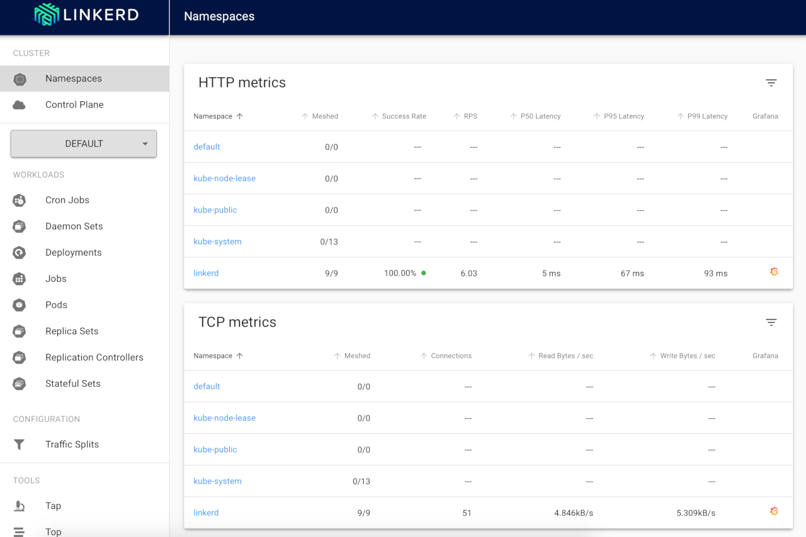
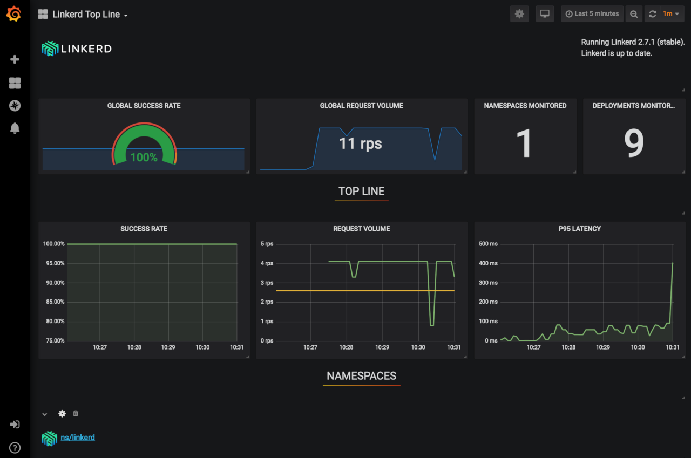

[Linkerd 2](https://linkerd.io) is an ultra lightweight service mesh that monitors, reports, and encrypts connections between Kubernetes services without disturbing the existing applications. It does this by employing proxy sidecars along each instance.

Unlike [Istio](/docs/guides/how-to-deploy-istio-with-kubernetes/), another service mesh monitoring tool, it provides it's own proxies written in Rust instead of using Envoy. This makes it both lighter and more secure.


Linkerd 1.x is still available and is being actively developed as a separate project. However, it is built on the "Twitter stack" and is not for Kubernetes. Linkerd 2 is built in Rust and Go and only supports Kubernetes.


## In This Guide

This guide provides instructions to:

- [Create a Kubernetes Cluster](#create-an-lke-cluster)
- [Install the Linkerd](#install-linkerd)
- [Install a Demo Application (Optional)](#install-demo-application-optional)
- [Upgrade Linkerd](#upgrade-linkerd)
- [Uninstall Linkerd](#uninstall-linkerd)


This guide’s example instructions create several billable resources on your Linode account. If you do not want to keep using the example cluster that you create, be sure to delete it when you have finished the guide.

If you remove the resources afterward, you will only be billed for the hour(s) that the resources were present on your account. Consult the [Billing and Payments](/docs/guides/understanding-billing-and-payments/) guide for detailed information about how hourly billing works and for a table of plan pricing.


## Before You Begin

Familiarize yourself with Kubernetes using our series [A Beginner's Guide to Kubernetes](/docs/guides/beginners-guide-to-kubernetes/) and [Advantages of Using Kubernetes](/docs/guides/kubernetes-use-cases/).

## Create an LKE Cluster

Follow the instructions in [Deploying and Managing a Cluster with Linode Kubernetes Engine Tutorial](/docs/guides/deploy-and-manage-a-cluster-with-linode-kubernetes-engine-a-tutorial/) to create and connect to an LKE cluster.


Linkerd 2 requires Kubernetes version 1.13+. Linode Kubernetes Engine clusters currently support Kubernetes versions 1.15, 1.16, and 1.17.


## Install Linkerd

Linkerd consists of the <abbr title="runs on the local machine and allows you to install, update, and interact with the control and data planes">Linkerd CLI</abbr>, a <abbr title="set of services that collect the data, provide the user-facing API, and control the proxies">control plane</abbr>, and a <abbr title="is a collection of proxies">data plane</abbr>.
For a more detailed overview, see the Linkerd [architecture](https://linkerd.io/2/reference/architecture/).

### Install the Linkerd CLI

1.  To manage Linkerd you need to have the CLI installed on a local machine. The Linkerd CLI is available for Linux, macOS, and Windows on the [release page](https://github.com/linkerd/linkerd2/releases/).

    - For Linux, you can use the curl command for installation:

            curl -sL https://run.linkerd.io/install | sh

    - For macOS, you can use Homebrew:

            brew install linkerd

1.  Verify that linkerd is installed by checking the version:

        linkerd version

1.  Add Linkerd to the 'PATH' environment variable:

        export PATH=$PATH:$HOME/.linkerd2/bin

1.  Use the following command to ensure that Linkerd installs correctly onto the cluster. If there are any error messages, Linkerd provides links to help you properly configure the cluster.

        linkerd check --pre

    
kubernetes-api
--------------
√ can initialize the client
√ can query the Kubernetes API

kubernetes-version
------------------
√ is running the minimum Kubernetes API version
√ is running the minimum kubectl version

pre-kubernetes-setup
--------------------
√ control plane namespace does not already exist
√ can create non-namespaced resources
√ can create ServiceAccounts
√ can create Services
√ can create Deployments
√ can create CronJobs
√ can create ConfigMaps
√ can create Secrets
√ can read Secrets
√ no clock skew detected

pre-kubernetes-capability
-------------------------
√ has NET_ADMIN capability
√ has NET_RAW capability

linkerd-version
---------------
√ can determine the latest version
√ cli is up-to-date

Status check results are √


### Install Linkerd Control Plane

1.  Install the Linkerd control plane onto the cluster into the `linkerd` namespace:

        linkerd install | kubectl apply -f -

    This command generates a Kubernetes manifest and control plane resources. It then pipes the manifest to `kubectl apply` which instructs Kubernetes to add these resources to the cluster.

1.  Validate the installation of Linkerd control plane by running the following command:

        linkerd check

    
kubernetes-api
--------------
√ can initialize the client
√ can query the Kubernetes API

kubernetes-version
------------------
√ is running the minimum Kubernetes API version
√ is running the minimum kubectl version

linkerd-existence
-----------------
√ 'linkerd-config' config map exists
√ heartbeat ServiceAccount exist
√ control plane replica sets are ready
√ no unschedulable pods
√ controller pod is running
√ can initialize the client
√ can query the control plane API

linkerd-config
--------------
√ control plane Namespace exists
√ control plane ClusterRoles exist
√ control plane ClusterRoleBindings exist
√ control plane ServiceAccounts exist
√ control plane CustomResourceDefinitions exist
√ control plane MutatingWebhookConfigurations exist
√ control plane ValidatingWebhookConfigurations exist
√ control plane PodSecurityPolicies exist

linkerd-identity
----------------
√ certificate config is valid
√ trust roots are using supported crypto algorithm
√ trust roots are within their validity period
√ trust roots are valid for at least 60 days
√ issuer cert is using supported crypto algorithm
√ issuer cert is within its validity period
√ issuer cert is valid for at least 60 days
√ issuer cert is issued by the trust root

linkerd-api
-----------
√ control plane pods are ready
√ control plane self-check
√ [kubernetes] control plane can talk to Kubernetes
√ [prometheus] control plane can talk to Prometheus
√ tap api service is running

linkerd-version
---------------
√ can determine the latest version
√ cli is up-to-date

control-plane-version
---------------------
√ control plane is up-to-date
√ control plane and cli versions match

Status check results are √


1.  Check the components that are installed and running:

        kubectl -n linkerd get deploy

    
NAME                     READY   UP-TO-DATE   AVAILABLE   AGE
linkerd-controller       1/1     1            1           106s
linkerd-destination      1/1     1            1           106s
linkerd-grafana          1/1     1            1           104s
linkerd-identity         1/1     1            1           107s
linkerd-prometheus       1/1     1            1           105s
linkerd-proxy-injector   1/1     1            1           104s
linkerd-sp-validator     1/1     1            1           104s
linkerd-tap              1/1     1            1           103s
linkerd-web              1/1     1            1           105s


    You can read about what each of these services do in the Linkerd [architechure documentation](https://linkerd.io/2/reference/architecture/#control-plane).

### The Data Plane

Each control plane component has a proxy installed in the respective Pod and therefore is also part of the data plane. This enables you to take a look at what's going on with the dashboard and other tools that Linkerd offers.

### The Dashboards

Linkerd comes with two dashboards, a Linkerd dashboard and the [Grafana](https://grafana.com) dashboard; both are backed by metrics data gathered by [Prometheus](https://prometheus.io).

1.  Start and view the Linkerd standalone dashboard that runs in the browser.

        linkerd dasboard &

    
Linkerd dashboard available at:
http://localhost:50750
Grafana dashboard available at:
http://localhost:50750/grafana
Opening Linkerd dashboard in the default browser


    - This command sets up a port forward from the `linkerd-web` Pod.

    - If you want to expose the dashboard for others to use as well, you need to add an [ingress controller](/docs/guides/how-to-deploy-nginx-ingress-on-linode-kubernetes-engine/).

1.  The dashboard opens in the browser. If it does not, you can access it by going to http://localhost:50750:

    

1.  The Grafana dashboard is included with Linkerd and is available at `http://localhost:50750/grafana`.

    

1.  You can checkout the traffic that the dashboard is using by running the following command:

        linkerd -n linkerd top deploy/linkerd-web

    To see what the other Pods are doing, replace `linkerd-web` with a different Pod name, for example, to check on Grafana, use, `linkerd-grafana`.

    
Linkerd is not designed to be a long term metrics data store. It only stores data for 6 hours using Prometheus. However, if you can export the data using [several methods](https://linkerd.io/2/tasks/exporting-metrics/).


## Install Demo Application (Optional)

To demonstrate the full ease of use and utility of Linkerd, deploy Drupal on the cluster and monitor it using Linkerd.

1.  Follow the [How to Install Drupal with Linode Kubernetes Engine](/docs/guides/how-to-install-drupal-with-linode-kubernetes-engine/) guide to install Drupal onto your LKE cluster.

### Add Linkerd to Drupal

Now that Drupal is setup and running successfully on the cluster, you'll add the Linkerd service mesh to monitor the metrics.

1.  Add Linkerd to the Drupal application with the following command:

        kubectl get -n default deploy -o yaml | linkerd inject - | kubectl apply -f -

    This gathers all the deployments in the `default` namespace, pipes the manifest to `linkerd inject` which adds it's proxies to the container specs, and then applies it to the cluster.

    The output should look similar to this, indicating the Drupal and MySQL deployments have been *injected* with Linkerd.

    
deployment "drupal" injected
deployment "mysql" injected

deployment.apps/drupal configured
deployment.apps/mysql configured


1.  Redeploy your Pods with the following command:

        kubectl -n default rollout restart deploy

    This redeploys the deployment manifests now that they have been injected with the Linkerd proxy sidecars. The output will look like this:

    
deployment.apps/drupal restarted
deployment.apps/mysql restarted


1.  Issue the following command to verify that the proxies have been applied:

        linkerd -n default check --proxy

    
kubernetes-api
--------------
√ can initialize the client
√ can query the Kubernetes API

kubernetes-version
------------------
√ is running the minimum Kubernetes API version
√ is running the minimum kubectl version

linkerd-existence
-----------------
√ 'linkerd-config' config map exists
√ heartbeat ServiceAccount exist
√ control plane replica sets are ready
√ no unschedulable pods
√ controller pod is running
√ can initialize the client
√ can query the control plane API

linkerd-config
--------------
√ control plane Namespace exists
√ control plane ClusterRoles exist
√ control plane ClusterRoleBindings exist
√ control plane ServiceAccounts exist
√ control plane CustomResourceDefinitions exist
√ control plane MutatingWebhookConfigurations exist
√ control plane ValidatingWebhookConfigurations exist
√ control plane PodSecurityPolicies exist

linkerd-identity
----------------
√ certificate config is valid
√ trust roots are using supported crypto algorithm
√ trust roots are within their validity period
√ trust roots are valid for at least 60 days
√ issuer cert is using supported crypto algorithm
√ issuer cert is within its validity period
√ issuer cert is valid for at least 60 days
√ issuer cert is issued by the trust root

linkerd-identity-data-plane
---------------------------
√ data plane proxies certificate match CA

linkerd-api
-----------
√ control plane pods are ready
√ control plane self-check
√ [kubernetes] control plane can talk to Kubernetes
√ [prometheus] control plane can talk to Prometheus
√ tap api service is running

linkerd-version
---------------
√ can determine the latest version
√ cli is up-to-date

linkerd-data-plane
------------------
√ data plane namespace exists
√ data plane proxies are ready
√ data plane proxy metrics are present in Prometheus
√ data plane is up-to-date
√ data plane and cli versions match

Status check results are √


1.  You can get live traffic metrics by running the following command:

        linkerd -n default stat deploy

    
NAME     MESHED   SUCCESS      RPS   LATENCY_P50   LATENCY_P95   LATENCY_P99   TCP_CONN
drupal      1/1   100.00%   0.5rps           0ms           0ms           0ms          2
mysql       1/1     0.00%   1.6rps           0ms           0ms           0ms          6


1.  To dig deeper, try the following commands:

        linkerd top deploy
        linkerd tap deploy/drupal

    You can also use the graphical dashboards view to show you these items in the browser.

## Upgrade Linkerd

Just as with installing, upgrading Linkerd is done in multiple parts. The CLI, control plane, and data plane must all be updated separately.

### Upgrade the CLI

1.  Upgrade the CLI on your local machine by running the following command:

        curl -sL https://run.linkerd.io/install | sh

    You can also download the current release directly from the [release page](https://github.com/linkerd/linkerd2/releases/).

1.  Verify the version:

        linkerd version --client

    The current version as of the writing of this guide is version `stable-2.7.1`.

### Upgrade the Control Plane

1.  Run the following command to upgrade the control plane:

        linkerd upgrade | kubectl apply --prune -l linkerd.io/control-plane-ns=linkerd -f -

    This will keep your current configuration and any [mTLS](https://linkerd.io/2/features/automatic-mtls/) intact.

1.  Verify the upgrade with the following command:

        linkerd check

### Upgrade the Data Plane

Upgrading the data plane will upgrade the proxy sidecars, auto-injecting a new version of the proxy into the Pods.

1.  Use the following command to inject the new proxies, replacing `namespace` with the namespace you wish to update:

        kubectl -n namespace get deploy -l linkerd.io/control-plane-ns=linkerd -oyaml | linkerd inject --manual - | kubectl apply -f -

1.  Issue a rollout restart of your deployment to restart the Pods, replacing `namespace` with the namespace you updated:

        kubectl -n namespace rollout restart deploy

1.  Verify the upgrade with the following command:

        linkerd check --proxy

1.  Check the version has been updated:

        kubectl get po --all-namespaces -o yaml | grep linkerd.io/proxy-version

## Uninstall Linkerd

Uninstalling Linkerd is done in two steps. First, you remove the data plane proxies, then you remove the control plane. You must have cluster-wide permissions.

1.  Remove the data plane proxies from your manifest files, including any injection annotations.

1.  Remove the control plane with the following command:

        linkerd install --ignore-cluster | kubectl delete -f -

    
You may receive errors about deleting resources that haven't been created. You can safely ignore these.


1.  Roll the deployments to redeploy the manifests without the Linkerd proxies, replace `namespace` with the namespace where your deployments reside:

        kubectl -n namespace rollout restart deploy

    When Kubernetes restarts the Pods, the Linkerd data plane will no longer be attached.
