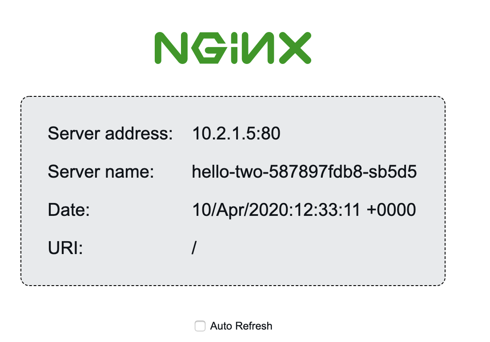

In Kubernetes, an **Ingress** is an API object that manages the routing of external requests to one of the many possible internal services in a Kubernetes cluster. In the majority of cases, the Ingress will rely on an external Load Balancer to accept initial traffic before being routed.

An Ingress is one of the most powerful ways to control external access to your resources, granting the ability to add multiple services under the same IP address, and use plugins like [cert-manager](https://github.com/jetstack/cert-manager) to assist with the management of SSL/TLS certificates.

*Linode Kubernetes Engine (LKE)* allows you to easily create, scale, and manage Kubernetes clusters to meet your application's demands, reducing the often complicated cluster set-up process to just a few clicks. Linode manages your Kubernetes master node, and you select how many Linodes you want to add as worker nodes to your cluster.


Following the instructions in this guide will create billable resources on your account in the form of Linodes and NodeBalancers. You will be billed an hourly rate for the time that these resources exist on your account. Be sure to follow the [tear-down section](#tear-down-your-lke-cluster-and-nodebalancer) at the end of this guide if you do not wish to continue using these resources.


## In This Guide

This guide will show you how to:

- Use [HELM](https://helm.sh/) to install an NGINX Ingress Controller.
- Create two instances of sample application Deployments to create two separate mock websites on a single Kubernetes cluster served over port 80.
- Create an Ingress and a NodeBalancer to route traffic from the internet to Kubernetes Services.

## Before You Begin

1.  Review the [Beginner's Guide to Kubernetes](/docs/guides/beginners-guide-to-kubernetes/) series to gain an understanding of key concepts within Kubernetes, including master and worker nodes, Pods, Deployments, and Services.

1.  Purchase a domain name from a reliable domain registrar. In a later section, you will use Linode's DNS Manager to [create a new Domain](/docs/guides/dns-manager/#add-a-domain) and to [add a DNS "A" record](/docs/guides/dns-manager/#add-dns-records) for two subdomains: one named `blog` and another named `shop`. Your subdomains will point to the example Kubernetes Services you will create in this guide. The example domain names used throughout this guide are `blog.example.com` and `shop.example.com`.

    
Optionally, you can create a Wildcard DNS record, `*.example.com` and point your NodeBalancer's external IP address to it. Using a Wildcard DNS record, will allow you to expose your Kubernetes services without requiring further configuration using the Linode DNS Manager.


## Creating and Connecting to a Kubernetes Cluster

1.  **Create a Kubernetes cluster** through the [Linode Kubernetes Engine](https://www.linode.com/products/kubernetes/) (LKE) using either the Cloud Manager, the Linode API, or Terraform:

    - [Cloud Manager LKE instructions](/docs/guides/deploy-and-manage-a-cluster-with-linode-kubernetes-engine-a-tutorial/)
    - [Linode API LKE instructions](/docs/guides/deploy-and-manage-lke-cluster-with-api-a-tutorial/)
    - [Terraform instructions](/docs/guides/how-to-deploy-an-lke-cluster-using-terraform/)

    You can also use an unmanaged Kubernetes cluster (that's not deployed through LKE). The instructions within this guide depend on the Linode Cloud Controller Manager (CCM), which is installed by default on LKE clusters but needs to be manually installed on unmanaged clusters. To learn how to install the Linode CCM on a cluster that was not deployed through LKE, see the [Installing the Linode CCM on an Unmanaged Kubernetes Cluster](/docs/guides/installing-the-linode-ccm-on-an-unmanaged-kubernetes-cluster/) guide.

1.  **Setup your local environment** by installing [Helm 3](/docs/guides/how-to-install-apps-on-kubernetes-with-helm-3/#install-helm) and [kubectl](/docs/products/compute/kubernetes/guides/install-kubectl) on your computer (or whichever system you intend to use to manage your Kubernetes Cluster).

1.  **Configure kubectl** to use the new Kubernetes cluster by downloading the kubeconfig YAML file and adding it to kubectl. See the instructions within the [Download Your kubeconfig](/docs/products/compute/kubernetes/guides/download-kubeconfig) guide.

## Creating a Sample Application

In order to be able to confirm that the NGINX Ingress you create is working as expected in later steps, deploy a sample application which will confirm the connection to your backend Services. Our application will be built from an official NGINX [Docker image](https://hub.docker.com/r/nginxdemos/hello/), though this application can be replaced with any you prefer.

### Configure and Create the Deployment

Wherever you've installed `kubectl`, create two `yaml` manifest files using a text editor of your choice. These manifests will be responsible for creating our Deployments their associated Services. The Deployments will be called `hello-one` and `hello-two` respectively, and will be replicated three times each:

1.  Using a text editor, create a new file named `hello-one.yaml` with the contents of the example file.

    
apiVersion: v1
kind: Service
metadata:
  name: hello-one
spec:
  type: ClusterIP
  ports:
  - port: 80
    targetPort: 80
  selector:
    app: hello-one
---
apiVersion: apps/v1
kind: Deployment
metadata:
  name: hello-one
spec:
  replicas: 3
  selector:
    matchLabels:
      app: hello-one
  template:
    metadata:
      labels:
        app: hello-one
    spec:
      containers:
      - name: hello-ingress
        image: nginxdemos/hello
        ports:
        - containerPort: 80


1.  Create a second Service and Deployment manifest file named `hello-two.yaml` with the contents of the example file.

    
apiVersion: v1
kind: Service
metadata:
  name: hello-two
spec:
  type: ClusterIP
  ports:
  - port: 80
    targetPort: 80
  selector:
    app: hello-two
---
apiVersion: apps/v1
kind: Deployment
metadata:
  name: hello-two
spec:
  replicas: 3
  selector:
    matchLabels:
      app: hello-two
  template:
    metadata:
      labels:
        app: hello-two
    spec:
      containers:
      - name: hello-ingress
        image: nginxdemos/hello
        ports:
        - containerPort: 80


1.  Use kubectl to create the Services and Deployments for your example applications.

        kubectl create -f hello-one.yaml
        kubectl create -f hello-two.yaml

    You should see a similar output:

    
service/hello-one created
deployment.apps/hello-one created
service/hello-two created
deployment.apps/hello-two created


1.  Verify that the Services are running.

        kubectl get svc

    You should see a similar output:

    
NAME         TYPE        CLUSTER-IP       EXTERNAL-IP   PORT(S)   AGE
hello-one    ClusterIP   10.128.94.166    <none>        80/TCP    6s
hello-two    ClusterIP   10.128.102.187   <none>        80/TCP    6s
kubernetes   ClusterIP   10.128.0.1       <none>        443/TCP   18m


## Install the NGINX Ingress Controller

In this section you will use Helm to install the NGINX Ingress Controller on your Kubernetes Cluster. Installing the NGINX Ingress Controller will create Linode NodeBalancers that your cluster can make use of to load balance traffic to your example application.

1.  Add the following Helm ingress-nginx repository to your Helm repos.

        helm repo add ingress-nginx https://kubernetes.github.io/ingress-nginx

1.  Update your Helm repositories.

        helm repo update

1.  Install the NGINX Ingress Controller. This installation will result in a Linode NodeBalancer being created.

        helm install ingress-nginx ingress-nginx/ingress-nginx

    You will see a similar output:

    
NAME: ingress-nginx
LAST DEPLOYED: Fri Apr  9 21:29:47 2021
NAMESPACE: default
STATUS: deployed
REVISION: 1
TEST SUITE: None
NOTES:
The ingress-nginx controller has been installed.
It may take a few minutes for the LoadBalancer IP to be available.
You can watch the status by running 'kubectl --namespace default get services -o wide -w ingress-nginx-controller'
...


## Create a Subdomain DNS Entries for your Example Applications

Now that Linode NodeBalancers have been created by the NGINX Ingress Controller, you can point a subdomain DNS entries to the NodeBalancer's public IPv4 address. Since this guide uses two example applications, it will require two subdomain entries.

1.  Access your NodeBalancer's assigned external IP address.

        kubectl --namespace default get services -o wide -w ingress-nginx-controller

    The command will return a similar output:

    
NAME                          TYPE           CLUSTER-IP      EXTERNAL-IP    PORT(S)                      AGE     SELECTOR
my-ingress-nginx-controller   LoadBalancer   10.128.169.60   192.0.2.0   80:32401/TCP,443:30830/TCP   7h51m   app.kubernetes.io/instance=cingress-nginx,app.kubernetes.io/name=ingress-nginx


1.  Copy the IP address of the `EXTERNAL IP` field and navigate to [Linode's DNS manager](https://cloud.linode.com/domains) and [add two "A" records](/docs/guides/dns-manager/#add-dns-records) for the `blog` and `shop` subdomains. Ensure you point each record to the NodeBalancer's IPv4 address you retrieved in the previous step.

## Configuring the Ingress Controller

Once your Ingress Controller is installed and DNS records have been created pointing to your NodeBalancer, you need to create a manifest file to create a new Ingress resource. This resource will define how traffic coming from the LoadBalancer service we deployed earlier is handled. In this case, NGINX will accept these connections over port 80, diverting traffic to both of our services via their `hostname` or domain names:

1.  Create an Ingress resource manifest file named `my-new-ingress.yaml`.

    
apiVersion: networking.k8s.io/v1
kind: Ingress
metadata:
  name: my-new-ingress
  annotations:
    kubernetes.io/ingress.class: nginx
spec:
  rules:
  - host: blog.example.com
    http:
      paths:
      - pathType: Prefix
        path: "/"
        backend:
          service:
            name: hello-one
            port:
              number: 80
  - host: shop.example.com
    http:
      paths:
      - pathType: Prefix
        path: "/"
        backend:
          service:
            name: hello-two
            port:
              number: 80


1.  Create the Ingress resource using the following command:

        kubectl create -f my-new-ingress.yaml

1.  Once the Ingress has been created, try accessing your subdomains from a browser. As a reminder, this example uses `blog.example.com` and `shop.example.com`. Each time you navigate to the page, you'll see one of three different instances of the replicated server as the active node is rotated. While the application has been deployed to the same cluster, at no point will `blog.example.com` display the same three hostnames as `shop.example.com`, as all requests are being routed correctly.

    

## Next Steps

If you would like to secure your site with TLS encryption, you can follow the [Getting Started with Load Balancing on a Linode Kubernetes Engine (LKE) Cluster](/docs/kubernetes/getting-started-with-load-balancing-on-a-lke-cluster/).

If you would rather not continue using the cluster you just created, review the [tear-down section](#tear-down-your-lke-cluster-and-nodebalancer) to remove the billable Linode resources that were generated.

## Tear Down your LKE Cluster and NodeBalancer

- To remove the NodeBalancer you created, all you need to do is delete the underlying Service. From your workstation:

      kubectl delete service nginx-ingress-controller

    Alternatively, you can use the manifest file you created to delete the Service. From your workstation:

      kubectl delete -f my-new-ingress.yaml

-   To remove the LKE Cluster and the associated nodes from your account, navigate to the [Linode Cloud Manager](https://cloud.linode.com):

    1.  Click on the **Kubernetes** link in the sidebar. A new page with a table which lists your clusters will appear.

    1.  Click on the **more options elipsis** next to the cluster you would like to delete, and select **Delete**.

    1.  You will be prompted to enter the name of the cluster to confirm the action. Enter the cluster name and click **Delete**.

-  Lastly, remove the `KUBECONFIG` line you added to your Bash profile to remove the LKE cluster from your [available contexts](/docs/kubernetes/deploy-and-manage-a-cluster-with-linode-kubernetes-engine-a-tutorial/#persist-the-kubeconfig-context).
