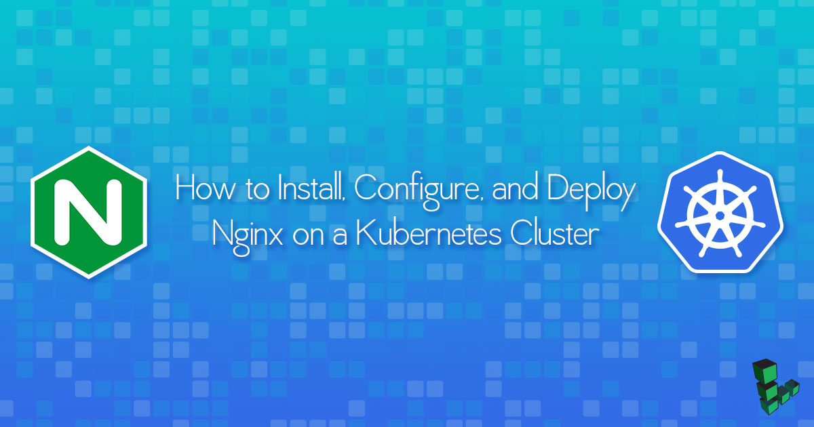

## What is Kubernetes?

[Kubernetes](https://kubernetes.io/) is an open-source container management system that is based on [Google Borg](https://research.google.com/pubs/pub43438.html). It can be configured to provide highly available, horizontally autoscaling, automated deployments. This guide shows you how to manually set up a Kubernetes cluster on a Linode and manage the lifecycle of an NGINX service.


You can now create a Kubernetes cluster with one command using the Linode CLI. To provision Kubernetes on Linodes, this tool uses the [Linode Kubernetes Terraform module](https://github.com/linode/terraform-linode-k8s), the [Linode Cloud Controller Manager (CCM)](https://github.com/linode/linode-cloud-controller-manager), and the [Container Storage Interface (CSI) Driver](https://github.com/linode/linode-blockstorage-csi-driver) for Linode Block Storage.  See the [Kubernetes Tools](https://developers.linode.com/kubernetes/) page for installation steps. For an in-depth dive into the Linode Kubernetes Terraform module, see its related [Community Site post](https://www.linode.com/community/questions/17611/the-linode-kubernetes-module-for-terraform).


## Before You Begin

You will need:

* Two or more Linodes with [Private IPs](/docs/guides/managing-ip-addresses/#adding-an-ip-address)
* Each Linode should have a 64-bit distribution of either:
    - Ubuntu 16.04+
    - Debian 9
    - CentOS 7
    - RHEL 7
    - Fedora 26
* At least 2GB RAM per Linode
* Root or sudo privileges to install and configure Kubernetes. Any user can interact with the cluster once it's configured.

## Prepare the Host Linode for Kubernetes

The steps in this guide create a two-node cluster. Evaluate your own resource requirements and launch an appropriately-sized cluster for your needs.

1.  Create two Linodes with at least 2GB memory within the same data center.

1.  For each node, go into the **Networking** tab of the Linode Cloud Manager and add a [private IP](/docs/guides/managing-ip-addresses/#adding-an-ip-address). It is possible to build a Kubernetes cluster using public IPs between data centers, but performance and security may suffer.

1.  Configure a firewall with [UFW](/docs/guides/configure-firewall-with-ufw/) or [iptables](/docs/guides/control-network-traffic-with-iptables/) to ensure only the two nodes can communicate with each other.

    When configuring your firewall, a good place to start is to create rules for the ports Kubernetes requires to function. This includes any inbound traffic on Master nodes and their required ports. If you have changed any custom ports, you should ensure those ports are also open. Master Nodes will have a public IP address or `192.168.0.0/16`. See the chart below for more details.

    On Worker nodes, you should allow inbound kubelet traffic. For NodePort traffic you should allow a large range from the world or if you are using the [Linode NodeBalancers service](https://github.com/linode/linode-cloud-controller-manager) exclusively for ingress, `192.168.255.0/24`. See the chart below for more details.

    The table below provides a list of the required ports for Master nodes and Worker nodes. You should also include port `22`.

    **Master nodes**

    | Protocol | Direction | Port Range | Purpose |  Used By |
    | -------- | --------- | ---------- | ------- |  ------- |
    | TCP | Inbound | 6443* | Kubernetes API server |  All |
    | TCP | Inbound | 2379-2380 | etcd server client API |  kube-apiserver, etcd |
    | TCP | Inbound | 10250 | kubelet API |  Self, Control plane |
    | TCP | Inbound | 10251 | kube-scheduler |  Self |
    | TCP | Inbound | 10253 | kube-controller-manager |  Self |

    **Worker nodes**

    | Protocol | Direction | Port Range | Purpose |  Used By |
    | -------- | --------- | ---------- | ------- |  ------- |
    | TCP | Inbound | 10250 | kubelet API |  Self, Control plane |
    | TCP | Inbound | 30000-32767 | NodePort Services** |  All |

    
  By design, kube-proxy will always place its iptables chains first. It inserts 2 rules, KUBE-EXTERNAL-SERVICES and KUBE-FIREWALL at the top of the INPUT chain. See the [Kubernetes discussion forum](https://discuss.kubernetes.io/t/custom-iptables-rules-for-input-chain/3509) for more details.
    

1.  You should consider using the Linode NodeBalancer service with the [Linode Cloud Controller Manager (CCM)](https://github.com/linode/linode-cloud-controller-manager).

    - When using Linode NodeBalancers ensure you add iptables rules to allow the NodeBalancer traffic: `192.168.255.0/24`.

1. To obtain persistent storage capabilities, you can use the [Container Storage Interface (CSI) Driver](https://github.com/linode/linode-blockstorage-csi-driver) for Linode Block Storage.

## What is Ingress?

Ingress is a smart router to handle traffic for your Kubernetes cluster. As opposed to the common perception, it isn’t a service but is a combination of an API object and a controller that handles and manages rules for traffic routing. Rules defined within Ingress API are passed on to an Ingress controller that is listening for them. This controller then consumes those rules for traffic routing.

### Disable Swap Memory

Linodes come with swap memory enabled by default. [kubelets](https://kubernetes.io/docs/admin/kubelet/) do not support swap memory and will not work if swap is active or even present in your `/etc/fstab` file.

The `/etc/fstab` should look something like this:


# /etc/fstab: static file system information.
#
# use 'blkid' to print the universally unique identifier for a
# device; this may be used with uuid= as a more robust way to name devices
# that works even if disks are added and removed. see fstab(5).
#
# &lt;file system&gt; &lt;mount point&gt;   &lt;type&gt;  &lt;options&gt;       &lt;dump&gt;  &lt;pass&gt;
# / was on /dev/sda1 during installation
/dev/sda         /               ext4    noatime,errors=remount-ro 0       1
/dev/sdb         none            swap    sw 0    0


1.  Delete the line describing the swap partition. In this example, Line 10 with `/dev/sdb`.

1.  Disable swap memory usage:

        swapoff -a

### Set Hostnames for Kubernetes Nodes

To make the commands in this guide easier to understand, set up your hostname and hosts files on each of your machines.

1.  Choose a node to designate as your Kubernetes master node and SSH into it.

1.  Edit `/etc/hostname`, and add:

    
kube-master


1.  Add the following lines to `/etc/hosts`:

    
<kube-master-private-ip>    kube-master
<kube-worker-private-ip>    kube-worker-1


    If you have more than two nodes, add their private IPs to `/etc/hosts` as well.

    To make it easier to understand output and debug issues later, consider naming each hostname according to its role (`kube-worker-1`, `kube-worker-2`, etc.).

1.  Perform Steps 2 and 3 on each worker node, changing the values accordingly.

1.  For the changes to take effect, restart your Linodes.

### Confirm Hostnames

Once your nodes have rebooted, log into each to confirm your changes.

Check that:

 - `$ hostname` in the terminal outputs the expected hostname.
 - You can ping all of the nodes in your cluster by their hostnames.
 - Swap is correctly disabled on all nodes using `cat /proc/swaps`.

If you are unable to ping any of your hosts by their hostnames or private IPs:

1. SSH into the host that isn't responding.

1. Enter `ifconfig`. You should see an entry for `eth0:1` that lists your private IP. If `eth0:1` isn't listed, it's possible that you deployed your Linode image before adding a private IP to the underlying host. Recreate the image and return to the beginning of the guide.

## Install Docker and Kubernetes on Linode

**Debian/Ubuntu:**

    apt install ebtables ethtool

**CentOS/RHEL:**

    yum install ebtables ethtool

### Install Docker



### Install kubeadm, kubectl, and kubelet

**Debian/Ubuntu:**

    curl -s https://packages.cloud.google.com/apt/doc/apt-key.gpg | sudo apt-key add -
    echo 'deb http://apt.kubernetes.io/ kubernetes-xenial main' | sudo tee /etc/apt/sources.list.d/kubernetes.list
    sudo apt update
    sudo apt install -y kubelet kubeadm kubectl

**CentOS/RHEL:**

    cat <<eof > /etc/yum.repos.d/kubernetes.repo
    [kubernetes]
    name=kubernetes
    baseurl=https://packages.cloud.google.com/yum/repos/kubernetes-el7-x86_64
    enabled=1
    gpgcheck=1
    repo_gpgcheck=1
    gpgkey=https://packages.cloud.google.com/yum/doc/yum-key.gpg
          https://packages.cloud.google.com/yum/doc/rpm-package-key.gpg
    eof
    setenforce 0
    yum install -y kubelet kubeadm kubectl
    systemctl enable kubelet && systemctl start kubelet

## Kubernetes Master and Slave

### Configure the Kubernetes Master Node

1.  On the master node initialize your cluster using its private IP:

        kubeadm init  --pod-network-cidr=192.168.0.0/16 --apiserver-advertise-address=<private IP>

    If you encounter a warning stating that swap is enabled, return to the [Disable Swap Memory](#disable-swap-memory) section.

    If successful, your output will resemble:

    
To start using your cluster, you need to run (as a regular user):

  mkdir -p $HOME/.kube
  sudo cp -i /etc/kubernetes/admin.conf $HOME/.kube/config
  sudo chown $(id -u):$(id -g) $HOME/.kube/config

You should now deploy a Pod network to the cluster.
Run "kubectl apply -f [podnetwork].yaml" with one of the options listed at:
  http://kubernetes.io/docs/admin/addons/

You can now join any number of machines by running the following on each node
as root:

  kubeadm join --token 921e92.d4582205da623812 <private IP>:6443 --discovery-token-ca-cert-hash sha256:bd85666b6a97072709b210ddf677245b4d79dab88d61b4a521fc00b0fbcc710c


1.  On the master node, configure the `kubectl` tool:

        mkdir -p $HOME/.kube
        sudo cp -i /etc/kubernetes/admin.conf $HOME/.kube/config
        sudo chown $(id -u):$(id -g) $HOME/.kube/config

1.  Check on the status of the nodes with `kubectl get nodes`. Output will resemble:

        root@kube-master:~# kubectl get nodes
        name          status     roles     age       version
        kube-master   NotReady   master    1m        v1.8.1

    The master node is listed as `NotReady` because the cluster does not have a Container Networking Interface ([CNI](https://github.com/containernetworking/cni/blob/master/SPEC.md)). CNI is a spec for a of container based network interface. In this guide, we will be using Calico. Alternatively, you can use [Flannel](https://raw.githubusercontent.com/coreos/flannel/v0.9.0/Documentation/kube-flannel.yml) or another CNI for similar results.

    The `--pod-network-cidr` argument used in the [Configure the Kubernetes Master Node](#configure-the-kubernetes-master-node) section defines the network range for the CNI.

1.  While still on the master node run the following command to deploy the CNI to your cluster:

        kubectl apply -f https://docs.projectcalico.org/v2.6/getting-started/kubernetes/installation/hosted/kubeadm/1.6/calico.yaml

1.  To ensure Calico was set up correctly, use `kubectl get pods --all-namespaces` to view the Pods created in the `kube-system` namespace:

        root@kube-master:~# kubectl get pods --all-namespaces
        NAMESPACE     NAME                                       READY     STATUS             RESTARTS   AGE
        kube-system   calico-etcd-nmx26                          1/1       Running            0          48s
        kube-system   calico-kube-controllers-6ff88bf6d4-p25cw   1/1       Running            0          47s
        kube-system   calico-node-bldzb                          1/2       CrashLoopBackOff   2          48s
        kube-system   calico-node-k5c9m                          2/2       Running            0          48s
        kube-system   etcd-master                                1/1       Running            0          3m
        kube-system   kube-apiserver-master                      1/1       Running            0          3m
        kube-system   kube-controller-manager-master             1/1       Running            0          3m
        kube-system   kube-dns-545bc4bfd4-g8xtm                  3/3       Running            0          4m
        kube-system   kube-proxy-sw562                           1/1       Running            0          4m
        kube-system   kube-proxy-x6psn                           1/1       Running            0          1m
        kube-system   kube-scheduler-master                      1/1       Running            0          3m

    This command uses the `-n` flag. The `-n` flag is a global kubectl flag that selects a non-default namespace. We can see our existing name spaces by running `kubectl get namespaces`:

        root@kube-master:~# kubectl get namespaces
        NAME          STATUS    AGE
        default       Active    4h
        kube-public   Active    4h
        kube-system   Active    4h

1.  Run `kubectl get nodes` again to see that the master node is now running properly:

        root@kube-master:~# kubectl get nodes
        name          status    roles     age       version
        kube-master   Ready     master    12m       v1.8.1

### Add Nodes to the Kubernetes Cluster

1. Run `kubeadm join` with the `kube-master` hostname to add the first worker:

        kubeadm join --token <some-token> kube-master:6443 --discovery-token-ca-cert-hash sha256:<some-sha256-hash>

1. On the master node, use `kubectl` to see that the slave node is now ready:

    
root@kube-master:~# kubectl get nodes
name            status    roles     age       version
kube-master     ready     master    37m       v1.8.1
kube-worker-1   ready     <none>    2m        v1.8.1


## Deploy NGINX on the Kubernetes Cluster

A *deployment* is a logical reference to a Pod or Pods and their configurations.

1.  From your master node `kubectl create` an nginx deployment:

        kubectl create deployment nginx --image=nginx

1.  This creates a deployment called `nginx`. `kubectl get deployments` lists all available deployments:

        kubectl get deployments

1.  Use `kubectl describe deployment nginx` to view more information:

    
Name:                   nginx
Namespace:              default
CreationTimestamp:      Sun, 15 Oct 2017 06:10:50 +0000
Labels:                 app=nginx
Annotations:            deployment.kubernetes.io/revision=1
Selector:               app=nginx
Replicas:               1 desired | 1 updated | 1 total | 1 available | 0 unavailable
StrategyType:           RollingUpdate
MinReadySeconds:        0
RollingUpdateStrategy:  1 max unavailable, 1 max surge
Pod Template:
  Labels:  app=nginx
  Containers:
    nginx:
    Image:        nginx
    Port:         <none>
    Environment:  <none>
    Mounts:       <none>
  Volumes:        <none>
Conditions:
  Type           Status  Reason
  ----           ------  ------
  Available      True    MinimumReplicasAvailable
OldReplicaSets:  <none>
NewReplicaSet:   nginx-68fcbc9696 (1/1 replicas created)
Events:
  Type    Reason             Age   From                   Message
  ----    ------             ----  ----                   -------
  Normal  ScalingReplicaSet  1m    deployment-controller  Scaled up replica set nginx-68fcbc9696 to 1


    The `describe` command allows you to interrogate different Kubernetes resources such as Pods, deployments, and services at a deeper level. The output above indicates that there is a deployment called `nginx` within the default namespace. This deployment has a single replicate, and is running the docker image `nginx`. The ports, mounts, volumes and environmental variable are all unset.

1.  Make the NGINX container accessible via the internet:

        kubectl create service nodeport nginx --tcp=80:80

    This creates a public facing service on the host for the NGINX deployment. Because this is a nodeport deployment, Kubernetes will assign this service a port on the host machine in the `32000`+ range.

    Try to `get` the current services:

        root@kube-master:~# kubectl get svc
        NAME         TYPE        CLUSTER-IP    EXTERNAL-IP   PORT(S)        AGE
        kubernetes   ClusterIP   10.96.0.1     <none>        443/TCP        5h
        nginx        NodePort    10.98.24.29   <none>        80:32555/TCP   52s

1.  Verify that the NGINX deployment is successful by using `curl` on the slave node:

        root@kube-master:~# curl kube-worker-1:32555

    The output will show the unrendered "Welcome to nginx!" page HTML.

1.  To remove the deployment, use `kubectl delete deployment`:

        root@kube-master:~# kubectl delete deployment nginx
        deployment "nginx" deleted
        root@kube-master:~# kubectl get deployments
        No resources found.

## Why Use Ingress?

Ingress manages external access to services running within a Kubernetes cluster. As such, its key benefits are:

- Allows external HTTP access to apps running within the cluster.
- Enables load balancing and other traffic routes.
- Facilitates TLS/SSL termination.
- Supports URI based routing.

## How Does NGINX Ingress Work?

NGINX Ingress controller runs in a Kubernetes Cluster as an application and leverages Ingress resources to configure a load balancer. This controller helps with TLS/SSL termination, load balancing, and also with content-based routing.

Currently, NGINX Ingress controller supports both NGINX and NGINX Plus features.

## How To Identify Which Ingress Controllers Are You Using?

To identify which controllers your NGINX Kubernetes cluster is using, you can go to the container image of your Ingress controller.

## How To Install Ingress On A Kubernetes Cluster?

### Installing Helm

To install Ingress with this guide, you can use Helm. If not already installed, you can run the following script on your terminal to install it:

    curl -fsSL -o get_helm.sh https://raw.githubusercontent.com/helm/helm/master/scripts/get-helm-3
    chmod 700 get_helm.sh
    ./get_helm.sh

For more details on Helm and installing Helm, see [How to Install Apps on Kubernetes with Helm 3](/docs/guides/how-to-install-apps-on-kubernetes-with-helm-3/).

### Installing Ingress Controller

1.  First, update your Helm repositories by running the following command:

        helm repo update

1.  Install NGINX controller

        helm install nginx-ingress stable/nginx-ingress

When you run the last command, you not only get an Ingress controller installed but this command also automatically creates a Linode LoadBalancer.

Once, the installation is successful you can see a success message like below:

NAME: nginx-ingress
LAST DEPLOYED: Wed Jan 15 00:15:11 2021
NAMESPACE: default
STATUS: deployed
REVISION: 1
TEST SUITE: None
NOTES:
The nginx-ingress controller is now installed.
It may take a few minutes for the LoadBalancer IP to be available.
You can view the status by running 'kubectl --namespace default get services -o wide -w nginx-ingress-controller'


It is worth understanding that there are popular controllers that use NGINX:
    - Kubernetes Ingress NGINX which is maintained by the Kubernetes open-source community
    - NGINX Kubernetes Ingress which is maintained by NGINX

You should know that there are huge differences between those two Ingress controllers, but that is beyond the scope of this guide.

