## What is the Elastic Stack?

[The Elastic Stack](https://www.elastic.co/elk-stack) is a collection of open source projects from Elastic that help collect and visualize a wide variety of data sources. Elasticsearch can store and aggregate data such as log files, container metrics, and more. The products in the stack include: Elasticsearch, Logstash, Kibana, and now Beats.

This guide provides instructions to:

- [Configure and deploy](#configure-helm) a number of [Helm](https://helm.sh) [charts](#install-charts) in a [Kubernetes](https://kubernetes.io/) cluster in order to set up components of the Elastic Stack.
- [Configure and run Kibana](#configure-kibana) in the web browser.
- [Install Metricbeat](#metricbeat) and deploy dashboards to Kibana to explore Kubernetes cluster data.

You can further use the Elastic Stack deployed and configured for application logs or monitoring Kubernetes.


This guide's example instructions creates the following billable resources on the Linode account: four (4) Linodes and three (3) Block Storage volumes. If you do not want to keep using the example cluster that you create, be sure to delete the cluster Linodes and volumes after you have finished the guide.

If you remove the resources afterward, you are billed only for the hour(s) that the resources were present on the account. For more information, see [Billing and Payments](/docs/guides/understanding-billing-and-payments/) guide about how hourly billing works and for a table of plan pricing.


## Before You Begin


This guide uses Kubernetes services which are private by default. Local listeners are opened which allow you to access the services on the local browser, however, web servers and NodeBalancers are out scope for this guide. Due to this, you should complete the steps of this guide from the local computer or from a computer that gives you access to the web browser. If you want to access these services from a public domain, please see the [Getting Started with NodeBalancers](/docs/guides/getting-started-with-nodebalancers/) guide.


1.  [Install the Kubernetes CLI](https://kubernetes.io/docs/tasks/tools/install-kubectl/) (`kubectl`) on the local computer.

1.  Follow the instructions in [Deploying and Managing a Cluster with Linode Kubernetes Engine Tutorial](/docs/guides/deploy-and-manage-a-cluster-with-linode-kubernetes-engine-a-tutorial/) to create and connect to an LKE cluster.

     Ensure that the LKE cluster that you create has three nodes and one master node with  4GB Linode instances. Also ensure that the `KUBECONFIG` context is [persistent](/docs/guides/deploy-and-manage-a-cluster-with-linode-kubernetes-engine-a-tutorial/#persist-the-kubeconfig-context)

1.  You should also make sure that Kubernetes CLI is using the right cluster context. Run the `get-contexts` subcommand to check:

        kubectl config get-contexts

1.  Set up Helm in the Kubernetes cluster by following the [Install Helm](/docs/kubernetes/how-to-install-apps-on-kubernetes-with-helm-3/#install-helm) section in the *How to Install Apps on Kubernetes with Helm 3* guide.

## Configure Helm

You should now have a Kubernetes cluster with Helm installed and configured.

1.  Add the `elastic` chart repository to the local installation of Helm:

        helm repo add elastic https://helm.elastic.co

1.  Fetch the updated list of charts from all configured chart repositories:

        helm repo update

1.  Search for the official `elasticsearch` chart to confirm Helm has been configured correctly. Note that this chart released by Elastic differs from the chart bundled with the default installation of Helm.

        helm search hub elasticsearch

    This command returns all the charts available for `elasticsearch` in the hub. Select the one listed below. The exact version numbers may be different; at the time of writing this guide the version is 7.8.0.

    
NAME                                              CHART VERSION   APP VERSION   DESCRIPTION
https://hub.helm.sh/charts/elastic/elasticsearch  7.8.0        	  7.8.0      	Official Elastic helm chart for Elasticsearch


    The Helm environment is now ready to install official Elasticsearch charts to the Kubernetes cluster.

## Install Charts

### Install Elasticsearch

Before installing the chart, ensure that resources are set appropriately. By default, the `elasticsearch` chart allocates 1GB of memory to the JVM heap and sets Kubernetes resource requests and limits to 2GB. Using a Linode 4GB instance is compatible with these defaults, but if you are using a different instance type, you need to provide different values to the chart at install time in order to ensure that running Pods are within the resource constraints of the node sizes you have chosen.

1.  Install the `elasticsearch` chart:

        helm install elasticsearch elastic/elasticsearch

    An output similar to the following appears:

    
    LAST DEPLOYED: Tue Jul  7 14:46:52 2020
    NAMESPACE: default
    STATUS: deployed
    REVISION: 1
    NOTES:
    1. Watch all cluster members come up.
       $ kubectl get pods --namespace=default -l app=elasticsearch-master -w
    2. Test cluster health using Helm test.
      $ helm test elasticsearch --cleanup
    

1.  A three-node Elasticsearch cluster is now configured and available locally to the Kubernetes cluster. To confirm this, first port-forward a local port to the Elasticsearch service. Leave this command running in a terminal window or tab in the background for the remainder of this tutorial.

        kubectl port-forward svc/elasticsearch-master 9200:9200

     This command times out after 5 minutes, if you find that and want to have the port forward for longer, consider using the following command to keep it open: `while true; do kubectl port-forward svc/elasticsearch-master 9200:9200; done` 

1.  In another terminal window, send a request to this port:

        curl http://localhost:9200/

    An output similar to the following appears:

    
{
  "name" : "elasticsearch-master-1",
  "cluster_name" : "elasticsearch",
  "cluster_uuid" : "2eKh30v2Q1ybT9HTPqQw9w",
  "version" : {
    "number" : "7.8.0",
    "build_flavor" : "default",
    "build_type" : "docker",
    "build_hash" : "757314695644ea9a1dc2fecd26d1a43856725e65",
    "build_date" : "2020-06-14T19:35:50.234439Z",
    "build_snapshot" : false,
    "lucene_version" : "8.5.1",
    "minimum_wire_compatibility_version" : "6.8.0",
    "minimum_index_compatibility_version" : "6.0.0-beta1"
  },
  "tagline" : "You Know, for Search"
}


     The specific version numbers and dates may be different in this JSON response. Elasticsearch is operational, but not receiving or serving any data. 

### Install Filebeat

In order to start processing data, deploy the `filebeat` chart to the Kubernetes cluster. This collects all Pod logs and stores them in Elasticsearch, after which they can be searched and used in visualizations within Kibana.

1.  Deploy the `filebeat` chart. No custom `values.yaml` file should be necessary:

        helm install filebeat elastic/filebeat

    An output similar to the following appears:

    
NAME: filebeat
LAST DEPLOYED: Tue Jul  7 15:33:52 2020
NAMESPACE: default
STATUS: deployed
REVISION: 1
TEST SUITE: None
NOTES:
1. Watch all containers come up.
   $ kubectl get pods --namespace=default -l app=filebeat-filebeat -w


1.  Confirm that Filebeat has started to index documents into Elasticsearch by sending a request to the locally-forwarded Elasticsearch service port in a different terminal:

        curl http://localhost:9200/_cat/indices

    At least one `filebeat` index should be present, and output should be similar to the following:

    
green open filebeat-7.8.0-2020.07.07-000001 6CYTk-UWQSeG7Y5-XjbQww 1 1 16975 0 10mb 5.8mb
    

### Install Kibana

Kibana provides a frontend to Elasticsearch and the data collected by Filebeat.

1.  Deploy the `kibana` chart:

        helm install kibana elastic/kibana

    An output similar to the following appears:

    
NAME: kibana
LAST DEPLOYED: Tue Jul  7 15:40:21 2020
NAMESPACE: default
STATUS: deployed
REVISION: 1
TEST SUITE: None


1.  Port-forward the `kibana-kibana` service in order to access Kibana locally. Leave this command running in the background as well for the remainder of this tutorial.

        kubectl port-forward svc/kibana-kibana 5601:5601

     This command times out after 5 minutes, if you find that and want to have the port forward for longer, consider using the following command to keep it open: `while true; do kubectl port-forward svc/kibana-kibana 5601:5601; done` 

## Configure Kibana

Before visualizing Pod logs, Kibana must be configured with an index pattern for Filebeat's indices.

1.  With the previous `port-forward` command running in another terminal window, open a browser and navigate to http://localhost:5601

1.  A welcome page similar to the following appears in the browser. Click the **Explore on my own** button.

    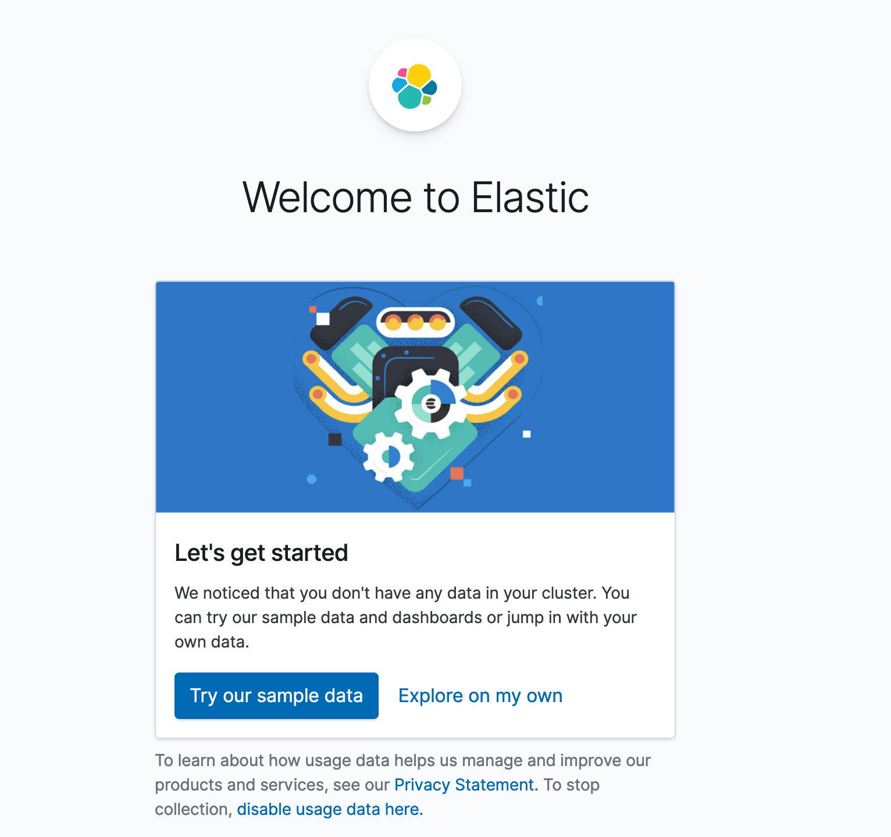

1.  Open the menu, then go to **Stack Management > Kibana > Index Patterns** to  create a new index pattern. The **Index patterns** page appears.

1. Click the **Create index pattern** button to begin.

    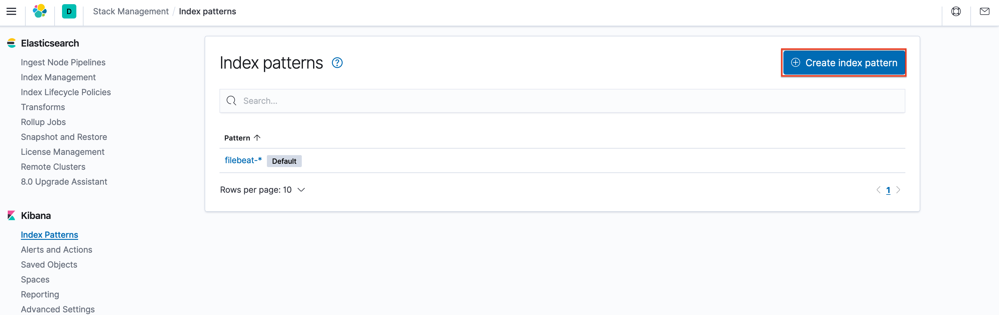

1.  In the **Define index pattern** window, type `filebeat-*` in the **Index pattern** text box and click the **Next step** button.

    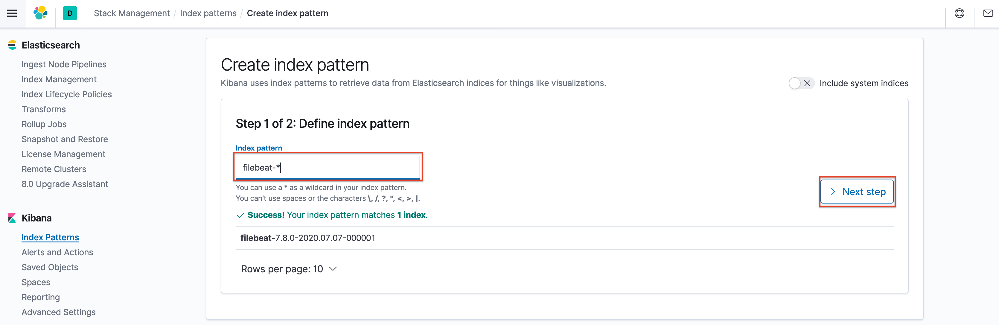

1.  In the **Configure settings** window, select `@timestamp` from the **Time Filter field name** dropdown menu and click the **Create index pattern** button.

    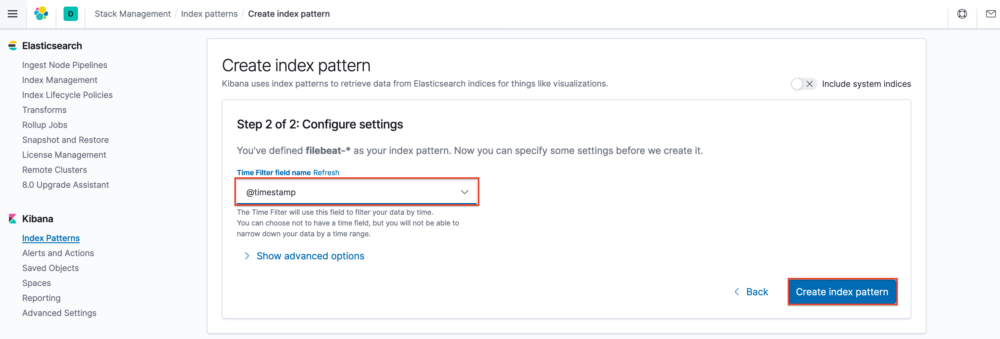

1.  A page with the index pattern details appears. Open the menu, then go to **Kibana > Discover** to view incoming logs.

    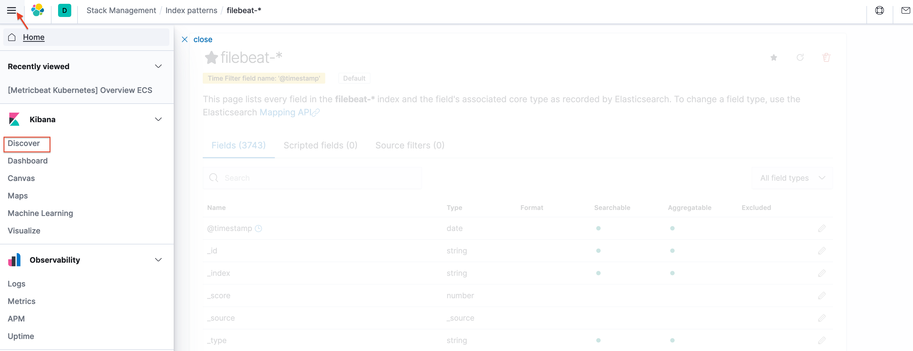

1.  The Discover page provides a realtime view of logs as they are ingested by Elasticsearch from the Kubernetes cluster. The histogram provides a view of log volume over time, which by default, spans the last 15 minutes. The sidebar on the left side of the user interface displays various fields parsed from JSON fields sent by Filebeat to Elasticsearch.

1.  Use the **Filters** box to search only for logs arriving from Kibana Pods by filtering for `kubernetes.container.name : "kibana"`. Click the **Update** button to apply the search filter.

     
When searching in the filters box, field names and values are auto-populated.


     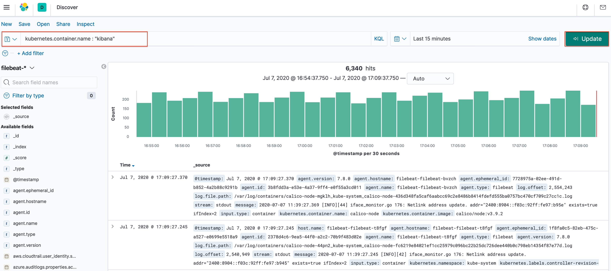

1.  In order to expand a log event, click the arrow next to an event in the user interface.

    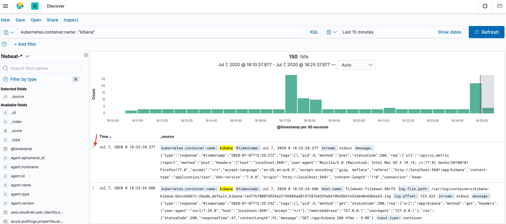

1.  Scroll down to view the entire log document in Kibana. Observe the fields provided by Filebeat, including the `message` field, which contains standard out and standard error messages from the container, as well as the Kubernetes node and Pod name in fields prefixed with `kubernetes`.

    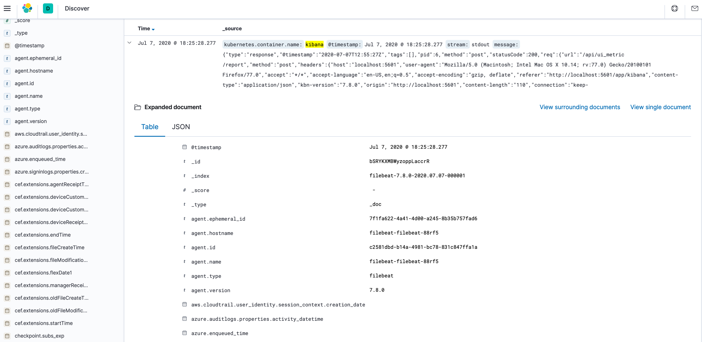

1.  Look closely at the `message` field in the log representation and note that the text field is formatted as JSON. While the terms in this field can be searched with free text search terms in Kibana, parsing the field generally yields better results.

## Metricbeat

In addition to collecting logs with Filebeat, Metricbeat can collect Pod and node metrics in order to visualize information such as resource utilization.

### Install Metricbeat

1.  Deploy the `metricbeat` chart.

        helm install metricbeat elastic/metricbeat

    An output similar to the following appears:

    
NAME: metricbeat
LAST DEPLOYED: Tue Jul  7 18:43:58 2020
NAMESPACE: default
STATUS: deployed
REVISION: 1
TEST SUITE: None
NOTES:
1. Watch all containers come up.
   $ kubectl get pods --namespace=default -l app=metricbeat-metricbeat -w


1.  Confirm that Metricbeat has started to index documents into Elasticsearch by sending a request to the locally-forwarded Elasticsearch service port:

        curl http://localhost:9200/_cat/indices

    At least one `metricbeat` index should be present, similar to the following:

    
green open metricbeat-7.8.0-2020.07.07-000001 wAWu5op1SJqlbaXKOj_tSg 1 1  1214 0   3.5mb   1.7mb


### Load Dashboards

Metricbeat can install default Dashboards into Kibana to provide out-of-the-box visualizations for data collected by Kubernetes.

Before following these steps, ensure that the `port-forward` command to expose Kibana over port `5601` locally is still running.

Run the following commands on the local machine. This communicates with Kibana over `127.0.0.1:5601` to import default Dashboards that is populated with data from Metricbeat.


The commands should use the same version of Metricbeat deployed to the Kubernetes cluster. You can find this version by issuing the following command:

    helm get values --all metricbeat | grep imageTag


#### For Linux

1.  Get the Metricbeat package.

        wget https://artifacts.elastic.co/downloads/beats/metricbeat/metricbeat-7.8.0-linux-x86_64.tar.gz

1.  Unzip the package.

        tar xvzf metricbeat-7.8.0-linux-x86_64.tar.gz

1.  Navigate to the directory.

        cd metricbeat-7.8.0-linux-x86_64

1.  Setup the dashboards.

        ./metricbeat setup --dashboards

#### For MacOS

1.  Get the Metricbeat package.

        curl -L -O https://artifacts.elastic.co/downloads/beats/metricbeat/metricbeat-7.8.0-darwin-x86_64.tar.gz

1.  Unzip the package.

        tar xzvf metricbeat-7.8.0-darwin-x86_64.tar.gz

1.  Navigate to the directory.

        cd metricbeat-7.8.0-darwin-x86_64

1.  Setup the dashboards.

        ./metricbeat setup --dashboards

#### Explore Dashboards

1.  Open a browser window to http://localhost:5601 and click the **Dashboards** in the left sidebar.

    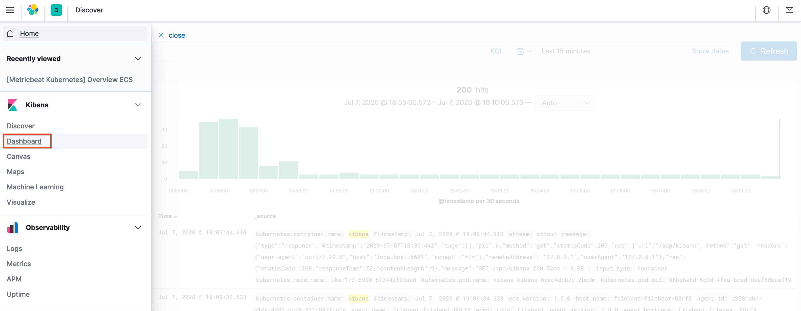

1.  In the search box, enter "kubernetes" and press `Enter`. Select the **[Metricbeat Kubernetes] Overview ECS** dashboard.

    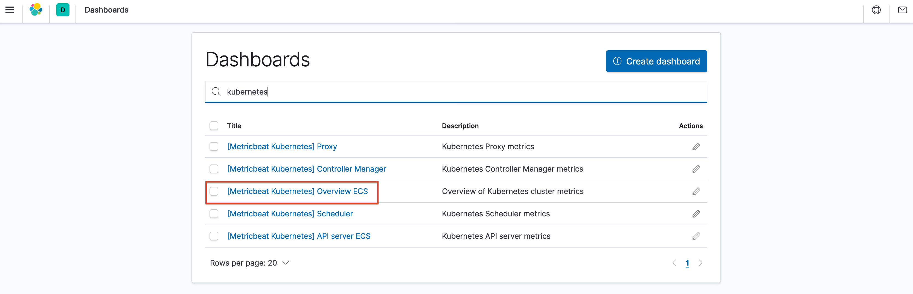

1.  The following dashboard displays several types of metrics about the Kubernetes cluster.

    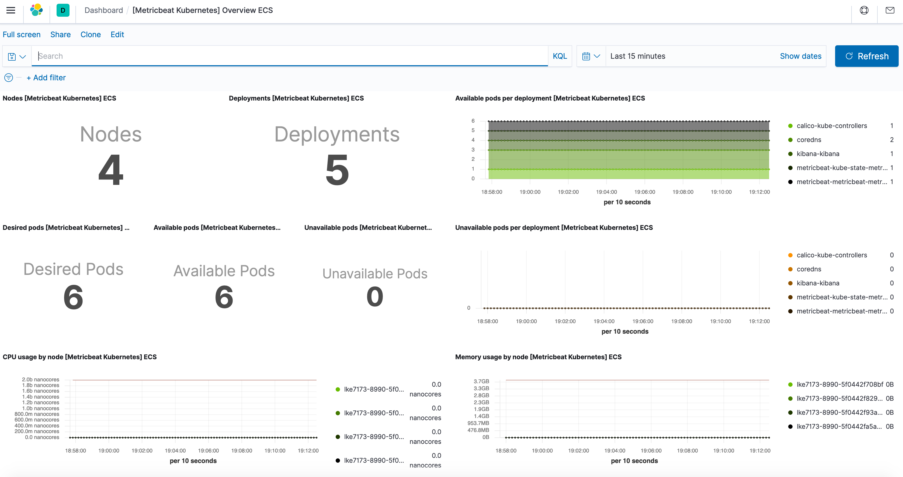

1.  You can explore the various visualizations on this page in order to view metrics about *Pods*, *nodes*, and the overall health of the Kubernetes cluster.

## Next Steps

From this point onward, any additional workloads started in Kubernetes is processed by Filebeat and Metricbeat in order to collect logs and metrics for later introspection within Kibana. As Kubernetes nodes are added or removed, the Filebeat and Metricbeat `DaemonSets` automatically scale out Pods to monitor nodes as they join the Kubernetes cluster.
