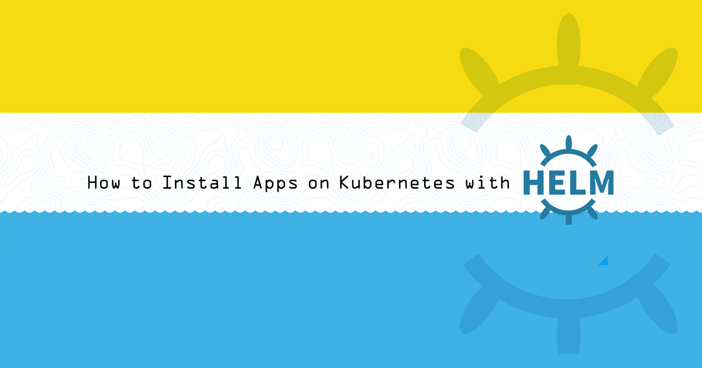
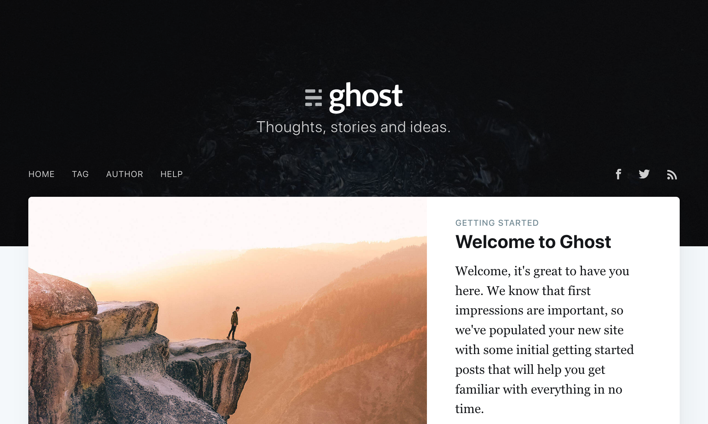

## What is Helm?

[Helm](https://helm.sh) is a tool that assists with installing and managing applications on Kubernetes clusters. It is often referred to as "the package manager for Kubernetes," and it provides functions that are similar to a package manager for an operating system:

- Helm prescribes a common format and directory structure for packaging your Kubernetes resources, known as a [Helm *chart*](#charts).

- Helm provides a [public repository of charts](https://github.com/helm/charts/) for popular software. You can also retrieve charts from third-party repositories, author and contribute your own charts to someone else's repository, or run your own chart repository.

- The Helm client software offers commands for: listing and searching for charts by keyword, installing applications to your cluster from charts, upgrading those applications, removing applications, and other management functions.

### Charts

The components of a Kubernetes application--deployments, services, ingresses, and other objects--are listed in manifest files (in the YAML file format). Kubernetes does not tell you how you should organize those files, though the Kubernetes documentation does offer a general set of [best practices](https://kubernetes.io/docs/concepts/configuration/overview/#general-configuration-tips).

[Helm *charts*](https://helm.sh/docs/topics/chart_repository/) are the software packaging format for Helm. A chart specifies a file and directory structure that you follow when packaging your manifests. The structure looks as follows:

```output
chart-name/
  Chart.yaml
  LICENSE
  README.md
  requirements.yaml
  values.yaml
  charts/
  templates/
  templates/NOTES.txt
```

| File or Directory | Description |
| -- | -- |
| [Chart.yaml](https://v2.helm.sh/docs/developing_charts/#the-chart-yaml-file) | General information about the chart, including the chart name, a version number, and a description. |
| [LICENSE](https://v2.helm.sh/docs/developing_charts/#chart-license-readme-and-notes) | A plain-text file with licensing information for the chart and for the applications installed by the chart. *Optional*. |
| [README.md](https://v2.helm.sh/docs/developing_charts/#chart-license-readme-and-notes) | A Markdown file with instructions that a user of a chart may want to know when installing and using the chart, including a description of the app that the chart installs and the template values that can be set by the user. *Optional*. |
| [requirements.yaml](https://v2.helm.sh/docs/developing_charts/#managing-dependencies-with-requirements-yaml) | A listing of the charts that this chart depends on. This list will specify the chart name version number for each dependency, as well as the repository URL that the chart can be retrieved from. *Optional*. |
| [values.yaml](https://v2.helm.sh/docs/developing_charts/#values-files) | Default values for the variables in your manifests' templates. |
| [charts/](https://v2.helm.sh/docs/developing_charts/#managing-dependencies-manually-via-the-charts-directory) | A directory which stores chart dependencies that you manually copy into your project, instead of linking to them from the `requirements.yaml` file. |
| [templates/](https://v2.helm.sh/docs/developing_charts/#templates-and-values) | Your Kubernetes manifests are stored in the `templates/` directory.  Helm will interpret your manifests using the [Go templating language](https://golang.org/pkg/text/template/) before applying them to your cluster. You can use the template language to insert variables into your manifests, and users of your chart will be able to enter their own values for those variables. |
| [templates/NOTES.txt](https://v2.helm.sh/docs/developing_charts/#chart-license-readme-and-notes) | A plain-text file which will print to a user's terminal when they install the chart. This text can be used to display post-installation instructions or other information that a user may want to know. *Optional*. |

### Releases

When you tell Helm to install a chart, you can specify variable values to be inserted into the chart's manifest templates. Helm will then compile those templates into manifests that can be applied to your cluster. When it does this, it creates a new *release*.

You can install a chart to the same cluster more than once. Each time you tell Helm to install a chart, it creates another release for that chart. A release can be upgraded when a new version of a chart is available, or even when you just want to supply new variable values to the chart. Helm tracks each upgrade to your release, and it allows you to roll back an upgrade. A release can be easily deleted from your cluster, and you can even roll back release deletions.

### Helm Client and Helm Tiller

Helm operates with two components:

- The Helm client software that issues commands to your cluster. You run the client software on your computer, in your CI/CD environment, or anywhere else you'd like

- A server component runs on your cluster and receives commands from the Helm client software. This component is called *Tiller*. Tiller is responsible for directly interacting with the Kubernetes API (which the client software does not do). Tiller maintains the state for your Helm releases.

## Before You Begin

1. [Install the Kubernetes CLI](https://kubernetes.io/docs/tasks/tools/install-kubectl/) (`kubectl`) on your computer, if it is not already.

1. You should have a Kubernetes cluster running prior to starting this guide. One quick way to get a cluster up is with Linode's [`k8s-alpha` CLI command](https://developers.linode.com/kubernetes/). This guide's examples only require a cluster with one worker node. We recommend that you create cluster nodes that are at the Linode 4GB tier or higher.

    This guide also assumes that your cluster has [role-based access control (RBAC)](https://kubernetes.io/docs/reference/access-authn-authz/rbac/) enabled. This feature became available in Kubernetes 1.6. It is enabled on clusters created via the `k8s-alpha` Linode CLI.

    
    This guide's example instructions will also result in the creation of a Block Storage Volume and a NodeBalancer, which are also billable resources. If you do not want to keep using the example application after you finish reviewing your guide, make sure to [delete](#delete-a-release) these resources afterward.
    

1. You should also make sure that your Kubernetes CLI is using the right cluster context. Run the `get-contexts` subcommand to check:

    ```command
    kubectl config get-contexts
    ```

1. You can set kubectl to use a certain cluster context with the `use-context` subcommand and the cluster name that was previously output from the `get-contexts` subcommand:

    ```command
    kubectl config use-context your-cluster-name
    ```

1.  It is beneficial to have a registered domain name for this guide's example app, but it is not required.

## Install Helm

### Install the Helm Client

Install the Helm client software on your computer:

- **Linux**. Run the client installer script that Helm provides:

    ```command
    curl https://raw.githubusercontent.com/helm/helm/master/scripts/get > get_helm.sh
    chmod 700 get_helm.sh
    ./get_helm.sh
    ```

- **macOS**. Use [Homebrew](https://brew.sh) to install:

    ```command
    brew install kubernetes-helm
    ```

- **Windows**. Use [Chocolatey](https://chocolatey.org) to install:

    ```command
    choco install kubernetes-helm
    ```

### Install Tiller on your Cluster

Tiller's default installation instructions will attempt to install it without adequate permissions on a cluster with RBAC enabled, and it will fail. Alternative instructions are available which grant Tiller the appropriate permissions:


The following instructions provide Tiller to the `cluster-admin` role, which is a privileged Kubernetes API user for your cluster. This is a potential security concern. [Other access levels](https://v2.helm.sh/docs/using_helm/#role-based-access-control) for Tiller are possible, like restricting Tiller and the charts it installs [to a single namespace](https://v2.helm.sh/docs/using_helm/#example-deploy-tiller-in-a-namespace-restricted-to-deploying-resources-only-in-that-namespace). The [Bitnami Engineering blog](https://engineering.bitnami.com/articles/helm-security.html) has an article which further explores security in Helm.


1. Create a file on your computer named `rbac-config.yaml` with the following snippet:

    ```file {title="rbac-config.yaml" lang=yaml}
    apiVersion: v1
    kind: ServiceAccount
    metadata:
      name: tiller
      namespace: kube-system
    ---
    apiVersion: rbac.authorization.k8s.io/v1
    kind: ClusterRoleBinding
    metadata:
      name: tiller
    roleRef:
      apiGroup: rbac.authorization.k8s.io
      kind: ClusterRole
      name: cluster-admin
    subjects:
      - kind: ServiceAccount
        name: tiller
        namespace: kube-system
    ```

    This configuration creates a Kubernetes [Service Account](https://kubernetes.io/docs/tasks/configure-pod-container/configure-service-account/) for Tiller, and then binds it to the `cluster-admin` role.

1. Apply this configuration to your cluster:

    ```command
    kubectl create -f rbac-config.yaml
    ```

    ```output
    serviceaccount "tiller" created
    clusterrolebinding "tiller" created
    ```

1. Initialize Tiller on the cluster:

    ```command
    helm init --service-account tiller --history-max 200
    ```

    
    The `--history-max` option prevents Helm's historical record of the objects it tracks from growing too large.
    

1. You should see output like:

    ```output
    $HELM_HOME has been configured at /Users/your-user/.helm.

    Tiller (the Helm server-side component) has been installed into your Kubernetes Cluster.

    Please note: by default, Tiller is deployed with an insecure 'allow unauthenticated users' policy.
    To prevent this, run `helm init` with the --tiller-tls-verify flag.
    For more information on securing your installation see: https://docs.helm.sh/using_helm/#securing-your-helm-installation
    Happy Helming!
    ```

1. The Pod for Tiller will be running in the `kube-system` namespace:

    ```command
    kubectl get pods --namespace kube-system | grep tiller
    ```

    ```output
    tiller-deploy-b6647fc9d-vcdms                1/1       Running   0          1m
    ```

## Use Helm Charts to Install Apps

This guide will use the [Ghost](https://ghost.org) publishing platform as the example application.

### Search for a Chart

1. Run the `repo update` subcommand to make sure you have a full list of available charts:

    ```command
    helm repo update
    ```

    
    Run `helm repo list` to see which repositories are registered with your client.
    

1. Run the [`search` command](https://v2.helm.sh/docs/using_helm/#helm-search-finding-charts) with a keyword to search for a chart by name:

    ```command
    helm search ghost
    ```

    The output will look like:

    ```output
    NAME        	CHART VERSION	APP VERSION	DESCRIPTION
    stable/ghost	6.7.7        	2.19.4     	A simple, powerful publishing platform that allows you to...
    ```

1. The full name for the chart is `stable/ghost`. Inspect the chart for more information:

    ```command
    helm inspect stable/ghost
    ```

    This command's output will resemble the README text available for the [Ghost chart](https://github.com/helm/charts/tree/master/stable/ghost) in the official Helm chart repository on GitHub.

### Install the Chart

The [`helm install` command](https://v2.helm.sh/docs/using_helm/#helm-install-installing-a-package) is used to install a chart by name. It can be run without any other options, but some charts expect you to pass in configuration values for the chart:

1. Create a file named `ghost-config.yaml` on your computer from this snippet:

    ```file {title="ghost-config.yaml" lang=yaml}
    ghostHost: ghost.example.com
    ghostEmail: email@example.com
    ```

    Replace the value for ghostHost with a domain or subdomain that you own and would like to assign to the app, and the value for ghostEmail with your email.

    
    If you don't own a domain name and won't continue to use the Ghost website after finishing this guide, you can make up a domain for this configuration file.
    

1. Run the `install` command and pass in the configuration file:

    ```command
    helm install -f ghost-config.yaml stable/ghost
    ```

1. The `install` command returns immediately and does not wait until the app's cluster objects are ready. You will see output like the following snippet, which shows that the app's Pods are still in the "Pending" state. The text displayed is generated from the contents of the chart's `templates/NOTES.txt` file:

    
    ```output
    NAME:   oldfashioned-cricket
    LAST DEPLOYED: Tue Apr 16 09:15:41 2019
    NAMESPACE: default
    STATUS: DEPLOYED

    RESOURCES:
    ==> v1/ConfigMap
    NAME                      DATA  AGE
    oldfashioned-cricket-mariadb        1     1s
    oldfashioned-cricket-mariadb-tests  1     1s

    ==> v1/PersistentVolumeClaim
    NAME              STATUS   VOLUME                CAPACITY  ACCESS MODES  STORAGECLASS  AGE
    oldfashioned-cricket-ghost  Pending  linode-block-storage  1s

    ==> v1/Pod(related)
    NAME                               READY  STATUS   RESTARTS  AGE
    oldfashioned-cricket-ghost-64ff89b9d6-9ngjs  0/1    Pending  0         1s
    oldfashioned-cricket-mariadb-0               0/1    Pending  0         1s

    ==> v1/Secret
    NAME                TYPE    DATA  AGE
    oldfashioned-cricket-ghost    Opaque  1     1s
    oldfashioned-cricket-mariadb  Opaque  2     1s

    ==> v1/Service
    NAME                TYPE          CLUSTER-IP      EXTERNAL-IP  PORT(S)       AGE
    oldfashioned-cricket-ghost    LoadBalancer  10.110.3.191    <pending>    80:32658/TCP  1s
    oldfashioned-cricket-mariadb  ClusterIP     10.107.128.144  <none>       3306/TCP      1s

    ==> v1beta1/Deployment
    NAME              READY  UP-TO-DATE  AVAILABLE  AGE
    oldfashioned-cricket-ghost  0/1    1           0          1s

    ==> v1beta1/StatefulSet
    NAME                READY  AGE
    oldfashioned-cricket-mariadb  0/1    1s


    NOTES:
    1. Get the Ghost URL by running:

      echo Blog URL  : http://ghost.example.com/
      echo Admin URL : http://ghost.example.com/ghost

    2. Get your Ghost login credentials by running:

      echo Email:    email@example.com
      echo Password: $(kubectl get secret --namespace default oldfashioned-cricket-ghost -o jsonpath="{.data.ghost-password}" | base64 --decode)
      ```
    

1. Helm has created a new release and assigned it a random name. Run the `ls` command to get a list of all of your releases:

    ```command
    helm ls
    ```

    The output will look as follows:

    ```output
    NAME      	REVISION	UPDATED                 	STATUS  	CHART      	APP VERSION	NAMESPACE
    oldfashioned-cricket	1       	Tue Apr 16 09:15:41 2019	DEPLOYED	ghost-6.7.7	2.19.4     	default
    ```

1. You can check on the status of the release by running the `status` command:

    ```command
    helm status oldfashioned-cricket
    ```

    This command will show the same output that was displayed after the `helm install` command, but the current state of the cluster objects will be updated.

### Access your App

1. Run the `helm status` command again and observe the "Service" section:

    ```output
    ==> v1/Service
    NAME                TYPE          CLUSTER-IP      EXTERNAL-IP     PORT(S)       AGE
    oldfashioned-cricket-ghost    LoadBalancer  10.110.3.191    104.237.148.15  80:32658/TCP  11m
    oldfashioned-cricket-mariadb  ClusterIP     10.107.128.144  <none>          3306/TCP      11m
    ```

1. The LoadBalancer that was created for the app will be displayed. Because this example uses a cluster created with Linode's `k8s-alpha` CLI (which pre-installs the [Linode CCM](https://github.com/linode/linode-cloud-controller-manager)), the LoadBalancer will be implemented as a [Linode NodeBalancer](https://www.linode.com/nodebalancers).

1. Copy the value under the `EXTERNAL-IP` column for the LoadBalancer and then paste it into your web browser. You should see the Ghost website:

    

1. Revisit the output from the `status` command. Instructions for logging into your Ghost website will be displayed:

    ```output
    1. Get the Ghost URL by running:

    echo Blog URL  : http://ghost.example.com/
    echo Admin URL : http://ghost.example.com/ghost

    2. Get your Ghost login credentials by running:

    echo Email:    email@example.com
    echo Password: $(kubectl get secret --namespace default oldfashioned-cricket-ghost -o jsonpath="{.data.ghost-password}" | base64 --decode)
    ```

1. Retrieve the auto-generated password for your app:

    ```command
    echo Password: $(kubectl get secret --namespace default oldfashioned-cricket-ghost -o jsonpath="{.data.ghost-password}" | base64 --decode)
    ```

1. You haven't set up DNS for your site yet, but you can instead access the admin interface by visiting the `ghost` URL on your LoadBalancer IP address (e.g. `http://104.237.148.15/ghost`). Visit this page in your browser and then enter your email and password. You should be granted access to the administrative interface.

1. Set up DNS for your app. You can do this by creating an *A record* for your domain which is assigned to the external IP for your app's LoadBalancer. Review Linode's [DNS Manager](/docs/products/networking/dns-manager/) guide for instructions.

## Upgrade your App

The `upgrade` command can be used to upgrade an existing release to a new version of a chart, or just to supply new chart values:

1. In your computer's `ghost-config.yaml` file, add a line for the title of the website:

    ```file {title="ghost-config.yaml" lang=yaml}
    ghostHost: ghost.example.com
    ghostEmail: email@example.com
    ghostBlogTitle: Example Site Name
    ```

1. Run the upgrade command, specifying the configuration file, release name, and chart name:

    ```command
    helm upgrade -f ghost-config.yaml oldfashioned-cricket stable/ghost
    ```

## Roll Back a Release

Upgrades (and even deletions) can be rolled back if something goes wrong:

1. Run the `helm ls` command and observe the number under the "REVISION" column for your release:

    ```output
    NAME      	REVISION	UPDATED                 	STATUS  	CHART      	APP VERSION	NAMESPACE
    oldfashioned-cricket	2       	Tue Apr 16 10:02:58 2019	DEPLOYED	ghost-6.7.7	2.19.4     	default
    ```

1. Every time you perform an upgrade, the revision count is incremented by 1 (and the counter starts at 1 when you first install a chart). So, your current revision number is 2. To roll back the upgrade you just performed, enter the previous revision number:

    ```command
    helm rollback oldfashioned-cricket 1
    ```

## Delete a Release

1. Use the `delete` command with the name of a release to delete it:

    ```command
    helm delete oldfashioned-cricket
    ```

    You should also confirm in the [Linode Cloud Manager](https://cloud.linode.com) that the Volumes and NodeBalancer created for the app are removed as well.

1. Helm will still save information about the deleted release. You can list deleted releases:

    ```command
    helm list --deleted
    ```

    You can use the revision number of a deleted release to roll back the deletion.

1. To fully remove a release, use the `--purge` option with the `delete` command:

    ```command
    helm delete oldfashioned-cricket --purge
    ```