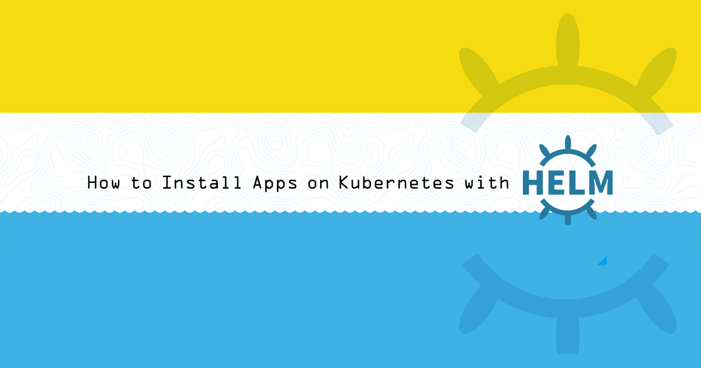
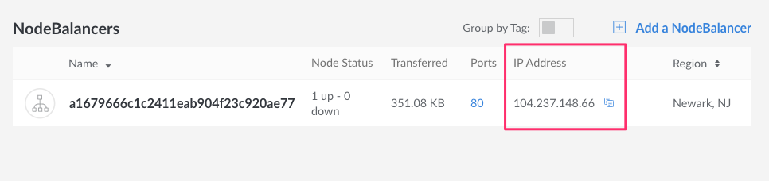
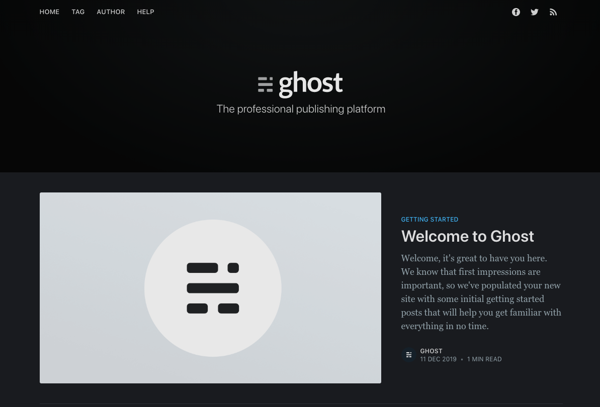

## What is Helm?

[Helm](https://helm.sh) is a tool that assists with installing and managing applications on Kubernetes clusters. It is often referred to as "the package manager for Kubernetes," and it provides functions that are similar to a package manager for an operating system:

-   Helm prescribes a common format and directory structure for packaging your Kubernetes resources, known as a [Helm *chart*](#charts).

-   Helm provides a [public repository of charts](https://hub.helm.sh/) for popular software. You can also retrieve charts from third-party repositories, author and contribute your own charts to someone else's repository, or run your own chart repository.

-   The Helm client software offers commands for: listing and searching for charts by keyword, installing applications to your cluster from charts, upgrading those applications, removing applications, and other management functions.

### New for Helm 3
Here are the biggest changes for Helm 3. For a complete list and more details, [see the FAQ](https://helm.sh/docs/faq/).

- The most notable change in Helm 3 was the removal of Tiller. With role-based access controls (RBAC) enabled by default in Kubernetes 1.6+, Tiller became unnecessary and was removed.

- Upgrading a chart is better than ever. Helm 3 introduces a 3-way merge patch, an improvement over Helm 2's 2-way approach. Helm is now able to consider the old manifest, the current state, and the new manifest, instead of just the most recent manifest and the proposed changes. The 3-way merge patch helps to ensure that a user can roll back changes regardless of how they're applied.

- Release names in Helm 3 are scoped to the namespace and have a `sh.helm.release.v1` prefix.

- Secrets are used as the default storage driver for releases.

- The Go import path has changed from `k8s.io/helm` to `helm.sh/helm/v3`.

- `requirements.yaml` has been folded into `Chart.yaml` as the `dependencies` field.

- Helm 3 now supports *Library* charts. These are shared by other charts and are intended to be reused to avoid redundancy.

- Helm 3 has moved to [XDG Base Directory Specification](https://specifications.freedesktop.org/basedir-spec/basedir-spec-latest.html). This means instead of Helm 2's `$HELM_HOME` location, you will find information stored in the following:
    - `XDG_CACHE_HOME`
    - `XDG_CONFIG_HOME`
    - `XDG_DATA_HOME`

- Helm Hub - Helm 3 does not come with chart repositories loaded out of the box. Instead there is now a central hub for charts called [Helm Hub](https://hub.helm.sh/).

### Migrating from Helm 2 to Helm 3

Helm has provided a plugin to migrate your projects from Helm 2 to Helm 3 called [helm-2to3](https://helm.sh/blog/migrate-from-helm-v2-to-helm-v3/). This plugin works in three stages. First it migrates the configuration, then the release, then it cleans up the configuration, release data, and Tiller.

### Charts

The components of a Kubernetes application--deployments, services, ingresses, and other objects--are listed in manifest files (in the YAML file format). Kubernetes does not tell you how you should organize those files, though the Kubernetes documentation does offer a general set of [best practices](https://kubernetes.io/docs/concepts/configuration/overview/#general-configuration-tips).

[Helm *charts*](https://helm.sh/docs/topics/charts/) are the software packaging format for Helm. A chart specifies a file and directory structure that you follow when packaging your manifests. The structure looks as follows:

    chart-name/
      Chart.yaml
      LICENSE
      README.md
      values.yaml
      charts/
      crds/
      templates/
      templates/NOTES.txt

| File or Directory   | Description |
|---------------------|-------------|
| [Chart.yaml](https://helm.sh/docs/topics/charts/#the-chart-yaml-file) | General information about the chart, including the chart name, a version number, and a description. Charts can be of two types, application or library. Set this with the `type` field. Application is the default. You can also set a chart to be deprecated with the optional `deprecated` field. Note the `apiVersion` field for Helm 3 will be v2. v1 charts can still be installed by Helm 3 but the dependencies field is located in a separate requirements.yaml file for v1 charts. Note also that the `appVersion` field is different from the `version` field, where `version` references the chart version and `appVersion` references the application version. |
| [LICENSE](https://helm.sh/docs/topics/charts/#chart-license-readme-and-notes) | A plain-text file with licensing information for the chart and for the applications installed by the chart. *Optional*. |
| [README.md](https://helm.sh/docs/topics/charts/#chart-license-readme-and-notes) | A Markdown file with instructions that a user of a chart may want to know when installing and using the chart, including a description of the app that the chart installs and the template values that can be set by the user. *Optional*. |
| [templates/NOTES.txt](https://helm.sh/docs/topics/chart_template_guide/notes_files/) | A plain-text file which will print to a user's terminal when they install the chart. This text can be used to display post-installation instructions or other information that a user may want to know. *Optional*. |
| [charts/](https://helm.sh/docs/topics/charts/#managing-dependencies-with-the-dependencies-field) | A directory which stores chart dependencies that you manually copy into your project, instead of linking to them from the `Chart.yaml` file's `dependencies` field. |
| [values.yaml](https://helm.sh/docs/topics/chart_template_guide/values_files/) | Default values for the variables in your manifests' templates. |
| [templates/](https://helm.sh/docs/topics/chart_best_practices/templates/) | Your Kubernetes manifests are stored in the `templates/` directory.  Helm will interpret your manifests using the [Go templating language](https://golang.org/pkg/text/template/) before applying them to your cluster. You can use the template language to insert variables into your manifests, and users of your chart will be able to enter their own values for those variables. |
| [Custom Resource Definitions (CRDS)](https://helm.sh/docs/topics/charts/#custom-resource-definitions-crds) | In Helm 3 CRDS are a special type of global object and are installed first. They should be placed in the `crds/` directory inside of the chart. You can have multiple CRDs in the same file as long as they are separated by YAML start and end markers. Note, these are only installed once and will not be upgraded or rolled back. Additionally, deleting a CRD deletes all of that CRD's contents across all namespaces in the cluster. Therefore, Helm does not do this. You can do it manually, carefully. Alternatively, you can skip with the `--skip-crds` option. |

### Releases

When you tell Helm to install a chart, you can specify variable values to be inserted into the chart's manifest templates. Helm will then compile those templates into manifests that can be applied to your cluster. When it does this, it creates a new *release*.

You can install a chart to the same cluster more than once. Each time you tell Helm to install a chart, it creates another release for that chart. A release can be [upgraded](#upgrade-your-app) when a new version of a chart is available, or even when you just want to supply new variable values to the chart. Helm tracks each upgrade to your release, and it allows you to [roll back an upgrade](#roll-back-a-release). A release can be easily [deleted](#delete-a-release) from your cluster, and you can even roll back release deletions when configured to do so in advanced.

### Helm Client

The Helm client software issues commands to your cluster. You run the client software on your computer, in your CI/CD environment, or anywhere else you'd like.

## Before You Begin

1.   [Install the Kubernetes CLI](https://kubernetes.io/docs/tasks/tools/install-kubectl/) (`kubectl`) on your computer, if it is not already.

1.   You should have a Kubernetes cluster running prior to starting this guide. One quick way to get a cluster up is with [Linode's Kubernetes Engine](/docs/guides/deploy-and-manage-a-cluster-with-linode-kubernetes-engine-a-tutorial/). This guide's examples only require a cluster with one worker node. We recommend that you create cluster nodes that are at the Linode 4GB tier (g6-standard-2) or higher. This guide also assumes that your cluster has [role-based access control (RBAC)](https://kubernetes.io/docs/reference/access-authn-authz/rbac/) enabled. This feature became available in Kubernetes 1.6 and later.

   

   
This guide's example instructions will also result in the creation of a Block Storage Volume and a NodeBalancer, which are also billable resources. If you do not want to keep using the example application after you finish reviewing your guide, make sure to [delete](#delete-a-release) these resources afterward.


1.   You should also make sure that your Kubernetes CLI is using the right cluster context. Run the `get-contexts` subcommand to check:

        kubectl config get-contexts

1.   You can set kubectl to use a certain cluster context with the `use-context` subcommand and the cluster name that was previously output from the `get-contexts` subcommand:

        kubectl config use-context your-cluster-name

1.  It is beneficial to have a registered [domain name](/docs/guides/dns-records-an-introduction/) for this guide's example app, but it is not required.

## Install Helm

### Install the Helm Client

Install the [Helm client software](https://github.com/helm/helm/releases) on your computer:

>   **Linux** - Run the client installer script that Helm provides:
>
>     curl https://raw.githubusercontent.com/helm/helm/master/scripts/get-helm-3 > get_helm.sh
>     chmod 700 get_helm.sh
>     ./get_helm.sh
>
>   **macOS** - Use [Homebrew](https://brew.sh) to install:
>
>     brew install helm
>
>   **Windows** - Use [Chocolatey](https://chocolatey.org) to install:
>
>     choco install kubernetes-helm

## Use Helm Charts to Install Apps

This guide will use the [Ghost](https://ghost.org) publishing platform as the example application.

### Search for a Chart

1.  Search the [Helm Hub](https://hub.helm.sh/) for the Ghost chart:

        helm search hub ghost

    
URL                                     	CHART VERSION	APP VERSION	DESCRIPTION
https://hub.helm.sh/charts/bitnami/ghost	9.0.3        	3.1.1      	A simple, powerful publishing platform that all...


    This gives you the URL where the chart is located in the [central hub](https://hub.helm.sh/charts/bitnami/ghost). Here you will find all the information about configuration and setup.

1.  Add the `stable` repository:

        helm repo add stable https://charts.helm.sh/stable

1.  Update the repo to ensure you get the latest chart version:

        helm repo update

1.  The full name for the chart is `stable/ghost`. You can inspect the chart for more information:

        helm show readme stable/ghost

    This command's output will resemble the README text available for the [Ghost](https://hub.helm.sh/charts/bitnami/ghost) in the official central hub as linked above.

### Install the Chart

The [`helm install` command](https://helm.sh/docs/intro/using_helm/#helm-install-installing-a-package) is used to install a chart by name. It can be run without any other options, but some charts expect you to pass in configuration values for the chart:

1.  Create a file named `ghost-values.yaml` on your computer for this snippet:

    
ghostHost: "ghost.example.com"
ghostEmail: "email@example.com"
ghostUsername: "admin"
ghostPassword: "mySecurePassword123!!"
mariadb.mariadbRootPassword: "secretpassword"


    Replace the value for `ghostHost` with a domain or subdomain that you own and would like to assign to the app; the value for `ghostEmail` with your email; the values for `ghostUsername` and `ghostPassword` with the credentials you wish to use for logging into your site; and the value for `mariabd.mariadbRootPassword` for the password you wish to use for logging into the database.

    
If you don't own a domain name and won't continue to use the Ghost website after finishing this guide, you can make up a domain for this configuration file.


1.  Run the `install` command and pass in the configuration file:

        helm install --values=ghost-values.yaml stable/ghost --generate-name

1.  The `install` command returns immediately and does not wait until the app's cluster objects are ready. You will see output like the following snippet, which shows that the app's pods are still in the "Pending" state. The text displayed is generated from the contents of the chart's `templates/NOTES.txt` file:

    
NAME: ghost-1576075187
LAST DEPLOYED: Wed Dec 11 09:39:50 2019
NAMESPACE: default
STATUS: deployed
REVISION: 1
NOTES:
1. Get the Ghost URL by running:

  echo Blog URL  : http://ghost.example.com/
  echo Admin URL : http://ghost.example.com/ghost

2. Get your Ghost login credentials by running:

  echo Email:    email@example.com
  echo Password: $(kubectl get secret --namespace default ghost-1576075187 -o jsonpath="{.data.ghost-password}" | base64 --decode)


1.  Helm has created a new release and assigned it a random name. Run the `ls` command to get a list of all of your releases:

        helm ls

    The output will look as follows:

    
NAME            	NAMESPACE	REVISION	UPDATED                             	STATUS  	CHART      	APP VERSION
ghost-1576075187	default  	1       	2019-12-11 09:39:50.168546 -0500 EST	deployed	ghost-9.0.3	3.1.1


1.  You can check on the status of the release by running the `status` command:

        helm status ghost-1576075187

    This command will show the same output that was displayed after the `helm install` command, but the current state of the cluster objects will be updated.

### Access Your App

1.  Navigate to the NodeBalancer that was created in [Cloud Manager](https://cloud.linode.com) and find the IP address.

    

1.  The LoadBalancer that was created for the app will be displayed. Because this example uses a cluster created with Linode's `k8s-alpha` CLI (which pre-installs the [Linode CCM](https://github.com/linode/linode-cloud-controller-manager)), the LoadBalancer will be implemented as a [Linode NodeBalancer](https://www.linode.com/nodebalancers).

1.  Copy the value under the `IP Address` column for the NodeBalancer and then paste it into your web browser. You should see the Ghost website:

    

1.  Revisit the output from the `status` command. Instructions for logging into your Ghost website will be displayed:

    
[...]
1. Get the Ghost URL by running:

  echo Blog URL  : http://ghost.example.com/
  echo Admin URL : http://ghost.example.com/ghost

2. Get your Ghost login credentials by running:

  echo Email:    email@example.com
  echo Password: $(kubectl get secret --namespace default ghost-1576075187 -o jsonpath="{.data.ghost-password}" | base64 --decode)


1.  If you haven't set up DNS for your site yet, you can instead access the admin interface by visiting the `ghost` URL on your LoadBalancer IP address (e.g. `http://104.237.148.66/ghost`). Visit this page in your browser and then follow the steps to complete admin account creation. You should be granted access to the administrative interface.

1.  To set up DNS for your app, create an *A record* for your domain which is assigned to the external IP for your app's LoadBalancer. Review Linode's [DNS Manager](/docs/guides/dns-manager/) guide for instructions.

## Upgrade your App

The `upgrade` command can be used to upgrade an existing release to a new version of a chart, or just to supply new chart values:

1.  In your computer's `ghost-values.yaml` file, add a line for the title of the website:

    
ghostHost: "ghost.example.com"
ghostEmail: "email@example.com"
ghostUsername: "admin"
ghostPassword: "mySecurePassword123!!"
mariadb.mariadbRootPassword: "secretpassword"
ghostBlogTitle: "Example Site Name"


1.  Run the upgrade command, specifying the configuration file, release name, and chart name:

        helm upgrade --values=ghost-values.yaml ghost-1576075187 stable/ghost

## Roll Back a Release

Upgrades (and even deletions) can be rolled back if something goes wrong:

1.  Run the `helm ls` command and observe the number under the "REVISION" column for your release:

    
NAME            	NAMESPACE	REVISION	UPDATED                             	STATUS  	CHART      	APP VERSION
ghost-1576075187	default  	2       	2019-12-11 11:54:49.136865 -0500 EST	deployed	ghost-9.0.3	3.1.1


1.  Every time you perform an upgrade, the revision count is incremented by 1 (and the counter starts at 1 when you first install a chart). So, your current revision number is 2. To roll back the upgrade you just performed, enter the previous revision number:

        helm rollback ghost-1576075187 1

## Delete a Release


By default, Helm 3 does not keep any information about deleted releases, which will prevent you from rolling back. If you suspect that you may need to [rollback](#roll-back-a-release) your release following deletion, you will need to use the `--keep-history` flag.


1.  Use the `uninstall` command with the name of a release to delete it:

        helm uninstall ghost-1576075187

    You should also confirm in the [Linode Cloud Manager](https://cloud.linode.com) that the Volumes and NodeBalancer created for the app are removed as well.

    
In Helm 2, deletions were performed using the `delete` command. This can still be entered to perform the same task, however in helm 3 `delete` aliases to `uninstall`.


1.  If you wish to keep a history of past releases, you will want to use the `--keep-history` flag. This is a change from Helm 2.

        helm uninstall --keep-history

1.  Helm will still save information about the uninstalled release. You can list releases including records where `--keep-history` was specified on uninstall:

        helm list --uninstalled

    
You can no longer rollback a deleted or uninstalled release.

