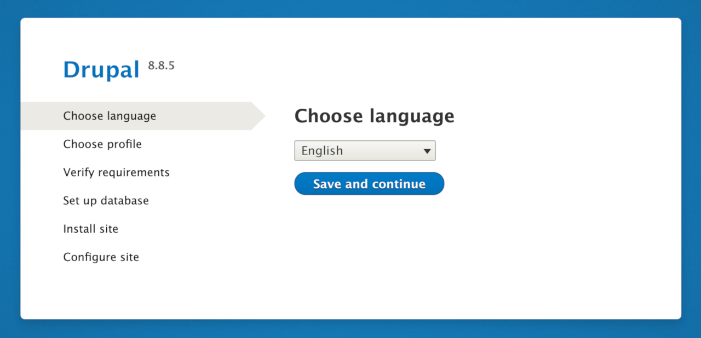
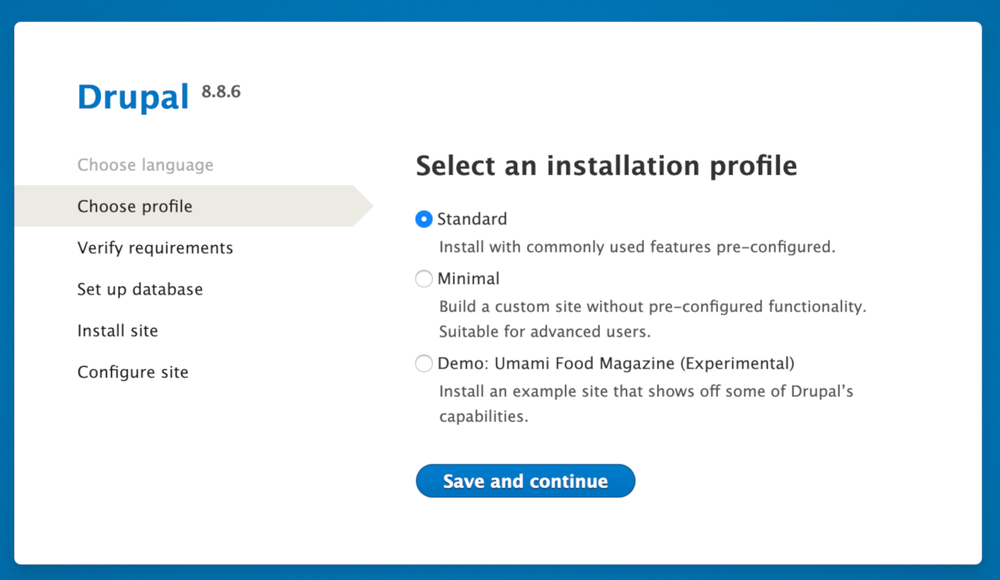
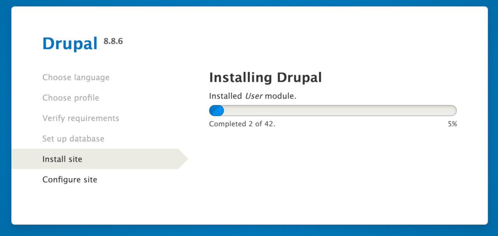
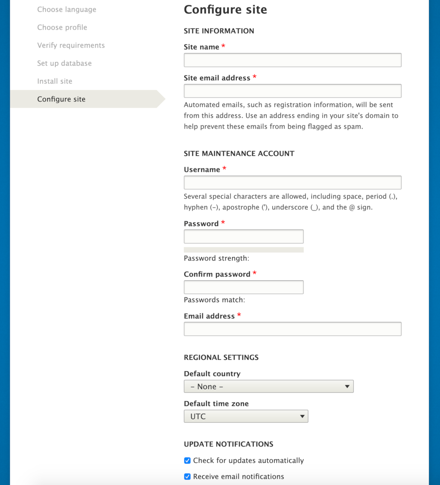
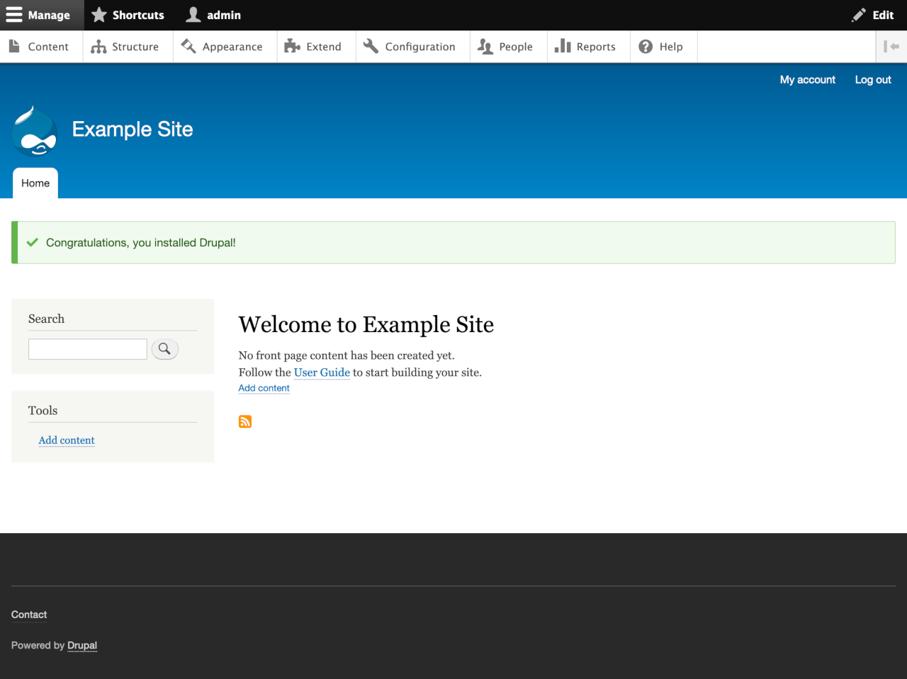

[Drupal](https://www.drupal.org) is an advanced and powerful content management framework, built on the PHP scripting language and supported by a database engine like MySQL. Drupal provides a flexible system that can be used to manage websites for a variety of use cases. For example, you can create rich, interactive “community” websites with forums, user blogs, and private messaging.

## In This Guide

This guide provides instructions to:

- [Create a Kubernetes Cluster](#create-an-lke-cluster)
- [Create Deployment Manifests](#create-manifest-files)
- [Install Drupal](#install-drupal)


This guide’s example instructions create several billable resources on your Linode account. If you do not want to keep using the example cluster that you create, be sure to delete it when you have finished the guide.

If you remove the resources afterward, you will only be billed for the hour(s) that the resources were present on your account. Consult the [Billing and Payments](/docs/guides/understanding-billing-and-payments/) guide for detailed information about how hourly billing works and for a table of plan pricing.


## Before You Begin

Familiarize yourself with Kubernetes using our series [A Beginner's Guide to Kubernetes](/docs/guides/beginners-guide-to-kubernetes/) and [Advantages of Using Kubernetes](/docs/guides/kubernetes-use-cases/).

## Create an LKE Cluster

Follow the instructions in [Deploying and Managing a Cluster with Linode Kubernetes Engine Tutorial](/docs/guides/deploy-and-manage-a-cluster-with-linode-kubernetes-engine-a-tutorial/) to create and connect to an LKE cluster.

## Create Manifest Files

1. Create a `drupal` folder on your local machine to contain the `kustamization.yaml`, `mysql-deployment.yaml`, and `drupal-deployment.yaml` files.

        sudo mkdir drupal

1. Create a `kustomization.yaml` file in the `drupal` folder. Open a text editor and create the file with a secret generator and resource config files for the single-instance MySQL deployment, as well as a single-instance Drupal deployment. Be sure to replace `MySQLpassword` with the secure password that you want to use to access MySQL:

      
---
secretGenerator:
- name: mysql-pass
  literals:
  - password=MySQLpassword
resources:
  - mysql-deployment.yaml
  - drupal-deployment.yaml


1. Create a `mysql-deployment.yaml` file in the `drupal` folder. Open a text editor and create a manifest file that describes a single-instance deployment of MySQL.

      
---
apiVersion: v1
kind: Service
metadata:
  name: drupal-mysql
  labels:
    app: drupal
spec:
  ports:
    - protocol: TCP
      port: 3306
  selector:
    app: drupal
    tier: backend
---
apiVersion: v1
kind: PersistentVolumeClaim
metadata:
  name: mysql-claim
  labels:
    app: drupal
spec:
  accessModes:
    - ReadWriteOnce
  resources:
    requests:
      storage: 10Gi
  storageClassName: linode-block-storage
---
apiVersion: apps/v1
kind: Deployment
metadata:
  name: mysql
  labels:
    app: drupal
spec:
  selector:
    matchLabels:
      app: drupal
      tier: backend
  strategy:
    type: Recreate
  template:
    metadata:
      labels:
        app: drupal
        tier: backend
    spec:
      containers:
        - image: mysql:latest
          name: mysql
          env:
            - name: MYSQL_DATABASE
              value: drupal-db
            - name: MYSQL_ROOT_PASSWORD
              valueFrom:
                 secretKeyRef:
                  name: mysql-pass
                  key: password
          ports:
            - containerPort: 3306
              name: mysql
              protocol: TCP
          volumeMounts:
            - name: mysql
              mountPath: /var/lib/mysql
      volumes:
        - name: mysql
          persistentVolumeClaim:
            claimName: mysql-claim



      This manifest is doing several things:

      - First it sets up the Service called `drupal-mysql` that is available over TCP on the port 3306.
      - Next, it creates a Persistant Volume Claim (PVC) for the service. On Linode, this is a Block Storage Volume.
      - Finally, it declares the deployment for `mysql` and all it's specifications.
        - The specification creates a container called `mysql`.
        - It includes two environment variables `MYSQL_DATABASE` and `MYSQL_ROOT_PASSWORD`.
        - The volumes section associates the PVC created before to this deployment.

1. Create a `drupal-deployment.yaml` file in the `drupal` folder. Open a text editor and create a manifest file that describes a single-instance deployment of Drupal.

      
---
apiVersion: v1
kind: Service
metadata:
  name: drupal
  labels:
    app: drupal
spec:
  ports:
    - port: 8081
      protocol: TCP
      name: web
      targetPort: 80
  selector:
    app: drupal
    tier: frontend
  type: LoadBalancer
---
apiVersion: v1
kind: PersistentVolumeClaim
metadata:
  name: drupal-claim
  labels:
    app: drupal
spec:
  accessModes:
    - ReadWriteOnce
  resources:
    requests:
      storage: 10Gi
  storageClassName: linode-block-storage
---
apiVersion: apps/v1
kind: Deployment
metadata:
  name: drupal
  labels:
    app: drupal
    tier: frontend
spec:
  selector:
    matchLabels:
      app: drupal
      tier: frontend
  strategy:
    type: Recreate
  template:
    metadata:
      labels:
        app: drupal
        tier: frontend
    spec:
      initContainers:
        - name: init-sites-volume
          image: drupal:latest
          command: ['/bin/bash', '-c']
          args: ['cp -r /var/www/html/sites /data; chown www-data:www-data /data/ -R']
          volumeMounts:
            - mountPath: /data
              name: drupal
      containers:
        - image: drupal:latest
          name: drupal
          env:
            - name: DRUPAL_DATABASE_HOST
              value: drupal-mysql
            - name: DRUPAL_DATABASE_PASSWORD
              valueFrom:
                secretKeyRef:
                  name: mysql-pass
                  key: password
          ports:
            - containerPort: 8081
              name: drupal
          volumeMounts:
            - name: drupal
              mountPath: /var/www/html/modules
              subPath: modules
            - name: drupal
              mountPath: /var/www/html/profiles
              subPath: profiles
            - name: drupal
              mountPath: /var/www/html/sites
              subPath: sites
            - name: drupal
              mountPath: /var/www/html/themes
              subPath: themes
      volumes:
        - name: drupal
          persistentVolumeClaim:
            claimName: drupal-claim



      This manifest is doing several things:

      - First it sets up the Service called `drupal` that is available over TCP on the port 8081, listening to port 80, with a type of LoadBalancer. This creates a Linode NodeBalancer.
      - Next, it creates a Persistant Volume Claim (PVC) for the service. On Linode, this is a Block Storage Volume.
      - Finally, it declares the deployment for `drupal` and all it's specifications.
        - The specification creates a container called `drupal`.
        - Drupal set-up needs to be able to write to some directories during installation, so the `initContainers` sets these permissions.
        - Similar to the MySQL manifest, this manifest also includes two environment variables `DRUPAL_DATABASE_HOST` and `DRUPAL_DATABASE_PASSWORD`.
        - The volumes section associates the PVC created before with this deployment.

## Install Drupal

1.  If you are not already there, change into the `drupal` directory.

        cd drupal

1.  Deploy Drupal and MySQL. The `kustomization.yaml` file contains all the resources required to deploy Drupal and MySQL.

        kubectl apply -k ./

    The output is similar to:

    
secret/mysql-pass-g764cgb8b9 created
service/drupal-mysql created
service/drupal configured
deployment.apps/drupal created
deployment.apps/mysql created
persistentvolumeclaim/drupal-claim created
persistentvolumeclaim/mysql-claim created


1.  Verify that the Secret exists:

        kubectl get secrets

    The output is similar to:

    
NAME                    TYPE                                  DATA   AGE
default-token-8wt7g     kubernetes.io/service-account-token   3      44m
mysql-pass-g764cgb8b9   Opaque                                1      24m


1.  Verify that a `PersistentVolume` is dynamically provisioned:

        kubectl get pvc

    The output is similar to the following:

    
NAME          STATUS  VOLUME                                    CAPACITY  ACCESS MODES   STORAGECLASS            AGE
mysql-claim   Bound   pvc-13c1086a-0a4a-4945-b473-0110ebd09725  10Gi       RWO           linode-block-storage    24m
drupal-claim  Bound   pvc-8d907b17-72c0-4c5b-a3c4-d87e170ad87d  10Gi       RWO           linode-block-storage    24m


    Note, you may have to wait a few moments for the status to switch from `Pending` to `Bound`.

1.  Verify that the Pod is running with the following command:

        kubectl get pods

    The output is similar to:

    
NAME                      READY   STATUS    RESTARTS   AGE
mysql-6bf46f94bf-tcgs2    1/1     Running   0          13m
drupal-77f665d45b-568tl   1/1     Running   0          5m1s


    Note, you may have to wait a few moments for the status to change from `Container Creating` to `Running`.

1.  Verify that the Service is running:

        kubectl get services drupal

    The output is similar to:
    
NAME     TYPE           CLUSTER-IP     EXTERNAL-IP     PORT(S)        AGE
drupal   LoadBalancer   10.0.0.89      192.0.2.3       8081:31266/TCP   33m


### Configure MySQL

You need to log into the `mysql` Pod to set the root password for the Drupal UI to be able to connect during setup.

1.  Log into the 'mysql' Pod and open a bash shell. In the following command replace `mysql-6bf46f94bf-tcgs2` with the `mysql` Pod name from the `kubectl get pods` command output above:

        kubectl exec -it mysql-6bf46f94bf-tcgs2 -- /bin/bash

1.  At the prompt, log into MySQL:

        mysql -u root -p

    The system prompts you for a password, this is the password that you set in the `kustomization.yaml` file.

1.  MySQL prompt appears after you are logged into the Pod. Run the following SQL command, where `MySQLpassword` is the password from `kustomization.yaml`:

        ALTER USER root IDENTIFIED WITH mysql_native_password by 'MySQLpassword';
        exit;

1.  Exit the Pod:

        exit

## Setup Drupal

1.  In the browser, type the IP address listed under `EXTERNAL_IP` from the `kubectl get services drupal` command above followed by the port `:8081`, for example, `http://192.0.2.3:8081`. The Drupal configuration page appears.

    
If you have a registered domain name that you want to use for the Drupal website, add the domain in [Cloud Manager](http://cloud.linode.com) and select **Insert default records from one of my NodeBalancers** option. In this case, the `EXTERNAL_IP` address is the IP address of the NodeBalancer. For more information, see [Add a Domain](/docs/guides/dns-manager/#add-a-domain).


    

1.  Click the **Save and Continue** button to go to the **Chose Profile** screen.

    

1.  Leave the default `Standard` selected and click the **Save and Continue** button. Some verification checks are performed and then the **Set Up Database** screen appears.

    

    - Leave the default for MySQL selected.
    - In the **Database name** field, use `drupal-db`, or what you used for the `MYSQL_DATABASE` env value in the `mysql-deployment.yaml` file.
    - The **Database username** is `root`.
    - The **Database password** is what you set in the `kustomization.yaml` file and what you used in the [Configure MySQL](#configure-mysql) section.
    - Under **ADVANCED OPTIONS**, change the **Host** to the value you used for the `DRUPAL_DATABASE_HOST` in `drupal-deployment.yaml`, in this case, `drupal-mysql`.
    - The **port** should be correctly set to the container port as listed in the `mysql-deployment.yaml`, in this example `3306`.

1.  Click the **Save and Continue** button. Drupal takes several minutes to install the site.

      

1.  After the installation is complete, the system prompts you for some basic configuration information about your site.

      

1.  Click the **Save and Continue** button. The site loads and the **Welcome Screen** appears.

      
