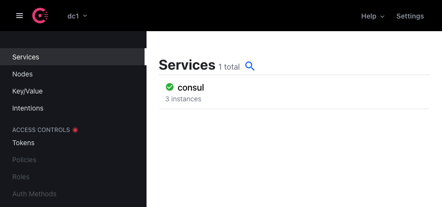

[Consul](https://www.consul.io/) is a service mesh offered by HashiCorp, with robust service discovery and diagnostic features for managing your application's services. You can learn more about service meshes in our guide [What Is a Service Mesh?](/docs/guides/what-is-a-service-mesh/). Consul offers a balanced approach between flexibility and usability that makes it a compelling option for managing your service-oriented applications.

In this guide, you can see how to install and get started using the Consul service mesh with a Kubernetes cluster. You can get started with Kubernetes with our [Linode Kubernetes Engine](https://www.linode.com/products/kubernetes/) (LKE).

## Before You Begin

- Follow the [Linode Kubernetes Engine - Get Started](/docs/products/compute/kubernetes/get-started/) guide to create a Kubernetes cluster using LKE.
- Make sure you install `kubectl` on your local machine and download your cluster's `kubeconfig` file.

## Setting Up Consul

This section shows how to install and start using Consul with your Kubernetes cluster. By the end, you can have Consul deployed to your cluster and learn how to access its dashboard interface for monitoring services.

### Install Helm

Helm is the standard method for installing Consul with Kubernetes. The details in the steps below assume a local machine running Linux on an AMD64 processor. However, they also work for macOS and other processors with slight modifications. For more details on the installation process, refer to Helm's [official installation instructions](https://helm.sh/docs/intro/install/).

1. Change into your current user's home directory, and download the `tar.gz` containing the Helm binary.

    ```command
    cd ~/
    sudo wget https://get.helm.sh/helm-v3.6.1-linux-amd64.tar.gz
    ```

1. Extract the archive.

    ```command
    sudo tar -zxvf helm-v3.6.1-linux-amd64.tar.gz
    ```

1. Move the Helm binary to a directory in your system path.

    ```command
    sudo mv linux-amd64/helm /usr/local/bin/helm
    ```

### Install Consul

1. Add the HashiCorp repository to Helm.

    ```command
    helm repo add hashicorp https://helm.releases.hashicorp.com
    ```

    ```output
    "hashicorp" has been added to your repositories
    ```

1. Verify that you have access to the Helm chart for Consul.

    ```command
    helm search repo hashicorp/consul
    ```

    ```output
    NAME             CHART VERSION APP VERSION DESCRIPTION
    hashicorp/consul 0.32.0        1.10.0      Official HashiCorp Consul Chart
    ```

1. Update the repository.

    ```command
    helm repo update
    ```

    ```output
    Hang tight while we grab the latest from your chart repositories...
    ...Successfully got an update from the "hashicorp" chart repository
    Update Complete. ⎈Happy Helming!⎈
    ```

1. Create a configuration file for Consul. The parameters need to be adjusted for your needs. You can refer to our the example configuration file below(example-consul-config.yaml) for a basic working set of options.

    ```file {title="example-consul-config.yaml" lang=yaml}
    global:
      name: consul
      datacenter: dc1
    server:
      replicas: 3
      securityContext:
        runAsNonRoot: false
        runAsUser: 0
    ui:
      enabled: true
    connectInject:
      enabled: true
      default: true
    controller:
      enabled: true
    ```

    Take a look at HashiCorp's [Consul and Kubernetes Deployment Guide](https://learn.hashicorp.com/tutorials/consul/kubernetes-deployment-guide?in=consul/kubernetes) for another example configuration, and refer to HashiCorp's [Helm Chart Configuration](https://www.consul.io/docs/k8s/helm) guide for details on available parameters.

1. Install Consul. The following command assumes your configuration file is named `config.yaml` and is stored in the current working directory.

    ```command
    helm install consul hashicorp/consul --set global.name=consul -f config.yaml
    ```

### Access the Consul Dashboard

1. Configure Kubernetes to forward the port for the Consul dashboard. The following command connects the Consul dashboard interface to your machine's port **18500**.

    ```command
    kubectl port-forward service/consul-ui 18500:80 --address 0.0.0.0
    ```

1. Navigate to `localhost:18500` in your browser to see the Consul dashboard.

    

## Example Usage

Follow the steps in this section to create a couple of simple services to see the Consul service mesh in action. In this example, you use images provided by HashiCorp for some basic web services and create Kubernetes manifests for each.

### Create the Service Manifests

1. Create a directory for your service manifests. Then, change into that directory. From here on, the guide assumes you are in that directory.

    ```command
    mkdir example-services
    cd example-services
    ```

1. Create a file named `example-service-backend.yaml` for the first of your services. Add the contents of the example file below.

    ```file {title="example-service-backend.yaml" lang=yaml}
    apiVersion: v1
    kind: ServiceAccount
    metadata:
      name: back-end-service

    ---

    apiVersion: v1
    kind: Service
    metadata:
      name: back-end-service
    spec:
      selector:
        app: back-end-service
      ports:
        - port: 9091
          targetPort: 9091
    ---

    apiVersion: apps/v1
    kind: Deployment
    metadata:
      name: back-end-service
      labels:
        app: back-end-service
    spec:
      replicas: 1
      selector:
        matchLabels:
          app: back-end-service
      template:
        metadata:
          labels:
            app: back-end-service
          annotations:
            consul.hashicorp.com/connect-inject: 'true'
        spec:
          containers:
            - name: back-end-service
              image: nicholasjackson/fake-service:v0.7.8
              ports:
                - containerPort: 9091
              env:
                - name: 'NAME'
                  value: 'back-end-service'
                - name: 'LISTEN_ADDR'
                  value: '127.0.0.1:9091'
                - name: 'MESSAGE'
                  value: 'This is a response from the back-end service.'
    ```

    The above example file creates a service and defines its deployment parameters. Take note of the `annotations` section. The `consul.hashicorp.com/connect-inject: 'true'` annotation tells Consul to inject a proxy with the service. This annotation should be included in the deployment manifest for any service you want to deploy to Kubernetes and have take part in your Consul service mesh.

1. Create another file named `example-service-frontend.yaml` for the second of your services. Add the contents of the example file below.

    ```file {title="example-service-frontend.yaml" lang=yaml}
    apiVersion: v1
    kind: ServiceAccount
    metadata:
      name: front-end-service

    ---

    apiVersion: v1
    kind: Service
    metadata:
      name: front-end-service
    spec:
      selector:
        app: front-end-service
      ports:
        - port: 9090
          targetPort: 9090
    ---

    apiVersion: apps/v1
    kind: Deployment
    metadata:
      name: front-end-service
      labels:
        app: front-end-service
    spec:
      replicas: 1
      selector:
        matchLabels:
          app: front-end-service
      template:
        metadata:
          labels:
            app: front-end-service
          annotations:
            consul.hashicorp.com/connect-inject: 'true'
            consul.hashicorp.com/connect-service-upstreams: 'back-end-service:9091'
        spec:
          containers:
            - name: front-end-service
              image: nicholasjackson/fake-service:v0.7.8
              ports:
                - containerPort: 9090
              env:
                - name: 'NAME'
                  value: 'front-end-service'
                - name: 'LISTEN_ADDR'
                  value: '0.0.0.0:9090'
                - name: 'UPSTREAM_URIS'
                  value: 'http://localhost:9091'
                - name: 'MESSAGE'
                  value: 'This is a message from the front-end service.'
    ```

    This file's contents are similar to the previous file. However, it adds an additional annotation. The new annotation here — `consul.hashicorp.com/connect-service-upstreams: 'back-end-service:9091'` — tells Consul that this service has the service defined in the previous file as an upstream dependency.

### Deploy the Services

1. Deploy the services to your Kubernetes cluster.

    ```command
    kubectl apply -f example-service-backend.yaml
    kubectl apply -f example-service-frontend.yaml
    ```

1. View the pods using kubectl. Wait until the services' pods go into `Running` status before proceeding to the next step.

    ```command
    kubectl get pods
    ```

1. Confirm that Consul has injected proxies alongside the services.

    ```command
    kubectl get pods --selector consul.hashicorp.com/connect-inject-status=injected
    ```

    ```output
    NAME                                      READY   STATUS         RESTARTS   AGE
    back-end-service-75cbb6cbb6-wlvf4         2/2     Running        0          3m5s
    front-end-service-7dcdcc5676-zqhxh        2/2     Running        0          3m35s
    ```

### Review the Services

1. You can see the services in action by forwarding the port for the front-end service.

    ```command
    kubectl port-forward service/front-end-service 9090:9090 --address 0.0.0.0
    ```

    Navigate to `localhost:9090/ui` in your browser to see the services' output.

1. Review the services in Consul's dashboard.

    ```command
    kubectl port-forward service/consul-ui 18500:80 --address 0.0.0.0
    ```

    Again, navigate to `localhost:18500` in your browser to see the Consul dashboard, where the new services should be listed.

## Conclusion

You now have the Consul service mesh-up and running on your Kubernetes cluster. To get the most out of the service mesh, check out HashiCorp's [wealth of tutorials](https://learn.hashicorp.com/consul) for Consul. These can help you fine-tune the configuration to your needs and discover the myriad ways Consul can make managing your application's services easier.