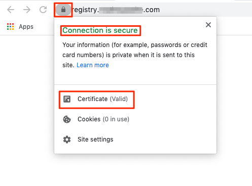

Hosting a private Docker registry alongside your Kubernetes cluster allows you to securely manage your Docker images while also providing quick deployment of your apps. This guide will walk you through the steps needed to deploy a private Docker registry on a Linode Kubernetes Engine (LKE) cluster. At the end of this tutorial, you will be able to locally push and pull Docker images to your registry. Similarly, your LKE cluster's pods will also be able to pull Docker images from the registry to complete their deployments.

## Before you Begin


This guide was written using [Kubernetes version 1.17](https://v1-17.docs.kubernetes.io/docs/setup/release/notes/).


1. [Deploy a LKE Cluster](/docs/guides/deploy-and-manage-a-cluster-with-linode-kubernetes-engine-a-tutorial/). This example was written using a node pool with two [2 GB nodes](https://www.linode.com/pricing/). Depending on the workloads you will be deploying on your cluster, you may consider using nodes with higher resources.

1. Install [Helm 3](/docs/kubernetes/how-to-install-apps-on-kubernetes-with-helm-3/#install-helm), [kubectl](/docs/guides/deploy-and-manage-a-cluster-with-linode-kubernetes-engine-a-tutorial/#install-kubectl), and [Docker](/docs/guides/installing-and-using-docker-on-ubuntu-and-debian/) to your local environment.

    
For Docker installation instructions on other operating systems, see [Docker's official documentation](https://docs.docker.com/get-docker/).
    

1. Configure kubectl to work with your new LKE cluster. See [Connect to your LKE Cluster with kubectl](/docs/guides/deploy-and-manage-a-cluster-with-linode-kubernetes-engine-a-tutorial/#connect-to-your-lke-cluster-with-kubectl).

1. [Generate an Object Storage key pair](/docs/products/storage/object-storage/guides/access-keys/) and ensure you save it in a secure location. You will need the key pair for a later section in this guide. Finally [create an Object Storage bucket](/docs/products/storage/object-storage/guides/manage-buckets/) to store your registry's images. Throughout this guide, the example bucket name will be `registry`.

1. Purchase a domain name from a reliable domain registrar. Using Linode's DNS Manager, [create a new Domain](/docs/guides/dns-manager/#add-a-domain) and [add an DNS "A" record](/docs/guides/dns-manager/#add-dns-records) for a subdomain named `registry`. Your subdomain will host your Docker registry. This guide will use `registry.example.com` as the example domain.

    
Optionally, you can create a Wildcard DNS record, `*.example.com`. In a later section, you will point your DNS A record to a Linode NodeBalancer's external IP address. Using a Wildcard DNS record, will allow you to expose your Kubernetes services without requiring further configuration using the Linode DNS Manager.
    

## In this Guide

In this guide you will:

- [Install the NGINX Ingress controller](#install-the-nginx-ingress-controller), which will create a Linode NodeBalancer and provide the routing mechanism needed for your cluster's services.
- [Enable HTTPS](#enable-https) on your Docker registry by creating TLS certificates.
- [Deploy a Docker registry](#deploy-your-docker-registry) and [enable access restrictions](#enable-basic-authentication) for it.
- [Push an image to your private Docker registry](#push-an-image-to-your-docker-registry).
- [Verify that your Cluster can pull images from your Docker registry](#create-a-test-deployment-using-an-image-from-your-docker-registry) by creating a test deployment.

## Install the NGINX Ingress Controller

An [*Ingress*](https://kubernetes.io/docs/concepts/services-networking/ingress/) is used to provide external routes, via HTTP or HTTPS, to your cluster's services. An *Ingress Controller*, like [the NGINX Ingress Controller](https://kubernetes.github.io/ingress-nginx/deploy/#using-helm), fulfills the requirements presented by the Ingress using a load balancer.

In this section, you will install the NGINX Ingress Controller using Helm, which will create a [Linode NodeBalancer](https://www.linode.com/products/nodebalancers/) to handle your cluster's traffic.

1.  Add the stable Helm charts repository to your Helm repos:

        helm repo add ingress-nginx https://kubernetes.github.io/ingress-nginx

1.  Update your Helm repositories:

        helm repo update

1.  Install the NGINX Ingress Controller. This installation will result in a Linode NodeBalancer being created.

        helm install ingress-nginx ingress-nginx/ingress-nginx

    You will see a similar output after issuing the above command (the output has been truncated for brevity):

    
NAME: ingress-nginx
LAST DEPLOYED: Thu Jul 14 19:27:24 2022
NAMESPACE: default
STATUS: deployed
REVISION: 1
TEST SUITE: None
NOTES:
The ingress-nginx controller has been installed.
It may take a few minutes for the LoadBalancer IP to be available.
You can watch the status by running 'kubectl --namespace default get services -o wide -w ingress-nginx-controller'
...
    

    In the next section, you will use your Linode NodeBalancer's external IP address to update your registry's domain record.

### Update your Subdomain's IP Address

1.  Access your NodeBalancer's assigned external IP address.

        kubectl --namespace default get services -o wide -w ingress-nginx-controller

    The command will return a similar output:

    
NAME                          TYPE           CLUSTER-IP      EXTERNAL-IP    PORT(S)                      AGE     SELECTOR
ingress-nginx-controller   LoadBalancer   10.128.169.60   192.0.2.0   80:32401/TCP,443:30830/TCP   7h51m   app.kubernetes.io/component=controller,app.kubernetes.io/instance=ingress-nginx,app.kubernetes.io/name=ingress-nginx
    

1. Copy the IP address of the `EXTERNAL IP` field and navigate to Linode's DNS manager and [update your domain's' `registry` A record](/docs/guides/dns-manager/#add-dns-records) with the external IP address. Ensure that the entry's **TTL** field is set to **5 minutes**.

Now that your NGINX Ingress Controller has been deployed and your subdomain's A record has been updated, you are ready to enable HTTPS on your Docker registry.

## Enable HTTPS


Before performing the commands in this section, ensure that your DNS has had time to propagate across the internet. This process can take several hours. You can query the status of your DNS by using the following command, substituting `registry.example.com` for your subdomain and domain.

    dig +short registry.example.com

If successful, the output should return the IP address of your NodeBalancer.


To enable HTTPS on your Docker registry, you will create a Transport Layer Security (TLS) certificate from the [Let's Encrypt](https://letsencrypt.org/) certificate authority (CA) using the [ACME protocol](https://tools.ietf.org/html/rfc8555). This will be facilitated by [*cert-manager*](https://cert-manager.io/docs/), the native Kubernetes certificate management controller.

In this section you will install cert-manager using Helm and the required cert-manager [CustomResourceDefinitions](https://kubernetes.io/docs/concepts/extend-kubernetes/api-extension/custom-resources/) (CRDs). Then, you will create a ClusterIssuer and Certificate resource to create your cluster's TLS certificate.

### Install cert-manager

1.  Install cert-manager's CRDs.

        kubectl apply --validate=false -f https://github.com/jetstack/cert-manager/releases/latest/download/cert-manager.crds.yaml

1.  Create a cert-manager namespace.

        kubectl create namespace cert-manager

1.  Add the Helm repository which contains the cert-manager Helm chart.

        helm repo add jetstack https://charts.jetstack.io

1.  Update your Helm repositories.

        helm repo update

1.  Install the cert-manager Helm chart. These basic configurations should be sufficient for many use cases, however, additional cert-manager configurable parameters can be found in [cert-manager's official documentation](https://hub.helm.sh/charts/cert-manager/cert-manager).

        helm install cert-manager jetstack/cert-manager --namespace cert-manager

1.  Verify that the corresponding cert-manager pods are now running.

        kubectl get pods --namespace cert-manager

    You should see a similar output:

    
NAME                                       READY   STATUS    RESTARTS   AGE
cert-manager-579d48dff8-84nw9              1/1     Running   3          1m
cert-manager-cainjector-789955d9b7-jfskr   1/1     Running   3          1m
cert-manager-webhook-64869c4997-hnx6n      1/1     Running   0          1m
    

### Create a ClusterIssuer Resource

Now that cert-manager is installed and running on your cluster, you will need to create a ClusterIssuer resource which defines which CA can create signed certificates when a certificate request is received. A ClusterIssuer is not a namespaced resource, so it can be used by more than one namespace.

1.  Create a directory named `registry` to store all of your Docker registry's related manifest files and move into the new directory.

        mkdir ~/registry && cd ~/registry

1.  Using the text editor of your choice, create a file named `acme-issuer-prod.yaml` with the example configurations. Replace the value of `email` with your own email address.

    
apiVersion: cert-manager.io/v1
kind: ClusterIssuer
metadata:
  name: letsencrypt-prod
spec:
  acme:
    email: user@example.com
    server: https://acme-v02.api.letsencrypt.org/directory
    privateKeySecretRef:
      name: letsencrypt-secret-prod
    solvers:
    - http01:
        ingress:
          class: nginx
    

    - This manifest file creates a ClusterIssuer resource that will register an account on an ACME server. The value of `spec.acme.server` designates Let's Encrypt's production ACME server, which should be trusted by most browsers.

        
Let's Encrypt provides a staging ACME server that can be used to test issuing trusted certificates, while not worrying about hitting [Let's Encrypt's production rate limits](https://letsencrypt.org/docs/rate-limits/). The staging URL is `https://acme-staging-v02.api.letsencrypt.org/directory`.
        

    - The value of `privateKeySecretRef.name` provides the name of a secret containing the private key for this user's ACME server account (this is tied to the email address you provide in the manifest file). The ACME server will use this key to identify you.
    - To ensure that you own the domain for which you will create a certificate, the ACME server will issue a challenge to a client. cert-manager provides two options for solving challenges, [`http01`](https://cert-manager.io/docs/configuration/acme/http01/) and [`DNS01`](https://cert-manager.io/docs/configuration/acme/dns01/). In this example, the `http01` challenge solver will be used and it is configured in the `solvers` array. cert-manager will spin up *challenge solver* Pods to solve the issued challenges and use Ingress resources to route the challenge to the appropriate Pod.

1.  Create the ClusterIssuer resource:

        kubectl create -f acme-issuer-prod.yaml

### Create a Certificate Resource

After you have a ClusterIssuer resource, you can create a Certificate resource. This will describe your [x509 public key certificate](https://en.wikipedia.org/wiki/X.509) and will be used to automatically generate a [CertificateRequest](https://cert-manager.io/docs/concepts/certificaterequest/) which will be sent to your ClusterIssuer.

1.  Using the text editor of your choice, create a file named `certificate-prod.yaml` with the example configurations. Replace the value of `email` with your own email address. Replace the value of `spec.dnsNames` with your own domain that you will use to host your Docker registry.

    
apiVersion: cert-manager.io/v1
kind: Certificate
metadata:
  name: docker-registry-prod
spec:
  secretName: letsencrypt-secret-prod
  duration: 2160h # 90d
  renewBefore: 360h # 15d
  issuerRef:
    name: letsencrypt-prod
    kind: ClusterIssuer
  dnsNames:
  - registry.example.com
    

    
The configurations in this example create a Certificate that is valid for 90 days and renews 15 days before expiry.
    

1.  Create the Certificate resource:

        kubectl create -f certificate-prod.yaml

1.  Verify that the Certificate has been successfully issued:

        kubectl get certs

    When your certificate is ready, you should see a similar output:

    
NAME                   READY   SECRET                    AGE
docker-registry-prod   True    letsencrypt-secret-prod   42s
    

    All the necessary components are now in place to be able to enable HTTPS on your Docker registry. In the next section, you will complete the steps need to deploy your registry.

## Deploy your Docker Registry

You will now complete the steps to deploy your Docker Registry to your Kubernetes cluster using a Helm chart. Prior to deploying your Docker registry, you will first need to create a username and password in order to enable basic authentication for your registry. This will allow you to restrict access to your Docker registry which will keep your images private. Since, your registry will require authentication, a Kubernetes secret will be added to your cluster in order to provide your cluster with your registry's authentication credentials, so that it can pull images from it.

### Enable Basic Authentication

To enabled basic access restriction for your Docker registry, you will use the `htpasswd` utility. This utility allows you to use a file to store usernames and passwords for basic HTTP authentication. This will require you to log into your Docker registry prior to being able to push or pull images from and to it.

1.  Install the `htpasswd` utility. This example is for an Ubuntu 18.04 instance, but you can use your system's package manger to install it.

        sudo apt install apache2-utils -y

1.  Create a file to store your Docker registry's username and password.

        touch my_docker_pass

1.  Create a username and password using `htpasswd`. Replace `example_user` with your own username. Follow the prompt to create a password.

        htpasswd -B my_docker_pass example_user

1.  View the contents of your password file.

        cat my_docker_pass

    Your output will resemble the following. You will need these values when deploying your registry in the [Configure your Docker Registry](#configure-your-docker-registry) section of the guide.

    
example_user:$2y$05$8VhvzCVCB4txq8mNGh8eu.8GMyBEEeUInqQJHKJUD.KUwxastPG4m
  

### Grant your Cluster Access to your Docker Registry

Your LKE Cluster will also need to authenticate to your Docker registry in order to pull images from it. In this section, you will create a Kubernetes [*Secret*](https://kubernetes.io/docs/concepts/configuration/secret/) that you can use to grant your cluster's kubelet with access to your registry's images.

1.  Create a secret to store your registry's authentication information. Replace the option values with your own registry's details. The `--docker-username` and `--docker-password` should be the username and password that you used when generating credentials using the `htpasswd` utility.

        kubectl create secret docker-registry regcred \
          --docker-server=registry.example.com \
          --docker-username=example_user \
          --docker-password=3xampl3Passw0rd \
          --docker-email=user@example.com

### Configure your Docker Registry

Before deploying the Docker Registry Helm chart to your cluster, you will define some configurations so that the Docker registry uses the NGINX Ingress controller, your `registry` Object Storage bucket, and your cert-manager created TLS certificate. See the [Helm Chart's official documentation](https://helm.sh/docs/topics/registries/) for more information about registries.


If you have not yet [generated an Object Storage key pair](/docs/products/storage/object-storage/guides/access-keys/) and [created an Object Storage bucket](/docs/products/storage/object-storage/guides/manage-buckets/) to store your registry's images, do so now before continuing with the rest of this section.
  

1.  Create a new file named `docker-configs.yaml` using the example configurations. Ensure you replace the following values in your file:
      - `ingress.hosts` with your own Docker registry's domain
      - `ingress.tls.secretName` with the name you used when [creating your Certificate](#create-a-certificate-resource)
      - `ingress.tls.hosts` with the domain for which you wish to secure with your TLS certificate.
      - `secrets.s3.accessKey` with the value of your [Object Storage account's access key](/docs/products/storage/object-storage/guides/access-keys/) and `secrets.s3.secretKey` with the corresponding secret key.
      - `secrets.htpasswd` with the value returned when you view the contents of your `my_docker_pass` file. However, ensure you do not remove the `|-` characters. This ensures that your YAML is properly formatted. See step 4 in the [Enable Basic Authentication](#enable-basic-authentication) section for details on viewing the contents of your password file.
      - `s3.region` with your Object Storage bucket's cluster region, `s3.regionEndpoint` with your Object Storage bucket's region endpoint, and `s3.bucket` with your registry's Object Storage bucket name.

      
ingress:
  enabled: true
  hosts:
    - registry.example.com
  annotations:
    kubernetes.io/ingress.class: nginx
    cert-manager.io/cluster-issuer: letsencrypt-prod
    nginx.ingress.kubernetes.io/proxy-body-size: "0"
    nginx.ingress.kubernetes.io/proxy-read-timeout: "6000"
    nginx.ingress.kubernetes.io/proxy-send-timeout: "6000"
  tls:
    - secretName: letsencrypt-secret-prod
      hosts:
      - registry.example.com
storage: s3
secrets:
  htpasswd: |-
    example_user:$2y$05$8VhvzCVCB4txq8mNGh8eu.8GMyBEEeUInqQJHKJUD.KUwxastPG4m
  s3:
    accessKey: "myaccesskey"
    secretKey: "mysecretkey"
s3:
  region: us-east-1
  regionEndpoint: us-east-1.linodeobjects.com/
  secure: true
  bucket: registry
      

      - The NGINX Ingress annotation `nginx.ingress.kubernetes.io/proxy-body-size: "0"` disables a [maximum allowed size client request body](http://nginx.org/en/docs/http/ngx_http_core_module.html#client_max_body_size) check and ensures that you won't receive a `413` error when pushing larger Docker images to your registry. The values for `nginx.ingress.kubernetes.io/proxy-read-timeout: "6000"` and `nginx.ingress.kubernetes.io/proxy-send-timeout: "6000"` are sane values to begin with, but [may be adjusted as needed](https://kubernetes.github.io/ingress-nginx/user-guide/nginx-configuration/annotations/#custom-timeouts).

1.  Deploy your Docker registry using the configurations you created in the previous step:

        helm install docker-registry stable/docker-registry -f docker-configs.yaml

1.  Navigate to your registry's domain and verify that your browser loads the TLS certificate.

    

    You will interact with your registry via the Docker CLI, so you should not expect to see any content load on the page.

## Push an Image to your Docker Registry

You are now ready to push and pull images to your Docker registry. In this section you will pull an existing image from Docker Hub and then push it to your registry. Then, in the next section, you will use your registry's image to deploy an example static site.

1.  Use Docker to pull an image from [Docker Hub](https://hub.docker.com/). This example is using an image that was created following our [Create and Deploy a Docker Container Image to a Kubernetes Cluster](/docs/guides/deploy-container-image-to-kubernetes/) guide. The image will build a Hugo static site with some boiler plate content. However, you can use any image from Docker Hub that you prefer.

        sudo docker pull leslitagordita/hugo-site:v10

1.  Tag your local Docker image with your private registry's hostname. This is required when pushing an image to a private registry and not the central Docker registry. Ensure that you replace `registry.example.com` with your own registry's domain.

        sudo docker tag leslitagordita/hugo-site:v10 registry.example.com/leslitagordita/hugo-site:v10

1.  At this point, you have never authenticated to your private registry. You will need to log into it prior to pushing up any images. Issue the example command, replacing `registry.example.com` with your own registry's URL. Follow the prompts to enter in the username and password you created in the [Enable Basic Authentication](#enable-basic-authentication) section.

        sudo docker login registry.example.com

1.  Push the image to your registry. Ensure that you replace `registry.example.com` with your own registry's domain.

        sudo docker push registry.example.com/leslitagordita/hugo-site:v10

    You should see a similar output when your image push is complete

    
The push refers to repository [registry.example.com/leslitagordita/hugo-site]
925cbd794bd8: Pushed
b9fee92b7ac7: Pushed
1658c062e6a8: Pushed
21acf2dde3fe: Pushed
588c407f9029: Pushed
bcf2f368fe23: Pushed
v10: digest: sha256:3db7ab6bc5a893375af6f7cf505bac2f4957d8a03701d7fd56853712b0900312 size: 1570
    

## Create a Test Deployment Using an Image from Your Docker Registry

In this section, you will create a test deployment using the image that you pushed to your registry in the previous section. This will ensure that your cluster can authenticate to your Docker registry and pull images from it.

1.  Using Linode's DNS manager to [create a new subdomain A record](/docs/guides/dns-manager/#add-dns-records) to host your static site. The example will use `static.example.com`. When creating your record, assign your cluster's NodeBalancer external IP address as the IP address. You can find the external IP address with the following command:

        kubectl --namespace default get services -o wide -w nginx-ingress-controller

    The command will return a similar output. Use the value of the `EXTERNAL-IP` field to create your static site's new subdomain A record.

    
NAME                          TYPE           CLUSTER-IP      EXTERNAL-IP    PORT(S)                      AGE     SELECTOR
nginx-ingress-controller   LoadBalancer   10.128.169.60   192.0.2.0   80:32401/TCP,443:30830/TCP   7h51m   app.kubernetes.io/component=controller,app=nginx-ingress,release=nginx-ingress
    

1.  Using a text editor, create the `static-site-test.yaml` file with the example configurations. This file will create a deployment, service, and an ingress.

      
apiVersion: extensions/v1beta1
kind: Ingress
metadata:
  name: static-site-ingress
  annotations:
    kubernetes.io/ingress.class: nginx
    nginx.ingress.kubernetes.io/backend-protocol: "HTTP"
spec:
  rules:
  - host: static.example.com
    http:
      paths:
      - path: /
        backend:
          serviceName: static-site
          servicePort: 80
---
apiVersion: v1
kind: Service
metadata:
  name: static-site
spec:
  type: NodePort
  ports:
  - port: 80
    targetPort: 80
  selector:
    app: static-site
---
apiVersion: apps/v1
kind: Deployment
metadata:
  name: static-site
spec:
  replicas: 3
  selector:
    matchLabels:
      app: static-site
  template:
    metadata:
      labels:
        app: static-site
    spec:
      containers:
      - name: static-site
        image: registry.example.com/leslitagordita/hugo-site:v10
        ports:
        - containerPort: 80
      imagePullSecrets:
      - name: regcred
      

      - In the Deployment section of the manifest, the [`imagePullSecrets` field](https://kubernetes.io/docs/concepts/configuration/secret/#using-imagepullsecrets) references the secret you created in the [Grant your Cluster Access to your Docker Registry](#grant-your-cluster-access-to-your-docker-registry) section. This secret contains the authentication credentials that your cluster's kubelet can use to pull your private registry's image.
      - The `image` field provides the image to pull from your Docker registry.

1.  Create the deployment.

        kubectl create -f static-site-test.yaml

1.  Open a browser and navigate to your site's domain and view the example static site. Using our example, you would navigate to `static.example.com`. The example Hugo site should load.

## (Optional) Tear Down your Kubernetes Cluster

To avoid being further billed for your Kubernetes cluster and NodeBlancer, [delete your cluster using the Linode Cloud Manager](/docs/guides/deploy-and-manage-a-cluster-with-linode-kubernetes-engine-a-tutorial/#delete-a-cluster). Similarly, to avoid being further billed for our registry's Object Storage bucket, see [Cancel Object Storage](/docs/products/storage/object-storage/guides/cancel/).
