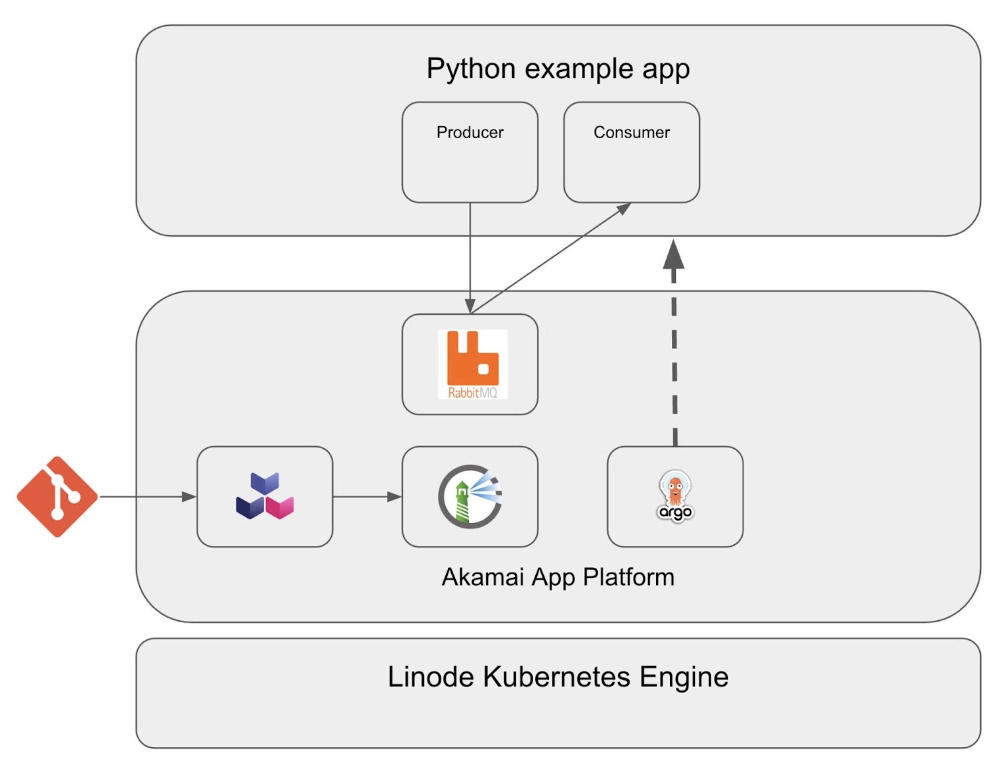

INTRO

## Diagram



## Components

### Infrastructure

-   **Linode Kubernetes Engine (LKE)**: LKE is Akamai’s managed Kubernetes service, enabling you to deploy containerized applications without needing to build out and maintain your own Kubernetes cluster.

-   **App Platform for LKE**: Akamai App Platform is a ready-to-run solution for LKE that allows you to build, deploy, and manage distributed applications. App Platform automates the provisioning process so that you can build your distributed workloads in a few clicks, rather than manually configuring each component of your architecture.

### Software

- **RabbitMQ**:

- **Harbor**:

- **Argo CD**:

-

## Prerequisites

- A [Cloud Manager](https://cloud.linode.com/) account is required to use Akamai's cloud computing services, including LKE.

- Enrollment into the Akamai App Platform's [beta program](https://cloud.linode.com/betas).

- An provisioned and configured LKE cluster with App Platform enabled. An LKE cluster consisting of 3 Dedicated Compute Instances is sufficient for the deployment in this guide.

To learn more about provisioning a LKE cluster with App Platform, see our [Getting Started with App Platform for LKE](https://techdocs.akamai.com/cloud-computing/docs/getting-started-with-akamai-application-platform) guide.

## Set Up Infrastructure

Once your LKE cluster with App Platform has been fully deployed, sign into the App Platform web UI using the `platform-admin` account, or another account that uses the `platform-admin` role.

### Enable RabbitMQ and Harbor

1.  Select **view** > **platform** in the top bar.

1.  Select **Apps** from the left menu.

1.  Enable the **RabbitMQ** and **Harbor** apps by hovering over each app icon and clicking the **power on** button. It may take a few minutes for the apps to enable.

    Enabled apps move up and appear in color towards the top of the available app list.

    

### Create a New Team

[Teams](https://apl-docs.net/docs/for-ops/console/teams) are isolated tenants on the platform to support Development/DevOps teams, projects or even DTAP. A Team gets access to the Console, including access to self-service features and all shared apps available on the platform.

1.  Select **view** > **platform**.

1.  Select **Teams** in the left menu.

1.  Click **Create Team**.

1.  Provide a **Name** for the Team. Keep all other default values, and click **Submit**. This guide uses the Team name `demo`.

### Create a RabbitMQ Cluster with Workloads

A [Workload](https://apl-docs.net/docs/for-devs/console/workloads) is a self-service feature for creating Kubernetes resources using Helm charts from the Catalog.

1.  Select **view** > **team** and **team** > **demo** in the top bar.

1.  Select **Workloads** from the left menu, and then click **Create Workload**.

1.  Select the _Rabbitmq-Cluster_ Helm chart from the Catalog.

1.  Provide a name for the Workload. This guide uses the Workload name `rabbitmq-demo`.

1.  Continue with the default values, and click **Submit**. The Workload may take a few minutes to become ready.

## Build the App

This guide uses an example Python chat app to send messages to connected clients. The example in this guide is not meant for production workloads, and steps may vary depending on the app you use.

1.  Select **view** > **team** and **team** > **demo** in the top bar.

1.  Select **Builds**, and click **Create Build**.

1.  Provide a name for the Build. This name is the same name used for the image stored in the private Harbor registry of your Team. This guide uses the Build name `rmp-example-app` with the tag `latest`.

1.  Select the Mode **Buildpacks**.

1.  To use the example app, provide the following GitHub repository URL:

    ```command
    https://github.com/linode/apl-examples.git
    ```

1.  Set the path to `rabbitmq-python`.

1.  Click **Submit**.

### Check the Build Status

To see if the app build was successful:

1.  Select **Apps** from the left menu, and open the _Tekton_ app.

1.  Click **PipelineRuns** in the left menu.

1.  A successful build is denoted with a green check mark and `Completed` status:

    

### Copy the Image Repository

Once successfully built, copy the image repository link so that you can create a Workload for deploying the app in the next step.

1.  Select **Builds** to view the status of your build.

1.  A green check mark in the **Status** column denotes the `rmp-example-app` build as ready.

1.  When ready, use the "copy" button in the **Repository** column to copy the repository URL link to your clipboard.

## Deploy the App

1.  Select **view** > **team** and **team** > **demo** in the top bar.

1.  Select **Workloads**, and click **Create Workload**.

1.  Select the _K8s-Deployment_ Helm chart from the Catalog.

1.  Provide a name for the Workload. This guide uses the Workload name `rmq-example-app`.

1.  Click on **Values**.

1.  Edit the following chart values:

    - Update  under `image` > `repository`, where  is the repository URL link from the `rmp-example-app` build in the previous section.

    - Update the `name` references under each `secretKeyRef` entry. The format is `-rabbitmq-cluster-default-user`, where  is the name of the RabbitMQ cluster Workload, `rabbitmq-demo`.

    ```
    image:
      repository: 
      pullPolicy: IfNotPresent
      tag: latest
    env:
      - name: 
        valueFrom:
          secretKeyRef:
            name: -rabbitmq-cluster-default-user
            key: host
      - name: 
        valueFrom:
          secretKeyRef:
            name: -rabbitmq-cluster-default-user
            key: username
      - name: NOTIFIER_RABBITMQ_PASSWORD
        valueFrom:
          secretKeyRef:
            name: -rabbitmq-cluster-default-user
            key: password
    ```

1.  Click **Submit**. It may take a few minutes for the Workload to be ready.

### Allow Traffic to the RabbitMQ Cluster

In order for the RabbitMQ Cluster to be accessible, a Network Policy must be created.

1.  Select **Network Policies** from the left menu, and click **Create NetPol**.

1.  Provide a name for the policy. This guide uses the name `rabbitmq-example`.

1.  Select **Rule type** `ingress` using the following values. Make sure to replace  with the name you used for the RabbitMQ cluster Workload:

    - **Selector label name**: `otomi.io/app`

    - **Selector label value**: `-rabbitmq-cluster`

1.  Set the **Mode** to `AllowOnly`.

1.  Set the namespace to `team-demo`, or your created team name.

1.  Optionally limit the in-cluster exposure to the app. For example, set the **Selector label name** to `otomi.io/app` and the **Selector label value** to the name of your app's Workload (i.e. `rmp-example-app`).

## Expose the App

Create a service to expose the `rmq-example-app` application to external traffic.

1.  Select **Services** in the left menu, and click **Create Service**.

1.  In the **Name** dropdown menu, select the `rmq-example-app` service.

1.  Under **Exposure**, select **External**.

1.  Click **Submit**.

### Access the Demo App

1.  In the list of Services, click the URL for the `rmq-example-app` application. This should bring you to the live chat demo application in your browser.

1.  Enter an example message (i.e. `Hello World!`), and click **Send**:

    

1.  Once sent, you should see a confirmation that your message was received.