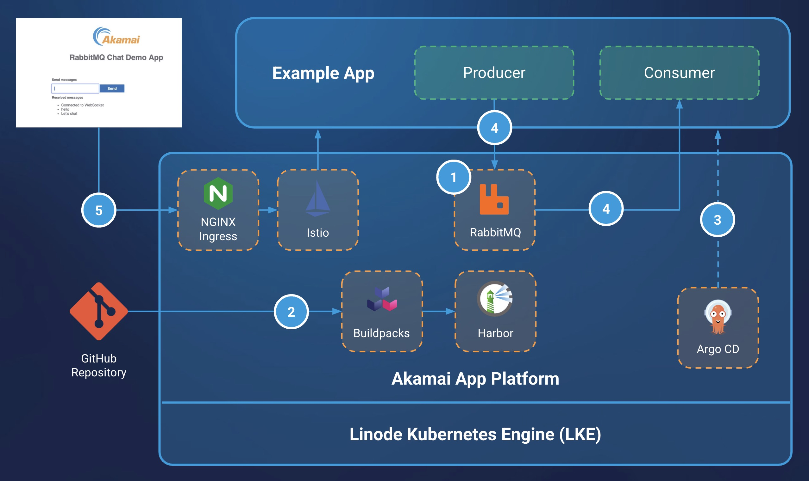


The Akamai App Platform is now available as a limited beta. It is not recommended for production workloads. To register for the beta, visit the [Betas](https://cloud.linode.com/betas) page in the Cloud Manager and click the Sign Up button next to the Akamai App Platform Beta.


## Introduction

Asynchronous messaging is a common microservice architecture pattern used to decouple inter-service communication. Akamai App Platform uses RabbitMQ to provide an integrated messaging and streaming broker. RabbitMQ is a widely-adopted, open source message broker that uses AMQP (Advanced Message Queuing Protocol) to communicate with producers (apps that send messages) and consumers (apps that receive messages).

This guide provides steps for creating a RabbitMQ cluster on App Platform, as well as building and deploying an example Python application configured to send messages to a RabbitMQ queue using a fanout exchange. The example app consists of a static website built to send messages through the application server to a connected RabbitMQ cluster.

### What is a Fanout Exchange?

A "fanout" exchange is a message protocol method that relays messages to all bound queues. The result in this architecture is RabbitMQ sending all messages to all connected clients.

The fanout exchange protocol is built into RabbitMQ and can be used to route one message to multiple users, where a common use case would be sending a single notification to all customers. A consideration for this use case is customer preference; some customers may wish to receive information via email while others prefer to receive messages over SMS or social media network.

To address this, RabbitMQ allows you to bind, or link, each service - email, SMS, social media - to a fanout exchange, thus allowing you to send one message to reach all services. The means that when a message is delivered, queues bound to the exchange receive it and can then process the message to each connected client without needing to send multiple messages to reach each service.

## Diagram



1.  A **RabbitMQ** cluster is created using the _RabbitMQ-Cluster_ Helm chart in the App Platform Catalog.

2.  A **Tekton** pipeline is created by App Platform that pulls the source code from a GitHub repository. A **Buildpacks** task is used to build the image and push it to the private registry in **Harbor**.

3.  An **Argo CD** application is created by App Platform to deploy the image built by Buildpacks.

4.  The example Python web application sends messages to RabbitMQ's fanout exchange and binds to the exchange to receive the message.

5.  The **Istio** virtual service and ingress are created by App Platform to expose the example Python application to the public internet via the NGINX Ingress Controller.

## Components

### Infrastructure

-   **Linode Kubernetes Engine (LKE)**: LKE is Akamai’s managed Kubernetes service, enabling you to deploy containerized applications without needing to build out and maintain your own Kubernetes cluster.

-   **App Platform for LKE**: A Kubernetes-based platform that combines developer and operations-centric tools, automation, self-service, and management of containerized application workloads. App Platform for LKE streamlines the application lifecycle from development to delivery and connects numerous CNCF (Cloud Native Computing Foundation) technologies in a single environment, allowing you to construct a bespoke Kubernetes architecture.

### Software

-   [**RabbitMQ**](https://www.rabbitmq.com/): An open source alternative message broker that uses queue-based messaging to provide customization and control over message routing and delivery patterns.

-   [**Harbor**](https://goharbor.io/): An open source registry that helps store and manage container images and OCI artifacts like Helm charts. Harbor uses RBAC (role-based access control) for secure artifact and policy management.

-   [**Argo CD**](https://argo-cd.readthedocs.io/en/stable/): An open source, declarative, continuous delivery tool for Kubernetes. Argo CD uses the GitOps workflow to continuously monitor applications and compare their current states against desired states in a Git repository.

-   [**Cloud Native Buildpacks**](https://buildpacks.io/): A buildpack is software used to take application source code and transform it into containerized images for building applications.

-   [**Istio**](https://istio.io/): An open source service mesh used for securing, connecting, and monitoring microservices.

-   [**Ingress NGINX Controller**](https://github.com/kubernetes/ingress-nginx): When creating a Service in App Platform, an `ingress` is created using NGINX's Ingress Controller to allow public access to internal services.

## Prerequisites

-   A [Cloud Manager](https://cloud.linode.com/) account is required to use Akamai's cloud computing services, including LKE.

-   Enrollment into the Akamai App Platform's [beta program](https://cloud.linode.com/betas).

-   An provisioned and configured LKE cluster with App Platform enabled and [auto-scaling](https://techdocs.akamai.com/cloud-computing/docs/manage-nodes-and-node-pools#autoscale-automatically-resize-node-pools) turned on. An LKE cluster consisting of 3 Dedicated Compute Instances is sufficient for the deployment in this guide to run, but additional resources may be required during the configuration of your App Platform architecture.

    To ensure sufficient resources are available, it is recommended that node pool auto-scaling for your LKE cluster is enabled after deployment. Make sure to set the max number of nodes higher than your minimum. This may result in higher billing costs.

To learn more about provisioning a LKE cluster with App Platform, see our [Getting Started with App Platform for LKE](https://techdocs.akamai.com/cloud-computing/docs/getting-started-with-akamai-application-platform) guide.

## Set Up Infrastructure

Once your LKE cluster with App Platform has been fully deployed, [sign in](https://techdocs.akamai.com/cloud-computing/docs/getting-started-with-akamai-application-platform#obtain-the-initial-access-credentials-and-sign-in) to the App Platform web UI using the `platform-admin` account, or another account that uses the `platform-admin` role.

### Enable RabbitMQ and Harbor

1.  Select **view** > **platform** in the top bar.

1.  Select **Apps** from the left menu.

1.  Enable the **RabbitMQ** and **Harbor** apps by hovering over each app icon and clicking the **power on** button. It may take a few minutes for the apps to enable.

    Enabled apps move up and appear in color towards the top of the available app list.

    
    Optionally, Harbor can be configured to use object storage when first activated. While not necessary for the demo in this tutorial, it is recommended for production environments.
    

### Create a New Team

[Teams](https://apl-docs.net/docs/for-ops/console/teams) are isolated tenants on the platform to support Development and DevOps teams, projects, or even DTAP (Development, Testing, Acceptance, Production). A Team gets access to the Console, including access to self-service features and all shared apps available on the platform.

When working in the context of an admin-level Team, users can create and access resources in any namespace. When working in the context of a non-admin Team, users can only create and access resources used in that Team's namespace.

1.  Select **view** > **platform**.

1.  Select **Teams** in the left menu.

1.  Click **Create Team**.

1.  Provide a **Name** for the Team. Keep all other default values, and click **Submit**. This guide uses the Team name `demo`.

### Create a RabbitMQ Cluster with Workloads

A [Workload](https://apl-docs.net/docs/for-devs/console/workloads) is a self-service feature for creating Kubernetes resources using Helm charts from the Catalog.

1.  Switch to your newly created team view by selecting **view** > **team** and **team** > **demo** in the top bar. You can switch back to team `admin` as needed by selecting **view** > **team** and **team** > **admin**.

1.  Select **Workloads** from the left menu, and then click **Create Workload**.

1.  Select the _Rabbitmq-Cluster_ Helm chart from the Catalog.

1.  Click **Values**.

1.  Provide a name for the Workload. This guide uses the Workload name `rabbitmq-demo`.

1.  Continue with the rest of the default values, and click **Submit**. The Workload may take a few minutes to become ready.

1.  A Workload is ready when there is a green checkmark in the **Status** column:

    

## Build the App

This guide uses an example Python chat app to send messages to all connected clients. The steps below pull the example app code from the Linode Git repository and deploy it using the "Build" feature in App Platform.

The example app in this guide is not meant for production workloads, and steps may vary depending on the app you are using.

1.  Select **view** > **team** and **team** > **demo** in the top bar.

1.  Select **Builds**, and click **Create Build**.

1.  Provide a name for the Build. This is the same name used for the image stored in the private Harbor registry of your Team. This guide uses the Build name `rmq-example-app` with the tag `latest`.

1.  Select the **Mode** `Buildpacks`.

1.  To use the example Python messaging app, provide the following GitHub repository URL:

    ```command
    https://github.com/linode/apl-examples.git
    ```

1.  Set the **Buildpacks** path to `rabbitmq-python`.

1.  Click **Submit**. The build may take a few minutes to be ready.

    
    When a build is created, each task in the pipeline runs in a pod, which requires a certain amount of CPU and memory resources. To ensure the sufficient number of resources are available, it is recommended that auto-scaling for your LKE cluster is enabled prior to creating the build.
    

### Check the Build Status

The backend status of the build can be checked from the **PipelineRuns** section of the Tekton app interface:

1.  Select **Apps** from the left menu, and open the _Tekton_ app.

1.  Click **PipelineRuns** in the left menu.

1.  Click the link of your build in the list of available Pipelines.

1.  A successful build is denoted with a green check mark and `Completed` status:

    

### Copy the Image Repository

Once successfully built, copy the image repository link so that you can create a Workload for deploying the app in the next step.

1.  Select **Builds** to view the status of your build.

1.  When ready, use the "copy" button in the **Repository** column to copy the repository URL link to your clipboard.

    

## Deploy the App

1.  Select **view** > **team** and **team** > **demo** in the top bar.

1.  Select **Workloads**, and click **Create Workload**.

1.  Select the _K8s-Deployment_ Helm chart from the Catalog.

1.  Click **Values**.

1.  Provide a name for the Workload. This guide uses the Workload name `rmq-example-app`.

1.  Click on **Values**.

1.  Add or edit the following chart values. You may need to uncomment or add additional lines in the Values configuration:

    - Update  under `image` > `repository`, where  is the repository URL link from the `rmq-example-app` build in the previous section.

    - Update the `name` references under each `secretKeyRef` entry. The format is `-rabbitmq-cluster-default-user`, where  is the name of the RabbitMQ cluster Workload, `rabbitmq-demo`.

    ```
    image:
      repository: 
      pullPolicy: IfNotPresent
      tag: 
    env:
      - name: 
        valueFrom:
          secretKeyRef:
            name: -rabbitmq-cluster-default-user
            key: 
      - name: 
        valueFrom:
          secretKeyRef:
            name: -rabbitmq-cluster-default-user
            key: 
      - name: 
        valueFrom:
          secretKeyRef:
            name: -rabbitmq-cluster-default-user
            key: 
    ```

1.  Click **Submit**. It may take a few minutes for the Workload to be ready.

### Allow Traffic to the RabbitMQ Cluster

In order for the RabbitMQ Cluster to be accessible, a Network Policy must be created.

A [Network Policy](https://apl-docs.net/docs/for-devs/console/netpols) in App Platform is a self-service method of controlling traffic to and from your deployment. Ingress (inbound) policies control access to internal Team pods, and egress (outbound) policies control traffic to external endpoints.

1.  Select **Network Policies** from the left menu, and click **Create NetPol**.

1.  Provide a name for the policy. This guide uses the name `rabbitmq-example`.

1.  Select **Rule type** `ingress` using the following values. Make sure to replace  with the name you used for the RabbitMQ cluster Workload:

    - **Selector label name**: `otomi.io/app`

    - **Selector label value**: `-rabbitmq-cluster`

1.  Set the **Mode** to `AllowOnly`.

1.  To give permissions to your Team, set the namespace to `team-demo` or your created team name.

1.  Optionally, you can limit the in-cluster exposure to the app by configuring Workload-level authentication.

    To do this, set the **Selector label name** to `otomi.io/app` and the **Selector label value** to the name of your app's Workload (i.e. `rmq-example-app`).

1.  Click **Submit**.

## Expose the App

Create a service to expose the `rmq-example-app` application to external traffic.

1.  Select **Services** in the left menu, and click **Create Service**.

1.  In the **Name** dropdown menu, select the `rmq-example-app` service.

1.  Under **Exposure**, select **External**.

1.  Click **Submit**. The service may take a few minutes to be ready.

### Access the Demo App

1.  In the list of Services, click the URL for the `rmq-example-app` application. This should bring you to the live chat demo application in your browser.

1.  Enter an example message (i.e. `Hello World!`), and click **Send**:

    

1.  Once sent, you should your message display in the messages list. This acts as confirmation that your message was received.