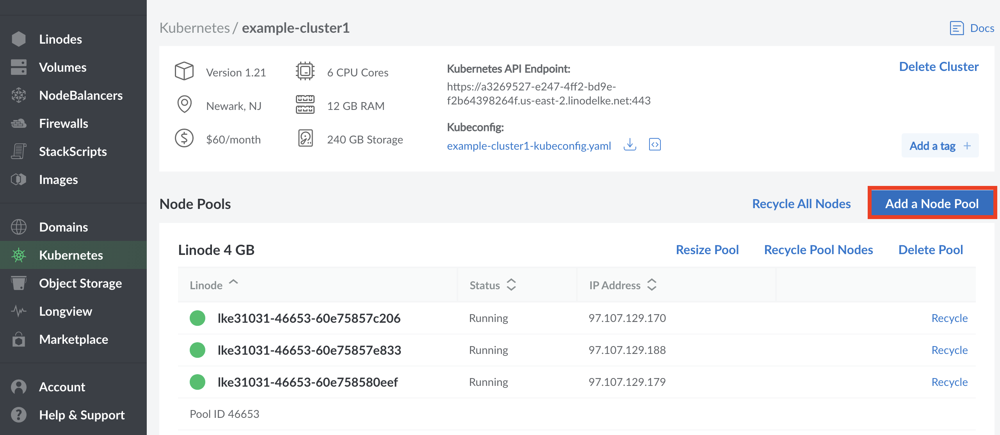
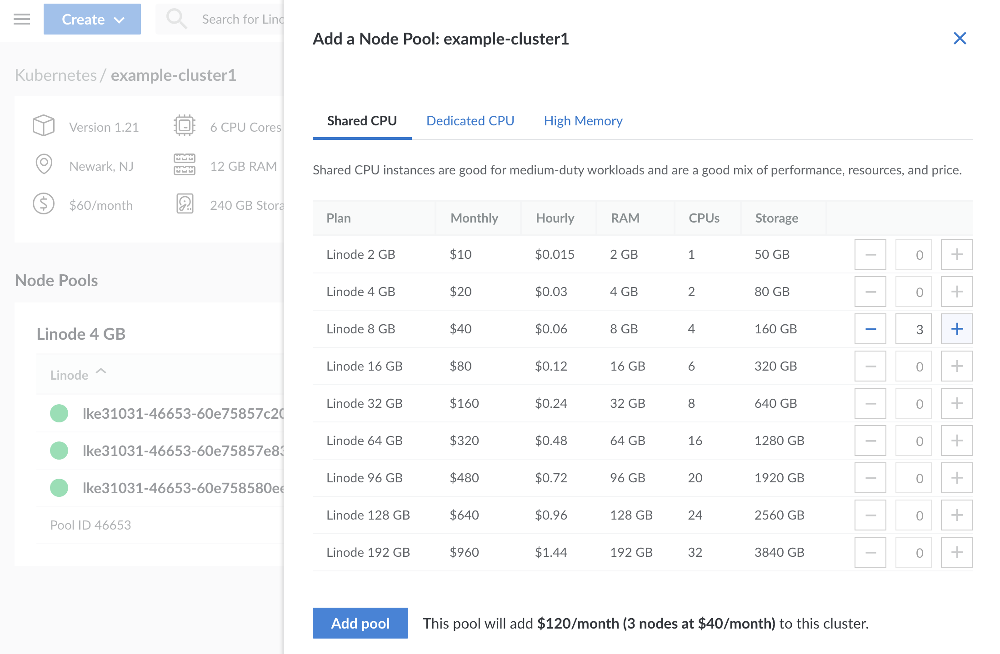

1. To add a new Node Pool to your cluster, navigate to the [cluster's details page](/docs/kubernetes/deploy-and-manage-a-cluster-with-linode-kubernetes-engine-a-tutorial/#access-your-cluster-s-details-page) and select the add a node pool option to the right of the node pools section.

    

1. In the new window that appears, select the [hardware resources](/docs/platform/how-to-choose-a-linode-plan/#hardware-resource-definitions) that you'd like to add to your new Node Pool. To the right of each plan, select the plus `+` and minus `-` to add or remove a Linode to a node pool one at time. Once you're satisfied with the number of nodes in a node pool, select **Add Pool** to include it in your configuration. If you decide that you need more or fewer hardware resources after you deploy your cluster, you can always [edit your Node Pool](/docs/kubernetes/deploy-and-manage-a-cluster-with-linode-kubernetes-engine-a-tutorial/#edit-or-remove-existing-node-pools).

    
