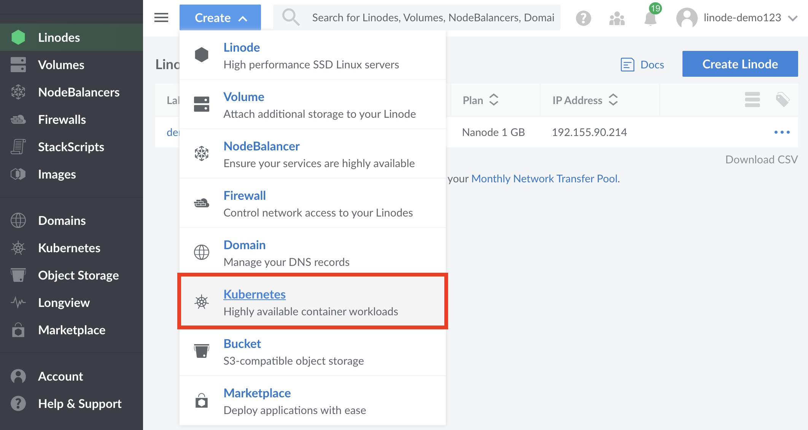
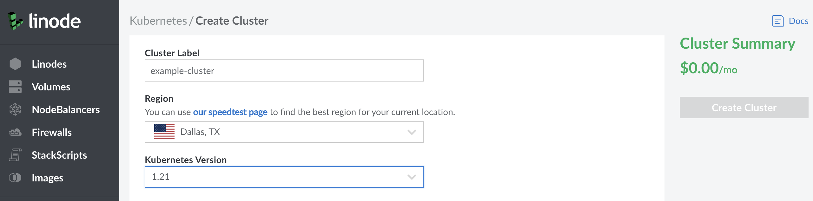
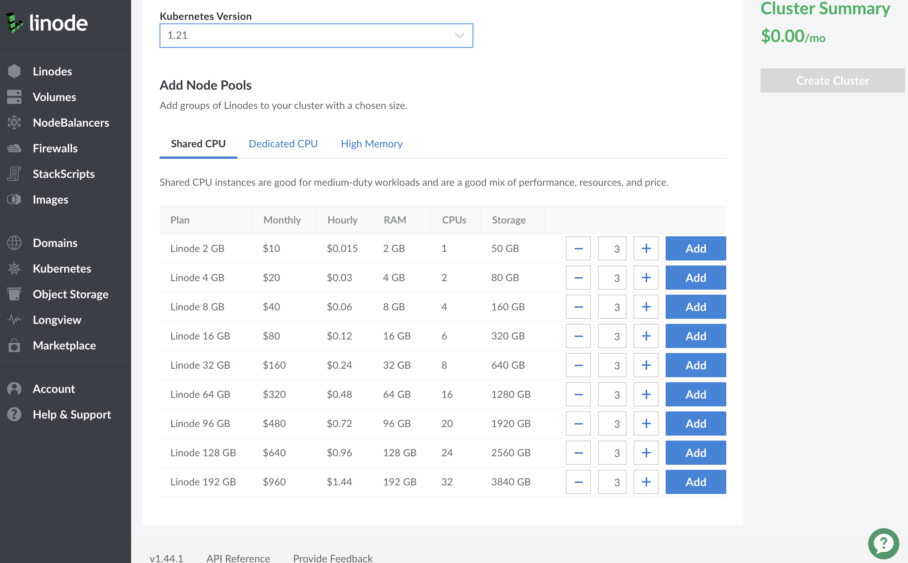
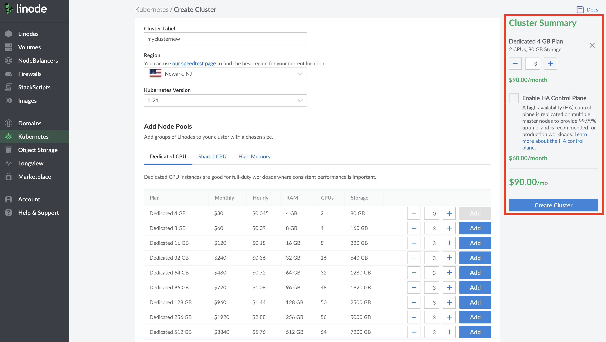

1.  Log into your [Linode Cloud Manager](https://cloud.linode.com/) account.

1.  From the Linode dashboard, click the **Create** button at the top of the page and select **Kubernetes** from the dropdown menu.

    

1. The **Create a Kubernetes Cluster** page will appear. At the top of the page, you'll be required to select the following options:

    - In the **Cluster Label** field, provide a name for your cluster. The name must be unique between all of the clusters on your account. This name will be how you identify your cluster in the Cloud Manager’s Dashboard.

    - From the **Region** dropdown menu, select the **Region** where you would like your cluster to reside.

    - From the **Version** dropdown menu, select a Kubernetes version to deploy to your cluster.

    

1. In the **Add Node Pools** section, select the [hardware resources](/docs/guides/choosing-a-compute-instance-plan/#hardware-resource-definitions) for the Linode worker node(s) that make up your LKE cluster. To the right of each plan, select the plus `+` and minus `-` to add or remove a Linode to a node pool one at time. Once you're satisfied with the number of nodes in a node pool, select **Add** to include it in your configuration. If you decide that you need more or fewer hardware resources after you deploy your cluster, you can always [edit your Node Pool](/docs/guides/deploy-and-manage-a-cluster-with-linode-kubernetes-engine-a-tutorial/#edit-or-remove-existing-node-pools).

    
Currently, the available plan types for LKE worker nodes are [Shared](/docs/guides/choosing-a-compute-instance-plan/#1-shared), [Dedicated CPU](/docs/guides/choosing-a-compute-instance-plan/#4-dedicated-cpu), and [High Memory](/docs/guides/choosing-a-compute-instance-plan/#3-high-memory) plans. In order to meet the minimum system requirements for LKE nodes, [1 GB Shared Nanodes](https://www.linode.com/pricing/) are not an option for worker nodes.
    

    

1. Once a pool has been added to your configuration, you will see it listed in the **Cluster Summary** on the right-hand side of the Cloud Manager detailing your cluster's hardware resources and monthly cost. Additional pools can be added before finalizing the cluster creation process by repeating the previous step for each additional pool.

    

1. When you are satisfied with the configuration of your cluster, click the **Create Cluster** button on the right hand side of the screen. Your cluster's detail page will appear on the following page where you will see your Node Pools listed. From this page, you can [edit your existing Node Pools](/docs/guides/deploy-and-manage-a-cluster-with-linode-kubernetes-engine-a-tutorial/#edit-or-remove-existing-node-pools), [access your Kubeconfig file](/docs/guides/deploy-and-manage-a-cluster-with-linode-kubernetes-engine-a-tutorial/#access-and-download-your-kubeconfig), and view an overview of your cluster's resource details.
