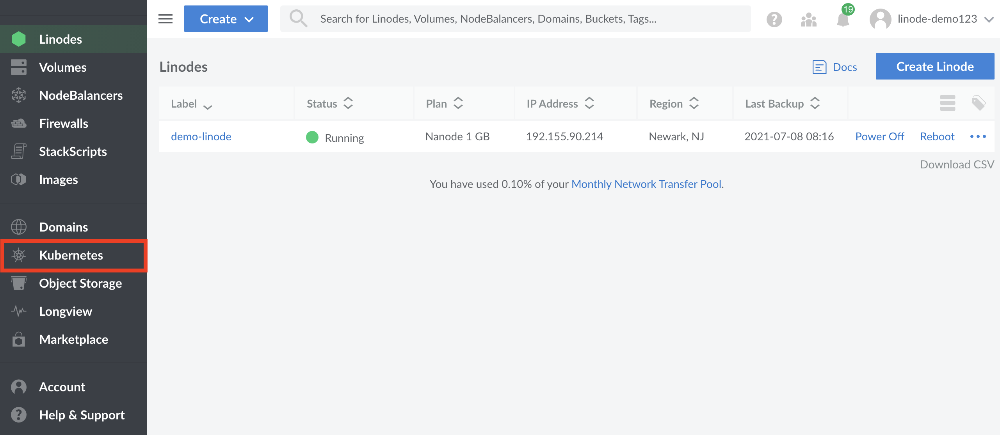
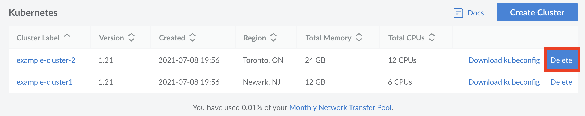
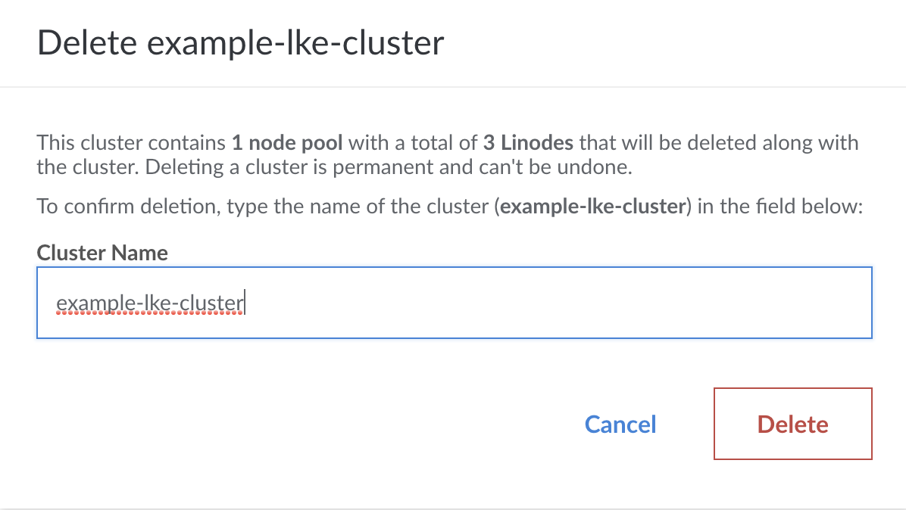

You can delete an entire cluster using the Linode Cloud Manager. These changes cannot be reverted once completed.

1.  Click the **Kubernetes** link in the sidebar. The Kubernetes listing page will appear and you will see all your clusters listed.

    

1. Select the **More Options Ellipsis** to the right of the cluster you'd like to delete, and select the `Delete` option:

    

1.  A confirmation pop-up will appear. Enter in your cluster's name and click the **Delete** button to confirm.

    

1.  The Kubernetes listing page will appear and you will no longer see your deleted cluster.
