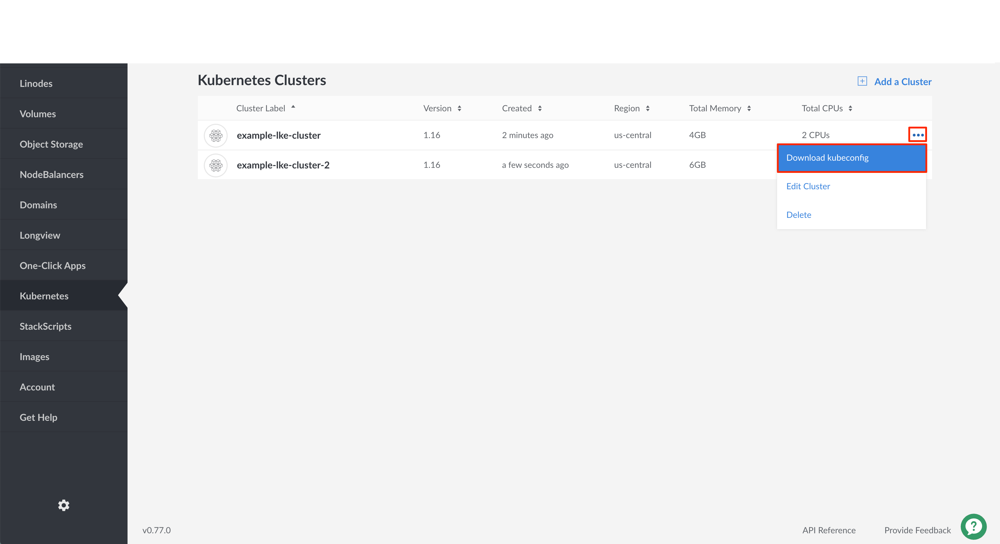
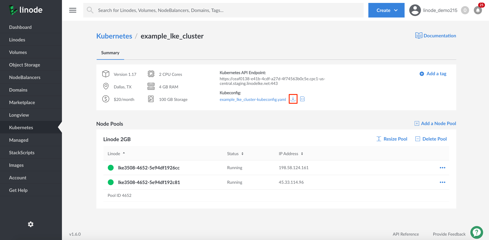
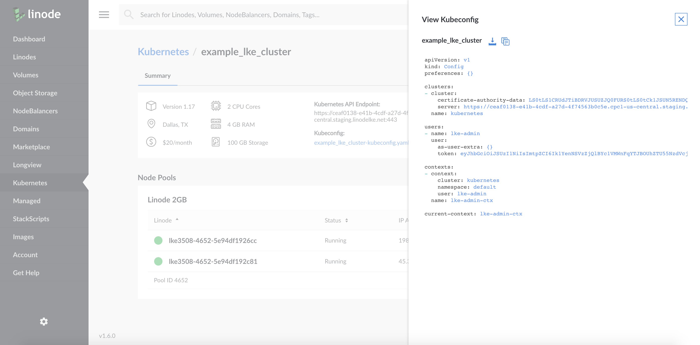

Anytime after your cluster is created you can download its *kubeconfig*. The kubeconfig is a YAML file that will allow you to use kubectl to communicate with your cluster. Here is an example kubeconfig file:


apiVersion: v1
kind: Config
preferences: {}

clusters:
- cluster:
    certificate-authority-data: LS0tLS1CRUd...
    server: https://example.us-central.linodelke.net:443
  name: lke1234

users:
- name: lke1234-admin
  user:
    as-user-extra: {}
    token: LS0tLS1CRUd...

contexts:
- context:
    cluster: lke1234
    namespace: default
    user: lke1234-admin
  name: lke1234-ctx

current-context: lke1234-ctx


This configuration file defines your cluster, users, and contexts.

1. To access your cluster's kubeconfig, log into your Cloud Manager account and navigate to the **Kubernetes** section.

1. From the Kubernetes listing page, click on your cluster's **more options ellipsis** and select **Download kubeconfig**. The file will be saved to your computer's `Downloads` folder.

    

    
You can also download the kubeconfig from the Kubernetes cluster's details page.

1. When viewing the Kubernetes listing page, click on the cluster for which you'd like to download a kubeconfig file.

1. On the cluster's details page, under the **kubeconfig** section, click the **Download icon**. The file will be saved to your `Downloads` folder.

    

1. To view the contents of your kubeconfig file, click on the **View icon**. A pane will appear with the contents of your cluster's kubeconfig file.

    



1. Open a terminal shell and save your kubeconfig file's path to the `$KUBECONFIG` environment variable. In the example command, the kubeconfig file is located in the `Downloads` folder, but you should alter this line with this folder's location on your computer:

        export KUBECONFIG=~/Downloads/kubeconfig.yaml

    
It is common practice to store your kubeconfig files in `~/.kube` directory. By default, kubectl will search for a kubeconfig file named `config` that is located in the  `~/.kube` directory. You can specify other kubeconfig files by setting the `$KUBECONFIG` environment variable, as done in the step above.


1. View your cluster's nodes using kubectl.

        kubectl get nodes

    
If your kubectl commands are not returning the resources and information you expect, then your client may be assigned to the wrong cluster context. Visit our [Troubleshooting Kubernetes](/docs/kubernetes/troubleshooting-kubernetes/#troubleshooting-examples) guide to learn how to switch cluster contexts.


      You are now ready to manage your cluster using kubectl. For more information about using kubectl, see Kubernetes' [Overview of kubectl](https://kubernetes.io/docs/reference/kubectl/overview/) guide.
