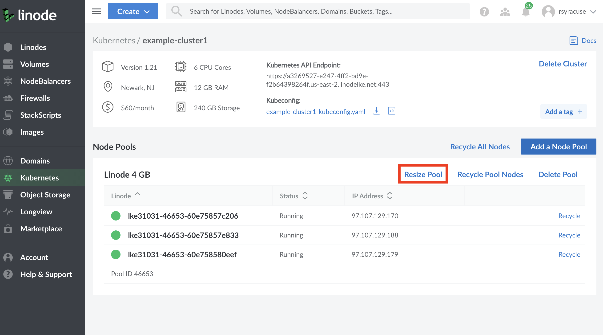
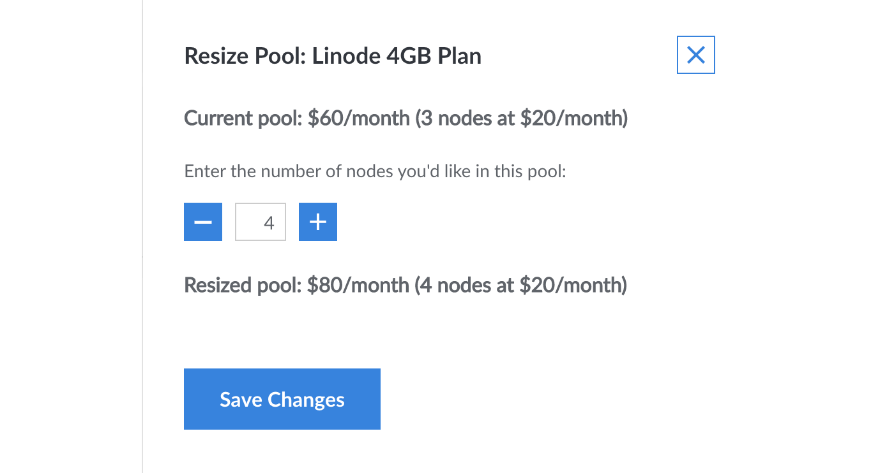
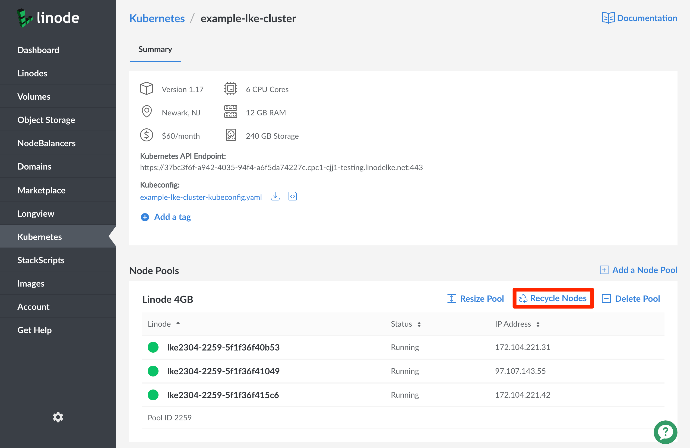
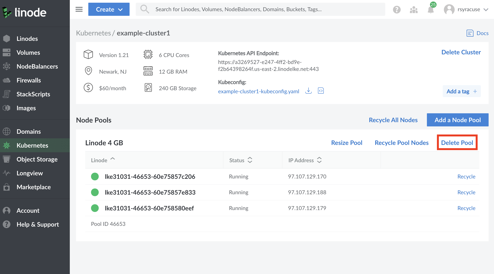

1. On your [cluster's details page](/docs/kubernetes/deploy-and-manage-a-cluster-with-linode-kubernetes-engine-a-tutorial/#access-your-cluster-s-details-page), click the **Resize Pool** option at the top-right of each entry in the **Node Pools** section.

    

    Using the sidebar that appears to the right of the page, you can now remove `-` or add `+` Linodes to the pool, and the total cost of your new resources will be displayed. To accept these changes, select the `Save Changes` button to continue.

    
Shrinking a node pool will result in deletion of Linodes. Any local storage on deleted Linodes (such as "hostPath" and "emptyDir" volumes, or "local" PersistentVolumes) will be erased.


    

1. To recycle a node pool from the [cluster's details page](/docs/kubernetes/deploy-and-manage-a-cluster-with-linode-kubernetes-engine-a-tutorial/#access-your-cluster-s-details-page), click the **Recycle Nodes** option at the top-right of each entry in the **Node Pools** section. Recycling a node pool will update its nodes to the most recent patch of the cluster's Kubernetes version. A pop-up message will appear confirming that you're sure you'd like to proceed with recycling. Select the `Recycle all Nodes` option, and your Node Pool will proceed to recycle its nodes on a rolling basis so that only one node will be down at a time throughout the recycling process.

    
Recycling your node pool involves deleting each of the Linodes in the node pool and replacing them with new Linodes. Any local storage on deleted Linodes (such as "hostPath" and "emptyDir" volumes, or "local" PersistentVolumes) will be erased.


    

1. To remove a node pool from the [cluster's details page](#access-your-cluster-s-details-page), click the **Delete Pool** option at the top-right of each entry in the **Node Pools** section. A pop-up message will then appear confirming that you're sure you'd like to proceed with deletion. Select the `Delete` option, and your Node Pool will proceed to be deleted.

    

    
Your cluster must always have at least one active node pool.
    
