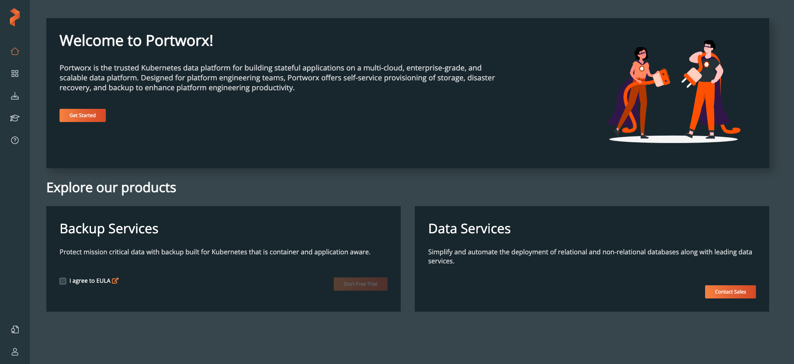
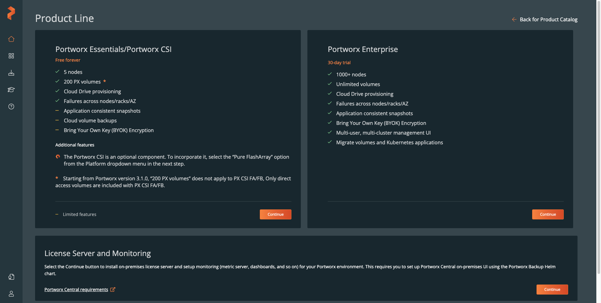
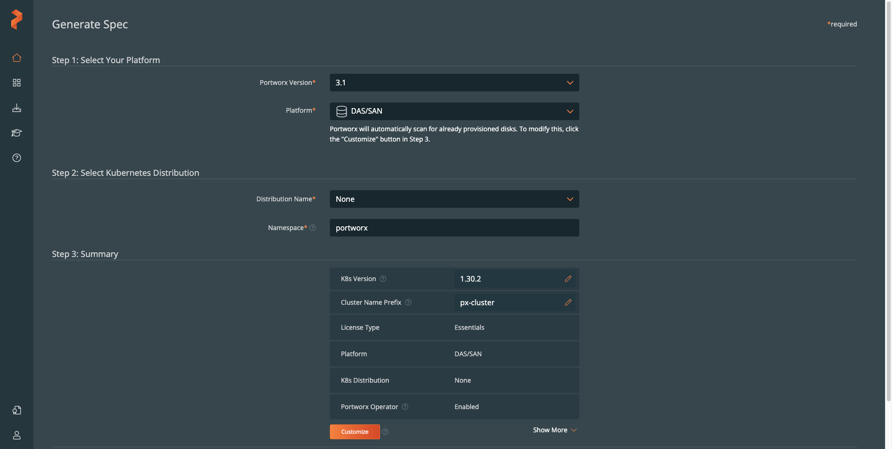
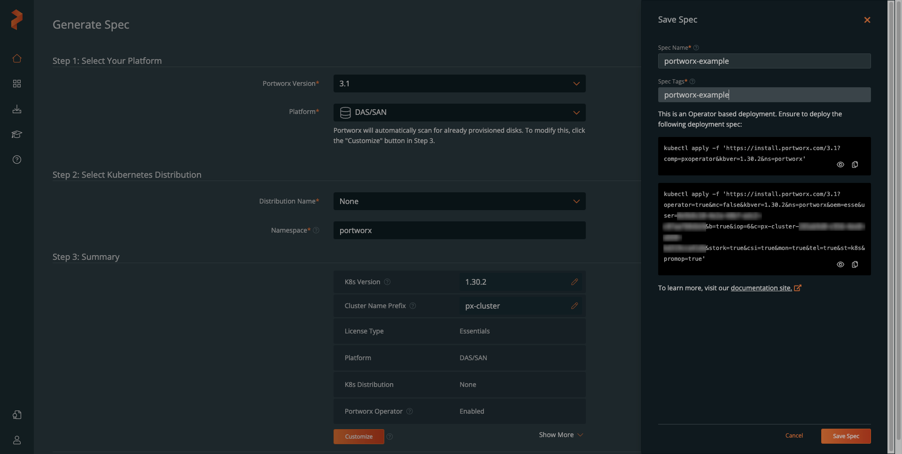
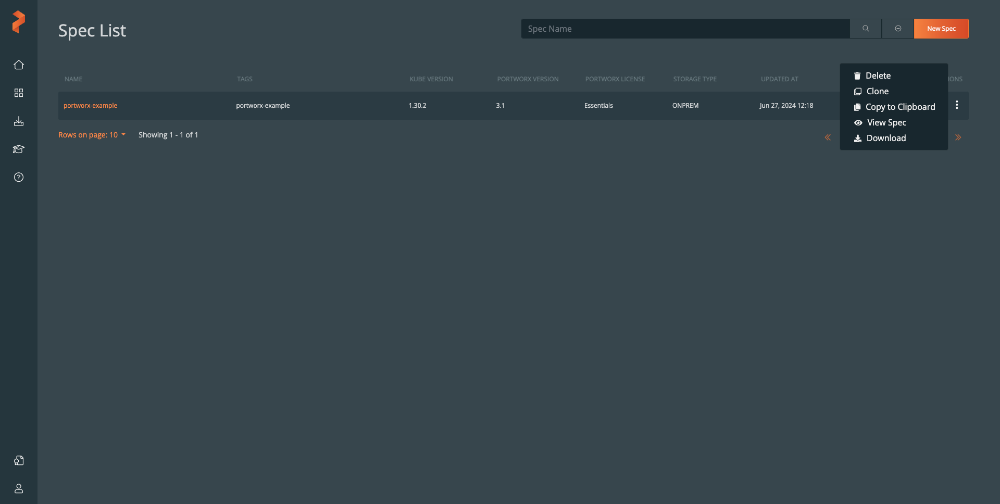

Management of data at scale is crucial for deriving actionable insights, and an effective data platform can provide those kinds of insights. A data platform is the technology infrastructure used for the collection, storage, transaction processing, and analysis of varied data at scale. It simplifies engineering tasks such as expanding the storage available to an application or encrypting project secrets.

Portworx handles advanced storage and data management capabilities for cloud-native environments. This guide provides step-by-step instructions for installing Portworx on an existing Kubernetes cluster. It then walks through setting up a model project to demonstrate Portworx' capabilities.

## What Is Portworx?

Portworx enables deployment and management of storage and data services specifically in containerized environments. It also handles data replication, snapshots, backups, and data recovery, allowing application systems to focus on their own specific requirements. Since Portworx itself is cloud-native, it plays a crucial role in helping other systems maximize the capabilities of the cloud.

Current cloud computing practices face several challenges, particularly the difficulty of managing Kubernetes instances in the real-world. Portworx mitigates some of these challenges.

A limited version of the Portworx Storage Platform is available for free. It allows for an implementation of object storage for a single distributed cluster. This guide focuses on the free, downloadable software that you can install and run for your own educational and small-scale uses.

## How Portworx Relates to Kubernetes, Kafka, and Cassandra

Portworx integrates with widely known software systems such as Kubernetes, Kafka, and Cassandra:

-   [**Kubernetes**](/docs/guides/kubernetes/) serves as the foundation of most Portworx implementations. However, Portworx is also compatible with other container orchestration systems.

-   [**Cassandra**](/docs/guides/databases/cassandra/) is an open source distributed database management system that emphasizes economical operation, high availability, and wide-column semantics. Portworx addresses several of the challenges involved in configuring and operating Cassandra. For example, when running Cassandra in containers managed by Kubernetes, Portworx can effectively control memory, resource quotas, and/or CPU cores per Kubernetes cluster.

-   [**Kafka**](/docs/guides/what-is-apache-kafka/) is a widely used open source distributed event store and stream-processing platform. In much the same way a traditional database system manages **records** of data, Kafka manages **events**. For Kafka to perform optimally, it needs a high-performance underlying storage system, and Portworx is a good choice. Teams and individuals often initially adopt Portworx to meet requirements for hosting or upgrading Kafka. Portworx also offers white papers specifically on the [operation of Kafka in a Kubernetes environment](https://portworx.com/blog/deploying-kafka-on-kubernetes-using-portworx-data-services/).

## Before You Begin

1.  Create a Kubernetes cluster that meets the [Portworx installation prerequisites](https://docs.portworx.com/portworx-enterprise/install-portworx/prerequisites). A **Shared CPU**, **Linode 8 GB** plan is suitable. You must have `kubectl` configured on your local machine to interact with the cluster. See our [Getting Stated with Kubernetes](/docs/products/compute/kubernetes/get-started/) guide for instructions. Also, take note of the Kubernetes version running on your cluster as it is needed later.

1.  The Portworx installation prerequisites also include a backing drive (i.e. Volume) for each of three nodes, which must be at least 8 GB. Follow our [Getting Started with Block Storage](/docs/products/storage/block-storage/get-started/) guide to create and attach a 10 GB Volume to each node. Creating volumes via the **Storage** tab of the individual Kubernetes instances is more efficient than via **Volumes**, as it creates *and* attaches in one step.

1.  Sign up for a personal account on [Portworx Central](https://central.portworx.com).


This guide is written for a non-root user. Commands that require elevated privileges are prefixed with `sudo`. If you’re not familiar with the `sudo` command, see the [Users and Groups](/docs/guides/linux-users-and-groups/) guide.


## Portworx Installation

To install Portworx, use the basic installation model on an existing Kubernetes cluster. This can be any existing Kubernetes cluster, whether using Linode Kubernetes Engine or a manually constructed setup. You can also use [kind](https://kind.sigs.k8s.io/) for an installation purely within your desktop development environment.

Portworx is not an open source system, though it supports many [individual open source components](https://portworx.com/products/open-source/), and some of its [licenses](https://docs.portworx.com/portworx-enterprise/operations/licensing) involve no fee. However, installation is generally done through the Portworx website and not via standard command-line package managers such as `apt` or `brew`.

Follow the steps in the below sections to install Portworx on an existing Kubernetes cluster.

### The Wizard

1.  Open a web browser and log in to [Portworx Central](https://central.portworx.com).

1.  Select **Get Started** from the **Welcome to Portworx** section of the Portworx Central home page:

    

1.  Choose the **Portworx Essentials/Portworx CSI** fee-free license for demonstration or proof-of-concept workloads:

    

1.  Choose `DAS/SAN` as **Platform** and `None` for **Distribution Name**. Retain `portworx` as the default **Namespace**, but change the **K8s Version** to match the Kubernetes version of your cluster (e.g. `1.30.2`).

    

    
    Use the following command to check your version of Kubernetes:

    ```command
    kubectl version
    ```
    

1.  Select **Save Spec** to generate `kubectl` commands for `Operator` and `StorageCluster`, which reflect the specifications chosen for the Portworx installation. Copy the `kubectl` commands for use in the next section.

    

1.  To save this configuration, fill in **Spec Name** and **Spec Tags** then click **Save Spec** again.

1.  Your generated spec manifest is now available in the **Spec List** section of Portworx Central. You can download it at any time by clicking the three vertical dots under **Actions** and choosing **Download**.

    

### Deployment

1.  Use the first `kubectl` command generated in the previous section to deploy the `Operator` specification. The command structure should follow that of the example command below, with  and  matching your respective Portworx and Kubernetes versions:

    ```command
    kubectl apply -f 'https://install.portworx.com/?comp=pxoperator&kbver=&ns=portworx'
    ```

    Sample output:

    ```output
    namespace/portworx created
    serviceaccount/portworx-operator created
    clusterrole.rbac.authorization.k8s.io/portworx-operator created
    clusterrolebinding.rbac.authorization.k8s.io/portworx-operator created
    deployment.apps/portworx-operator created
    ```

1.  Use the second `kubectl` command generated in the previous section to deploy the `StorageCluster` specification. The command structure should resemble the example command below, with  and  being unique to your Portworx Central account:

    ```command
    kubectl apply -f 'https://install.portworx.com/?operator=true&mc=false&kbver=&ns=portworx&oem=esse&user=&b=true&iop=6&c=px-cluster-&stork=true&csi=true&mon=true&tel=true&st=k8s&promop=true'
    ```

    Sample output:

    ```output
    storagecluster.core.libopenstorage.org/px-cluster- created
    secret/px-essential created
    ```

    
    Should you receive any errors, you can use the **Generate Spec** screen to view up-to-date commands.
    

### Verification

1.  Monitor the status of Portworx nodes with the following command:

    ```command
    kubectl -n portworx get storagenodes -l name=portworx
    ```

    Once the deployments finish, each Portworx node appears as `Online`:

    ```output
    NAME                            ID                                     STATUS   VERSION           AGE
    lke194968-280433-369bf4810000   f2522d07-0b59-482a-a8ae-bd2854fd7bc4   Online   3.1.2.0-fb52ced   4m46s
    lke194968-280433-438a8b610000   b1920afd-5326-48dc-9572-af8e638fd92b   Online   3.1.2.0-fb52ced   4m45s
    lke194968-280433-527b95040000   58649b41-b4c9-4c56-b983-e27a61c9f582   Online   3.1.2.0-fb52ced   4m46s
    ```

1.  Use the following command to monitor the status of an individual node, replacing  with the `NAME` of one of the nodes listed in the prior command's output:

    ```command
    kubectl -n portworx describe storagenode 
    ```

At this point, your working Kubernetes cluster includes a small Portworx deployment with a permanent fee-free license. You can use your cluster for educational practice, proofs-of-concept, or other demonstrations of Portworx' capabilities.

## Run a Model Portworx Project

Among the examples found in the [Portworx documentation](https://docs.portworx.com/) is [Run Kafka on Kubernetes at Scale with Portworx](https://blog.purestorage.com/purely-technical/run-kafka-kubernetes-scale-portworx/). While thousands of organizations already deploy Kafka manually, Portworx can enhance the process. Replacement of a manual deployment with Portworx' mediation automates disaster recovery, application-specific high availability, backup services, and capacity management.

Using the Portworx installation from the preceding section, follow the steps below to get started:

1.  Create a specification file named `sc-kafka-rf2.yaml`:

    ```command
    nano sc-kafka-rf2.yaml
    ```

    Paste in the following contents, and save your changes:

    ```file {title="sc-kafka-rf2.yaml" lang="yaml"}
    kind: StorageClass
    apiVersion: storage.k8s.io/v1
    metadata:
      name: px-sc-kafka-repl2
    provisioner: kubernetes.io/portworx-volume
    allowVolumeExpansion: true
    parameters:
      repl: "2"
      priority_io: "high"
      io_profile: "db_remote"
      cow_ondemand: "true"
      disable_io_profile_protection: "1"
      nodiscard: "false"
      group: "kafka-broker-rep2"
      fg: "false"
    ```

    This storage specification provides several automations, including replication. The `repl: "2"` parameter maintains two full replicas of broker data (i.e. Kafka's content) across the failure domains of the hosting Kubernetes cluster. This ensures that Kafka continues without downtime should a node fail.

1.  Use the following command to apply the `StorageClass`:

    ```command
    kubectl apply -f sc-kafka-rf2.yaml
    ```

    Sample output:

    ```output
    storageclass.storage.k8s.io/px-sc-kafka-repl2 created
    ```

Storage-level replication makes it possible for Portworx to identify and re-assign healthy storage in the event of failure. This keeps data available while replicating almost immediately.

While Portworx generally requires several dozens of lines of configuration files, it's typically less than what administrators may use to maintain a Kubernetes cluster. When terabytes of data are involved, Portworx's efficient data utilization can result in large cost savings.