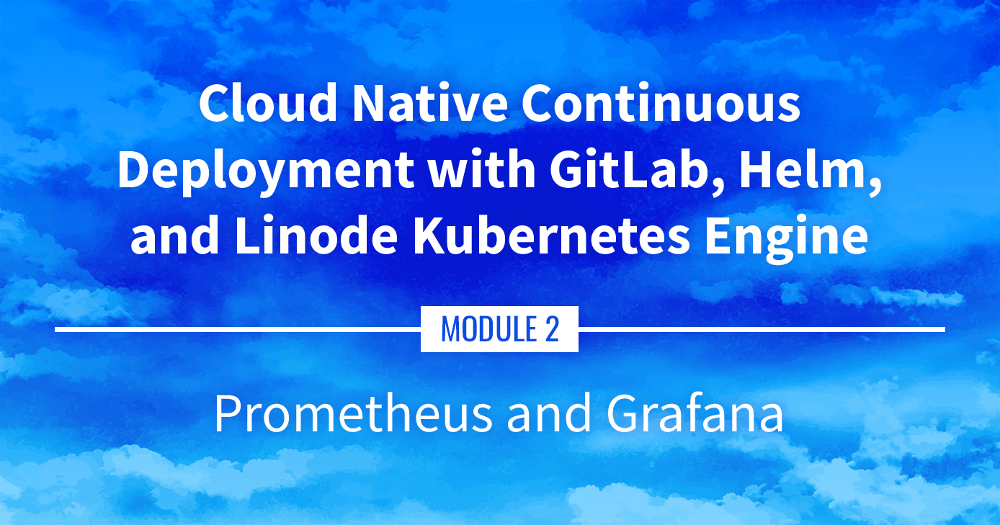

**Slide deck:** [Cloud Native Continuous Deployment with GitLab, Helm, and Linode Kubernetes Engine: Prometheus and Grafana (Slide #163)](https://2021-03-lke.container.training/#163)

## Prometheus and Grafana

Going beyond metrics-server, this guide goes over collecting more advanced metrics using Prometheus (to capture the metrics) and Grafana (to display the metrics within a user interface).

## Navigate the Series

- **Main guide:** [Building a Continuous Deployment Pipeline Using LKE](/docs/guides/lke-continuous-deployment-series)
- **Previous section:** [Part 10: Installing metrics-server](/docs/guides/lke-continuous-deployment-part-10)
- **Next section:** [Part 12: cert-manager](/docs/guides/lke-continuous-deployment-part-12)

## Presentation Text

*Here's a copy of the text contained within this section of the presentation. A link to the source file can be found within each slide of the presentation. Some formatting may have been changed.*

### Prometheus and Grafana

- What if we want metrics retention, view graphs, trends?
- A very popular combo is Prometheus+Grafana:
    - Prometheus as the "metrics engine"
    - Grafana to display comprehensive dashboards
- Prometheus also has an alert-manager component to trigger alerts (we won't talk about that one)

### Installing Prometheus and Grafana

- A complete metrics stack needs at least:
    - the Prometheus server (collects metrics and stores them efficiently)
    - a collection of exporters (exposing metrics to Prometheus)
    - Grafana
    - a collection of Grafana dashboards (building them from scratch is tedious)
- The Helm chart kube-prometheus-stack combines all these elements
- ... So we're going to use it to deploy our metrics stack!

### Installing `kube-prometheus-stack`

- Let's install that stack *directly* from its repo (without doing helm repo add first)
- Otherwise, keep the same naming strategy:

      helm upgrade kube-prometheus-stack kube-prometheus-stack --install \
        --namespace kube-prometheus-stack --create-namespace \
        --repo https://prometheus-community.github.io/helm-charts

- This will take a minute...
- Then check what was installed:

      kubectl get all --namespace kube-prometheus-stack

### Exposing Grafana

- Let's create an Ingress for Grafana

      kubectl create ingress --namespace kube-prometheus-stack grafana \
      --rule=grafana.cloudnative.party/*=kube-prometheus-stack-grafana:80

  (as usual, make sure to use your domain name above)

- Connect to Grafana (remember that the DNS record might take a few minutes to come up)

### Grafana credentials

- What could the login and password be?
- Let's look at the Secrets available in the namespace:

      kubectl get secrets --namespace kube-prometheus-stack

- There is a `kube-prometheus-stack-grafana` that looks promising!

- Decode the Secret:

      kubectl get secret --namespace kube-prometheus-stack \
      kube-prometheus-stack-grafana -o json | jq '.data | map_values(@base64d)'

- If you don't have the `jq` tool mentioned above, don't worry...

### Grafana credentials

- What could the login and password be?

- Let's look at the Secrets available in the namespace:

      kubectl get secrets --namespace kube-prometheus-stack

- There is a `kube-prometheus-stack-grafana` that looks promising!

- Decode the Secret:

      kubectl get secret --namespace kube-prometheus-stack \
      kube-prometheus-stack-grafana -o json | jq '.data | map_values(@base64d)'

- If you don't have the `jq` tool mentioned above, don't worry...

- The login/password is hardcoded to admin/prom-operator 😬

### Grafana dashboards

- Once logged in, click on the "Dashboards" icon on the left (it's the one that looks like four squares)
- Then click on the "Manage" entry
- Then click on "Kubernetes / Compute Resources / Cluster"
- This gives us a breakdown of resource usage by Namespace
- Feel free to explore the other dashboards!

