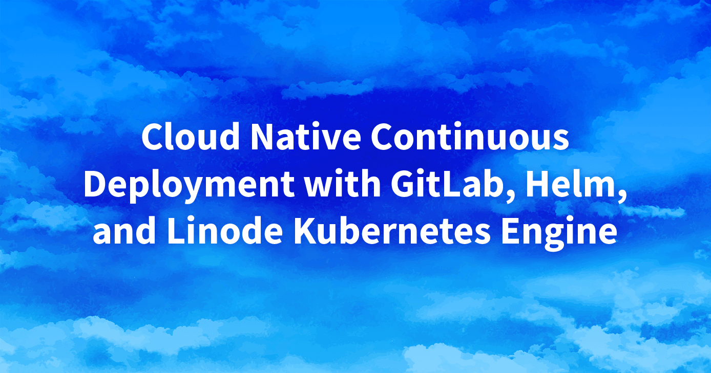

This series covers creating a continuous deployment pipeline within the cloud using [LKE (Linode Kubernetes Engine)](https://www.linode.com/products/kubernetes/), [GitLab](https://about.gitlab.com/), and [Helm](https://helm.sh/). Together, these products enable applications to run on a managed Kubernetes cluster (LKE) and allow for the continuous deployment of updates.

## Presentation

**Slide deck:** [Cloud Native Continuous Deployment with GitLab, Helm, and Linode Kubernetes Engine](https://2021-03-lke.container.training/)

The contents of the slides and the material discussed within is available within the repository [jpetazzo/container.training](https://github.com/jpetazzo/container.training/tree/2021-03-lke). It was created by Jérôme Petazzoni (contact on [Twitter](https://twitter.com/jpetazzo)) and adapted into this series of guides.

## Guides

The material is split into 2 modules and 13 sections. Each of these sections has an accompanying guide, which displays the text shown within that portion of the presentation.

### Module 1

- [Part 1: Get Ready](/docs/guides/lke-continuous-deployment-part-1): An introduction to the gaols of the project, the prerequisites, and the components that will be used.
- [Part 2: Our Sample Application](/docs/guides/lke-continuous-deployment-part-2): Information about the sample application that is used for this project (DockerCoins), including details on both downloading and using it.
- [Part 3: Deploying our LKE Cluster](/docs/guides/lke-continuous-deployment-part-3): Creating, configuring, and connecting to a Kubernetes cluster hosted using LKE (Linode Kubernetes Engine).
- [Part 4: Quick Kubernetes Review](/docs/guides/lke-continuous-deployment-part-4): A review of Kubernetes, including its various components (such as pods, controllers, and services).
- [Part 5: Accessing Internal Services](/docs/guides/lke-continuous-deployment-part-5): A guide on temporarily accessing an internal service within Kubernetes through both `kubectl proxy` and `kubectl port-forward`.
- [Part 6: DNS, Ingress, Metrics](/docs/guides/lke-continuous-deployment-part-6): A brief overview of setting up DNS, an Ingress Controller, and a metrics system. All three of these will be discussed in greater detail within Module 2.

### Module 2

- [Part 7: Managing Stacks with Helm](/docs/guides/lke-continuous-deployment-part-7): 
- [Part 8: External DNS](/docs/guides/lke-continuous-deployment-part-8)
- [Part 9: Installing Traefik](/docs/guides/lke-continuous-deployment-part-9)
- [Part 10: Installing metrics-server](/docs/guides/lke-continuous-deployment-part-10)
- [Part 11: Prometheus and Grafana](/docs/guides/lke-continuous-deployment-part-11)
- [Part 12: cert-manager](/docs/guides/lke-continuous-deployment-part-12)
- [Part 13: CI/CD with GitLab](/docs/guides/lke-continuous-deployment-part-13)