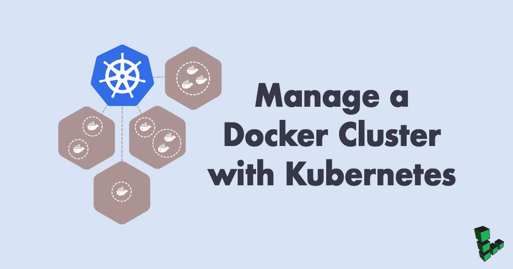
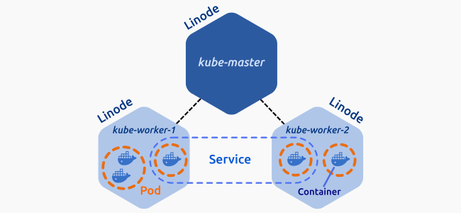

## What is a Kubernetes Cluster?

[Kubernetes](https://kubernetes.io/) is an open source platform for managing containerized applications. If you use Docker for an application deployed on multiple Linodes, a Kubernetes cluster can manage your servers and deployments, including tasks such as scaling, deployment, and rolling upgrades.

A Kubernetes cluster consists of at least one master node and several worker nodes. The master node runs the API server, the scheduler and the controller manager, and the actual application is deployed dynamically across the cluster.


You can now create a Kubernetes cluster with one command using the Linode CLI. To provision Kubernetes on Linodes, this tool uses the [Linode Kubernetes Terraform module](https://github.com/linode/terraform-linode-k8s), the [Linode Cloud Controller Manager (CCM)](https://github.com/linode/linode-cloud-controller-manager), and the [Container Storage Interface (CSI) Driver](https://github.com/linode/linode-blockstorage-csi-driver) for Linode Block Storage.  See the [Kubernetes Tools](https://developers.linode.com/kubernetes/) page for installation steps. For an in-depth dive into the Linode Kubernetes Terraform module, see its related [Community Site post](https://www.linode.com/community/questions/17611/the-linode-kubernetes-module-for-terraform).


## System Requirements

To complete this guide you will need three Linodes running Ubuntu 16.04 LTS, each with at least 4GB of RAM. Before beginning this guide, you should also use the Cloud Manager to generate a [private IP address](/docs/products/compute/compute-instances/guides/manage-ip-addresses/#adding-an-ip-address) for each Linode.

## Before You Begin

This article requires that you first complete our [How to Install, Configure, and Deploy NGINX on a Kubernetes Cluster](/docs/guides/how-to-deploy-nginx-on-a-kubernetes-cluster/) guide and follow the procedures described there to configure one master node and two worker nodes.

Set the hostnames of the three Linodes as follows:

- Master node: `kube-master`
- First worker node: `kube-worker-1`
- Second worker node: `kube-worker-2`

Unless otherwise stated, all commands will be executed from the `kube-master`.

## Kubernetes Pods

A [Pod](https://kubernetes.io/docs/concepts/workloads/pods/pod-overview/) is a group of one or more tightly coupled containers that share resources such as storage and network. Containers inside a Pod are started, stopped, and replicated as a group.



### Create a Deployment

[Deployments](https://kubernetes.io/docs/concepts/workloads/controllers/deployment/) are high-level objects that can manage Pod creation and allow the use of features such as declarative scaling and rolling-upgrade.

1.  In a text editor, create `nginx.yaml` and add the following content:

    ```file {title="~/nginx.yaml" lang=yaml}
    apiVersion: apps/v1
    kind: Deployment
    metadata:
      name: nginx-server
      labels:
        app: nginx
    spec:
      replicas: 1
      selector:
        matchLabels:
          app: nginx
      template:
        metadata:
          labels:
            app: nginx
        spec:
          containers:
          - name: nginx
            image: nginx:1.13-alpine
            ports:
            - containerPort: 80
    ```

    The file contains all the necessary information to specify a deployment, including the Docker image to use, number of replicas, and the container port. For more information about deployment configuration, see the [documentation.](https://kubernetes.io/docs/concepts/workloads/controllers/deployment/#creating-a-deployment)

1.  Create your first deployment:

    ```command
    kubectl create -f nginx.yaml --record
    ```

1.  List your deployments:

    ```command
    kubectl get deployments
    ```

    ```output
    NAME           DESIRED   CURRENT   UP-TO-DATE   AVAILABLE   AGE
    nginx-server   1         1         1            1           13s
    ```

1.  Check that your Pod is present:

    ```command
    kubectl get pods
    ```

    ```output
    NAME                           READY     STATUS    RESTARTS   AGE
    nginx-server-b9bc6c6b5-d2gqv   1/1       Running   0          58s
    ```

1.  To see which node the deployment was created on, add the `-o wide` flag:

    ```command
    kubectl get pods -o wide
    ```

    ```output
    NAME                           READY     STATUS    RESTARTS   AGE       IP                NODE
    nginx-server-b9bc6c6b5-d2gqv   1/1       Running   0          1m        192.168.255.197   kube-worker-02
    ```

### Scale Deployments

Kubernetes makes it easy to scale deployments to add or remove replicas.

1.  Increase the number of replicas to 8:

    ```command
    kubectl scale deployment nginx-server --replicas=8
    ```

1.  Check the availability of your new replicas:

    ```command
    kubectl get pods -o wide
    ```

    ```output
    NAME                           READY     STATUS    RESTARTS   AGE       IP               NODE
    nginx-server-b9bc6c6b5-4mdf6   1/1       Running   0          41s       192.168.180.10   kube-worker-1
    nginx-server-b9bc6c6b5-8mvrd   1/1       Running   0          3m        192.168.180.9    kube-worker-1
    nginx-server-b9bc6c6b5-b99pt   1/1       Running   0          40s       192.168.180.12   kube-worker-1
    nginx-server-b9bc6c6b5-fjg2c   1/1       Running   0          40s       192.168.127.12   kube-worker-2
    nginx-server-b9bc6c6b5-kgdq5   1/1       Running   0          41s       192.168.127.11   kube-worker-2
    nginx-server-b9bc6c6b5-mhb7s   1/1       Running   0          40s       192.168.180.11   kube-worker-1
    nginx-server-b9bc6c6b5-rlf9w   1/1       Running   0          41s       192.168.127.10   kube-worker-2
    nginx-server-b9bc6c6b5-scwgj   1/1       Running   0          40s       192.168.127.13   kube-worker-2
    ```

1.  The same command can be used to decrease the number of replicas:

    ```command
    kubectl scale deployment nginx-server --replicas=3
    ```

### Rolling Upgrades

Managing Pods with a Deployment allows you to make use of **rolling upgrades**. A rolling upgrade is a mechanism that allows you to update your application version without any downtime. Kubernetes ensures that at least 25% of your Pods are available at all times and creates new Pods before deleting the old ones.

1.  Upgrade your containers' NGINX version from 1.13 to 1.13.8:

    ```command
    kubectl set image deployment/nginx-server nginx=nginx:1.13.8-alpine
    ```

    Similar to the scaling process, the `set` command uses declarative approach: you specify the desired state and the controller manages all necessary tasks to accomplish that goal.

1.  Check the update status:

    ```command
    kubectl rollout status deployment/nginx-server
    ```

    ```output
    Waiting for rollout to finish: 1 out of 3 new replicas have been updated...
    Waiting for rollout to finish: 1 out of 3 new replicas have been updated...
    Waiting for rollout to finish: 1 out of 3 new replicas have been updated...
    Waiting for rollout to finish: 2 out of 3 new replicas have been updated...
    Waiting for rollout to finish: 2 out of 3 new replicas have been updated...
    Waiting for rollout to finish: 2 out of 3 new replicas have been updated...
    Waiting for rollout to finish: 1 old replicas are pending termination...
    Waiting for rollout to finish: 1 old replicas are pending termination...
    deployment "nginx-server" successfully rolled out
    ```

1.  You can manually check the application version with the `describe` command:

    ```command
    kubectl describe pod <pod-name>
    ```

1.  In the event of an error, the rollout will hang and you will be forced to cancel by pressing **CTRL+C**. Test this by setting an invalid NGINX version:

    ```command
    kubectl set image deployment/nginx-server nginx=nginx:1.18.
    ```

1.  Check your current Pods:

    ```command
    kubectl get pods -o wide
    ```

    ```output
    NAME                            READY     STATUS             RESTARTS   AGE       IP               NODE
    nginx-server-76976d4555-7nv6z   1/1       Running            0          3m        192.168.127.15   kube-worker-2
    nginx-server-76976d4555-wg785   1/1       Running            0          3m        192.168.180.13   kube-worker-1
    nginx-server-76976d4555-ws4vf   1/1       Running            0          3m        192.168.127.14   kube-worker-2
    nginx-server-7ddd985dd6-mpn9h   0/1       ImagePullBackOff   0          2m        192.168.180.16   kube-worker-1
    ```

    The Pod `nginx-server-7ddd985dd6-mpn9h` is trying to upgrade to an nonexistent version of NGINX.

1.  Get more details about the error by inspecting this Pod:

    ```command
    kubectl describe pod nginx-server-7ddd985dd6-mpn9h
    ```

1.  Since you used the `--record` flag when creating the deployment, you can retrieve the complete revision history:

    ```command
    kubectl rollout history deployment/nginx-server
    ```

    ```output
    REVISION  CHANGE-CAUSE
    1         kubectl scale deployment nginx-server --replicas=3
    2         kubectl set image deployment/nginx-server nginx=nginx:1.13.8-alpine
    3         kubectl set image deployment/nginx-server nginx=nginx:1.18
    ```

1.  You can then roll back to an earlier, working revision. To revert to the previous revision, use the `undo` command:

    ```command
    kubectl rollout undo deployment/nginx-server
    ```

1.  To roll back to a specific revision, specify the target revision with the `--to-revision` option:

    ```command
    kubectl rollout undo deployment/nginx-server --to-revision=1
    ```

## Kubernetes Services

You now have a deployment running three Pods of an NGINX application. In order to expose the Pods to the internet, you need to create a **service**. In Kubernetes a service is an abstraction that allows Pods to be accessible at all times. Services automatically handle IP changes, updates, and scaling, so once the service is enabled your application will be available as long as a running Pod remains active.

1.  Configure a test service:

    ```file {title="~/nginx-service.yaml" lang=yaml}
    apiVersion: v1
    kind: Service
    metadata:
      name: nginx-service
      labels:
        run: nginx
    spec:
      type: NodePort
      ports:
      - port: 80
        targetPort: 80
        protocol: TCP
        name: http
      selector:
        app: nginx
    ```

1.  Create the service:

    ```command
    kubectl create -f nginx-service.yaml
    ```

1.  Check the status of the new service:

    ```command
    kubectl get services
    ```

    ```output
    NAME            TYPE        CLUSTER-IP    EXTERNAL-IP   PORT(S)        AGE
    kubernetes      ClusterIP   10.96.0.1     <none>        443/TCP        2d
    nginx-service   NodePort    10.97.41.31   <none>        80:31738/TCP   38m
    ```

    The service is running and accepting connections on port 31738.

1.  Test the service:

    ```command
    curl <MASTER_LINODE_PUBLIC_IP_ADDRESS>:<PORT(S)>
    ```

1.  View additional information about this service with the `describe` command:

    ```command
    kubectl describe service nginx-service
    ```

    ```output
    Name:                     nginx-service
    Namespace:                default
    Labels:                   run=nginx
    Annotations:              <none>
    Selector:                 app=nginx
    Type:                     NodePort
    IP:                       10.97.41.31
    Port:                     http  80/TCP
    TargetPort:               80/TCP
    NodePort:                 http  31738/TCP
    Endpoints:                192.168.127.14:80,192.168.127.15:80,192.168.180.13:80
    Session Affinity:         None
    External Traffic Policy:  Cluster
    Events:                   <none>
    ```

## Kubernetes Namespaces

Namespaces are logical environments that offer the flexibility to divide Cluster resources between multiple teams or users.

1.  List the available namespaces:

    ```command
    kubectl get namespaces
    ```

    ```output
    default       Active        7h
    kube-public   Active        7h
    kube-system   Active        7h
    ```

    As the name implies, the `default` namespace is where your deployments will be placed if no other namespace is specified. `kube-system` is reserved for objects created by Kubernetes and `kube-public` is available for all users. Namespaces can be created from a `.json` file or directly from the command line.

1.  Create a new file named `dev-namespace.json` for the **Development** environment:

    ```file {title="~/home/dev-namespace.json" lang=json}
    {
      "kind": "Namespace",
      "apiVersion": "v1",
      "metadata": {
        "name": "development",
        "labels": {
          "name": "development"
        }
      }
    }
    ```

1.  Create the namespace in your cluster:

    ```command
    kubectl create -f dev-namespace.json
    ```

1.  List the namespaces again:

    ```command
    kubectl get namespaces
    ```

### Contexts

In order to use your namespaces you need to define the **context** where you want to employ them. Kubernetes contexts are saved in the `kubectl` configuration.

1.  View your current configuration:

    ```command
    kubectl config view
    ```

1.  Check in what context you are working on:

    ```command
    kubectl config current-context
    ```

1.  Add the `dev` context using the command:

    ```command
    kubectl config set-context dev --namespace=development \
    --cluster=kubernetes \
    --user=kubernetes-admin
    ```

1.  Switch to the `dev` context/namespace:

    ```command
    kubectl config use-context dev
    ```

1.  Verify the change:

    ```command
    kubectl config current-context
    ```

1.  Review your new configuration:

    ```command
    kubectl config view
    ```

1.  Pods within a namespace are not visible to other namespaces. Check this by listing your Pods:

    ```command
    kubectl get pods
    ```

    The message "No resources found" appears because you have no Pods or deployments created in this namespace. You still can view these objects with the `--all-namespaces` flag:

    ```command
    kubectl get services --all-namespaces
    ```

### Labels

Any object in Kubernetes can have a label attached to it. Labels are key value pairs that make it easier to organize, filter, and select objects based on common characteristics.

1.  Create a test deployment for this namespace. This deployment will include the `nginx` label:

    ```file {title="~/my-app.yaml" lang=yaml}
    apiVersion: apps/v1
    kind: Deployment
    metadata:
      name: my-app
      labels:
        app: my-app
    spec:
      replicas: 4
      selector:
        matchLabels:
          app: nginx
      template:
        metadata:
          labels:
            app: nginx
        spec:
          containers:
          - name: nginx
            image: nginx:1.12-alpine
            ports:
            - containerPort: 80
    ```

1.  Create the deployment:

    ```command
    kubectl create -f my-app.yaml --record
    ```

1.  If you need to find a particular Pod within your cluster, rather than listing all of the Pods it is usually more efficient to search by label with the `-l` option:

    ```command
    kubectl get pods --all-namespaces -l app=nginx
    ```

    Only the Pods in the `default` and `development` namespace are listed because they have the label `nginx` included in their definition.

## Kubernetes Nodes

A node may be a physical machine or a virtual machine. In this guide each Linode is a node. Think of nodes as the uppermost level in the Kubernetes abstraction model.

1.  List your current nodes:

    ```command
    kubectl get nodes
    ```

    ```output
    NAME             STATUS    ROLES     AGE       VERSION
    kube-master      Ready     master    21h       v1.9.2
    kube-worker-1    Ready     <none>    19h       v1.9.2
    kube-worker-2    Ready     <none>    17h       v1.9.2
    ```

1.  For more detail, add the `-o` flag:

    ```command
    kubectl get nodes -o wide
    ```

1.  The information displayed is mostly self-explanatory and useful for checking that all nodes are ready. You can also use the `describe` command for more detailed information about a specific node:

    ```command
    kubectl describe node kube-worker-1
    ```

### Node Maintenance

Kubernetes offers a very straightforward solution for taking nodes offline safely.

1.  Return to the default namespace where you have a running service for NGINX:

    ```command
    kubectl config use-context kubernetes-admin@kubernetes
    ```

1.  Check your Pods:

    ```command
    kubectl get pods -o wide
    ```

1.  Prevent new Pods creation on the node `kube-worker-2`:

    ```command
    kubectl cordon kube-worker-2
    ```

1.  Check the status of your nodes:

    ```command
    kubectl get nodes
    ```

    ```output
    NAME             STATUS                     ROLES     AGE       VERSION
    kube-master      Ready                      master    4h        v1.9.2
    kube-worker-1    Ready                      <none>    4h        v1.9.2
    kube-worker-2    Ready,SchedulingDisabled   <none>    4h        v1.9.2
    ```

1.  To test the Kubernetes controller and scheduler, scale up your deployment:

    ```command
    kubectl scale deployment nginx-server --replicas=10
    ```

1.  List your Pods again:

    ```command
    kubectl get pods -o wide
    ```

    ```output
    NAME                           READY     STATUS    RESTARTS   AGE       IP                NODE
    nginx-server-b9bc6c6b5-2pnbk   1/1       Running   0          11s       192.168.188.146   kube-worker-1
    nginx-server-b9bc6c6b5-4cls5   1/1       Running   0          11s       192.168.188.148   kube-worker-1
    nginx-server-b9bc6c6b5-7nw5m   1/1       Running   0          3d        192.168.255.220   kube-worker-2
    nginx-server-b9bc6c6b5-7s7w5   1/1       Running   0          44s       192.168.188.143   kube-worker-1
    nginx-server-b9bc6c6b5-88dvp   1/1       Running   0          11s       192.168.188.145   kube-worker-1
    nginx-server-b9bc6c6b5-95jgr   1/1       Running   0          3d        192.168.255.221   kube-worker-2
    nginx-server-b9bc6c6b5-md4qd   1/1       Running   0          3d        192.168.188.139   kube-worker-1
    nginx-server-b9bc6c6b5-r5krq   1/1       Running   0          11s       192.168.188.144   kube-worker-1
    nginx-server-b9bc6c6b5-r5nd6   1/1       Running   0          44s       192.168.188.142   kube-worker-1
    nginx-server-b9bc6c6b5-ztgmr   1/1       Running   0          11s       192.168.188.147   kube-worker-1
    ```

    There are ten Pods in total but new Pods were created only in the first node.

1.  Tell `kube-worker-2` to drain its running Pods:

    ```command
    kubectl drain kube-worker-2 --ignore-daemonsets
    ```

    ```output
    node "kube-worker-2" already cordoned
    WARNING: Ignoring DaemonSet-managed pods: calico-node-9mgc6, kube-proxy-2v8rw
    pod "my-app-68845b9f68-wcqsb" evicted
    pod "nginx-server-b9bc6c6b5-7nw5m" evicted
    pod "nginx-server-b9bc6c6b5-95jgr" evicted
    pod "my-app-68845b9f68-n5kpt" evicted
    node "kube-worker-2" drained
    ```

1.  Check the effect of this command on your Pods:

    ```command
    kubectl get pods -o wide
    ```

    ```output
    NAME                           READY     STATUS    RESTARTS   AGE       IP                NODE
    nginx-server-b9bc6c6b5-2pnbk   1/1       Running   0          9m        192.168.188.146   kube-worker-1
    nginx-server-b9bc6c6b5-4cls5   1/1       Running   0          9m        192.168.188.148   kube-worker-1
    nginx-server-b9bc6c6b5-6zbv6   1/1       Running   0          3m        192.168.188.152   kube-worker-1
    nginx-server-b9bc6c6b5-7s7w5   1/1       Running   0          9m        192.168.188.143   kube-worker-1
    nginx-server-b9bc6c6b5-88dvp   1/1       Running   0          9m        192.168.188.145   kube-worker-1
    nginx-server-b9bc6c6b5-c2c5c   1/1       Running   0          3m        192.168.188.150   kube-worker-1
    nginx-server-b9bc6c6b5-md4qd   1/1       Running   0          3d        192.168.188.139   kube-worker-1
    nginx-server-b9bc6c6b5-r5krq   1/1       Running   0          9m        192.168.188.144   kube-worker-1
    nginx-server-b9bc6c6b5-r5nd6   1/1       Running   0          9m        192.168.188.142   kube-worker-1
    nginx-server-b9bc6c6b5-ztgmr   1/1       Running   0          9m        192.168.188.147   kube-worker-1
    ```

1.  You are ready now to safely shut down your Linode without interrupting service.

1. Once you finish your maintenance, tell the controller that this node is available for scheduling again:

    ```command
    kubectl uncordon kube-worker-2
    ```