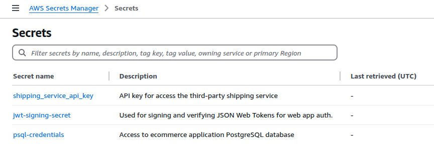

AWS Secrets Manager is a fully managed service that securely stores and retrieves sensitive information such as database credentials, API keys, and other application secrets.

[OpenBao](https://openbao.org/) is an open source fork of [HashiCorp Vault](https://www.vaultproject.io/) that gives teams full control over how secrets are stored, encrypted, and accessed. Unlike managed platforms, OpenBao can be self-hosted in any environment, including on-premises and across multiple clouds.

This guide walks through how to migrate secrets from AWS Secrets Manager to OpenBao running on Akamai Cloud.

## Before You Begin

1.  Follow our [Getting Started](https://techdocs.akamai.com/cloud-computing/docs/getting-started) guide to create an Akamai Cloud account if you do not already have one.

1.  Create a personal access token using the instructions in our [Manage personal access tokens](https://techdocs.akamai.com/cloud-computing/docs/manage-personal-access-tokens) guide.

1.  Install the Linode CLI using the instructions in the [Install and configure the CLI](https://techdocs.akamai.com/cloud-computing/docs/install-and-configure-the-cli) guide.

1.  Follow the steps in the *Install `kubectl`* section of the [Getting started with LKE](https://techdocs.akamai.com/cloud-computing/docs/getting-started-with-lke-linode-kubernetes-engine#install-kubectl) guide to install and configure `kubectl`.

1.  Ensure that you have access to your AWS account with sufficient permissions to work with AWS Secrets Manager. The [AWS CLI](https://aws.amazon.com/cli/) and [`eksctl`](https://eksctl.io/) must also be installed and configured.

1.  Install `jq`, a lightweight command line JSON processor.


This guide is written for a non-root user. Commands that require elevated privileges are prefixed with `sudo`. If you’re not familiar with the `sudo` command, see the [Users and Groups](/docs/guides/linux-users-and-groups/) guide.


Additionally, this guide contains a number of placeholders that are intended to be replaced by your own unique values. The table below lists these placeholders, what they represent, and the example values used in this guide:

| Placeholder                               | Represents                                                                 | Example Value                                 |
|-------------------------------------------|-------------------------------------------------------------------------|-----------------------------------------------|
| ``       | The name of the secret in AWS and OpenBao.                              | `psql`                                         |
| `` | The KV mount path used in OpenBao to organize secrets.                  | `database-credentials`                         |
| ``   | The name of the file containing the OpenBao policy.                     | `db-secrets-policy.hcl`                        |
| ``       | The name used to refer to the policy in OpenBao.                        | `db-secrets-policy`                            |
| ``      | The name used to identify the AppRole in OpenBao.                       | `web-app-approle`                              |
| ``        | The AppRole ID generated by OpenBao.                                    | `1d41b8be-03d2-6f61-702d-1731c957fd13`         |
| `` | The secret ID tied to the AppRole.                                      | `4eb6e604-681c-3fc3-bedd-a2dc774955bb`         |
| ``     | The API token generated using AppRole login.                            | `s.kpKsgWNtYLAktRYQT4BiMVMy`                   |
| ``      | A key in a structured secret (repeatable).                      | `username`, `password`, `engine`, `host`, `port`, `dbname`           |
| ``    | The value associated with a `SECRET_KEY_X` (repeatable).                | `psqluser`, `W0H@Z52IGI0VjqoGS3xMkJ9SO533w$fcfrmzs.vault-tokenTudDxEe\#`, `postgres`, `psql.example-cloud.com`, `5432`, `web_app_production`  |


All of the example values used in this guide are purely examples to mimic the format of actual secrets. These are *not* real credentials to any exisiting systems.


## Review Existing Secrets in AWS Secrets Manager

Before migrating to OpenBao, evaluate how your organization currently uses AWS Secrets Manager.

For example, a web application might rely on database credentials stored in AWS Secrets Manager. Rather than hardcoding these credentials in source code or container images, the application is assigned a role that allows it to retrieve them securely at runtime. This prevents secrets from being exposed through version control or CI/CD pipelines.

OpenBao supports similar access workflows using dynamic injection, AppRole-based access control, and tight integration with Kubernetes workloads.


Ensure that you securely handle any exposed secrets, as they no longer benefit from encryption by AWS Secrets Manager.


### Review Secrets Using the AWS Console

In the AWS Secrets Manager dashboard, review your existing secrets.



### Review Secrets Using the AWS CLI

Alternatively, using the AWS CLI can quickly provide insight into existing secrets and their usage. To list all secrets, run the following command:

```command
aws secretsmanager list-secrets --query 'SecretList[*].Name'
```

```output
[
    "psql-credentials",
    "jwt-signing-secret",
    "shipping_service_api_key"
]
```

To retrieve the secret value for a specific secret, use the  with the `get-secret-value` command:

```command
aws secretsmanager get-secret-value \
  --secret-id  \
  --query SecretString \
  --output text \
  | jq
```

**For Example**:

```command
aws secretsmanager get-secret-value \
  --secret-id psql-credentials \
  --query SecretString \
  --output text \
  | jq
```

```output
{
  "username": "psqluser",
  "password": "W0H@Z52IGI0VjqoGS3xMkJ9SO533w$fcfrmzs!m$TudDxEe#",
  "engine": "postgres",
  "host": "psql.example-cloud.com",
  "port": "5432",
  "dbname": "web_app_production"
}
```

In AWS Secrets Manager, secrets are stored either as key/value pairs or as plaintext. In the previous example, the single `psql-credentials` secret is a set of key/value pairs.

AWS Secrets Manager uses AWS IAM to control access to secrets. As an example that adopts role-based access control (RBAC), a role such as `DatabaseReader` might have a policy attached that allows the `secretsmanager:GetSecretValue` action on the `psql-credentials` resource. Then, the web application that accesses the database would be given the `DatabaseReader` role so that it can obtain the secret values which would allow it to connect to the database.

Replicating this setup using OpenBao will involve creating an [application role (AppRole)](https://openbao.org/docs/auth/approle/) to take the place of the AWS IAM role so that applications can use an API token associated with the AppRole to authenticate requests for the secret.

## Deploy OpenBao on Akamai Cloud

When migrating from AWS Secrets Manager to OpenBao on Akamai Cloud, your deployment requirements determine whether to install OpenBao on a single Linode Instance or to deploy it in a fault-tolerant environment using the Linode Kubernetes Engine (LKE). Follow the appropriate guide below:

-   [Deploying OpenBao on a Linode Instance](https://docs.google.com/document/d/1x30v1xT_EDuRNnhE9jv5VkFqj9Lo4N3kNO6ICOoSrOM/edit?usp=sharing)
-   [Deploying OpenBao on Linode Kubernetes Engine](https://docs.google.com/document/d/1gS6hQg09Ufr1Ku0v528acLESnyj1ZpXTxLhkLIlP-u8/edit?usp=sharing)
-   [Deploying OpenBao through the Linode Marketplace](/docs/marketplace-docs/guides/openbao/)

Regardless of the method used, make sure that:

-   OpenBao is successfully initialized.
-   The vault is unsealed.
-   The `BAO_ADDR` environment variable is set.
-   You are authenticated using the root token.

### Create a Policy and AppRole

Use AppRoles to replicate AWS IAM-style access control in OpenBao. In AWS Secrets Manager, applications typically assume IAM roles (e.g. `DatabaseReader`) that permit secret retrieval via policies like `secretsmanager:GetSecretValue`. In OpenBao, equivalent functionality is achieved through policy-bound AppRoles that authorize secrets access through token-based authentication.

Follow these steps to create an OpenBao AppRole that mimics IAM-based access used in AWS Secrets Manager.

#### Enable AppRole

1.  [Enable the AppRole authentication method](https://openbao.org/docs/auth/approle/#via-the-api-1):

    ```command
    bao auth enable approle
    ```

    ```output
    Success! Enabled approle auth method at: approle/
    ```

#### Create a Policy

2.  [Create a new `.hcl` policy](https://openbao.org/docs/concepts/policies/) file in `/etc/openbao`, replacing  (e.g. `db-secrets-policy.hcl`) with a policy filename of your choosing:

    ```command
    sudo nano /etc/openbao/
    ```

    **For Example:**

    ```command
    sudo nano /etc/openbao/db-secrets-policy.hcl
    ```

1.  Give the file the following contents, replacing  (e.g. `database-credentials`) with your chosen mount path:

    ```file {title="POLICY_FILENAME.hcl"}
    path "/*" {
      capabilities = ["read"]
    }
    ```

    **For Example**:

    ```file {title="db-secrets-policy.hcl"}
    path "database-credentials/*" {
      capabilities = ["read"]
    }
    ```

    This policy grants read access to any secrets within the specified mount path (e.g. `database-credentials`).

    When done, press <kbd>CTRL</kbd>+<kbd>X</kbd>, followed by <kbd>Y</kbd> then <kbd>Enter</kbd> to save the file and exit `nano`.

1.  Add the policy to OpenBao, replacing  (e.g. `db-secrets-policy`) and  (e.g. `db-secrets-policy.hcl`):

    ```command
    bao policy write  /etc/openbao/
    ```

    **For Example**:

    ```command
    bao policy write db-secrets-policy /etc/openbao/db-secrets-policy.hcl
    ```

    ```output
    Success! Uploaded policy: db-secrets-policy
    ```

#### Create an AppRole

5.  Create an AppRole for the application that needs access to the secret, replacing  (e.g. `web-app-approle`) and  (e.g. `db-secrets-policy`):

    ```command
    bao write auth/approle/role/ token_policies=
    ```

    **For Example**:

    ```command
    bao write auth/approle/role/web-app-approle token_policies=db-secrets-policy
    ```

    ```output
    Success! Data written to: auth/approle/role/web-app-approle
    ```

1.  Verify that the AppRole was written successfully, replacing  (e.g. `web-app-approle`):

    ```command
    bao read auth/approle/role/
    ```

    **For Example**:

    ```command
    bao read auth/approle/role/web-app-approle
    ```

    ```output
    Key                        Value
    ---                        -----
    bind_secret_id             true
    local_secret_ids           false
    secret_id_bound_cidrs      <nil>
    secret_id_num_uses         0
    secret_id_ttl              0s
    token_bound_cidrs          []
    token_explicit_max_ttl     0s
    token_max_ttl              0s
    token_no_default_policy    false
    token_num_uses             0
    token_period               0s
    token_policies             [db-secrets-policy]
    token_strictly_bind_ip     false
    token_ttl                  0s
    token_type                 default
    ```

1.  Fetch the AppRole ID, replacing  (e.g. `web-app-approle`):

    ```command
    bao read auth/approle/role//role-id
    ```

    **For Example**:

    ```command
    bao read auth/approle/role/web-app-approle/role-id
    ```

    ```output
    Key        Value
    ---        -----
    role_id    1d41b8be-03d2-6f61-702d-1731c957fd13
    ```

#### Generate a Secret ID

8.  Generate a secret ID for the role, replacing  (e.g. `web-app-approle`):

    ```command
    bao write -f auth/approle/role//secret-id
    ```

    **For Example**:

    ```command
    bao write -f auth/approle/role/web-app-approle/secret-id
    ```

    ```output
    Key                   Value
    ---                   -----
    secret_id             4eb6e604-681c-3fc3-bedd-a2dc774955bb
    secret_id_accessor    fe899dc6-85f7-f596-fb93-3c961f7919a9
    secret_id_num_uses    0
    secret_id_ttl         0s
    ```

#### Generate an API Token

9.  Generate an API token for the AppRole, supplying the  (e.g. `1d41b8be-03d2-6f61-702d-1731c957fd13`) and the  (e.g. `4eb6e604-681c-3fc3-bedd-a2dc774955bb`) from the previous commands:

    ```command
    bao write auth/approle/login \
      role_id="" \
      secret_id=""
    ```

    **For Example**:

    ```command
    bao write auth/approle/login \
      role_id="" \
      secret_id=""
    ```

    ```output
    Key                     Value
    ---                     -----
    token                   s.kpKsgWNtYLAktRYQT4BiMVMy
    token_accessor          Rwlq5EmvrHC8VvvHwoRyJzUh
    token_duration          768h
    token_renewable         true
    token_policies          ["db-secrets-policy" "default"]
    identity_policies       []
    policies                ["db-secrets-policy" "default"]
    token_meta_role_name    web-app-approle
    ```

    The AppRole token (e.g. `s.kpKsgWNtYLAktRYQT4BiMVMy`) can be used by a user, machine, or service, such a web application, to authenticate OpenBao API calls, giving the caller authorization to read the database credential secret.

### Storing Secrets

Create the secret store defined in the policy created above.

1.  Enable the KV secrets engine, replacing  (e.g. `database-credentials`):

    ```command
    bao secrets enable --path= kv
    ```

    **For Example**:

    ```command
    bao secrets enable --path=database-credentials kv
    ```

    ```output
    Success! Enabled the kv secrets engine at: database-credentials/
    ```

1.  The example database secret stored at AWS Secrets Manager includes multiple fields stored as a JSON object. Store a structured secret such as this in the  (e.g. `database-credentials`) as a secret named  (e.g. `psql`) like this:

    ```command
    bao kv put --mount=  \
      ""="" \
      ""=""  \
      ""="" \
      ""="" \
      ""="" \
      ""=""
    ```

    **For Example**:

    ```command
    bao kv put --mount=database-credentials psql \
      "username"="psqluser" \
      "password"="W0H@Z52IGI0VjqoGS3xMkJ9SO533w$fcfrmzs.vault-tokenTudDxEe\#"  \
      "engine"="postgres" \
      "host"="psql.example-cloud.com" \
      "port"="5432" \
      "dbname"="web_app_production"
    ```

    ```output
    Success! Data written to: database-credentials/psql
    ```

### Retrieving Secrets

1.  While authenticated with the root token, retrieve the secret using the OpenBao CLI, replacing  (e.g. `database-credentials`) and  (e.g. `psql`):

    ```command
    bao kv get --mount= 
    ```

    **For Example**:

    ```command
    bao kv get --mount=database-credentials psql
    ```

    ```output
    ====== Data ======
    Key         Value
    ---         -----
    dbname      web_app_production
    engine      postgres
    host        psql.example-cloud.com
    password    W0H@Z52IGI0VjqoGS3xMkJ9SO533w.vault-tokenTudDxEe\#
    port        5432
    username    psqluser
    ```

1.  Test access using the  (e.g. `s.36Yb3ijEOJbifprhdEiFtPhR`) saved earlier,  (e.g. `database-credentials`), and  (e.g. `psql`):

    ```command
    curl --header "X-Vault-Token: " \
         --request GET \
         $BAO_ADDR/v1// \
         | jq
    ```

    **For Example**:

    ```command
    curl --header "X-Vault-Token: s.36Yb3ijEOJbifprhdEiFtPhR" \
         --request GET \
         $BAO_ADDR/v1/database-credentials/psql \
         | jq
    ```

    ```output
    {
      "request_id": "00237a0b-4349-351d-50a0-ef127534ed18",
      "lease_id": "",
      "renewable": false,
      "lease_duration": 2764800,
      "data": {
        "dbname": "web_app_production",
        "engine": "postgres",
        "host": "psql.example-cloud.com",
        "password": "W0H@Z52IGI0VjqoGS3xMkJ9SO533w.vault-tokenTudDxEe#",
        "port": "5432",
        "username": "psqluser"
      },
      "wrap_info": null,
      "warnings": null,
      "auth": null
    }
    ```

    The AppRole token can be used by applications or services to retrieve secrets through the OpenBao API.

    
    According to the [OpenBao API documentation](https://openbao.org/api-docs/libraries/), OpenBao is API-compatible with HashiCorp Vault. This means most Vault client libraries should also work with OpenBao, including:

    -   [Go](https://github.com/hashicorp/vault/tree/main/api)
    -   [Ruby](https://github.com/hashicorp/vault-ruby)
    -   [C#](https://github.com/rajanadar/VaultSharp)
    -   [Java](https://developer.hashicorp.com/vault/api-docs/libraries#java)
    -   [Kotlin](https://github.com/kunickiaj/vault-kotlin)
    -   [Node.js](https://developer.hashicorp.com/vault/api-docs/libraries#node-js)
    -   [PHP](https://developer.hashicorp.com/vault/api-docs/libraries#php)
    -   [Python](https://github.com/hvac/hvac)
    

## Production Considerations

When migrating from AWS Secrets Manager to OpenBao on Akamai Cloud, it's important to ensure your deployment is secure, resilient, and optimized for performance. This section covers key security and high availability considerations to help you maintain a reliable and protected secrets management system.

### Security

For a production-grade OpenBao deployment, security should be a top priority. Protecting secrets from unauthorized access, ensuring secure communication, and enforcing strict access controls are essential to maintaining a secure environment.

-   **Access Control Policies**: Use OpenBao's [policy](https://openbao.org/docs/concepts/policies/) system to enforce RBAC. Define granular policies that grant only the necessary permissions, following the principle of least privilege.
-   **Audit Logging**: Enable [detailed audit logs](https://openbao.org/docs/configuration/log-requests-level/) to track all access and modifications to secrets. OpenBao supports multiple logging backends, such as syslog and file-based logs, to help monitor suspicious activity.
-   **Secrets Lifecycle Management**: Implement automated secrets rotation, revocation, and expiration to ensure secrets do not become stale or overexposed. Consider using dynamic secrets where possible to generate time-limited credentials.
-   **Securing Network Communication**: Configure OpenBao to [use TLS to encrypt](https://openbao.org/docs/configuration/listener/tcp/#configuring-tls) all communications, ensuring data in transit remains secure. Regularly rotate TLS certificates to prevent expiration-related outages and reduce the risk of compromised certificates.

### High Availability

For production environments, OpenBao should be deployed with fault tolerance and scalability in mind. OpenBao’s [Autopilot mode](https://openbao.org/docs/concepts/integrated-storage/autopilot) for [high availability](https://openbao.org/docs/internals/high-availability/) ensures that if the active node fails, the cluster automatically elects a new leader, maintaining uptime without manual intervention. However, to enable seamless failover, organizations must configure their deployment correctly, and proactively monitor system health.

-   **Raft Storage Backend**: Use OpenBao’s [integrated storage](https://openbao.org/docs/internals/integrated-storage/), based on the [Raft protocol](https://thesecretlivesofdata.com/raft/), to enable distributed data replication across multiple nodes. This ensures data consistency and fault tolerance while reducing reliance on external storage backends. Configure regular Raft snapshots for disaster recovery.
-   **Deploy Multiple Nodes**: OpenBao recommends at least five nodes for a [high-availability deployment](https://openbao.org/docs/concepts/ha/). The active node handles all requests, while standby nodes remain ready to take over in case of failure.
-   **Monitor Leader Status**: Use [bao operator raft list-peers](https://openbao.org/docs/commands/operator/raft/#list-peers) to check the cluster’s leader and node statuses. This command helps ensure that standby nodes are correctly registered and ready for failover.