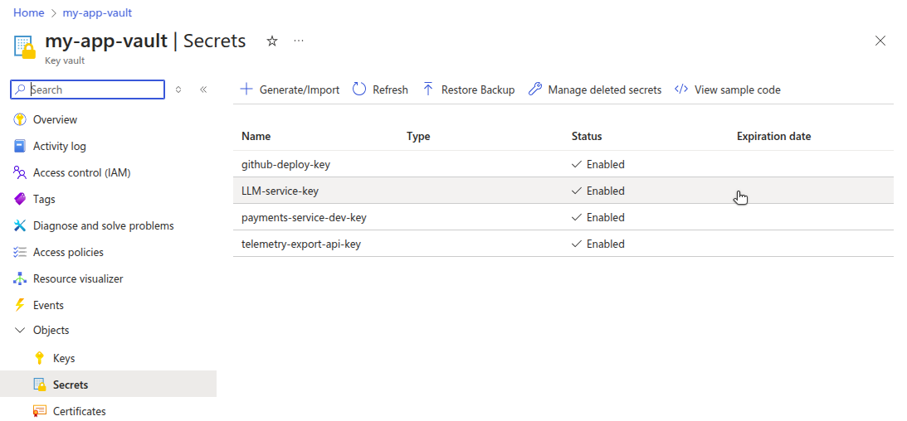
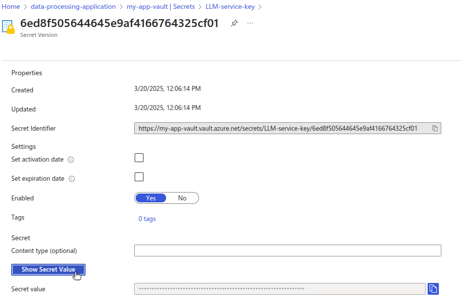

This guide walks through how to migrate secrets stored in Azure Key Vault to OpenBao running on Linode.

Azure Key Vault is a managed cloud service designed to secure secrets, keys, and certificates for application security and compliance in Microsoft Azure. It provides centralized control and access policies so that developers and security teams can safeguard sensitive information such as API keys or passwords.

[OpenBao](https://openbao.org/) is an open-source fork of [HashiCorp Vault](https://www.vaultproject.io/) designed to give organizations control over their cryptographic infrastructure. With OpenBao, organizations can deploy, configure, and manage keys and secrets in both cloud and on-premises environments without relying on vendor-managed services.

For organizations needing customization, OpenBao’s open-source model provides cost efficiency and flexibility beyond what’s achievable within a managed service like Azure Key Vault, while still offering a scalable and secure solution for secrets management.

## Deploy OpenBao on Linode

When migrating from Azure Key Vault to OpenBao on Linode, your requirements will dictate whether to install OpenBao on a single Linode Compute Instance or to pursue a larger scale, more fault tolerant environment with OpenBao on Kubernetes through the Linode Kubernetes Engine (LKE). Follow the appropriate guide based on your requirements:

-   [Deploying OpenBao on a Linode Compute Instance](https://docs.google.com/document/d/1x30v1xT_EDuRNnhE9jv5VkFqj9Lo4N3kNO6ICOoSrOM/edit?usp=sharing)
-   [Deploying OpenBao on Kubernetes with Linode LKE](https://docs.google.com/document/d/1gS6hQg09Ufr1Ku0v528acLESnyj1ZpXTxLhkLIlP-u8/edit?usp=sharing)
-   [Deploying OpenBao through the Linode Marketplace](https://www.linode.com/docs/marketplace-docs/guides/openbao/)

In addition to the prerequisites needed for either of the above deployment methods, you will also need access to your Microsoft Azure account with sufficient permissions to work with Azure Key Vault.

## Migrate from Azure Key Vault to OpenBao

When migrating from Azure Key Vault to OpenBao deployed on Linode, begin by determining your existing use cases for Azure Key Vault.

### Assess Current Secrets Management Requirements in Microsoft Azure

Review how your organization uses Azure Key Vault.

For example, you may have an application which uses third-party services—such as an LLM platform or a digital payments process—and you use API keys to authenticate requests to those services. Security best practices would dictate that you don’t hardcode API keys in application source code or images. Instead, the API key would be injected directly into the deployment at runtime. The application would be granted a role for accessing the API key in Azure Key Vault, which is provided for injection on-the-fly. This keeps the secret safe from being leaked via CI/CD processes or by being checked into a code repository.

### Review Existing Secrets

In the Azure Key Vault dashboard, review your existing secrets.



You can also use the Azure CLI (`az`) to manage the secrets in your key vault. After authenticating the CLI, [list the secrets in your vault](https://learn.microsoft.com/en-us/cli/azure/keyvault/secret?view=azure-cli-latest#az-keyvault-secret-list) by providing the name of your vault. For example:

```command
az keyvault secret list \
  --vault-name "my-app-vault" \
  --query "\[\].name"
```

```output
[
  "github-deploy-key",
  "LLM-service-key",
  "payments-service-dev-key",
  "telemetry-export-api-key"
]
```

To see the [value of a single secret](https://learn.microsoft.com/en-us/cli/azure/keyvault/secret?view=azure-cli-latest#az-keyvault-secret-show), run the following command, providing the names of the vault and the secret.

```command
az keyvault secret show \
  --vault-name "my-app-vault" \
  --name "LLM-service-key" \
  --query "value"
```

```output
"0z7NUSJ6gHKoWLkO5q2%Zq1E1do%m\&RSa47jljP4nMVs7qG\#n87Lai46niZUCrLP"
```

Ensure that you securely handle any exposed secrets, as they will no longer benefit from encryption by Azure Key Vault.

Alternatively, the value of a secret can be viewed in the Azure Key Vault UI by selecting the secret, selecting the latest version, and clicking **Show Secret Value**.



Azure uses IAM with role based access control (RBAC) to manage access to a particular secret. For example, an Azure VM within your Resource Group might run the application workload which needs access to the LLM service API key stored within your vault. The VM would be assigned the [`Key Vault Secrets User role`](https://learn.microsoft.com/en-us/azure/key-vault/general/rbac-guide?tabs=azure-cli#azure-built-in-roles-for-key-vault-data-plane-operations), allowing it to read the contents of secrets in the vault.

To view access settings, navigate to **Access control (IAM)** within your vault, then click the **Role assignments** tab.


Replicating this setup using OpenBao involves the following steps:

1.  Create an OpenBao [application role (AppRole)](https://openbao.org/docs/auth/approle/) that will take the place of the Azure IAM role.
1.  Store the LLM service API key in the OpenBao [key/value (KV) store](https://openbao.org/docs/secrets/kv/).
1.  Verify successful secret access with the API token associated with the AppRole.
1.  Assign the AppRole to the applications that need access to the secret.

### Authenticate the CLI

First, ensure that the OpenBao server is running.


This guide assumes that the `BAO_ADDR` environment variable has been set. If you are working directly on a Linode, then an example value may be `http://0.0.0.0:8200`. If you are using LKE and have set up port forwarding from your cluster to a port on your local machine, then an example value may be `http://127.0.0.1:8200`.


Retrieve the initial root token you were given when OpenBao was initialized. Authenticate the CLI with `bao login`, providing your root token. For example:

```command
bao login --method=token s.36Yb3ijEOJbifprhdEiFtPhR
```

```output
WARNING! The BAO_TOKEN environment variable is set! The value of this variable will take precedence; if this is unwanted please unset BAO_TOKEN or update its value accordingly.

Success! You are now authenticated. The token information displayed below is already stored in the token helper. You do NOT need to run "bao login" again. Future OpenBao requests will automatically use this token.

Key                  Value
---                  -----
token                s.36Yb3ijEOJbifprhdEiFtPhR
token_accessor       ykmfH8QV7E1OU86bth3GMCdf
token_duration       ∞
token_renewable      false
token_policies       ["root"]
identity_policies    []
policies             ["root"]
```

### Unseal the OpenBao Vault

OpenBao uses a [*sealing* and *unsealing* mechanism](https://openbao.org/docs/concepts/seal/) to protect its stored data, ensuring that sensitive information remains encrypted and inaccessible while the data is sealed. When OpenBao starts, it is initially sealed by a distributed key. Authorized users or automation systems must then unseal OpenBao by providing a quorum of key shares, which reassembles the master key and allows access to stored secrets. This architecture ensures that even if the server is compromised, the sensitive data remains protected unless the unseal keys are presented.

Before continuing, unseal the OpenBao vault.

### Create a Policy and AppRole

Creating and using an OpenBao AppRole involves a few steps:

1.  [Enable the AppRole authentication method](https://openbao.org/docs/auth/approle/#via-the-api-1).
1.  [Create a policy](https://openbao.org/docs/concepts/policies/).
1.  Create an AppRole, attaching the newly created policy.
1.  Generate a [secret ID](https://developer.hashicorp.com/vault/docs/concepts/policies#policy-syntax) for the AppRole.
1.  Generate an API token for the AppRole.

Enable the AppRole authentication method with the following CLI command:

```command
bao auth enable approle
```

```output
Success! Enabled approle auth method at: approle/
```

In `/etc/openbao`, create a new policy file for reading the secret. For example, a new file called `api-keys-secrets-policy.hcl` would have the following contents:

```file {title="api-keys-secrets-policy.hcl"}
path "api-keys/*" {
  capabilities = ["read"]
}
```

This policy grants read permissions to any secrets within the `api-keys` secrets store path. Add the policy to OpenBao with the following command:

```command
bao policy write \
    api-keys-secrets-policy \
    /etc/openbao/api-keys-secrets-policy.hcl
```

```output
Success! Uploaded policy: api-keys-secrets-policy
```

Create an AppRole for the application that will need to access this secret:

```command
bao write \
  auth/approle/role/api-key-reader-approle \
  token_policies=api-keys-secrets-policy
```

```output
Success! Data written to: auth/approle/role/api-key-reader-approle
```

Verify that the AppRole was written successfully:

```command
bao read auth/approle/role/api-key-reader-approle
```

```output
Key                        Value
---                        -----
bind_secret_id             true
local_secret_ids           false
secret_id_bound_cidrs      <nil>
secret_id_num_uses         0
secret_id_ttl              0s
token_bound_cidrs          []
token_explicit_max_ttl     0s
token_max_ttl              0s
token_no_default_policy    false
token_num_uses             0
token_period               0s
token_policies             [api-keys-secrets-policy]
token_strictly_bind_ip     false
token_ttl                  0s
token_type                 default
```

Fetch the AppRole ID with the following command:

```command
bao read auth/approle/role/api-key-reader-approle/role-id
```

```output
Key        Value
---        -----
role_id    e633701e-893e-460d-8012-ea2afedbcd87
```

Generate a secret ID for the role:

```command
bao write -f auth/approle/role/api-key-reader-approle/secret-id
```

```output
Key                   Value
---                   -----
secret_id             725d9076-5a5c-4921-98f7-7535c767386a
secret_id_accessor    b780e4d6-a2f2-4e03-8843-3e6a88b56f09
secret_id_num_uses    0
secret_id_ttl         0s
```

Generate an API token for the AppRole, supplying the AppRole ID and the secret ID from the previous commands.

```command
bao write auth/approle/login \
  role_id="e633701e-893e-460d-8012-ea2afedbcd87" \
  secret_id="725d9076-5a5c-4921-98f7-7535c767386a"
```

```output
Key                     Value
---                     -----
token                   s.TuQBY39kkpEDOqKcKYbWvpmZ
token_accessor          N1qSJiqOz6mXlpbmFVT2LOfS
token_duration          768h
token_renewable         true
token_policies          ["api-keys-secrets-policy" "default"]
identity_policies       []
policies                ["api-keys-secrets-policy" "default"]
token_meta_role_name    api-key-reader-approle
```

The AppRole token (`s.TuQBY39kkpEDOqKcKYbWvpmZ` in the previous example) can be used by a user, machine, or service—such as a web application—to authenticate OpenBao API calls, giving the caller authorization to read the LLM service API key secret.

### Store the Secret

Create the secret store that is defined in the policy. For this example, all secrets will be stored under the `api-keys` path. Run the following command:

```command
bao secrets enable --path=api-keys kv
```

```output
Success! Enabled the kv secrets engine at: api-keys/
```

The LLM service API key secret stored at Azure Key Vault was a simple string:

```
0z7NUSJ6gHKoWLkO5q2%Zq1E1do%m&RSa47jljP4nMVs7qG#n87Lai46niZUCrLP
```

To store this as a key-value pair in OpenBao underneath the `api-keys` path as a secret named `llm-service`, run the following command:

```command
bao kv put --mount=api-keys llm-service \
  "key"="0z7NUSJ6gHKoWLkO5q2%Zq1E1do%m&RSa47jljP4nMVs7qG#n87Lai46niZUCrLP"
```

```output
Success! Data written to: api-keys/llm-service
```

### Retrieve the Secret

To retrieve this secret with the OpenBao CLI, while still authenticated with the root token, run the following command:

```command
bao kv get --mount=api-keys llm-service
```

```output
====== Data ======
Key       Value
---       -----
key       0z7NUSJ6gHKoWLkO5q2%Zq1E1do%m&RSa47jljP4nMVs7qG#n87Lai46niZUCrLP
```

Test that the AppRole can retrieve the secret, using the AppRole token saved earlier:

```command
curl --header "X-Vault-Token: s.TuQBY39kkpEDOqKcKYbWvpmZ" \
     --request GET \
     $BAO_ADDR/v1/api-keys/llm-service \
     | jq
```

```output
{
  "request_id": "4ea9a66e-c63a-433c-b2e2-015c39c45086",
  "lease_id": "",
  "renewable": false,
  "lease_duration": 2764800,
  "data": {
    "key": "0z7NUSJ6gHKoWLkO5q2%Zq1E1do%m&RSa47jljP4nMVs7qG#n87Lai46niZUCrLP"
  },
  "wrap_info": null,
  "warnings": null,
  "auth": null
}
```

This API token can be used in applications and services to access the API key secret. According to the [documentation](https://openbao.org/api-docs/libraries/), “OpenBao intends to remain API compatible with HashiCorp Vault. This means that most of the existing libraries for Vault should also work with OpenBao.” Vault has [client libraries](https://developer.hashicorp.com/vault/api-docs/libraries) for various programming languages:

-   [Go](https://github.com/hashicorp/vault/tree/main/api)
-   [Ruby](https://github.com/hashicorp/vault-ruby)
-   [C#](https://github.com/rajanadar/VaultSharp)
-   [Java](https://developer.hashicorp.com/vault/api-docs/libraries#java)
-   [Kotlin](https://github.com/kunickiaj/vault-kotlin)
-   [Node.js](https://developer.hashicorp.com/vault/api-docs/libraries#node-js)
-   [PHP](https://developer.hashicorp.com/vault/api-docs/libraries#php)
-   [Python](https://github.com/hvac/hvac)

### Convert Existing Secrets from Azure Key Vault to OpenBao

The above steps outline how to migrate a single secret stored in Azure Key Vault to OpenBao on Linode, using RBAC for authorizing an application to read that secret with an API token. Migrating the remainder of your secrets stored in Azure Key Vault involves iterating on the following process:

1.  Retrieve the secret in Azure Key Vault.
1.  Determine which entities (users, machines, and services) need read or write access to that secret.
1.  Create a permissions policy and attach it to an AppRole in OpenBao.
1.  Generate an API token for the AppRole.
1.  Update any entity code or configurations to use the API token to access the secret in OpenBao.

## Production Considerations

When migrating from Azure Key Vault to OpenBao on Linode, it's important to ensure your deployment is secure, resilient, and optimized for performance. This section covers key security and high availability considerations to help you maintain a reliable and protected secrets management system.

### Security

For a production-grade OpenBao deployment, security should be a top priority. Protecting secrets from unauthorized access, ensuring secure communication, and enforcing strict access controls are essential to maintaining a secure environment.

-   **Access control policies**: Use OpenBao's [policy](https://openbao.org/docs/concepts/policies/) system to enforce RBAC. Define granular policies that grant only the necessary permissions, following the principle of least privilege.
-   **Audit logging**: Enable [detailed audit logs](https://openbao.org/docs/configuration/log-requests-level/) to track all access and modifications to secrets. OpenBao supports multiple logging backends, such as syslog and file-based logs, to help monitor suspicious activity.
-   **Secrets lifecycle management**: Implement automated secrets rotation, revocation, and expiration to ensure secrets do not become stale or overexposed. Consider using dynamic secrets where possible to generate time-limited credentials.
-   **Securing network communication**: Configure OpenBao to [use TLS for encrypting](https://openbao.org/docs/configuration/listener/tcp/#configuring-tls) all communications, ensuring data in transit remains secure. Regularly rotate TLS certificates to prevent expiration-related outages and reduce the risk of compromised certificates.

### High Availability

For production environments, OpenBao should be deployed with fault tolerance and scalability in mind. OpenBao’s [Autopilot mode](https://openbao.org/docs/concepts/integrated-storage/autopilot) for [high availability](https://openbao.org/docs/internals/high-availability/) ensures that if the active node fails, the cluster automatically elects a new leader, maintaining uptime without manual intervention. However, to enable seamless failover, organizations must configure their deployment correctly and proactively monitor system health.

-   **Raft storage backend**: Use OpenBao’s [integrated storage](https://openbao.org/docs/internals/integrated-storage/), based on the [Raft protocol](https://thesecretlivesofdata.com/raft/), to enable distributed data replication across multiple nodes. This ensures data consistency and fault tolerance while reducing reliance on external storage backends. Configure regular Raft snapshots for disaster recovery.
-   **Deploy multiple nodes**: OpenBao recommends at least five nodes for a [high-availability deployment](https://openbao.org/docs/concepts/ha/). The active node handles all requests, while standby nodes remain ready to take over in case of failure.
-   **Monitor leader status**: Use [bao operator raft list-peers](https://openbao.org/docs/commands/operator/raft/#list-peers) to check the cluster’s leader and node statuses. This command helps ensure that standby nodes are correctly registered and ready for failover.

The resources below are provided to help you become familiar with OpenBao when migrating from Azure Key Vault to Linode.

## Additional Resources

-   Microsoft Azure
    -   [Key Vault Documentation](https://learn.microsoft.com/en-us/azure/key-vault/)
    -   [`az` CLI Documentation](https://learn.microsoft.com/en-us/cli/azure/)
-   OpenBao
    -   [Configuration Documentation](https://openbao.org/docs/configuration/)
    -   High Availability
        -   [Architectural Internals](https://openbao.org/docs/internals/high-availability/)
        -   [Detailed Concepts](https://openbao.org/docs/concepts/ha/)
    -   [Integrated Storage](https://openbao.org/docs/concepts/integrated-storage/)
    -   [Vault client libraries](https://developer.hashicorp.com/vault/api-docs/libraries) (compatible with OpenBao) for multiple programming languages
-   Linode
    -   [Documentation](https://www.linode.com/docs/)
    -   [Linode Cloud Manager](https://cloud.linode.com/)
    -   [Deploying OpenBao on a Linode Compute Instance](https://docs.google.com/document/d/1x30v1xT_EDuRNnhE9jv5VkFqj9Lo4N3kNO6ICOoSrOM/edit?usp=sharing)
    -   [Deploying OpenBao on Kubernetes with Linode LKE](https://docs.google.com/document/d/1gS6hQg09Ufr1Ku0v528acLESnyj1ZpXTxLhkLIlP-u8/edit?usp=sharing)
    -   [Deploying OpenBao through the Linode Marketplace](https://www.linode.com/docs/marketplace-docs/guides/openbao/)