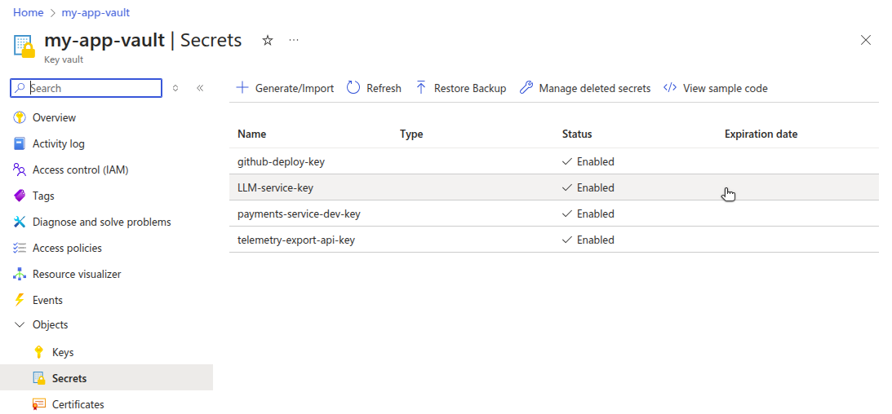
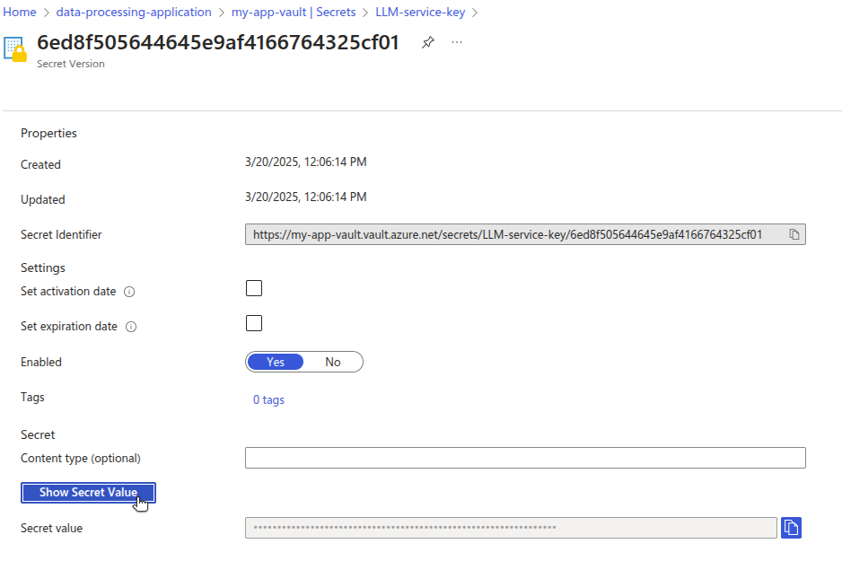
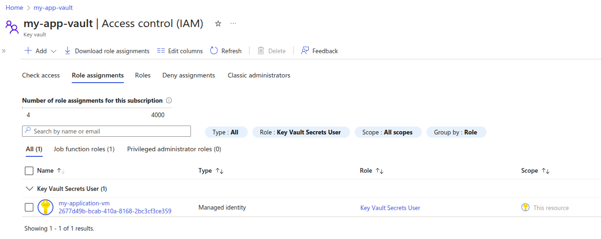

Azure Key Vault is a managed cloud service that secures secrets, keys, and certificates for application security and compliance in Microsoft Azure. It provides centralized control and access policies so that developers and security teams can safeguard sensitive information such as API keys or passwords.

[OpenBao](https://openbao.org/) is an open source fork of [HashiCorp Vault](https://www.vaultproject.io/) that gives teams full control over how secrets are stored, encrypted, and accessed. Unlike managed platforms, OpenBao can be self-hosted in any environment, including on-premises and across multiple clouds.

This guide walks through how to migrate secrets stored in Azure Key Vault to OpenBao running on Akamai Cloud.

## Before You Begin

1.  Follow our [Getting Started](https://techdocs.akamai.com/cloud-computing/docs/getting-started) guide to create an Akamai Cloud account if you do not already have one.

1.  Create a personal access token using the instructions in our [Manage personal access tokens](https://techdocs.akamai.com/cloud-computing/docs/manage-personal-access-tokens) guide.

1.  Install the Linode CLI using the instructions in the [Install and configure the CLI](https://techdocs.akamai.com/cloud-computing/docs/install-and-configure-the-cli) guide.

1.  Follow the steps in the *Install `kubectl`* section of the [Getting started with LKE](https://techdocs.akamai.com/cloud-computing/docs/getting-started-with-lke-linode-kubernetes-engine#install-kubectl) guide to install and configure `kubectl`.

1.  Ensure that you have access to your Azure account with sufficient permissions to work with Azure Key Vault. The [Azure CLI](https://learn.microsoft.com/en-us/cli/azure/install-azure-cli) must also be installed and configured.

1.  Install `jq`, a lightweight command line JSON processor.


This guide is written for a non-root user. Commands that require elevated privileges are prefixed with `sudo`. If you’re not familiar with the `sudo` command, see the [Users and Groups](/docs/guides/linux-users-and-groups/) guide.


Additionally, this guide contains a number of placeholders that are intended to be replaced by your own unique values. The table below lists these placeholders, what they represent, and the example values used in this guide:

| Placeholder                               | Represents                                            | Example Value                          |
|-------------------------------------------|-------------------------------------------------------|----------------------------------------|
| ``  | The name of the Azure Key Vault                       | `my-app-vault`                         |
| `` | Name of a secret stored in Azure Key Vault            | `LLM-service-key`                      |
| ``       | Filename of the `.hcl` policy definition              | `api-keys-secrets-policy.hcl`          |
| `` | Mount path in OpenBao KV store for organizing secrets | `api-keys`                             |
| ``       | Name of the OpenBao policy                            | `api-keys-secrets-policy`              |
| ``      | Name of the OpenBao AppRole                           | `api-key-reader-approle`               |
| ``        | AppRole ID for authenticating in OpenBao              | `e633701e-893e-460d-8012-ea2afedbcd87` |
| `` | Secret ID associated with the AppRole                 | `725d9076-5a5c-4921-98f7-7535c767386a` |
| ``     | API token retrieved from OpenBao using the AppRole    | `s.36Yb3ijEOJbifprhdEiFtPhR`           |
| ``       | Name of the secret to store in OpenBao                | `llm-service`                          |
| ``      | Value of the secret to store in OpenBao               | `0z7NUSJ6gHKoWLkO5q2%Zq1E1do%m&...`    |


All of the example values used in this guide are purely examples to mimic the format of actual secrets. These are *not* real credentials to any exisiting systems.


## Review Existing Secrets in Azure Key Vault

Before migrating to OpenBao, evaluate how your organization currently uses Azure Key Vault.

For example, an application that uses third-party services, such as an LLM platform or a digital payment processor, might retrieve API keys at runtime using a role assignment. This ensures the keys aren't hardcoded into application images or checked into source control.

OpenBao offers similar capabilities using role-based access, dynamic injection, and integration with Kubernetes.


Ensure that you securely handle any exposed secrets, as they no longer benefit from encryption by Azure Key Vault.


### Review Secrets Using the Azure Portal

1.  Navigate to your key vault and open the **Secrets** tab:

    

1.  Select a secret, choose the latest version, then click **Show Secret Value**:

    


Azure uses IAM with role based access control (RBAC) to manage which users and services can access secrets.

For example, an Azure VM within your Resource Group might need access to the LLM service API key stored within your vault. The VM would be assigned the [`Key Vault Secrets User` role](https://learn.microsoft.com/en-us/azure/key-vault/general/rbac-guide?tabs=azure-cli#azure-built-in-roles-for-key-vault-data-plane-operations), allowing it to read the contents of secrets in the vault.

To view role assignments in the Azure portal, navigate to your key vault, select **Access control (IAM)**, then open the **Role assignments** tab:




### Review Secrets Using the Azure CLI

You can also use the Azure CLI (`az`) to manage the secrets in your key vault.

1.  [List all the secrets in your vault](https://learn.microsoft.com/en-us/cli/azure/keyvault/secret?view=azure-cli-latest#az-keyvault-secret-list) by specifying the  (e.g. `my-app-vault`):

    ```command
    az keyvault secret list \
      --vault-name "" \
      --query "[].name"
    ```

    **For Example**:

    ```command
    az keyvault secret list \
      --vault-name "my-app-vault" \
      --query "\[\].name"
    ```

    ```output
    [
      "github-deploy-key",
      "LLM-service-key",
      "payments-service-dev-key",
      "telemetry-export-api-key"
    ]
    ```

1.  Retrieve the [value of a single secret](https://learn.microsoft.com/en-us/cli/azure/keyvault/secret?view=azure-cli-latest#az-keyvault-secret-show) by providing both the  and  (e.g. `LLM-service-key`).

    ```command
    az keyvault secret show \
      --vault-name "" \
      --name "" \
      --query "value"
    ```

    **For Example**:

    ```command
    az keyvault secret show \
      --vault-name "my-app-vault" \
      --name "LLM-service-key" \
      --query "value"
    ```

    ```output
    "0z7NUSJ6gHKoWLkO5q2%Zq1E1do%m&RSa47jljP4nMVs7qG#n87Lai46niZUCrLP"
    ```

## Deploy OpenBao on Akamai Cloud

When migrating from Azure Key Vault to OpenBao on Akamai Cloud, your deployment requirements determine whether to install OpenBao on a single Linode Instance or to deploy it in a fault-tolerant environment using the Linode Kubernetes Engine (LKE). Follow the appropriate guide below:

-   [Deploying OpenBao on a Linode Instance](https://docs.google.com/document/d/1x30v1xT_EDuRNnhE9jv5VkFqj9Lo4N3kNO6ICOoSrOM/edit?usp=sharing)
-   [Deploying OpenBao on Linode Kubernetes Engine](https://docs.google.com/document/d/1gS6hQg09Ufr1Ku0v528acLESnyj1ZpXTxLhkLIlP-u8/edit?usp=sharing)
-   [Deploying OpenBao through the Linode Marketplace](/docs/marketplace-docs/guides/openbao/)

Regardless of the method used, make sure that:

-   OpenBao is successfully initialized.
-   The vault is unsealed.
-   The `BAO_ADDR` environment variable is set.
-   You are authenticated using the root token.

### Create a Policy and AppRole

Use AppRoles to replicate Azure’s IAM-based access control in OpenBao. In Azure Key Vault, access is granted to users or services through role assignments, such as the *Key Vault Secrets User* role. In OpenBao, equivalent functionality is implemented using policies attached to AppRoles.

Follow these steps to create an OpenBao AppRole that mirrors the access control model used in Azure IAM.

#### Enable AppRole

1.  Enable the AppRole authentication method:

    ```command
    bao auth enable approle
    ```

    ```output
    Success! Enabled approle auth method at: approle/
    ```

#### Create a Policy

2.  Create a new `.hcl` [policy file](https://openbao.org/docs/concepts/policies/) in `/etc/openbao`, replacing  (e.g. `api-keys-secrets-policy.hcl`) with a policy filename of your choosing:

    ```command
    sudo nano /etc/openbao/
    ```

    **For Example**:

    ```command
    sudo nano /etc/openbao/api-keys-secrets-policy.hcl
    ```

1.  Give the file the following contents, replacing  (e.g. `api-keys`) with your chosen mount path:

    ```file {title="POLICY_FILE.hcl"}
    path "/*" {
      capabilities = ["read"]
    }
    ```

    **For Example**:

    ```file {title="api-keys-secrets-policy.hcl"}
    path "api-keys/*" {
      capabilities = ["read"]
    }
    ```

    This policy grants read access to any secrets within the specified mount path.

    When done, press <kbd>CTRL</kbd>+<kbd>X</kbd>, followed by <kbd>Y</kbd> then <kbd>Enter</kbd> to save the file and exit `nano`.

1.  Add the policy to OpenBao, replacing  (e.g. `api-keys-secrets-policy`) and :

    ```command
    bao policy write  /etc/openbao/
    ```

    **For Example**:

    ```command
    bao policy write api-keys-secrets-policy /etc/openbao/api-keys-secrets-policy.hcl
    ```

    ```output
    Success! Uploaded policy: api-keys-secrets-policy
    ```

#### Create an AppRole

5.  Create an AppRole for the application that needs access to the secret, replacing  (e.g. `api-key-reader-approle`) and :

    ```command
    bao write auth/approle/role/ token_policies=
    ```

    **For Example**:

    ```command
    bao write auth/approle/role/api-key-reader-approle token_policies=api-keys-secrets-policy
    ```

    ```output
    Success! Data written to: auth/approle/role/api-key-reader-approle
    ```

1.  Verify that the AppRole was written successfully, replacing :

    ```command
    bao read auth/approle/role/
    ```

    **For Example**:

    ```command
    bao read auth/approle/role/api-key-reader-approle
    ```

    ```output
    Key                        Value
    ---                        -----
    bind_secret_id             true
    local_secret_ids           false
    secret_id_bound_cidrs      <nil>
    secret_id_num_uses         0
    secret_id_ttl              0s
    token_bound_cidrs          []
    token_explicit_max_ttl     0s
    token_max_ttl              0s
    token_no_default_policy    false
    token_num_uses             0
    token_period               0s
    token_policies             [api-keys-secrets-policy]
    token_strictly_bind_ip     false
    token_ttl                  0s
    token_type                 default
    ```

1.  Fetch the AppRole ID, replacing :

    ```command
    bao read auth/approle/role//role-id
    ```

    **For Example**:

    ```command
    bao read auth/approle/role/api-key-reader-approle/role-id
    ```

    ```output
    Key        Value
    ---        -----
    role_id    e633701e-893e-460d-8012-ea2afedbcd87
    ```

#### Generate a Secret ID

8.  Generate a secret ID for the role, replacing :

    ```command
    bao write -f auth/approle/role//secret-id
    ```

    **For Example**:

    ```command
    bao write -f auth/approle/role/api-key-reader-approle/secret-id
    ```

    ```output
    Key                   Value
    ---                   -----
    secret_id             725d9076-5a5c-4921-98f7-7535c767386a
    secret_id_accessor    b780e4d6-a2f2-4e03-8843-3e6a88b56f09
    secret_id_num_uses    0
    secret_id_ttl         0s
    ```

#### Generate an API Token

9.  Generate an API token for the AppRole, supplying the  (e.g. `e633701e-893e-460d-8012-ea2afedbcd87`) and the  (e.g. `725d9076-5a5c-4921-98f7-7535c767386a`) from the previous commands:

    ```command
    bao write auth/approle/login \
      role_id="" \
      secret_id=""
    ```

    **For Example**:

    ```command
    bao write auth/approle/login \
      role_id=" e633701e-893e-460d-8012-ea2afedbcd87" \
      secret_id="725d9076-5a5c-4921-98f7-7535c767386a"
    ```

    ```output
    Key                     Value
    ---                     -----
    token                   s.TuQBY39kkpEDOqKcKYbWvpmZ
    token_accessor          N1qSJiqOz6mXlpbmFVT2LOfS
    token_duration          768h
    token_renewable         true
    token_policies          ["api-keys-secrets-policy" "default"]
    identity_policies       []
    policies                ["api-keys-secrets-policy" "default"]
    token_meta_role_name    api-key-reader-approle
    ```

    The resulting AppRole token (e.g. `s.TuQBY39kkpEDOqKcKYbWvpmZ`) can be used by a user, machine, or service, such a web application, to authenticate OpenBao API calls, giving the caller authorization to read the LLM service API key secret.

### Storing Secrets

Create the secret store defined in the policy created above.

1.  Enable the KV secrets engine, replacing :

    ```command
    bao secrets enable --path= kv
    ```

    **For Example**:

    ```command
    bao secrets enable --path=api-keys kv
    ```

    ```output
    Success! Enabled the kv secrets engine at: api-keys/
    ```

1.  Store your  (e.g. `0z7NUSJ6gHKoWLkO5q2%Zq1E1do%m&RSa47jljP4nMVs7qG#n87Lai46niZUCrLP`) in the  as a secret named  (e.g. `llm-service`):

    ```command
    bao kv put --mount=  \
      "key"=""
    ```

    **For Example**:

    ```command
    bao kv put --mount=api-keys llm-service \
      "key"="0z7NUSJ6gHKoWLkO5q2%Zq1E1do%m&RSa47jljP4nMVs7qG#n87Lai46niZUCrLP"
    ```

    ```output
    Success! Data written to: api-keys/llm-service
    ```

### Retrieving Secrets

1.  While authenticated with the root token, retrieve the secret using the OpenBao CLI, replacing  and :

    ```command
    bao kv get --mount= 
    ```

    **For Example**:

    ```command
    bao kv get --mount=api-keys llm-service
    ```

    ```output
    ====== Data ======
    Key       Value
    ---       -----
    key       0z7NUSJ6gHKoWLkO5q2%Zq1E1do%m&RSa47jljP4nMVs7qG#n87Lai46niZUCrLP
    ```

1.  Test access using the  (e.g. `s.36Yb3ijEOJbifprhdEiFtPhR`) saved earlier, your , and the :

    ```command
    curl --header "X-Vault-Token: " \
         --request GET \
         $BAO_ADDR/v1// \
         | jq
    ```

    **For Example**:

    ```command
    curl --header "X-Vault-Token: s.36Yb3ijEOJbifprhdEiFtPhR" \
         --request GET \
         $BAO_ADDR/v1/api-keys/llm-service \
         | jq
    ```

    ```output
    {
      "request_id": "4ea9a66e-c63a-433c-b2e2-015c39c45086",
      "lease_id": "",
      "renewable": false,
      "lease_duration": 2764800,
      "data": {
        "key": "0z7NUSJ6gHKoWLkO5q2%Zq1E1do%m&RSa47jljP4nMVs7qG#n87Lai46niZUCrLP"
      },
      "wrap_info": null,
      "warnings": null,
      "auth": null
    }
    ```

    The AppRole token can be used by applications or services to retrieve secrets through the OpenBao API.

    
    According to the [OpenBao API documentation](https://openbao.org/api-docs/libraries/), OpenBao is API-compatible with HashiCorp Vault. This means most Vault client libraries should also work with OpenBao, including:

    -   [Go](https://github.com/hashicorp/vault/tree/main/api)
    -   [Ruby](https://github.com/hashicorp/vault-ruby)
    -   [C#](https://github.com/rajanadar/VaultSharp)
    -   [Java](https://developer.hashicorp.com/vault/api-docs/libraries#java)
    -   [Kotlin](https://github.com/kunickiaj/vault-kotlin)
    -   [Node.js](https://developer.hashicorp.com/vault/api-docs/libraries#node-js)
    -   [PHP](https://developer.hashicorp.com/vault/api-docs/libraries#php)
    -   [Python](https://github.com/hvac/hvac)
    

## Production Considerations

When migrating from Azure Key Vault to OpenBao on Akamai Cloud, it's important to ensure your deployment is secure, resilient, and optimized for performance. This section covers key security and high availability considerations to help you maintain a reliable and protected secrets management system.

### Security

For a production-grade OpenBao deployment, security should be a top priority. Protecting secrets from unauthorized access, ensuring secure communication, and enforcing strict access controls are essential to maintaining a secure environment.

-   **Access Control Policies**: Use OpenBao's [policy](https://openbao.org/docs/concepts/policies/) system to enforce RBAC. Define granular policies that grant only the necessary permissions, following the principle of least privilege.
-   **Audit Logging**: Enable [detailed audit logs](https://openbao.org/docs/configuration/log-requests-level/) to track all access and modifications to secrets. OpenBao supports multiple logging backends, such as syslog and file-based logs, to help monitor suspicious activity.
-   **Secrets Lifecycle Management**: Implement automated secrets rotation, revocation, and expiration to ensure secrets do not become stale or overexposed. Consider using dynamic secrets where possible to generate time-limited credentials.
-   **Securing Network Communication**: Configure OpenBao to [use TLS to encrypt](https://openbao.org/docs/configuration/listener/tcp/#configuring-tls) all communications, ensuring data in transit remains secure. Regularly rotate TLS certificates to prevent expiration-related outages and reduce the risk of compromised certificates.

### High Availability

For production environments, OpenBao should be deployed with fault tolerance and scalability in mind. OpenBao’s [Autopilot mode](https://openbao.org/docs/concepts/integrated-storage/autopilot) for [high availability](https://openbao.org/docs/internals/high-availability/) ensures that if the active node fails, the cluster automatically elects a new leader, maintaining uptime without manual intervention. However, to enable seamless failover, organizations must configure their deployment correctly, and proactively monitor system health.

-   **Raft Storage Backend**: Use OpenBao’s [integrated storage](https://openbao.org/docs/internals/integrated-storage/), based on the [Raft protocol](https://thesecretlivesofdata.com/raft/), to enable distributed data replication across multiple nodes. This ensures data consistency and fault tolerance while reducing reliance on external storage backends. Configure regular Raft snapshots for disaster recovery.
-   **Deploy Multiple Nodes**: OpenBao recommends at least five nodes for a [high-availability deployment](https://openbao.org/docs/concepts/ha/). The active node handles all requests, while standby nodes remain ready to take over in case of failure.
-   **Monitor Leader Status**: Use [bao operator raft list-peers](https://openbao.org/docs/commands/operator/raft/#list-peers) to check the cluster’s leader and node statuses. This command helps ensure that standby nodes are correctly registered and ready for failover.