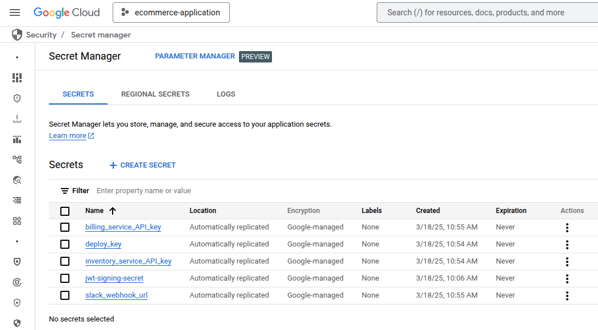
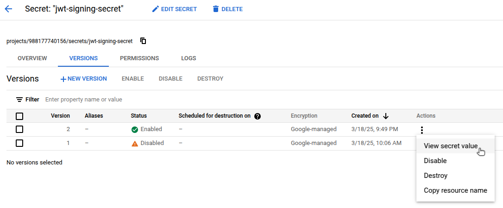

Google Cloud Platform (GCP) Secret Manager securely stores sensitive data like API keys, passwords, and certificates. It integrates with other GCP services and simplifies access control through Identity and Access Management (IAM).

[OpenBao](https://openbao.org/) is an open source fork of [HashiCorp Vault](https://www.vaultproject.io/). It gives teams full control over how secrets are stored, encrypted, and accessed. Unlike managed platforms, OpenBao can be self-hosted in any environment, including on-premises and across multiple clouds.

This guide explains how to migrate secrets from GCP Secret Manager to OpenBao running on Akamai Cloud.

## Before You Begin

1.  Follow our [Getting Started](https://techdocs.akamai.com/cloud-computing/docs/getting-started) guide to create an Akamai Cloud account if you do not already have one.

1.  When migrating from GCP Secret Manager to OpenBao on Akamai Cloud, your deployment requirements determine whether to install OpenBao on a single Linode Instance or to deploy it in a fault-tolerant environment using the Linode Kubernetes Engine (LKE). Follow the appropriate guide below:

    -   [Deploying OpenBao on a Linode Instance](https://docs.google.com/document/d/1x30v1xT_EDuRNnhE9jv5VkFqj9Lo4N3kNO6ICOoSrOM/edit?usp=sharing)
    -   [Deploying OpenBao on Linode Kubernetes Engine](https://docs.google.com/document/d/1gS6hQg09Ufr1Ku0v528acLESnyj1ZpXTxLhkLIlP-u8/edit?usp=sharing)
    -   [Deploying OpenBao through the Linode Marketplace](/docs/marketplace-docs/guides/openbao/)

1.  Ensure that you have access to your GCP account with sufficient permissions to work with GCP Secret Manager. The [gcloud CLI](https://cloud.google.com/sdk/docs/install) must also be installed and configured.

1.  Install `jq`, a lightweight command line JSON processor.


This guide is written for a non-root user. Commands that require elevated privileges are prefixed with `sudo`. If you’re not familiar with the `sudo` command, see the [Users and Groups](/docs/guides/linux-users-and-groups/) guide.


Additionally, this guide contains a number of placeholders that are intended to be replaced by your own unique values. The table below lists these placeholders, what they represent, and the example values used in this guide:

| Placeholder                             | Represents                                                 | Example Value                          |
|-----------------------------------------|------------------------------------------------------------|----------------------------------------|
|     | Google Cloud project ID.                                   | `ecommerce-application-454116`         |
|    | Name of a secret stored in GCP Secret Manager.             | `jwt-signing-secret`                   |
|        | Name of the local file where the OpenBao policy is stored. | `jwt-secrets-policy.hcl`               |
|  | Mount path for KV engine in OpenBao.                       | `jwt`                                  |
|        | OpenBao policy name.                                       | `jwt-secrets-policy`                   |
|       | Name of the AppRole in OpenBao.                            | `app-authenticator-approle`            |
|         | ID of the AppRole generated by OpenBao.                    | `019e2cc5-b8ce-4aa4-91b9-c2c9e9e59863` |
|  | Secret ID created for the AppRole.                         | `cef786fb-1d1c-4c52-9466-aea47b3c8d3a` |
|         | Key of the secret to store in OpenBao                      | `secret`                               |
|       | The actual secret value to be stored in OpenBao.           | `EU&&7O^#c2GAMIdRyJlZkPEdoWKgy%CW`     |
|        | The name of the secret in OpenBao.                         | `signer`                               |
|      | Token generated from AppRole login.                        | `s.dy572yUtTNvHTZgIoxdNVO41`           |


All of the example values used in this guide are purely examples to mimic the format of actual secrets. These are *not* real credentials to any existing systems.


## Review Existing Secrets in GCP Secret Manager

Before migrating to OpenBao, evaluate how your organization currently uses GCP Secret Manager.

For example, a web application might verify the signature of a JSON Web Token (JWT) using a secret key stored in GCP Secret Manager. Instead of embedding the secret in source code or container images, the application is granted a role that allows it to retrieve the secret at runtime. This protects the secret from being exposed through version control or CI/CD pipelines.

OpenBao supports similar access workflows using dynamic injection, AppRole-based access control, and tight integration with Kubernetes workloads.


Ensure that you securely handle any exported secrets, as they no longer benefit from encryption by GCP Secret Manager.


### Review Secrets Using the GCP Console

1.  Navigate to **Security > Secret Manager** to list secrets:

    

1.  Select a secret, open the latest version, and click **Actions > View secret value**:

    

### Review Secrets Using the `gcloud` CLI

You can also use the `gcloud` CLI to authenticate and inspect the secrets stored in GCP Secret Manager.

1.  Authenticate with the CLI:

    ```command
    gcloud auth login
    ```

1.  Set the active project, replacing  (e.g. `ecommerce-application-454116`) with your actual project ID:

    ```command
    gcloud config set project 
    ```

    **For Example**:

    ```command
    gcloud config set project ecommerce-application-454116
    ```

1.  [List](https://cloud.google.com/sdk/gcloud/reference/secrets/list) all secrets:

    ```command
    gcloud secrets list
    ```

    ```output
    NAME                       CREATED              REPLICATION_POLICY  LOCATIONS
    billing_service_API_key    2025-03-01T12:25:36  automatic           -
    deploy_key                 2025-02-28T04:04:58  automatic           -
    inventory_service_API_key  2024-11-15T16:35:35  automatic           -
    jwt-signing-secret         2025-03-08T12:01:30  automatic           -
    slack_webhook_url          2024-11-19T21:19:15  automatic           -
    ```

1.  Retrieve the [latest version](https://cloud.google.com/sdk/gcloud/reference/secrets/versions/access) of a secret, replacing  (e.g. `jwt-signing-secret`) with an actual secret name:

    ```command
    gcloud secrets versions access latest --secret=
    ```

    **For Example**:

    ```command
    gcloud secrets versions access latest --secret=jwt-signing-secret
    ```

    ```output
    EU&&7O^#c2GAMIdRyJlZkPEdoWKgy%CW
    ```

## Access Your OpenBao Deployment on Akamai Cloud

The remainder of this guide focuses on migrating secrets *into* your OpenBao deployment on Akamai Cloud. You should already have a running OpenBao instance on either a standalone Linode instance, in an LKE cluster, or deployed via the Linode Marketplace.

If your OpenBao environment is not yet ready, refer to the appropriate deployment guide listed in the [Before You Begin](#before-you-begin) section and complete the setup.

Once deployed, log in to your OpenBao environment. Before continuing, verify that:

-   OpenBao is successfully initialized.
-   The vault is unsealed.
-   The `BAO_ADDR` environment variable is set.
-   You are authenticated using the root token.

### Create a Policy and AppRole

To replicate GCP IAM-style access control, OpenBao provides AppRoles. For example, in GCP, a service might be granted a role like `JWTSigner` to retrieve a secret. In OpenBao, this same functionality is implemented using a policy-bound AppRole.

Follow these steps to create an OpenBao AppRole that mimics the role-based access used in GCP IAM.

#### Enable AppRole

1.  Enable the AppRole authentication method:

    ```command
    bao auth enable approle
    ```

    ```output
    Success! Enabled approle auth method at: approle/
    ```

#### Create a Policy

2.  Create a new `.hcl` [policy file](https://openbao.org/docs/concepts/policies/) in `/etc/openbao`, replacing  (e.g. `jwt-secrets-policy.hcl`) with a policy filename of your choosing:

    ```command
    sudo nano /etc/openbao/
    ```

    **For Example**:

    ```command
    sudo nano /etc/openbao/jwt-secrets-policy.hcl
    ```

1.  Give the file the following contents, replacing  (e.g. `jwt`) with your chosen mount path:

    ```file {title="POLICY_FILE.hcl"}
    path "/*" {
      capabilities = ["read"]
    }
    ```

    **For Example**:

    ```file {title="jwt-secrets-policy.hcl"}
    path "jwt/*" {
      capabilities = ["read"]
    }
    ```

    This policy grants read access to any secrets within the specified mount path.

    When done, press <kbd>CTRL</kbd>+<kbd>X</kbd>, followed by <kbd>Y</kbd> then <kbd>Enter</kbd> to save the file and exit `nano`.

1.  Add the policy to OpenBao, replacing  (e.g. `jwt-secrets-policy`) and :

    ```command
    bao policy write  /etc/openbao/
    ```

    **For Example**:

    ```command
    bao policy write jwt-secrets-policy /etc/openbao/jwt-secrets-policy.hcl
    ```

    ```output
    Success! Uploaded policy: jwt-secrets-policy
    ```

#### Create an AppRole

5.  Create an AppRole for the application that needs access to the secret, replacing  (e.g. `app-authenticator-approle`) and :

    ```command
    bao write \
      auth/approle/role/ \
      token_policies=
    ```

    **For Example**:

    ```command
    bao write \
      auth/approle/role/app-authenticator-approle \
      token_policies=jwt-secrets-policy
    ```

    ```output
    Success! Data written to: auth/approle/role/app-authenticator-approle
    ```

1.  Verify that the AppRole was written successfully, replacing :

    ```command
    bao read auth/approle/role/
    ```

    **For Example**:

    ```command
    bao read auth/approle/role/app-authenticator-approle
    ```

    ```output
    Key                        Value
    ---                        -----
    bind_secret_id             true
    local_secret_ids           false
    secret_id_bound_cidrs      <nil>
    secret_id_num_uses         0
    secret_id_ttl              0s
    token_bound_cidrs          []
    token_explicit_max_ttl     0s
    token_max_ttl              0s
    token_no_default_policy    false
    token_num_uses             0
    token_period               0s
    token_policies             [jwt-secrets-policy]
    token_strictly_bind_ip     false
    token_ttl                  0s
    token_type                 default
    ```

1.  Fetch the AppRole ID, replacing :

    ```command
    bao read auth/approle/role//role-id
    ```

    ```output
    Key        Value
    ---        -----
    role_id    019e2cc5-b8ce-4aa4-91b9-c2c9e9e59863
    ```

#### Generate a Secret ID

8.  Generate a secret ID for the role, replacing :

    ```command
    bao write -f auth/approle/role//secret-id
    ```

    **For Example**:

    ```command
    bao write -f auth/approle/role/app-authenticator-approle/secret-id
    ```

    ```output
    Key                   Value
    ---                   -----
    secret_id             cef786fb-1d1c-4c52-9466-aea47b3c8d3a
    secret_id_accessor    373500ba-6922-4f91-b7f3-ec25f8253d1d
    secret_id_num_uses    0
    secret_id_ttl         0s
    ```

#### Generate an API Token

9.  Generate an API token for the AppRole, supplying the  (e.g. `019e2cc5-b8ce-4aa4-91b9-c2c9e9e59863`) and  (e.g. `cef786fb-1d1c-4c52-9466-aea47b3c8d3a`) from the previous commands:

    ```command
    bao write auth/approle/login \
      role_id="" \
      secret_id=""
    ```

    **For Example**:

    ```command
    bao write auth/approle/login \
      role_id="019e2cc5-b8ce-4aa4-91b9-c2c9e9e59863" \
      secret_id="cef786fb-1d1c-4c52-9466-aea47b3c8d3a"
    ```

    ```output
    Key                     Value
    ---                     -----
    token                   s.dy572yUtTNvHTZgIoxdNVO41
    token_accessor          zT1TP281vORYSjysBiuMydht
    token_duration          768h
    token_renewable         true
    token_policies          ["jwt-secrets-policy" "default"]
    identity_policies       []
    policies                ["jwt-secrets-policy" "default"]
    token_meta_role_name    app-authenticator-approle
    ```

    The resulting AppRole token (e.g. `s.dy572yUtTNvHTZgIoxdNVO41`) can be used by a user, machine, or service (e.g. the authentication API for a web application) to authenticate OpenBao API calls and read the JWT signing secret.

### Storing Secrets

Create the secret store defined in the policy created above.

1.  Enable the KV secrets engine, replacing :

    ```command
    bao secrets enable --path= kv
    ```

    **For Example**:

    ```command
    bao secrets enable --path=jwt kv
    ```

    ```output
    Success! Enabled the kv secrets engine at: jwt/
    ```

1.  The GCP example secret contains a single sensitive value. Store this value in the  using a  (e.g. `secret`) and assign it a  (e.g. `signer`):

    ```command
    bao kv put --mount=  \
      ""=""
    ```

    **For Example**:

    ```command
    bao kv put --mount=jwt signer \
      "secret"="EU&&7O^#c2GAMIdRyJlZkPEdoWKgy%CW"
    ```

    ```output
    Success! Data written to: jwt/signer
    ```

### Retrieving Secrets

1.  While authenticated with the root token, retrieve the secret using the OpenBao CLI, replacing  and :

    ```command
    bao kv get --mount= 
    ```

    **For Example**:

    ```command
    bao kv get --mount=jwt signer
    ```

    ```output
    ====== Data ======
    Key         Value
    ---         -----
    secret      EU&&7O^#c2GAMIdRyJlZkPEdoWKgy%CW
    ```

1.  Test access using the  (e.g. `s.dy572yUtTNvHTZgIoxdNVO41`) saved earlier, your , and the :

    ```command
    curl --header "X-Vault-Token: " \
         --request GET \
         $BAO_ADDR/v1// \
         | jq
    ```

    **For Example**:

    ```command
    curl --header "X-Vault-Token: s.dy572yUtTNvHTZgIoxdNVO41" \
         --request GET \
         $BAO_ADDR/v1/jwt/signer \
         | jq
    ```

    ```output
    {
      "request_id": "0e70b929-06b6-4685-b787-dc1ce6c31b9b",
      "lease_id": "",
      "renewable": false,
      "lease_duration": 2764800,
      "data": {
        "secret": "EU&&7O^#c2GAMIdRyJlZkPEdoWKgy%CW"
      },
      "wrap_info": null,
      "warnings": null,
      "auth": null
    }
    ```

    The AppRole token can be used by applications or services to retrieve secrets through the OpenBao API.

    
    According to the [OpenBao API documentation](https://openbao.org/api-docs/libraries/), OpenBao is API-compatible with HashiCorp Vault. This means most Vault client libraries should also work with OpenBao, including:

    -   [Go](https://github.com/hashicorp/vault/tree/main/api)
    -   [Ruby](https://github.com/hashicorp/vault-ruby)
    -   [C#](https://github.com/rajanadar/VaultSharp)
    -   [Java](https://developer.hashicorp.com/vault/api-docs/libraries#java)
    -   [Kotlin](https://github.com/kunickiaj/vault-kotlin)
    -   [Node.js](https://developer.hashicorp.com/vault/api-docs/libraries#node-js)
    -   [PHP](https://developer.hashicorp.com/vault/api-docs/libraries#php)
    -   [Python](https://github.com/hvac/hvac)
    

## Production Considerations

When migrating from GCP Secret Manager to OpenBao on Akamai Cloud, it's important to ensure your deployment is secure, resilient, and optimized for performance. This section covers key security and high availability considerations to help you maintain a reliable and protected secrets management system.

### Security

Security should be a top priority for a production-grade OpenBao deployment. Protecting secrets from unauthorized access, ensuring secure communication, and enforcing strict access controls are essential to maintaining a secure environment.

-   **Access Control Policies**: Use OpenBao's [policy](https://openbao.org/docs/concepts/policies/) system to enforce RBAC. Define granular policies that only grant the necessary permissions, following the principle of least privilege.
-   **Audit Logging**: Enable [detailed audit logs](https://openbao.org/docs/configuration/log-requests-level/) to track all access and modifications to secrets. OpenBao supports multiple logging backends, such as `syslog` and file-based logs, to help monitor suspicious activity.
-   **Secrets Lifecycle Management**: Implement automated secrets rotation, revocation, and expiration to ensure secrets do not become stale or overexposed. Consider using dynamic secrets where possible to generate time-limited credentials.
-   **Securing Network Communication**: [Configure OpenBao to use TLS](https://openbao.org/docs/configuration/listener/tcp/#configuring-tls) to encrypt all communications, ensuring data in transit remains secure. Regularly rotate TLS certificates to prevent expiration-related outages and reduce the risk of compromised certificates.

### High Availability

Production-grade OpenBao environments should be deployed with fault tolerance and scalability in mind. OpenBao’s [Autopilot mode](https://openbao.org/docs/concepts/integrated-storage/autopilot) for [high availability](https://openbao.org/docs/internals/high-availability/) ensures that if the active node fails, the cluster automatically elects a new leader, maintaining uptime without manual intervention. However, to enable seamless failover, organizations must configure their deployment correctly, and proactively monitor system health.

-   **Raft Storage Backend**: Use OpenBao’s [integrated storage](https://openbao.org/docs/internals/integrated-storage/), based on the [Raft protocol](https://thesecretlivesofdata.com/raft/), to enable distributed data replication across multiple nodes. This ensures data consistency and fault tolerance while reducing reliance on external storage backends. Configure regular Raft snapshots for disaster recovery.
-   **Deploy Multiple Nodes**: OpenBao recommends at least five nodes for a [high-availability deployment](https://openbao.org/docs/concepts/ha/). The active node handles all requests, while standby nodes remain ready to take over in case of failure.
-   **Monitor Leader Status**: Use [bao operator raft list-peers](https://openbao.org/docs/commands/operator/raft/#list-peers) to check the cluster’s leader and node statuses. This command helps ensure that standby nodes are correctly registered and ready for failover.