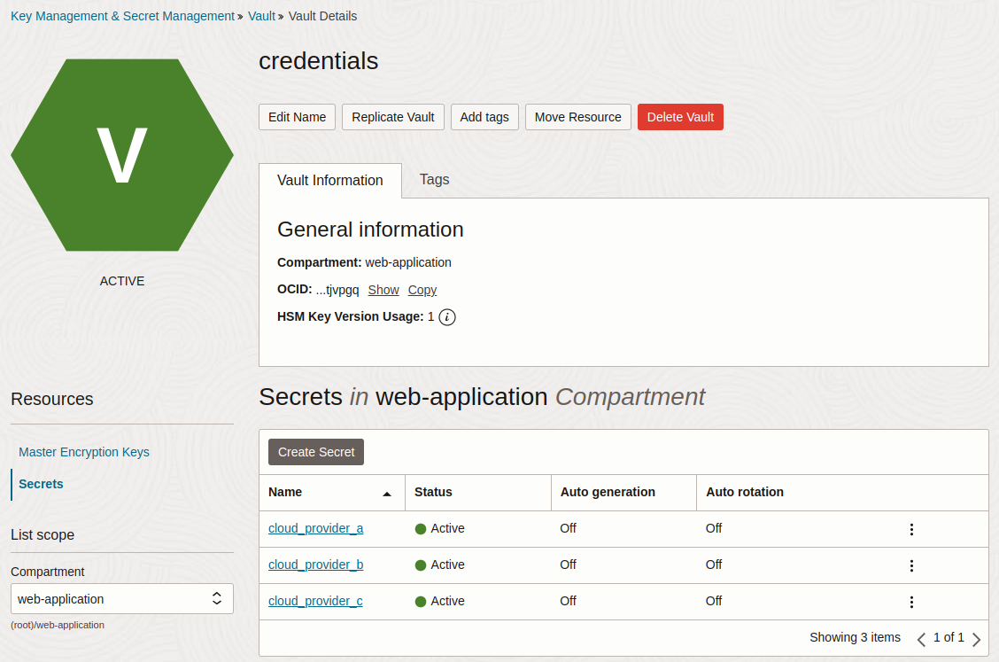
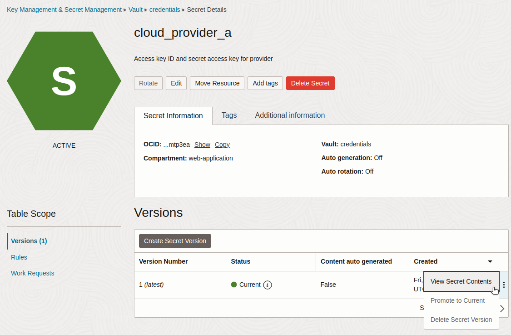

This guide walks through how to migrate secrets from Oracle Vault to OpenBao running on Linode.

Oracle Vault is a part of Oracle Cloud Infrastructure (OCI). It provides a secure, managed solution for storing and controlling access to sensitive information—such as API keys, passwords, and encryption keys. Oracle Vault is designed to integrate with other Oracle services, supporting features for key management, secret storage, and cryptographic functions.

[OpenBao](https://openbao.org/) is an open-source fork of [HashiCorp Vault](https://www.vaultproject.io/) designed to give organizations control over their cryptographic infrastructure. With OpenBao, organizations can deploy, configure, and manage keys and secrets in both cloud and on-premises environments without relying on vendor-managed services.

Oracle Vault may be used by organizations deeply embedded in Oracle’s ecosystem, prioritizing managed services and compliance within OCI. For organizations needing more flexibility or multi-cloud compatibility, OpenBao’s open-source model helps avoid vendor lock-in, offering community-driven support and cost-effectiveness.

## Deploy OpenBao on Linode

When migrating from Oracle Vault to OpenBao on Linode, your requirements will dictate whether to install OpenBao on a single Linode Compute Instance or to pursue a larger scale, more fault tolerant environment with OpenBao on Kubernetes through the Linode Kubernetes Engine (LKE). Follow the appropriate guide based on your requirements:

-   [Deploying OpenBao on a Linode Compute Instance](https://docs.google.com/document/d/1x30v1xT_EDuRNnhE9jv5VkFqj9Lo4N3kNO6ICOoSrOM/edit?usp=sharing)
-   [Deploying OpenBao on Kubernetes with Linode LKE](https://docs.google.com/document/d/1gS6hQg09Ufr1Ku0v528acLESnyj1ZpXTxLhkLIlP-u8/edit?usp=sharing)
-   [Deploying OpenBao through the Linode Marketplace](/docs/marketplace-docs/guides/openbao/)

In addition to the prerequisites needed for either of the above deployment methods, you will also need access to your Oracle Cloud account with sufficient permissions to work with Oracle Vault.

## Migrate from Oracle Vault to OpenBao

When migrating from Oracle Vault to OpenBao deployed on Linode, begin by determining your existing use cases for Oracle Vault.

### Assess Current Secrets Management Requirements in Oracle Cloud

Review how your organization uses Oracle Vault.

For example, you may have an application that uses services from multiple cloud providers, and that application needs access keys to authenticate with those provider services. Security best practices would dictate that you don’t hardcode these sensitive credentials in application source code or images. Instead, the credentials would be injected directly into the deployment at runtime. The application would be granted a role for accessing the credentials in Oracle Vault, which is provided for injection on-the-fly. This keeps the secret safe from being leaked via CI/CD processes or by being checked into a code repository.

### Review Existing Secrets

In the Oracle Vault, find the vault you want to migrate, and review its existing secrets:



You can also use the Oracle Cloud CLI (`oci`) to manage the secrets in your Oracle Vault. First, you will need the ID of the compartment to which the vault belongs. For example, the `credentials` vault in the image above belongs to the `web-application` compartment.

After authenticating the CLI, find the compartment ID with the following command:

```command
oci iam compartment list --query 'data[]["name","id"]'
```

```output
[
  [
    "web-application", "ocid1.compartment.oc1..aaaaaaaawrrlh7hw6b4tnsbxevyoywscike5ygn4ut5n734mjsclijgpjjgq"
  ]
]
```

Find the ID of the compartment with your vault. To [list the secrets in your vaults](https://docs.oracle.com/en-us/iaas/tools/oci-cli/3.53.0/oci_cli_docs/cmdref/vault/secret/list.html), run the following command, using the compartment ID:

```command
oci vault secret list \
  --compartment-id \
ocid1.compartment.oc1..aaaaaaaawrrlh7hw6b4tnsbxevyoywscike5ygn4ut5n734mjsclijgpjjgq \
  --query 'data[].["secret-name","description","id"]'
```

```output
[
  [
    "cloud_provider_a",
    "Access key ID and secret access key for provider",
"ocid1.vaultsecret.oc1.phx.amaaaaaaogvqnkqaepiqln7ztj43ugit75w3wl7kyzldk3rbqkfd2zmtp3ea"
  ],
  [
    "cloud_provider_b",
    "Project ID and project API KEY",
"ocid1.vaultsecret.oc1.phx.amaaaaaaogvqnkqacnhdzfprgd4f4ml7rpkjqmqlyz7p5kjjfinvyn57qdoa"
  ],
  [
    "cloud_provider_c",
    "Client ID and client secret",
"ocid1.vaultsecret.oc1.phx.amaaaaaaogvqnkqavn32ibazaqinya5bv3eyc4ndfvebcnksnqk4vl74xqqa"
  ]
]
```

To retrieve the [value of a secret](https://docs.oracle.com/en-us/iaas/tools/oci-cli/3.53.0/oci_cli_docs/cmdref/secrets/secret-bundle/get.html), run the following command, providing the secret ID:

```command
oci secrets secret-bundle get \
  --secret-id ocid1.vaultsecret.oc1.phx.amaaaaaaogvqnkqaepiqln7ztj43ugit75w3wl7kyzldk3rbqkfd2zmtp3ea \
  --stage CURRENT \
  --query 'data."secret-bundle-content"'
```

```output
{
  "content":
"eyAiYWNjZXNzX2tleV9pZCIgOiAiQUtJQTUxM0oyRERSQVhDRktYRjUiLCAic2VjcmV0X2FjY2Vzc19rZXkiIDoiWGRxRDBCUGE4YUxGYU4rRUk4U0FZbTlVNFpZZVhRZE1HQUlqS0QveCIgfQ==",
  "content-type": "BASE64"
}
```

If the secret bundle `content` is of type `BASE64`, then decode it to retrieve the value of the secret. For example:

```command
echo eyAiYWNjZXNzX2tleV9pZCIgOiAiQUtJQTUxM0oyRERSQVhDRktYRjUiLCAic2VjcmV0X2FjY2Vzc19rZXkiIDoiWGRxRDBCUGE4YUxGYU4rRUk4U0FZbTlVNFpZZVhRZE1HQUlqS0QveCIgfQ== \
  | base64 --decode
```

```output
{ "access_key_id": "AKIA513J2DDRAXCFKXF5", "secret_access_key": "XdqD0BPa8aLFaN+EI8SAYm9U4ZYeXQdMGAIjKD/x" }
```

To combine secret retrieval with base64 decoding into a single step, run the following command:

```command
oci secrets secret-bundle get \
  --secret-id ocid1.vaultsecret.oc1.phx.amaaaaaaogvqnkqaepiqln7ztj43ugit75w3wl7kyzldk3rbqkfd2zmtp3ea \
  --stage CURRENT \
  --query 'data."secret-bundle-content".content' \
  --raw-output \
  | base64 --decode
```

```output
{ "access_key_id": "AKIA513J2DDRAXCFKXF5", "secret_access_key": "XdqD0BPa8aLFaN+EI8SAYm9U4ZYeXQdMGAIjKD/x" }
```

Ensure that you securely handle any exposed secrets, as they will no longer benefit from encryption by Oracle Vault.

Alternatively, the value of a secret can be viewed in the Oracle Vault UI by selecting the secret, selecting the latest version, and clicking **View Secret Contents**.



Oracle Vault doesn’t use the concept of *roles* in a granular way, but it does use identity and access management (IAM) policies to control access. To adopt a permissions approach that uses RBAC in OpenBao, take the following steps:

1.  Create an OpenBao [application role (AppRole)](https://openbao.org/docs/auth/approle/), attaching a policy that allows access to these cloud provider credential secrets.
1.  Store the credential secrets in the OpenBao [key/value (KV) store](https://openbao.org/docs/secrets/kv/).
1.  Verify successful secret access with the API token associated with the AppRole.
1.  Assign the AppRole to the applications that need access to these secrets.

### Authenticate the CLI

First, ensure that the OpenBao server is running.


This guide assumes that the `BAO_ADDR` environment variable has been set. If you are working directly on a Linode, then an example value may be `http://0.0.0.0:8200`. If you are using LKE and have set up port forwarding from your cluster to a port on your local machine, then an example value may be `http://127.0.0.1:8200`.


Retrieve the initial root token you were given when OpenBao was initialized. Authenticate the CLI with bao login, providing your root token. For example:

```command
bao login --method=token s.36Yb3ijEOJbifprhdEiFtPhR
```

```output
WARNING! The BAO_TOKEN environment variable is set! The value of this variable will take precedence; if this is unwanted please unset BAO_TOKEN or update its value accordingly.

Success! You are now authenticated. The token information displayed below is already stored in the token helper. You do NOT need to run "bao login" again. Future OpenBao requests will automatically use this token.

Key                  Value
---                  -----
token                s.36Yb3ijEOJbifprhdEiFtPhR
token_accessor       ykmfH8QV7E1OU86bth3GMCdf
token_duration       ∞
token_renewable      false
token_policies       ["root"]
identity_policies    []
policies             ["root"]
```

### Unseal the OpenBao Vault

OpenBao uses a [*sealing* and *unsealing* mechanism](https://openbao.org/docs/concepts/seal/) to protect its stored data, ensuring that sensitive information remains encrypted and inaccessible while the data is sealed. When OpenBao starts, it is initially sealed by a distributed key. Authorized users or automation systems must then unseal OpenBao by providing a quorum of key shares, which reassembles the master key and allows access to stored secrets. This architecture ensures that even if the server is compromised, the sensitive data remains protected unless the unseal keys are presented.

Before continuing, unseal the OpenBao vault.

### Create a Policy and AppRole

Creating and using an OpenBao AppRole involves a few steps:

1.  [Enable the AppRole authentication method](https://openbao.org/docs/auth/approle/#via-the-api-1).
1.  [Create a policy](https://openbao.org/docs/concepts/policies/).
1.  Create an AppRole, attaching the newly created policy.
1.  Generate a [secret ID](https://developer.hashicorp.com/vault/docs/concepts/policies#policy-syntax) for the AppRole.
1.  Generate an API token for the AppRole.

Enable the AppRole authentication method with the following CLI command:

```command
bao auth enable approle
```

```output
Success! Enabled approle auth method at: approle/
```

In `/etc/openbao`, create a new policy file for reading the secret. For example, a new file called `cloud-credentials-policy.hcl` would have the following contents:

```file {title="cloud-credentials-policy.hcl"}
path "cloud-credentials/*" {
  capabilities = ["read"]
}
```

This policy grants read permissions to any secrets within the `cloud-credentials` secrets store path. Add the policy to OpenBao with the following command:

```command
bao policy write \
    cloud-credentials-policy \
    /etc/openbao/cloud-credentials-policy.hcl
```

```output
Success! Uploaded policy: cloud-credentials-policy
```

Create an AppRole for the application that will need to access this secret:

```command
bao write \
  auth/approle/role/cloud-credential-reader-approle \
  token_policies=cloud-credentials-policy
```

```output
Success! Data written to: auth/approle/role/cloud-credential-reader-approle
```

Verify that the AppRole was written successfully:

```command
bao read auth/approle/role/cloud-credential-reader-approle
```

```output
Key                        Value
---                        -----
bind_secret_id             true
local_secret_ids           false
secret_id_bound_cidrs      <nil>
secret_id_num_uses         0
secret_id_ttl              0s
token_bound_cidrs          []
token_explicit_max_ttl     0s
token_max_ttl              0s
token_no_default_policy    false
token_num_uses             0
token_period               0s
token_policies             [cloud-credentials-secrets-policy]
token_strictly_bind_ip     false
token_ttl                  0s
token_type                 default
```

Fetch the AppRole ID with the following command:

```command
bao read auth/approle/role/cloud-credential-reader-approle/role-id
```

```output
Key        Value
---        -----
role_id    c8663988-136f-42de-af40-1dfb94f0c1f6
```

Generate a secret ID for the role:

```command
bao write -f auth/approle/role/cloud-credential-reader-approle/secret-id
```

```output
Key                   Value
---                   -----
secret_id             9b9c27a3-dc27-4eea-921f-773164ec17c7
secret_id_accessor    20abfad4-029f-45e8-a749-ecc041ff3554
secret_id_num_uses    0
secret_id_ttl         0s
```

Generate an API token for the AppRole, supplying the AppRole ID and the secret ID from the previous commands.

```command
bao write auth/approle/login \
  role_id="c8663988-136f-42de-af40-1dfb94f0c1f6" \
  secret_id="9b9c27a3-dc27-4eea-921f-773164ec17c7"
```

```output
Key                     Value
---                     -----
token                   s.Q9n7KPnLKSDoYnVdrHnphEml
token_accessor          LkSCfmBQVCfL8s2eX4EfnqO4
token_duration          768h
token_renewable         true
token_policies          ["cloud-credentials-secrets-policy" "default"]
identity_policies       []
policies                ["cloud-credentials-secrets-policy" "default"]
token_meta_role_name    cloud-credential-reader-approle
```

The AppRole token (`s.Q9n7KPnLKSDoYnVdrHnphEml` in the previous example) can be used by a user, machine, or service—such as an infrastructure management application—to authenticate OpenBao API calls, giving the caller authorization to read the cloud provider credentials secrets.

### Store the Secret

Create the secret store that is defined in the policy. For this example, all secrets will be stored under the `api-keys` path. Run the following command:

```command
bao secrets enable --path=cloud-credentials kv
```

```output
Success! Enabled the kv secrets engine at: cloud-credentials/
```

The `cloud_provider_a` secret stored at Oracle Vault was two key-value pairs, stored as JSON:

```
{ "access_key_id": "AKIA513J2DDRAXCFKXF5", "secret_access_key": "XdqD0BPa8aLFaN+EI8SAYm9U4ZYeXQdMGAIjKD/x" }
```

To store these key-value pairs in OpenBao underneath the `cloud-credentials` path as a secret named `provider_a`, run the following command:

```command
bao kv put --mount=cloud-credentials provider-a \
  "access_key_id"="AKIA513J2DDRAXCFKXF5" \
  "secret_access_key"="XdqD0BPa8aLFaN+EI8SAYm9U4ZYeXQdMGAIjKD/x"
```

```output
Success! Data written to: cloud-credentials/provider-a
```

### Retrieve the Secret

To retrieve this secret with the OpenBao CLI, while still authenticated with the root token, run the following command:

```command
bao kv get --mount=cloud-credentials provider-a
```

```output
====== Data ======
Key                 Value
---                 -----
access_key_id       AKIA513J2DDRAXCFKXF5
secret_access_key   XdqD0BPa8aLFaN+EI8SAYm9U4ZYeXQdMGAIjKD/x
```

Test that the AppRole can retrieve the secret, using the AppRole token saved earlier:

```command
curl --header "X-Vault-Token: s.Q9n7KPnLKSDoYnVdrHnphEml" \
     --request GET \
     $BAO_ADDR/v1/cloud-credentials/provider-a \
     | jq
```

```output
{
  "request_id": "92c5026e-bb14-4e2a-8d70-e94fb005183f",
  "lease_id": "",
  "renewable": false,
  "lease_duration": 2764800,
  "data": {
    "access_key_id": "AKIA513J2DDRAXCFKXF5",
    "secret_access_key": "XdqD0BPa8aLFaN+EI8SAYm9U4ZYeXQdMGAIjKD/x"
  },
  "wrap_info": null,
  "warnings": null,
  "auth": null
}
```

This API token can be used in applications and services to access the cloud provider credentials secrets. According to the [documentation](https://openbao.org/api-docs/libraries/), “OpenBao intends to remain API compatible with HashiCorp Vault. This means that most of the existing libraries for Vault should also work with OpenBao.” Vault has [client libraries](https://developer.hashicorp.com/vault/api-docs/libraries) for various programming languages:

-   [Go](https://github.com/hashicorp/vault/tree/main/api)
-   [Ruby](https://github.com/hashicorp/vault-ruby)
-   [C#](https://github.com/rajanadar/VaultSharp)
-   [Java](https://developer.hashicorp.com/vault/api-docs/libraries#java)
-   [Kotlin](https://github.com/kunickiaj/vault-kotlin)
-   [Node.js](https://developer.hashicorp.com/vault/api-docs/libraries#node-js)
-   [PHP](https://developer.hashicorp.com/vault/api-docs/libraries#php)
-   [Python](https://github.com/hvac/hvac)

### Convert Existing Secrets from Oracle Vault to OpenBao

The above steps outline how to migrate a single secret stored in Oracle Vault to OpenBao on Linode, using RBAC for authorizing an application to read that secret with an API token. Migrating the remainder of your secrets stored in Oracle Vault involves iterating on the following process:

1.  Retrieve the secret in Oracle Vault.
1.  Determine which entities (users, machines, and services) need read or write access to that secret.
1.  Create a permissions policy and attach it to an AppRole in OpenBao.
1.  Generate an API token for the AppRole.
1.  Update any entity code or configurations to use the API token to access the secret in OpenBao.

## Production Considerations

When migrating from Oracle Vault to OpenBao on Linode, it's important to ensure your deployment is secure, resilient, and optimized for performance. This section covers key security and high availability considerations to help you maintain a reliable and protected secrets management system.

### Security

For a production-grade OpenBao deployment, security should be a top priority. Protecting secrets from unauthorized access, ensuring secure communication, and enforcing strict access controls are essential to maintaining a secure environment.

-   **Access control policies**: Use OpenBao's [policy](https://openbao.org/docs/concepts/policies/) system to enforce RBAC. Define granular policies that grant only the necessary permissions, following the principle of least privilege.
-   **Audit logging**: Enable [detailed audit logs](https://openbao.org/docs/configuration/log-requests-level/) to track all access and modifications to secrets. OpenBao supports multiple logging backends, such as syslog and file-based logs, to help monitor suspicious activity.
-    **Secrets lifecycle management**: Implement automated secrets rotation, revocation, and expiration to ensure secrets do not become stale or overexposed. Consider using dynamic secrets where possible to generate time-limited credentials.
-   **Securing network communication**: Configure OpenBao to [use TLS for encrypting](https://openbao.org/docs/configuration/listener/tcp/#configuring-tls) all communications, ensuring data in transit remains secure. Regularly rotate TLS certificates to prevent expiration-related outages and reduce the risk of compromised certificates.

### High Availability

For production environments, OpenBao should be deployed with fault tolerance and scalability in mind. OpenBao’s [Autopilot mode](https://openbao.org/docs/concepts/integrated-storage/autopilot) for [high availability](https://openbao.org/docs/internals/high-availability/) ensures that if the active node fails, the cluster automatically elects a new leader, maintaining uptime without manual intervention. However, to enable seamless failover, organizations must configure their deployment correctly and proactively monitor system health.

-   **Raft storage backend**: Use OpenBao’s [integrated storage](https://openbao.org/docs/internals/integrated-storage/), based on the [Raft protocol](https://thesecretlivesofdata.com/raft/), to enable distributed data replication across multiple nodes. This ensures data consistency and fault tolerance while reducing reliance on external storage backends. Configure regular Raft snapshots for disaster recovery.
-   **Deploy multiple nodes**: OpenBao recommends at least five nodes for a [high-availability deployment](https://openbao.org/docs/concepts/ha/). The active node handles all requests, while standby nodes remain ready to take over in case of failure.
-   **Monitor leader status**: Use [bao operator raft list-peers](https://openbao.org/docs/commands/operator/raft/#list-peers) to check the cluster’s leader and node statuses. This command helps ensure that standby nodes are correctly registered and ready for failover.

The resources below are provided to help you become familiar with OpenBao when migrating from Oracle Vault to Linode.

## Additional Resources

-   Oracle Cloud
    -   [Vault Documentation](https://docs.oracle.com/en-us/iaas/Content/KeyManagement/Concepts/keyoverview.htm)
    -   [oci CLI Documentation](https://docs.oracle.com/en-us/iaas/Content/API/Concepts/cliconcepts.htm)
-   OpenBao
    -   [Configuration Documentation](https://openbao.org/docs/configuration/)
    -   High Availability
        -   [Architectural Internals](https://openbao.org/docs/internals/high-availability/)
        -   [Detailed Concepts](https://openbao.org/docs/concepts/ha/)
    -   [Integrated Storage](https://openbao.org/docs/concepts/integrated-storage/)
    -   [Vault client libraries](https://developer.hashicorp.com/vault/api-docs/libraries) (compatible with OpenBao) for multiple programming languages
-   Linode
    -   [Documentation](https://www.linode.com/docs/)
    -   [Linode Cloud Manager](https://cloud.linode.com/)
    -   [Deploying OpenBao on a Linode Compute Instance](https://docs.google.com/document/d/1x30v1xT_EDuRNnhE9jv5VkFqj9Lo4N3kNO6ICOoSrOM/edit?usp=sharing)
    -   [Deploying OpenBao on Kubernetes with Linode LKE](https://docs.google.com/document/d/1gS6hQg09Ufr1Ku0v528acLESnyj1ZpXTxLhkLIlP-u8/edit?usp=sharing)
    -   [Deploying OpenBao through the Linode Marketplace](https://www.linode.com/docs/marketplace-docs/guides/openbao/)