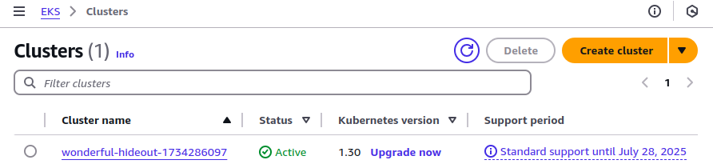

This guide walks you through the process of migrating from AWS Elastic Kubernetes Engine (EKS) to Linode Kubernetes Engine (LKE). The example in this guide is a sample REST API service that is migrated from an AWS EKS cluster to an LKE cluster.

## Prerequisites

To follow along in this walkthrough, you’ll need the following:

-   A [Linode account](https://www.linode.com/cfe)
-   A [Linode API token (personal access token)](https://www.linode.com/docs/products/platform/accounts/guides/manage-api-tokens/)
-   The [Linode CLI](https://www.linode.com/docs/products/tools/cli/guides/install/) installed and configured
-   Access to your AWS account with sufficient permissions to work with EKS clusters
-   The [AWS CLI](https://aws.amazon.com/cli/) installed and configured
-   [`kubectl`](https://kubernetes.io/docs/tasks/tools/#kubectl) installed and configured
-   [`eksctl`](https://eksctl.io/) installed and configured
-   [`jq`](https://jqlang.github.io/jq/download/) installed and configured
-   [`yq`](https://github.com/mikefarah/yq) installed and configured

## Step 1: Connect `kubectl` to Your EKS Cluster

[Connect kubectl to the EKS cluster](https://docs.aws.amazon.com/eks/latest/userguide/create-kubeconfig.html) that you want to migrate. If your local machine already has a kubeconfig file with your EKS cluster information, then you can skip this step.

In the AWS console, navigate to the EKS service and find the name of your EKS cluster.



In the example above, the cluster name is `wonderful-hideout-1734286097`. You also need to know the AWS region where your cluster resides. For this example (not shown in the screenshot), the region is `us-west-1`.

Use the AWS CLI to update your local kubeconfig file with your EKS cluster information:

```command
aws eks update-kubeconfig \
    --region us-west-1 \
    --name wonderful-hideout-1734286097
```

```output
Added new context arn:aws:eks:us-west-1:153917289119:cluster/wonderful-hideout-1734286097 to /home/user/.kube/config
 ```

If your kubeconfig file has information from multiple clusters, use the following command to list the contexts that kubectl knows about:

```command
kubectl config get-contexts
```

Find the name of the kubectl context pointing to your EKS cluster. Then, set the kubectl context to this cluster. For example:

```commmand
kubectl config use-context \
    user@wonderful-hideout-1734286097.us-west-1.eksctl.io
```

## Step 2: Assess Your EKS Cluster

Assuming you have set your kubectl context to the EKS cluster for migration, review your cluster status with the following command:

```command
kubectl cluster-info
```

```output
Kubernetes control plane is running at https://35057E565F73FD2804B94EF5C9D24A34.yl4.us-west-1.eks.amazonaws.com
CoreDNS is running at https://35057E565F73FD2804B94EF5C9D24A34.yl4.us-west-1.eks.amazonaws.com/api/v1/namespaces/kube-system/services/kube-dns:dns/proxy

To further debug and diagnose cluster problems, use 'kubectl cluster-info dump'.
```

For more detailed information at the command line, run this command:

```command
kubectl cluster-info dump
```

### Review the Node Group

In AWS EKS, the node group defines the type of worker nodes in your EKS cluster. This is a key aspect of the migration process. In a production cluster, you may have multiple node groups with different node types.

Kubernetes does not have a concept of a node group. However, because all the nodes in the same node group have the same configuration, inspecting just one of the nodes yields all the information needed for migration.

```command
kubectl get nodes
```

```output
NAME                                          STATUS   ROLES    AGE   VERSION
ip-192-168-31-10.us-west-1.compute.internal   Ready    \<none\>   24m   v1.30.7-eks-59bf375
ip-192-168-36-4.us-west-1.compute.internal    Ready    \<none\>   24m   v1.30.7-eks-59bf375
```

To retrieve the information about the first node listed, run the following command:

```command
kubectl get node \
    $(kubectl get nodes -o jsonpath='{.items[0].metadata.name}') -o yaml
```

The above command retrieves all the information about the node in YAML format. Run the previous command through a pipe to filter for specific fields, such as allocatable CPU and memory.

```command
kubectl get node \
    $(kubectl get nodes -o jsonpath='{.items[0].metadata.name}') -o yaml \
        | yq '.status.allocatable | {"cpu": .cpu, "memory": .memory}' \
            | awk -F': ' ' /cpu/ {cpu=$2} /memory/ {mem=$2} \
                END {printf "cpu: %s\nmemory: %.2f Gi\n", cpu, mem / 1024 / 1024}'
```

```output
cpu: 1930m
memory: 6.89 Gi
```

### Verify the Application Is Running

An application—a [REST API service written in Go](https://github.com/linode/docs-cloud-projects/tree/main/demos/go-quote-service-main)—has been deployed to the example EKS cluster. This service allows you to add a quote (a string) to a stored list, or retrieve that list. The application has been deployed to the cluster, creating a Kubernetes [Deployment](https://kubernetes.io/docs/concepts/workloads/controllers/deployment/), [Service](https://kubernetes.io/docs/concepts/services-networking/service/), and [HorizontalPodAutoscaler](https://kubernetes.io/docs/tasks/run-application/horizontal-pod-autoscale/).

The manifest (`manifest.yaml`) for deploying this application is as follows:

```file {title="manifest.yaml" lang="yaml"}
apiVersion: apps/v1
kind: Deployment
metadata:
  name: go-quote
  labels:
    app: go-quote
spec:
  replicas: 1
  selector:
    matchLabels:
      app: go-quote
  template:
    metadata:
      labels:
        app: go-quote
    spec:
      containers:
        - name: go-quote
          image: linodedocs/go-quote-service:latest
          ports:
            - containerPort: 7777
          resources:
            requests:
              cpu: "100m"
              memory: "128Mi"
            limits:
              cpu: "250m"
              memory: "256Mi"
---
apiVersion: v1
kind: Service
metadata:
  name: go-quote-service
  labels:
    app: go-quote
spec:
  type: LoadBalancer
  ports:
    - port: 80
      targetPort: 7777
  selector:
    app: go-quote
---
apiVersion: autoscaling/v2
kind: HorizontalPodAutoscaler
metadata:
  name: go-quote-hpa
  labels:
    app: go-quote
spec:
  scaleTargetRef:
    apiVersion: apps/v1
    kind: Deployment
    name: go-quote
  minReplicas: 1
  maxReplicas: 1
  metrics:
    - type: Resource
      resource:
        name: cpu
        target:
          type: Utilization
          averageUtilization: 50
```

To see these resources, run the following commands:

```command
kubectl get deploy
```

```output
NAME       READY   UP-TO-DATE   AVAILABLE   AGE
go-quote   1/1     1            1           5m7s
```

```command
kubectl get svc
```

```output
NAME               TYPE           CLUSTER-IP       EXTERNAL-IP                                                              PORT(S)        AGE
go-quote-service   LoadBalancer   10.100.215.161   a4da1d7958fa64559a460e2ae07b57e5-771162568.us-west-1.elb.amazonaws.com   80:30570/TCP   5m27s
kubernetes         ClusterIP      10.100.0.1       <none>
```

The service is a [LoadBalancer](https://kubernetes.io/docs/concepts/services-networking/service/#loadbalancer), which means it can be accessed from outside the cluster. Testing the publicly-available service yields the following results:

```command
curl -X POST \
  --data '{"quote":"This is my first quote."}' \
a4da1d7958fa64559a460e2ae07b57e5-771162568.us-west-1.elb.amazonaws.com/quotes
```

```command
curl -X POST \
  --data '{"quote":"This is my second quote."}' \
  a4da1d7958fa64559a460e2ae07b57e5-771162568.us-west-1.elb.amazonaws.com/quotes
```

```command
curl a4da1d7958fa64559a460e2ae07b57e5-771162568.us-west-1.elb.amazonaws.com/quotes
```

```output
["This is my first quote.","This is my second quote."]
```

After verifying that your EKS cluster is fully operational and running a live service, you are ready for migration.

## Step 3: Provision an LKE cluster

When migrating from EKS to LKE, provision an LKE cluster with similar resources to run the same workloads. While there are several ways to create a Kubernetes cluster on Linode, this guide uses the [Linode CLI](https://github.com/linode/linode-cli) to provision resources.

1.  Use the Linode CLI (`linode`) to see available Kubernetes versions:

    ```command
    linode lke versions-list
    ```

    ```output
    ┌───────┐
    │ id    │
    ├───────┤
    │ 1.31  │
    ├───────┤
    │ 1.30  │
    ├───────┤
    │ 1.29  │
    └───────┘
    ```

    Unless specific requirements dictate otherwise, it’s generall|y recommended to provision the latest version of Kubernetes.

1.  Determine the type of Linode to provision. The example EKS cluster configuration uses nodes with two CPUs and 8 GB of memory. To find a Linode type with a similar configuration, run the following command with the Linode CLI:

    ```command
    linode linodes types --vcpus 2 --json --pretty \
      | jq '.[] | {class, id, vcpus, memory, price}'
    ```

    ```output
    {
      "class": "standard",
      "id": "g6-standard-2",
      "vcpus": 2,
      "memory": 4096,
      "price": {
        "hourly": 0.036,
        "monthly": 24
      }
    }
    {
      "class": "highmem",
      "id": "g7-highmem-1",
      "vcpus": 2,
      "memory": 24576,
      "price": {
        "hourly": 0.09,
        "monthly": 60
      }
    }
    {
      "class": "highmem",
      "id": "g7-highmem-2",
      "vcpus": 2,
      "memory": 49152,
      "price": {
        "hourly": 0.18,
        "monthly": 120
      }
    }
    {
      "class": "dedicated",
      "id": "g6-dedicated-2",
      "vcpus": 2,
      "memory": 4096,
      "price": {
        "hourly": 0.054,
        "monthly": 36
      }
    }
    {
      "class": "premium",
      "id": "g7-premium-2",
      "vcpus": 2,
      "memory": 4096,
      "price": {
        "hourly": 0.0645,
        "monthly": 43
      }
    }
    ```

    See [Akamai Connected Cloud: Pricing](https://www.linode.com/pricing/) for more detailed pricing information.

1.  The examples in this guide uses the **g6-standard-2** Linode, which features two CPU cores and 4 GB of memory. Run the following command to display detailed information in JSON for this Linode plan:

    ```command
    linode linodes types --label "Linode 4GB" --json --pretty
    ```

    ```output
    [
      {
        "addons": {...},
        "class": "standard",
        "disk": 81920,
        "gpus": 0,
        "id": "g6-standard-2",
        "label": "Linode 4GB",
        "memory": 4096,
        "network_out": 4000,
        "price": {
          "hourly": 0.036,
          "monthly": 24.0
        },
        "region_prices": [...],
        "successor": null,
        "transfer": 4000,
        "vcpus": 2
      }
    ]
    ```

1.  View available regions with the regions list command:

    ```command
    linode regions list
    ```

1.  After selecting a Kubernetes version and Linode type, use the following command to create a cluster named `eks-to-lke` in the `us-lax` (Los Angeles, CA) region with three nodes and auto-scaling.

    Replace `eks-to-lke` and `us-lax` with a cluster label and region of your choosing, respectively:

    ```command
    linode lke cluster-create \
      --label eks-to-lke \
      --k8s\_version 1.31 \
      --region us-lax \
      --node\_pools '[{
        "type": "g6-standard-2",
        "count": 1,
        "autoscaler": {
          "enabled": true,
          "min": 1,
          "max": 3
        }
    }]'
    ```

    After creating your cluster successfully, you should see output similar to the following:

    ```output
    Using default values: {}; use the \--no-defaults flag to disable defaults
    +------------------+--------+-------------+
    |      label       | region | k8s\_version |
    +------------------+--------+-------------+
    | eks-to-lke       | us-lax |        1.31 |
    +------------------+--------+-------------+
    ```

## Step 4: Access the Kubernetes Cluster

To access your cluster, fetch the cluster credentials as a kubeconfig file.

1.  Use the following command to retrieve the cluster’s ID:

    ```command
    CLUSTER_ID=$(linode lke clusters-list --json | \
      jq -r \
        '.[] | select(.label == "eks-to-lke") | .id')
    ```

1.  Retrieve the `kubeconfig` file and save it to `~/.kube/lke-config`:.

    ```command
    linode lke kubeconfig-view --json "$CLUSTER_ID" | \
      jq -r '.[0].kubeconfig' | \
      base64 --decode > ~/.kube/lke-config
    ```

1.  After saving the `kubeconfig`, access your cluster by using `kubectl` and specifying the file:

    ```command
    kubectl get no --kubeconfig ~/.kube/lke-config
    ```

    ```output
    NAME                            STATUS   ROLES    AGE   VERSION
    lke289125-478490-4569f8b60000   Ready    <none>   85s   v1.31.0
    ```

    One node is ready, and it uses Kubernetes version 1.31.

1.  Next, verify the cluster's health and readiness for application deployment.

    ```command
    kubectl cluster-info --kubeconfig ~/.kube/lke-config
    ```

    ```output
    Kubernetes control plane is running at https://1a6a67c2-4c6f-4c75-a4ff-1fbef1be1807.us-lax-1.linodelke.net:443
    KubeDNS is running at https://1a6a67c2-4c6f-4c75-a4ff-1fbef1be1807.us-lax-1.linodelke.net:443/api/v1/namespaces/kube-system/services/kube-dns:dns/proxy

    To further debug and diagnose cluster problems, use 'kubectl cluster-info dump'.
    ```

## Step 5: Migrate From AWS EKS to LKE on Linode

In some cases, migrating Kubernetes applications requires an incremental approach because moving large, interconnected systems all at once isn’t practical. For example, imagine Service A interacts with other services: B, C, D. You might be able to migrate Service A and Service B together to LKE, where they can communicate efficiently. However, Services C and D may still rely heavily on AWS infrastructure or native services, making their migration more complex.

In this scenario, you’d temporarily run Service A in both AWS EKS and LKE on Linode. Service A on LKE would interact with Service B there, while the version of Service A on AWS EKS continues communicating with Services C and D. This setup minimizes disruptions while you work through the complexities of migrating the remaining services to LKE. Although cross-cloud communication incurs higher latency and costs, this approach helps maintain functionality during the transition.

This guide covers the key steps required to migrate the example application from EKS to LKE.

### Assess Current Workloads and Dependencies in AWS EKS

Ensure that kubectl uses the original kubeconfig file with the EKS cluster context.

```command
kubectl get all \
  --context user@wonderful-hideout-1734286097.us-west-1.eksctl.io
```

```output
NAME                           READY   STATUS    RESTARTS   AGE pod/go-quote-c575f6ccb-tls9g   1/1     Running   0          170m NAME                       TYPE           CLUSTER-IP       EXTERNAL-IP                                                              PORT(S)        AGE service/go-quote-service   LoadBalancer   10.100.215.161   a4da1d7958fa64559a460e2ae07b57e5-771162568.us-west-1.elb.amazonaws.com   80:30570/TCP   170m service/kubernetes         ClusterIP      10.100.0.1       <none>                                                                   443/TCP        3h30m

NAME                       READY   UP-TO-DATE   AVAILABLE   AGE deployment.apps/go-quote   1/1     1            1           170m

NAME                                 DESIRED   CURRENT   READY   AGE replicaset.apps/go-quote-c575f6ccb   1         1         1       170m

NAME                                               REFERENCE             TARGETS              MINPODS   MAXPODS   REPLICAS   AGE horizontalpodautoscaler.autoscaling/go-quote-hpa   Deployment/go-quote   cpu: <unknown>/50%   1         1         1          170m
```

The output shows the pod of the deployment and the one active replica set. These resources are derivatives of the deployment.

Note that this is all in the default namespace. If you deploy workloads to other namespaces (recommended for production-grade clusters), then you would need to check every namespace.

### Export Kubernetes Manifests of AWS EKS

There are many ways to specify the resources you want to deploy to Kubernetes, which include YAML manifests, Kustomize, and Helm charts. Store these in source control and apply them through a CI/CD pipeline. The guide uses plain YAML manifests for the example. Exporting these manifests means storing them as files in a git repository.

### Update Manifests for Compatibility With LKE on Linode

You may need to update your manifests to accommodate for differences between EKS and LKE. For example, your configuration on EKS may use the [AWS Load Balancer Controller](https://kubernetes-sigs.github.io/aws-load-balancer-controller/v2.4/), which helps manage AWS Application Load Balancers (ALB) as Kubernetes [Ingress](https://kubernetes.io/docs/concepts/services-networking/ingress/) resources. As an alternative to AWS ALBs when running LKE on Linode, you can [deploy a dedicated NGINX Ingress on LKE](https://www.linode.com/docs/guides/deploy-nginx-ingress-on-lke/).

The deployment image may point to AWS Elastic Container Registry (ECR). Modify this to point to an alternative registry. For example, the Deployment section of your application manifest may look like this:

```file
apiVersion: apps/v1
kind: Deployment
metadata:
...
spec:
  ...
  template:
    ...
    spec:
      containers:
        - name: go-quote
          image: 123456789.dkr.ecr.us-west-2.amazonaws.com/go-quote:latest
          ...
```

The container image, pointing to AWS ECR, has the following format:

```command
<aws_account_id>.dkr.ecr.<region>.amazonaws.com/<repository_name>:<tag>
```

When migrating away from AWS ECR, upload the container image to a different registry service (such as Docker Hub) or [Set Up a Docker Registry with LKE and Object Storage](https://www.linode.com/docs/guides/how-to-setup-a-private-docker-registry-with-lke-and-object-storage/). Then, modify your Kubernetes manifest to point to the new location for your image.

For the example service application in this guide, the image comes from Docker Hub; therefore, redirecting the registry is unnecessary.

### Transfer Persistent Data

If the workload depends on persistent data in AWS S3 or a database, then transfer the data or make it available to LKE. The example application, with its in-memory configuration, does not rely on any persistent data.

### Deploy Workloads to LKE on Linode

First, deploy your application to the newly created LKE cluster. Because you are switching back and forth between two different clusters, verify the current kubectl context to ensure you are pointing to the right kubeconfig file and cluster.

```command
kubectl config current-context --kubeconfig ~/.kube/lke-config
```

```output
lke289125-ctx
```

Apply the same manifest used to deploy your application to EKS, but this time on your LKE cluster:

```command
kubectl apply \
  --kubeconfig ~/.kube/lke-config \
  -f manifest.yaml
```

```output
deployment.apps/go-quote created
service/go-quote-service created
horizontalpodautoscaler.autoscaling/go-quote-hpa created
```

### Validate Application Functionality

Verify that the deployment and the service were created successfully.

```command
kubectl get deploy --kubeconfig ~/.kube/lke-config
```

```output
NAME       READY   UP-TO-DATE   AVAILABLE   AGE
go-quote   1/1     1            1           108s
```

```command
kubectl get service --kubeconfig ~/.kube/lke-config
```

```output
NAME               TYPE           CLUSTER-IP       EXTERNAL-IP     PORT(S)        AGE
go-quote-service   LoadBalancer   10.128.183.194   172.235.44.28   80:30407/TCP   117s
kubernetes         ClusterIP      10.128.0.1       <none>          443/TCP        157m
```

The service exposes a public IP address to the REST API service (in this example, it is `172.235.44.28`).

```command
curl -X POST \
  --data '{"quote":"This is my first quote for LKE."}' \
  172.235.44.28/quotes
```

```command
curl -X POST \
  --data '{"quote":"This is my second quote for LKE."}' \
  172.235.44.28/quotes
```

```command
curl 172.235.44.28/quotes
```

```output
["This is my first quote for LKE.","This is my second quote for LKE."]
```

The REST API service is up and running on LKE. Find any services dependent on the EKS cluster deployment and point them to the LKE cluster deployment instead. After testing and verifying the application running on LKE, you can terminate the EKS cluster.

## Additional Considerations and Concerns

### Cost Management

Cost reduction is one reason an organization might migrate from AWS EKS to LKE on Linode. Typically, the compute cost of Kubernetes is the primary driver for migration. Use kubectl to find the instance type and capacity type for your AWS EKS instance.

```command
kubectl get node ip-192-168-31-10.us-west-1.compute.internal \
        -o yaml \
        | yq .metadata.labels \
        | rg 'node.kubernetes.io/instance-type|capacityType'
```

```output
eks.amazonaws.com/capacityType: ON_DEMAND node.kubernetes.io/instance-type: m5.large
```

Reference the [AWS pricing page for EC2 On-Demand Instances](https://aws.amazon.com/ec2/pricing/on-demand/) to find the cost for your EKS instance. Compare this with the cost of an Linode instance with comparable resources by examining the [Linode pricing page](https://www.linode.com/pricing/).

Applications with a lot of data egress can also be impacted significantly by egress costs. Consider the typical networking usage of applications running on your EKS cluster, and determine your [data transfer costs with AWS.](https://aws.amazon.com/ec2/pricing/on-demand/#Data_Transfer) Compare this with data transfer numbers allocated to your Linode.

### Data persistence and storage

Cloud-native workloads are ephemeral. As a container orchestration platform, Kubernetes is designed to ensure your pods are up and running and autoscaling to handle demand. However, it’s important to handle persistent data carefully. If you are in a position to impose a large maintenance window with system downtime, then migrating data will be simpler.

However, if you need to perform a live migration with minimal downtime, you must develop proper migration procedures and test them before trying them on your production environment. This may include:

-   Parallel storage and databases on both clouds
-   Cross-cloud replication between storage and databases
-   Double writes at the application level
-   Failover reads at the application level
-   Switching the AWS storage and databases to read-only
-   Storage and database indirection at the configuration or DNS level

### Advanced Network Configuration

The AWS network model includes virtual private clouds (VPCs), virtual private networks (VPNs), and different types of load balancers. Linode and LKE provide [NodeBalancers](https://www.linode.com/products/nodebalancers/), equivalent to application load balancers. If you use advanced features of AWS networking, then you may need to perform some non-trivial work mapping them to Linode networking.

For network security, you may need to port AWS security group rules into [Kubernetes Network Policies](https://kubernetes.io/docs/concepts/services-networking/network-policies/) on LKE.

### Security and Access Management

AWS EKS integrates AWS IAM with Kubernetes access. On LKE with Linode, you use standard Kubernetes user and service accounts, as well as [Kubernetes role-based access control (RBAC)](https://kubernetes.io/docs/reference/access-authn-authz/rbac/).

### DNS

If you use an independent DNS provider—such as Cloudflare—for your application, then you need to update various DNS records to point to LKE endpoints and NodeBalancers instead of AWS endpoints.

If you use Route53, the DNS service from AWS, and plan to migrate away from it, reference [Linode’s DNS manager](https://techdocs.akamai.com/cloud-computing/docs/dns-manager) as a migration option.

### Alternative to AWS Elastic Container Registry (ECR)

LKE on Linode doesn't have its own container registry. However, if you need to migrate away from AWS ECR, you can set up a third-party private container registry, such as [Docker Hub](https://hub.docker.com/) or [GitHub Container Registry](https://github.blog/news-insights/product-news/introducing-github-container-registry/).

Another option is to set up your container registry. See [How to Set Up a Docker Registry with LKE and Object Storage](https://www.linode.com/docs/guides/how-to-setup-a-private-docker-registry-with-lke-and-object-storage/).

### Alternative to AWS CloudWatch

For Kubernetes cluster observability, AWS provides its CloudWatch service. With Linode, you can install an alternative observability solution on LKE. One example of such a solution is [The Observability Stack (TOBS)](https://github.com/timescale/tobs), which includes:

-   Kube-Prometheus
    -   Prometheus
    -   AlertManager
    -   Grafana
    -    Node-Exporter
    -    Kube-State-Metrics
    -    Prometheus-Operator
-   Promscale
-   TimescaleDB
    -   Postgres-Exporter
-   OpenTelemetry-Operator

See [How to Deploy TOBS (The Observability Stack) on LKE](https://www.linode.com/docs/guides/deploy-tobs-on-linode-kubernetes-engine/) for more information.

### Alternative to AWS Secrets Manager

The AWS Secrets Manager can be leveraged to provide Kubernetes secrets on EKS. With LKE on Linode, you need another solution. Consider migrating to OpenBao on Linode.

## Resources

-   AWS EKS
    -   [Documentation](https://aws.amazon.com/eks/)
    -   [Connecting kubectl to an EKS cluster](https://docs.aws.amazon.com/eks/latest/userguide/create-kubeconfig.html)
-   Linode
    -   [Akamai Connected Cloud: Pricing](https://www.linode.com/pricing/)
    -   [LKE Documentation](https://www.linode.com/docs/guides/kubernetes-on-linode/)
    -   [DNS Manager](https://techdocs.akamai.com/cloud-computing/docs/dns-manager)
-   Setting up other technologies to run on Linode
    -   [How to Set Up a Docker Registry with LKE and Object Storage](https://www.linode.com/docs/guides/how-to-setup-a-private-docker-registry-with-lke-and-object-storage/)
    -   [How to Deploy TOBS (The Observability Stack) on LKE](https://www.linode.com/docs/guides/deploy-tobs-on-linode-kubernetes-engine/)