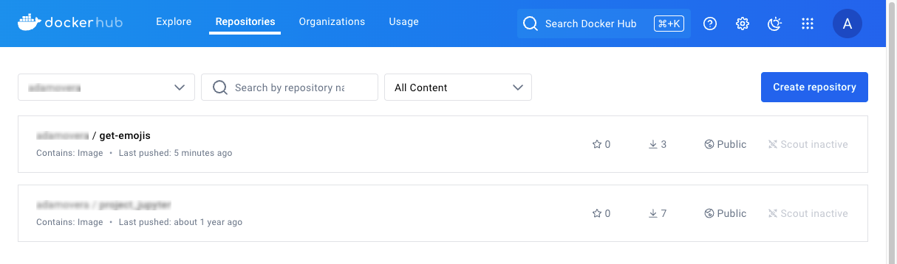
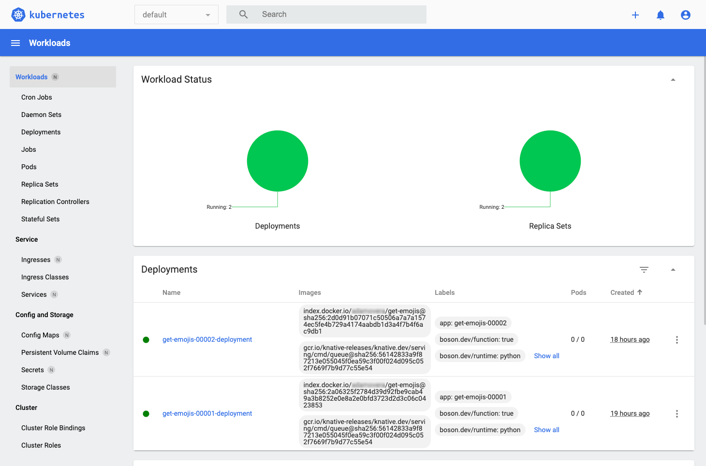

Knative is an open source platform that extends Kubernetes to manage serverless workloads. It provides tools to deploy, run, and manage serverless applications and functions, enabling automatic scaling and efficient resource usage. Knative consists of several components:

-   **Serving**: Deploys and runs serverless containers.
-   **Eventing**: Facilitates event-driven architectures.
-   **Functions**: Deploys and runs functions locally and on Kubernetes.

This guide walks through the process of migrating an AWS Lambda function to a Knative function running on the Linode Kubernetes Engine (LKE).

## Before You Begin

1.  Read our [Getting Started with Linode](/docs/products/platform/get-started/) guide to create a Linode account.

1.  Read our [Manage personal access tokens](https://techdocs.akamai.com/cloud-computing/docs/manage-personal-access-tokens) guide to create a personal access token.

1.  Ensure that you have [Git](https://git-scm.com/downloads) installed.

1.  Follow the steps in the *Install kubectl* section of our [Getting started with LKE](https://techdocs.akamai.com/cloud-computing/docs/getting-started-with-lke-linode-kubernetes-engine) guide to install `kubectl`.

1.  Follow the instructions in our [Install and configure the CLI](https://techdocs.akamai.com/cloud-computing/docs/install-and-configure-the-cli) guide to install the Linode CLI.

1.  Ensure that you have Knative's [`func` CLI](https://knative.dev/docs/functions/install-func/) installed.

1.  Ensure that you have [Docker](https://www.docker.com/products/docker-desktop/) installed and have a [Docker Hub](https://www.docker.com/products/docker-hub/) account.

1.  Install `jq`, a lightweight command line JSON processor:

    ```command
    sudo apt install jq
    ```


This guide is written for a non-root user. Commands that require elevated privileges are prefixed with `sudo`. If you’re not familiar with the `sudo` command, see the [Users and Groups](/docs/guides/linux-users-and-groups/) guide.


## Provision a Kubernetes Cluster

While there are several ways to create a Kubernetes cluster on Linode, this guide uses the [Linode CLI](https://github.com/linode/linode-cli) to provision resources.

1.  First, use the Linode CLI command (`linode`) to see the available Kubernetes versions:

    ```command
    linode lke versions-list
    ```

    ```output
    ┌──────┐
    │ id   │
    ├──────┤
    │ 1.31 │
    ├──────┤
    │ 1.30 │
    ├──────┤
    │ 1.29 │
    └──────┘
    ```

    It's generally recommended to provision the latest version unless specific requirements dictate otherwise.

1.  Use the following command to list the available Linode plans, including pricing and performance details:

    ```command
    linode linodes types
    ```

    
    View Linode’s pricing information [here](https://www.linode.com/cloud-computing-calculator/?promo=sitelin100-02162023&promo_value=100&promo_length=60&utm_source=google&utm_medium=cpc&utm_campaign=11178784975_112607711747&utm_term=g_kwd-46671155961_e_linode%20pricing&utm_content=467094105814&locationid=9073501&device=c_c&gad_source=1&gclid=Cj0KCQjw9Km3BhDjARIsAGUb4nzNzPsxMOeTdk2wyBd77ysa3K1UTZKH8STVYjuWeg1VeEjoubqv6GIaAl59EALw_wcB).
    

1.  The examples in this guide use the **g6-standard-2** Linode, which features two CPU cores and 4 GB of memory. Run the following command to display detailed information for this Linode:

    ```command
    linode linodes types --label "Linode 4GB" --json --pretty
    ```

    ```output
    [
      {
        "addons": {
          "backups": {
            "price": {
              "hourly": 0.008,
              "monthly": 5.0
            },
            "region_prices": [
              {
                "hourly": 0.009,
                "id": "id-cgk",
                "monthly": 6.0
              },
              {
                "hourly": 0.01,
                "id": "br-gru",
                "monthly": 7.0
              }
            ]
          }
        },
        "class": "standard",
        "disk": 81920,
        "gpus": 0,
        "id": "g6-standard-2",
        "label": "Linode 4GB",
        "memory": 4096,
        "network_out": 4000,
        "price": {
          "hourly": 0.036,
          "monthly": 24.0
        },
        "region_prices": [
          {
            "hourly": 0.043,
            "id": "id-cgk",
            "monthly": 28.8
          },
          {
            "hourly": 0.05,
            "id": "br-gru",
            "monthly": 33.6
          }
        ],
        "successor": null,
        "transfer": 4000,
        "vcpus": 2
      }
    ]
    ```

1.  With a Kubernetes version and Linode type selected, use the following command to create a cluster in the `us-mia` region with three nodes and auto-scaling:

    ```command
    linode lke cluster-create \
      --label knative-playground \
      --k8s_version 1.31 \
      --region us-mia \
      --node_pools '[{
        "type": "g6-standard-2",
        "count": 3,
        "autoscaler": {
          "enabled": true,
          "min": 3,
          "max": 8
        }
      }]'
    ```

    Once your cluster is successfully created, you should see a message similar to the following:

    ```output
    Using default values: {}; use the --no-defaults flag to disable defaults
    ┌────────────────────┬────────┬─────────────┐
    │ label              │ region │ k8s_version │
    ├────────────────────┼────────┼─────────────┤
    │ knative-playground │ us-mia │ 1.31        │
    └────────────────────┴────────┴─────────────┘
    ```

### Access the Kubernetes Cluster

To access your cluster, fetch the cluster credentials in the form of a `kubeconfig` file.

1.  First, use the following command to retrieve the cluster's ID:

    ```command
    CLUSTER_ID=$(linode lke clusters-list --json | \
        jq -r \
          '.[] | select(.label == "knative-playground") | .id')
    ```

1.  Create the hidden `.kube` folder in your user's home directory:

    ```command
    mkdir ~/.kube
    ```

1.  Retrieve the `kubeconfig` file and save it to `~/.kube/lke-config`::

    ```command
    linode lke kubeconfig-view --json "$CLUSTER_ID" | \
        jq -r '.[0].kubeconfig' | \
        base64 --decode > ~/.kube/lke-config
    ```

1.  Once you have the `kubeconfig` file, access your cluster using `kubectl` by specifying the file:

    ```command
    kubectl get no --kubeconfig ~/.kube/lke-config
    ```

    ```output
    NAME                            STATUS   ROLES    AGE   VERSION
    lke242177-380780-1261b5670000   Ready    <none>   49s   v1.31.0
    lke242177-380780-3496ef070000   Ready    <none>   47s   v1.31.0
    lke242177-380780-53e2290c0000   Ready    <none>   51s   v1.31.0
    ```

    
    Optionally, to avoid specifying `--kubeconfig ~/.kube/lke-config` with every `kubectl` command, you can set an environment variable for your current terminal session:

    ```command
    export KUBECONFIG=~/.kube/lke-config
    ```

    Then you can simply run:

    ```command
    kubectl get no
    ```
    

## Set Up Knative on LKE

While there are multiple ways to [install Knative on a Kubernetes cluster](https://knative.dev/docs/install/), the examples in this guide use the YAML manifests method.

1.  First, run the following command to install the Knative CRDs:

    ```command
    RELEASE=releases/download/knative-v1.15.2/serving-crds.yaml
    kubectl apply -f "https://github.com/knative/serving/$RELEASE"
    ```

    Upon successful execution, you should see a similar output indicating that the CRDs are configured:

    ```output
    customresourcedefinition.apiextensions.k8s.io/certificates.networking.internal.knative.dev created
    customresourcedefinition.apiextensions.k8s.io/configurations.serving.knative.dev created
    customresourcedefinition.apiextensions.k8s.io/clusterdomainclaims.networking.internal.knative.dev created
    customresourcedefinition.apiextensions.k8s.io/domainmappings.serving.knative.dev created
    customresourcedefinition.apiextensions.k8s.io/ingresses.networking.internal.knative.dev created
    customresourcedefinition.apiextensions.k8s.io/metrics.autoscaling.internal.knative.dev created
    customresourcedefinition.apiextensions.k8s.io/podautoscalers.autoscaling.internal.knative.dev created
    customresourcedefinition.apiextensions.k8s.io/revisions.serving.knative.dev created
    customresourcedefinition.apiextensions.k8s.io/routes.serving.knative.dev created
    customresourcedefinition.apiextensions.k8s.io/serverlessservices.networking.internal.knative.dev created
    customresourcedefinition.apiextensions.k8s.io/services.serving.knative.dev created
    customresourcedefinition.apiextensions.k8s.io/images.caching.internal.knative.dev created
    ```

1.  Next, run the following command to install the Knative **Serving** component:

    ```command
    RELEASE=releases/download/knative-v1.15.2/serving-core.yaml
    kubectl apply -f "https://github.com/knative/serving/$RELEASE"
    ```

    Upon successful completion, you should see similar output indicating that various resources are now created:

    ```output
    namespace/knative-serving created
    role.rbac.authorization.k8s.io/knative-serving-activator created
    clusterrole.rbac.authorization.k8s.io/knative-serving-activator-cluster created
    clusterrole.rbac.authorization.k8s.io/knative-serving-aggregated-addressable-resolver created
    clusterrole.rbac.authorization.k8s.io/knative-serving-addressable-resolver created
    clusterrole.rbac.authorization.k8s.io/knative-serving-namespaced-admin created
    clusterrole.rbac.authorization.k8s.io/knative-serving-namespaced-edit created
    clusterrole.rbac.authorization.k8s.io/knative-serving-namespaced-view created
    clusterrole.rbac.authorization.k8s.io/knative-serving-core created
    clusterrole.rbac.authorization.k8s.io/knative-serving-podspecable-binding created
    serviceaccount/controller created
    clusterrole.rbac.authorization.k8s.io/knative-serving-admin created
    clusterrolebinding.rbac.authorization.k8s.io/knative-serving-controller-admin created
    clusterrolebinding.rbac.authorization.k8s.io/knative-serving-controller-addressable-resolver created
    serviceaccount/activator created
    rolebinding.rbac.authorization.k8s.io/knative-serving-activator created
    clusterrolebinding.rbac.authorization.k8s.io/knative-serving-activator-cluster created
    customresourcedefinition.apiextensions.k8s.io/images.caching.internal.knative.dev unchanged
    certificate.networking.internal.knative.dev/routing-serving-certs created
    customresourcedefinition.apiextensions.k8s.io/certificates.networking.internal.knative.dev unchanged
    customresourcedefinition.apiextensions.k8s.io/configurations.serving.knative.dev unchanged
    customresourcedefinition.apiextensions.k8s.io/clusterdomainclaims.networking.internal.knative.dev unchanged
    customresourcedefinition.apiextensions.k8s.io/domainmappings.serving.knative.dev unchanged
    customresourcedefinition.apiextensions.k8s.io/ingresses.networking.internal.knative.dev unchanged
    customresourcedefinition.apiextensions.k8s.io/metrics.autoscaling.internal.knative.dev unchanged
    customresourcedefinition.apiextensions.k8s.io/podautoscalers.autoscaling.internal.knative.dev unchanged
    customresourcedefinition.apiextensions.k8s.io/revisions.serving.knative.dev unchanged
    customresourcedefinition.apiextensions.k8s.io/routes.serving.knative.dev unchanged
    customresourcedefinition.apiextensions.k8s.io/serverlessservices.networking.internal.knative.dev unchanged
    customresourcedefinition.apiextensions.k8s.io/services.serving.knative.dev unchanged
    image.caching.internal.knative.dev/queue-proxy created
    configmap/config-autoscaler created
    configmap/config-certmanager created
    configmap/config-defaults created
    configmap/config-deployment created
    configmap/config-domain created
    configmap/config-features created
    configmap/config-gc created
    configmap/config-leader-election created
    configmap/config-logging created
    configmap/config-network created
    configmap/config-observability created
    configmap/config-tracing created
    horizontalpodautoscaler.autoscaling/activator created
    poddisruptionbudget.policy/activator-pdb created
    deployment.apps/activator created
    service/activator-service created
    deployment.apps/autoscaler created
    service/autoscaler created
    deployment.apps/controller created
    service/controller created
    horizontalpodautoscaler.autoscaling/webhook created
    poddisruptionbudget.policy/webhook-pdb created
    deployment.apps/webhook created
    service/webhook created
    validatingwebhookconfiguration.admissionregistration.k8s.io/config.webhook.serving.knative.dev created
    mutatingwebhookconfiguration.admissionregistration.k8s.io/webhook.serving.knative.dev created
    validatingwebhookconfiguration.admissionregistration.k8s.io/validation.webhook.serving.knative.dev created
    secret/webhook-certs created
    ```

1.  Knative relies on an underlying networking layer. While there are [several options for Knative networking](https://knative.dev/docs/install/operator/knative-with-operators/#install-the-networking-layer), the examples in guide use [Kourier](https://github.com/knative-extensions/net-kourier), which is designed specifically for Knative. Use the commands below to download and install the latest Kourier release:

    ```command
    RELEASE=releases/download/knative-v1.15.1/kourier.yaml
    kubectl apply -f "https://github.com/knative-extensions/net-kourier/$RELEASE"
    ```

    The output should again indicate the creation of multiple new elements:

    ```output
    namespace/kourier-system created
    configmap/kourier-bootstrap created
    configmap/config-kourier created
    serviceaccount/net-kourier created
    clusterrole.rbac.authorization.k8s.io/net-kourier created
    clusterrolebinding.rbac.authorization.k8s.io/net-kourier created
    deployment.apps/net-kourier-controller created
    service/net-kourier-controller created
    deployment.apps/3scale-kourier-gateway created
    service/kourier created
    service/kourier-internal created
    horizontalpodautoscaler.autoscaling/3scale-kourier-gateway created
    poddisruptionbudget.policy/3scale-kourier-gateway-pdb created
    ```

1.  The following command configures Knative to use Kourier as the default ingress controller:

    ```command
    kubectl patch configmap/config-network \
        --namespace knative-serving \
        --type merge \
        --patch \
          '{"data":{"ingress-class":"kourier.ingress.networking.knative.dev"}}'
    ```

    ```output
    configmap/config-network patched
    ```

    
    If Istio is already installed in your cluster, you may choose to [reuse it for Knative](https://knative.dev/docs/install/operator/knative-with-operators/#__tabbed_1_2) as well.
    

1.  With Kourier configured, the Knative Serving installation now has a [`LoadBalancer`](https://kubernetes.io/docs/concepts/services-networking/service/#loadbalancer) service for external access. Use the following command to retrieve the external IP address, in case you want to set up your own DNS later:

    ```command
    kubectl get service kourier -n kourier-system
    ```

    The output should resemble the following, with the external IP address shown:

    ```output
    NAME      TYPE           CLUSTER-IP      EXTERNAL-IP     PORT(S)                      AGE
    kourier   LoadBalancer   10.128.48.124   172.235.159.7   80:31938/TCP,443:30800/TCP   4m37s
    ```

1.  Since Kourier added several deployments, check the updated list to ensure everything is functioning correctly:

    ```command
    kubectl get deploy -n knative-serving
    ```

    You should see output similar to the following, confirming the availability of the various components:

    ```output
    NAME                     READY   UP-TO-DATE   AVAILABLE   AGE
    activator                1/1     1            1           7m36s
    autoscaler               1/1     1            1           7m36s
    controller               1/1     1            1           7m36s
    net-kourier-controller   1/1     1            1           5m7s
    webhook                  1/1     1            1           7m36s
    ```

1.  While Knative offers [multiple ways to configure DNS](https://knative.dev/docs/install/operator/knative-with-operators/#configure-dns), this guide uses the Magic DNS method, which leverages the [sslip.io](http://sslip.io) DNS service. When a request is made to a subdomain of sslip.io containing an embedded IP address, the service resolves that IP address. For example, a request to [https://52.0.56.137.sslip.io](https://52.0.56.137.sslip.io) returns `52.0.56.137` as the IP address. Use the `default-domain` job to configures Knative Serving to use sslip.io:

    ```command
    MANIFEST=knative-v1.15.2/serving-default-domain.yaml
    kubectl apply -f "https://github.com/knative/serving/releases/download/$MANIFEST"
    ```

    Upon successful execution, you should see output confirming the creation of the `default-domain` job and service:

    ```output
    job.batch/default-domain created
    service/default-domain-service created
    ```

With Knative now operational in your cluster, you can begin working with Knative Functions.

## Work with Knative Functions and the `func` CLI

Knative Functions is a programming model that simplifies writing distributed applications on Kubernetes and Knative. It allows developers to create stateless, event-driven functions without requiring in-depth knowledge of containers, Kubernetes, or Knative itself.

The [`func`](https://github.com/knative/func) CLI streamlines the developer experience by providing tools to work with Knative Functions. It allows developers to manage the entire lifecycle of functions (creating, building, deploying, and invoking). This allows for local development and testing of functions without the need for a local Kubernetes cluster.

1.  To get started, run the following command:

    ```command
    func
    ```

    This displays help information for managing Knative Function resources:

    ```output
    func is the command line interface for managing Knative Function resources

	    Create a new Node.js function in the current directory:
	    func create --language node myfunction

	    Deploy the function using Docker hub to host the image:
	    func deploy --registry docker.io/alice

    Learn more about Functions:  https://knative.dev/docs/functions/
    Learn more about Knative at: https://knative.dev

    Primary Commands:
      create      Create a function
      describe    Describe a function
      deploy      Deploy a function
      delete      Undeploy a function
      list        List deployed functions
      subscribe   Subscribe a function to events

    Development Commands:
      run         Run the function locally
      invoke      Invoke a local or remote function
      build       Build a function container

    System Commands:
      config      Configure a function
      languages   List available function language runtimes
      templates   List available function source templates
      repository  Manage installed template repositories
      environment Display function execution environment information

    Other Commands:
      completion  Output functions shell completion code
      version     Function client version information

    Use "func <command> --help" for more information about a given command.
    ```

1.  Use the following command to create a Python function (`get-emojis`) that can be invoked via an HTTP endpoint (the default invocation method):

    ```command
    func create -l python get-emojis
    ```

    This command creates a complete directory structure with multiple files:

    ```output
    Created python function in /home//get-emojis
    ```

1.  Examine the contents of the newly created `~/get-emojis` directory:

    ```command
    ls -laGh get-emojis
    ```

    ```output
    total 48K
    drwxr-xr-x 3  4.0K Oct  9 15:57 .
    drwxr-x--- 9  4.0K Oct  9 15:57 ..
    -rwxr-xr-x 1    55 Oct  9 15:57 app.sh
    drwxrwxr-x 2  4.0K Oct  9 15:57 .func
    -rw-r--r-- 1   217 Oct  9 15:57 .funcignore
    -rw-r--r-- 1  1.8K Oct  9 15:57 func.py
    -rw-r--r-- 1    97 Oct  9 15:57 func.yaml
    -rw-r--r-- 1   235 Oct  9 15:57 .gitignore
    -rw-r--r-- 1    28 Oct  9 15:57 Procfile
    -rw-r--r-- 1   862 Oct  9 15:57 README.md
    -rw-r--r-- 1    28 Oct  9 15:57 requirements.txt
    -rw-r--r-- 1   259 Oct  9 15:57 test_func.py
    ```

1.  While covering the purpose of each file is outside the scope of this guide, you should examine the `func.py` file, the default implementation that Knative generates:

    ```command
    cat ~/get-emojis/func.py
    ```

    ```file {title="~/get-emojis/func.py" lang="python"}
    from parliament import Context
    from flask import Request
    import json


    # parse request body, json data or URL query parameters
    def payload_print(req: Request) -> str:
        if req.method == "POST":
            if req.is_json:
                return json.dumps(req.json) + "\n"
            else:
                # MultiDict needs some iteration
                ret = "{"

                for key in req.form.keys():
                    ret += '"' + key + '": "'+ req.form[key] + '", '

                return ret[:-2] + "}\n" if len(ret) > 2 else "{}"

        elif req.method == "GET":
            # MultiDict needs some iteration
            ret = "{"

            for key in req.args.keys():
                ret += '"' + key + '": "' + req.args[key] + '", '

            return ret[:-2] + "}\n" if len(ret) > 2 else "{}"


    # pretty print the request to stdout instantaneously
    def pretty_print(req: Request) -> str:
        ret = str(req.method) + ' ' + str(req.url) + ' ' + str(req.host) + '\n'
        for (header, values) in req.headers:
            ret += "  " + str(header) + ": " + values + '\n'

        if req.method == "POST":
            ret += "Request body:\n"
            ret += "  " + payload_print(req) + '\n'

        elif req.method == "GET":
            ret += "URL Query String:\n"
            ret += "  " + payload_print(req) + '\n'

        return ret


    def main(context: Context):
        """
        Function template
        The context parameter contains the Flask request object and any
        CloudEvent received with the request.
        """

        # Add your business logic here
        print("Received request")

        if 'request' in context.keys():
            ret = pretty_print(context.request)
            print(ret, flush=True)
            return payload_print(context.request), 200
        else:
            print("Empty request", flush=True)
            return "{}", 200
    ```

    This function acts as a server that returns the query parameters or form fields of incoming requests.

### Build a Function Image

The next step is to create a container image from your function. Since the function is intended run on a Kubernetes cluster, it must be containerized. Knative Functions facilitates this process for developers, abstracting the complexities of Docker and Dockerfiles.

1.  Change into the `~/get-emojis` directory before running the `build` command:

    ```command
    cd ~/get-emojis
    ```

1.  To build your function, run the following `build` command, specifying Docker Hub (`docker.io`) as the registry along with your :

    ```command
    func build --registry docker.io/
    ```

    This command fetches a base image and builds a Docker image from your function. You should see output similar to the following as the function image is built:

    ```output
    Building function image
    Still building
    Still building
    Yes, still building
    Don't give up on me
    Still building
    This is taking a while
    🙌 Function built: index.docker.io//get-emojis:latest
    ```

1.  To verify that the image is successfully created, use the following command to list your Docker images:

    ```command
    docker images | grep -E 'knative|get-emojis|ID'
    ```

    ```output
    REPOSITORY                           TAG       IMAGE ID       CREATED        SIZE
    ghcr.io/knative/builder-jammy-base   0.4.283   204e70721072   44 years ago   1.45GB
    /get-emojis                  latest           44 years ago   293MB
    ```

    
    While the `CREATED` timestamp may be incorrect, the image is valid.
    

1.  Now use the `run` command to run the function locally:

    ```command
    func run
    ```

    The terminal should display output indicating that the function now runs on `localhost` at port `8080`.:

    ```output
    function up-to-date. Force rebuild with --build
    Running on host port 8080
    ```

1.  With your function running, open a second terminal enter the following command:

    ```command
    curl "http://localhost:8080?a=1&b=2"
    ```

    By default, this initial implementation returns the URL query parameters as a JSON object. The resulting output should be:

    ```output
    {"a": "1", "b": "2"}
    ```

    Meanwhile, you should see the output similar to the following in your original terminal:

    ```output
    Received request
    GET http://localhost:8080/?a=1&b=2 localhost:8080
      Host: localhost:8080
      User-Agent: curl/7.81.0
      Accept: */*
    URL Query String:
      {"a": "1", "b": "2"}
    ```

1.  When done, close the second terminal and stop the function in the original terminal by pressing the <kbd>CTRL</kbd>+<kbd>C</kbd> keys.

### Deploy the Function

1.  To deploy your function to your Kubernetes cluster as a Knative function and push it to the Docker registry, use the `deploy` command:

    ```command
    func deploy
    ```

    You should see output similar to the following during deployment:

    ```output
    function up-to-date. Force rebuild with --build
    Pushing function image to the registry "index.docker.io" using the "" user credentials
    🎯 Creating Triggers on the cluster
    ✅ Function deployed in namespace "default" and exposed at URL:
       http://get-emojis.default..sslip.io
    ```

    Once the function is deployed and the Magic DNS record established, your Knative function is accessible through this public HTTP endpoint. Additionally, the new `get-emojis` repository should now exist on your Docker Hub account:

    

1.  To invoke your Knative function, `curl` the function’s public URL, adding any required query parameters. For example:

    ```command
    curl http://get-emojis.default..sslip.io/?yeah=it-works!
    ```

    The output should display a JSON object containing the query parameters:

    ```output
    {"yeah": "it-works!"}
    ```

With your Knative function running, the next step is migrate an AWS Lambda function to Knative.

## Migrate Your AWS Lambda Function to Knative

This guide examines a sample Lambda function and walks through how to migrate it to Knative. Conceptually, Lambda functions are similar to Knative functions. They both have a trigger and extract their input arguments from a context or event.

The main application logic is highlighted in the sample Lambda function below:

```file {lang="python" hl_lines="15-16"}
def handler(event, context):
    try:
        logger.info("Received event: %s", event)

        # The descriptions may arrive as attribute of the event
        descriptions = event.get("descriptions")
        if descriptions is None:
            # Parse the JSON body of the event
            body = json.loads(event.get("body", "{}"))
            logger.info("Parsed body: %s", body)

            descriptions = body.get("descriptions", [])
        logger.info("Descriptions: %s", descriptions)

        fuzz_emoji = FuzzEmoji()
        result = fuzz_emoji.get_emojis(descriptions)
        response = {
            'statusCode': 200,
            'body': json.dumps(result)
        }
    except Exception as e:
        response = {
            'statusCode': 500,
            'body': json.dumps({'error': str(e)})
        }

    return response
```

This function instantiates a `FuzzEmoji` object and calls its `get_emojis()` method, passing a list of emoji descriptions. The emoji descriptions may or may not map to official emoji names like `fire` (🔥) or `confused_face` (😕). The function performs a fuzzy search of the descriptions to find matching emojis.

The code above the highlighted lines extracts emoji descriptions from the `event` object passed to the handler. The code below the highlighted lines wraps the result in a response with a proper status code for success or failure.

At the time of this writing, this sample Lambda function was deployed and available at the following HTTP endpoint:

```command
curl -s -X POST --header "Content-type:application/json" \
    --data '{"descriptions":["flame","confused"]}' \
    https://64856ijzmi.execute-api.us-west-2.amazonaws.com/default/fuzz-emoji | \
    json_pp
```

Invoking the function returns the following result:

```output
{
   "confused" : "('confused_face', '😕')",
   "flame" : "('fire', '🔥')"
}
```

The function successfully returns the `fire` (🔥) emoji for the description "flame", and the `confused_face` emoji (😕) for the description "confused.”

### Isolating the AWS Lambda Code from AWS Specifics

To migrate the Lambda function to Knative, the core application logic must be decoupled from AWS-specific dependencies. Fortunately, in this case, the function's main logic is already isolated. The `get_emojis()` method only accepts a list of strings as input, which makes it easy to adapt for other platforms.

If the `get_emojis()` method were dependent on the AWS Lambda `event` object, it would not be compatible with Knative, as Knative does not provide an `event` object. This scenario would require some refactoring.

### Migrating a Single-File Function to a Knative Function

The core logic of the function is encapsulated into a single Python module named `fuzz_emoji.py`, which can be migrated to your Knative function.

1.  First, create the `fuzz_emoji.py` file in the `get-emojis` directory:

    ```command
    nano ~/get-emojis/fuzz_emoji.py
    ```

    Give the file the following content:

    ```file {title="~/get-emojis/fuzz_emoji/py" lang="python"}
    from typing import List, Mapping, Tuple

    import emoji
    import requests

    class FuzzEmoji:
        def __init__(self):
            self.emoji_dict = {}
            emoji_list = {name: data for name, data in emoji.EMOJI_DATA.items() if 'en' in data}
            for emoji_char, data in emoji_list.items():
                name = data['en'].strip(':')
                self.emoji_dict[name.lower()] = emoji_char

        @staticmethod
        def get_synonyms(word):
            response = requests.get(f"https://api.datamuse.com/words?rel_syn={word}")
            if response.status_code == 200:
                synonyms = [word_data['word'] for word_data in response.json()]
                return synonyms

            raise RuntimeError(response.content)

        def get_emoji(self, description) -> Tuple[str, str]:
            description = description.lower()
            # direct match
            if description in self.emoji_dict:
                return description, self.emoji_dict[description]

            # Subset match
            for name in self.emoji_dict:
                if description in name:
                    return name, self.emoji_dict[name]

            synonyms = self.get_synonyms(description)
            # Synonym match
            for syn in synonyms:
                if syn in self.emoji_dict:
                    return syn, self.emoji_dict[syn]
            return '', ''

        def get_emojis(self, descriptions: List[str]) -> Mapping[str, str]:
            return {d: str(self.get_emoji(d)) for d in descriptions}
    ```

    When done, press <kbd>CTRL</kbd>+<kbd>X</kbd>, followed by <kbd>Y</kbd> then <kbd>Enter</kbd> to save the file and exit `nano`.

1.  Run the `ls` command again:

    ```command
    ls -laGh ~/get-emojis/
    ```

    The folder structure should now look like this:

    ```output
    total 52K
    drwxr-xr-x 3  4.0K Oct 10 17:32 .
    drwxr-x--- 9  4.0K Oct 10 16:51 ..
    -rwxr-xr-x 1    55 Oct 10 16:51 app.sh
    drwxrwxr-x 3  4.0K Oct 10 17:20 .func
    -rw-r--r-- 1   217 Oct 10 16:51 .funcignore
    -rw-r--r-- 1  1.8K Oct 10 16:51 func.py
    -rw-r--r-- 1   317 Oct 10 17:22 func.yaml
    -rw-rw-r-- 1  1.4K Oct 10 17:32 fuzz_emoji.py
    -rw-r--r-- 1   235 Oct 10 16:51 .gitignore
    -rw-r--r-- 1    28 Oct 10 16:51 Procfile
    -rw-r--r-- 1   862 Oct 10 16:51 README.md
    -rw-r--r-- 1    28 Oct 10 16:51 requirements.txt
    -rw-r--r-- 1   259 Oct 10 16:51 test_func.py
    ```

1.  Next, edit your `func.py` file so that it calls the `fuzz_emoji` module:

    ```command
    nano ~/get-emojis/func.py
    ```

    Insert or adjust the highlighted lines so that the contents of your `fuzz_emoji.py` file appear as below:

    ```file {title="~/get-emojis/func.py" lang="python" hl_lines="4,34,61-64"}
    from parliament import Context
    from flask import Request
    import json
    from fuzz_emoji import FuzzEmoji


    # parse request body, json data or URL query parameters
    def payload_print(req: Request) -> str:
        if req.method == "POST":
            if req.is_json:
                return json.dumps(req.json) + "\n"
            else:
                # MultiDict needs some iteration
                ret = "{"

                for key in req.form.keys():
                    ret += '"' + key + '": "'+ req.form[key] + '", '

                return ret[:-2] + "}\n" if len(ret) > 2 else "{}"

        elif req.method == "GET":
            # MultiDict needs some iteration
            ret = "{"

            for key in req.args.keys():
                ret += '"' + key + '": "' + req.args[key] + '", '

            return ret[:-2] + "}\n" if len(ret) > 2 else "{}"


    # pretty print the request to stdout instantaneously
    def pretty_print(req: Request) -> str:
        ret = str(req.method) + ' ' + str(req.url) + ' ' + str(req.host) + '\n'
        for header, values in req.headers.items():
            ret += "  " + str(header) + ": " + values + '\n'

        if req.method == "POST":
            ret += "Request body:\n"
            ret += "  " + payload_print(req) + '\n'

        elif req.method == "GET":
            ret += "URL Query String:\n"
            ret += "  " + payload_print(req) + '\n'

        return ret


    def main(context: Context):
        """
        Function template
        The context parameter contains the Flask request object and any
        CloudEvent received with the request.
        """

        # Add your business logic here
        print("Received request")

        if 'request' in context.keys():
            ret = pretty_print(context.request)
            print(ret, flush=True)
            descriptions = context.request.args.get('descriptions').split(',')
            fuzz_emoji = FuzzEmoji()
            result = fuzz_emoji.get_emojis(descriptions)
            return json.dumps(result, ensure_ascii=False), 200
        else:
            print("Empty request", flush=True)
            return "{}", 200
    ```

    Here's a breakdown of what this code does:

    -   Imports the built-in `json`, the `Context` from [parliament](https://github.com/boson-project/parliament) (the function invocation framework that Knative uses for Python functions), and the `FuzzEmoji` class.
    -   The `main()` function accepts the parliament `Context` as its only parameter, which contains a Flask `request` property.
    -   The first line extracts the emoji descriptions from the Flask `request` arguments. It expects the descriptions to be a single comma-separated string, which it splits into a list of `descriptions`.
    -   Instantiates a `FuzzEmoji` object and calls the `get_emojis()` method.
    -   Uses the `json` module to serialize the response and return it with a `200` status code.

    When done, press <kbd>CTRL</kbd>+<kbd>X</kbd>, followed by <kbd>Y</kbd> then <kbd>Enter</kbd> to save the file and exit `nano`.

1.  Next, edit the `requirements.txt` file to include the dependencies of `fuzz_emoji.py` (the `requests` and `emoji` packages) in the Docker image:

    ```command
    nano ~/get-emojis/requirements.txt
    ```

    Append the highlighted lines to the end of the file:

    ```file {title="~/get-emojis/requirements.txt" hl_lines="2,3"}
    parliament-functions==0.1.0
    emoji==2.12.1
    requests==2.32.3
    ```

    When done, press <kbd>CTRL</kbd>+<kbd>X</kbd>, followed by <kbd>Y</kbd> then <kbd>Enter</kbd> to save the file and exit `nano`.

1.  Now re-build and re-deploy the container:

    ```command
    func build --registry docker.io/
    func deploy
    ```

1.  Finally, test your function using the public URL:

    ```command
    curl http://get-emojis.default..sslip.io/?descriptions=cold,plane,fam
    ```

    The `descriptions` provided as a query parameter are echoed back, along with a corresponding emoji name and emoji for each description:

    ```output
    {"cold": "('cold_face', '🥶')", "plane": "('airplane', '✈')", "fam": "('family', '👪')"}
    ```

    This confirms that the Knative function works as expected.

### Migrating a Multi-File Function to a Knative Function

In the previous example, the entire application logic was contained in a single file called `fuzz_emoji.py`. For larger workloads, your function might involve multiple files or even multiple directories and packages.

Migrating such a setup to Knative follows a similar process:

1.  Copy all relevant files and directories into the same `get-emojis` directory.

1.  Import any required modules in `func.py`.

1.  Update the `requirements.txt` file to include all of the dependencies used across any of the modules.

### Migrating External Dependencies

When migrating an AWS Lambda function, it may depend on various AWS services, such as S3, DynamoDB, SQS, or others. It's important to evaluate each dependency to determine the best option to suit your situation.

There are typically three choices:

1.  **Keep it as-is**: Continue using the Knative function to interact with the AWS service.

1.  **Replace the service**: For example, you might switch from an AWS service like DynamoDB to an alternative key-value store in the Kubernetes cluster.

1.  **Drop the functionality**: Eliminate certain AWS-specific functionalities, such as no longer writing messages to AWS SQS.

### Namespace and Service Account

The Knative function eventually runs as a pod in the Kubernetes cluster. This means it runs in a namespace and has a Kubernetes service account associated with it. These are determined when you run the `func deploy` command. You can specify them using the `-n` (or `--namespace`) and `--service-account` arguments.

If you don't specify these options, the function deploys in the currently configured namespace and uses the default service account of the namespace.

If your Knative function needs to access any Kubernetes resources, it’s recommended to explicitly specify a dedicated namespace and create a dedicated service account. This is the preferred approach because it avoids granting excessive permissions to the default service account.

### Configuration and Secrets

If your AWS Lambda function uses `ParameterStore` and `SecretsManager` for configuration and sensitive information, these details should not be embedded directly in the function's image. For example, if your function needs to access AWS services, it would require AWS credentials to authenticate.

Kubernetes offers the [`ConfigMap`](https://kubernetes.io/docs/concepts/configuration/configmap/) and [`Secret`](https://kubernetes.io/docs/concepts/configuration/secret/) resources for this purpose. The migration process involves the following steps:

1.  Identify all the parameters and secrets the Lambda function uses.

1.  Create corresponding `ConfigMap` and `Secret` resources in the namespace for your Knative function.

1.  Grant the service account for your Knative function permissions to read `ConfigMap` and `Secret`.

### Roles and Permissions

Your Knative function may need to interact with various Kubernetes resources and services during migration, such as data stores, `ConfigMaps`, and `Secrets`. To enable this, create a dedicated role with the necessary permissions and bind it to the function's service account.

If your architecture includes multiple Knative functions, it's best practice to share the same service account, role, and role bindings between all the Knative functions.

### Logging, Metrics, and Distributed Tracing

The logging experience in Knative is similar to printing something in your AWS Lambda function. In AWS Lambda, output is automatically logged to CloudWatch. In Knative, that same print statement automatically sends log messages to your container's logs. If you have centralized logging, these messages are automatically recorded in your log system.

LKE provides the native Kubernetes dashboard by default. It runs on the control plane, so it doesn't take resources from your workloads. You can use the dashboard to explore and monitor your entire cluster:



For production systems, consider using a centralized logging system like ELK/EFK, Loki, or Graylog. Also use an observability solution like Prometheus and Grafana. Consider leveraging OpenTelemetry as well. These tools can enhance the ability to monitor, troubleshoot, and optimize application performance while ensuring reliability and scalability.

Knative also has built-in support for distributed tracing, which can be configured globally. This means your Knative function automatically participates in tracing without requiring additional changes.

### The Debugging Experience

Knative offers a debugging experience at multiple levels:

-   Unit test your core logic
-   Unit test your Knative function
-   Invoke your function locally

When you create a Python Knative function, Knative generates a skeleton for a unit test, called `test_func.py`. At the time of this writing, the generated test is invalid and requires some modifications to work correctly. See this [GitHub issue](https://github.com/knative/func/issues/2448) for details.

1.  Open the `test_func.py` file in the `get-emojis` directory:

    ```command
    nano ~/get-emojis/test_func.py
    ```

    Replace its content with the test code below which is updated for testing the fuzzy emoji search functionality:

    ```file {title="~/get-emojis/test_func.py" lang="python"}
    import unittest
    from parliament import Context

    func = __import__("func")

    class DummyRequest:
        def __init__(self, descriptions):
            self.descriptions = descriptions

        @property
        def args(self):
            return dict(descriptions=self.descriptions)

        @property
        def method(self):
            return 'GET'

        @property
        def url(self):
            return 'http://localhost/'

        @property
        def host(self):
            return 'localhost'

        @property
        def headers(self):
            return {'Content-Type': 'application/json'}


    class TestFunc(unittest.TestCase):
        # noinspection PyTypeChecker
        def test_func(self):
            result, code = func.main(Context(DummyRequest('flame,confused')))
            expected = """{"flame": "('fire', '🔥')", "confused": "('confused_face', '😕')"}"""
            self.assertEqual(expected, result)
            self.assertEqual(code, 200)

    if __name__ == "__main__":
        unittest.main()
    ```

    When done, press <kbd>CTRL</kbd>+<kbd>X</kbd>, followed by <kbd>Y</kbd> then <kbd>Enter</kbd> to save the file and exit `nano`.

1.  Use the `python3` command to run the `test_func.py` file and test the invocation of your function:

    ```command
    python3 ~/get-emojis/test_func.py
    ```

    A successful test should produce the following output:

    ```output
    Received request
    GET http://localhost/ localhost
      Content-Type: application/json
    URL Query String:
      {"descriptions": "flame,confused"}


    .
    ----------------------------------------------------------------------
    Ran 1 test in 0.395s

    OK
    ```

    
    This test can also be performed in any Python IDE, or by using [`pdb`](https://docs.python.org/3/library/pdb.html) to place breakpoints and step through the code. If your function interacts with external services or the Kubernetes API server, you should to *mock* these dependencies. Mocking, or simulating external services or components that a function interacts with, allows you to isolate a specific function or piece of code to ensure it behaves correctly.
    

1.  Once the code behaves as expected, you can test the function locally by packaging it in a Docker container and using `func invoke` to run it:

    ```command
    func invoke
    ```

    This approach is handled completely through Docker, without the need for a local Kubernetes cluster. After local testing, you may want to optimize the function's image size by removing any redundant dependencies to improve resource utilization.

1.  Finally, deploy your function to a staging environment (a Kubernetes cluster with Knative installed) using `func deploy`:

    ```command
    func deploy
    ```

    In the staging environment, you can conduct integration, regression, and stress testing.

The resources below can help you get started with migrating AWS Lambda functions to Knative functions on the Linode Kubernetes Engine (LKE).