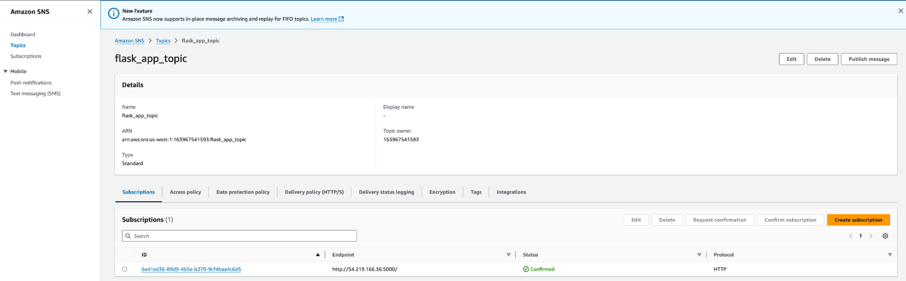
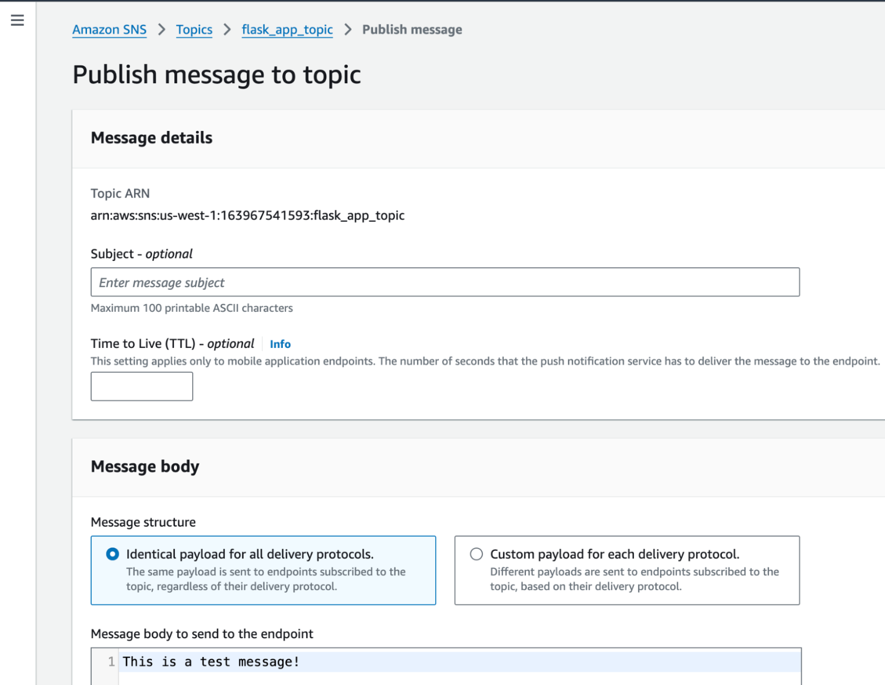
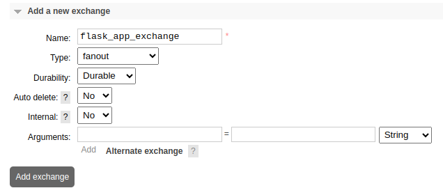
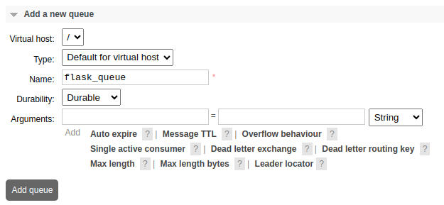
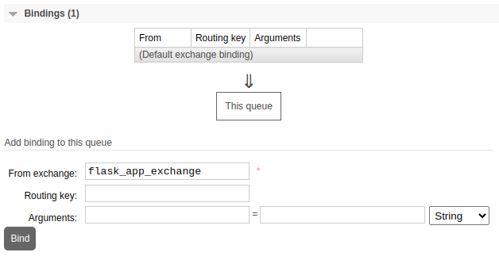
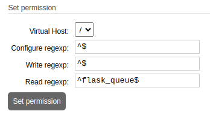
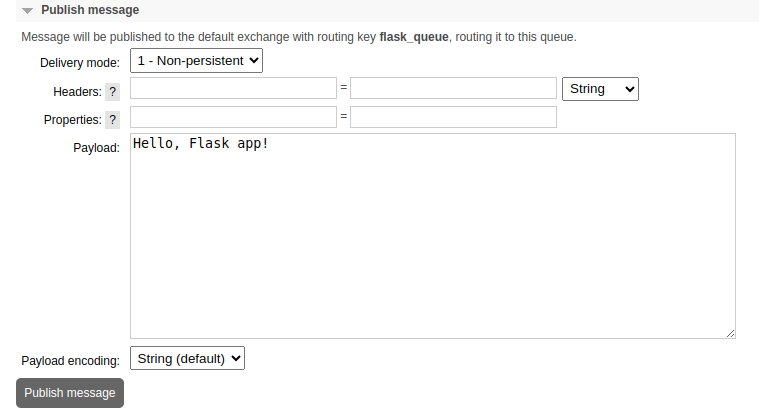

Amazon Web Services (AWS) Simple Notification Service (SNS) is a fully managed, topic-based messaging service used for event-driven architectures and decoupled applications.

RabbitMQ is an open source alternative message broker that uses queue-based messaging to provide greater customization and control over message routing and delivery patterns. Migrating to RabbitMQ offers developers more control over their messaging systems, with features like advanced routing and multi-protocol support not supported by SNS.

This guide covers how to migrate from AWS SNS to RabbitMQ running on Linode.

## Feature Comparison

AWS SNS and RabbitMQ serve similar purposes, but they have their differences:

| Feature | AWS SNS | RabbitMQ |
| ----- | ----- | ----- |
| **Architecture** | Topic-based (pub/sub model) | Queue-based (AMQP standard; pub/sub and point-to-point) |
| **Message Routing** | Uses topics; broadcasts messages to all subscribers | Flexible routing via exchanges and queues |
| **Delivery Semantics** | Best-effort, at-least-once delivery | Configurable (acknowledgments, at-most-once, at-least-once, exactly-once) |
| **Durability** | No message persistence; ephemeral by default | Configurable persistence; durable queues supported |
| **Message Ordering** | Generally unordered | FIFO and priority queues supported |
| **Supported Protocols** | HTTP/S, email, SMS, mobile push, Lambda | AMQP, MQTT, STOMP, HTTP |
| **Use Cases** | Notifications, alerts, fanout messaging | Complex workflows, task queues, custom routing |
| **Scaling** | Auto-scaling with AWS infrastructure | Can scale but may need manual clustering and tuning |
| **Managed Service** | Fully managed (AWS handles scaling and maintenance) | Self-hosted or managed (like CloudAMQP) but requires more operational management |
| **Integration with AWS** | Native AWS integration, seamless with services like Lambda | Integrates but requires custom setup on AWS |

## Before You Begin

1.  Read our [Getting Started with Linode](https://techdocs.akamai.com/cloud-computing/docs/getting-started) guide, and create a Linode account if you do not already have one.

1.  Migrating from AWS SNS to RabbitMQ on Linode, requires choosing between a single Linode Compute Instance or a larger scale, more fault-tolerant environment with the Linode Kubernetes Engine (LKE). Follow the appropriate guide below based on your needs:

    -   [Deploy RabbitMQ through the Linode Marketplace](https://www.linode.com/marketplace/apps/linode/rabbitmq/)
    -   [Deploying RabbitMQ on a Linode Compute Instance]()
    -   [Deploying RabbitMQ on Kubernetes with Linode LKE]()

1.  You must have access to your AWS account with sufficient permissions to work with SNS topics.


This guide is written for a non-root user. Commands that require elevated privileges are prefixed with `sudo`. If you’re not familiar with the `sudo` command, see the [Users and Groups](/docs/guides/linux-users-and-groups/) guide.


## Migrate from AWS SNS to RabbitMQ

RabbitMQ exchanges provide various routing mechanisms to handle message delivery:

-   **Direct** exchanges deliver messages to queues with a specific routing key.
-   **Topic** exchanges enable pattern-based routing, which allow wildcard matches.
-   **Fanout** exchanges broadcast messages to all bound queues, similar to SNS topics.
-   **Header** exchanges route messages based on their headers for more nuanced filtering.

Migrating your messaging broker service also involves porting any applications that depend on AWS SNS to use RabbitMQ instead. This guide uses an [example Flask application](https://github.com/linode/docs-cloud-projects/tree/main/demos/rabbitmq-migrations-main) that is subscribed to an SNS topic.

### Assess Current Messaging Needs

In the example project, AWS SNS provides multiple topics for publishing messages. The AWS Console UI displays the current subscribers for each topic. This provides guidance as to which services would need to be updated after migrating to RabbitMQ.



AWS provides a UI for publishing messages to all subscribers of a topic. This has a similar interface to `rabbitmqadmin` for command line interactions with topics.



This message should appear in the example application’s logs as the following:

```output
INFO:app:Notification
INFO:app:Received SNS message: This is a test message!
```

### Convert Authentication to be Compatible with RabbitMQ

RabbitMQ does not work with AWS IAM. As an alternative, select an authentication method compatible with RabbitMQ, such as username/password or SSL/TLS certificates. This guide uses username/password for authentication. The following steps create a new read-only RabbitMQ user (e.g. `flaskappuser`) to interact with the example Flask application.

1.  To create a new user, open a Web browser and navigate to the following URL, replacing  with the actual external IP Address of your Linode instance or LKE node:

    ```command
    http://:15672
    ```

1.  Log in to the RabbitMQ web interface as an administrator user.

    
    If you set up RabbitMQ manually on a single Linode instance, the default administrative username (`guest`) and password (`guest`) are only permitted to log in via `localhost`. Therefore, you must create a new administrative user.

    1. Use the following command to create a new RabbbitMQ user:

        ```command
        rabbitmqctl add_user  
        ```

    1.  The following commands tag that user as an `administrator` and grant them administrative permissions:

        ```command
        rabbitmqctl set_user_tags <username> administrator
        rabbitmqctl set_permissions -p / <username> ".*" ".*" ".*"
        ```
    

1.  Open the **Admin** tab and click the **Add user** button. Provide a **Username** (e.g. `flaskappuser`) and **Password** and apply the **Monitoring** tag:

    

1.  Take note of the username/password for the newly created RabbitMQ user, as you need to add these credentials to your Flask application.


It's best practice to create a separate set of credentials for each application that interacts with RabbitMQ.


### Create RabbitMQ Exchange and Queue Your Application

1.  To create a new exchange for your application, open the **Exchanges** tab. Under **Add a new exchange**, provide a **Name** (e.g. `flask_app_exchange`) and set the **Type** to `fanout`. Leave the default values in the rest of the fields, then click **Add exchange**:

    

1.  To create a new queue, open the **Queues and Streams** tab. Under **Add a new queue**, specify a **Name** (e.g. `flask_queue`) and leave the default values in the rest of the fields, then click **Add queue**:

    

1.  Select the name of the newly created queue in the list to bring up its details. Expand the **Bindings** section and add a new binding by setting **From exchange** to the name of the newly created exchange (e.g. `flask_app_exchange`), then click **Bind**:

    


It's best practice to create a distinct exchange and queue for each application.


### Set Permissions for RabbitMQ User

Return to the **Admin** page and click the newly created user to bring up their permission details. Set the permissions for the user as follows:



-   The **Configure** permission allows the user to create or modify queues. By setting this to the regular expression `^$`, you are prohibiting this user from making and configuration changes. Your application assumes the queue(s) it subscribes to already exist.
-   The **Write** permission allows the user to publish messages to the queue. The example application in this guide does not write to the queue, so specifying `^$` denies write access.
-   The **Read** permission, set to `^flask_queue$`, grants the user read access to `flask_queue`, which you created above.

### Configure Example Flask Server

This guide demonstrates the migration process using an [example Flask server](https://github.com/nathan-gilbert/simple-ec2-cloudwatch) that reads messages from RabbitMQ.

1.  If you do not already have a virtual machine to use, create a Compute Instance (a simple Nanode is sufficient). See our [Getting Started with Linode](/docs/products/platform/get-started/) and [Creating a Compute Instance](/docs/products/compute/compute-instances/guides/create/) guides.

1.  Follow our [Setting Up and Securing a Compute Instance](/docs/products/compute/compute-instances/guides/set-up-and-secure/) guide to update your system and create a limited user account. You may also wish to set the timezone, configure your hostname, and harden SSH access.

1.  Change to your user’s home directory and use `git` to clone the example Flask app's GitHub repository to your compute instance:

    ```command
    cd ~
    git clone https://github.com/linode/docs-cloud-projects/tree/main/demos/rabbitmq-migrations-main.git
    ```

### Convert Existing Applications from AWS SNS to RabbitMQ

In the example project, the Flask application communicates directly to AWS SNS using the `boto3` library provided by AWS. In order to use RabbitMQ, be sure to carefully switch corresponding code from AWS tooling to RabbitMQ. For Python applications, RabbitMQ support is provided through the [Pika](https://pypi.org/project/pika/) library, which is an AMQP provider with RabbitMQ bindings.

1.  Use `apt` to install the required libraries for RabbitMQ communication (Pika) and the web application framework (Flask):

    ```command
    sudo apt install python3-pika python3-flask
    ```

1.  Edit the [`app.py`](https://github.com/linode/docs-cloud-projects/blob/main/demos/rabbitmq-migrations-main/rabbitmq-changes/app.py) file located in the `rabbitmq-changes/rabbitmq-migrations` directory to apply the changes required to subscribe to the `flask_queue`:

    ```command
    nano ~/rabbitmq-migrations-main/rabbitmq-changes/app.py
    ```

    The resulting file should look like this, replacing ,  and  with your actual RabbitMQ IP address, username, and password:

    ```file {title="app.py" lang="python" hl_lines="23,25"}
    from flask import Flask
    import pika
    import threading
    import json
    import logging

    logging.basicConfig(level=logging.INFO)

    app = Flask(__name__)

    def rabbitmq_listener():
        """
        Opens listener to the desired RabbitMQ queue and handles incoming messages
        """
        def callback(ch, method, properties, body):
            """
            Callback function to handle incoming messages from RabbitMQ
            """
            app.logger.info(body.decode('utf-8'))
            # Do other processing here as needed on messages

        connection = pika.BlockingConnection(pika.ConnectionParameters(
            host="",
            port=5672,
            credentials=pika.PlainCredentials("", ""),
        ))

        channel = connection.channel()
        channel.basic_consume(queue="flask_queue", on_message_callback=callback, auto_ack=True)
        app.logger.info("Started listening to RabbitMQ...")
        channel.start_consuming()

    # Start RabbitMQ listener in a separate thread
    listener_thread = threading.Thread(target=rabbitmq_listener, daemon=True)
    listener_thread.start()

    @app.route("/", methods=["GET"])
    def default_handler():
        app.logger.info("Request received.")
        return "RabbitMQ Listener Active", 200

    if __name__ == "__main__":
        app.run(host="0.0.0.0", port=5000)
    ```

    Press <kbd>CTRL</kbd>+<kbd>X</kbd>, followed by <kbd>Y</kbd> then <kbd>Enter</kbd> to save the file and exit `nano`.

1.  Run the updated application:

    ```command
    python3 app.py
    ```

    Ensure the logs show `Started listening to RabbitMQ...`, indicating a successful connection and listener setup:

    ```output
     * Serving Flask app 'app'
     * Debug mode: off
    INFO:pika.adapters.utils.connection_workflow:Pika version 1.3.2 connecting to ('172.235.61.66', 5672)
    INFO:pika.adapters.utils.io_services_utils:Socket connected: <socket.socket fd=9, family=AddressFamily.AF_INET, type=SocketKind.SOCK_STREAM, proto=6, laddr=('192.168.86.203', 50052), raddr=('172.235.61.66', 5672)>
    ...
    INFO:werkzeug:Press CTRL+C to quit
    INFO:app:Started listening to RabbitMQ...
    ```

1.  Next, publish a message to the queue where this application has subscribed. Return to the RabbitMQ Web UI in your browser and log in using your administrative credentials (*not* `flaskappuser`):

    ```command
    http://:15672
    ```

1.  Open the **Queues and Streams** tab and select `flask_queue` from the list of queues. Expand **Publish message** and enter a message in the **Payload** section (e.g. `Hello, Flask app!`), then click **Publish message**:

    

    In the log output for the running Python application, you should see an update with the message from the subscribed queue:

    ```output
    INFO:app:Hello, Flask app!
    ```

## Production Considerations

Several considerations ought to be weighed when migrating from AWS SNS to RabbitMQ for application messaging, including authentication, security, performance, and overall architecture.

### Authentication and Authorization

AWS SNS typically uses IAM roles and policies for authentication, while RabbitMQ supports multiple methods like username/password and OAuth2. For production-level security, RabbitMQ should use federated authentication services or certificates. Also consider implementing access controls through RabbitMQ’s virtual hosts and user permissions to match or exceed the granular controls SNS provides with IAM policies.

### Message Reliability, Durability, and Delivery

RabbitMQ offers persistent storage for messages by default. You can also configure queues to be durable, meaning they can survive a RabbitMQ broker restart.

RabbitMQ offers different delivery guarantees that help control message reliability and how it behaves under failure scenarios:

-   **At-least-once delivery** delivers messages to consumers at least once. This is the default delivery model in RabbitMQ.
-   **At-most-once delivery** removes messages from the queue as soon as they are sent to the consumer. This mode is generally suitable for non-critical or low-stakes messages.

To handle messages that can’t be processed after multiple retries, configure a Dead-Letter Exchange (DLX). A DLX redirects unprocessed messages to a separate queue after exceeding the configured retry limit. A DLX is a best practice to mitigate temporary outages or network errors that cause message failures, retrying delivery without affecting primary processing. Failed messages can be inspected or logged for later analysis after landing the DLX.

Adopt the following best practices for delivery and ordering:

-   When ordering is critical, use a single consumer per queue to avoid parallel consumption.
-   For messages with critical processing requirements, implement deduplication to avoid issues from at-least-once delivery.
-   Use manual acknowledgment to control when messages are marked as processed and ensure that RabbitMQ can deliver unacknowledged messages again.
-   Use DLX for retry handling and separating failed messages for special processing, preventing interference with successful message flows.

### Monitoring and Observability

SNS includes AWS CloudWatch metrics by default. Basic monitoring of RabbitMQ is available through the RabbitMQ Management plugin. You can also use tools such as Prometheus and Grafana for real-time performance tracking.

### Scaling, Load Balancing, and Availability

RabbitMQ supports clustering and federation for scaling, though it doesn’t offer auto-scaling like AWS SNS does. For load balancing, configure multiple nodes and use connection sharding.

Set up cross-node distribution by configuring queues and connections across multiple nodes to balance load. Avoid single points of failure by ensuring that both applications and consumers can failover to different nodes within the cluster.

If RabbitMQ nodes span different data centers, use the [Federation](https://www.rabbitmq.com/docs/federation) or [Shovel](https://www.rabbitmq.com/docs/shovel) plugins. Federation allows controlled mirroring across remote clusters, while Shovel enables continuous transfer of messages from one RabbitMQ instance to another, even across data centers.

Use persistent storage for durable messages and mirrored or quorum queues that require substantial disk I/O. When taking this approach, ensure that disks have enough I/O capacity. Enable disk alarms in RabbitMQ to prevent scenarios where disk space runs out, which could lead to node crashes.