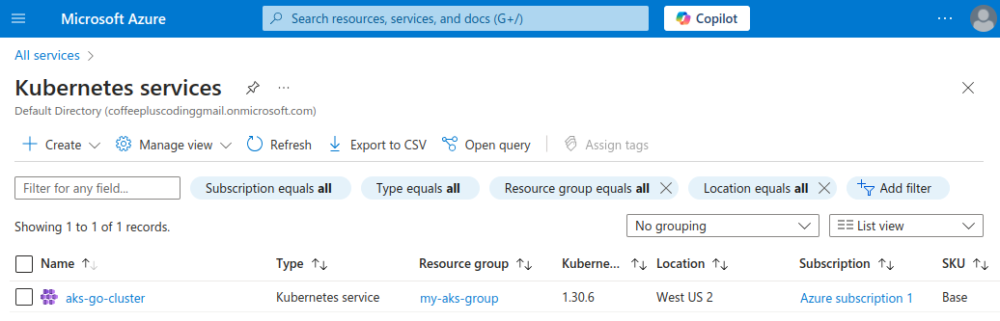

This guide walks you through the process of migrating an application from Azure Kubernetes Engine (AKS) to Linode Kubernetes Engine (LKE). To keep the scope of this guide manageable, the example application is a simple REST API service.

## Before You Begin

1.  Read the [Getting Started with Linode](https://techdocs.akamai.com/cloud-computing/docs/getting-started) guide and create a Linode account if you do not already have one.

1.  Create a personal access token using the instructions in the [Manage personal access tokens](https://techdocs.akamai.com/cloud-computing/docs/manage-personal-access-tokens) guide.

1.  Install the Linode CLI using the instructions in the [Install and configure the CLI](https://techdocs.akamai.com/cloud-computing/docs/install-and-configure-the-cli) guide.

1.  Follow the steps in the *Install `kubectl`* section of the [Getting started with LKE](https://techdocs.akamai.com/cloud-computing/docs/getting-started-with-lke-linode-kubernetes-engine#install-kubectl) guide to install `kubectl`.

1.  You must have access to your Azure account with sufficient permissions to work with AKS clusters. The [Azure CLI](https://learn.microsoft.com/en-us/cli/azure/install-azure-cli) must also be installed and configured.

1.  Install [`jq`](docs/guides/using-jq-to-process-json-on-the-command-line/#install-jq-with-package-managers), a lightweight command line JSON processor.

1.  Install [`yq`](https://github.com/mikefarah/yq), a YAML processor for the command line.


This guide is written for a non-root user. Commands that require elevated privileges are prefixed with `sudo`. If you’re not familiar with the `sudo` command, see the [Users and Groups](/docs/guides/linux-users-and-groups/) guide.


## Connect `kubectl` to Your AKS Cluster

[Connect `kubectl` to the AKS cluster](https://learn.microsoft.com/en-us/azure/aks/control-kubeconfig-access) that you want to migrate. Skip this step if your local machine already has a kubeconfig file with your AKS cluster information.

1.  In the Azure portal, search the available services for the **Kubernetes services** option and navigate to that page:

    

1.  Find the name and resource group of your AKS cluster.

    

    In the example above, the cluster name is `aks-go-cluster`, and its resource group is `my-aks-group`.

1.  Use the Azure CLI to update your local kubeconfig file with your AKS cluster information:

    ```command
    az aks get-credentials \
      --resource-group my-aks-group \
      --name aks-go-cluster \
      --admin
    ```

    ```output
    The behavior of this command has been altered by the following extension: aks-preview
    Merged "aks-go-cluster" as current context in /home/user/.kube/config
    ```

1.  If your `kubeconfig` file includes multiple clusters, use the following command to list the available contexts:

    ```command
    kubectl config get-contexts
    ```

1.  Identify the context name for your AKS cluster, then set it to the active context, for example:

    ```command
    kubectl config use-context aks-go-cluster
    ```

### Assess Your AKS Cluster

1.  Run the following `kubectl` command to verify that the AKS cluster is operational:

    ```command
    kubectl cluster-info
    ```

    ```output
    Kubernetes control plane is running at https://aks-go-clu-my-aks-group-219c80-iil863ok.hcp.westus2.azmk8s.io:443
    CoreDNS is running at https://aks-go-clu-my-aks-group-219c80-iil863ok.hcp.westus2.azmk8s.io:443/api/v1/namespaces/kube-system/services/kube-dns:dns/proxy
    Metrics-server is running at https://aks-go-clu-my-aks-group-219c80-iil863ok.hcp.westus2.azmk8s.io:443/api/v1/namespaces/kube-system/services/https:metrics-server:/proxy

    To further debug and diagnose cluster problems, use 'kubectl cluster-info dump'.
    ```

1.  For more detailed information at the command line, run this command:

    ```command
    kubectl cluster-info dump
    ```


Detailed information about your cluster is also available in the Azure portal.




### Review the Node

1.  Retrieve the name of the first (and only) node with the following command:

    ```command
    kubectl get nodes
    ```

    ```output
    NAME                                STATUS   ROLES    AGE   VERSION
    aks-nodepool1-23390877-vmss000000   Ready    <none>   11m   v1.30.6
    ```

1.  To retrieve more information about this node, run the following command:

    ```command
    kubectl get node aks-nodepool1-23390877-vmss000000 -o yaml
    ```

    The above command retrieves all the information about the node in YAML format.

1.  Run the previous command through a pipe to filter for specific fields (e.g. allocatable CPU and memory):

    ```command
    kubectl get node aks-nodepool1-23390877-vmss000000 -o yaml \
      | yq '.status.allocatable | {"cpu": .cpu, "memory": .memory}' \
      | awk -F': ' ' /cpu/ {cpu=$2} /memory/ {mem=$2} \
          END {printf "cpu: %s\nmemory: %.2f Gi\n", cpu, mem / 1024 / 1024}'
    ```

    ```output
    cpu: 1900m
    memory: 4.92 Gi
    ```

### Verify the Application Is Running

For this guide, a [REST API service application written in Go](https://github.com/linode/docs-cloud-projects/tree/main/demos/go-quote-service-main) is deployed to the example AKS cluster. This service allows you to add a quote (a string) to a stored list, or to retrieve that list. Deploying the application creates a Kubernetes [Deployment](https://kubernetes.io/docs/concepts/workloads/controllers/deployment/), [Service](https://kubernetes.io/docs/concepts/services-networking/service/), and [HorizontalPodAutoscaler](https://kubernetes.io/docs/tasks/run-application/horizontal-pod-autoscale/).

The manifest (`manifest.yaml`) for deploying this application is as follows:

```file {title="manifest.yaml" lang="yaml"}
| apiVersion: apps/v1
kind: Deployment
metadata:
  name: go-quote
  labels:
    app: go-quote
spec:
  replicas: 1
  selector:
    matchLabels:
      app: go-quote
  template:
    metadata:
      labels:
        app: go-quote
    spec:
      containers:
        - name: go-quote
          image: linodedocsg1g1/go-quote-service:latest
          ports:
            - containerPort: 7777
          resources:
            requests:
              cpu: "100m"
              memory: "128Mi"
            limits:
              cpu: "250m"
              memory: "256Mi"
---
apiVersion: v1
kind: Service
metadata:
  name: go-quote-service
  labels:
    app: go-quote
spec:
  type: LoadBalancer
  ports:
    - port: 80
      targetPort: 7777
  selector:
    app: go-quote
---
apiVersion: autoscaling/v2
kind: HorizontalPodAutoscaler
metadata:
  name: go-quote-hpa
  labels:
    app: go-quote
spec:
  scaleTargetRef:
    apiVersion: apps/v1
    kind: Deployment
    name: go-quote
  minReplicas: 1
  maxReplicas: 1
  metrics:
    - type: Resource
      resource:
        name: cpu
        target:
          type: Utilization
          averageUtilization: 50
```

1.  With the application deployed, run the following `kubectl` command to verify that the deployment is available:

    ```command
    kubectl get deploy
    ```

    ```output
    NAME       READY   UP-TO-DATE   AVAILABLE   AGE
    go-quote   1/1     1            1           46s
    ```

1.  Run the following `kubectl` command to retrieve the external IP address assigned to the service:

    ```command
    kubectl get services
    ```

    The service is a [LoadBalancer](https://kubernetes.io/docs/concepts/services-networking/service/#loadbalancer), which means it can be accessed from outside the cluster:

    ```output
    NAME               TYPE           CLUSTER-IP   EXTERNAL-IP     PORT(S)        AGE
    go-quote-service   LoadBalancer   10.0.80.37   52.250.81.212   80:30398/TCP   83s
    kubernetes         ClusterIP      10.0.0.1     <none>          443/TCP        2m14s
    ```

1.  Test the service by adding a quote:

    ```command
    curl -X POST \
      --data '{"quote":"This is my first quote."}' \
      /quotes
    ```

1.  Add a second quote:

    ```command
    curl -X POST \
      --data '{"quote":"This is my second quote."}' \
      /quotes
    ```

1.  Now retrieve the stored quotes:

    ```command
    curl /quotes
    ```

    This should yield the following result:

    ```output
    ["This is my first quote.","This is my second quote."]
    ```

After verifying that your AKS cluster is fully operational and running a live service, you are ready for migration.

## Provision an LKE Cluster

When migrating from AKS to LKE, provision an LKE cluster with similar resources to run the same workloads. While there are several ways to create a Kubernetes cluster on Akamai Cloud, this guide uses the [Linode CLI](https://github.com/linode/linode-cli) to provision resources.

1.  Use the Linode CLI (`linode`) to see available Kubernetes versions:

    ```command
    linode lke versions-list
    ```

    ```output
    ┌──────┐
    │ id   │
    ├──────┤
    │ 1.32 │
    ├──────┤
    │ 1.31 │
    ├──────┤
    │ 1.30 │
    └──────┘
    ```

    Unless specific requirements dictate otherwise, it’s generally recommended to provision the latest version of Kubernetes.

1.  Determine the type of Linode to provision. The example AKS cluster configuration uses nodes with two CPUs and 8 GB of memory. To find a Linode type with a similar configuration, run the following command with the Linode CLI:

    ```command
    linode linodes types --vcpus 2 --json --pretty \
      | jq '.[] | {class, id, vcpus, memory, price}'
    ```

    ```output
    {
      "class": "standard",
      "id": "g6-standard-2",
      "vcpus": 2,
      "memory": 4096,
      "price": { ... }
    }
    {
      "class": "highmem",
      "id": "g7-highmem-1",
      "vcpus": 2,
      "memory": 24576,
      "price": { ... }
    }
    {
      "class": "highmem",
      "id": "g7-highmem-2",
      "vcpus": 2,
      "memory": 49152,
      "price": { ... }
    }
    {
      "class": "dedicated",
      "id": "g6-dedicated-2",
      "vcpus": 2,
      "memory": 4096,
      "price": { ... }
    }
    {
      "class": "premium",
      "id": "g7-premium-2",
      "vcpus": 2,
      "memory": 4096,
      "price": { ... }
    }
    ```

    See [Akamai Connected Cloud: Pricing](https://www.linode.com/pricing/) for more detailed pricing information.

1.  The examples in this guide use the **g6-standard-2** Linode, which features two CPU cores and 4 GB of memory. Run the following command to display detailed information in JSON for this Linode plan:

    ```command
    linode linodes types --label "Linode 4GB" --json --pretty
    ```

    ```output
    [
      {
        "addons": { ... },
        "class": "standard",
        "disk": 81920,
        "gpus": 0,
        "id": "g6-standard-2",
        "label": "Linode 4GB",
        "memory": 4096,
        "network_out": 4000,
        "price": { ... },
        "region_prices": [ ... ],
        "successor": null,
        "transfer": 4000,
        "vcpus": 2
      }
    ]
    ```

1.  View available regions with the `regions list` command:

    ```command
    linode regions list
    ```

1.  After selecting a Kubernetes version and Linode type, use the following command to create a cluster named `aks-to-lke` in the `us-mia` (Miami, FL) region with three nodes and auto-scaling. Replace `aks-to-lke` and `us-mia` with a cluster label and region of your choosing, respectively:

    ```command
    linode lke cluster-create \
    --label aks-to-lke \
    --k8s_version 1.32 \
    --region us-mia \
    --node_pools '[{
      "type": "g6-standard-2",
      "count": 1,
      "autoscaler": {
        "enabled": true,
        "min": 1,
        "max": 3
      }
    }]'
    ```

    After creating your cluster successfully, you should see output similar to the following:

    ```output
    Using default values: {}; use the --no-defaults flag to disable defaults
    ┌────────┬────────────┬────────┬─────────────┬──────────────────────────┬──────┐
    │ id     │ label      │ region │ k8s_version │ control_plane.high_avai… │ tier │
    ├────────┼────────────┼────────┼─────────────┼──────────────────────────┼──────┤
    │ 343326 │ aks-to-lke │ us-mia │ 1.32        │ False                    │      │
    └────────┴────────────┴────────┴─────────────┴──────────────────────────┴──────┘
    ```

## Access the Kubernetes Cluster

To access your cluster, fetch the cluster credentials as a `kubeconfig` file.

1.  Use the following command to retrieve the cluster’s ID:

    ```command
    CLUSTER_ID=$(linode lke clusters-list --json | \
      jq -r \
        '.[] | select(.label == "eks-to-lke") | .id')
    ```

1.  Retrieve the `kubeconfig` file and save it to `~/.kube/lke-config`:.

    ```command
    linode lke kubeconfig-view --json "$CLUSTER_ID" | \
      jq -r '.[0].kubeconfig' | \
      base64 --decode > ~/.kube/lke-config
    ```

1.  After saving the `kubeconfig`, access your cluster by using `kubectl` and specifying the file:

    ```command
    kubectl get no --kubeconfig ~/.kube/lke-config
    ```

    ```output
    NAME                            STATUS   ROLES    AGE   VERSION
    lke289125-478490-4569f8b60000   Ready    <none>   85s   v1.32.0
    ```

    One node is ready, and it uses Kubernetes version 1.32.

1.  Next, verify the cluster's health and readiness for application deployment.

    ```command
    kubectl cluster-info --kubeconfig ~/.kube/lke-config
    ```

    ```output
    Kubernetes control plane is running at https://fa127859-38c1-4e40-971d-b5c7d5bd5e97.us-lax-2.linodelke.net:443
    KubeDNS is running at https://fa127859-38c1-4e40-971d-b5c7d5bd5e97.us-lax-2.linodelke.net:443/api/v1/namespaces/kube-system/services/kube-dns:dns/proxy

    To further debug and diagnose cluster problems, use 'kubectl cluster-info dump'.
    ```

## Migrate from AKS to LKE

In some cases, migrating Kubernetes applications requires an incremental approach, as moving large interconnected systems all at once isn’t always practical.

For example, if **Service A** interacts with **Services B, C, and D**, you may be able to migrate **Services A and B** together to LKE, where they can communicate efficiently. However, **Services C and D** may still rely on Azure infrastructure or native services, making their migration more complex.

In this scenario, you may need to temporarily run **Service A** on both Azure AKS and LKE. **Service A on LKE** would interact with **Service B on LKE**, while the version on **Service A on Azure AKS** continues communicating with **Services C and D**. This setup minimizes disruptions while you work through the complexities of migrating the remaining services to LKE. Although cross-cloud communication incurs higher latency and costs, this approach helps maintain functionality during the transition.

This guide covers the key steps required to migrate the example application from AKS to LKE.

### Assess Current Workloads and Dependencies in AKS

Ensure that `kubectl` uses the original `kubeconfig` file with the AKS cluster context.

```command
kubectl get all --context aks-go-cluster
```

The output shows the running pod and the one active replica set created by the deployment:

```output
NAME                           READY   STATUS    RESTARTS   AGE pod/go-quote-c575f6ccb-2gckb   1/1     Running   0          97s

NAME                       TYPE           CLUSTER-IP     EXTERNAL-IP      PORT(S)        AGE
service/go-quote-service   LoadBalancer   10.0.80.37     52.250.81.212   80:30398/TCP   97s
service/kubernetes         ClusterIP      10.0.0.1       <none>           443/TCP        22m

NAME                       READY   UP-TO-DATE   AVAILABLE   AGE
deployment.apps/go-quote   1/1     1            1           97s

NAME                                 DESIRED   CURRENT   READY   AGE
replicaset.apps/go-quote-c575f6ccb   1         1         1       97s

NAME                                               REFERENCE             TARGETS              MINPODS   MAXPODS   REPLICAS   AGE
horizontalpodautoscaler.autoscaling/go-quote-hpa   Deployment/go-quote   cpu: <unknown>/50%   1         1         1          98s
```


By default, `kubectl get all` only displays resources in the `default` namespace. If your workloads are deployed in a different namespace (recommended for production clusters), use:

```command
kubectl get all --namespace=
```


### Export Kubernetes Manifests of Azure AKS

There are multiple ways to define the resources you want to deploy to Kubernetes, including YAML manifests, Kustomize configurations, and Helm charts. For consistency and version control, store these in a git repository and deploy them via your CI/CD pipeline. The guide uses plain YAML manifests as the example.

### Update Manifests for Compatibility with LKE

You may need to update your manifests to accommodate for differences between AKS and LKE. For example, your configuration on AKS may use [ingress services from AKS](https://learn.microsoft.com/en-us/azure/aks/concepts-network-ingress) and the [Azure LoadBalancer Service](https://learn.microsoft.com/en-us/azure/aks/concepts-network-services#loadbalancer) to provide access to clients located outside of your AKS cluster. As an alternative to using these Azure services, you can [deploy a dedicated NGINX Ingress on LKE](/docs/guides/deploy-nginx-ingress-on-lke/).

The deployment image may point to Azure Container Registry. Modify this to point to an alternative registry. For example, the `Deployment` section of your application manifest may look like this:

```file
apiVersion: apps/v1
kind: Deployment
metadata:
...
spec:
  ...
  template:
    ...
    spec:
      containers:
        - name: go-quote
          image: gqimages.azurecr.io/go-quote-service:latest
          ...
```

The container image, pointing to Microsoft Container Registry, has the following format:

```command
.azurecr.io/:
```

To migrate away from Azure Container Registry, upload the container image to another registry service (e.g. Docker Hub) or [Set Up a Docker Registry with LKE and Object Storage](/docs/guides/how-to-setup-a-private-docker-registry-with-lke-and-object-storage/). Then, modify your Kubernetes manifest to point to the new location for your image.


Since the image for the example service application in this guide comes from Docker Hub, redirecting the registry is unnecessary.


### Transfer Persistent Data

If the workload depends on persistent data in Azure Storage or a database, then transfer the data or make it available to LKE.


The example application, with its in-memory configuration, does not rely on any persistent data.


### Deploy Workloads to LKE

Deploy your application to the newly created LKE cluster.

1.  Verify the current `kubectl` context to ensure you are pointing to the `kubeconfig` file for the LKE cluster.

    ```command
    kubectl config current-context --kubeconfig ~/.kube/lke-config
    ```

    ```output
    lke289125-ctx
    ```

1.  Apply the same `manifest.yaml` file used to deploy your application to AKS, but this time on your LKE cluster:

    ```command
    kubectl apply --kubeconfig ~/.kube/lke-config -f manifest.yaml
    ```

    ```output
    deployment.apps/go-quote created
    service/go-quote-service created
    horizontalpodautoscaler.autoscaling/go-quote-hpa created
    ```

### Validate Application Functionality

Verify that the deployment and the service were created successfully.

1.  With the application deployed, run the following `kubectl` command to verify that the deployment is available:

    ```command
    kubectl get deploy --kubeconfig ~/.kube/lke-config
    ```

    ```output
    NAME       READY   UP-TO-DATE   AVAILABLE   AGE
    go-quote   1/1     1            1           108s
    ```

1.  Run the following `kubectl` command to retrieve the external IP address assigned to the service:

    ```command
    kubectl get service --kubeconfig ~/.kube/lke-config
    ```

    The service exposes a public IP address to the REST API service (e.g. `172.235.44.28`):

    ```output
    NAME               TYPE           CLUSTER-IP       EXTERNAL-IP     PORT(S)        AGE
    go-quote-service   LoadBalancer   10.128.183.194   172.235.44.28   80:30407/TCP   117s
    kubernetes         ClusterIP      10.128.0.1       <none>          443/TCP        157m
    ```

1.  Test the service by adding a quote:

    ```command
    curl -X POST \
      --data '{"quote":"This is my first quote for LKE."}' \
      172.235.44.28/quotes
    ```

1.  Add a second quote:

    ```command
    curl -X POST \
      --data '{"quote":"This is my second quote for LKE."}' \
      172.235.44.28/quotes
    ```

1.  Now retrieve the stored quotes:

    ```command
    curl 172.235.44.28/quotes
    ```

    ```output
    ["This is my first quote for LKE.","This is my second quote for LKE."]
    ```

The REST API service is up and running on LKE. Point any services dependent on the AKS cluster deployment to the LKE cluster deployment instead. After testing and verifying the application running on LKE, you can terminate the AKS cluster.

## Additional Considerations and Concerns

When migrating from Azure AKS to LKE, there are several important factors to keep in mind, including cost management, data persistence, networking, security, and alternative solutions for cloud-specific services.

### Cost Management

Cost reduction is one reason an organization might migrate from Azure AKS to LKE. Typically, the compute cost of Kubernetes is the primary driver for migration. Use `kubectl` to find the instance type and capacity type for your AKS instance.

```command
kubectl get node aks-nodepool1-23390877-vmss000000 -o yaml \
  | yq .metadata.labels \
  | grep node.kubernetes.io/instance-type
```

```output
node.kubernetes.io/instance-type: Standard_DS2_v2
```

Reference the [Windows VM pricing page](https://azure.microsoft.com/en-us/pricing/details/virtual-machines/windows/) to find the cost for the Azure VM powering your AKS instance. Compare this with the cost of a Linode instance with comparable resources by examining the [Linode pricing page](https://www.linode.com/pricing/).

Additionally, applications with substantial data egress can be significantly impacted by egress costs. Consider the typical networking usage of applications running on your AKS cluster, and determine your outbound [costs for Azure bandwidth](https://azure.microsoft.com/en-us/pricing/details/bandwidth/#pricing). Compare this with data transfer limits allocated to your LKE nodes.

### Data Persistence and Storage

Cloud-native workloads are ephemeral. As a container orchestration platform, Kubernetes is designed to ensure your pods are up and running, with autoscaling to handle demand. However, it’s important to handle persistent data carefully. If you are in a position to impose a large maintenance window with system downtime, migrating data should be far simpler.

Should you need to perform a live migration with minimal downtime, you must develop proper migration procedures and test them in a non-production environment. This may include:

-   Parallel storage and databases on both clouds
-   Cross-cloud replication between storage and databases
-   Double writes at the application level
-   Failover reads at the application level
-   Switching the Azure storage and databases to read-only
-   Storage and database indirection at the configuration or DNS level

### Advanced Network Configuration

The Azure network model includes virtual networks, Azure Firewall, and different types of load balancers. For LKE, Akamai Cloud provides [NodeBalancers](https://www.linode.com/products/nodebalancers/), which are equivalent to application load balancers. If you use advanced features of Azure networking, adapting them to Akamai Cloud networking may require significant configuration changes.

For network security, you may need to port Azure Firewall rules to [Kubernetes Network Policies](https://kubernetes.io/docs/concepts/services-networking/network-policies/) on LKE.

### Security and Access Management

Azure AKS integrates Entra ID (formerly known as Azure Active Directory) with Kubernetes access. LKE uses standard Kubernetes user and service accounts, as well as [Kubernetes role-based access control (RBAC)](https://kubernetes.io/docs/reference/access-authn-authz/rbac/).

### DNS

If you use an independent DNS provider (e.g. Cloudflare) for your application, you must update various DNS records to point to LKE endpoints and NodeBalancers instead of AKS endpoints.

If you use Azure DNS and plan to migrate away from it, reference [Linode’s DNS manager](https://techdocs.akamai.com/cloud-computing/docs/dns-manager) as a migration option.

### Alternative to Azure Container Registry

LKE doesn't have its own container registry. To migrate away from Azure Container Registry, set up a third-party private container registry, such as [Docker Hub](https://hub.docker.com/) or [GitHub Container Registry](https://github.blog/news-insights/product-news/introducing-github-container-registry/).

Alternatively, you can set up your own container registry, see [How to Set Up a Docker Registry with LKE and Object Storage](/docs/guides/how-to-setup-a-private-docker-registry-with-lke-and-object-storage/) for instructions.

### Alternative to Google Cloud Operations Suite

Microsoft provides [Azure Monitor](https://learn.microsoft.com/en-us/azure/azure-monitor/) for Kubernetes cluster observability. With Akamai Cloud, you can install an alternative observability solution on LKE. One example of such a solution is [The Observability Stack (TOBS)](https://github.com/timescale/tobs), which includes:

-   Kube-Prometheus
    -   Prometheus
    -   AlertManager
    -   Grafana
    -   Node-Exporter
    -   Kube-State-Metrics
    -   Prometheus-Operator
-   Promscale
-   TimescaleDB
    -   Postgres-Exporter
-   OpenTelemetry-Operator

See [How to Deploy TOBS (The Observability Stack) on LKE](/docs/guides/deploy-tobs-on-linode-kubernetes-engine/) for more information.

### Alternative to Azure Key Vault

The [Azure Key Vault](https://learn.microsoft.com/en-us/azure/key-vault/general/overview) can be leveraged to provide Kubernetes secrets on Azure. With LKE, you need an alternative solution, such as OpenBao on Akamai Cloud.

## Resources

-   Azure AKS
    -   [Documentation](https://learn.microsoft.com/en-us/azure/aks/)
    -   [Connecting kubectl to an Azure AKS cluster](https://learn.microsoft.com/en-us/azure/aks/control-kubeconfig-access)
-   Linode
    -   [Akamai Connected Cloud: Pricing](https://www.linode.com/pricing/)
    -   [LKE Documentation](/docs/guides/kubernetes-on-linode/)
    -   [DNS Manager](https://techdocs.akamai.com/cloud-computing/docs/dns-manager)
-   Setting up other technologies to run on Linode
    -   [How to Set Up a Docker Registry with LKE and Object Storage](/docs/guides/how-to-setup-a-private-docker-registry-with-lke-and-object-storage/)
    -   [How to Deploy TOBS (The Observability Stack) on LKE](/docs/guides/deploy-tobs-on-linode-kubernetes-engine/)