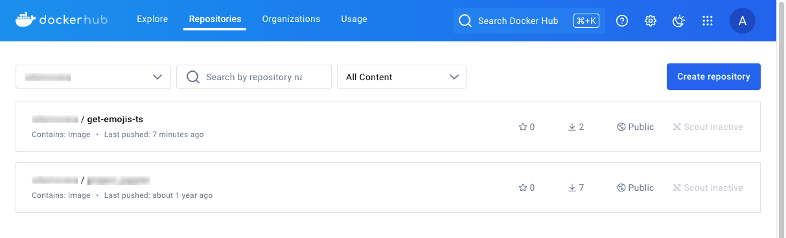
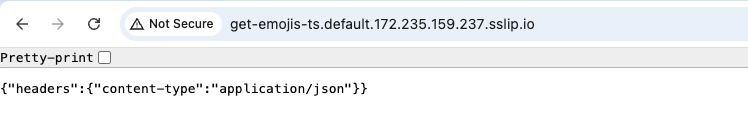
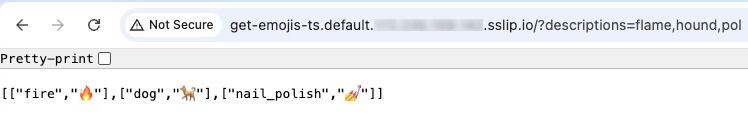
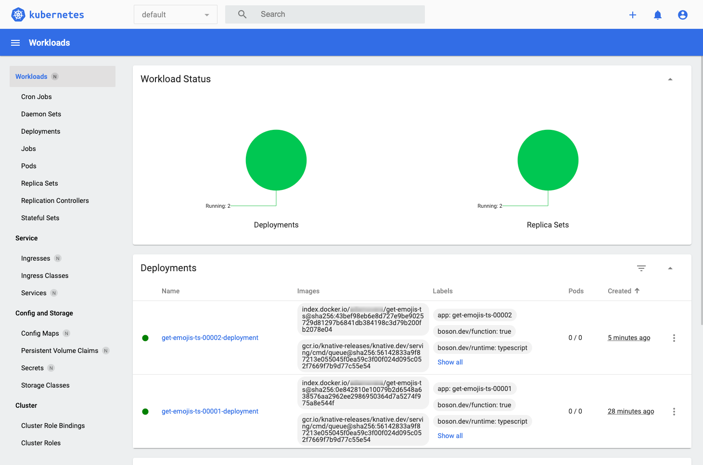

Knative is an open source platform that extends Kubernetes to manage serverless workloads. It provides tools to deploy, run, and manage serverless applications and functions, enabling automatic scaling and efficient resource utilization. Knative consists of several components:

-   **Serving**: Deploys and runs serverless containers.
-   **Eventing**: Managing event-driven architectures.
-   **Functions**: Deploys and runs functions locally and on Kubernetes.

This guide walks through the process of migrating an Azure function to a Knative function running on Linode Kubernetes Engine (LKE).

## Before You Begin

1.  Read our [Getting Started with Linode](/docs/products/platform/get-started/) guide, and create a Linode account if you do not already have one.

1.  Create a personal access token using the instructions in our [Manage personal access tokens](https://techdocs.akamai.com/cloud-computing/docs/manage-personal-access-tokens) guide.

1.  Follow the steps in the *Install kubectl* section of our [Getting started with LKE](https://techdocs.akamai.com/cloud-computing/docs/getting-started-with-lke-linode-kubernetes-engine) guide to install `kubectl`.

1.  Install the Linode CLI using the instructions in our [Install and configure the CLI](https://techdocs.akamai.com/cloud-computing/docs/install-and-configure-the-cli) guide.

1.  Follow the instruction in our [Installing and Using NVM (Node Version Manager)](/docs/guides/how-to-install-use-node-version-manager-nvm/) guide to install NVM and the latest Long Term Support (LTS) release of Node.

1.  Ensure that you have Knative's [`func` CLI](https://knative.dev/docs/functions/install-func/) installed.

1.  Ensure that you have [Docker](https://www.docker.com/products/docker-desktop/) installed and have a [Docker Hub](https://www.docker.com/products/docker-hub/) account.

1.  Ensure that you have [Git](https://git-scm.com/downloads) installed.

1.  Install `jq`, a lightweight command line JSON processor:

    ```command
    sudo apt install jq
    ```

1.  Install `tree`, a command line utility that displays directory structures in a tree-like format:

    ```command
    sudo apt install tree
    ```

1.  Install `npm`, a package manager for JavaScript that can install, update, and manage libraries:

    ```command
    sudo apt install npm
    ```


This guide is written for a non-root user. Commands that require elevated privileges are prefixed with `sudo`. If you’re not familiar with the `sudo` command, see the [Users and Groups](/docs/guides/linux-users-and-groups/) guide.


## Provision a Kubernetes Cluster

While there are several ways to create a Kubernetes cluster on Linode, this guide uses the [Linode CLI](https://github.com/linode/linode-cli) to provision resources.

1.  Use the Linode CLI command (`linode`) to see available Kubernetes versions:

    ```command
    linode lke versions-list
    ```

    ```output
    ┌──────┐
    │ id   │
    ├──────┤
    │ 1.31 │
    ├──────┤
    │ 1.30 │
    ├──────┤
    │ 1.29 │
    └──────┘
    ```

    It's generally recommended to provision the latest version of Kubernetes unless specific requirements dictate otherwise.

1.  Use the following command to list available Linode plans, including plan ID, pricing, and performance details. For more detailed pricing information, see [Akamai Connected Cloud: Pricing](https://www.linode.com/pricing):

    ```command
    linode linodes types
    ```

    This outputs information on different Linode plans, including pricing and performance details.

1.  The examples in this guide use the **g6-standard-2** Linode, which features two CPU cores and 4 GB of memory. Run the following command to display detailed information in JSON for this Linode plan:

    ```command
    linode linodes types --label "Linode 4GB" --json --pretty
    ```

    ```output
    [
      {
        "addons": {
          "backups": {
            "price": {
              "hourly": 0.008,
              "monthly": 5.0
            },
            "region_prices": [
              {
                "hourly": 0.009,
                "id": "id-cgk",
                "monthly": 6.0
              },
              {
                "hourly": 0.01,
                "id": "br-gru",
                "monthly": 7.0
              }
            ]
          }
        },
        "class": "standard",
        "disk": 81920,
        "gpus": 0,
        "id": "g6-standard-2",
        "label": "Linode 4GB",
        "memory": 4096,
        "network_out": 4000,
        "price": {
          "hourly": 0.036,
          "monthly": 24.0
        },
        "region_prices": [
          {
            "hourly": 0.043,
            "id": "id-cgk",
            "monthly": 28.8
          },
          {
            "hourly": 0.05,
            "id": "br-gru",
            "monthly": 33.6
          }
        ],
        "successor": null,
        "transfer": 4000,
        "vcpus": 2
      }
    ]
    ```

1.  View available regions with the `regions list` command:

    ```command
    linode regions list
    ```

1.  With a Kubernetes version and Linode type selected, use the following command to create a cluster named `knative-playground` in the `us-mia` (Miami, FL) region with three nodes and auto-scaling. Replace  and  with a cluster label and region of your choosing, respectively:

    ```command
    linode lke cluster-create \
      --label  \
      --k8s_version 1.31 \
      --region  \
      --node_pools '[{
        "type": "g6-standard-2",
        "count": 3,
        "autoscaler": {
          "enabled": true,
          "min": 3,
          "max": 8
        }
      }]'
    ```

    Once your cluster is successfully created, you should see output similar to the following:

    ```output
    Using default values: {}; use the --no-defaults flag to disable defaults
    ┌────────────────────┬────────┬─────────────┐
    │ label              │ region │ k8s_version │
    ├────────────────────┼────────┼─────────────┤
    │ knative-playground │ us-mia │ 1.31        │
    └────────────────────┴────────┴─────────────┘
    ```

### Access the Kubernetes Cluster

To access your Kubernetes cluster, fetch the cluster credentials in the form of a `kubeconfig` file.

1.  Use the following command to retrieve the cluster's ID:

    ```command
    CLUSTER_ID=$(linode lke clusters-list --json | \
        jq -r \
          '.[] | select(.label == "knative-playground") | .id')
    ```

1.  Create a hidden `.kube` folder in your user's home directory:

    ```command
    mkdir ~/.kube
    ```

1.  Retrieve the `kubeconfig` file and save it to `~/.kube/lke-config`:

    ```command
    linode lke kubeconfig-view --json "$CLUSTER_ID" | \
        jq -r '.[0].kubeconfig' | \
        base64 --decode > ~/.kube/lke-config
    ```

1.  Once you have the `kubeconfig` file saved, access your cluster by using `kubectl` and specifying the file:

    ```command
    kubectl get no --kubeconfig ~/.kube/lke-config
    ```

    ```output
    NAME                            STATUS   ROLES    AGE   VERSION
    lke245800-389937-0a22126f0000   Ready    <none>   18m   v1.31.0
    lke245800-389937-4f8a81a50000   Ready    <none>   18m   v1.31.0
    lke245800-389937-5afba7a80000   Ready    <none>   18m   v1.31.0
    ```

    
    Optionally, to avoid specifying `--kubeconfig ~/.kube/lke-config` with every `kubectl` command, you can set an environment variable for your current terminal window session:

    ```command
    export KUBECONFIG=~/.kube/lke-config
    ```

    ```command
    kubectl get no
    ```
    

## Set Up Knative on LKE

There are multiple ways to [install Knative on a Kubernetes cluster](https://knative.dev/docs/install/). The examples in this guide use the YAML manifests method.

### Install Knative

1.  Run the following command to install the Knative Custom Resource Definitions (CRDs):

    ```command
    RELEASE=releases/download/knative-v1.15.2/serving-crds.yaml
    kubectl apply -f "https://github.com/knative/serving/$RELEASE"
    ```

    Upon successful execution, you should see a similar output indicating that the CRDs are configured:

    ```output
    customresourcedefinition.apiextensions.k8s.io/certificates.networking.internal.knative.dev configured
    customresourcedefinition.apiextensions.k8s.io/configurations.serving.knative.dev configured
    customresourcedefinition.apiextensions.k8s.io/clusterdomainclaims.networking.internal.knative.dev configured
    customresourcedefinition.apiextensions.k8s.io/domainmappings.serving.knative.dev configured
    customresourcedefinition.apiextensions.k8s.io/ingresses.networking.internal.knative.dev configured
    customresourcedefinition.apiextensions.k8s.io/metrics.autoscaling.internal.knative.dev configured
    customresourcedefinition.apiextensions.k8s.io/podautoscalers.autoscaling.internal.knative.dev configured
    customresourcedefinition.apiextensions.k8s.io/revisions.serving.knative.dev configured
    customresourcedefinition.apiextensions.k8s.io/routes.serving.knative.dev configured
    customresourcedefinition.apiextensions.k8s.io/serverlessservices.networking.internal.knative.dev configured
    customresourcedefinition.apiextensions.k8s.io/services.serving.knative.dev configured
    customresourcedefinition.apiextensions.k8s.io/images.caching.internal.knative.dev configured
    ```

1.  Next, install the Knative **Serving** component:

    ```command
    RELEASE=releases/download/knative-v1.15.2/serving-core.yaml
    kubectl apply -f "https://github.com/knative/serving/$RELEASE"
    ```

    You should see a similar output indicating that various resources are now created:

    ```output
    namespace/knative-serving created
    role.rbac.authorization.k8s.io/knative-serving-activator created
    clusterrole.rbac.authorization.k8s.io/knative-serving-activator-cluster created
    clusterrole.rbac.authorization.k8s.io/knative-serving-aggregated-addressable-resolver created
    clusterrole.rbac.authorization.k8s.io/knative-serving-addressable-resolver created
    clusterrole.rbac.authorization.k8s.io/knative-serving-namespaced-admin created
    clusterrole.rbac.authorization.k8s.io/knative-serving-namespaced-edit created
    clusterrole.rbac.authorization.k8s.io/knative-serving-namespaced-view created
    clusterrole.rbac.authorization.k8s.io/knative-serving-core created
    clusterrole.rbac.authorization.k8s.io/knative-serving-podspecable-binding created
    serviceaccount/controller created
    clusterrole.rbac.authorization.k8s.io/knative-serving-admin created
    clusterrolebinding.rbac.authorization.k8s.io/knative-serving-controller-admin created
    clusterrolebinding.rbac.authorization.k8s.io/knative-serving-controller-addressable-resolver created
    serviceaccount/activator created
    rolebinding.rbac.authorization.k8s.io/knative-serving-activator created
    clusterrolebinding.rbac.authorization.k8s.io/knative-serving-activator-cluster created
    customresourcedefinition.apiextensions.k8s.io/images.caching.internal.knative.dev unchanged
    certificate.networking.internal.knative.dev/routing-serving-certs created
    customresourcedefinition.apiextensions.k8s.io/certificates.networking.internal.knative.dev unchanged
    customresourcedefinition.apiextensions.k8s.io/configurations.serving.knative.dev unchanged
    customresourcedefinition.apiextensions.k8s.io/clusterdomainclaims.networking.internal.knative.dev unchanged
    customresourcedefinition.apiextensions.k8s.io/domainmappings.serving.knative.dev unchanged
    customresourcedefinition.apiextensions.k8s.io/ingresses.networking.internal.knative.dev unchanged
    customresourcedefinition.apiextensions.k8s.io/metrics.autoscaling.internal.knative.dev unchanged
    customresourcedefinition.apiextensions.k8s.io/podautoscalers.autoscaling.internal.knative.dev unchanged
    customresourcedefinition.apiextensions.k8s.io/revisions.serving.knative.dev unchanged
    customresourcedefinition.apiextensions.k8s.io/routes.serving.knative.dev unchanged
    customresourcedefinition.apiextensions.k8s.io/serverlessservices.networking.internal.knative.dev unchanged
    customresourcedefinition.apiextensions.k8s.io/services.serving.knative.dev unchanged
    image.caching.internal.knative.dev/queue-proxy created
    configmap/config-autoscaler created
    configmap/config-certmanager created
    configmap/config-defaults created
    configmap/config-deployment created
    configmap/config-domain created
    configmap/config-features created
    configmap/config-gc created
    configmap/config-leader-election created
    configmap/config-logging created
    configmap/config-network created
    configmap/config-observability created
    configmap/config-tracing created
    horizontalpodautoscaler.autoscaling/activator created
    poddisruptionbudget.policy/activator-pdb created
    deployment.apps/activator created
    service/activator-service created
    deployment.apps/autoscaler created
    service/autoscaler created
    deployment.apps/controller created
    service/controller created
    horizontalpodautoscaler.autoscaling/webhook created
    poddisruptionbudget.policy/webhook-pdb created
    deployment.apps/webhook created
    service/webhook created
    validatingwebhookconfiguration.admissionregistration.k8s.io/config.webhook.serving.knative.dev created
    mutatingwebhookconfiguration.admissionregistration.k8s.io/webhook.serving.knative.dev created
    validatingwebhookconfiguration.admissionregistration.k8s.io/validation.webhook.serving.knative.dev created
    secret/webhook-certs created
    ```

### Install Kourier

1.  Knative relies on an underlying networking layer. [Kourier](https://github.com/knative-extensions/net-kourier) is designed specifically for Knative, and the examples in this guide use Kourier for [Knative networking](https://knative.dev/docs/install/operator/knative-with-operators/#install-the-networking-layer). Use the commands below to download and install the latest Kourier release:

    ```command
    RELEASE=releases/download/knative-v1.15.1/kourier.yaml
    kubectl apply -f "https://github.com/knative/net-kourier/$RELEASE"
    ```

    The output should again indicate the creation of multiple new elements:

    ```output
    namespace/kourier-system created
    configmap/kourier-bootstrap created
    configmap/config-kourier created
    serviceaccount/net-kourier created
    clusterrole.rbac.authorization.k8s.io/net-kourier created
    clusterrolebinding.rbac.authorization.k8s.io/net-kourier created
    deployment.apps/net-kourier-controller created
    service/net-kourier-controller created
    deployment.apps/3scale-kourier-gateway created
    service/kourier created
    service/kourier-internal created
    horizontalpodautoscaler.autoscaling/3scale-kourier-gateway created
    poddisruptionbudget.policy/3scale-kourier-gateway-pdb created
    ```

1.  The following command configures Knative to use Kourier as the default ingress controller:

    ```command
    kubectl patch configmap/config-network \
        --namespace knative-serving \
        --type merge \
        --patch \
          '{"data":{"ingress-class":"kourier.ingress.networking.knative.dev"}}'
    ```

    ```output
    configmap/config-network patched
    ```

    
    If Istio is already installed in your cluster, you may choose to [reuse it for Knative](https://knative.dev/docs/install/operator/knative-with-operators/#__tabbed_1_2).
    

1.  With Kourier configured, the Knative serving installation now has a [`LoadBalancer`](https://kubernetes.io/docs/concepts/services-networking/service/#loadbalancer) service for external access. Use the following command to retrieve the external IP address in case you want to set up your own DNS later:

    ```command
    kubectl get service kourier -n kourier-system
    ```

    The output should display the external IP address of the `LoadBalancer`:

    ```output
    NAME      TYPE           CLUSTER-IP     EXTERNAL-IP       PORT(S)                      AGE
    kourier   LoadBalancer   10.128.40.59   172.233.168.221   80:32444/TCP,443:32669/TCP   50s
    ```

1.  Since Kourier adds several deployments, check the updated list to ensure everything functions correctly:

    ```command
    kubectl get deploy -n knative-serving
    ```

    Use the output to confirm availability of the various components:

    ```output
    NAME                     READY   UP-TO-DATE   AVAILABLE   AGE
    activator                1/1     1            1           2m21s
    autoscaler               1/1     1            1           2m21s
    controller               1/1     1            1           2m20s
    net-kourier-controller   1/1     1            1           68s
    webhook                  1/1     1            1           2m19s
    ```

### Configure DNS

This guide uses the Magic DNS method to [configure DNS](https://knative.dev/docs/install/operator/knative-with-operators/#configure-dns), which leverages the [sslip.io](http://sslip.io) DNS service. When a request is made to a subdomain of sslip.io containing an embedded IP address, the service resolves that IP address. For example, a request to [`https://52.0.56.137.sslip.io`](https://52.0.56.137.sslip.io) returns `52.0.56.137` as the IP address.

Use the `default-domain` job to configure Knative Serving to use sslip.io:

```command
MANIFEST=knative-v1.14.1/serving-default-domain.yaml
kubectl apply -f "https://github.com/knative/serving/releases/download/$MANIFEST"
```

Upon successful execution, you should see output confirming the creation of the `default-domain` job and service:

```output
job.batch/default-domain created
service/default-domain-service created
```

With Knative now operational in your cluster, you can begin working with Knative Functions.

## Work with Knative Functions and the `func` CLI

Knative Functions is a programming model that simplifies writing distributed applications on Kubernetes and Knative. It allows developers to create stateless, event-driven functions without requiring in-depth knowledge of containers, Kubernetes, or Knative itself.

The [`func`](https://github.com/knative/func) CLI provides tools for developers to manage the entire lifecycle of functions (creating, building, deploying, and invoking). This allows for local development and testing of functions without needing a local Kubernetes cluster.

To get started, run the following command:

```command
func
```

This displays help information for managing Knative function resources:

```output
func is the command line interface for managing Knative Function resources

    Create a new Node.js function in the current directory:
    func create --language node myfunction

    Deploy the function using Docker hub to host the image:
    func deploy --registry docker.io/alice

Learn more about Functions:  https://knative.dev/docs/functions/
Learn more about Knative at: https://knative.dev

Primary Commands:
  create      Create a function
  describe    Describe a function
  deploy      Deploy a function
  delete      Undeploy a function
  list        List deployed functions
  subscribe   Subscribe a function to events

Development Commands:
  run         Run the function locally
  invoke      Invoke a local or remote function
  build       Build a function container

System Commands:
  config      Configure a function
  languages   List available function language runtimes
  templates   List available function source templates
  repository  Manage installed template repositories
  environment Display function execution environment information

Other Commands:
  completion  Output functions shell completion code
  version     Function client version information

Use "func <command> --help" for more information about a given command.
```

### Create a Function

1.  Use the following command to create an example TypeScript function (`get-emojis-ts`) that can be invoked via an HTTP endpoint (the default invocation method):

    ```command
    func create -l typescript get-emojis-ts
    ```

    This command creates a complete directory with multiple files:

    ```output
    Created typescript function in /home//get-emojis-ts
    ```

1.  Examine the contents of the newly created `~/get-emojis-ts` directory:

    ```command
    ls -laGh get-emojis-ts
    ```

    ```output
    total 268K
    drwxr-xr-x 5  4.0K Oct 15 18:06 .
    drwxr-x--- 9  4.0K Oct 15 18:06 ..
    -rw-r--r-- 1   458 Oct 15 18:06 .eslintrc
    drwxrwxr-x 2  4.0K Oct 15 18:06 .func
    -rw-r--r-- 1   217 Oct 15 18:06 .funcignore
    -rw-r--r-- 1   171 Oct 15 18:06 func.yaml
    -rw-r--r-- 1   235 Oct 15 18:06 .gitignore
    -rw-r--r-- 1  1.3K Oct 15 18:06 package.json
    -rw-r--r-- 1  210K Oct 15 18:06 package-lock.json
    -rw-r--r-- 1    90 Oct 15 18:06 .prettierrc
    -rw-r--r-- 1  5.1K Oct 15 18:06 README.md
    drwxr-xr-x 2  4.0K Oct 15 18:06 src
    drwxr-xr-x 2  4.0K Oct 15 18:06 test
    -rw-r--r-- 1  1.8K Oct 15 18:06 tsconfig.json
    ```

1.  While reviewing the purpose of each file is outside the scope of this guide, you should examine the `src/index.ts` file, the default implementation that Knative generates:

    ```file {title="~/get-emojis-ts/src/index.ts"}
    import { Context, StructuredReturn } from 'faas-js-runtime';

    /**
     * Your HTTP handling function, invoked with each request. This is an example
     * function that logs the incoming request and echoes its input to the caller.
     *
     * It can be invoked with `func invoke`
     * It can be tested with `npm test`
     *
     * It can be invoked with `func invoke`
     * It can be tested with `npm test`
     *
     * @param {Context} context a context object.
     * @param {object} context.body the request body if any
     * @param {object} context.query the query string deserialized as an object, if any
     * @param {object} context.log logging object with methods for 'info', 'warn', 'error', etc.
     * @param {object} context.headers the HTTP request headers
     * @param {string} context.method the HTTP request method
     * @param {string} context.httpVersion the HTTP protocol version
     * See: https://github.com/knative/func/blob/main/docs/guides/nodejs.md#the-context-object
     */
    const handle = async (context: Context, body: string): Promise<StructuredReturn> => {
      // YOUR CODE HERE
      context.log.info(`
    -----------------------------------------------------------
    Headers:
    ${JSON.stringify(context.headers)}

    Query:
    ${JSON.stringify(context.query)}

    Body:
    ${JSON.stringify(body)}
    -----------------------------------------------------------
    `);
      return {
        body: body,
        headers: {
          'content-type': 'application/json'
        }
      };
    };

    export { handle };
    ```

    Note that this function works as a server that returns the `body` and `content-type` header from the original request.

### Build a Function Image

The next step is to create a container image from your function. Since the function is intended to run on a Kubernetes cluster, it must be containerized. Knative Functions facilitates this process for developers, abstracting the complexities of Docker and Dockerfiles.

1.  Navigate into the `~/get-emojis-ts` directory:

    ```command
    cd ~/get-emojis-ts
    ```

1.  To build your function, run the `build` command while in the `~/get-emojis-ts` directory, specifying Docker Hub (`docker.io`) as the along with your .

    ```command
    func build --registry docker.io/
    ```

    This command fetches a base image and builds a Docker image from your function. You should see output similar to the following as the function image is built:

    ```output
    Building function image
    Still building
    Still building
    Yes, still building
    Don't give up on me
    Still building
    This is taking a while
    Still building
    Still building
    Yes, still building
    🙌 Function built: index.docker.io//get-emojis-ts:latest
    ```

1.  To verify that the image is successfully created, use the following command to list your Docker images:

    ```command
    docker images | grep -E 'knative|get-emojis-ts|ID'
    ```

    ```output
    REPOSITORY                           TAG       IMAGE ID       CREATED        SIZE
    ghcr.io/knative/builder-jammy-base   0.4.283   204e70721072   44 years ago   1.45GB
    /get-emojis-ts    latest    1585f12d1e54   44 years ago   316MB
    ```

    
    While the `CREATED` timestamp may be incorrect, the image is valid.
    

### Run the Function Locally

1.  Use the `run` command to run the function locally:

    ```command
    func run
    ```

    The terminal should display output indicating that the function now runs on `localhost` at port `8080`:

    ```output
    function up-to-date. Force rebuild with --build
    Running on host port 8080
    {"level":30,"time":1729030761058,"pid":25,"hostname":"8415bd4d2876","node_version":"v20.11.0","msg":"Server listening at http://[::]:8080"}
    ```

1.  With your function running, open a second terminal session and enter the following command:

    ```command
    curl "http://localhost:8080?a=1&b=2"
    ```

    By default, this initial implementation returns the request `body` and `content-type` header:

    ```output
    {"headers":{"content-type":"application/json"}}
    ```

    Meanwhile, the resulting output in the original terminal should be similar to:

    ```output
    {"level":30,"time":1729720553354,"pid":26,"hostname":"25f720307638","node_version":"v20.11.0","reqId":"req-2","req":{"method":"GET","url":"/","hostname":"localhost:8080","remoteAddress":"::ffff:172.17.0.1","remotePort":52786},"msg":"incoming request"}
    {"level":30,"time":1729720553360,"pid":26,"hostname":"25f720307638","node_version":"v20.11.0","reqId":"req-2","msg":"\n-----------------------------------------------------------\nHeaders:\n{\"host\":\"localhost:8080\",\"user-agent\":\"curl/7.81.0\",\"accept\":\"*/*\"}\n\nQuery:\n{}\n\nBody:\nundefined\n-----------------------------------------------------------\n"}
    {"level":30,"time":1729720553362,"pid":26,"hostname":"25f720307638","node_version":"v20.11.0","reqId":"req-2","res":{"statusCode":200},"responseTime":2.6785800009965897,"msg":"request completed"}
    ```

1.  When done, close the second terminal and stop the function in the original terminal by pressing the <kbd>CTRL</kbd>+<kbd>C</kbd> keys.

### Deploy the Function

1.  Use the `deploy` command to deploy your function to your Kubernetes cluster as a Knative function and push it to the Docker registry:

    ```command
    func deploy
    ```

    ```output
    function up-to-date. Force rebuild with --build
    Pushing function image to the registry "index.docker.io" using the "" user credentials
    🎯 Creating Triggers on the cluster
    ✅ Function deployed in namespace "default" and exposed at URL:
       http://get-emojis-ts.default..sslip.io
    ```

    Once the function is deployed and the Magic DNS record is established, your Knative function is accessible through this public HTTP endpoint. The new `get-emojis-ts` repository should also now exist on your Docker Hub account:

    

1.  To invoke your Knative function, open a web browser and visit your function’s URL. An example invocation may look like this:

    

With your Knative function accessible through a public HTTP endpoint, the next step is to migrate an Azure Function to Knative.

## Migrate Azure Functions to Knative

This guide examines a sample Azure function and walks through how to migrate it to Knative. Azure functions are similar to Knative functions. They both have a trigger and extract their input arguments from a context, event, or HTTP request.

The main application logic is highlighted in the example Azure function below:

```file {hl_lines="14,15"}
import {
  app,
  HttpRequest,
  HttpResponseInit,
  InvocationContext
} from "@azure/functions";
import { FuzzEmoji } from './fuzz-emoji';

export async function fuzzEmoji(request: HttpRequest, context: InvocationContext): Promise<HttpResponseInit> {
    context.log(`Http function processed request for url "${request.url}"`);
    const descriptionsParam = request.query.get('descriptions');
    const descriptions = descriptionsParam.split(',');

    const fuzzer = new FuzzEmoji();
    const result = await fuzzer.getEmojis(descriptions);

    const body = Object.entries(result)
        .map(([k, v]) => `${k}: (${v})`)
        .join('\n');
    return { body };
};


app.http('fuzzEmoji', {
    methods: ['GET', 'POST'],
    authLevel: 'anonymous',
    handler: fuzzEmoji
});
```

The example function instantiates a `FuzzEmoji` object and calls its `getEmojis()` method, passing a list of emoji descriptions. The emoji descriptions may or may not map to official emoji names like "fire" (🔥) or "sunrise" (🌅). The function performs a "fuzzy" search of the descriptions to find matching emojis.

The remainder of the code focuses on extracting emoji descriptions from the query parameters in the request and returning the result, which becomes the body of the response object.

At the time of this writing, this example Azure function was deployed and available at the following HTTP endpoint:

```command
curl https://fuzz-emoji.azurewebsites.net/api/fuzzemoji?descriptions=spectacles,flame
```

Invoking the function returns the following result:

```output
spectacles: (glasses,👓)
flame: (fire,🔥)
```

The function successfully returns the "fire" (🔥) emoji for the description "flame" and the "glasses" emoji (👓) for the description "spectacles." This makes it easier to find emojis for users who can't remember the official emoji names.

### Isolating the Azure Function Code from Azure Specifics

To migrate the Azure function to Knative, the core application logic must be decoupled from Azure-specific dependencies. In this case, the work for this is already done, since the interface for the `getEmojis()` method accepts a TypeScript array of strings as descriptions.

If the `getEmojis()` method accessed Azure Blob Storage to fetch synonyms, it would not be compatible with Knative and would require some refactoring.

### Migrating a Single-File Function to a Knative Function

The core logic of the function is encapsulated into a single TypeScript file called `fuzz-emoji.ts`, which can be migrated to your Knative function.

1.  Using a text editor of your choice, create the `fuzz-emoji.ts` file in the `src` sub-directory in the main `get-emojis-ts` directory:

    ```command
    nano ~/get-emojis-ts/src/fuzz-emoji.ts
    ```

    Give the file the following content:

    ```file {title="~/get-emojis-ts/src/fuzz-emoji.ts"}
    import emojilib from 'emojilib';
    import axios from 'axios';

    export class FuzzEmoji {
      private emojiDict: { [key: string]: string } = {};

      constructor() {
        // Check if emojilib is undefined
        if (!emojilib) {
          throw new Error('emojilib is not defined or imported correctly');
        }

        // Use emojilib to build the emoji dictionary
        for (const [emojiChar, keywords] of Object.entries(emojilib)) {
          if (keywords.length > 0) {
            // Use only the first keyword
            const firstKeyword = keywords[0];
            this.emojiDict[firstKeyword.toLowerCase()] = emojiChar;
          }
        }
      }

      private static async getSynonyms(word: string): Promise<string[]> {
        try {
          const response = await axios.get(`https://api.datamuse.com/words?rel_syn=${word}`);
          if (response.status === 200) {
            return response.data.map((wordData: { word: string }) => wordData.word);
          }
        } catch (error) {
          if (axios.isAxiosError(error) && error.response) {
            throw new Error(error.response.data || 'Error fetching synonyms');
          }
          throw new Error('Error fetching synonyms');
        }
        return [];
      }

      public async getEmoji(description: string): Promise<[string, string]> {
        description = description.toLowerCase();

        // Direct match
        if (description in this.emojiDict) {
          return [description, this.emojiDict[description]];
        }

        // Subset match
        for (const name in this.emojiDict) {
          if (name.includes(description)) {
            return [name, this.emojiDict[name]];
          }
        }

        const synonyms = await FuzzEmoji.getSynonyms(description);
        // Synonym match
        for (const syn of synonyms) {
          if (syn in this.emojiDict) {
            return [syn, this.emojiDict[syn]];
          }
        }
        return ['', ''];
      }
    }
    ```

    When complete, save your changes.

1.  Use the `tree` command on the `~/get-emojis-ts` directory to confirm the new folder structure:

    ```command
    tree ~/get-emojis-ts -L 2 -I 'node_modules'
    ```

    The folder structure should now look like this:

    ```output
    /home/aovera/get-emojis-ts
    ├── func.yaml
    ├── package.json
    ├── package-lock.json
    ├── README.md
    ├── src
    │   ├── fuzz-emoji.ts
    │   └── index.ts
    ├── test
    │   ├── integration.ts
    │   └── unit.ts
    └── tsconfig.json

    2 directories, 9 files
    ```

1.  Edit your `index.ts` file so that it uses the `fuzz-emoji` module:

    ```command
    nano ~/get-emojis-ts/src/index.ts
    ```

    Replace the existing content with the following. Remember to save your changes:

    ```file {title="~/get-emojis-ts/src/index.ts"}
    import { Context, StructuredReturn } from 'faas-js-runtime';
    import { FuzzEmoji } from './fuzz-emoji';

    /**
     * Your HTTP handling function, invoked with each request. This is an example
     * function that logs the incoming request and echoes its input to the caller.
     *
     * It can be invoked with `func invoke`
     * It can be tested with `npm test`
     *
     * It can be invoked with `func invoke`
     * It can be tested with `npm test`
     *
     * @param {Context} context a context object.
     * @param {object} context.body the request body if any
     * @param {object} context.query the query string deserialized as an object, if any
     * @param {object} context.log logging object with methods for 'info', 'warn', 'error', etc.
     * @param {object} context.headers the HTTP request headers
     * @param {string} context.method the HTTP request method
     * @param {string} context.httpVersion the HTTP protocol version
     * See: https://github.com/knative/func/blob/main/docs/guides/nodejs.md#the-context-object
     */
    const handle = async (context: Context, _: string): Promise<StructuredReturn> => {
      _;
      const descriptions = context.query?.['descriptions']?.split(',') || [];
      const fuzzer = new FuzzEmoji();
      const results = await Promise.all(descriptions.map(desc => fuzzer.getEmoji(desc)));

      return {
        body: JSON.stringify(results),
        headers: {
          'content-type': 'application/json'
        }
      };
    };

    export { handle };
    ```

    Below is a breakdown of the file code functionality:

    -   Imports modules related to the function as a service machinery.
    -   Imports the `FuzzEmoji` class with the core logic from the `fuzz-emoji` module.
    -   The `handle()` function takes a `Context` and the body of the request (unused, and marked as `_` here) and returns a promise of a `StructuredReturn`.
    -   The `context` argument contains query parameters with the descriptions.
    -   Extract the emoji descriptions from the query parameters. The function expects the descriptions to be a single comma-separated string, which it splits to get a list called `descriptions`.
    -   Instantiates a new `FuzzEmoji` object.
    -   Call the `getEmojis()` method, passing the list of `descriptions` that were extracted
    -   Converts the result to JSON and returns it with the proper `content-type` header.

1.  Before continuing, use `npm` to add the dependencies used in `fuzz-emoji.ts` (`emojilib` and `axios`) to your project:

    ```command
    npm install --save emojilib axios
    ```

1.  Inspect the `package.json` file to verify that it now includes these dependencies:

    ```command
    cat ~/get-emojis-ts/package.json
    ```

    Ensure the two highlighted lines are present:

    ```file {title="package.json" hl_lines="38,39"}
    {
      "name": "event-handler",
      "version": "0.1.0",
      "description": "TypeScript HTTP Handler",
      "license": "Apache-2.0",
      "repository": {
        "type": "git",
        "url": ""
      },
      "scripts": {
        "build": "npx -p typescript tsc",
        "pretest": "npm run lint && npm run build",
        "test:unit": "ts-node node_modules/tape/bin/tape test/unit.ts",
        "test:integration": "ts-node node_modules/tape/bin/tape test/integration.ts",
        "test": "npm run test:unit && npm run test:integration",
        "start": "FUNC_LOG_LEVEL=info faas-js-runtime ./build/index.js",
        "lint": "eslint \"src/**/*.{js,ts,tsx}\" \"test/**/*.{js,ts,tsx}\" --quiet",
        "debug": "nodemon --inspect ./node_modules/faas-js-runtime/bin/cli.js ./build/index.js"
      },
      "devDependencies": {
        "@types/tape": "^5.6.4",
        "@typescript-eslint/eslint-plugin": "^7.14.1",
        "@typescript-eslint/parser": "^7.14.1",
        "eslint": "^8.56.0",
        "eslint-config-prettier": "^9.1.0",
        "eslint-plugin-prettier": "^5.1.3",
        "nodemon": "^3.1.4",
        "prettier": "^3.3.2",
        "supertest": "^7.0.0",
        "tape": "^5.8.1",
        "ts-node": "^10.9.2",
        "tsd": "^0.31.1",
        "tslint-config-prettier": "^1.18.0",
        "typescript": "^5.5.2"
      },
      "dependencies": {
        "@types/node": "^20.14.9",
        "axios": "^1.7.7",
        "emojilib": "^4.0.0",
        "faas-js-runtime": "^2.4.0"
      }
    }
    ```

1.  Re-build and re-deploy the container:

    ```command
    func build --registry docker.io/
    func deploy
    ```

1.  To invoke your Knative function, open a web browser and visit to your function's URL with some descriptions added. For example:

    ```command
    http://get-emojis-ts.default..sslip.io?descriptions=flame,hound,pol
    ```

    The `descriptions` provided as a query parameter are echoed back, along with a corresponding emoji name and emoji for each description:

    

This confirms that the Knative function works as expected.

### Migrating a Multi-File Function to a Knative Function

In the previous example, the entire application logic was contained in a single file called `fuzz-emoji.ts`. For larger workloads, your function may involve multiple files or multiple directories and packages.

Migrating such a setup to Knative follows a similar process:

1.  Copy all relevant files and directories into the `src` subfolder of your Knative function folder.

1.  Import any required packages in `index.ts`.

1.  Update the `package.json` file to include all of the dependencies used across any of the packages.

### Migrating External Dependencies

When migrating an Azure function, it may depend on various Azure services such as Azure Blob Storage, Azure SQL DB, Azure Cosmos DB, or Azure Service Bus. It's important to evaluate each dependency to determine the best option to suit your situation.

There are typically three options to consider:

1.  **Keep it as-is**: Continue using the Knative function to interact with the Azure services.
1.  **Replace the service**: For example, you might switch from an Azure service like Azure Cosmos DB to an alternative key-value store in the Kubernetes cluster.
1.  **Drop the functionality**: Eliminate certain functionalities, such as no longer writing messages to Azure Service Bus.

### Namespace and Service Account

The Knative function eventually runs as a pod in the Kubernetes cluster. This means it runs in a namespace and has a Kubernetes service account associated with it. These are determined when you run the `func deploy` command. You can specify them using the `-n` (or `--namespace`) and `--service-account` arguments.

If these options are not specified, the function deploys in the currently configured namespace and uses the default service account of the namespace.

If your Knative function needs to access any Kubernetes resources, it’s recommended to explicitly specify a dedicated namespace and create a dedicated service account. This is the preferred approach since it avoids granting excessive permissions to the default service account.

### Configuration and Secrets

If your Azure function uses [Azure App Configuration](https://azure.microsoft.com/en-us/products/app-configuration) and [Azure Key Vault](https://azure.microsoft.com/en-us/products/key-vault) for configuration and sensitive information, these details should not be embedded directly in the function's image. For example, if your function needs to access Azure services, it would require Azure credentials to authenticate.

Kubernetes offers the [`ConfigMap`](https://kubernetes.io/docs/concepts/configuration/configmap/) and [`Secret`](https://kubernetes.io/docs/concepts/configuration/secret/) resources for this purpose. The migration process involves the following steps:

1.  Identify all the parameters and secrets the Azure function uses.
1.  Create corresponding `ConfigMap` and `Secret` resources in the namespace for your Knative function.
1.  Grant the service account for your Knative function permissions to read the `ConfigMap` and `Secret`.

### Roles and Permissions

Your Knative function may need to interact with various Kubernetes resources and services during migration, such as data stores, `ConfigMaps`, and `Secrets`. To enable this, create a dedicated role with the necessary permissions and bind it to the function's service account.

If your architecture includes multiple Knative functions, it is considered a best practice to share the same service account, role, and role bindings between all the Knative functions.

### Logging, Metrics, and Distributed Tracing

The logging experience in Knative is similar to printing something in your Azure function. With Azure, output is automatically logged to Azure Monitor. In Knative, that same print statement automatically sends log messages to your container's logs. If you have centralized logging, these messages are automatically recorded in your log system.

LKE provides the native Kubernetes dashboard by default. It runs on the control plane, so it doesn't take resources from your workloads. You can use the dashboard to explore your entire cluster:



For production systems, consider using a centralized logging system like ELK/EFK, Loki, or Graylog, along with an observability solution consisting of Prometheus and Grafana. You can also supplement your observability by leveraging a telemetry data-oriented solution such as OpenTelemetry. These tools can enhance your ability to monitor, troubleshoot, and optimize application performance while ensuring reliability and scalability.

Knative also has built-in support for distributed tracing, which can be configured globally. This means your Knative function automatically participates in tracing without requiring additional changes.

### The Debugging Experience

Knative offers debugging at multiple levels:

-   Unit test your core logic
-   Unit test your Knative function
-   Invoke your function locally

When you create a TypeScript Knative function, Knative generates skeletons for a unit test (`unit.ts`) and integration test (`integration.ts`) in the `test` subfolder.

1.  Open the `integration.ts` file in the `get-emojis-ts/test` directory:

    ```command
    nano ~/get-emojis-ts/test/integration.ts
    ```

    Replace its content with the integration test code below, and save your changes. This code is updated for testing the fuzzy emoji search functionality:

    ```file {title="~/get-emojis-ts/test/integration.ts"}
    'use strict';
    import { start, InvokerOptions } from 'faas-js-runtime';
    import request from 'supertest';

    import * as func from '../build';
    import test, { Test } from 'tape';

    const errHandler = (t: Test) => (err: Error) => {
      t.error(err);
      t.end();
    };

    test('Integration: handles a valid request with query parameter', (t) => {
      const expected = [['fire', '🔥'], ['dog', '🐕']];
      start(func.handle, {} as InvokerOptions).then((server) => {
        t.plan(3);
        request(server)
          .post('/')
          .query({ descriptions: 'fire,dog' }) // Add the query parameter here
          .expect(200)
          .expect('Content-Type', /json/)
          .end((err, result) => {
            t.error(err, 'No error');
            t.ok(result.body, 'Response should be truthy');
            t.deepEqual(result.body, expected, 'Response matches the expected structure');
            t.end();
            server.close();
          });
      }, errHandler(t));
    });
    ```

1.  Now open the `unit.ts` file in the `get-emojis-ts/test` directory:

    ```command
    nano ~/get-emojis-ts/test/unit.ts
    ```

    Replace its content with the unit test code below, and save your changes. This code tests the FuzzEmoji class for correct emoji retrieval:

    ```file {title="~/get-emojis-ts/test/unit.ts"}
    import test from 'tape';
    import { FuzzEmoji } from '../src/fuzz-emoji';

    const fuzzer = new FuzzEmoji();

    test('FuzzEmoji: returns correct emoji for exact matches', async (t) => {
      const [desc1, emoji1] = await fuzzer.getEmoji('fire');
      t.equal(desc1, 'fire', 'Description should match "fire"');
      t.equal(emoji1, '🔥', 'Emoji should be fire emoji 🔥');
      t.end();
    });
    ```

1.  From within the `get-emojis-ts` directory, use `npx` to build the TypeScript code:

    ```command
    npx tsc
    ```

1.  This should create a `build` sub-directory containing an `index.js` file. Use `tree` to verify that the `build` sub-directory and `index.js` file exist:

    ```command
    tree ~/get-emojis-ts -L 2 -I 'node_modules'
    ```

    ```output
    /home//get-emojis-ts
    ├── build
    │   ├── fuzz-emoji.js
    │   └── index.js
    ├── func.yaml
    ├── package.json
    ├── package-lock.json
    ├── README.md
    ├── src
    │   ├── fuzz-emoji.ts
    │   └── index.ts
    ├── test
    │   ├── integration.ts
    │   └── unit.ts
    └── tsconfig.json

    3 directories, 11 files
    ```

1.  Use `ts-node` to run the integration test:

    ```command
    npx ts-node ~/get-emojis-ts/test/integration.ts
    ```

    A successful output should look like this:

    ```output
    TAP version 13
    # Integration: handles a valid request with query parameter
    ok 1 No error
    ok 2 should be truthy
    ok 3 Response mathces the expected structure

    1..3
    # tests 3
    # pass  3

    # ok
    ```

1.  Use `ts-node` to run the unit test:

    ```command
    npx ts-node ~/get-emojis-ts/test/unit.ts
    ```

    A successful output should look like this:

    ```output
    TAP version 13
    # FuzzEmoji: returns correct emoji for exact matches
    ok 1 Description should match "fire"
    ok 2 Emoji should be fire emoji 🔥

    1..2
    # tests 2
    # pass  2

    # ok
    ```

Once the code behaves as expected, you can test the function locally by packaging it in a Docker container and using `func invoke` to run it. This approach is handled completely through Docker, without need for a local Kubernetes cluster.

After local testing, you may want to optimize the function's image size by removing any redundant dependencies to improve resource utilization. Deploy your function to a staging environment (a Kubernetes cluster with Knative installed) using `func deploy`. In the staging environment, you can conduct integration, regression, and stress testing.

If your function interacts with external services or the Kubernetes API server, you should *"mock"* these dependencies. Mocking, or simulating external services or components that a function interacts with, allows you to isolate a specific function or piece of code to ensure it behaves correctly.

See **More Information** below for resources to help you get started with migrating Azure functions to Knative functions on the Linode Kubernetes Engine (LKE).