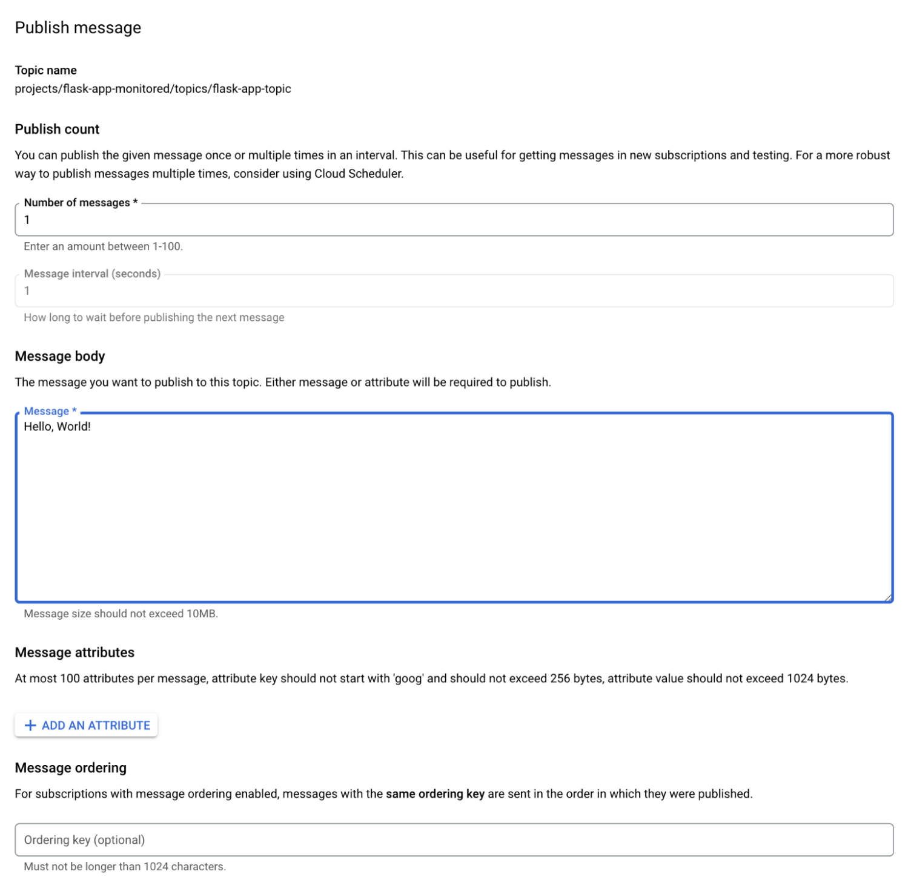
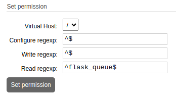
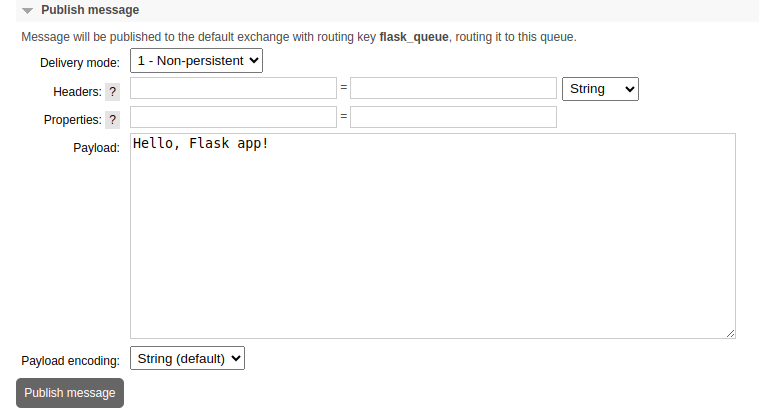

Google Cloud Platform (GCP) Pub/Sub is a fully managed, topic-based messaging service designed for real-time, event-driven architectures. It facilitates communication between independent applications with high throughput and automatic scalability.

RabbitMQ is an open source alternative message broker that uses queue-based messaging to provide greater flexibility with advanced routing mechanisms. Migrating to RabbitMQ offers developers more control over their messaging systems, with features like multi-protocol support not offered by GCP Pub/Sub.

This guide covers how to migrate from GCP Pub/Sub to RabbitMQ running on Linode.

## Feature Comparison

GCP Pub/Sub and RabbitMQ share many key features in common, though there are some notable differences between the two:

| Feature | GCP Pub/Sub | RabbitMQ |
| ----- | ----- | ----- |
| **Type** | Managed messaging service | Message broker |
| **Message Model** | Pub/Sub with topics and subscriptions | Brokered queues, exchanges, and topics |
| **Management** | Fully managed by Google Cloud | Self-managed, flexible deployment options |
| **Use Cases** | Real-time event streaming, integration between cloud services | Complex messaging patterns, low-level control |
| **Scaling** | Automatic scaling | Horizontal, manual configuration often required |
| **Guaranteed Delivery** | Yes, at least once | Yes, with various modes (at least once, exactly once) |
| **Integrations** | Strong integration with GCP services, HTTP push/pull models | Various protocols (AMQP, MQTT, STOMP) |

## Deploy RabbitMQ on Linode

Migrating from GCP Pub/Sub to RabbitMQ on Linode requires choosing between a single Linode Compute Instance or a larger scale, more fault-tolerant environment with the Linode Kubernetes Engine (LKE). Follow the appropriate guide below based on your needs:

-   [Deploying RabbitMQ on a Linode Compute Instance]()
-   [Deploying RabbitMQ on Kubernetes with Linode LKE]()
-   [RabbitMQ Linode Marketplace App](https://www.linode.com/marketplace/apps/linode/rabbitmq/)

In addition, you mush have access to your Google Cloud account with sufficient permissions to work with Pub/Sub resources.

## Migrate from GCP Pub/Sub to RabbitMQ

RabbitMQ exchanges various routing mechanisms to handle message delivery:

-   **Direct** exchanges deliver messages to queues with a specific routing key.
-   **Topic** exchanges enable pattern-based routing, which allow wildcard matches.
-   **Fanout** exchanges broadcast messages to all bound queues, similar to GCP Pub/Sub topics.
-   **Header** exchanges route messages based on their headers for more nuanced filtering.

While Pub/Sub offers simplicity, scalability, and cloud-native integration, RabbitMQ provides more detailed control over routing for advanced messaging patterns.

This [example project](https://github.com/nathan-gilbert/gcp-pub-sub-example) uses Terraform to set up a Flask application that receives notifications from a GCP Pub/Sub topic and its subscription.

### Assess Current Messaging Needs

In the example project, GCP Pub/Sub provides a single topic for pushing messages. The UI displays the current subscribers to this topic (i.e. the single Flask app). This provides guidance as to which services would need to be updated when migrating to RabbitMQ.


GCP provides a UI for publishing messages to all subscribers of a topic. This has a similar interface to `rabbitmqadmin` for command line interactions with topics.



This message should appear in the example application’s logs as the following:

```output
2024-11-22 04:34:33,122 - INFO - Received a GET request
2024-11-22 04:41:29,341 - INFO - Received Pub/Sub message.
2024-11-22 04:41:29,342 - INFO - Received message: Hello, World!
2024-11-22 04:41:29,342 - INFO - Attributes: {'key': 'value'}
```

GCP Pub/Sub also provides a logging and monitoring system:


### Convert Authentication to be Compatible with RabbitMQ

RabbitMQ does not work with GCP IAM. As an alternative, select an authentication method compatible with RabbitMQ, such as username/password or SSL/TLS certificates. This guide uses username/password for authentication.

1.  To create a new user, first log in to the RabbitMQ web interface as an administrator user.

1.  Click the **Admin** tab and go through the steps for creating a new user:

    

1.  Add the username/password credentials for the RabbitMQ user to your Flask application.

### Create RabbitMQ Exchange and Queue Your Application

1.  Click the **Exchanges** tab to create a new exchange for your application. Provide a name for the exchange and hen set the exchange type, then click **Add exchange**:

    

1.  Click the **Queues** tab. Create a new queue on the `/` virtual host and specify a name, then click **Add queue**:

    

1.  Click the name of the newly created queue in the list to bring up its details. Locate the **Bindings** section and add a new binding by setting **From exchange** to the name of the newly created exchange, then click **Bind**:

    

### Set Permissions for RabbitMQ User

Return to the **Admin** page and click the newly created user to bring up its permission details. Set the permissions for the user as follows:



-   The **Configure** permission allows the user to create or modify queues. By setting this to the regular expression `^$`, you are prohibiting this user from making and configuration changes. Your application assumes the queue(s) it subscribes to already exist.
-   The **Write** permission allows the user to publish messages to the queue. The example application in this guide does not write to the queue, so specifying `^$` denies write access.
-   The **Read** permission, set to `^flask_queue$`, grants the user read access to `flask_queue`, which you created above.

### Convert Existing Applications from GCP Pub/Sub to RabbitMQ

In the example project, the Flask application receives and decodes GCP Pub/Sub messages using standard Python libraries. In order to use RabbitMQ, be sure to carefully switch corresponding code from GCP Pub/Sub tooling to RabbitMQ.

1.  For Python applications, RabbitMQ support is provided through the [Pika](https://pypi.org/project/pika/) library, which is an AMQP provider with RabbitMQ bindings. Install Pika with the following command:

    ```command
    sudo apt install python3-pika
    ```

1.  Apply the code changes required to subscribe to the newly created queue in [`main.tf`](https://github.com/nathan-gilbert/gcp-pub-sub-example/blob/main/flask-app/main.tf) (which writes the application code to `/opt/app.py`):

    ```command
    ???
    ```

    The resulting file should look like this:

    ```file {title="main.tf"}
    from flask import Flask
    import pika
    import threading
    import json
    import logging

    logging.basicConfig(level=logging.INFO)

    app = Flask(__name__)

    def rabbitmq_listener():
        def callback(ch, method, properties, body):
            app.logger.info(body.decode('utf-8'))
            # Do other processing here as needed on messages

        connection = pika.BlockingConnection(pika.ConnectionParameters(
            host="<RABBITMQ_HOST>",
            port=<RABBITMQ_AMQP_PORT>,
            credentials=pika.PlainCredentials("", ""),
        ))

        channel = connection.channel()
        channel.basic_consume(queue="flask_queue", on_message_callback=callback, auto_ack=True)
        app.logger.info("Started listening to RabbitMQ...")
        channel.start_consuming()

    # Start RabbitMQ listener in a separate thread
    listener_thread = threading.Thread(target=rabbitmq_listener, daemon=True)
    listener_thread.start()

    @app.route("/", methods=["GET"])
    def default_handler():
        app.logger.info("Request received.")
        return "RabbitMQ Listener Active", 200

    if __name__ == "__main__":
        app.run(host="0.0.0.0", port=5000)
    ```

    Press <kbd>CTRL</kbd>+<kbd>X</kbd>, followed by <kbd>Y</kbd> then <kbd>Enter</kbd> to save the file and exit `nano`.

1.  Run the updated application:

    ```command
    python3 app.py
    ```

    Logs should begin to populate the terminal:

    ```output
     * Serving Flask app 'app'
     * Debug mode: off
    INFO:pika.adapters.utils.connection_workflow:Pika version 1.3.2 connecting to ('172.235.61.66', 5672)
    INFO:pika.adapters.utils.io_services_utils:Socket connected: <socket.socket fd=9, family=AddressFamily.AF_INET, type=SocketKind.SOCK_STREAM, proto=6, laddr=('192.168.86.203', 50052), raddr=('172.235.61.66', 5672)>
    ...
    INFO:werkzeug:Press CTRL+C to quit
    INFO:app:Started listening to RabbitMQ...
    ```

1.  In the web UI for the RabbitMQ server, publish a message to the queue where this application has subscribed. Click the **Queues and Streams** tab and select **flask_queue** from the list of queues. Enter a message payload and click **Publish message**:

    

    In the log output for the running Python application, you should see an update with the message from the subscribed queue:

    ```output
    INFO:app:Hello, Flask app!
    ```

## Production Considerations

Several considerations ought to be weighed when migrating from GCP Pub/Sub to RabbitMQ for application messaging, including authentication, security, performance, and overall architecture.

### Authentication and Authorization

GCP Pub/Sub uses IAM roles and policies for authentication, while RabbitMQ supports multiple methods like username/password and OAuth2. For production-level security, RabbitMQ should use federated authentication services or certificates. Also consider implementing access controls through RabbitMQ’s virtual hosts and user permissions to match or exceed the granular controls GCP provides with IAM policies.

### Message Reliability, Durability, and Delivery

RabbitMQ offers persistent storage for messages by default. You can also configure queues to be durable, meaning they can survive a RabbitMQ broker restart.

RabbitMQ offers different delivery guarantees that help control message reliability and how it behaves under failure scenarios:

-   **At-least-once delivery**  delivers messages to consumers at least once. This is the default delivery model in RabbitMQ.
-   **At-most-once delivery** removes messages from the queue as soon as they are sent to the consumer. This mode is generally suitable for non-critical or low-stakes messages.

To handle messages that can’t be processed after multiple retries, configure a Dead-Letter Exchange (DLX). A DLX redirects unprocessed messages to a separate queue after exceeding the configured retry limit. A DLX is a best practice to mitigate temporary outages or network errors that cause message failures, retrying delivery without affecting primary processing. Failed messages can be inspected or logged for later analysis after landing the DLX.

Adopt the following best practices for delivery and ordering:

-   When ordering is critical, use a single consumer per queue to avoid parallel consumption.
-   For messages with critical processing requirements, implement deduplication to avoid issues from at-least-once delivery.
-   Use manual acknowledgment to control when messages are marked as processed and ensure that RabbitMQ can deliver unacknowledged messages again.
-   Use DLX for retry handling and separating failed messages for special processing, preventing interference with successful message flows.

### Monitoring and Observability

GCP Pub/Sub is directly connected to GCP Cloud Monitoring. Basic monitoring of RabbitMQ is available through the RabbitMQ Management plugin. You can also use tools such as Prometheus and Grafana for real-time performance tracking.

### Scaling, Load Balancing, and Availability

RabbitMQ supports clustering and federation for scaling, though it doesn’t offer auto-scaling like GCP Pub/Sub does. For load balancing, configure multiple nodes and use connection sharding.

Set up cross-node distribution by configuring queues and connections across multiple nodes to balance load. Avoid single points of failure by ensuring that both applications and consumers can failover to different nodes within the cluster.

If RabbitMQ nodes span different data centers, use the [Federation](https://www.rabbitmq.com/docs/federation) or [Shovel](https://www.rabbitmq.com/docs/shovel) plugins. Federation allows controlled mirroring across remote clusters, while Shovel enables continuous transfer of messages from one RabbitMQ instance to another, even across data centers.

Use persistent storage for durable messages and mirrored or quorum queues that require substantial disk I/O. When taking this approach, ensure that disks have enough I/O capacity. Enable disk alarms in RabbitMQ to prevent scenarios where disk space runs out, which could lead to node crashes.