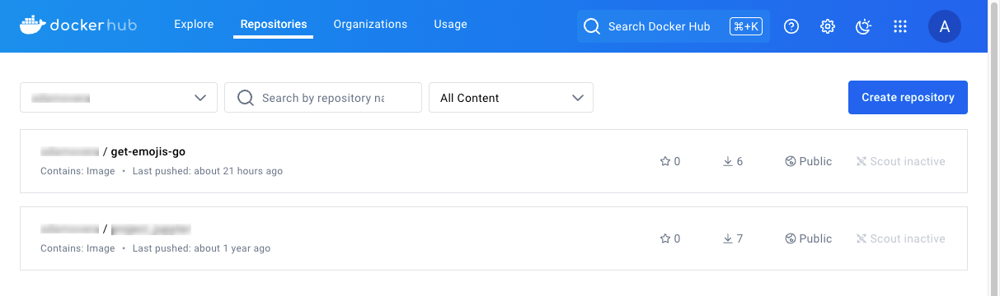
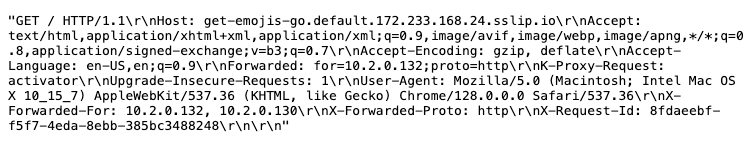
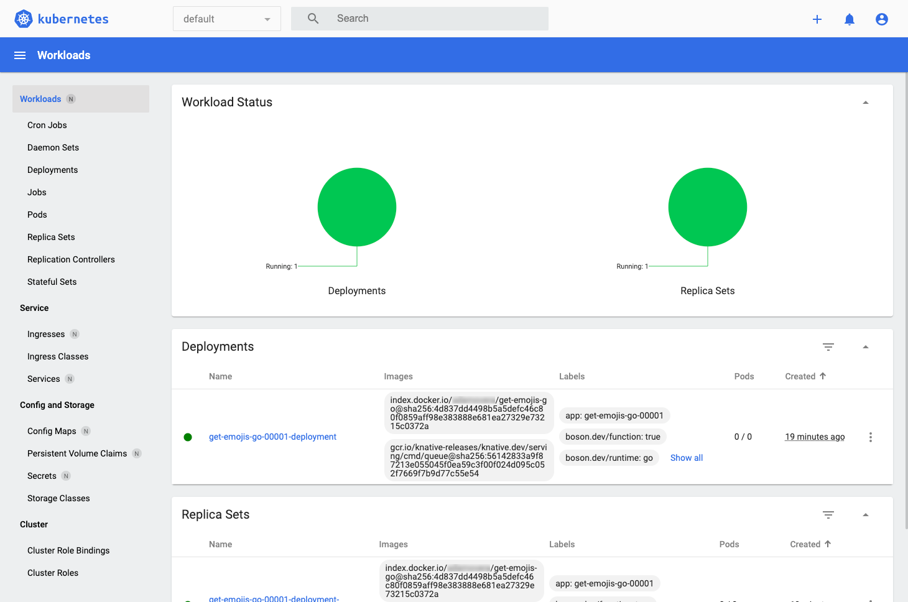

Knative is an open source platform that extends Kubernetes to manage serverless workloads. It provides tools to deploy, run, and manage serverless applications and functions, enabling automatic scaling and efficient resource utilization. Knative consists of several components:

-   **Serving**: Deploys and runs serverless containers.
-   **Eventing**: Manages event-driven architectures.
-   **Functions**: Deploys and runs functions locally and on Kubernetes.

This guide walks through the process of migrating a Google Cloud Run function to a Knative function running on the Linode Kubernetes Engine (LKE).

## Before You Begin

1.  Read our [Getting Started with Linode](/docs/products/platform/get-started/) guide, and create a Linode account if you do not already have one.

1.  Create a personal access token using the instructions in our [Manage personal access tokens](https://techdocs.akamai.com/cloud-computing/docs/manage-personal-access-tokens) guide.

1.  Ensure that you have [Git](https://git-scm.com/downloads) installed.

1.  Follow the steps in the *Install kubectl* section of our [Getting started with LKE](https://techdocs.akamai.com/cloud-computing/docs/getting-started-with-lke-linode-kubernetes-engine) guide to install `kubectl`.

1.  Install the Linode CLI using the instructions in our [Install and configure the CLI](https://techdocs.akamai.com/cloud-computing/docs/install-and-configure-the-cli) guide.

1.  Ensure that you have Knative's [`func` CLI](https://knative.dev/docs/functions/install-func/) installed.

1.  Ensure that you have [Docker](https://www.docker.com/products/docker-desktop/) installed and have a [Docker Hub](https://www.docker.com/products/docker-hub/) account.

1.  Ensure that Go is installed on your system:

    ```command
    sudo apt install golang-go
    ```

1.  Install `jq`, a lightweight command line JSON processor:

    ```command
    sudo apt install jq
    ```

1.  Install `tree`, a command line utility that displays directory structures in a tree-like format:

    ```command
    sudo apt install tree
    ```


This guide is written for a non-root user. Commands that require elevated privileges are prefixed with `sudo`. If you’re not familiar with the `sudo` command, see the [Users and Groups](/docs/guides/linux-users-and-groups/) guide.


## Provision a Kubernetes Cluster

While there are several ways to create a Kubernetes cluster on Linode, this guide uses the [Linode CLI](https://github.com/linode/linode-cli) to provision resources.

1.  Use the Linode CLI command (`linode`) to see available Kubernetes versions:

    ```command
    linode lke versions-list
    ```

    ```output
    ┌──────┐
    │ id   │
    ├──────┤
    │ 1.31 │
    ├──────┤
    │ 1.30 │
    ├──────┤
    │ 1.29 │
    └──────┘
    ```

    It's generally recommended to provision the latest version of Kubernetes unless specific requirements dictate otherwise.

1.  Use the following command to list available Linode plans, including plan ID, pricing, and performance details. For more detailed pricing information, see [Akamai Connected Cloud: Pricing](https://www.linode.com/pricing):

    ```command
    linode linodes types
    ```

1.  The examples in this guide use the **g6-standard-2** Linode, which features two CPU cores and 4 GB of memory. Run the following command to display detailed information in JSON for this Linode plan:

    ```command
    linode linodes types --label "Linode 4GB" --json --pretty
    ```

    ```output
    [
      {
        "addons": {
          "backups": {
            "price": {
              "hourly": 0.008,
              "monthly": 5.0
            },
            "region_prices": [
              {
                "hourly": 0.009,
                "id": "id-cgk",
                "monthly": 6.0
              },
              {
                "hourly": 0.01,
                "id": "br-gru",
                "monthly": 7.0
              }
            ]
          }
        },
        "class": "standard",
        "disk": 81920,
        "gpus": 0,
        "id": "g6-standard-2",
        "label": "Linode 4GB",
        "memory": 4096,
        "network_out": 4000,
        "price": {
          "hourly": 0.036,
          "monthly": 24.0
        },
        "region_prices": [
          {
            "hourly": 0.043,
            "id": "id-cgk",
            "monthly": 28.8
          },
          {
            "hourly": 0.05,
            "id": "br-gru",
            "monthly": 33.6
          }
        ],
        "successor": null,
        "transfer": 4000,
        "vcpus": 2
      }
    ]
    ```

1.  View available regions with the `regions list` command:

    ```command
    linode regions list
    ```

1.  With a Kubernetes version and Linode type selected, use the following command to create a cluster named `knative-playground` in the `us-mia` (Miami, FL) region with three nodes and auto-scaling. Replace  and  with a cluster label and region of your choosing, respectively:

    ```command
    linode lke cluster-create \
      --label  \
      --k8s_version 1.31 \
      --region  \
      --node_pools '[{
        "type": "g6-standard-2",
        "count": 3,
        "autoscaler": {
          "enabled": true,
          "min": 3,
          "max": 8
        }
      }]'
    ```

    Once your cluster is successfully created, you should see output similar to the following:

    ```output
    Using default values: {}; use the --no-defaults flag to disable defaults
    ┌────────────────────┬────────┬─────────────┐
    │ label              │ region │ k8s_version │
    ├────────────────────┼────────┼─────────────┤
    │ knative-playground │ us-mia │ 1.31        │
    └────────────────────┴────────┴─────────────┘
    ```

### Access the Kubernetes Cluster

To access your Kubernetes cluster, fetch the cluster credentials in the form of a `kubeconfig` file.

1.  Use the following command to retrieve the cluster's ID:

    ```command
    CLUSTER_ID=$(linode lke clusters-list --json | \
        jq -r \
          '.[] | select(.label == "knative-playground") | .id')
    ```

1.  Create a hidden `.kube` folder in your user's home directory:

    ```command
    mkdir ~/.kube
    ```

1.  Retrieve the `kubeconfig` file and save it to `~/.kube/lke-config`:

    ```command
    linode lke kubeconfig-view --json "$CLUSTER_ID" | \
        jq -r '.[0].kubeconfig' | \
        base64 --decode > ~/.kube/lke-config
    ```

1.  Once you have the `kubeconfig` file saved, access your cluster by using `kubectl` and specifying the file:

    ```command
    kubectl get no --kubeconfig ~/.kube/lke-config
    ```

    ```output
    NAME                            STATUS   ROLES    AGE     VERSION
    lke244724-387910-0fef31d70000   Ready    <none>   5m51s   v1.31.0
    lke244724-387910-13ae14340000   Ready    <none>   5m48s   v1.31.0
    lke244724-387910-5f9c3b0e0000   Ready    <none>   5m40s   v1.31.0
    ```

    
    Optionally, to avoid specifying `--kubeconfig ~/.kube/lke-config` with every `kubectl` command, you can set an environment variable for your current terminal window session:

    ```command
    export KUBECONFIG=~/.kube/lke-config
    ```

    Then run:

    ```command
    kubectl get no
    ```
    

## Set Up Knative on LKE

There are multiple ways to [install Knative on a Kubernetes cluster](https://knative.dev/docs/install/). The examples in this guide use the YAML manifests method.

### Install Knative

1.  Run the following command to install the Knative CRDs:

    ```command
    RELEASE=releases/download/knative-v1.15.2/serving-crds.yaml
    kubectl apply -f "https://github.com/knative/serving/$RELEASE"
    ```

    Upon successful execution, you should see a similar output indicating that the CRDs are configured:

    ```output
    customresourcedefinition.apiextensions.k8s.io/certificates.networking.internal.knative.dev created
    customresourcedefinition.apiextensions.k8s.io/configurations.serving.knative.dev created
    customresourcedefinition.apiextensions.k8s.io/clusterdomainclaims.networking.internal.knative.dev created
    customresourcedefinition.apiextensions.k8s.io/domainmappings.serving.knative.dev created
    customresourcedefinition.apiextensions.k8s.io/ingresses.networking.internal.knative.dev created
    customresourcedefinition.apiextensions.k8s.io/metrics.autoscaling.internal.knative.dev created
    customresourcedefinition.apiextensions.k8s.io/podautoscalers.autoscaling.internal.knative.dev created
    customresourcedefinition.apiextensions.k8s.io/revisions.serving.knative.dev created
    customresourcedefinition.apiextensions.k8s.io/routes.serving.knative.dev created
    customresourcedefinition.apiextensions.k8s.io/serverlessservices.networking.internal.knative.dev created
    customresourcedefinition.apiextensions.k8s.io/services.serving.knative.dev created
    customresourcedefinition.apiextensions.k8s.io/images.caching.internal.knative.dev created
    ```

1.  Next, install the Knative **Serving** component:

    ```command
    RELEASE=releases/download/knative-v1.15.2/serving-core.yaml
    kubectl apply -f "https://github.com/knative/serving/$RELEASE"
    ```

    You should see similar output indicating that various resources are now created:

    ```output
    namespace/knative-serving created
    role.rbac.authorization.k8s.io/knative-serving-activator created
    clusterrole.rbac.authorization.k8s.io/knative-serving-activator-cluster created
    clusterrole.rbac.authorization.k8s.io/knative-serving-aggregated-addressable-resolver created
    clusterrole.rbac.authorization.k8s.io/knative-serving-addressable-resolver created
    clusterrole.rbac.authorization.k8s.io/knative-serving-namespaced-admin created
    clusterrole.rbac.authorization.k8s.io/knative-serving-namespaced-edit created
    clusterrole.rbac.authorization.k8s.io/knative-serving-namespaced-view created
    clusterrole.rbac.authorization.k8s.io/knative-serving-core created
    clusterrole.rbac.authorization.k8s.io/knative-serving-podspecable-binding created
    serviceaccount/controller created
    clusterrole.rbac.authorization.k8s.io/knative-serving-admin created
    clusterrolebinding.rbac.authorization.k8s.io/knative-serving-controller-admin created
    clusterrolebinding.rbac.authorization.k8s.io/knative-serving-controller-addressable-resolver created
    serviceaccount/activator created
    rolebinding.rbac.authorization.k8s.io/knative-serving-activator created
    clusterrolebinding.rbac.authorization.k8s.io/knative-serving-activator-cluster created
    customresourcedefinition.apiextensions.k8s.io/images.caching.internal.knative.dev unchanged
    certificate.networking.internal.knative.dev/routing-serving-certs created
    customresourcedefinition.apiextensions.k8s.io/certificates.networking.internal.knative.dev unchanged
    customresourcedefinition.apiextensions.k8s.io/configurations.serving.knative.dev unchanged
    customresourcedefinition.apiextensions.k8s.io/clusterdomainclaims.networking.internal.knative.dev unchanged
    customresourcedefinition.apiextensions.k8s.io/domainmappings.serving.knative.dev unchanged
    customresourcedefinition.apiextensions.k8s.io/ingresses.networking.internal.knative.dev unchanged
    customresourcedefinition.apiextensions.k8s.io/metrics.autoscaling.internal.knative.dev unchanged
    customresourcedefinition.apiextensions.k8s.io/podautoscalers.autoscaling.internal.knative.dev unchanged
    customresourcedefinition.apiextensions.k8s.io/revisions.serving.knative.dev unchanged
    customresourcedefinition.apiextensions.k8s.io/routes.serving.knative.dev unchanged
    customresourcedefinition.apiextensions.k8s.io/serverlessservices.networking.internal.knative.dev unchanged
    customresourcedefinition.apiextensions.k8s.io/services.serving.knative.dev unchanged
    image.caching.internal.knative.dev/queue-proxy created
    configmap/config-autoscaler created
    configmap/config-certmanager created
    configmap/config-defaults created
    configmap/config-deployment created
    configmap/config-domain created
    configmap/config-features created
    configmap/config-gc created
    configmap/config-leader-election created
    configmap/config-logging created
    configmap/config-network created
    configmap/config-observability created
    configmap/config-tracing created
    horizontalpodautoscaler.autoscaling/activator created
    poddisruptionbudget.policy/activator-pdb created
    deployment.apps/activator created
    service/activator-service created
    deployment.apps/autoscaler created
    service/autoscaler created
    deployment.apps/controller created
    service/controller created
    horizontalpodautoscaler.autoscaling/webhook created
    poddisruptionbudget.policy/webhook-pdb created
    deployment.apps/webhook created
    service/webhook created
    validatingwebhookconfiguration.admissionregistration.k8s.io/config.webhook.serving.knative.dev created
    mutatingwebhookconfiguration.admissionregistration.k8s.io/webhook.serving.knative.dev created
    validatingwebhookconfiguration.admissionregistration.k8s.io/validation.webhook.serving.knative.dev created
    secret/webhook-certs created
    ```

### Install Kourier

1.  Knative relies on an underlying networking layer. [Kourier](https://github.com/knative-extensions/net-kourier) is designed specifically for Knative, and the examples in this guide use Kourier for [Knative networking](https://knative.dev/docs/install/operator/knative-with-operators/#install-the-networking-layer). Use the commands below to download and install the latest Kourier release:

    ```command
    RELEASE=releases/download/knative-v1.15.1/kourier.yaml
    kubectl apply -f "https://github.com/knative/net-kourier/$RELEASE"
    ```

    The output should again indicate the creation of multiple new elements:

    ```output
    namespace/kourier-system created
    configmap/kourier-bootstrap created
    configmap/config-kourier created
    serviceaccount/net-kourier created
    clusterrole.rbac.authorization.k8s.io/net-kourier created
    clusterrolebinding.rbac.authorization.k8s.io/net-kourier created
    deployment.apps/net-kourier-controller created
    service/net-kourier-controller created
    deployment.apps/3scale-kourier-gateway created
    service/kourier created
    service/kourier-internal created
    horizontalpodautoscaler.autoscaling/3scale-kourier-gateway created
    poddisruptionbudget.policy/3scale-kourier-gateway-pdb created
    ```

1.  The following command configures Knative to use Kourier as the default ingress controller:

    ```command
    kubectl patch configmap/config-network \
        --namespace knative-serving \
        --type merge \
        --patch \
          '{"data":{"ingress-class":"kourier.ingress.networking.knative.dev"}}'
    ```

    ```output
    configmap/config-network patched
    ```

    
    If Istio is already installed in your cluster, you may choose to [reuse it for Knative](https://knative.dev/docs/install/operator/knative-with-operators/#__tabbed_1_2).
    

1.  With Kourier configured, the Knative serving installation now has a [`LoadBalancer`](https://kubernetes.io/docs/concepts/services-networking/service/#loadbalancer) service for external access. Use the following command to retrieve the external IP address in case you want to set up your own DNS later:

    ```command
    kubectl get service kourier -n kourier-system
    ```

    The output should display the external IP address of the `LoadBalancer`:

    ```output
    NAME      TYPE           CLUSTER-IP       EXTERNAL-IP       PORT(S)                      AGE
    kourier   LoadBalancer   10.128.164.131   172.233.166.148   80:30227/TCP,443:32467/TCP   65s
    ```

1.  Since Kourier adds several deployments, check the updated list to ensure everything functions correctly:

    ```command
    kubectl get deploy -n knative-serving
    ```

    Use the output to confirm availability of the various components:

    ```output
    NAME                     READY   UP-TO-DATE   AVAILABLE   AGE
    activator                1/1     1            1           2m29s
    autoscaler               1/1     1            1           2m29s
    controller               1/1     1            1           2m29s
    net-kourier-controller   1/1     1            1           85s
    webhook                  1/1     1            1           2m28s
    ```

### Configure DNS

This guide use the Magic DNS method to [configure DNS](https://knative.dev/docs/install/operator/knative-with-operators/#configure-dns), which leverages the [sslip.io](http://sslip.io) DNS service. When a request is made to a subdomain of sslip.io containing an embedded IP address, the service resolves that IP address. For example, a request to [https://52.0.56.137.sslip.io](https://52.0.56.137.sslip.io) returns `52.0.56.137` as the IP address. Use the `default-domain` job to configure Knative Serving to use sslip.io:

```command
MANIFEST=knative-v1.15.2/serving-default-domain.yaml
kubectl apply -f "https://github.com/knative/serving/releases/download/$MANIFEST"
```

Upon successful execution, you should see output confirming the creation of the `default-domian` job and service:

```output
job.batch/default-domain created
service/default-domain-service created
```

With Knative now operational in your cluster, you can begin working with Knative Functions.

## Work with Knative Functions and the `func` CLI

Knative Functions is a programming model that simplifies writing distributed applications on Kubernetes and Knative. It enables developers to create stateless, event-driven functions without requiring in-depth knowledge of containers, Kubernetes, or Knative itself.

The [`func`](https://github.com/knative/func) CLI provides tools for developers to manage the entire lifecycle of functions (creating, building, deploying, and invoking). This allows for local development and testing of functions without the need for a local Kubernetes cluster.

To get started, run the following command:

```command
func
```

This displays help information for managing Knative Function resources:

```output
func is the command line interface for managing Knative Function resources

    Create a new Node.js function in the current directory:
    func create --language node myfunction

    Deploy the function using Docker hub to host the image:
    func deploy --registry docker.io/alice

Learn more about Functions:  https://knative.dev/docs/functions/
Learn more about Knative at: https://knative.dev

Primary Commands:
  create      Create a function
  describe    Describe a function
  deploy      Deploy a function
  delete      Undeploy a function
  list        List deployed functions
  subscribe   Subscribe a function to events

Development Commands:
  run         Run the function locally
  invoke      Invoke a local or remote function
  build       Build a function container

System Commands:
  config      Configure a function
  languages   List available function language runtimes
  templates   List available function source templates
  repository  Manage installed template repositories
  environment Display function execution environment information

Other Commands:
  completion  Output functions shell completion code
  version     Function client version information

Use "func <command> --help" for more information about a given command.
```

### Create a Function

1.  Use the following command to create an example Golang function (`get-emojis-go`) that can be invoked via an HTTP endpoint (the default invocation method):

    ```command
    func create -l go get-emojis-go
    ```

    This command creates a complete directory with multiple files:

    ```output
    Created go function in /home//get-emojis-go
    ```

1.  Examine the contents of the newly created `~/get-emojis-go` directory:

    ```command
    ls -laGh get-emojis-go
    ```

    ```output
    total 40K
    drwxr-xr-x 3  4.0K Oct 14 15:07 .
    drwxr-x--- 9  4.0K Oct 14 15:07 ..
    drwxrwxr-x 2  4.0K Oct 14 15:07 .func
    -rw-r--r-- 1   217 Oct 14 15:07 .funcignore
    -rw-r--r-- 1    97 Oct 14 15:07 func.yaml
    -rw-r--r-- 1   235 Oct 14 15:07 .gitignore
    -rw-r--r-- 1    25 Oct 14 15:07 go.mod
    -rw-r--r-- 1   483 Oct 14 15:07 handle.go
    -rw-r--r-- 1   506 Oct 14 15:07 handle_test.go
    -rw-r--r-- 1   611 Oct 14 15:07 README.md
    ```

1.  While reviewing the purpose of each file is outside the scope of this guide, you should examine the `handle.go` file, the default implementation that Knative generates:

    ```command
    cat ~/get-emojis-go/handle.go
    ```

    ```file {title="handle.go" lang="go"}
    package function

    import (
        "fmt"
        "net/http"
        "net/http/httputil"
    )

    // Handle an HTTP Request.
    func Handle(w http.ResponseWriter, r *http.Request) {
        /*
         * YOUR CODE HERE
         *
         * Try running `go test`.  Add more test as you code in `handle_test.go`.
         */

        dump, err := httputil.DumpRequest(r, true)
        if err != nil {
            http.Error(w, err.Error(), http.StatusInternalServerError)
            return
        }

        fmt.Println("Received request")
        fmt.Printf("%q\n", dump)
        fmt.Fprintf(w, "%q", dump)
    }
    ```

    Note that this function works as a server that returns information from the original request.

### Build a Function Image

The next step is to create a container image from your function. Since the function is intended to run on a Kubernetes cluster, it must be containerized. Knative Functions facilitates this process for developers, abstracting the complexities of Docker and Dockerfiles.

1.  Navigate into the `~/get-emojis-go` directory:

    ```command
    cd ~/get-emojis-go
    ```

1.  To build your function, run the following `build` command while in the `~/get-emojis-go` directory, specifying Docker Hub (`docker.io`) as the registry along with your :

    ```command
    func build --registry docker.io/
    ```

    This command fetches a base image and builds a Docker image from your function. You should see output similar to the following as the function image is built:

    ```output
    Building function image
    Still building
    Still building
    Yes, still building
    Don't give up on me
    Still building
    This is taking a while
    🙌 Function built: index.docker.io//get-emojis-go:latest
    ```

1.  To verify that the image is successfully created, use the following command to list your Docker images:

    ```command
    docker images | grep -E 'knative|get-emojis-go|ID'
    ```

    ```output
    REPOSITORY                           TAG       IMAGE ID       CREATED        SIZE
    /get-emojis-go    latest    9a1aa84a2b79   44 years ago   44MB
    ghcr.io/knative/builder-jammy-tiny   0.0.240   0f71b69eedae   44 years ago   770MB
    ```

    
    While the `CREATED` timestamp may be incorrect, the image is valid.
    

### Run the Function Locally

1.  Use the `run` command to run the function locally:

    ```command
    func run
    ```

    The terminal should display output indicating that the function now runs on `localhost` at port `8080`:

    ```output
    function up-to-date. Force rebuild with --build
    Running on host port 8080
    Initializing HTTP function
    listening on http port 8080
    ```

1.  With your function running, open a second terminal session and enter the following command:

    ```command
    curl "http://localhost:8080?a=1&b=2"
    ```

    By default, this initial implementation returns the URL query parameters as a JSON object. The resulting output should be:

    ```output
    {"a": "1", "b": "2"}
    ```

    Meanwhile, you should see output similar to the following in your original terminal window:

    ```output
    Received request
    GET http://localhost:8080/?a=1&b=2 localhost:8080
      Host: localhost:8080
      User-Agent: curl/7.81.0
      Accept: */*
    URL Query String:
      {"a": "1", "b": "2"}
    ```

1.  When done, close the second terminal and stop the function in the original terminal by pressing the <kbd>CTRL</kbd>+<kbd>C</kbd> keys.

### Deploy the Function

1.  Use the `deploy` command to deploy your function to your Kubernetes cluster as a Knative function and push it to the Docker registry:

    ```command
    func deploy
    ```

    ```output
    function up-to-date. Force rebuild with --build
    Pushing function image to the registry "index.docker.io" using the "" user credentials
    🎯 Creating Triggers on the cluster
    ✅ Function deployed in namespace "default" and exposed at URL:
       http://get-emojis-go.default.172.233.166.148.sslip.io
    ```

    Once the function is deployed and the Magic DNS record is established, your Knative function is accessible through this public HTTP endpoint. The new `get-emojis-go` repository should also now exist on your Docker Hub account:

    

1.  To invoke your Knative function, open a web browser and visit your function’s URL. An example invocation may look like this:

    

With your Knative function accessible through a public HTTP endpoint, the next step is to migrate a Cloud Run Function to Knative.

## Migrate Cloud Run Functions to Knative

This guide examines a sample Cloud Run function and walks through how to migrate it to Knative. Cloud Run functions are similar to Knative functions, as they both have a trigger and extract their input arguments from a context or event.

The main application logic is highlighted in the example Cloud Run function below:

```file {title="" hl_lines="17,18"}
package google_cloud_function

import (
    "fmt"
    "github.com/GoogleCloudPlatform/functions-framework-go/functions"
    "github.com/the-gigi/get-emojis-google-cloud-function/pkg/fuzz_emoji"
    "net/http"
    "strings"
)

func init() {
    functions.HTTP("get-emojis", getEmojis)
}

func getEmojis(w http.ResponseWriter, r *http.Request) {
    descriptions := strings.Split(r.URL.Query().Get("descriptions"), ",")
    fuzzer := fuzz_emoji.NewFuzzEmoji()
    result := fuzzer.GetEmojis(descriptions)
    for k, v := range result {
        _, _ = fmt.Fprintf(w, "%s: {%v}\n", k, v)
    }
}
```

This example function instantiates a `FuzzEmoji` object and calls its `getEmojis()` method, passing a list of emoji descriptions. The emoji descriptions may or may not map to official emoji names like "fire" (🔥) or "sunrise" (🌅). The function performs a "fuzzy" search of the descriptions to find matching emojis.

The remainder of the code focuses on extracting emoji descriptions from the query parameters in the request and writing the result to the response object.

At the time of this writing, this example Cloud Run function was deployed and available at the following HTTP endpoint:

```command
curl https://us-east1-playground-161404.cloudfunctions.net/get-emojis?descriptions=flame,dawn
```

Invoking the function returns the following result:

```output
flame: {fire, 🔥}
dawn: {sunrise, 🌅}
```

The function successfully returns the `fire` (🔥) emoji for the description "flame" and the `sunrise` emoji (🌅) for the description "dawn".

### Isolating the Cloud Run Function Code from GCP Specifics

To migrate the Google Cloud Run function to Knative, the core application logic must be decoupled from Google Cloud Platform (GCP)-specific dependencies. In this example, this is already done since the interface for the `getEmojis()` method accepts a Golang slice of strings as descriptions.

If the `getEmojis()` method accessed Google Cloud Storage to fetch synonyms instead of by importing the `fuzz_emoji` package from GitHub, it would not be compatible with Knative and would require refactoring.

### Migrating a Single-File Function to a Knative Function

The core logic of the function is encapsulated into a single Golang file called `fuzz_emoji.go`, which can be migrated to your Knative function.

1.  Create the `pkg` directory and `fuzz_emoji` subdirectory within the `get-emojis-go` directory:

    ```command
    mkdir -p ~/get-emojis-go/pkg/fuzz_emoji
    ```

1.  Using a text editor of your choice, create the `fuzz_emoji.go` file in the `get-emojis-go` directory:

    ```command
    nano ~/get-emojis-go/pkg/fuzz_emoji/fuzz_emoji.go
    ```

    Give the file the following content:

    ```file {title="fuzz_emoji.go" lang="go"}
    package fuzz_emoji

    import (
        "encoding/json"
        "fmt"
        "io"
        "net/http"
        "strings"

        "github.com/enescakir/emoji"
    )

    type FuzzEmoji struct {
        emojiDict map[string]string
    }

    func NewFuzzEmoji() *FuzzEmoji {
        f := &FuzzEmoji{
            emojiDict: make(map[string]string),
        }
        for name, e := range emoji.Map() {
            name := strings.Trim(name, ":")
            f.emojiDict[strings.ToLower(name)] = e
        }
        return f
    }

    func (f *FuzzEmoji) getSynonyms(word string) ([]string, error) {
        url := fmt.Sprintf("https://api.datamuse.com/words?rel_syn=%s", word)
        resp, err := http.Get(url)
        if err != nil {
            return nil, err
        }
        defer resp.Body.Close()

        if resp.StatusCode != http.StatusOK {
            return nil, fmt.Errorf("failed to fetch synonyms: %s", resp.Status)
        }

        body, err := io.ReadAll(resp.Body)
        if err != nil {
            return nil, err
        }

        var words []struct {
            Word string `json:"word"`
        }
        if err := json.Unmarshal(body, &words); err != nil {
            return nil, err
        }

        synonyms := make([]string, len(words))
        for i, wordData := range words {
            synonyms[i] = wordData.Word
        }

        return synonyms, nil
    }

    func (f *FuzzEmoji) getEmoji(description string) (string, string) {
        description = strings.ToLower(description)

        // direct match
        if emojiChar, exists := f.emojiDict[description]; exists {
            return description, emojiChar
        }

        // Subset match
        for name, emojiChar := range f.emojiDict {
            if strings.Contains(name, description) {
                return name, emojiChar
            }
        }

        synonyms, err := f.getSynonyms(description)
        if err != nil {
            return "", ""
        }

        // Synonym match
        for _, syn := range synonyms {
            if emojiChar, exists := f.emojiDict[syn]; exists {
                return syn, emojiChar
            }
        }

        // Subset match
        for name, emojiChar := range f.emojiDict {
            for _, syn := range synonyms {
                if strings.Contains(name, syn) {
                    return syn, emojiChar
                }
            }
        }

        return "", ""
    }

    func (f *FuzzEmoji) GetEmojis(descriptions []string) map[string]string {
        result := make(map[string]string)
        for _, d := range descriptions {
            name, emojiChar := f.getEmoji(d)
            result[d] = fmt.Sprintf("%s, %s", name, emojiChar)
        }
        return result
    }
    ```

    When complete, save your changes.

1.  Run the `tree` command on the `~/get-emojis-go` directory to confirm the new folder structure:

    ```command
    tree ~/get-emojis-go/
    ```

    The folder structure should now look like this:

    ```output
    get-emojis-go/
    ├── func.yaml
    ├── go.mod
    ├── handle.go
    ├── handle_test.go
    ├── pkg
    │   └── fuzz_emoji
    │       └── fuzz_emoji.go
    └── README.md

    2 directories, 6 files
    ```

1.  Edit your `handle.go` file so that it uses the `fuzz_emoji` package:

    ```command
    nano ~/get-emojis-go/handle.go
    ```

    Replace the existing content with the following. Remember to save your changes:

    ```file {title="hande.go" lang="go"}
    package function

    import (
        "context"
        "fmt"
        "net/http"
        "strings"
        "function/pkg/fuzz_emoji"
    )

    func Handle(ctx context.Context, res http.ResponseWriter, req *http.Request) {
        descriptions := strings.Split(req.URL.Query().Get("descriptions"), ",")
        fuzzer := fuzz_emoji.NewFuzzEmoji()
        result := fuzzer.GetEmojis(descriptions)
        for k, v := range result {
            _, _ = fmt.Fprintf(res, "%s: {%v}\n", k, v)
        }
    }
    ```

    Below is a breakdown of the file code functionality:

    -   Imports standard Go packages for handling HTTP requests, strings, and output.
    -   Imports the `fuzz_emoji` package, which contains the core emoji-matching logic.
    -   The `Handle()` function takes a context (unused), a response, and a request.
    -   Extracts the emoji descriptions from the query parameters of the URL. The function expects the descriptions to be a single comma-separated string, which it splits to get a list called `descriptions`.
    -   Calls `NewFuzzEmoji` to instantiate a `FuzzEmoji` object.
    -   Calls the `getEmojis()` method, passing the list of `descriptions` that were extracted.
    -   Iterates over the result map, printing the items to the response object.

1.  Next, edit the `go.mod` file to use the emoji package from [github.com/enescakir/emoji](http://github.com/enescakir/emoji) in the Docker image:

    ```command
    nano ~/get-emojis-go/go.mod
    ```

    Append the highlighted line to the end of the file, and save your changes:

    ```file {title="go.mod" hl_lines="5"}
    module function

    go 1.21

    require github.com/enescakir/emoji v1.0.0
    ```

1.  Re-build and re-deploy the container:

    ```command
    func build --registry docker.io/
    func deploy
    ```

1.  Test your function using the public URL:

    ```command
    curl http://get-emojis-go-default..sslip.io/?descriptions=flame,high
    ```

    The `descriptions` provided as a query parameter are echoed back, along with a corresponding emoji name and emoji for each description:

    ```output
    flame: {fire, 🔥}
    high: {high_speed_train, 🚄}
    ```

    This confirms that the Knative function works as expected.

### Migrating a Multi-File Function to a Knative Function

In the previous example, the entire application logic was contained in a single file called `fuzz_emoji.go`. For larger workloads, your function may involve multiple files or multiple directories and packages.

Migrating such a setup to Knative follows a similar process:

1.  Copy all relevant files and directories into the `pkg` subfolder of your Knative function folder.

1.  Import any required packages in `handle.go`.

1.  Update the `go.mod` file to include all of the dependencies used across any of the packages.

### Migrating External Dependencies

When migrating a Cloud Run function, it may depend on various GCP services such as Google Cloud Storage, Cloud SQL, Cloud Data Store, or Cloud Pub/Sub. It's important to evaluate each dependency to determine the best option to suit your situation.

There are typically three options to consider:

1.  **Keep it as-is**: Continue using the Knative function to interact with the GCP service.

1.  **Replace the service**: For example, you might switch from a GCP service like Cloud Data Store to an alternative key-value store in the Kubernetes cluster.

1.  **Drop the functionality**: Eliminate certain GCP-specific functionalities, such as no longer writing messages to Cloud Pub/Sub.

### Namespace and Service Account

The Knative function eventually runs as a pod in the Kubernetes cluster. This means it runs in a namespace and has a Kubernetes service account associated with it. These are determined when you run the `func deploy` command. You can specify them using the `-n` (or `--namespace`) and `--service-account` arguments.

If these options are not specified, the function deploys in the currently configured namespace and uses the default service account of the namespace.

If your Knative function needs to access any Kubernetes resources, it’s recommended to explicitly specify a dedicated namespace and create a dedicated service account. This is the preferred approach since it avoids granting excessive permissions to the default service account.

### Configuration and Secrets

If your Cloud Run function uses [Runtime Configurator](https://cloud.google.com/deployment-manager/runtime-configurator) and [Secret Manager](https://cloud.google.com/security/products/secret-manager?hl=en) for configuration and sensitive information, these details should not be embedded directly in the function's image. For example, if your function needs to access GCP services, it would require GCP credentials to authenticate.

Kubernetes offers the [`ConfigMap`](https://kubernetes.io/docs/concepts/configuration/configmap/) and [`Secret`](https://kubernetes.io/docs/concepts/configuration/secret/) resources for this purpose. The migration process involves the following steps:

1.  Identify all the parameters and secrets the Cloud Run function uses.

1.  Create corresponding `ConfigMap` and `Secret` resources in the namespace for your Knative function.

1.  Grant the service account for your Knative function permissions to read the `ConfigMap` and `Secret`.

### Roles and Permissions

Your Knative function may need to interact with various Kubernetes resources and services during migration, such as data stores, `ConfigMaps`, and `Secrets`. To enable this, create a dedicated role with the necessary permissions and bind it to the function's service account.

If your architecture includes multiple Knative functions, it is considered a best practice to share the same service account, role, and role bindings between all the Knative functions.

### Logging, Metrics, and Distributed Tracing

The logging experience in Knative is similar to printing something in your Cloud Run function. With GCP, output is automatically logged to Google Cloud Logging. In Knative, that same print statement automatically sends log messages to your container's logs. If you have centralized logging, these messages are automatically recorded in your log system.

LKE provides the native Kubernetes dashboard by default. It runs on the control plane, so it doesn't take resources from your workloads. You can use the dashboard to explore your entire cluster:



For production systems, consider using a centralized logging system like ELK/EFK, Loki, or Graylog, along with an observability solution consisting of Prometheus and Grafana. You can also supplement your observability by leveraging a telemetry data-oriented solution such as OpenTelemetry. These tools can enhance your ability to monitor, troubleshoot, and optimize application performance while ensuring reliability and scalability.

Knative also has built-in support for distributed tracing, which can be configured globally. This means your Knative function automatically participates in tracing without requiring additional changes.

### The Debugging Experience

Knative offers debugging at multiple levels:

-   Unit test your core logic
-   Unit test your Knative function
-   Invoke your function locally

When you create a Go Knative function, Knative generates a skeleton for a unit test called `handle_test.go`.

1.  Open the `handle_test.go` file in the `get-emojis-go` directory:

    ```command
    nano ~/get-emojis-go/handle_test.go
    ```

    Replace its contents with the test code below, and save your changes. This code is updated for testing the fuzzy emoji search functionality:


    ```file {title="handle_test.go" lang="go"}
    package function

    import (
        "context"
        "io"
        "net/http"
        "net/http/httptest"
        "testing"
    )

    func TestHandle(t *testing.T) {
        var (
            w   = httptest.NewRecorder()
            req = httptest.NewRequest(
                "GET",
                "http://example.com/test?descriptions=flame,dog",
                nil)
            res *http.Response
        )

        Handle(context.Background(), w, req)
        res = w.Result()
        defer res.Body.Close()

        data := make([]byte, 512)
        n, err := res.Body.Read(data)
        if err != nil && err != io.EOF {
            t.Fatal(err)
        }

        expected := "flame: {fire, 🔥}\ndog: {dog, 🐶}\n"
        result := string(data[:n])

        if expected != result {
            t.Fatalf("Failed to return the fire emoji")
        }

        if res.StatusCode != 200 {
            t.Fatalf("unexpected response code: %v", res.StatusCode)
        }
    }
    ```

1.  Download the `fuzz_emoji` package and any other required dependencies:

    ```command
    go get function/pkg/fuzz_emoji
    ```

1.  Use the `go` command to run the `handle_test.go` file and test the invocation of your function:

    ```command
    go test
    ```

    A successful test should produce output similar to the following:

    ```output
    PASS
    ok  	function	0.275s
    ```

Once the code behaves as expected, you can test the function locally by packaging it in a Docker container using `func invoke` to run it. This approach is handled completely through Docker, without the need for a local Kubernetes cluster.

After local testing, you may want to optimize the function's image size by removing any redundant dependencies to improve resource utilization. Deploy your function to a staging environment (a Kubernetes cluster with Knative installed) using `func deploy`. In the staging environment, you can conduct integration, regression, and stress testing.

If your function interacts with external services or the Kubernetes API server, you should *"mock"* these dependencies. Mocking, or simulating external services or components that a function interacts with, allows you to isolate a specific function or piece of code to ensure it behaves correctly.

See **More Information** below for resources to help you get started with migrating Google Cloud Run functions to Knative functions on the Linode Kubernetes Engine (LKE).