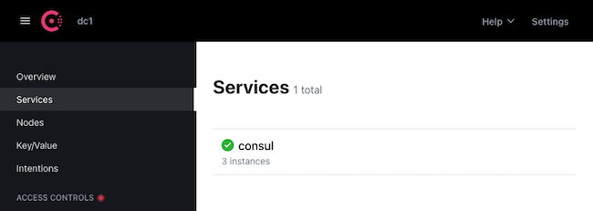
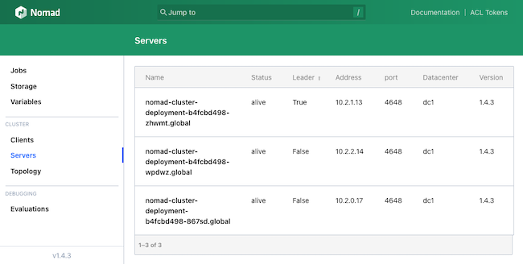

Kubernetes and Nomad are both orchestration tools that each come with a compelling set of features. Despite some overlap, each tool has unique strengths and a favorable set of use cases.

Review our [Kubernetes vs Nomad?](/docs/guides/kubernetes-vs-nomad/) article to see how Kubernetes and Nomad excel in different orchestration areas.

As that guide points out, there are cases where you may want the benefits of both tools side-by-side. While you can accomplish this with two distinct parallel setups, it's also possible to directly run Nomad on a Kubernetes cluster.

This tutorial shows how to do just that. It walks through setting up the Kubernetes cluster and deploying Nomad to it, and demonstrates how to manage tasks through each tool in parallel.

## Why Use Nomad on Kubernetes?

Kubernetes tends to be best for large and complicated applications, but it is restricted to containerized applications. On the other hand, Nomad provides a simpler and more flexible orchestration that can run both containerized and non-containerized applications.

Many organizations can effectively leverage both use cases. Often, you need to run more than just large and containerized applications. You may need to orchestrate batch applications or other non-containerized applications that benefit from a higher degree of flexibility.

Running a distinct Nomad cluster in addition to a Kubernetes cluster is a possibility for handling this. Learn everything you need to get started with a Nomad cluster in our guide [How to Use Nomad for Container Orchestration](/docs/guides/using-nomad-for-orchestration/).

However, that model may be restrictive, and price-inefficient depending on your needs.

The other way to leverage the advantages of Nomad alongside Kubernetes is by running Nomad on the Kubernetes cluster itself. Nomad runs on the same infrastructure as Kubernetes, but can separately orchestrate tasks. This provides a means of running batch processes and non-containerized applications alongside Kubernetes applications.

Such a setup has additional advantages, like the ability for Kubernetes and Nomad applications to easily communicate across a private Kubernetes network.

## How to Deploy Nomad on a Kubernetes Cluster

There are several pieces you need to create and deploy to get an infrastructure running Nomad alongside Kubernetes. This includes provisioning a Kubernetes cluster, deploying Nomad, and deploying Consul for Nomad to network through.

This section of the tutorial walks through a basic Kubernetes cluster running Nomad alongside Kubernetes. By the end, you are ready to start orchestrating applications using the tools most appropriate for the task.

### Provisioning a Kubernetes Cluster

The infrastructure in this tutorial builds on a Kubernetes base. For that reason, the first step to take is provisioning a Kubernetes cluster.

The most straightforward way to deploy a Kubernetes cluster with Linode is using the Linode Kubernetes Engine (LKE). LKE lets you configure and deploy a full Kubernetes cluster through the Linode Cloud Manager.

Learn how to deploy an LKE cluster through our guide [Linode Kubernetes Engine - Getting Started](/docs/products/compute/kubernetes/get-started/).

The present tutorial assumes you followed the guide above to create an LKE cluster with three nodes. The tutorial has been tested with Dedicated 4GB nodes, but that can be adjusted to fit your needs.

For an alternative method to deploy a Kubernetes cluster onto Linode, see our guide [Using kubeadm to Deploy a Kubernetes Cluster](/docs/guides/getting-started-with-kubernetes/). The guide covers using the `kubeadm` tool to set up a cluster, but the guide also highlights and links to further options for Kubernetes deployments.

This tutorial additionally requires that `kubectl` is installed locally and set up with the `kubeconfig` file to connect to your LKE cluster. Learn more about this in the guides linked above, depending on your method for setting up the Kubernetes cluster.

### Deploying a Consul Service Mesh

Nomad typically uses [Consul](https://www.consul.io/) for network discovery. Fortunately, a Consul mesh can be set up on a Kubernetes cluster with relative ease through the official Helm chart.

Learn more about setting up a Consul service mesh on Kubernetes through our guide [Install HashiCorp Consul Service Mesh](/docs/guides/how-to-install-hashicorp-consul-service-mesh/).

The steps that follow are based on those covered in the guide above. Some alterations have been made and more specifics given to fit smoothly with Nomad on the cluster.

1.  Install Helm. The specific steps for this depend on your local system. What is given below assumes a typical Linux system. Refer to the [official installation instructions](https://helm.sh/docs/intro/install/) for installing Helm on other operating systems.

    Be sure to identify the [latest release](https://github.com/helm/helm/releases/latest) from the Helm releases page. Replace `3.11.2` in the commands below with the appropriate release number for the latest release.

    ```command
    cd ~/
    sudo wget https://get.helm.sh/helm-v3.11.2-linux-amd64.tar.gz
    sudo tar -zxvf helm-v3.11.2-linux-amd64.tar.gz
    sudo mv linux-amd64/helm /usr/local/bin/helm
    ```

1.  Add and update the HashiCorp repository to your Helm instance:

    ```command
    helm repo add hashicorp https://helm.releases.hashicorp.com
    helm repo update
    ```

1.  Create a Helm configuration file with the values for deploying Consul. The example configuration that follows provides a basic setup that works well with Nomad.

    ```file {title="consul-helm.yaml" lang="yaml"}
    global:
      name: consul
      datacenter: dc1
    server:
      replicas: 3
      securityContext:
        runAsNonRoot: false
        runAsUser: 0
    client:
      enabled: true
    ui:
      enabled: true
    connectInject:
      enabled: false
    ```

    See further examples of Helm configurations for deploying Consul within HashiCorp's [Consul and Kubernetes Deployment Guide](https://learn.hashicorp.com/tutorials/consul/kubernetes-deployment-guide?in=consul/kubernetes). Find a full list of configuration options in HashiCorp's [Helm Chart Configuration](https://www.consul.io/docs/k8s/helm) guide.

1.  Install Consul to the Kubernetes cluster. This command has Helm deploy Consul to the cluster using the values specified in the previous step, assuming you saved those values in a file named `consul-helm.yaml`:

    ```command
    helm install consul hashicorp/consul -f consul-helm.yaml
    ```

1.  Verify that Consul is running and networking on your cluster. First, check `kubectl` to see that the pods containing Consul are up and running:

    ```command
    kubectl get pods
    ```

    ```output
    NAME                                       READY   STATUS    RESTARTS   AGE
    consul-client-9vwgh                        1/1     Running   0          1h
    consul-client-l9vkm                        1/1     Running   0          1h
    consul-client-wvrpz                        1/1     Running   0          1h
    consul-server-0                            1/1     Running   0          1h
    consul-server-1                            1/1     Running   0          1h
    consul-server-2                            1/1     Running   0          1h
    ```

1.  Now use the following command to forward the Consul UI to port `18500` on your local machine:

    ```command
    kubectl port-forward service/consul-ui 18500:80 --address 0.0.0.0
    ```

1.  Navigate to `localhost:18500` in a web browser. You should see the Consul service listed with three instances, one for each cluster:

    [](consul-ui-consul-cluster.png)

### Deploying Nomad

Nomad can be deployed directly using `kubectl`. HashiCorp does not maintain an official Docker container image for Nomad, but this tutorial leverage's NoEnv's [Nomad image](https://hub.docker.com/r/noenv/nomad).

1.  Create a Kubernetes configuration file for deploying Nomad. The values below provide a basic Nomad setup and connects Nomad immediately via the Consul mesh.

    ```file {title="nomad-cluster.yaml" lang="yaml"}
    apiVersion: v1
    kind: Service
    metadata:
      name: nomad-cluster-service
      labels:
        name: nomad
    spec:
      type: LoadBalancer
      ports:
        - name: http
          port: 4646
          protocol: "TCP"
        - name: rpc
          port: 4647
          protocol: "TCP"
      selector:
        app: nomad
    ---
    apiVersion: v1
    kind: ConfigMap
    metadata:
      name: nomad-cluster-configmap
      labels:
        app: nomad
    data:
      server.hcl: |
        datacenter = "dc1"
        data_dir = "/opt/nomad/data"

        bind_addr = "0.0.0.0"

        server {
            enabled = true
            bootstrap_expect = 3
        }

        client {
            enabled = true
            options {
                "driver.raw_exec.enable" = "1"
                "driver.raw_exec.no_cgroups" = "1"
            }
        }

        consul {
          address = "consul-server.default.svc:8500"
        }
    ---
    apiVersion: apps/v1
    kind: Deployment
    metadata:
      name: nomad-cluster-deployment
      labels:
        app: nomad
    spec:
      replicas: 3
      selector:
        matchLabels:
          app: nomad
      template:
        metadata:
          labels:
            app: nomad
        spec:
          securityContext:
            runAsUser: 100
            runAsGroup: 999
            fsGroup: 999
          containers:
          - name: nomad-instance
            image: noenv/nomad
            imagePullPolicy: IfNotPresent
            args:
            - "agent"
            - "-config=/etc/nomad/nomad.d/server.hcl"
            ports:
            - name: http
              containerPort: 4646
              protocol: "TCP"
            - name: rpc
              containerPort: 4647
              protocol: "TCP"
            - name: serf-tcp
              containerPort: 4648
              protocol: "TCP"
            - name: serf-udp
              containerPort: 4648
              protocol: "UDP"
            volumeMounts:
            - name: nomad-config
              mountPath: /etc/nomad/nomad.d
            - name: nomad-data
              mountPath: /opt/nomad/data
          volumes:
          - name: nomad-config
            configMap:
              name: nomad-cluster-configmap
          - name: nomad-data
            emptyDir: {}
    ```

    This example configuration does three main things:

    -   Creates a load-balancer service for the Nomad instances.

    -   Prepares a configuration to include with each Nomad instance. The configuration connects the Nomad instances through Consul and enables the `raw_exec` driver that allows Nomad to execute shell commands.

    -   Defines a deployment for the Nomad image, consisting of three replicas (one for each node in the cluster) giving the necessary exposed ports, and mounting volumes for the Nomad configuration and data.

1.  Deploy the Nomad setup. This command assumes your Kubernetes configuration for Nomad is saved in a file named `nomad-cluster.yaml`.

    ```command
    kubectl apply -f nomad-cluster.yaml
    ```

1.  Use `kubectl` to check on the deployed pods and see when the Nomad pods started up and confirm they are running:

    ```command
    kubectl get pods
    ```

    ```output
    NAME                                       READY   STATUS    RESTARTS   AGE
    consul-client-9vwgh                        1/1     Running   0          2h
    consul-client-l9vkm                        1/1     Running   0          2h
    consul-client-wvrpz                        1/1     Running   0          2h
    consul-server-0                            1/1     Running   0          2h
    consul-server-1                            1/1     Running   0          2h
    consul-server-2                            1/1     Running   0          2h
    nomad-cluster-deployment-b4fcbd498-867sd   1/1     Running   0          1h
    nomad-cluster-deployment-b4fcbd498-wpdwz   1/1     Running   0          1h
    nomad-cluster-deployment-b4fcbd498-zhwmt   1/1     Running   0          1h
    ```

1.  Similar to the Consul setup, use port forwarding to see the Nomad UI and verify that the instances are networking:

    ```command
    kubectl port-forward service/nomad-cluster-service 14646:4646 --address 0.0.0.0
    ```

1.  Navigate to `localhost:14646` in a web browser to see the Nomad UI. In the UI, click the **Servers** option from the left menu to see a list of the connected servers:

    [](nomad-ui-nomad-cluster.png)

## How to Use Kubernetes and Nomad Together

With the Kubernetes-Nomad infrastructure in place, take a trial run at using them for parallel orchestration.

This section provides a simple demonstration, orchestrating a containerized application through Kubernetes and a shell-script orchestration for Nomad.

The demonstration also takes advantage of the shared cluster to have the Kubernetes and Nomad applications share information across the Kubernetes network.

### Using Kubernetes

Kubernetes excels at deploying containerized applications, so that's what this demonstration uses. The simple example application here uses the `http-echo` container to provide a message in response to HTTP requests.

The application may be simple, but it provides a convenient start. Moreover, the HTTP server lets the next section easily show off the possibilities for network interactions between Kubernetes and Nomad applications.

1.  Create a Kubernetes configuration file with the contents shown below. This configuration file creates a deployment and service for HashiCorp's `http-echo` container, a basic HTTP server for testing communications.

    The deployment here sets up the container and has it begin serving a message on port `3030`. That message can be accessed from the `http-echo-service` created here. Using Kubernetes's networking, the HTTP server is thus accessible to other pods on the cluster through the `http-echo-service.default.svc:3030` URL.

    ```file {title="http-echo.yaml" lang="yaml"}
    apiVersion: v1
    kind: Service
    metadata:
      name: http-echo-service
      labels:
        app: http-echo
    spec:
      ports:
      - name: echo-port
        port: 3030
        protocol: "TCP"
      selector:
        app: http-echo
    ---
    apiVersion: apps/v1
    kind: Deployment
    metadata:
      name: http-echo-deployment
    spec:
      replicas: 3
      selector:
        matchLabels:
          app: http-echo
      template:
        metadata:
          labels:
            app: http-echo
        spec:
          containers:
          - name: http-echo-instance
            image: hashicorp/http-echo
            imagePullPolicy: IfNotPresent
            args:
            - "-listen"
            - ":3030"
            - "-text"
            - "hello from the echo server"
            ports:
            - name: echo-port
              containerPort: 3030
              protocol: "TCP"
    ```

1.  Deploy the `http-echo` setup. This command assumes your Kubernetes configuration for `http-echo` is saved in a file named `http-echo.yaml`.

    ```command
    kubectl apply -f http-echo.yaml
    ```

1.  Use `kubectl` to check on the deployed pods and see when the `http-echo` pods started up and confirm they are running:

    ```command
    kubectl get pods
    ```

    ```output
    NAME                                       READY   STATUS    RESTARTS   AGE
    consul-client-9vwgh                        1/1     Running   0          2h
    consul-client-l9vkm                        1/1     Running   0          2h
    consul-client-wvrpz                        1/1     Running   0          2h
    consul-server-0                            1/1     Running   0          2h
    consul-server-1                            1/1     Running   0          2h
    consul-server-2                            1/1     Running   0          2h
    http-echo-deployment-656b9b9785-28jql      1/1     Running   0          8m32s
    http-echo-deployment-656b9b9785-9d54v      1/1     Running   0          8m32s
    http-echo-deployment-656b9b9785-jh5fb      1/1     Running   0          8m32s
    nomad-cluster-deployment-b4fcbd498-867sd   1/1     Running   0          1h
    nomad-cluster-deployment-b4fcbd498-wpdwz   1/1     Running   0          1h
    nomad-cluster-deployment-b4fcbd498-zhwmt   1/1     Running   0          1h
    ```

1.  Once the pods are running, test it via more port forwarding. Use the command below to forward the port to your local machine on port `13030`:

    ```command
    kubectl port-forward service/http-echo-service 13030:3030 --address 0.0.0.0
    ```

1.  Navigate to `localhost:13030` in your browser to see the echoed message:

    ```output
    hello from the echo server
    ```

### Using Nomad

Nomad can run containerized applications, although doing so is more complicated with Nomad on a Kubernetes cluster.

However, one of Nomad's strongest contrasts with Kubernetes is its ability to run non-containerized applications. The possibilities are expansive, but at its most basic Nomad can already run shell commands for batch jobs.

The demonstration here creates a job with a task to get the message from the `http-echo` server created above and save that message to a file. While simple, this shows off some of Nomad's fundamental advantages, and this basis can be leveraged for a variety of use cases.

For instance, a similar process could be expanded to run periodic test cases on a Kubernetes server application and send reports of the results.

1.  Follow the directions further above to access the Nomad UI. The job can be created and run entirely from within the web interface.

1.  From the **Jobs** section (accessible from the menu left), select the **Run Job** button from the upper right.

1.  Populate the field provided with the following job configuration. This creates a job that runs a task on all three Nomad clients. Each task uses cURL to query the `http-echo` server and save the response to a file.

    ```command
    job "example-job" {
      datacenters = ["dc1"]
      type = "batch"

      group "example-group" {
        count = 3

        task "curl-task" {
          driver = "raw_exec"

          config {
            command = "sh"
            args = [
              "-c",
              "curl http-echo-service.default.svc:3030 -o /opt/nomad/data/curl-output.txt && exit"
            ]
          }
        }
      }
    }
    ```

1.  Proceed with the options to **Plan** and then **Run** the job. You should then be taken to the job's status page, with a summary of the tasks.

1.  On the new job's page, you should soon see the tasks landing in the *Complete* status. From here, navigate to one of the `curl-task` pages, select the **Logs** tab, and select the **stderr** option. This shows the output from the cURL command:

```output
  % Total    % Received % Xferd  Average Speed   Time    Time     Time  Current
                                 Dload  Upload   Total   Spent    Left  Speed

  0     0    0     0    0     0      0      0 --:--:-- --:--:-- --:--:--     0
  0     0    0     0    0     0      0      0 --:--:-- --:--:-- --:--:--     0
100    27  100    27    0     0   1540      0 --:--:-- --:--:-- --:--:--  1500
```

1.  To further verify, use a command like the following to read the contents of one of the files created by the Nomad job. Replace `nomad-cluster-deployment-b4fcbd498-867sd` with the name of one of your Nomad pods, which can be found with `kubectl get pods`.

    ```command
    kubectl exec -it nomad-cluster-deployment-b4fcbd498-867sd -- sh -c 'cat /opt/nomad/data/curl-output.txt'
    ```

    ```output
    hello from the echo server
    ```

## Conclusion

This guide provides a full and extensible setup for running Kubernetes and Nomad together on a shared Kubernetes cluster. It covers some compelling use cases for this setup. However, the setup also acts as a base to expand on and adapt to fit your particular needs. More use cases are likely to become evident as more setups take advantage of the two tools' distinct feature sets.

Be sure to refer to our other guides on Kubernetes (via LKE) and Nomad linked throughout this guide.

Additionally, find ideas for expanding on this tutorial's setup in the repository linked below, which provides another Nomad-on-Kubernetes infrastructure.